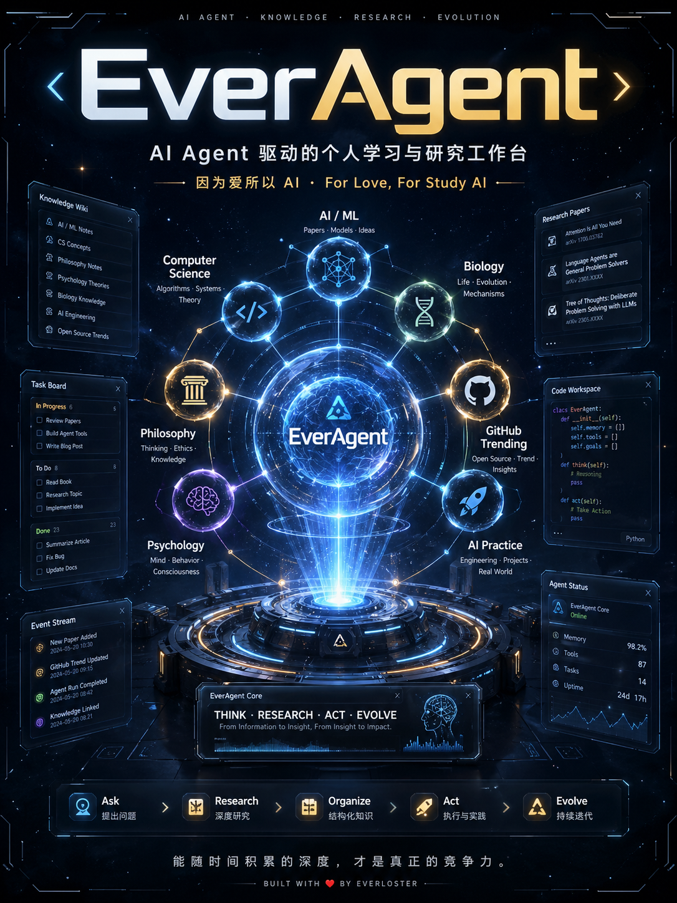

# 🧠 EverAgent — 个人学习与研究工作台

> 用 AI Agent 驱动的个人知识库：AI 帮我快速研究一个新领域/概念，产出高质量报告，我抽空阅读。
> 覆盖 AI 技术、计算机科学、哲学、心理学、生物学、ML 工程、播客与开源生态。

> **AI 使用本仓库？** → 先读 [AGENTS.md](./AGENTS.md) 与 [METHODOLOGY.md](./METHODOLOGY.md)，本文件供人类阅读。



---

## 五类项目

| 类 | 项目 | 工作模式 |
|----|------|---------|
| **A 知识研究** | ai / cs / philosophy / psychology / biology | 对话启发式学习，真读原文，产出高质量报告 |
| **B 代码实践** | ai-practice | 各类 AI 技术的低成本可运行 demo + 教学笔记 |
| **C 播客学习** | podcast-learning | 发链接 → 本地转写 → 润色 → 总结/讨论 → 报告 |
| **D 开源研究** | github-trending-analyzer | 发 repo 链接 → 输出/更新研究报告（自带脚本与协议） |
| **E 上网冲浪** | web-surfing | 发上网需求 → opencli 抓公开数据 → 清单/报告；沉淀站点技能 |

> 不属于以上 5 类的杂事（工具/一次性调研/流程），**按意图判定后直接在根目录处理**，不新建"杂物"项目；反复出现再升级为正式领域。搜索方法见 [docs/SEARCH.md](./docs/SEARCH.md)。

---

## 项目全景

> 下表由 `python3 scripts/reindex.py` 自动生成。

<!-- AUTO-OVERVIEW:START -->
| 项目 | 报告 | Wiki(概念/实体/综合) |
|------|------|----------------------|
| 🤖 [AI Learning](./ai-learning/) | 91 篇 | 42/28/1 |
| 💻 [CS Learning](./cs-learning/) | 33 篇 | 24/17/1 |
| 📚 [Philosophy Learning](./philosophy-learning/) | 21 篇 | 19/14/1 |
| 🧠 [Psychology Learning](./psychology-learning/) | 17 篇 | 13/13/0 |
| 🧬 [Biology Learning](./biology-learning/) | 17 篇 | 13/9/0 |
| ⚗️ [AI Practice](./ai-practice/) | 0 篇 | 9/1/0 |
| 🎙️ [Podcast Learning](./podcast-learning/) | 7 篇 | 24/18/0 |
<!-- AUTO-OVERVIEW:END -->

> 📖 抽空读报告？全部报告按更新时间索引 → [docs/REPORT_INDEX.md](./docs/REPORT_INDEX.md)（`reindex.py` 自动生成）

---

## 核心理念

这是一个**知识库**，不是任务管理系统。工作循环很简单：

```
我："帮我学 X"  →  AI 研究并归档  →  我抽空读报告  →  有新问题继续问  →  循环
```

三个支撑：

1. **方法论**（[METHODOLOGY.md](./METHODOLOGY.md)）— 先规定怎么读、怎么查、怎么验证，再谈输出。这是真正的核心：让 AI 真读原文、标注证据、不编造。
2. **知识层** — 每个领域的 `reports/`（我读的东西）+ `wiki/`（概念/实体/综合/未解问题的索引）。
3. **画像层** — 每个领域的 `PROFILE.md`（我会什么、偏好什么）+ `MAP.md`（覆盖与缺口），让 AI 不重复讲我会的、知道下一步学什么。

---

## 每个领域的结构

```
{domain}-learning/
├── AGENTS.md          # 领域边界 + 特化要求
├── PROFILE.md         # 学习者画像（兴趣/水平/偏好/追问队列）
├── MAP.md             # 领域地图（想覆盖什么、已覆盖什么、缺口）
├── reports/           # 报告产出
├── wiki/
│   ├── concepts/      # 核心概念页
│   ├── entities/      # 人物/机构/模型页
│   ├── syntheses/     # 跨报告综合理解
│   └── open-questions.md  # 未解问题池（持续学习的拉力）
└── skills/            # 领域特化研究模板
```

---

## 工具

```bash
python3 scripts/reindex.py                    # 刷新本 README 计数 + 重建 docs/REPORT_INDEX.md 阅读索引
python3 scripts/lint_evidence.py --domain ai-learning   # 证据密度自检（非阻塞）
python3 scripts/git_identity.py validate      # 提交身份校验
```

---

## 版本说明

EverAgent 2.0（知识优先架构）。早期的多 Agent 编排框架（任务状态机、项目锁、事件溯源、Dashboard、自进化引擎）已归档到 `legacy-v1-multiagent` 分支——单用户学习场景不需要那套机器。

---

*"能随算力扩展的通用方法，长期总是赢。" — Rich Sutton, The Bitter Lesson (2019)*

> 本仓库收录的学术论文 PDF 仅供个人学习使用，版权归原作者及出版机构所有。详见 [DISCLAIMER.md](./DISCLAIMER.md)。
