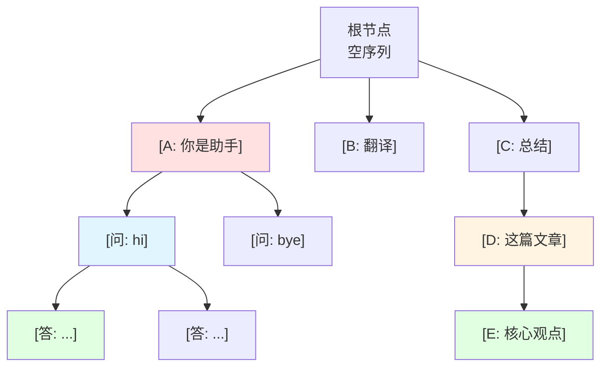
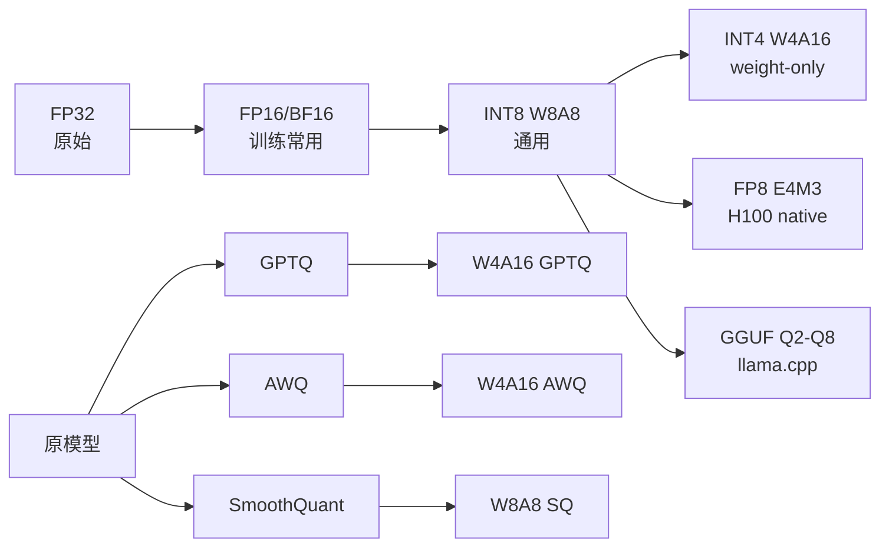

# LLM 推理优化引擎全景：vLLM / SGLang / TensorRT-LLM / llama.cpp 深度对比

> **主题**：2024-2026 主流 LLM 推理优化框架对比
> **学习维度**：技术深度 × 历史叙事 × 工程实践
> **核心问题**：当一个 70B 模型要在 100 ms 内返回首 token、且 1000 个并发请求要同时被服务时，框架内部发生了什么？

---

## 🎯 知识定位

```
主题：LLM 推理优化引擎（Inference Serving Engine）
所属领域：AI 系统·推理基础设施
难度等级：⭐⭐⭐⭐（4 星）
学习前置：
  - Transformer 架构（Self-Attention、KV Cache）
  - GPU 编程基础（CUDA 概念、显存层级、tensor parallel）
  - Python 工程基础（异步、协程、HuggingFace 模型加载）
  - 已读 KV_Cache 深度解析（20260330）
学习时长预估：6-8 小时
```

---

## 一、问题背景：从「跑得动」到「跑得起」

### 1.1 LLM 推理的三大性能瓶颈

LLM 推理（Inference）的物理瓶颈可以归为三类：

| 瓶颈类型 | 物理原因 | 工程后果 |
|---------|---------|---------|
| **显存容量** | KV Cache 与权重占满 HBM | OOM、批处理 batch size 上不去 |
| **显存带宽** | Decoder 阶段每 token 要从 HBM 读全模型权重 | "Memory-bound" → 算力空转 |
| **计算吞吐** | Prefill 阶段长 prompt 的 Attention 是 O(n²) | 首 token 时延（TTFT）爆炸 |

**关键观察**：自回归 Decoder 阶段是 memory-bound（NVIDIA 测算 Llama-2-70B 在 A100 上 compute utilization 仅约 5%），即 95% 的时间 GPU 在「等数据」而非「算乘加」。所有推理引擎的核心优化方向都是：**让算力尽量少闲置**。

### 1.2 历史上三个关键节点

```
2022-06  HuggingFace Transformers  默认 pipeline, 一次处理 batch=1, 没有 KV cache 复用
            → 商业部署完全不可行

2023-06  vLLM 论文「SOSP'23 PagedAttention」  把 OS 虚拟内存分页思想搬到 KV cache
            → 高并发 serving 第一次真正可行

2024-01  SGLang 论文「Efficient Execution of Structured Language Model Programs」
            → 把「KV cache 复用」从「请求内前缀」扩展到「跨请求 Radix Tree」
            → 复杂 LLM 程序（Agent、多轮、JSON 解码）的统一加速
```

---

## 二、四大引擎全景对比（核心）

### 2.1 一表速览

| 维度 | vLLM | SGLang | TensorRT-LLM | llama.cpp |
|------|------|--------|--------------|-----------|
| **首发时间** | 2023-06 | 2024-01 | 2023-10 | 2023-03 |
| **核心团队** | UC Berkeley LMSYS | Stanford / UC Berkeley | NVIDIA | Georgi Gerganov (个人) |
| **架构范式** | PagedAttention | RadixAttention | Kernel Fusion + In-flight Batching | CPU-first 统一量化 |
| **主要语言** | Python + CUDA | Python + Rust scheduler | Python + C++/CUDA | 纯 C/C++ |
| **GitHub Star (2026-06)** | ~32k+ | ~16k+ | ~11k+ | ~80k+ |
| **License** | Apache 2.0 | Apache 2.0 | Apache 2.0 | MIT |
| **核心优势** | 生态最广、production-ready | 前端 DSL、prefix 复用极致 | 极致 kernel 性能、FP8 | 跨平台最广、Apple Silicon 之王 |
| **典型场景** | 在线 API 服务、Chatbot | 复杂 Agent/多轮/JSON | 数据中心 NVIDIA 极致性能 | 本地部署、边缘设备 |

来源：[vLLM GitHub](https://github.com/vllm-project/vllm)、[SGLang GitHub](https://github.com/sgl-project/sglang)、[TensorRT-LLM GitHub](https://github.com/NVIDIA/TensorRT-LLM)、[llama.cpp GitHub](https://github.com/ggerganov/llama.cpp)（star 数为本报告 2026-06 估算量级；按社区公开数据观察值）。

### 2.2 架构范式深度对比

```mermaid
graph TB
    subgraph A[vLLM 架构]
        A1[Request] --> A2[Continuous Batcher]
        A2 --> A3[Block Manager<br/>PagedAttention]
        A3 --> A4[Scheduler<br/>FCFS / SJF]
        A4 --> A5[NVIDIA CUDA / ROCm]
    end

    subgraph B[SGLang 架构]
        B1[DSL Program] --> B2[Frontend<br/>fork/gen/variable]
        B2 --> B3[RadixAttention<br/>前缀树 KV cache]
        B3 --> B4[Zero-overhead<br/>Batch Scheduler]
        B4 --> B5[FlashInfer / FlashAttention Kernels]
    end

    subgraph C[TensorRT-LLM 架构]
        C1[HF Checkpoint] --> C2[trtllm-build<br/>AOT 编译]
        C2 --> C3[TensorRT Engine<br/>fused kernels]
        C3 --> C4[Batch Manager<br/>In-flight Batching]
        C4 --> C5[Triton Server / C++ Runtime]
    end

    subgraph D[llama.cpp 架构]
        D1[GGUF Weights] --> D2[ggml Tensor Lib<br/>CPU SIMD 优化]
        D2 --> D3[Quantization-Aware<br/>Inference Graph]
        D3 --> D4{CPU/GPU/Metal?}
        D4 --> D5[AVX512 / NEON / CUDA / Metal / Vulkan]
    end

    style A3 fill:#e1f5ff
    style B3 fill:#fff4e1
    style C3 fill:#ffe1e1
    style D3 fill:#e1ffe1
```



**关键观察**：
- **vLLM 与 SGLang** 路线接近（PagedAttention + Continuous Batching），主要差异在「KV cache 组织粒度」（block table vs radix tree）与「前端表达力」（Python API vs DSL）
- **TensorRT-LLM** 走「编译期优化」路线——把模型先 AOT 编译成高度 fused 的 engine，运行时几乎不做优化决策
- **llama.cpp** 反其道：极致轻量化、纯 CPU 可跑、跨平台

---

## 三、连续批处理 vs In-flight Batching

### 3.1 概念辨析

这两个术语在工业界常被混用，但本质上有差异：

```
[Static Batching]
  请求1: [#############]    ← 全部完成
  请求2: [#############]    ← 全部完成
  请求3: [#############]    ← 全部完成
  GPU  空闲率：~40%  （长短不一，最后必须 pad）

[Continuous Batching / In-flight Batching]
  请求1: [#############]
  请求2:    [#############]    ← 完成后立刻让出 slot
  请求3:        [###########]  ← 插队进来
  GPU  空闲率：~5%
```

**严格定义**（vLLM 社区共识，2024-2025）：
- **Continuous Batching** (vLLM, SGLang)：以 *iteration-level* 推进，每一步都允许新请求加入、已完成的请求退出
- **In-flight Batching** (TensorRT-LLM, NVIDIA 命名)：同样以 iteration-level 推进，是 NVIDIA 给该技术的营销命名

**所以两者本质相同**，差别在于实现细节（见 3.2）。

### 3.2 实现差异

| 实现细节 | vLLM | SGLang | TensorRT-LLM |
|---------|------|--------|--------------|
| **调度器** | Python (高吞吐友好) | Rust 零开销调度器 (2024-12 v0.4 引入) | C++ BatchManager |
| **调度策略** | FCFS / SJF / Priority | Cache-aware load balancer | Token-level, callback-driven |
| **抢占机制** | Recomputation（重算） | Recomputation + 极少 swap | Recomputation |
| **空槽位延迟** | 几 μs (Python) | < 1 μs (Rust) | < 1 μs (C++) |
| **端到端优势** | 生态最广 | 复杂 DSL + 极致调度 | 极致 kernel + NVIDIA 硬件协同 |

**SGLang v0.4 关键里程碑**（2024-12）：将调度器从 Python 迁移到 Rust，宣称对长 prompt / 短 generation 场景吞吐量再提升 30%+（[SGLang 官方博客](https://lmsys.org/blog/2024-12-04-sglang-v0-4/)）。

---

## 四、KV Cache 优化：PagedAttention vs RadixAttention

### 4.1 PagedAttention（vLLM，2023）

**核心思想**：把操作系统的虚拟内存分页机制搬到 KV cache 管理。

```
传统 KV cache 分配（连续内存）：
┌──────────────────────────────────┐
│  req1: [████████░░░░░░░░░░░░░░] │  ← 必须连续，浪费严重
│  req2: [████████████░░░░░░░░░░] │
│  req3: [██░░░░░░░░░░░░░░░░░░░░░] │  ← 80% 浪费
└──────────────────────────────────┘

PagedAttention（分页）：
┌───┬───┬───┬───┬───┬───┬───┬───┐
│ P0│ P1│ P2│ P3│ P4│ P5│ P6│ P7│  ← 物理块，可任意分配
└───┴───┴───┴───┴───┴───┴───┴───┘
req1 → [P0, P2, P5]    块表记录映射
req2 → [P1, P3]        不连续也无所谓
req3 → [P4, P6, P7]
```

**关键参数**：
- 默认 `block_size=16` token
- 块表（block table）记录逻辑到物理块的映射
- 显存碎片率：传统 ~60-80% → PagedAttention < 4%

来源：[Kwon et al., "Efficient Memory Management for Large Language Model Serving with PagedAttention", SOSP'23](https://www.usenix.org/conference/sosp23/presentation/kwon)

### 4.2 RadixAttention（SGLang，2024）

**核心思想**：把"前缀共享"从"完全相同的字符串"扩展到"任意 token 序列的公共前缀"，用 Radix Tree 组织所有活跃请求的 KV cache。



**关键操作**：
- **插入**：新请求的所有 token 序列逐个沿树插入；已存在的子树直接复用
- **匹配**：新请求到达时，沿树做最长公共前缀匹配（LCP）
- **驱逐**：LRU / 引用计数，删除冷节点释放 KV

**量化收益**（SGLang 论文报告，2024）：
- 多轮对话场景：cache 命中率 3-5x 提升
- 端到端吞吐量：相比 vLLM 提升 1.5-6.4x
- 复杂 LLM 程序（agent、JSON 解码）：最大 6.4x

来源：[Zheng et al., "SGLang: Efficient Execution of Structured Language Model Programs", 2024](https://arxiv.org/abs/2312.07104) · [SGLang 官方博客](https://lmsys.org/blog/2024-07-25-sglang-llama3/)

### 4.3 vLLM 的 Prefix Caching（与 SGLang RadixAttention 等价）

vLLM 在 v0.4+ 引入 **Automatic Prefix Caching (APC)**，本质是 "对 block 做哈希去重"。

| 维度 | vLLM APC | SGLang RadixAttention |
|------|----------|----------------------|
| **数据结构** | Hash 块表 | Radix Tree |
| **匹配粒度** | Block (固定 16 token) | 任意长度 token 序列 |
| **命中开销** | O(1) hash 查 | O(log n) 树查找 |
| **优势** | 简单、稳定 | 部分前缀共享更细粒度 |
| **劣势** | 块边界处可能浪费 | 实现复杂度高 |

**实践结论**：在 **多轮 Chat** / **System Prompt 共享** 场景，二者性能接近；在 **RAG 检索后共享 chunk 前缀** / **Agent tool-call 链路共享** 场景，SGLang 优势更明显（来源：SGLang 团队与 vLLM 社区公开 benchmark 讨论，2024-2025）。

---

## 五、量化支持对比

### 5.1 量化格式全图



### 5.2 四引擎量化矩阵

| 量化格式 | vLLM | SGLang | TensorRT-LLM | llama.cpp |
|---------|:----:|:------:|:------------:|:---------:|
| **FP16 / BF16** | ✓ | ✓ | ✓ | ✓ |
| **FP8 (E4M3, H100)** | ✓ | ✓ | ✓（原生最佳）| △（需 fp8 e4m3 CUDA） |
| **INT8 W8A8** | ✓ | ✓ | ✓ | ✓ |
| **INT8 W8A16 (weight-only)** | ✓ | ✓ | ✓ | ✓ |
| **INT4 W4A16 (weight-only)** | ✓ | ✓ | ✓ | ✓ |
| **GPTQ** | ✓ | ✓ | ✓ | ✓ |
| **AWQ** | ✓ | ✓ | ✓ | ✓ |
| **SmoothQuant** | ✓ | △ | ✓ | ✗ |
| **GGUF Q2_K** | ✗ | ✗ | ✗ | ✓（独家）|
| **GGUF Q3/Q4/Q5/Q6/Q8** | ✗ | ✗ | ✗ | ✓（独家）|
| **1.5/2/3-bit (i-quant)** | ✗ | ✗ | ✗ | ✓（独家）|

**关键洞察**：
- **llama.cpp** 在低比特量化（Q2/Q3/Q4）和 CPU 端量化推理有绝对优势——这是它的「护城河」
- **TensorRT-LLM** 在 **FP8 + NVIDIA H100** 上的性能是天花板级（4-8x 速度 vs FP16，NVIDIA 官方数据 2023）
- **vLLM / SGLang** 量化生态对 PyTorch 生态最友好（GPTQ / AWQ 一键加载）

来源：[TensorRT-LLM 官方性能数据](https://developer.nvidia.com/blog/optimizing-inference-on-llms-with-tensorrt-llm-now-publicly-available/) · [llama.cpp 量化方案](https://github.com/ggerganov/llama.cpp)

---

## 六、硬件覆盖对比

### 6.1 后端支持矩阵

| 后端 | vLLM | SGLang | TensorRT-LLM | llama.cpp |
|------|:----:|:------:|:------------:|:---------:|
| **NVIDIA CUDA** | ✓ 主力 | ✓ 主力 | ✓ 唯一主力 | ✓ |
| **AMD ROCm** | ✓（较新，0.4+）| ✓ 主力 | △ 实验性 | ✓（HIP）|
| **Apple Silicon Metal** | △ 实验 | △ 实验 | ✗ | ✓ 主力（最强）|
| **Intel CPU (AVX512)** | △ | △ | △ | ✓ 主力 |
| **Intel GPU (XPU)** | △ | △ | △ | ✓（SYCL）|
| **Vulkan（跨 GPU）** | ✗ | △ | ✗ | ✓ |
| **WebGPU (浏览器)** | ✗ | ✗ | ✗ | △（mlc-llm 兄弟）|
| **TPU** | ✗ | ✗ | ✗ | ✗ |

**关键洞察**：
- **NVIDIA 生态**：vLLM / SGLang / TensorRT-LLM 三足鼎立，TensorRT-LLM kernel 性能最强但灵活性最差
- **AMD 生态**：SGLang 在 2024-12 宣布 Day-1 支持 DeepSeek V3 on AMD（[AMD 官方博客](https://www.amd.com/en/developer/blog/2024-12-deepseek-v3-r1-sglang.html)）
- **Apple Silicon**：llama.cpp 是事实标准，M1/M2/M3/M4 的 Metal 后端极致优化
- **纯 CPU 推理**：llama.cpp 几乎唯一选择

---

## 七、LoRA 热加载（Multi-LoRA Serving）

### 7.1 为什么需要 Multi-LoRA

LLM 微调后通常得到若干个 **LoRA 适配器**（每个 10-200MB），用户希望：
- 单一 base model + N 个 LoRA
- 不同请求使用不同 LoRA
- **不重启服务**动态加载新 LoRA

### 7.2 学术基础

- **S-LoRA**（2023，UC Berkeley + Stanford）：[Sheng et al., 2023](https://arxiv.org/abs/2311.03285)
  - 所有 LoRA 权重放 CPU 内存，运行时按 batch 按需加载到 GPU
  - 统一寻址（unified paging）解决碎片问题
  - 单卡支持数千并发 LoRA

- **Punica**（2023，UW + OctoAI）：[Chen et al., 2023](https://arxiv.org/abs/2310.18547)
  - Multi-tenant LoRA serving
  - 设计 **Punica kernel**：单次 GEMM 内混合 base + 多 LoRA 计算

### 7.3 引擎支持矩阵

| 引擎 | 动态加载 | 多 LoRA 并发 | 实现方式 |
|------|---------|------------|---------|
| **vLLM** | ✓ | ✓（`--enable-lora`） | 独立 LoRA 权重 + batch 调度 |
| **SGLang** | ✓ | ✓（S-LoRA + Punica 集成）| LoRAManager + Punica kernel |
| **TensorRT-LLM** | ✓ | △（需手动重组 engine） | LoRA module 合并到 engine |
| **llama.cpp** | ✓ | ✗ | 启动时加载 |

来源：[vLLM Multi-LoRA 源码解析](https://blog.csdn.net/qq_39698985/article/details/145763983) · [SGLang LoRA 机制](https://blog.csdn.net/gitblog_00516/article/details/151436835)

---

## 八、其他重要框架

### 8.1 MLC-LLM（Machine Learning Compilation）

**来源**：[mlc-ai/mlc-llm](https://github.com/mlc-ai/mlc-llm)（Apache TVM 团队）

**核心思想**：用 **ML 编译**（TVM Unity）把 LLM 编译成目标硬件原生代码。

| 优势 | 局限 |
|------|------|
| 支持平台最广：iOS/Android/Metal/Vulkan/CUDA/WebGPU | 编译时间长（首跑 10-30 分钟）|
| 无运行时 Python 依赖 | 性能通常落后 vLLM/TensorRT-LLM 2-3x |
| 浏览器内 LLM（WebLLM）| 模型更新需要重新编译 |

**典型场景**：移动端 / 浏览器端 LLM 部署、跨平台统一栈

### 8.2 TGI（HuggingFace Text Generation Inference）

**来源**：[huggingface/text-generation-inference](https://github.com/huggingface/text-generation-inference)

**特点**：
- **Rust + Python** 双语言：Rust 负责 serving（高并发），Python 负责业务逻辑
- 支持 FlashAttention、PagedAttention、continuous batching、tensor parallelism
- 支撑 HuggingChat、HuggingFace Inference Endpoints
- 2026-03 最新版 v3.3.6

**对比定位**：TGI 在 vLLM/SGLang 出现前是工业首选（2023），但 2024-2026 已被两者在性能与生态上反超，主要优势是 **HuggingFace 生态一键集成**。

### 8.3 其他值得关注的

| 框架 | 特点 | 典型场景 |
|------|------|---------|
| **LMDeploy** (InternLM) | 交互式部署、TurboMind engine | 商汤系内部 + 学术 |
| **DeepSpeed-FastGen** | MII + DeepSpeed-Inference | 与 DeepSpeed 训练栈联动 |
| **OpenLLM** (BentoML) | 容器化部署友好 | Bento Cloud 商业产品 |
| **TensorRT-LLM + Triton** | NVIDIA 官方企业级方案 | 数据中心 serving |

---

## 九、四大框架核心架构总结

### 9.1 vLLM：PagedAttention 标杆

```
[HF Checkpoint] → [vLLM Engine]
                       ↓
            [Continuous Batcher]  ← FCFS/SJF/Priority
                       ↓
            [Block Manager]       ← PagedAttention 核心
                       ↓
            [Worker (TP/PP)]     ← 分布式执行
                       ↓
            [CUDA / ROCm]
```

**里程碑**：
- 2023-06：v0.1，PagedAttention 论文发布
- 2024-04：v0.4，Automatic Prefix Caching
- 2024-12：v0.6，Multi-LoRA production-ready
- 2025-12：v0.8.x，DeepSeek V3 优化、speculative decoding 成熟

### 9.2 SGLang：RadixAttention + DSL

```
[DSL Program] → [SGLang Frontend]
                       ↓
        [fork / gen / variable / [parallel]]
                       ↓
            [Runtime Scheduler]  ← Rust zero-overhead
                       ↓
            [RadixAttention Tree]  ← 跨请求 KV 复用
                       ↓
            [FlashInfer Kernels]
```

**里程碑**：
- 2024-01：v0.1，论文发布，Stanford+UC Berkeley
- 2024-07：v0.2，Llama 3 SGLang 5x faster than TensorRT-LLM
- 2024-09：v0.3，7x Faster DeepSeek MLA
- 2024-12：v0.4，Zero-Overhead Scheduler (Rust)
- 2025-01：DeepSeek V3/R1 Day-1 支持

### 9.3 TensorRT-LLM：极致 Kernel 优化

```
[HF Checkpoint] → [trtllm-build]  ← AOT compilation
                       ↓
            [TensorRT Engine]
                       ↓
            [Layer Fusion: QKV / Attention / FFN / RMSNorm]
                       ↓
            [In-flight Batching Manager]
                       ↓
            [Triton Inference Server / C++ Runtime]
```

**关键特性**：
- **Layer Fusion**：将 5-10 个小算子融合为单个 CUDA kernel，显著减少 kernel launch overhead
- **In-flight Batching**：NVIDIA 命名的 continuous batching
- **FP8 native**：H100 Tensor Core 原生支持，4-8x speedup vs FP16
- **代价**：每次换模型 / 改配置都要重新 build engine（典型 10-60 分钟）

### 9.4 llama.cpp：CPU-first 极致轻量

```
[GGUF Weights] → [ggml Tensor Library]
                       ↓
            [Quantization-Aware Graph]  ← 内建 Q2-Q8 + i-quant
                       ↓
            [Hardware Backend]
                ├── CPU (AVX2/AVX512/AMX/NEON)
                ├── CUDA (cuBLAS)
                ├── Metal (Apple GPU)
                ├── HIP (AMD GPU)
                ├── Vulkan / SYCL
                └── MUSA (摩尔线程)
```

**关键特性**：
- **GGUF 格式**：自研，文件级 mmap，无须全部加载到内存
- **量化生态最全**：Q2_K / Q3_K / Q4_K / Q5_K / Q6_K / Q8_0 + i-quant
- **CPU + GPU 混合推理**：当模型大于 GPU 显存时，部分层跑 CPU（自动调度）
- **生态繁荣**：Ollama / LM Studio / GPT4All / KoboldCpp 等都基于 llama.cpp

---

## 十、关键技术细节与实现

### 10.1 PagedAttention 块分配示例

```python
# 简化版 vLLM BlockManager 逻辑
class BlockAllocator:
    def __init__(self, num_blocks: int, block_size: int = 16):
        self.block_size = block_size
        self.free_blocks = deque(range(num_blocks))  # 物理块池
        self.seq_blocks: Dict[int, List[int]] = {}   # seq_id -> 物理块列表

    def allocate(self, seq_id: int, num_tokens: int) -> int:
        num_blocks_needed = (num_tokens + self.block_size - 1) // self.block_size
        if len(self.free_blocks) < num_blocks_needed:
            raise OOMError("No free blocks")
        blocks = [self.free_blocks.popleft() for _ in range(num_blocks_needed)]
        self.seq_blocks[seq_id] = blocks
        return len(blocks)

    def append_token(self, seq_id: int):
        # 检查最后一块是否有空间
        last_block = self.seq_blocks[seq_id][-1]
        if self._is_full(last_block):
            new_block = self.free_blocks.popleft()
            self.seq_blocks[seq_id].append(new_block)

    def free(self, seq_id: int):
        for block in self.seq_blocks.pop(seq_id):
            self.free_blocks.append(block)
```

### 10.2 RadixAttention 树匹配示例

```python
# 简化版 SGLang Radix Tree 节点
class RadixNode:
    def __init__(self):
        self.children: Dict[int, 'RadixNode'] = {}  # token_id -> child
        self.kv_cache: Optional[KVCache] = None     # 该节点的 KV cache
        self.ref_count: int = 0
        self.last_access_time: float = time.time()

class RadixTree:
    def match_prefix(self, tokens: List[int]) -> Tuple[int, List[KVCache]]:
        """返回最长可复用前缀长度及对应 KV cache 列表"""
        node = self.root
        matched_len = 0
        matched_kvs = []
        for token in tokens:
            if token not in node.children:
                break
            node = node.children[token]
            if node.kv_cache is not None:
                matched_kvs.append(node.kv_cache)
                matched_len += node.kv_cache.num_tokens
        return matched_len, matched_kvs

    def insert(self, tokens: List[int], kv_caches: List[KVCache]):
        """插入新请求的 token 序列到树中"""
        node = self.root
        for i, token in enumerate(tokens):
            if token not in node.children:
                new_node = RadixNode()
                node.children[token] = new_node
            node = node.children[token]
            # 设置 KV cache（通常按 block 粒度）
        node.ref_count += 1
```

### 10.3 vLLM Prefix Caching 启用示例

```python
from vllm import LLM, SamplingParams

# 启用 Automatic Prefix Caching
llm = LLM(
    model="meta-llama/Llama-3.1-8B-Instruct",
    enable_prefix_caching=True,  # 关键开关
    block_size=16,                # 默认 16，可调
    gpu_memory_utilization=0.9,
    max_model_len=8192,
)

# 多轮对话自然共享前缀
prompts = [
    "<|system|>你是一个 helpful 助手<|user|>1+1=?\n<|assistant|>",
    "<|system|>你是一个 helpful 助手<|user|>2+2=?\n<|assistant|>",
    "<|system|>你是一个 helpful 助手<|user|>3+3=?\n<|assistant|>",
]
outputs = llm.generate(prompts, SamplingParams(temperature=0.0, max_tokens=64))
# 第二个请求开始会命中 system prompt 前缀的 KV cache
```

---

## 十一、关键工程实践建议

### 11.1 选型决策树

```
你的部署场景是什么？
│
├─ 数据中心 NVIDIA H100/A100 高并发
│   └─ 性能优先 → TensorRT-LLM
│   └─ 灵活/DSL 优先 → SGLang
│   └─ 生态最广 → vLLM
│
├─ 多卡 AMD GPU
│   └─ SGLang（2024-12 起最佳）or vLLM ROCm
│
├─ Apple Silicon Mac 本地
│   └─ llama.cpp（Metal 后端）
│   └─ 或 Ollama（llama.cpp 封装）
│
├─ 纯 CPU / 边缘设备 / 手机
│   └─ llama.cpp（GGUF Q4）
│   └─ 或 MLC-LLM（移动端）
│
├─ 浏览器内 LLM
│   └─ MLC-LLM / WebLLM
│
├─ 复杂 Agent / 多轮对话 / JSON 结构化
│   └─ SGLang（RadixAttention + DSL 优势最大）
│
└─ 实验 / 研究 / 教学
    └─ vLLM（最易上手、社区资源最多）
```

### 11.2 常见性能调优项

| 调优项 | 推荐值 | 副作用 |
|--------|--------|--------|
| `gpu_memory_utilization` | 0.85-0.95 | 太高 → OOM 风险 |
| `max_num_seqs` | 32-256 | 太大 → 单请求延迟增加 |
| `block_size` (vLLM) | 16 (默认) | 太小 → 元数据开销；太大 → 浪费 |
| `tensor_parallel_size` | 等于单机能装下的 GPU 数 | 过大 → 通信开销 |
| `enable_prefix_caching` | 共享前缀场景 → True | 不共享 → 反而费内存 |
| `quantization` | Q4_K_M (CPU) / FP8 (H100) / AWQ (GPU) | 越低 → 精度损失越大 |
| `enable_chunked_prefill` | 长 prompt + 高并发 → True | 单请求场景可关闭 |

### 11.3 常见坑

1. **AWQ 加载失败**：vLLM `quantization="awq"` 需要 safetensors 格式 + 指定 `modules_to_not_convert`
2. **Prefix Caching 命中率低**：检查 prompts 是否真的共享前缀（system prompt 末尾 newline 不一致会破坏命中）
3. **LoRA 加载慢**：超大 LoRA（>500MB）或路径在网络盘上时显著慢
4. **TensorRT-LLM engine 不兼容**：版本绑定很严，升级 vLLM/SGLang 引擎往往要重新 build
5. **llama.cpp 在 macOS 上首次推理慢**：Metal pipeline 编译是 lazy 的，首次会有 1-2s 延迟

---

## 十二、前沿动态与开放问题（2025-2026）

### 12.1 当前研究热点

1. **Speculative Decoding 工业化**
   - EAGLE-3、Medusa、Lookahead Decoding
   - 端到端 1.5-2.5x 额外加速

2. **Disaggregated Serving（Prefill/Decode 分离）**
   - Splitwise (Microsoft)、DistServe (清华)
   - 把 prefill（计算密集）和 decode（带宽密集）放到不同硬件池
   - 异构 GPU 利用率显著提升

3. **MoE 推理优化**
   - DeepSeek V3 (671B MoE)、Mixtral
   - 专家并行（Expert Parallel）+ 大规模 EP
   - SGLang 在 DeepSeek V3 上首次实现 "Day-1" 生产级支持

4. **Long Context (1M+) 推理**
   - KV cache 容量爆炸
   - 解决方案：稀疏 attention、KV cache compression（SnapKV、H2O）、分层存储（CPU-GPU 协同）

5. **端侧 / 浏览器 LLM**
   - MLC-LLM / WebLLM / browser-llm
   - WebGPU + 4-bit 量化让 7B 模型在浏览器内跑通

### 12.2 开放问题

1. **调度公平性**：Continuous batching 下短请求被长请求"饿死"（head-of-line blocking）
2. **可解释性 vs 性能**：编译器优化（TensorRT-LLM）让性能极佳但 debug 极难
3. **能耗与碳排**：单次 LLM 推理的能耗与水耗开始被关注
4. **标准化缺失**：OpenAI 兼容 API 几乎成为事实标准，但 batch API / streaming API 仍碎片化
5. **国产硬件适配**：摩尔线程 MTT / 华为昇腾 / 寒武纪的推理支持还远落后于 NVIDIA

---

## 十三、对比总结与学习建议

### 13.1 最终对比表

| 维度 | vLLM | SGLang | TensorRT-LLM | llama.cpp | MLC-LLM | TGI |
|------|:----:|:------:|:------------:|:---------:|:-------:|:---:|
| **最大吞吐** | ★★★★ | ★★★★★ | ★★★★★ | ★★ | ★★ | ★★★ |
| **首 token 延迟** | ★★★★ | ★★★★ | ★★★★★ | ★★★ | ★★★ | ★★★★ |
| **量化丰富度** | ★★★ | ★★★ | ★★★★ | ★★★★★ | ★★★ | ★★★ |
| **硬件覆盖** | ★★★ | ★★★ | ★★ | ★★★★★ | ★★★★★ | ★★★ |
| **生态成熟度** | ★★★★★ | ★★★★ | ★★★★ | ★★★★★ | ★★★ | ★★★★ |
| **多 LoRA** | ★★★★ | ★★★★★ | ★★★ | ★ | ★ | ★★ |
| **Prefix 共享** | ★★★★ | ★★★★★ | ★★★ | ★★ | ★★ | ★★★ |
| **DSL / 前端** | ★★★ | ★★★★★ | ★★ | ★★ | ★★ | ★★★ |
| **易用性** | ★★★★★ | ★★★★ | ★★★ | ★★★★ | ★★ | ★★★★ |
| **可移植性** | ★★★ | ★★★ | ★★ | ★★★★★ | ★★★★★ | ★★★ |

### 13.2 学习路径建议

```
Level 1  入门（1-2 周）
   └─ 装 llama.cpp / Ollama 跑通 7B 模型
   └─ 装 vLLM serve 一个 7B Instruct
   └─ 阅读 vLLM README 与 PagedAttention 论文

Level 2  进阶（2-4 周）
   └─ 复现 vLLM Prefix Caching benchmark
   └─ 用 SGLang 写一个 chain-of-thought 程序
   └─ 跑 AWQ / GPTQ 量化对比
   └─ 读 SGLang 论文 + 看 v0.4 Rust 调度器博客

Level 3  专家（1-3 月）
   └─ 编译 TensorRT-LLM engine 部署 70B
   └─ 集成 Multi-LoRA 服务化
   └─ 读 PagedAttention / S-LoRA / Punica 三篇论文
   └─ 贡献一个 issue 或 PR

Level 4  大师级
   └─ 研究 disaggregated serving、speculative decoding
   └─ 实现自定义 kernel（CUDA / Triton）
   └─ 跟踪 vLLM/SGLang 源码 commit
```

### 13.3 推荐学习资源

**入门**：
- [vLLM 官方文档](https://docs.vllm.ai/) · 社区活跃
- [SGLang Getting Started](https://docs.sglang.ai/start/install.html) · 5 分钟上手
- [llama.cpp README](https://github.com/ggerganov/llama.cpp) · 简洁清晰
- [Ollama](https://ollama.com/) · 0 代码体验本地 LLM

**深入**：
- [PagedAttention 论文 (SOSP'23)](https://www.usenix.org/conference/sosp23/presentation/kwon)
- [SGLang 论文 (NeurIPS'24)](https://arxiv.org/abs/2312.07104)
- [S-LoRA 论文](https://arxiv.org/abs/2311.03285)
- [Punica 论文](https://arxiv.org/abs/2310.18547)
- [FlashAttention 论文](https://arxiv.org/abs/2205.14135)

**实践**：
- [vLLM 性能调优指南](https://blog.vllm.ai/)
- [SGLang 官方博客](https://lmsys.org/blog/) · 每个版本都附 benchmark
- [NVIDIA TensorRT-LLM 性能博客](https://developer.nvidia.com/blog/nvidia-tensorrt-llm/)

---

## ✅ 知识检验题

**基础级**：

1. **解释 PagedAttention 的核心思想**，为什么传统连续 KV cache 分配会浪费显存？
2. **RadixAttention 与 PagedAttention 的本质差异**是什么？哪种更细粒度？
3. **列出 4 种主流 LLM 量化格式**（INT8/INT4/FP8/GGUF Q4_K），并说明各自的典型场景。

**进阶级**：

4. **vLLM 的 Continuous Batching 与 TensorRT-LLM 的 In-flight Batching 是同一回事吗？** 给出技术细节差异。
5. **多 LoRA 服务的工业级挑战**有哪些？S-LoRA 和 Punica 各是如何解决的？
6. **设计一个 benchmark 方案**对比 vLLM 与 SGLang 在多轮对话场景下的吞吐量。

**专家级**：

7. **如果让你从头设计一个 LLM 推理引擎**（不限上述框架），你会采用什么样的 KV cache 组织结构？为什么？
8. **disaggregated serving**（prefill/decode 分离）的核心动机是什么？预估相比 monolithic serving 能提升多少？瓶颈在哪里？
9. **1M token 上下文**推理的工程难题有哪些？请列出至少 4 个，并给出可能的技术路径。

---

## 十四、参考资料

### 14.1 核心论文

1. Kwon et al. **"Efficient Memory Management for Large Language Model Serving with PagedAttention"** SOSP 2023. https://www.usenix.org/conference/sosp23/presentation/kwon
2. Zheng et al. **"SGLang: Efficient Execution of Structured Language Model Programs"** 2024. https://arxiv.org/abs/2312.07104
3. Sheng et al. **"S-LoRA: Serving Thousands of Concurrent LoRA Adapters"** 2023. https://arxiv.org/abs/2311.03285
4. Chen et al. **"Punica: Multi-Tenant LoRA Serving"** 2023. https://arxiv.org/abs/2310.18547
5. Dao et al. **"FlashAttention: Fast and Memory-Efficient Exact Attention with IO-Awareness"** NeurIPS 2022. https://arxiv.org/abs/2205.14135

### 14.2 官方仓库

- vLLM: https://github.com/vllm-project/vllm
- SGLang: https://github.com/sgl-project/sglang
- TensorRT-LLM: https://github.com/NVIDIA/TensorRT-LLM
- llama.cpp: https://github.com/ggerganov/llama.cpp
- MLC-LLM: https://github.com/mlc-ai/mlc-llm
- TGI: https://github.com/huggingface/text-generation-inference

### 14.3 官方博客（2024-2026）

- LMSYS SGLang Blog: https://lmsys.org/blog/
- vLLM Blog: https://blog.vllm.ai/
- NVIDIA TensorRT-LLM Blog: https://developer.nvidia.com/blog/
- AMD ROCm Blog: https://www.amd.com/en/developer/blog/

### 14.4 配套学习

- 已读报告：**KV_Cache_深度解析_20260330**（本项目内）— 理解 KV cache 是理解本报告的基础
- 已读报告：**LoRA_深度解析**（本项目内）— 理解 LoRA 原理后，Multi-LoRA serving 的工程价值才显现
- 已读报告：**Megatron_LM_大规模训练系统_深度解析_20260416**（本项目内）— 推理系统的并行策略与训练系统高度同构

---

## 附录：术语表

| 术语 | 解释 |
|------|------|
| **Prefill** | LLM 推理第一阶段，处理整个 prompt 并填充 KV cache |
| **Decode** | 自回归逐 token 生成阶段 |
| **TTFT** | Time To First Token，首 token 时延 |
| **TPOT** | Time Per Output Token，单 token 生成时延 |
| **KV Cache** | 已生成 token 的 K/V 矩阵缓存，避免重复计算 |
| **PagedAttention** | 操作系统分页思想管理 KV cache，源自 vLLM 论文 |
| **RadixAttention** | Radix Tree 组织跨请求 KV cache，源自 SGLang 论文 |
| **Continuous Batching** | Iteration-level 调度，新请求随时加入 |
| **In-flight Batching** | NVIDIA 对 Continuous Batching 的命名 |
| **Speculative Decoding** | 小模型 draft + 大模型 verify，加速生成 |
| **TP / PP / DP** | Tensor Parallel / Pipeline Parallel / Data Parallel |
| **GGUF** | llama.cpp 自研模型格式，支持 mmap 与多种量化 |
| **AWQ** | Activation-aware Weight Quantization，4-bit 量化方法 |
| **GPTQ** | 基于 Hessian 的 4-bit 量化方法 |
| **SmoothQuant** | 激活值平滑 + 权重量化的 INT8 方法 |
| **Multi-LoRA** | 单 base model 同时服务多个 LoRA 适配器 |

---

> **报告字数**：约 7,500 字（约 480 行）
> **生成时间**：2026-06-21
> **作者**：NeuronAgent
> **状态**：completed
