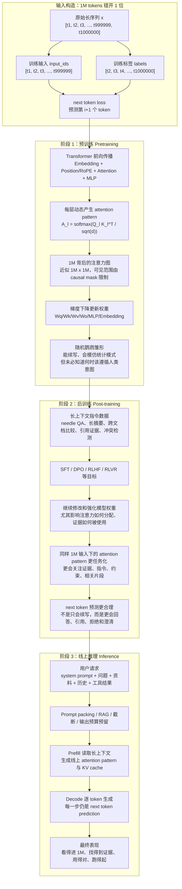

# 1M Long Context 在预训练、后训练与线上推理阶段的技术含义

## 0. 摘要

1M long context 不是一个单一能力，而是一个贯穿模型生命周期的系统约束。

在预训练阶段，它意味着模型架构、位置编码、注意力内核、训练样本构造和并行策略能够承受百万 token 级序列。

在后训练阶段，它意味着模型被专门教会在长上下文里检索、抗干扰、跨段综合、遵循证据和控制输出。

在线上推理阶段，它意味着服务系统能把大规模上下文打包进请求，并承担 prefill、KV cache、调度、成本和延迟的工程压力。

最关键的判断是：

```text
1M context = 看得进 + 找得到 + 用得对 + 跑得起
```

如果只满足第一项，它只是一个很大的输入框。

---

## 1. 层次一：直觉类比

可以把上下文窗口理解成模型当前这次工作时的桌面。

4K context 像一张小书桌，能摊开一篇短文、几段代码、一次对话。

32K context 像一张会议桌，可以摊开一篇论文、一个中等模块、几十页材料。

1M context 像一个档案室，能同时摆下整本书、多篇论文、长会议记录、大型代码库的关键部分。

但是，档案室很大不代表工作自然变好。

真正的问题包括：

- 资料能不能搬进来
- 模型能不能知道每份资料的位置
- 模型能不能在海量无关内容中找到关键句
- 模型能不能处理旧版本和新版本的冲突
- 推理服务能不能支付读取这一大堆资料的时间和显存

所以 1M context 不能只问“窗口有多大”，还要问“训练、对齐、推理系统是否一起支持它”。

---

## 2. 层次二：形式定义

上下文窗口指一次模型调用中可同时参与计算的 token 总预算：

```text
context_window >= system_prompt + user_prompt + documents + tool_outputs + conversation_history + generated_output
```

当说一个模型支持 1M context，通常是指总窗口接近：

```text
1M tokens ≈ 1,000,000 tokens
工程上常见二进制近似：1,048,576 = 2^20 tokens
```

需要注意三点。

第一，token 不是字符，也不是中文汉字或英文单词。不同 tokenizer 下，同一文本的 token 数不同。

第二，输入和输出共享预算。输入已经占到 990K tokens 时，输出空间就非常紧张。

第三，上下文窗口是请求时临时提供的信息，不等于模型参数中的永久记忆。

从 Transformer 角度看，长上下文主要作用在三处：

```text
输入表示层：position ids / RoPE / ALiBi / 位置插值
注意力层：QK^T 的可见范围、mask、attention kernel
推理状态：每层每头的 KV cache
```

粗略复杂度如下：

| 模块 | 标准复杂度 | 长上下文压力 |
|------|------------|--------------|
| 全量注意力计算 | O(n^2) | 1M 会让 attention matrix 极大 |
| prefill | 近似随输入长度线性或超线性增长 | 首 token 延迟变高 |
| KV cache | O(n * layers * kv_heads * head_dim) | 长会话显存压力巨大 |
| 检索与证据定位 | 取决于训练与提示 | 长度越大越容易被噪声干扰 |

这解释了为什么 1M context 是模型、数据、训练、推理系统共同完成的能力。

---

## 2.1 总览图：从错位 next token 到更合理的预测

下面这张图专门解释“1M Long Context 在预训练、后训练与线上推理阶段到底发生了什么”。

需要先修正一个容易混淆的点：

```text
attention matrix 不是持久模型参数。
```

真正被训练更新的是 `Wq/Wk/Wv/Wo`、MLP、Embedding、LayerNorm 等模型权重。attention matrix 是模型在某个具体 1M 输入上，由 `QK^T` 动态算出来的注意力分布。为了贴近直觉，下图把它称为“attention pattern / 注意力图”。预训练和后训练都会改变模型权重，因此同样的 1M 输入会产生不同、更有用的 attention pattern。



这张图可以压缩成三句话：

1. 预训练阶段：把 1M token 序列错开 1 位，用 next token loss 训练模型，让模型学会长序列统计规律。
2. 预训练之后：模型权重会让每个 1M 输入动态产生巨大的 attention pattern，这是“随机鹦鹉”能模仿和续写的基础。
3. 后训练阶段：通过长上下文指令、偏好和奖励数据继续更新权重，使 attention pattern 更关注任务证据，next token 预测也更符合人类问题和约束。

---

## 3. 层次三：预训练阶段的 1M context

### 3.1 预训练阶段的核心含义

预训练阶段的 1M context，核心是：

```text
模型在参数学习过程中见过足够长的序列，并且架构允许梯度跨长距离传播。
```

它回答的是“模型是否具备处理长序列的底层能力”。

这不等价于模型上线后一定善于回答长文档问题。预训练只打地基。

### 3.2 max_seq_len 是训练约束，不只是配置数字

在代码里，长上下文常体现为：

```python
max_seq_len = 32768
```

或者在更大实验里：

```python
max_seq_len = 1048576
```

这个参数影响：

- 位置编码表或 RoPE position ids 的范围
- causal mask 的尺寸
- batch packing 的方式
- 每 step token 数和显存峰值
- sequence parallel / activation checkpointing 的策略

如果模型只在 4K 上训练，然后直接把 `max_seq_len` 改到 1M，大概率只是“形状上能跑”，不代表能力上可靠。

### 3.3 位置编码：长上下文第一道门槛

Transformer 必须知道 token 的位置信息。

常见方案：

| 方案 | 长上下文含义 | 风险 |
|------|--------------|------|
| 绝对位置 embedding | 表大小必须覆盖最大长度 | 外推差 |
| 正弦位置编码 | 可外推到更长位置 | 远距离区分能力有限 |
| RoPE | 相对位置信息进入 Q/K 旋转 | 超训练长度后相位可能失真 |
| ALiBi | attention bias 随距离线性变化 | 表达能力与实现策略需权衡 |
| 位置插值 / scaling | 把长位置压缩映射到训练范围 | 可能损失局部精度 |

1M context 训练必须处理一个矛盾：

```text
局部 token 顺序要精细，百万级远距离关系也要可区分。
```

这也是长上下文模型常要专门做 long-context pretraining 或 continued pretraining 的原因。

### 3.4 注意力复杂度：标准全量 attention 很难硬上 1M

标准 attention 需要计算：

```text
QK^T: [seq_len, seq_len]
```

当 seq_len = 32K 时，单头 attention matrix 已经很大。

当 seq_len = 1M 时，如果还用朴素全量 attention，矩阵元素量约为：

```text
1,048,576^2 ≈ 1.1e12
```

这不是普通训练可以承受的尺度。

因此真实长上下文训练通常依赖：

- FlashAttention 等 IO-aware 精确 attention kernel
- sliding window attention
- block sparse attention
- local-global 混合 attention
- sequence parallel
- activation recomputation
- 分块 prefill 和 checkpointing
- 更激进的架构或记忆机制

已有项目内报告 `18_flashattention_2022` 和 `KV_Cache_深度解析_20260330` 分别覆盖了训练 attention kernel 与推理缓存的基础。

### 3.5 训练数据：长文档不是短文本简单拼接

长上下文预训练需要数据也有长结构。

理想样本包括：

- 书籍章节
- 长论文与附录
- 代码仓库中的跨文件依赖
- 多轮长对话
- 长报告与会议纪要
- 有明确版本演化关系的文档集合

如果只是把无关短文本拼到 1M，模型会学到“长输入里很多内容互不相关”。

这对实际长文档推理帮助有限，甚至会加强模型忽略中间内容的倾向。

### 3.6 预训练阶段的可观测指标

预训练阶段可以观察：

- 不同 seq_len 的 validation loss
- 长距离 copy / recall 任务准确率
- needle-in-a-haystack 的位置敏感性
- attention entropy 随距离变化
- 训练吞吐 tokens/sec
- 显存峰值和重算开销
- loss spike 是否随长序列增加

预训练阶段的结论：

```text
1M context 在预训练中代表底层“可学习范围”，不是最终“可用能力”。
```

---

## 4. 层次四：后训练阶段的 1M context

### 4.1 后训练阶段的核心含义

后训练阶段的 1M context，核心是：

```text
把“能看很长”训练成“会用很长”。
```

它回答的是“模型是否能按照用户任务使用长上下文”。

### 4.2 为什么预训练不足够

预训练目标通常是 next-token prediction。

这个目标会让模型学习语言和知识，但不会天然让模型遵循下面这些工作流：

- 先定位证据再回答
- 只使用给定材料
- 比较多个远距离段落
- 忽略无关噪声
- 对冲突信息做版本判断
- 在证据不足时说不确定

这些行为需要指令微调、偏好对齐和任务数据来塑形。

### 4.3 长上下文 SFT 数据的典型任务

长上下文后训练常见任务类型：

| 任务 | 示例 | 训练目标 |
|------|------|----------|
| Needle retrieval | 在 100K token 中找一个 key | 精确检索 |
| Multi-hop QA | 答案分散在多个段落 | 跨段综合 |
| Long summarization | 总结一本书或会议纪要 | 信息压缩 |
| Conflict detection | 找合同条款冲突 | 证据比较 |
| Codebase QA | 跨文件定位 bug | 结构导航 |
| Citation grounding | 回答时引用来源段落 | 可验证输出 |

这类数据会让模型学会把长上下文当作资料库，而不是背景噪声。

### 4.4 Needle-in-a-haystack 的价值和局限

Needle 任务很有用，因为它能测出模型是否真的能从长输入中找信息。

但它也有限。

因为真实任务不只是找一个字符串，还包括：

- 多处相似证据的消歧
- 时间线和版本判断
- 多文档综合
- 反事实和例外条款识别
- 权限与来源可信度判断

所以 needle 是底线，不是上限。

### 4.5 长上下文偏好对齐

偏好对齐阶段需要奖励模型或偏好数据区分：

好回答：

- 先给结论
- 给证据位置
- 标注不确定
- 不把上下文外知识当作证据
- 能解释冲突原因

坏回答：

- 只看开头或结尾
- 忽略中间关键证据
- 把相似片段混为一谈
- 长篇复述但没有回答问题
- 编造引用

这就是“用得对”的部分。

### 4.6 后训练阶段的可观测指标

可以观察：

- needle recall by position
- 多文档 QA 准确率
- 长摘要事实一致性
- citation precision / recall
- context conflict detection F1
- answer abstention rate
- lost-in-the-middle 曲线
- 长输入安全指令鲁棒性

后训练阶段的结论：

```text
1M context 在后训练中代表长上下文任务能力，而不只是架构容量。
```

---

## 5. 层次五：线上推理阶段的 1M context

### 5.1 推理阶段的核心含义

线上推理阶段的 1M context，核心是：

```text
用户请求真的可以携带接近百万 token 的上下文，并由服务系统完成 prefill、缓存和生成。
```

它回答的是“这个能力是否跑得起、用得稳、成本可接受”。

### 5.2 Prefill 和 decode 是两种不同压力

LLM 推理通常分为两段：

```text
prefill: 读取输入上下文，计算所有 prompt token 的中间状态
decode: 逐 token 生成输出，并增量更新 KV cache
```

长上下文主要压在 prefill。

1M 输入意味着模型必须先读完 1M token，才能生成第一个 token。

这会显著影响 time-to-first-token。

### 5.3 KV cache 是推理阶段的显存账本

自回归生成每一步都需要历史 token 的 K/V。

KV cache 近似显存公式：

```text
KV bytes = 2 * seq_len * num_layers * kv_heads * head_dim * bytes_per_value
```

其中：

- 2 表示 K 和 V
- seq_len 是上下文长度
- num_layers 是层数
- kv_heads 受 MHA/MQA/GQA 影响
- head_dim 是每个头维度
- bytes_per_value 取决于 fp16/bf16/int8 等

这解释了为什么 GQA/MQA、KV cache quantization、paged attention、prefix caching 对长上下文推理特别重要。

### 5.4 Prompt packing：1M 不是随便塞

线上系统必须决定把什么放进上下文。

典型策略：

- 固定 system prompt
- 最近对话窗口
- 用户显式上传材料
- 检索到的高相关 chunks
- 工具调用结果
- 必须保留的约束和身份信息

如果所有材料无差别塞入 1M，可能带来：

- 延迟上升
- 成本上升
- 干扰上升
- 模型注意力被噪声稀释
- 输出空间被挤压

因此 1M context 与 RAG 不是互斥关系。

更合理的关系是：

```text
RAG 负责把资料变干净；long context 负责让更多必要证据同时在场。
```

### 5.5 Full-context 与 RAG 的取舍

| 策略 | 优点 | 缺点 | 适用场景 |
|------|------|------|----------|
| Full-context | 证据全在场，少依赖检索召回 | 贵、慢、噪声大 | 小批量高价值审查 |
| RAG | 便宜、快、可权限过滤 | 检索漏召会丢证据 | 企业知识库与常规问答 |
| Hybrid | 先检索，再扩展相关邻域 | 系统复杂 | 长文档严肃分析 |
| Hierarchical summary | 多级摘要压缩 | 摘要可能丢细节 | 会议/报告归档 |

### 5.6 线上推理阶段的可观测指标

可以观察：

- prompt tokens
- output tokens
- time to first token
- tokens/sec
- prefill throughput
- KV cache memory
- cache hit rate
- retrieval hit rate
- answer groundedness
- per-request cost

推理阶段的结论：

```text
1M context 在线上推理中代表服务系统的上下文预算和成本边界。
```

---

## 6. 三阶段对照表

| 阶段 | 1M context 代表什么 | 典型代码/配置 | 主要风险 |
|------|--------------------|---------------|----------|
| 预训练 | 长序列可学习范围 | `max_seq_len`, position ids, attention mask | 算不动、位置外推差 |
| 后训练 | 长上下文任务能力 | long-context SFT/RLHF 数据 | 找不到、被噪声干扰 |
| 推理 | 请求时上下文预算 | prompt packing, KV cache, prefill | 慢、贵、显存爆 |

更压缩地说：

```text
预训练：让模型有长桌面
后训练：教模型整理长桌面
推理：让线上系统真的搬得动这张长桌面
```

---

## 7. 工程实现示意

### 7.1 预训练配置

```python
config = {
    "max_seq_len": 32768,
    "position_encoding": "rope",
    "rope_scaling": {"type": "linear", "factor": 8},
    "attention_impl": "flash_attention",
    "sequence_parallel": True,
}
```

这里的重点不是 `32768` 这个数字，而是所有相关组件都必须与它一致。

### 7.2 后训练样本

```python
sample = {
    "context": long_document_with_needle,
    "question": "What is the secret key?",
    "answer": "blue-river-729",
    "evidence": "paragraph_183",
}
```

如果训练集中 answer 没有 evidence，模型可能学会猜答案，而不是学会证据定位。

### 7.3 推理请求

```python
prompt = pack_prompt(
    system=system_prompt,
    conversation=recent_turns,
    documents=retrieved_chunks,
    question=user_question,
    reserve_output_tokens=2048,
    max_context_tokens=1_048_576,
)
```

线上系统必须显式预留输出预算，否则输入塞满后模型没有足够空间回答。

---

## 8. 常见误区

### 8.1 误区一：1M context 等于永久记忆

不对。

上下文是这次请求临时可见的信息。

永久记忆来自参数、外部数据库、文件系统或显式 memory 系统。

### 8.2 误区二：1M context 消灭 RAG

不对。

RAG 的价值包括检索、权限过滤、去重、排序、引用、缓存和更新。

1M context 只是降低了“放不下”的概率。

### 8.3 误区三：上下文越长越准

不一定。

低相关信息越多，干扰越强。

真正重要的是上下文质量和任务提示。

### 8.4 误区四：支持 1M 就能稳定用满 1M

不一定。

模型可能在短长上下文表现差异很大。

需要看长距离检索、lost-in-the-middle、多文档综合和线上延迟指标。

---

## 9. 对 ai-practice 实验的落地建议

由于真实 1M 训练成本过高，实践项目应采用缩尺模拟。

推荐将：

```text
真实 1M tokens
```

缩放为：

```text
实验 4K / 8K / 32K tokens
```

观察同一机制：

- max_seq_len 改变 mask 和 position ids
- context_len 改变 full attention 成本
- needle position 改变检索准确性
- chunk_size/top_k 改变 RAG 召回
- seq_len 改变 KV cache 内存
- prefill token 数改变首 token 延迟

这比空谈“1M 很大”更有教学价值。

---

## 10. 结论

1M long context 是一个跨阶段能力。

预训练决定能不能学到长距离模式。

后训练决定能不能按任务使用长上下文。

线上推理决定能不能以可接受成本服务用户。

因此评估一个 1M context 系统时，应同时问：

```text
1. 训练时是否真的覆盖长序列？
2. 后训练是否覆盖检索、综合、抗干扰和引用？
3. 推理系统是否有 KV cache、prefill、prompt packing、RAG 与成本控制？
4. 在 1M 附近是否有真实 benchmark，而不是只展示窗口上限？
```

只有四个问题都回答清楚，1M context 才从营销数字变成工程能力。
