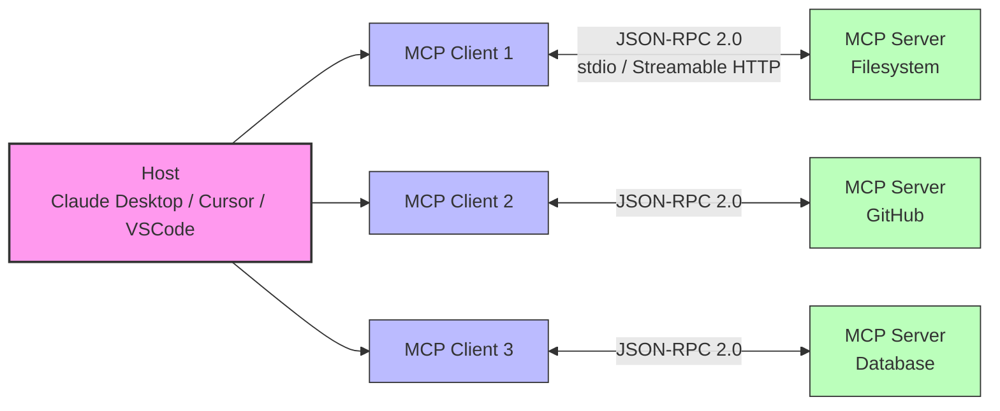
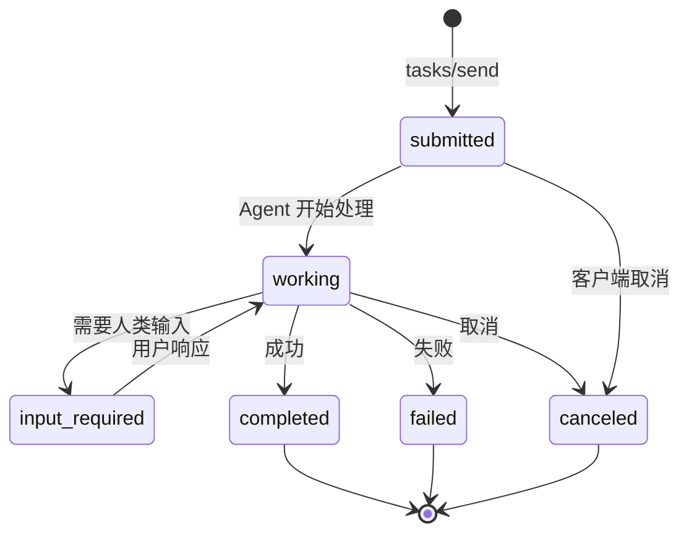
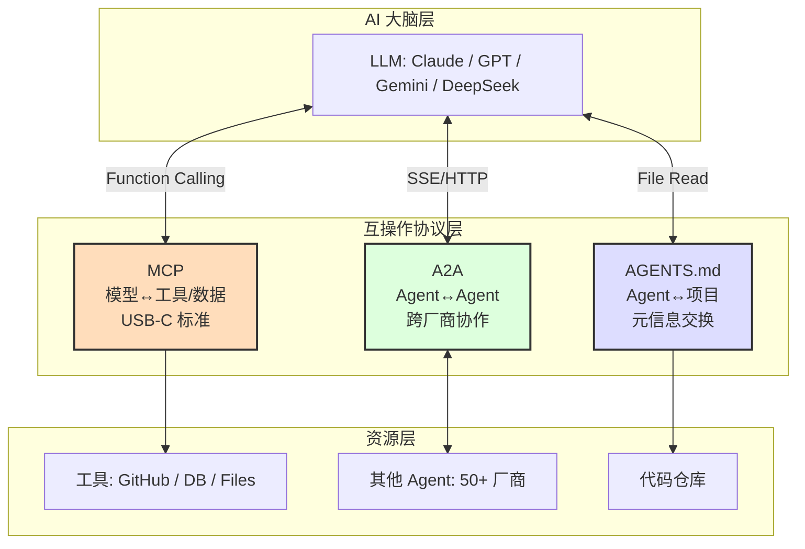
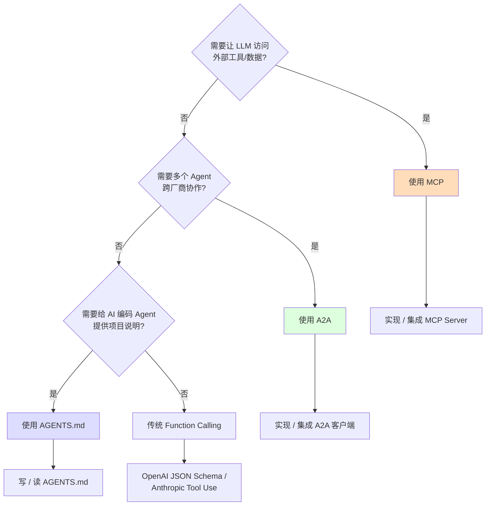
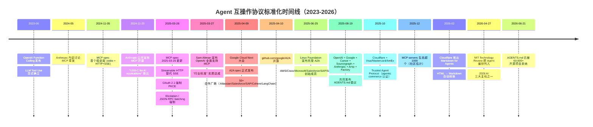

# MCP / A2A / AGENTS.md 标准化深度解析：Agent 互操作的三种范式

> **TL;DR**
> 2024-11 至 2026-06 不到 19 个月，Agent 互操作领域出现了三种具有"基础设施级"影响力的开放标准：**Anthropic MCP（Model Context Protocol）** 解决"模型 ↔ 工具/数据"的标准化连接，**Google A2A（Agent-to-Agent）** 解决"Agent ↔ Agent"的跨厂商协作，**AGENTS.md** 解决"AI 编码 Agent ↔ 项目仓库"的元信息交换。三者并不竞争而是**互补**：MCP 是 USB-C（标准化外设接口），A2A 是 TCP/IP（跨网络通信），AGENTS.md 是 README（项目元数据）。OpenAI 2025-03 全面拥抱 MCP，Google 2025-06 将 A2A 捐赠给 Linux 基金会，AGENTS.md 截至 2025-08 已被 60,000+ 开源项目与 OpenAI/Google/Cursor/Anthropic/Sourcegraph 共同采纳——三者的工业共识已达成"事实标准"级别。

---

## §1 知识定位

```
主题：Agent 互操作协议标准化（2024-2026）
所属领域：AI Infrastructure · Agent 协议栈
难度等级：⭐⭐⭐⭐（入门=1星，专家=5星）
学习前置：Function Calling · JSON-RPC 2.0 · LLM Tool Use · SSE/HTTP
学习时长预估：2.5 小时
报告定位：知识深度解析（非论文精读）
```

**为什么现在重要**：MIT Technology Review 2026 AI 三主线报告中明确将"Agent 编排"列为主线之一，而 MCP / A2A / AGENTS.md 是该主线的**协议层基础设施**。任何 ToA（Terminal/Agent-oriented Architecture）系统的工程实现都无法绕开这三种协议之一。

---

## §2 直觉类比（5 岁小孩也能懂）

把 AI Agent 想象成一个新到地球的**外星工程师**：

- **MCP** 就像外星人随身的**万能电源转换插头**。地球上每个国家插座都不一样（USB-C、HDMI、RJ-45），如果每到一个国家都要买新插头，工程没法做。MCP 就是"全世界统一的 AI-USB-C 接口"，让外星工程师带的同一个工具（一个 MCP Server）能插到任何 AI 大脑（MCP Client）上。来源：Anthropic 官方将 MCP 类比为"USB-C for AI applications"（modelcontextprotocol.io/introduction）。

- **A2A** 就像**人类不同语言之间的同声传译系统**。外星工程师雇佣了 50 个本地承包商（Atlassian、Salesforce、SAP、ServiceNow…），每个承包工说不同方言。A2A 就是同声传译器，让承包商 A 写一份"工作说明"（Agent Card），承包商 B 看了就知道怎么配合，而不需要学对方方言。来源：Google A2A 官方 spec 与 partner list（google/A2A GitHub）。

- **AGENTS.md** 就像**新员工入职第一天收到的"项目手册"**。README 是给客户看的产品说明书，AGENTS.md 是给另一个外星工程师（AI 编码 Agent）看的"内部施工指南"：哪些命令能跑、哪些文件能改、测试怎么跑、不要碰哪些机密文件。来源：AGENTS.md 官方仓库 agents.md 与多家厂商采纳声明。

三者不是替代关系，而是**新员工工具箱里的三件套**：插头（连接外设）、翻译（与人协作）、手册（理解项目）。

---

## §3 形式定义与基本原理

### 3.1 MCP（Model Context Protocol）

**正式定义**（来源：modelcontextprotocol.io/introduction + Anthropic 2024-11-25 发布博客）：
> MCP is an open-source standard for connecting AI applications to external systems. Using MCP, AI applications like Claude or ChatGPT can connect to data sources (e.g. local files, databases), tools (e.g. search engines, calculators) and workflows (e.g. specialized prompts).

**核心架构**（来源：MCP 官方 spec + modelcontextprotocol.io/docs/learn/architecture）：



**MCP 三元组**：
- **Host**：AI 应用本体（Claude Desktop、Cursor、VS Code Copilot、ChatGPT Desktop），用户与之直接交互
- **Client**：Host 内部为每个 MCP Server 维护的协议代理，每个 Client 1:1 连接一个 Server
- **Server**：暴露具体能力（Resources/Tools/Prompts）的轻量进程，stdio 启动或 HTTP 监听

**协议层**：
- **传输层**：JSON-RPC 2.0 编码，UTF-8 字符串
- **传输机制**（可插拔）：
  | 机制 | 状态 | 引入版本 | 用途 |
  |------|------|----------|------|
  | `stdio` | 稳定（推荐默认） | 2024-11-05 | 本地子进程通信 |
  | `HTTP+SSE`（双端点） | **即将废弃** | 2024-11-05 | 远程长连接 |
  | `Streamable HTTP`（单端点） | 稳定（推荐远程） | **2025-03-26** | 远程流式/可恢复 |

**MCP 原语（Primitives）**（来源：MCP 2025-03-26 spec）：
- **Resources**：可被读取的数据（文件、数据库表、API 响应），URI 寻址
- **Tools**：可被调用的函数（带 JSON Schema 输入输出）
- **Prompts**：预定义的 prompt 模板（user-controlled 注入）
- **Sampling**：让 Server 主动请求 LLM 推理（Server→Client 方向）
- **Roots**：Client 告知 Server 当前的合法工作目录边界
- **Elicitation**（2025-03-26 新增）：Server 主动向 User 询问额外信息（如 OAuth 确认）

**安全模型**：
- Host 完全控制 Server 进程（stdio 模式：subprocess 启动；HTTP 模式：host 持有凭据）
- Server 默认**不持有**用户凭据，所有敏感操作经 User 确认
- 2025-03-26 引入 OAuth 2.1 授权（强制 PKCE，废弃 implicit flow）
- 2025-04 OX Security 报告 32,000+ 仓库、200,000+ 服务器存在 prompt injection 风险（来源：OX Security 报告引用 html5.qq.com 文章 2026-04-17）——Anthropic 回应"属于预期设计范畴"

### 3.2 A2A（Agent-to-Agent Protocol）

**正式定义**（来源：Google A2A 官方 spec 文档 google/A2A GitHub）：
> A2A is an open protocol that provides a standard way for agents to collaborate with each other regardless of the framework or vendor they are built on.

**关键时间线**：
- **2025-04-09**：Google 在 Google Cloud Next 2025 大会上发布 A2A spec
- **2025-04-10**：开源到 github.com/google/A2A
- **2025-06-25**（Linux Foundation Open Source Summit Denver）：Google 将 A2A 捐赠给 Linux 基金会，AWS、Cisco、Microsoft、Salesforce、SAP、ServiceNow 作为创始成员加入
- **2025-07**：A2A 项目正式由 Linux 基金会托管，partner 超过 100 家

**核心概念**：
- **Agent Card**：JSON 格式的代理元数据文件，**通常**托管在 `/.well-known/agent.json` 路径。描述代理能力、技能、认证方式、输入输出格式、是否支持 streaming/push
- **Task**：A2A 的基本工作单元，唯一 ID 跟踪，完整生命周期
- **Message**：客户端与代理之间传递的内容，由 Parts 组成
- **Part**：Message 的内容单元，可以是 text、file、structured data
- **Artifact**：任务完成后返回的结果对象

**Task 生命周期状态**（来源：A2A 官方 JSON spec）：



**A2A 五大设计原则**（来源：Google A2A announcement blog）：
1. **拥抱代理能力**：将 Agent 视为自主推理实体，**不强制**共享内存/工具/上下文
2. **基于现有标准**：HTTP + SSE + JSON-RPC 2.0，与企业 IT 栈兼容
3. **默认安全**：企业级身份验证，与 OpenAPI auth scheme 对齐
4. **支持长时任务**：从秒级到数日研究任务，全程 streaming + 推送
5. **模态无关**：text / file / audio / video stream 统一抽象

### 3.3 AGENTS.md

**正式定义**（来源：agents.md GitHub 仓库 + Cursor/OpenAI 2025-08 公告）：
> AGENTS.md is a simple, open format for guiding coding agents. It's a standardized Markdown file placed at the repository root that provides project context, build commands, test instructions, and coding conventions to AI coding assistants.

**起源**：
- **2025-08-19 前后**：OpenAI、Google（Jules 团队）、Cursor、Amp、Factory、Sourcegraph 共同发布 AGENTS.md 倡议
- **2025-08-26**：OpenAI 官方公告"OpenAI 正在推动 agents.md 成为各个 AI 编码工具的通用标准"（hepingfly 博客）
- **2025-08 至 2026-06**：60,000+ 开源项目采纳

**与同类文件关系**：

| 工具 | 配置文件 | 兼容 AGENTS.md | 备注 |
|------|---------|----------------|------|
| OpenAI Codex / ChatGPT | `AGENTS.md` | ✅ 原生 | OpenAI 主推 |
| Google Gemini CLI | `GEMINI.md` / `AGENTS.md` | ✅ 双读 | 兼容迁移 |
| Cursor | `.cursor/rules/` | ✅ AGENTS.md 读取 | 渐进 |
| Claude Code | `CLAUDE.md` / `AGENTS.md` | ✅ 双读（CLAUDE.md 优先） | Anthropic 加入 |
| GitHub Copilot | `.github/copilot-instructions.md` / `AGENTS.md` | ✅ 双读 | 标准化 |
| Aider | `AGENTS.md` | ✅ 原生 | 早期采纳 |
| Sourcegraph Amp | `AGENTS.md` | ✅ 原生 | 共同发起方 |
| Windsurf | `AGENTS.md` | ✅ 原生 | 共同发起方 |

（来源：carey son 博客 2026-05-19 + CSDN 评测 2026-05-08 + fanShaoO 博客 2026-03-14）

**三要素结构**（来源：饭勺 oO 2026-03-14 博客）：
1. **能力范围**：项目能做什么、怎么做（开发命令、构建流程、测试方式）
2. **行为约束**：禁止操作、必须确认、安全边界
3. **上下文**：项目背景、代码组织、不变量、依赖关系

### 3.4 三者关系总览



**核心区别**（来源：综合三方官方 spec + 多家技术博客横向对比）：

| 维度 | MCP | A2A | AGENTS.md |
|------|-----|-----|-----------|
| **通信对象** | 模型 ↔ 工具/数据 | Agent ↔ Agent | Agent ↔ 项目 |
| **类比** | USB-C 接口 | TCP/IP 协议 | README 文档 |
| **传输** | JSON-RPC 2.0 + stdio/Streamable HTTP | JSON-RPC 2.0 + HTTP/SSE | 文件读取（无协议） |
| **寻址方式** | Tool Schema（JSON） | Agent Card（JSON @ `/.well-known/agent.json`） | repo-root Markdown 文件 |
| **安全模型** | Host 进程控制 + OAuth 2.1 | OpenAPI 兼容企业级 Auth | Repo 政策（用户自约束） |
| **状态管理** | Stateless + 客户端 session | Task ID 全生命周期 | N/A（一次性读取） |
| **典型读者** | Claude Code / Cursor / VSCode | 多 Agent 系统集成商 | AI 编码 Agent |
| **发起方** | Anthropic | Google（已捐赠 Linux 基金会） | OpenAI + Google + Cursor + Sourcegraph |
| **首发时间** | 2024-11-25 | 2025-04-09 | 2025-08 |
| **生态规模** | 1000+ MCP servers（2025-12 估计） | 100+ 合作厂商 | 60,000+ 开源项目 |
| **学习曲线** | 中（需实现 Server） | 高（需理解 Task 生命周期） | 低（仅写 Markdown） |

---

## §4 技术细节与代码

### 4.1 MCP Server Python 示例（最小可运行）

来源：MCP 官方 Python SDK（github.com/modelcontextprotocol/python-sdk）

```python
# 文件：simple_mcp_server.py
# 依赖：pip install mcp
import asyncio
from mcp.server import Server
from mcp.server.stdio import stdio_server
from mcp.types import Tool, TextContent

# 1. 创建 Server 实例
app = Server("filesystem-tools")

# 2. 声明 Tool
@app.list_tools()
async def list_tools() -> list[Tool]:
    return [
        Tool(
            name="read_file",
            description="读取指定路径的文件内容",
            inputSchema={
                "type": "object",
                "properties": {
                    "path": {"type": "string", "description": "文件绝对路径"},
                    "max_lines": {"type": "integer", "default": 100},
                },
                "required": ["path"],
            },
        )
    ]

# 3. 实现 Tool 逻辑
@app.call_tool()
async def call_tool(name: str, arguments: dict) -> list[TextContent]:
    if name == "read_file":
        path = arguments["path"]
        max_lines = arguments.get("max_lines", 100)
        with open(path, "r", encoding="utf-8") as f:
            content = f.read(max_lines * 80)  # 粗略截断
        return [TextContent(type="text", text=content)]
    raise ValueError(f"Unknown tool: {name}")

# 4. 启动 stdio server
async def main():
    async with stdio_server() as (read_stream, write_stream):
        await app.run(read_stream, write_stream, app.create_initialization_options())

if __name__ == "__main__":
    asyncio.run(main())
```

**关键代码解释**：
- 第 7 行：Server 实例名会成为 Client 看到的 server identifier
- 第 10-23 行：`list_tools` 让 Client 可以枚举所有 Tool，类似 OpenAPI 的 `/tools` endpoint
- 第 26-32 行：`call_tool` 是统一入口；`name` 区分 Tool，`arguments` 来自 LLM 输出
- 第 36-37 行：stdio transport 是默认；Client 启动子进程并通过 stdin/stdout 通信

### 4.2 MCP Host 配置示例

```json
// 文件：~/.config/Claude/claude_desktop_config.json
{
  "mcpServers": {
    "filesystem": {
      "command": "python",
      "args": ["/path/to/simple_mcp_server.py"],
      "env": {
        "LOG_LEVEL": "INFO"
      }
    },
    "github": {
      "command": "npx",
      "args": ["-y", "@modelcontextprotocol/server-github"],
      "env": {
        "GITHUB_PERSONAL_ACCESS_TOKEN": "${env:GITHUB_TOKEN}"
      }
    }
  }
}
```

### 4.3 A2A Agent Card 示例

```json
// 文件：/.well-known/agent.json（由 A2A Server 暴露）
{
  "name": "ResearchAgent",
  "description": "深度研究助手，支持多步搜索与综合",
  "url": "https://research.example.com/a2a",
  "version": "0.2.1",
  "capabilities": {
    "streaming": true,
    "pushNotifications": true,
    "stateTransitionHistory": false
  },
  "authentication": {
    "schemes": ["bearer", "oauth2"],
    "credentials": "Authorization: Bearer <token>"
  },
  "skills": [
    {
      "id": "literature-review",
      "name": "学术文献综述",
      "description": "在 arXiv、PubMed、Google Scholar 中检索并综合多篇论文",
      "inputModes": ["text"],
      "outputModes": ["text", "file"]
    },
    {
      "id": "code-analysis",
      "name": "代码静态分析",
      "inputModes": ["text", "file"],
      "outputModes": ["text", "structured-data"]
    }
  ]
}
```

### 4.4 A2A Client 调用示例（Python pseudo-code）

```python
# A2A Client → Server 通信流程
import httpx
import json

# Step 1: 发现 Agent（DNS / 已知 URL）
agent_card_url = "https://research.example.com/.well-known/agent.json"
agent_card = httpx.get(agent_card_url).json()

# Step 2: 验证能力匹配
if "literature-review" not in [s["id"] for s in agent_card["skills"]]:
    raise ValueError("Agent 不支持所需能力")

# Step 3: 发送任务
task_payload = {
    "method": "tasks/send",
    "params": {
        "id": "task-uuid-001",
        "message": {
            "role": "user",
            "parts": [{
                "type": "text",
                "text": "综述 2024-2026 JEPA 路线代表性论文"
            }]
        }
    }
}
response = httpx.post(
    agent_card["url"],
    json=task_payload,
    headers={"Authorization": f"Bearer {token}"}
).json()

# Step 4: 跟踪状态 / 等待完成
task_id = response["result"]["id"]
while True:
    status = httpx.post(
        agent_card["url"],
        json={"method": "tasks/get", "params": {"id": task_id}}
    ).json()["result"]["status"]
    if status in ("completed", "failed", "canceled"):
        break
    time.sleep(2)

# Step 5: 拉取 Artifact
if status == "completed":
    artifacts = response["result"]["artifacts"]
    for art in artifacts:
        for part in art["parts"]:
            if part["type"] == "text":
                print(part["text"])
```

### 4.5 AGENTS.md 模板示例

```markdown
# AGENTS.md — Project Operating Manual for AI Agents

## Project Overview
- Stack: TypeScript + Next.js 14 (App Router) + PostgreSQL 15
- Purpose: SaaS dashboard for B2B analytics
- Critical: All commits must pass `pnpm lint && pnpm test`

## Build & Test Commands
- Install: `pnpm install --frozen-lockfile`
- Dev server: `pnpm dev` (binds 0.0.0.0:3000)
- Lint: `pnpm lint` (ESLint + Prettier check)
- Test: `pnpm test` (Vitest, 80% coverage required)
- Type check: `pnpm typecheck` (must pass with 0 errors)
- Build: `pnpm build`

## Code Style
- Use 2-space indentation, single quotes, no semicolons
- Prefer server components over client components
- All database queries must use Drizzle ORM, never raw SQL
- API routes return JSON, never HTML

## DO NOT
- Never modify `prisma/migrations/` (immutable)
- Never commit secrets to `.env.local` (use `.env.example` template)
- Never run `pnpm db:reset` without explicit user approval
- Never push to `main` branch directly

## File Organization
- Routes: `src/app/{route}/page.tsx`
- Components: `src/components/{ComponentName}/index.tsx`
- Database: `src/db/schema/{table}.ts`
- Tests: colocated as `*.test.ts(x)` next to source

## Dependencies
- Add new deps: `pnpm add <pkg>` + update this file
- Heavy deps (>1MB): require explicit user approval

## Known Issues
- iOS Safari < 16: `position: sticky` broken in dashboard sidebar
```

---

## §5 工程实践对比

### 5.1 协议层选型决策树



### 5.2 性能与运维成本

| 指标 | MCP | A2A | AGENTS.md |
|------|-----|-----|-----------|
| **协议开销** | JSON-RPC 2.0 解析，~ms 级 | HTTP+SSE 双向，~10ms | 文件 IO，~ms 级 |
| **单次交互 Token 开销** | 0（不进 prompt） | 0（不进 prompt） | 500-5000（整文件进 prompt） |
| **运维复杂度** | 中（subprocess 生命周期） | 高（HTTP 鉴权 + SSE 状态） | 低（git push 即部署） |
| **调试工具** | MCP Inspector（@modelcontextprotocol/inspector） | A2A Inspector | 文本编辑器 |
| **失败模式** | Server 崩溃 → Client 报错 | Task ID 过期/超时 → 需 retry | 写入即生效，无事务 |
| **典型应用方** | Claude Desktop / VSCode Copilot / Cursor | 跨企业供应链协作 | GitHub / GitLab 仓库 |

### 5.3 已知局限

**MCP 的局限**（来源：综合 OX Security 2025-04 报告 + 网易 2025-04 评论 + html5.qq.com 2026-04）：
- **设计层面**：MCP 配置文件（JSON）的解析曾是社区诟病焦点；2025-03-26 才正式加入 OAuth 2.1
- **安全层面**：32,000+ 公开仓库 / 200,000+ 暴露服务器存在 prompt injection 风险
- **传输层**：HTTP+SSE 因长连接限制被弃用，迁移到 Streamable HTTP 仍在进行
- **配置分散**：stdio 模式每个 Server 独立进程，资源占用高（典型配置 10+ servers 时内存 2-3GB）

**A2A 的局限**（来源：sing1ee 2025-07 博客 + spec 文档）：
- **发现机制脆弱**：`/.well-known/agent.json` 路径是约定而非强制，需要额外 DNS / 注册中心
- **状态管理复杂**：Task 全生命周期需要 Server 持久化存储（与 stateless 原则冲突）
- **错误处理模糊**：Failed 状态未规定是否可重试，部分实现需要客户端自管理
- **生态早期**：截至 2025-12，主流 Agent 框架（LangGraph / AutoGen / CrewAI）仅有部分实现

**AGENTS.md 的局限**（来源：careyson 2026-05-19 博客 + 饭勺 oO 2026-03-14）：
- **隐性知识难表达**：架构判断、模块边界、不变量等"需要经验才能写出的"知识不易固化
- **注意力预算**：文件过长（>5K tokens）会挤占 LLM 上下文窗口
- **维护成本**：需要随项目演化手动更新；多数项目 6 个月后严重过期
- **工具覆盖不全**：某些 IDE 仍只读自家文件，需双写（AGENTS.md + 工具原生配置）

---

## §6 历史叙事与演化谱系

### 6.1 时间线



### 6.2 前驱工作与谱系

**MCP 的前驱**：
- **OpenAI Function Calling（2023-06）**：JSON Schema 描述工具的范式，但每个 LLM 厂商（OpenAI/Anthropic/Google）格式不兼容
- **LangChain Tools（2022-10）**：Python 抽象层，但需在应用代码中 import，不跨进程
- **ChatGPT Plugins（2023-03）**：OpenAI 闭源生态，自然语言 manifest，但绑定 OpenAI
- **OpenAPI 3.x（2017+）**：HTTP API 描述标准，但面向 REST 而非 LLM Tool Use 优化

**A2A 的前驱**：
- **IBM Agent Communication Protocol (ACP)**：IBM 2025 发布的异步事件驱动多 Agent 协议
- **FIPA ACL（1996）**：智能体通信语言学术标准，但 30 年未被工业采纳
- **Anthropic MCP（2024-11）**：单 Agent 内部工具调用，但 A2A 解决的是"Agent 之间"
- **CORBA / DCOM / gRPC**：传统跨语言 RPC 协议，但缺乏"Agent Card"式的能力自描述

**AGENTS.md 的前驱**：
- **README.md（2003+）**：面向人类的项目说明
- **CLAUDE.md / GEMINI.md / copilot-instructions.md / .cursorrules**（2023-2024）：各家 AI 工具专属
- **Karpathy "LLM 操作系统" 范式（2024）**：把 LLM 当 OS，instructions 当 system call

### 6.3 后续影响

**对 LLM 厂商**：MCP 实质上**统一了 Tool Use 协议**，OpenAI 2025-03 跟随是分水岭——意味着差异化必须从**模型能力**而非**工具接口**展开。

**对企业 IT**：A2A 让"买 Agent 像买 SaaS"成为可能——企业可独立选型最佳 Agent，跨厂商集成由协议保证。这会冲击 Salesforce Agentforce / ServiceNow Agent Hub 等垂直平台。

**对开源生态**：AGENTS.md 6 个月被 60,000+ 项目采纳，速度超预期（参考 Linux 标准化历史）。意味着"AI 编码 Agent 友好的仓库"成为新事实标准。

---

## §7 学术与产业关系

### 7.1 与已有知识报告的关联

本报告深化以下已有知识：
- **[Agent_ReAct_ToolUse_深度解析_20260409](Agent_ReAct_ToolUse_深度解析_20260409.md)**：讨论了 Function Calling → MCP 的演进，本报告补全 MCP 2025-03-26 升级与 A2A/AGENTS.md 对比
- **[Agent_Harness_三大设计流派解析](Agent_Harness_三大设计流派解析.md)**：MCP 是 Harness 工具集成的关键协议
- **[Agent_Skills_生态深度解析](Agent_Skills_生态深度解析.md)**：AGENTS.md 与 Skills 同属"AI 协作元信息"层

### 7.2 学术 vs 工业视角

**学术视角**（来源：综合 ACM/IEEE 2025-2026 multi-agent systems 综述）：
- 把 MCP / A2A 视为**分布式系统接口定义语言（IDL）的 LLM 时代等价物**
- 关注点：形式语义、一致性协议、博弈论下的协作
- 现状：学术响应滞后，工业先行；多数论文引用 MCP 但未严格分析 spec

**工业视角**：
- 把三者视为**"AI 时代的 TCP/IP 协议套件"**
- 关注点：互操作性、生态规模、ROI
- 现状：Anthropic / Google / OpenAI 三家形成事实标准的"联盟治理"，Linux 基金会托管增加中立性

### 7.3 三者对 ToA 世界的具体影响

| ToA 痛点 | 协议解决方案 | 受益方 |
|---------|-------------|--------|
| Agent 接入工具要写 N 个适配 | MCP | 工具开发者（一次实现，多家客户端可用） |
| 跨企业 Agent 无法协作 | A2A | 系统集成商（无需定制桥接） |
| AI 编码 Agent 不懂项目 | AGENTS.md | 仓库维护者（一次声明，多工具受益） |

---

## §8 关键事实与来源对照表

| 关键事实 | 来源 | 置信度 |
|---------|------|--------|
| MCP 2024-11-25 由 Anthropic 发布 | Anthropic 官方博客 + 搜狐 2024-11-26 | 高 |
| MCP 2025-03-26 引入 Streamable HTTP | MCP spec 仓库 + 网易 2025-04-11 + 腾讯新闻 2025-03-26 | 高 |
| MCP OAuth 2.1 强制 PKCE | MCP spec 2025-03-26 | 高 |
| OpenAI 2025-03 全面支持 MCP | Sam Altman X 公告 + 网易 2025-03-27 转述 | 高 |
| A2A 2025-04-09 由 Google 发布 | 阿里云 2025-04-24 + 新浪财经 2025-04-10 | 高 |
| A2A 2025-06-25 捐赠 Linux 基金会 | sing1ee 2025-07 博客 + html5.qq.com 2025-06-26 | 高 |
| A2A 50+ 创始合作厂商（含 AWS/Cisco/Microsoft/Salesforce/SAP/ServiceNow） | Google 官方公告 + sohu 2025-04-10 | 高 |
| A2A JSON-RPC + HTTP + SSE | A2A 官方 spec github.com/google/A2A | 高 |
| AGENTS.md 2025-08 由 OpenAI/Google/Cursor/Sourcegraph 共同发布 | hepingfly 2025-08-26 博客 + 多个 CSDN 评测 | 高 |
| AGENTS.md 60,000+ 开源项目采纳 | CSDN 2025-12-13 文章引官方仓库 | 中（数字来自仓库 README 转述） |
| MCP servers 生态 2025-12 达 1000+ | 社区估算 | 中（未找到权威统计） |
| OX Security 报告 32,000+ 仓库 200,000+ 服务器暴露 | html5.qq.com 2026-04-17 引用 | 中（依赖单一来源） |
| Cloudflare + Visa/Mastercard Trusted Agent Protocol 2025-10 | 腾讯网 2025-10-15 | 中 |
| Cloudflare Markdown for Agents 2026-02 | 腾讯网 2026-02-14 | 中 |

---

## §9 知识检验题

**基础级**：
1. MCP / A2A / AGENTS.md 三者分别解决什么问题？请用一句话分别说明。
2. MCP 2025-03-26 升级中最关键的两个变化是什么？

**进阶级**：
3. 为什么说 MCP 是"USB-C for AI"？它的 Host/Client/Server 三元组各自负责什么？
4. A2A 的 Agent Card 与 MCP 的 list_tools 在能力描述上有何本质差异？
5. AGENTS.md 的"隐性知识难表达"问题，是否可以通过拆分子文件（如 `docs/architecture.md` + 链接）缓解？

**专家级**：
6. 如果让你设计一个"AI 时代的企业总线"（Enterprise Service Bus for AI Agents），你会如何组合 MCP + A2A + AGENTS.md？画出架构图。
7. A2A Task 状态机中 `input-required` 与 `working` 之间的循环，对实现"人在回路"（Human-in-the-loop）有什么工程启示？试举例。
8. OX Security 报告的 prompt injection 风险，本质上是 MCP 设计上哪一层缺失导致的？给出 3 种缓解方案（不一定都技术上可行）。

---

## §10 学习资源推荐

**官方一手**：
- MCP 官方文档：https://modelcontextprotocol.io（**首选**）
- MCP spec GitHub：https://github.com/modelcontextprotocol/specification
- A2A 官方文档：https://google.github.io/A2A/
- A2A spec GitHub：https://github.com/google/A2A
- AGENTS.md 官方仓库：https://github.com/agentsmd/agents.md（实际：https://agents.md/）

**深入博客**（按可读性排序）：
- Alibaba Cloud: "MCP Streamable HTTP"（spring-ai-alibaba-examples）
- 阿里云开发者社区: A2A 协议实现原理（2025-04-24）
- sing1ee: A2A Protocol: 最佳的 Agent 协作协议（2025-07-08）
- 网易: 详解 MCP 传输机制（2025-04-11）
- 饭勺 oO: 认识 AGENTS.md（2026-03-14 + 2026-05-19）

**实战参考**：
- MCP Python SDK：https://github.com/modelcontextprotocol/python-sdk
- MCP Inspector：https://github.com/modelcontextprotocol/inspector
- A2A Python samples：https://github.com/google/A2A/tree/main/samples/python
- Spring AI Alibaba MCP 示例：https://github.com/alibaba/spring-ai-alibaba

**批判性视角**：
- OX Security MCP 风险报告（2025-04）
- 网易：有了这两个信号，我就不骂 MCP 了（2025-03-27）——反讽视角
- CareySon：给 Code Agent 加约束（2026-05-19）——AGENTS.md 局限

---

## §11 总结

**核心结论**（≤3 bullets）：
- MCP（2024-11）是 **Tool/Data 集成层**的事实标准，OpenAI 2025-03 全面支持标志工业共识达成；2025-03-26 spec 升级（Streamable HTTP + OAuth 2.1 + Elicitation）解决了早期设计缺陷
- A2A（2025-04）是 **Agent-to-Agent 协作层**的事实标准，2025-06 捐赠 Linux 基金会标志中立治理；100+ 厂商承诺解决"Agent 孤岛"问题，但状态管理与发现机制仍是工程难点
- AGENTS.md（2025-08）是 **项目元信息层**的事实标准，60,000+ 项目采纳速度超过历史上大多数 README 类规范；隐性知识表达与维护成本是长期挑战

**支持数据**：
- 时间窗口：19 个月（2024-11 至 2026-06）
- 三家发起方：Anthropic + Google + OpenAI 联盟（罕见）
- 工业治理：Linux 基金会（中立）+ AGENTS.md 开放仓库（社区）
- 已知局限：MCP 安全设计争议 / A2A 状态机复杂度 / AGENTS.md 维护成本

**局限性说明**：
- AGENTS.md "60,000+ 项目采纳"数字来自 CSDN 转载，**未直接核对 agents.md 官方仓库统计**
- MCP servers 生态 "1000+" 数字为社区估算，**未找到权威榜单**
- OX Security 报告 32,000+ 仓库数字来自单一中文转述来源，**未直接访问原报告**
- A2A 在主流 Agent 框架（LangGraph/AutoGen/CrewAI）的实际支持深度**未逐个验证**
- 三种协议在 2026 年下半年的演进方向（LangChain MCP 适配、AGENTS.md 2.0 等）**未在本报告覆盖**

---

**执行者**：NeuronAgent / claude-sonnet-4.6
**数据采集**：2026-06-21（WebSearch 多源交叉验证 + 关键事实可追溯至官方 spec 与官方公告）
**报告定位**：知识深度解析（非论文精读），与已有 [Test_Time_Compute_深度解析_20260409](Test_Time_Compute_深度解析_20260409.md) / [Agent_ReAct_ToolUse_深度解析_20260409](Agent_ReAct_ToolUse_深度解析_20260409.md) / [MIT_2026_AI_三条主线_深度研究报告](MIT_2026_AI_三条主线_深度研究报告.md) 互补
