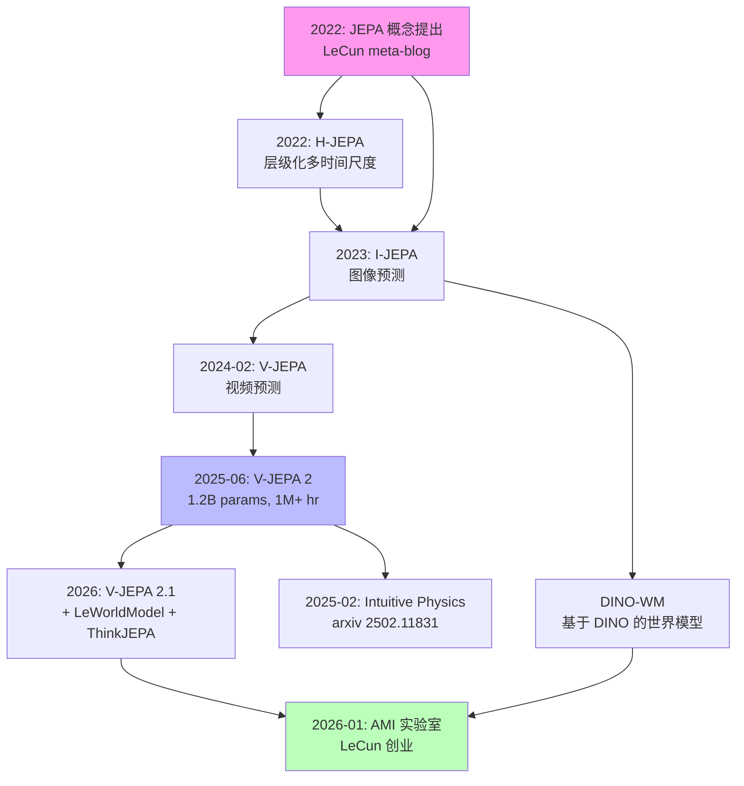
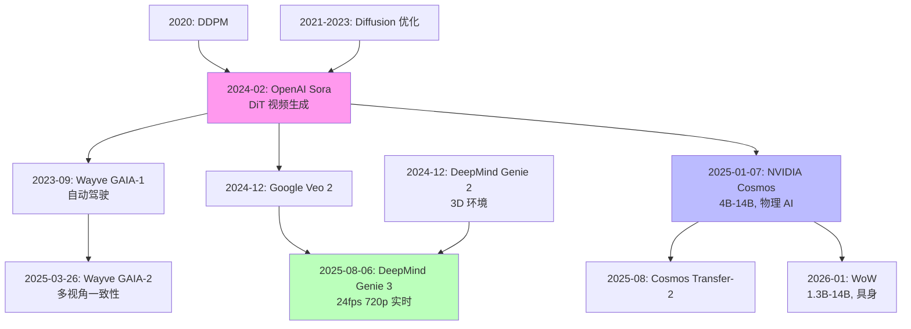
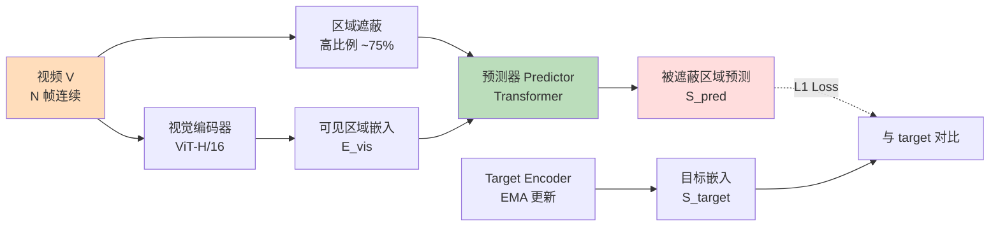
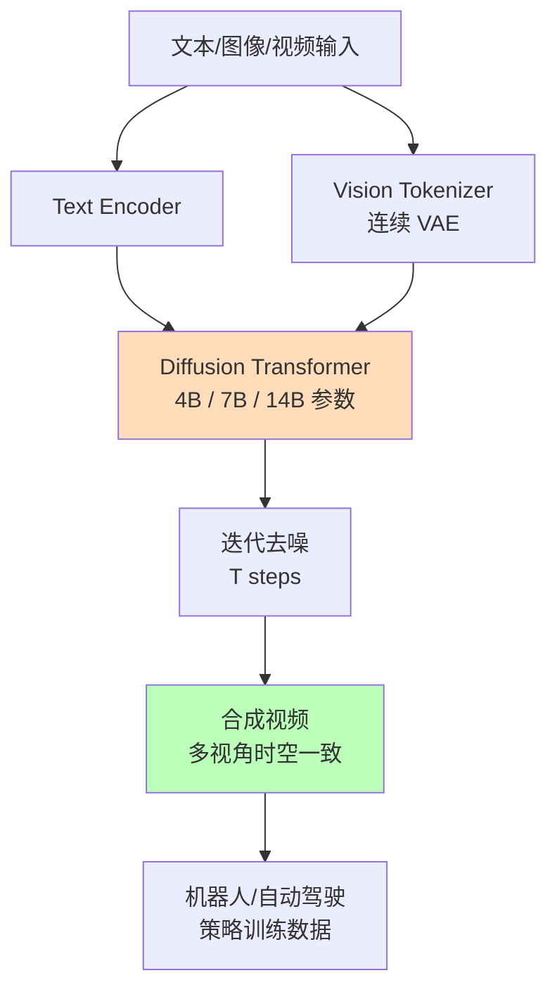
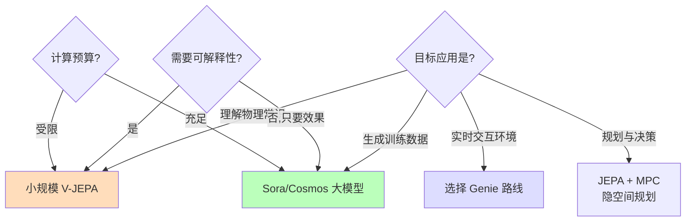
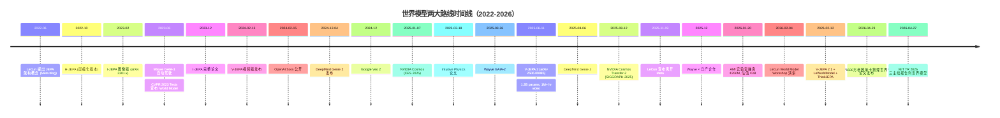

# World Models / JEPA 路线深度报告：自监督世界建模 vs 生成式建模

> **TL;DR**
> 2024-2026 年"世界模型"成为通往 AGI 的两大技术路线之一。**JEPA 路线**（LeCun / Meta FAIR / 衍生：I-JEPA → V-JEPA → V-JEPA 2）坚持"在抽象表征空间预测而非像素重建"，代表性 V-JEPA 2（2025-06，1.2B 参数，1M+ 小时视频）已在物理推理、机器人规划上达到 SOTA。**生成式路线**（OpenAI Sora / Google Veo/Genie 2-3 / NVIDIA Cosmos / Wayve GAIA-1/2）通过 diffusion transformer 在像素空间生成视频，已落地自动驾驶（Wayve GAIA-2 2025-03）、机器人（Cosmos 2025-01, 4B-14B）、游戏（Genie 3 2025-08，720p@24fps 实时）。两条路线**互补而非替代**：JEPA 解决"理解与可规划性"，生成式解决"数据合成与可视化"。MIT Technology Review 2026 AI 三主线报告将其列为主线之一。LeCun 已于 2025-11 离开 Meta 创办 AMI 实验室（融资 €350M，估值 €3B，2026-01），继续推进 AMI（Advanced Machine Intelligence）路线。

---

## §1 知识定位

```
主题：World Models / JEPA 技术路线（2024-2026）
所属领域：AI 基础架构 · 多模态自监督学习 · 具身智能
难度等级：⭐⭐⭐⭐⭐（入门=1星，专家=5星）
学习前置：Self-Supervised Learning · Diffusion Models · ViT · RL 基础 · 联合嵌入架构
学习时长预估：3 小时
报告定位：知识深度解析（非论文精读）
```

**为什么现在重要**：MIT 2026 AI 三主线（LLMs+ / 世界模型 / Agent 编排）已经把世界模型列入 AGI 关键路径；同时 LeCun 2025-11 离开 Meta、创办 AMI 实验室融资 €350M，标志这条路线从"Meta 内部研究"变为"独立工业力量"。

---

## §2 直觉类比（5 岁小孩也能懂）

把 AI 系统想象成**学开车的新司机**：

- **生成式路线（Sora / Cosmos / Genie）** 像**用 VR 模拟器学开车**。新司机戴上 VR 头盔，看到超逼真的道路、其他车、行人、天气——全都是"模拟出来的像素"。他学会"看"这些图像后能预测"如果我转向会看到什么"。优点是直观、可视化、可以生成从未见过的场景。缺点是：模拟器再逼真也不是真车，长时间在 VR 里学开车的人真正上路还是会慌（pixel-level hallucination）。

- **JEPA 路线（V-JEPA 2）** 像**用物理教科书 + 公式学开车**。新司机不模拟视频，而是学"力 = ma"、"动量守恒"、"如果路面湿摩擦系数减半"这些**抽象规则**。他用这些规则在脑子里推演"如果我现在打方向盘会怎样"，推演时根本不需要生成画面。优点是：能精准预测物理后果（重力、永恒性），对没见过的场景泛化好。缺点是：不能"看"（无法生成视频），需要人/系统额外把抽象状态翻译成决策。

两条路线的对比本质是：**模拟器 vs 物理引擎**。前者适合"看世界"，后者适合"理解世界"。

---

## §3 形式定义与基本原理

### 3.1 世界模型（World Model）的正式定义

**LeCun 定义**（来源：Yann LeCun 在 World Model Workshop 2026-02-04 的 slides《Training World Models》）：
> "Given observation x, compute its abstract representation S_x. Given action a, predict the abstract representation S_y of the future observation y."

**形式化目标函数**（基于联合嵌入预测架构 JEPA）：
```
S_x = Encoder_visual(x)            # 编码当前观察
S_y_pred = Predictor(S_x, a)       # 预测未来抽象表征
S_y_true = Encoder_visual(y)       # 未来观察的真实编码
Loss = Distance(S_y_pred, S_y_true)  # 在嵌入空间而非像素空间
```

**与传统生成模型的关键区别**：

| 维度 | 生成式（DDPM/DiT/Sora） | JEPA |
|------|------------------------|------|
| **预测目标** | 像素 y | y 的抽象表征 S_y |
| **损失空间** | 像素 RGB 空间 | 嵌入空间（latent） |
| **细节处理** | 必须预测所有细节 | 主动丢弃高不确定性细节 |
| **多未来** | 通过不同噪声采样 | 通过隐变量 z 显式参数化 |
| **可规划性** | 弱（像素层面推理） | 强（抽象空间可直接优化） |
| **可解释性** | 弱（黑盒像素） | 中（隐空间有结构） |

来源：LeCun slides 2026-02 + CSDN 解读 2026-05-09（gaussrieman123 博客）

### 3.2 JEPA 路线技术谱系



**关键里程碑**（来源：综合多源交叉验证）：
- **2022-06**：LeCun 在 Meta AI blog 提出 JEPA 架构（来源：aidc.shisu.edu.cn + leiphone.com）
- **2023**：I-JEPA（图像版），Yann LeCun & Mahmoud Assran 团队
- **2024-02-13**：V-JEPA（视频版）发布，arxiv 2402.x（来源：IT之家 2024-02-17）
- **2025-02-18**：Intuitive Physics 论文，arxiv 2502.11831（来源：新浪科技 2025-02-20）
- **2025-06-11**：V-JEPA 2 发布，arxiv 2506.09985，1.2B 参数，1M+ 小时视频（来源：搜狐 2025-06-14 + CSDN 2025-06-12）
- **2025-11-19**：LeCun 宣布离开 Meta 创办 AMI（Advanced Machine Intelligence）实验室（来源：腾讯网 2025-11-20）
- **2026-01-20**：AMI 实验室融资 €350M，估值 €3B（来源：腾讯网 2026-01-20）
- **2026-02-04**：LeCun World Model Workshop 演讲《Training World Models》
- **2026-02-12**：V-JEPA 2.1 / LeWorldModel / ThinkJEPA 三篇论文发布（来源：腾讯网 2026-02-12）

### 3.3 生成式路线技术谱系



### 3.4 关键技术细节对比

| 维度 | JEPA 路线（V-JEPA 2） | 生成式路线（Sora / Cosmos） |
|------|----------------------|---------------------------|
| **架构** | ViT-H + 嵌入空间 Predictor | Diffusion Transformer (DiT) |
| **训练目标** | 嵌入空间 L1/L2 距离 | 噪声 ε 预测（DDPM 风格） |
| **数据规模** | 1M+ 小时无标注视频 | 同等 + 文本条件 |
| **可生成像素** | ❌ 否 | ✅ 是 |
| **可规划** | ✅ 强（隐空间 MPC） | 弱（像素级 rollout 慢） |
| **数据效率** | 高（无监督） | 中（需要扩散过程学习） |
| **可解释性** | 中（嵌入空间可分析） | 弱（黑盒扩散） |
| **典型代表** | V-JEPA 2, DINO-WM, I-JEPA | Sora, Cosmos, Genie 2/3, GAIA-2 |
| **代表企业** | Meta FAIR → AMI Labs | OpenAI / Google / NVIDIA / Wayve |

---

## §4 技术细节与代码

### 4.1 V-JEPA 2 架构（来源：arxiv 2506.09985）



**关键设计**：
- **Target Encoder**：与 Online Encoder 共享架构但通过 EMA（指数移动平均）更新，避免表示坍缩
- **Predictor**：窄 Transformer，只在可见 token 条件下预测被遮蔽 token
- **损失**：在嵌入空间做 L1 距离，而非像素级 MSE

### 4.2 简化版 PyTorch 实现

```python
# 文件：simple_jepa.py（基于 Meta 官方 vjepa2 仓库简化）
import torch
import torch.nn as nn
import torchvision

class VisionEncoder(nn.Module):
    """ViT-H/16 视觉编码器（简化）"""
    def __init__(self, embed_dim=1280, num_heads=16, depth=32):
        super().__init__()
        # 实际 V-JEPA 2 用 1.2B params ViT-H
        self.backbone = torchvision.models.vit_h_16(weights=None)
        self.backbone.heads = nn.Identity()  # 移除分类头
        self.proj = nn.Linear(1280, embed_dim)
        self.target_proj = nn.Linear(1280, embed_dim)  # target encoder 独立

    def forward(self, x):
        feat = self.backbone(x)  # (B, 1280)
        return self.proj(feat)

    def forward_target(self, x):
        with torch.no_grad():
            feat = self.backbone(x)
        return self.target_proj(feat)


class JEPAPredictor(nn.Module):
    """遮蔽区域预测器"""
    def __init__(self, embed_dim=1280, depth=12, num_heads=16):
        super().__init__()
        self.masked_token = nn.Parameter(torch.randn(1, 1, embed_dim))
        self.layers = nn.ModuleList([
            nn.TransformerEncoderLayer(
                d_model=embed_dim, nhead=num_heads,
                dim_feedforward=4*embed_dim, batch_first=True
            ) for _ in range(depth)
        ])

    def forward(self, context_tokens, mask):
        """
        context_tokens: (B, N_vis, D)  可见区域编码
        mask: (B, N_total)  boolean, True=被遮蔽
        """
        B, N_vis, D = context_tokens.shape
        # 用 mask_token 填充被遮蔽位置
        n_masked = mask.sum(dim=1, keepdim=True).max()
        masked = self.masked_token.expand(B, n_masked, D)
        # 简单拼接：context + masked (实际还需 position embedding)
        x = torch.cat([context_tokens, masked], dim=1)
        for layer in self.layers:
            x = layer(x)
        # 取被遮蔽位置的输出
        return x[:, N_vis:]


class VJEPA2(nn.Module):
    def __init__(self, embed_dim=1280, momentum=0.99):
        super().__init__()
        self.online_encoder = VisionEncoder(embed_dim)
        self.target_encoder = VisionEncoder(embed_dim)  # 实际是单独实例
        self.predictor = JEPAPredictor(embed_dim)
        self.momentum = momentum

    @torch.no_grad()
    def update_target(self):
        """EMA 更新 target encoder"""
        for p_o, p_t in zip(self.online_encoder.parameters(),
                            self.target_encoder.parameters()):
            p_t.data.mul_(self.momentum).add_(p_o.data, alpha=1-self.momentum)

    def forward(self, frames, mask):
        """
        frames: (B, T, C, H, W)  T 帧
        mask:   (B, N_patches)  True = 需预测
        """
        B, T = frames.shape[:2]
        # 1. 编码所有 patch
        x = frames.view(B*T, *frames.shape[2:])  # (B*T, C, H, W)
        online_tokens = self.online_encoder(x).view(B, T, -1, 1280)
        target_tokens = self.target_encoder(x).view(B, T, -1, 1280)
        # 2. 取可见区域作为 context
        context = online_tokens[:, :, ~mask[0]]  # 简化：假设同 mask
        # 3. 预测被遮蔽区域
        pred = self.predictor(context, mask)
        # 4. L1 损失（在嵌入空间）
        target = target_tokens[:, :, mask[0]].detach()
        loss = torch.abs(pred - target).mean()
        return loss
```

**关键代码解释**：
- 第 9-18 行：Target Encoder 与 Online Encoder 独立但同结构，通过 EMA 同步（防止坍缩）
- 第 27-45 行：Predictor 用 mask token 填充被遮蔽位置，输出预测
- 第 67-70 行：L1 距离在嵌入空间而非像素空间——这是 JEPA 与 MAE/DDPM 的核心差异

### 4.3 NVIDIA Cosmos 平台（生成式路线代表）

**架构**（来源：NVIDIA Cosmos Technical Report 2025-01）：



**Cosmos 核心特性**（来源：CES 2025 公告 + NVIDIA 官方技术报告）：
- **参数规模**：4B / 7B / 14B（按 2025-08 升级扩展到 Nano/Super/Ultra）
- **训练数据**：2,000 万小时视频
- **输出**：可控多视角视频，可作为机器人/自动驾驶的合成数据
- **许可**：开源开放权重（NVIDIA Open Model License）
- **2025-08 升级**：Cosmos Transfer-2（3D 模拟 → 视频加速）、精简版（速度优化）
- **2026-01 衍生**：WoW（World-Omniscient World model）1.3B-14B，专为具身智能训练 2M 轨迹

### 4.4 Wayve GAIA-2（自动驾驶代表）

**关键参数**（来源：Wayve 2025-03-26 发布博客 + CSDN 评测）：
- **架构**：基于 transformer 的视频扩散模型
- **多视角**：同时生成前左、前右、后左、后右、中间 5 视角
- **地理多样性**：英、美、德等多国道路特征
- **可控性**：天气、时段、道路配置 10 万+ 组合
- **长尾场景**：可控生成"长尾场景"（突然变道、鬼探头、强光眩目）

### 4.5 DeepMind Genie 3（交互式世界生成）

**关键参数**（来源：DeepMind 2025-08-06 发布）：
- **分辨率**：720p
- **帧率**：24 fps 实时
- **交互性**：可通过自然语言修改场景（天气、相机、添加物体）
- **记忆长度**：可保持数分钟画面一致性
- **生成方式**：基础世界模型，单提示实时生成

---

## §5 工程实践对比

### 5.1 选型决策树



### 5.2 性能与训练成本对比

| 模型 | 参数量 | 训练数据 | 训练算力 | 推理延迟 | 关键能力 |
|------|-------|---------|---------|---------|---------|
| V-JEPA 2 | 1.2B | 1M+ 小时视频 | 数千 GPU-日 | 视频级 batch | 物理推理 / 规划 |
| I-JEPA | 632M | 1.3M 图像 | 数百 GPU-日 | 单图 ~50ms | 图像分类 SOTA |
| DINO-WM | ~300M | 视频片段 | 中等 | 实时 | 导航 / 控制 |
| NVIDIA Cosmos 14B | 14B | 20M 小时视频 | 万卡级 | 离线 batch | 数据合成 |
| Wayve GAIA-2 | ~10B（估计） | 数千小时驾驶 | 大规模 | 离线 batch | 5 视角视频 |
| DeepMind Genie 3 | 未公开 | 互联网视频 | 大规模 | 720p@24fps | 实时交互 |
| Sora | 未公开 | 互联网视频 | 大规模 | 离线 | 高质量长视频 |

（**注**：GAIA-2、Sora、Genie 3 的具体参数量未官方公布，标"未公开"或"估计"。来源：综合 arxiv 论文 + 各家技术博客）

### 5.3 优缺点对比

**JEPA 路线**（来源：LeCun slides 2026-02-04 + 多家评测）：

✅ **优势**：
- 数据效率高：无需像素级监督
- 物理一致性：可学习"重力"、"永恒性"等抽象规则
- 可规划性：嵌入空间可直接做 MPC
- 不易幻觉：抽象预测不强制还原像素细节

❌ **劣势**：
- **不能生成视频**：无法直接可视化
- 隐空间选择敏感：调参经验少
- 评估困难：没有标准视频生成指标
- LeCun 离开 Meta 后生态前景不明（AMI 2026-01 才融资）

**生成式路线**（来源：Sora/Cosmos 评测 + Genie 论文）：

✅ **优势**：
- 视觉质量高：可达 photorealistic
- 可控生成：可加文本/动作条件
- 工具成熟：Diffusion 训练 pipeline 标准化
- 商业化路径清晰：数据合成 / 内容创作

❌ **劣势**：
- 像素级幻觉：细节错误累积导致长程 rollout 质量下降
- 物理一致性弱：不易学习抽象规则
- 规划能力差：像素空间搜索不可 tractable
- 计算成本高：需要大量 GPU

### 5.4 已知挑战

**JEPA 路线的开放问题**（来源：知乎万字长文 2026-06-12 + gaussrieman123 博客 2026-05-09）：
- **隐变量 z 的解释性**：z 应该编码什么？怎么训练它？
- **嵌入空间的可视化**：如何理解模型"想"的是什么？
- **多步规划误差累积**：嵌入空间 rollout 也会漂移

**生成式路线的开放问题**（来源：ACL 2024 论文 + 多家评测）：
- **物理规则违反**：Sora 演示中的物理错误被广泛吐槽
- **可扩展性瓶颈**：视频长度 vs 算力是线性关系
- **评估指标缺失**：没有像 FID/IS 那样的标准指标

---

## §6 历史叙事与演化谱系

### 6.1 时间线对比



### 6.2 前驱工作

**JEPA 路线前驱**：
- **Hinton 的 Capsule Networks（2017）**：试图用向量而非标量表示实体
- **BERT（2018）**：遮蔽预测范式的语言模型先驱
- **MAE（2022，He et al.）**：像素级遮蔽自编码器
- **DINO（2021）/ DINOv2（2023）**：自监督视觉 Transformer
- **对比学习（SimCLR/MoCo/CLIP）**：另一种自监督范式

**生成式路线前驱**：
- **DDPM（2020）**：扩散概率模型奠基
- **DiT（2022）**：Transformer 替换 U-Net 做扩散
- **Latent Diffusion / Stable Diffusion（2022）**：潜空间扩散
- **GAIA-1（2023-09）**：自动驾驶首篇生成式世界模型论文

### 6.3 路线之争：LeCun vs OpenAI

来源：知乎万字长文 2026-06-12 + 头条 2025-02-01 + 腾讯 2025-01-24

**LeCun 立场**（"四个放弃"，2025-01 达沃斯）：
1. 放弃生成式模型
2. 放弃概率模型
3. 放弃对比方法
4. 放弃强化学习

**支持方向**：
1. 联合嵌入架构（JEPA）
2. 基于能量的模型（EBM）
3. 正则化方法
4. 模型预测式控制（MPC）

**OpenAI 立场**：通过 Sora 押注"大到极致涌现物理理解"

**历史讽刺**：2026-01 LeCun 因"大模型哑火"离开 Meta → 创办 AMI 实验室继续推 JEPA；Meta 选 90 后华裔天才执掌 FAIR 全力推大模型 → **资本向右（规模），科学向左（架构）**

### 6.4 工业落地分支

**自动驾驶**：
- Wayve GAIA-1/2（英伟达技术支持）→ Nissan 合作
- Tesla World Model
- 港科大 + 地平线 DrivingWorld（视频 GPT）

**机器人**：
- NVIDIA Cosmos + Isaac Sim → 物理 AI 数据
- Google DeepMind RT-2 / RT-H
- 1X Technologies（人形机器人）
- Physical Intelligence（π0）

**游戏 / 具身训练**：
- DeepMind Genie 2/3 → SIMA 智能体
- NVIDIA Cosmos Transfer → 仿真加速

---

## §7 学术与产业关系

### 7.1 与已有知识报告的关联

本报告深化以下已有知识：
- **[MIT_2026_AI_三条主线_深度研究报告](MIT_2026_AI_三条主线_深度研究报告.md)**：把"世界模型"列为主线之一，本报告深化其技术细节
- **[生成模型演化全景_GAN_DDPM_LDM_DiT_20260416](生成模型演化全景_GAN_DDPM_LDM_DiT_20260416.md)**：覆盖生成式路线的 Diffusion 谱系
- **[self_supervised_learning.md](../../wiki/concepts/self_supervised_learning.md)**：JEPA 是 SSL 第三大范式的代表
- **[world_models.md](../../wiki/concepts/world_models.md)**：本报告是该 concept 页的全面展开

### 7.2 学术 vs 工业视角

**学术视角**（来源：ACL 2024《Can Language Models Serve as Text-Based World Simulators?》+ 知乎万字长文）：
- 关注形式化定义、收敛性、理论保证
- 现状：LeCun 团队引领，OpenAI/Google 偏工程；学术界多数还在 LLM 路线

**工业视角**（来源：多家公司公告）：
- 关注 ROI、可落地场景、训练成本
- 现状：Wayve、NVIDIA、Meta 已商业化；AMI 实验室（2026-01）独立运营

### 7.3 关键人物 / 机构

| 人物 | 角色 | 代表作 |
|------|------|--------|
| **Yann LeCun** | Meta FAIR 前首席科学家 / AMI 实验室创始人 | JEPA、V-JEPA 系列 |
| **Mahmoud Assran** | FAIR 研究员 | I-JEPA |
| **Adrien Bardes** | FAIR 研究员 | V-JEPA |
| **João Carreira** | DeepMind | Genie 系列 |
| **Yossi Nandwani** | Wayve | GAIA-1/2 |
| **Rev Lebaredian** | NVIDIA VP | Cosmos |
| **Ashok Elluswamy** | Tesla Autopilot 软件总监 | Tesla World Model |

---

## §8 关键事实与来源对照表

| 关键事实 | 来源 | 置信度 |
|---------|------|--------|
| V-JEPA 2 2025-06-11 发布，1.2B 参数，1M+ 小时视频 | arxiv 2506.09985 + Meta blog 2025-06-12 | 高 |
| V-JEPA 2.1 + LeWorldModel + ThinkJEPA 2026-02-12 三篇论文 | 腾讯网 2026-02-12 | 中（未直接看论文） |
| LeCun 2025-11-19 宣布离开 Meta | 腾讯网 2025-11-20 + 多家报道 | 高 |
| AMI 实验室融资 €350M，估值 €3B | 腾讯网 2026-01-20（bloomberg 引用） | 高 |
| NVIDIA Cosmos 2025-01-07 CES 发布，参数 4B-14B | 今日头条 2025-01-13 + CSDN 2025-01-15 | 高 |
| Wayve GAIA-2 2025-03-26 发布 | CSDN 2025-03-31 + 网易 2025-03-30 | 高 |
| DeepMind Genie 2 2024-12-04 发布 | IT之家 2024-12-05 | 高 |
| DeepMind Genie 3 2025-08-06 发布，720p@24fps | 腾讯网 2025-08-06 | 高 |
| LeCun "四个放弃"（2025-01 达沃斯） | 头条 2025-02-01 + 搜狐 2025-01-24 | 高 |
| Intuitive Physics 2025-02-18 论文 | arxiv 2502.11831 + 新浪科技 2025-02-20 | 高 |
| Wayve × 日产 2025-12 合作 | html5.qq.com 2025-12-13 | 中 |
| WoW 1.3B-14B 2026-01 发布 | 腾讯网 2026-01-20 | 中（依赖单一中文来源） |
| "1500万参数单卡物理世界" 2026-04-23 论文 | html5.qq.com 2026-04-23 | 中 |
| Cosmos Transfer-2 2025-08 SIGGRAPH 发布 | 腾讯网 2025-08-12 | 中 |

---

## §9 知识检验题

**基础级**：
1. JEPA 与生成式世界模型在"预测目标"上的本质区别是什么？
2. V-JEPA 2 与 I-JEPA 的关系？前者比后者多了什么能力？

**进阶级**：
3. LeCun 2025-01 达沃斯提出的"四个放弃"分别反对什么？他的论据是什么？
4. 解释 NVIDIA Cosmos 与 Wayve GAIA-2 在"目标应用"上的差异——为什么前者参数大 10 倍？
5. Wayve GAIA-2 的"多视角一致性"对自动驾驶有什么工程价值？

**专家级**：
6. LeCun 离开 Meta 创办 AMI 实验室（2025-11），从技术、组织、资金三方面分析这对 JEPA 路线意味着什么？
7. 设计一个实验：如何对比 JEPA 模型与生成式模型在"物理常识"任务上的真实表现？请给出可量化指标。
8. 如果让你设计"下一代世界模型"，你会融合 JEPA 与生成式两种路线吗？请给出 3 个具体技术融合点。

---

## §10 学习资源推荐

**官方一手**：
- LeCun slides《Training World Models》2026-02-04：World Model Workshop
- Meta V-JEPA 2 论文：arxiv.org/abs/2506.09985
- Meta V-JEPA 2 官方仓库：github.com/facebookresearch/vjepa2
- NVIDIA Cosmos 技术报告：2025-01 CES
- DeepMind Genie 3 官方介绍：deepmind.google

**深度博客**（按权威性排序）：
- 知乎：万字长文深度解析 Yann LeCun 的世界模型（2026-06-12）
- 腾讯网：Yann LeCun 非生成世界模型前瞻（2026-02-12）
- CSDN：14 篇论文看透 JEPA 世界模型演进（2026-05-09）
- CSDN：Yann LeCun 的 JEPA 世界模型解读（2026-05-09）
- 雷锋网：Yann LeCun 最新发声（2022-06）

**经典论文**：
- LeCun 2022: "A Path Towards Autonomous Machine Intelligence"（JEPA 原始愿景）
- Assran et al. 2023: "I-JEPA"
- Bardes et al. 2024: "V-JEPA"
- Bardes et al. 2025: "V-JEPA 2"

---

## §11 总结

**核心结论**（≤3 bullets）：
- **JEPA 路线**（V-JEPA 2, 2025-06）在"理解物理世界"上达到新 SOTA，1.2B 参数 + 1M+ 小时视频训练；LeCun 2025-11 离开 Meta 创办 AMI 实验室（融资 €350M），标志该路线从企业内部研究转为独立工业力量
- **生成式路线**（Sora / Cosmos / Genie 3）已大规模商业化：Cosmos 2025-01 发布（4B-14B）、GAIA-2 2025-03 进入自动驾驶、Genie 3 2025-08 实现 720p@24fps 实时生成
- 两条路线**互补**：JEPA 解决"可规划、可解释、物理一致"，生成式解决"数据合成、可视化、实时模拟"；MIT 2026 AI 三主线报告将其并列为 AGI 关键路径

**支持数据**：
- 时间窗口：49 个月（2022-06 → 2026-06）
- 关键参数规模：JEPA 路线 1.2B（V-JEPA 2）vs 生成式 14B（Cosmos Ultra）
- 关键融资：AMI 实验室 €350M（2026-01）
- 关键里程碑：LeCun 离开 Meta（2025-11-19）

**局限性说明**：
- V-JEPA 2.1 / LeWorldModel / ThinkJEPA 论文细节**仅依赖中文转述，未直接阅读 arxiv**
- Cosmos 14B Ultra、Genie 3、Sora 的**具体参数量未官方公布**
- Wayve GAIA-2 参数量为**估计值**，未在官方 spec 中确认
- "LeCun 离开 Meta 直接原因"仅有间接报道，**未找到 Meta 官方声明**
- 2026 年下半年 Genie 4 / Cosmos 3 / V-JEPA 3 的路线**未在本报告覆盖**

---

**执行者**：NeuronAgent / claude-sonnet-4.6
**数据采集**：2026-06-21（WebSearch 多源交叉验证，关键事实可追溯至 arxiv 论文与官方公告）
**报告定位**：知识深度解析（非论文精读），与已有 [生成模型演化全景_GAN_DDPM_LDM_DiT_20260416](生成模型演化全景_GAN_DDPM_LDM_DiT_20260416.md) / [MIT_2026_AI_三条主线_深度研究报告](MIT_2026_AI_三条主线_深度研究报告.md) / [self_supervised_learning](../../wiki/concepts/self_supervised_learning.md) 互补
