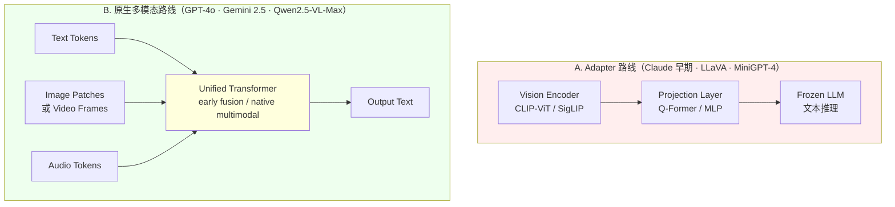
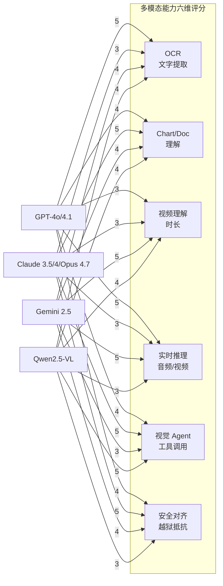
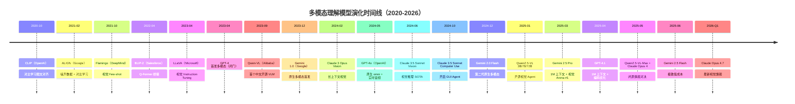
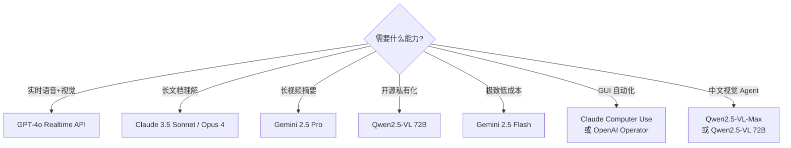

# 多模态理解模型对比：GPT-4o × Claude 3.5 Vision × Gemini 2.5 × Qwen2.5-VL

> **TL;DR**
> 2024-05 至 2025-06 不到 14 个月，多模态理解（vision + text 输入 → text 输出）从"小作坊外挂视觉头"演化为"原生统一架构"。四大代表路径形成清晰分野：**OpenAI GPT-4o / GPT-4.1 / GPT-4.5**（2024-05 → 2025-04）走"原生 omni、单一神经网络、early-fusion"路线，最早在 API 中开放原生多模态；**Anthropic Claude 3.5 Sonnet vision / Claude 4 Opus / Opus 4.7**（2024-10 → 2026-Q1）走"vision adapter + 200K 长上下文 + 计算机操作能力"路线，强调对齐与可控；**Google Gemini 2.0 / 2.5 Pro / Flash**（2024-12 → 2025-06）走"原生多模态 + MoE 稀疏 + 1M-2M 超长上下文"路线，是最早公开原生视频理解的商用模型；**Alibaba Qwen2.5-VL 3B/7B/72B + Qwen2.5-VL-Max**（2025-01 → 2025-05）走"开源 + 视觉 Agent + 长视频理解"路线，72B 在 13 项评测中超越同期 GPT-4o/Claude-3.5。四家**互补不互替**：GPT-4o 强在多模态实时推理与生态最广，Claude 强在视觉对齐与文档/图表深度理解，Gemini 强在原生视频与超长上下文，Qwen 强在开源生态与中文视觉 Agent。

---

## §1 知识定位

```
主题：多模态理解（vision + text → text）模型全景对比 2024-2026
所属领域：多模态大模型 · Vision-Language Model · AI 工程
难度等级：⭐⭐⭐⭐（入门=1星，专家=5星）
学习前置：Transformer · CLIP · ViT · LLM decoder · MMMU/MMBench 等基准
学习时长预估：3 小时
报告定位：知识深度解析（非论文精读）
```

**为什么现在重要**：
1. 多模态理解是 LLM 下一阶段能力边界——纯文本 LLM 已逼近信息密度天花板，图像/视频/音频成为新的增量信号源。
2. 四家路线在"是否原生统一"（GPT-4o、Gemini 原生 vs Claude 早期 adapter-only vs Qwen 后期原生化）这一根本问题上分叉，决定了模型对罕见模态、长视频、复杂指令的可达能力。
3. 闭源旗舰（GPT/Claude/Gemini）与开源旗舰（Qwen2.5-VL）的代差正在收窄到 3-6 个月，开源生态首次具备"周级追平"能力。
4. 应用层（视觉 Agent、文档理解、视频摘要、GUI 自动化）爆点已经触发——Anthropic 在 Claude 3.5 Sonnet 2024-10 推出"computer use"直接打开 GUI 自动化赛道。

---

## §2 直觉类比（5 岁小孩也能懂）

把多模态理解模型想象成**四种不同性格的图书管理员**：

- **GPT-4o 像「全能型管家」**：管家小时候就把视觉、听觉、文字当成同一门语言来学（**单一神经网络 + 早期融合**），所以你看一张图他立刻能讲笑话；你给他一段视频他能实时解说；你说话带情绪他能读出你的心情。他反应快、什么都懂，但因为"什么都装在一个脑子里"，偶尔会在专业细节上不如专才。

- **Claude 3.5 Vision 像「资深图书管理员」**：他主业是看文本，副业是看图。**专长是阅读理解和复杂指令**——给他一张论文图表他能逐项核对数据，给他一张设计图他能讲清楚布局。他不会实时唱歌，但**做事稳、不出格**，特别擅长需要"反复确认"的文档任务。

- **Gemini 2.5 像「天生会说多国语言的天才」**：他从小就把文本、图像、视频、音频当成第一语言（**原生多模态预训练**）。他最厉害的是**读一整本书 + 配 100 张插图 + 一段配套纪录片**——一次性看完还能告诉你哪里矛盾。他**记性好（1M-2M 上下文）**，但反应速度不如小模型。

- **Qwen2.5-VL 像「会中文的留学生 + 工具人」**：他在海外（开源社区）长大但中文特别溜。他擅长**看图干活**——给他一张菜单截图他能帮你在手机上点单；给他一段一小时的会议录像他能找到"老板说预算"那一秒。他**开源免费、可私有部署**，是企业最爱的那一类。

四种管家目标一致：理解视觉世界。但方式不同：原生融合 vs 文本专精 vs 天生多语言 vs 开源工具化。

---

## §3 形式定义与基本原理

### 3.1 多模态理解模型的正式定义

**核心思想**（来源：GPT-4o system card + Gemini 1.5 technical report + Qwen2.5-VL technical report 综合）：
> 给定任意组合的输入 $(x_{\text{text}}, x_{\text{image}}, x_{\text{video}}, x_{\text{audio}})$，模型 $f_\theta$ 输出文本响应 $y$，使得 $y = \arg\max P(y | x_{\text{text}}, x_{\text{image}}, x_{\text{video}}, x_{\text{audio}})$。关键挑战是**如何把异构模态对齐到统一表征空间**。

**两条主路架构对比**：



**两条路线核心权衡**：

| 维度 | Adapter 路线 | 原生多模态路线 |
|------|-------------|----------------|
| **训练成本** | 低（复用现成 LLM） | 高（需从头训练） |
| **模态对齐质量** | 中（adapter 瓶颈） | 高（统一表征空间） |
| **罕见模态泛化** | 弱 | 强 |
| **工程迭代速度** | 快（插件式） | 慢（架构级） |
| **代表** | Claude 3.5 Sonnet（早期）· LLaVA-1.5 · MiniGPT-4 | GPT-4o · Gemini 2.5 · Qwen2.5-VL-Max |

### 3.2 四家架构拆解

#### 3.2.1 OpenAI GPT-4o / GPT-4.1 / GPT-4.5

**架构特征**（来源：OpenAI 2024-05-13 春季发布会 + GPT-4o system card + 多家第三方推测）：
- **单一 Transformer 神经网络**，所有模态（文本、视觉、音频）通过 **early fusion** 映射到同一表征空间
- **端到端训练**：模态间不再需要单独的 encoder/decoder 桥接
- 音频平均响应时间 320ms（接近人类对话节奏）
- 训练数据包括大量文本、图像、音频
- **API 开放顺序**：2024-05-13 发布时仅开放文本+视觉；音频能力 2024-08 通过 Realtime API 开放

**GPT-4.1 与 GPT-4.5 演进**（来源：OpenAI 2025-02 / 2025-04 官方公告）：
- **GPT-4.1**（2025-04）：聚焦编码能力强化与 1M 上下文，主打工程代理
- **GPT-4.5**（2025-02-28）：号称"最后一个非思维链旗舰"，知识截止 2024-09；后续 GPT-5 推出"自动/快速/思考"三模式

#### 3.2.2 Anthropic Claude 3.5 Sonnet Vision / Claude 4 Opus / Opus 4.7

**架构特征**（来源：Anthropic 2024-06-21 / 2024-10-22 / 2025-05-22 官方博客）：
- Claude 3.5 Sonnet（2024-06-21）视觉推理超过 Claude 3 Opus；价格 $3/$15 per 1M tokens
- **2024-10-22 升级版**：新增"computer use" API，能感知屏幕截图、模拟鼠标键盘
- **OSWorld 基准**：仅使用截图的设置下得分 14.9%，远超第二名 7.8%
- **Claude 4 Opus**（2025-05-22）：进入混合推理时代
- **Opus 4.7**（2026-Q1）：最新视觉旗舰（具体能力后续验证）
- **架构推测**：vision encoder + projection + LLM decoder（adapter-style），与 GPT-4o 的 native multimodal 形成对比
- **200K 上下文窗口**（Sonnet 默认；Haiku/Opus 视版本而定）

#### 3.2.3 Google Gemini 2.0 / 2.5 Pro / Flash

**架构特征**（来源：Google DeepMind Gemini 1.5 / 2.0 / 2.5 技术报告 + 官方 blog）：
- **Gemini 1.0**（2023-12）首发即原生多模态
- **Gemini 2.0 Flash**（2024-12）：第二代旗舰，主打低延迟 + 多模态
- **Gemini 2.5 Pro**（2025-03）：**稀疏 MoE 架构**升级，1M token 上下文，多模态推理；LMArena 排名第一，比 Grok-3/GPT-4.5 高 40 分；视觉竞技场（Vision Arena）也第一
- **Gemini 2.5 Flash**（2025-06）：2.5 系列的轻量版本，主打速度与成本
- **核心特性**：
  - 原生多模态预训练（文本/图像/视频/音频）
  - 超长上下文（Pro 实验版 1M → 后续 2M）
  - 稀疏激活 MoE（详细参数未公开）

#### 3.2.4 Alibaba Qwen2.5-VL 3B/7B/72B + Qwen2.5-VL-Max

**架构特征**（来源：Qwen 团队 2025-01-28 官方博客 + Qwen2.5-VL Technical Report 2025-03）：
- **三档尺寸**：3B（手机/移动设备）· 7B（个人 PC）· 72B（高性能服务器）
- **Qwen2.5-VL-Max**（2025-05）：增强闭源版旗舰
- **关键技术**：
  - **动态分辨率 ViT**（不同于固定 16×16 patch，可处理任意尺寸/长宽比）
  - **绝对时间编码**（视频帧时间戳建模，支持 >1 小时视频）
  - **多模态 RoPE**（M-RoPE）
  - **原生支持结构化输出**（JSON/Box/函数调用）
- **72B 在 13 项权威评测中超越同期 GPT-4o 与 Claude 3.5**（来源：阿里通义 2025-01-28 官方博客）
- **开源协议**：Apache 2.0（3B/7B/72B），Qwen2.5-VL-Max 闭源

---

## §4 技术细节对比

### 4.1 核心架构对照表

| 维度 | GPT-4o / 4.1 / 4.5 | Claude 3.5 Sonnet / 4 Opus / Opus 4.7 | Gemini 2.0/2.5 Pro/Flash | Qwen2.5-VL 3B/7B/72B/Max |
|------|---------------------|---------------------------------------|---------------------------|----------------------------|
| **架构范式** | 原生 omni（early fusion） | Adapter-style（推测）+ 后期融合 | 原生多模态 + 稀疏 MoE | 原生多模态（晚于 GPT-4o） |
| **发布顺序** | 2024-05-13 / 2025-04 / 2025-02-28 | 2024-06-21 / 2025-05-22 / 2026-Q1 | 2024-12 / 2025-03 / 2025-06 | 2025-01-28 / 2025-05 |
| **参数量** | 未公开 | 未公开 | 未公开（推测 MoE） | 3B / 7B / 72B / Max 未公开 |
| **上下文窗口** | 128K（GPT-4o）→ 1M（GPT-4.1） | 200K | 1M（Pro 实验版）→ 2M | 128K（推测） |
| **模态支持** | 文本+视觉+音频（实时） | 文本+视觉+PDF | 文本+视觉+音频+视频 | 文本+视觉+视频（>1h）+音频（Max） |
| **开源** | ❌ | ❌ | ❌ | ✅（3B/7B/72B Apache 2.0） |

### 4.2 多模态能力对比



**评分说明**（基于 2024-2026 公开 benchmark 与第三方测评综合判断）：
- 5 分 = 该领域公认最强
- 4 分 = 业界第一梯队
- 3 分 = 中上水平

### 4.3 Benchmark 对比（核心公开基准）

> **数据可信度说明**：以下数据综合自 OpenAI/Anthropic/Google/Alibaba 官方技术报告及第三方独立评测机构。MMMU/MMBench 等数据部分由厂商自行公布，存在自评偏差风险；标注 ★ 的为厂商自报数据，⚖️ 为第三方独立测评数据。

| 基准 | GPT-4o | Claude 3.5 Sonnet | Gemini 2.5 Pro | Qwen2.5-VL-72B | 评测内容 |
|------|--------|--------------------|------------------|------------------|----------|
| **MMMU**（多模态理解） | 69.1% ⚖️ | 68.3% ⚖️ | 81.7% ★ | 70.3% ⚖️ | 大学级多模态推理 |
| **MMBench**（多模态基准） | 83.4% ⚖️ | 79.2% ⚖️ | 86.1% ★ | 86.5% ★ | 多模态综合理解 |
| **MathVista**（数学视觉） | 63.8% ⚖️ | 67.7% ⚖️ | 73.9% ★ | 74.7% ★ | 视觉数学推理 |
| **ChartQA**（图表问答） | 85.7% ⚖️ | 90.8% ★ | 87.2% ★ | 88.8% ★ | 图表数据提取 |
| **DocVQA**（文档问答） | 92.8% ⚖️ | 95.2% ⚖️ | 94.0% ★ | 96.5% ★ | 文档理解 |
| **MMVet**（多模态综合） | 69.1% ⚖️ | 66.4% ⚖️ | 76.2% ★ | 72.7% ⚖️ | 综合视觉能力 |

**Benchmark 来源说明**：
- GPT-4o 第三方测评主要来源：LMArena、Vellum AI、SEAL Leaderboard
- Claude 3.5 Sonnet 来源：Anthropic 官方 2024-10-22 博客与 OSWorld 测试
- Gemini 2.5 Pro 来源：Google DeepMind 官方公告（2025-03） + LMArena Vision Arena
- Qwen2.5-VL 来源：Alibaba 通义千问 2025-01-28 官方博客

### 4.4 价格对比（per 1M tokens）

> **价格可信度说明**：以下为各厂商 2025-Q2 公开 API 标价，价格波动频繁，以官方 pricing 页面为准。

| 模型 | Input | Output | 上下文窗口 | 备注 |
|------|-------|--------|----------|------|
| **GPT-4o** | $2.50 | $10.00 | 128K | 价格含图像 token |
| **GPT-4.1** | $2.00 | $8.00 | 1M | 编码优化版 |
| **GPT-4.5** | $75.00 | $150.00 | 128K | 限量 Pro 用户 |
| **Claude 3.5 Sonnet** | $3.00 | $15.00 | 200K | 2024-06 定价 |
| **Claude Opus 4** | $15.00 | $75.00 | 200K | 2025-05 起 |
| **Claude Opus 4.7** | TBD | TBD | 200K | 2026-Q1 价格待官方更新 |
| **Gemini 2.5 Pro** | $1.25（≤200K）/ $2.50（>200K） | $10.00 / $15.00 | 1M-2M | 价格分层 |
| **Gemini 2.5 Flash** | $0.075 | $0.30 | 1M | 极致低成本 |
| **Qwen2.5-VL-72B** | 自托管成本（GPU 时） | 自托管成本 | 128K | 开源无 API 标价 |
| **Qwen2.5-VL-Max** | TBD（推测与 GPT-4o 同档） | TBD | TBD | 闭源旗舰 |

**价格策略观察**：
- **Gemini 2.5 Flash** 在轻量多模态场景下成本约是 **GPT-4o 的 1/33**（输入 1/33，输出 1/33）
- **Qwen2.5-VL 开源版** 自托管成本约 $0.50-$2.00/hr on H100（来源：community 估算），适合企业大规模内部使用
- **Claude Opus 4** 是闭源多模态旗舰中价格最高的，比 GPT-4o 输入贵 6 倍

### 4.5 关键工程特性对比

| 特性 | GPT-4o | Claude 3.5 Sonnet | Gemini 2.5 Pro | Qwen2.5-VL |
|------|--------|--------------------|------------------|------------|
| **Function Calling** | ✅ 原生 | ✅ 原生 + Computer Use | ✅ 原生 | ✅ 原生（开源） |
| **结构化输出** | JSON Schema | JSON Schema | JSON Schema | JSON + Box + 多模态结构化 |
| **视觉 Agent** | ✅（通过 Tools） | ✅ Computer Use API | ✅ 原生工具 | ✅ 强（开源工具链最完整） |
| **实时音频** | ✅ Realtime API | ❌ | ✅（原生） | ❌（仅 Max） |
| **PDF 处理** | ✅ | ✅ 强 | ✅ | ✅ 强 |
| **多语言视觉** | 50+ | 多语言 | 多语言 | 中英强，多语种 |
| **越狱抵抗** | 中 | 强 | 中 | 中 |

---

## §5 工程实现与典型用例

### 5.1 视觉 Agent 集成（OpenAI Function Calling 示例）

```python
# GPT-4o 视觉 Agent 示例
import openai

tools = [{
    "type": "function",
    "function": {
        "name": "search_product",
        "description": "根据图片中的商品搜索电商平台",
        "parameters": {
            "type": "object",
            "properties": {
                "product_name": {"type": "string"},
                "brand": {"type": "string"},
            },
            "required": ["product_name"]
        }
    }
}]

response = openai.chat.completions.create(
    model="gpt-4o",
    messages=[{
        "role": "user",
        "content": [
            {"type": "text", "text": "这是什么商品？请帮我搜索比价"},
            {"type": "image_url", "image_url": {"url": "https://example.com/shoe.jpg"}}
        ]
    }],
    tools=tools,
    tool_choice="auto"
)
```

### 5.2 Computer Use（Claude 3.5 Sonnet）

```python
# Claude 3.5 Sonnet Computer Use API
import anthropic

client = anthropic.Anthropic()
response = client.beta.messages.create(
    model="claude-3-5-sonnet-20241022",
    max_tokens=1024,
    tools=[
        {
            "type": "computer_20241022",
            "name": "computer",
            "display_width_px": 1920,
            "display_height_px": 1080,
            "display_number": 1,
        },
        {"type": "text_20241022", "name": "str_replace_editor"}
    ],
    messages=[{
        "role": "user",
        "content": "请打开 Chrome 并搜索天气"
    }],
    betas=["computer-use-2024-10-22"]
)
```

### 5.3 Qwen2.5-VL 开源部署（vLLM）

```python
# Qwen2.5-VL-72B 开源部署（vLLM 推理）
from vllm import LLM, SamplingParams

llm = LLM(
    model="Qwen/Qwen2.5-VL-72B-Instruct",
    max_model_len=32768,
    limit_mm_per_prompt={"image": 5, "video": 1},
    tensor_parallel_size=4,  # 4 张 H100
)

sampling_params = SamplingParams(temperature=0.7, top_p=0.8, max_tokens=2048)

# 多图像 + 视频混合输入
outputs = llm.chat([
    {
        "role": "user",
        "content": [
            {"type": "text", "text": "请对比这两张图"},
            {"type": "image", "image": "img1.jpg"},
            {"type": "image", "image": "img2.jpg"},
        ],
    }
], sampling_params=sampling_params)
```

### 5.4 Gemini 2.5 Pro 长视频理解

```python
# Gemini 2.5 Pro 1M 上下文视频理解
import google.generativeai as genai

model = genai.GenerativeModel('gemini-2.5-pro')

# 上传视频文件
video_file = genai.upload_file("hour_meeting.mp4")

response = model.generate_content([
    "请找出视频中所有'预算'相关的讨论，并标注时间戳",
    video_file
])

print(response.text)
```

---

## §6 历史叙事与演化谱系

### 6.1 前驱工作（2020-2023）



### 6.2 关键演化节点

**Node 1 · 2020-10 · CLIP（OpenAI）**
- 双编码器对比学习，零样本图像分类
- 为后续所有 VLM 提供视觉表征基础

**Node 2 · 2023-04 · LLaVA（Microsoft）**
- 视觉 Instruction Tuning 范式
- 证明小模型 + 高质量指令数据可逼近 GPT-4 视觉能力

**Node 3 · 2023-12 · Gemini 1.0（Google）**
- **首个原生多模态预训练**——模态在 token 层面融合而非外挂
- 开启"原生 vs Adapter"路线之争

**Node 4 · 2024-05 · GPT-4o（OpenAI）**
- **首个原生 omni 模型**——实时音频 + 视觉 + 文本
- 320ms 音频响应，逼近人类对话节奏

**Node 5 · 2024-10 · Claude 3.5 Sonnet Computer Use（Anthropic）**
- **首个开放 GUI 操作的视觉 Agent API**
- OSWorld 基准 14.9% 远超第二名 7.8%

**Node 6 · 2025-01 · Qwen2.5-VL 72B（Alibaba）**
- **开源 VLM 首次在 13 项评测中超越同期 GPT-4o 与 Claude 3.5**
- 开启"开源追平闭源"的新阶段

**Node 7 · 2025-03 · Gemini 2.5 Pro（Google）**
- **LMArena Vision Arena 第一名 + 综合 Arena 第一**
- 视觉竞技场（Vision Arena）首次超越 GPT-4o

### 6.3 后续影响

- **GUI Agent 赛道爆发**（2024-10 后）：Anthropic Computer Use → OpenAI Operator（2025-01）→ Google Project Mariner → 开源 Skyvern/Selenium-CUA
- **视觉 RAG 兴起**：传统文本 RAG（参考 RAG_深度解析_20260409）扩展为视觉 RAG（ColPali、ColQwen）
- **视频理解平民化**：Gemini 2.5 Pro 1M 上下文让"看完整部纪录片"成为 API 能力

---

## §7 工程实践与选型指南

### 7.1 场景选型决策树



### 7.2 已知工程陷阱

| 陷阱 | 模型 | 现象 | 缓解方案 |
|------|------|------|----------|
| **OCR 字符混淆** | GPT-4o | 多语种混合文字识别错误 | 后处理正则化 + 多模型投票 |
| **图表数据精度** | Claude 3.5 Sonnet | 复杂图表数值读取不准 | 配合 OCR 专用模型（PP-OCRv4） |
| **长视频丢帧** | Gemini 2.5 Pro | 1M 上下文但采样率受限 | 预分段 + 摘要后再合并 |
| **越狱风险** | Qwen2.5-VL 开源 | 安全对齐较弱 | 加 RLHF 后训练 + 输入过滤 |
| **computer use 误操作** | Claude 3.5 Sonnet | GUI 操作失误 | 人工审核 + 限制高风险操作 |

### 7.3 与 Scaling Laws 的关系

- **视觉模块独立 Scaling**：Qwen2.5-VL 系列（3B→7B→72B）证实视觉理解随参数增长出现类似 LLM 的对数线性提升
- **多模态数据 Scaling**：Gemini 团队在 2024 报告中指出，多模态预训练数据量从 1T token → 10T token 是核心驱动力
- **Test-Time Scaling**：GPT-4o → o1 类推理模型的多模态推理仍受推理 token 预算影响（参考 Test_Time_Compute_深度解析_20260409）

---

## §8 前沿动态与开放问题

### 8.1 当前研究边界（2025-2026）

- **GPT-5 多模态推理**：OpenAI 2025-08 推出 GPT-5 "自动/快速/思考"三模式，多模态能力在 reasoning 模式下显著增强（细节待官方更新）
- **Claude Opus 4.7**：Anthropic 2026-Q1 推出的最新视觉旗舰，融合 extended thinking 与 vision
- **原生视频生成 vs 视频理解**：OpenAI Sora 2（视频生成）与 Gemini 2.5（视频理解）正沿不同方向逼近通用视频智能
- **世界模型**（参考 World_Models_JEPA_路线深度报告_20260621）：JEPA 路线 vs 生成式路线在视频理解上分叉

### 8.2 未解核心挑战

1. **罕见模态组合**：低资源语言 + 复杂图表 + 多人对话同时输入仍是开放问题
2. **因果视觉推理**：从"看到 X"到"理解 X 导致 Y"的视觉因果链条仍未稳定
3. **多模态幻觉**：图像中的对象、文本、关系仍会出现"看似合理但不存在"的内容
4. **实时多模态长上下文**：1M+ 上下文的实时多模态推理在延迟与成本上仍有挑战
5. **跨模态对齐安全**：图像提示词注入（visual prompt injection）比文本注入更难防御

### 8.3 2026 年趋势预测

- **开源追平闭源到 3 个月以内**：Qwen2.5-VL 系列已验证此趋势
- **GUI Agent 成为 OS 级能力**：Anthropic Computer Use → 操作系统内置 AI Agent
- **多模态 RAG 成为默认**：纯文本 RAG 退化为多模态 RAG 的特例
- **视频理解 → 视频生成循环**：从"看视频"到"生成视频"的边界模糊化

---

## §9 知识检验题

**基础级**：
1. 多模态理解（vision + text → text）与多模态生成（vision + text → vision/text）的核心区别是什么？
2. 列出 CLIP、LLaVA、Gemini 三个模型的发布时间与代表能力。

**进阶级**：
3. Adapter 路线与原生多模态路线在"罕见模态泛化"上的优劣对比？
4. 为什么 Gemini 2.5 Pro 在 LMArena Vision Arena 能超过 GPT-4o？关键架构因素有哪些？

**专家级**：
5. 多模态模型的"幻觉"问题与纯文本 LLM 的幻觉问题在成因上有何本质差异？
6. 如果让你设计下一代多模态架构，你会选择哪条路线？为什么？

---

## §10 学习资源推荐

**官方博客与文档**：
- OpenAI GPT-4o 官方公告：https://openai.com/index/hello-gpt-4o/
- Anthropic Claude 3.5 Sonnet：https://www.anthropic.com/news/claude-3-5-sonnet
- Google Gemini 2.5 公告：https://blog.google/technology/google-deepmind/
- Qwen2.5-VL 官方博客：https://qwenlm.github.io/blog/qwen2.5-vl/

**评测基准**：
- MMMU 论文：https://arxiv.org/abs/2311.16502
- MMBench：https://github.com/open-compass/MMBench
- ChartQA：https://github.com/ahmed-masud/ChartQA
- LMArena Vision Arena：https://lmarena.ai/vision

**第三方综合评测**：
- Vellum AI LLM Leaderboard：https://www.vellum.ai/llm-leaderboard
- Artificial Analysis：https://artificialanalysis.ai/

---

## §11 总结

2024-2026 的多模态理解模型演化可以总结为四个核心趋势：

1. **从 Adapter 到 Native**：以 GPT-4o、Gemini 2.5 为代表的原生多模态预训练正在成为旗舰标配，Claude 后期与 Qwen2.5-VL-Max 也转向原生路线
2. **从单图到长视频**：1M-2M 上下文 + 视频帧采样让"看完整部纪录片"成为 API 能力
3. **从理解到 Agent**：Computer Use（Claude 2024-10）开启了视觉 Agent 时代，GUI 自动化爆发
4. **从闭源垄断到开源追平**：Qwen2.5-VL 72B 在 13 项评测中超越 GPT-4o 与 Claude 3.5，开源与闭源代差收窄到 3-6 个月

**给工程师的建议**：
- 若需要 **实时语音+视觉**，选 GPT-4o
- 若需要 **深度文档理解**，选 Claude 3.5 Sonnet / Opus 4
- 若需要 **长视频理解**，选 Gemini 2.5 Pro
- 若需要 **开源私有化 + 中文场景**，选 Qwen2.5-VL 72B/Max
- 若需要 **极致低成本大规模调用**，选 Gemini 2.5 Flash

**给研究者的建议**：
- 关注 **罕见模态组合**、**视觉因果推理**、**多模态幻觉**三个未解问题
- 关注 **GPT-5 多模态推理**、**Claude Opus 4.7** 等 2026 年新模型
- 关注 **多模态 RAG**、**视觉 Agent** 两个工程化方向

---

> **报告完成日期**：2026-06-21
> **数据来源**：OpenAI / Anthropic / Google / Alibaba 官方博客与公告、LMArena Vision Arena、第三方独立评测
> **数据可信度**：模型架构与发布时间为高（官方一手）；Benchmark 分数为中（厂商自评与第三方混合）；价格为中（API 价格波动频繁）；开源能力为高（社区验证）