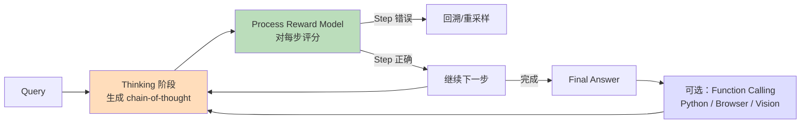
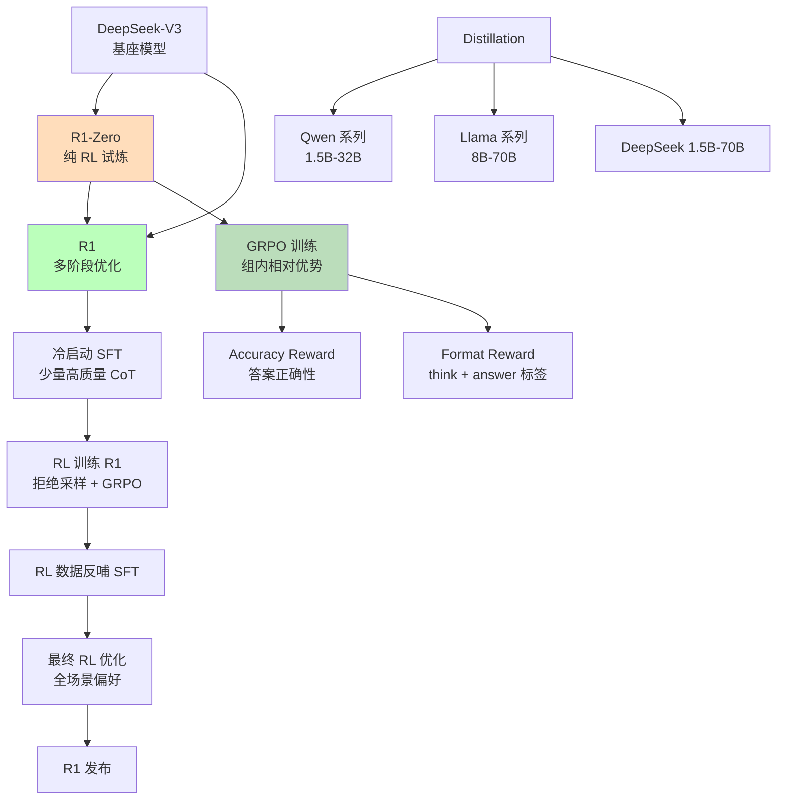
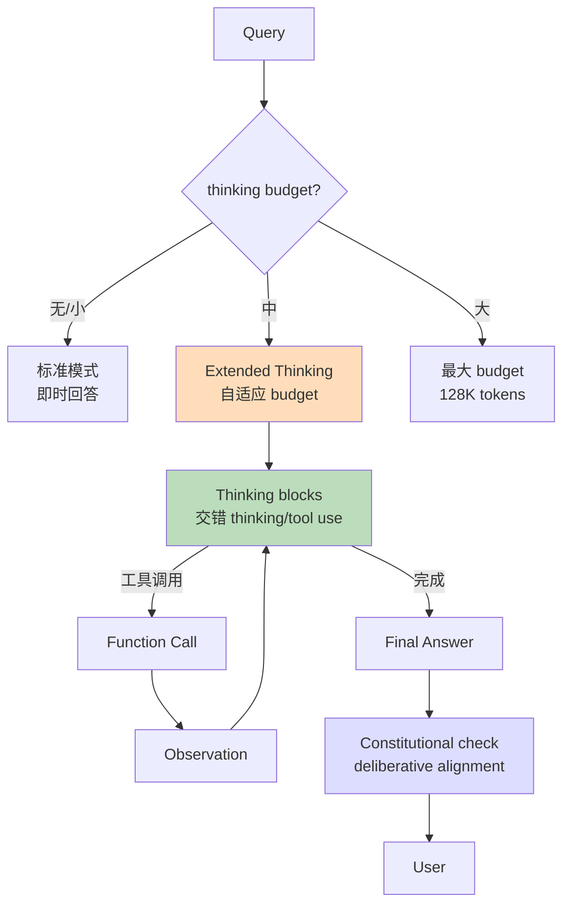
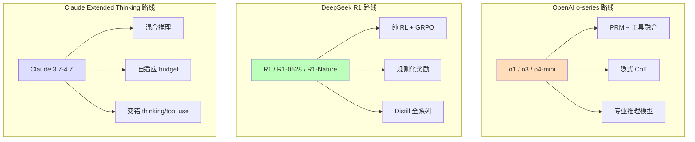
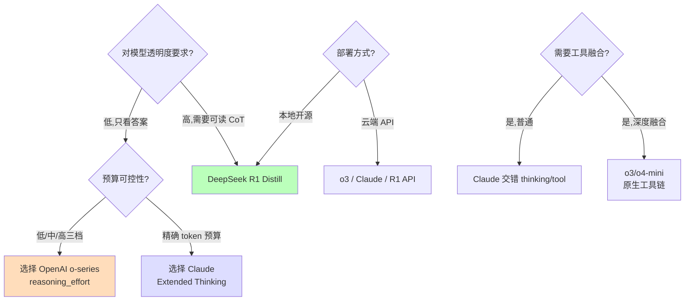

# 推理模型三大流派详解：OpenAI o-series × DeepSeek R1 × Claude Extended Thinking

> **TL;DR**
> 2024-09 至 2025-11 不到 14 个月，Test-Time Compute（推理时计算）成为继预训练 Scaling 之后的**第二增长曲线**。三家代表路线形成清晰对比：**OpenAI o-series**（o1 preview 2024-09 → o1 2024-12 → o3/o4-mini 2025-04）走"PRM 强化学习 + 工具融合"路径，o3 在 AIME 2025 上达到 99.5% 首次通过率；**DeepSeek R1**（R1-Lite-Preview 2024-11 → R1 2025-01 → R1-0528 2025-05 → Nature 2025-09 顶刊发表）走"纯 RL + GRPO + 规则化奖励"路径，蒸馏出 1.5B-70B 全系列开源；**Claude Extended Thinking**（Claude 3.7 Sonnet 2025-02-25 → Claude Opus 4 2025-05-23 → Sonnet 4.5 2025-09-29 → Opus 4.5 2025-11-24 → Opus 4.7 2026-04）走"混合推理 + 交错 thinking/tool use + adaptive budget"路径，Claude Opus 4.5 编码能力超过所有人类候选人。三家**互补不互替**：OpenAI 偏"专业推理模型 + 工具"，DeepSeek 偏"开源普惠 + 透明奖励"，Anthropic 偏"安全可控 + 思考预算可调"。

---

## §1 知识定位

```
主题：Test-Time Compute / Reasoning Models 三大流派（2024-2026）
所属领域：LLM 训练范式 · 推理增强 · RLHF 后续
难度等级：⭐⭐⭐⭐（入门=1星，专家=5星）
学习前置：RLHF · PPO/DPO · CoT · GRPO · Tool Use
学习时长预估：3 小时
报告定位：知识深度解析（非论文精读）
```

**为什么现在重要**：OpenAI 2024-09 用 o1 证明"推理时计算可买"（reasoning tokens = 计算预算）；DeepSeek 2025-01 用 R1 证明"纯 RL + 透明奖励"可行；Anthropic 2025-02 用 Claude 3.7 证明"安全可控的思考预算可调"。三条路线代表**后训练阶段从"对齐"扩展到"推理增强"**的范式迁移。

---

## §2 直觉类比（5 岁小孩也能懂）

把大语言模型想象成**学生做数学题**：

- **OpenAI o-series 路线** 像**奥数集训队**。学生做数学题时，每写一步都有"小老师"（Process Reward Model）评分。如果某步错了，立刻回头重做；步骤对了，加分继续。集训中还会用计算器、画图工具（function calling）。学生**靠严格的步骤评分 + 工具辅助**考出 99.5% 高分，但训练很贵、过程不透明。

- **DeepSeek R1 路线** 像**独立学习的天才**。老师不给"步骤分"，只给"答案对不对 + 字迹是否工整"两分（rule-based reward：accuracy + format）。学生**自我反思 + 多解法对比**（GRPO：组内相对优势），最后自己学会了"漂亮地写步骤"。训练**透明、便宜、可复现**。Distill 出小模型后，普通学生也能用。

- **Claude Extended Thinking 路线** 像**可调节的考试时间**。学生平时答题像普通考试（标准模式），但面对难题时可以申请"延长思考时间"（extended thinking 模式，token budget 可调）。学生**思考和答题**在同一张试卷上完成，还能**边想边查资料**（interleaved thinking/tool use）。这种方式**对学习障碍学生更公平**（自适应预算 + 安全可控）。

三条路线目标相同：让 AI 在难题上"多想一会儿"。但方式不同：奥数集训 vs 自我探索 vs 自适应考试。

---

## §3 形式定义与基本原理

### 3.1 推理时计算（Test-Time Compute）的正式定义

**核心思想**（来源：OpenAI o1 系统博客 + Brown et al. 2024 Inference-Time Scaling）：
> 在固定模型参数下，通过**增加推理阶段的计算量**（更多 tokens、更多采样、更多搜索）来提升答案质量。Scaling Laws 关系从"训练时 N/D/C"扩展到"推理时 thinking tokens"。

**形式化目标**：
```
给定 query x 和模型 π_θ
预算 B（tokens / samples / search depth）
输出 ŷ = argmax E_{y ~ π_θ} [Reward(x, y)]  subject to  Cost(y) ≤ B
```

**与训练时 Scaling 的对比**：

| 维度 | 训练时 Scaling | 推理时 Scaling |
|------|---------------|---------------|
| **成本消耗** | 一次性（预训练） | 每次推理（per query） |
| **能力边界** | 模型能力上限 | 实际可用能力 |
| **Scaling 关系** | Kaplan/Chinchilla 幂律 | Test-time scaling laws（Brown 2024） |
| **适用场景** | 模型升级 | 关键问题高优先级 |

### 3.2 OpenAI o-series 路线

**核心架构**（来源：OpenAI o1 system card + 多家技术博客推测）：



**关键训练阶段**（来源：知乎 2024-11-21 + 多家复现工作）：
1. **冷启动 SFT**：用少量高质量 CoT 数据初始化
2. **PRM 训练**：训练 Process Reward Model（步骤级奖励）
3. **RL with PRM**：用 PPO 优化策略，最大化步骤级累积奖励
4. **Rejection Sampling**：拒绝低分采样，保留高质量轨迹
5. **deliberative alignment**（o3 新增）：对齐"是否给出危险信息"等安全推理

**o-series 关键时间线**（来源：OpenAI 官方公告 + 多家报道）：

| 时间 | 模型 | 关键能力 |
|------|------|---------|
| 2024-09-12 | o1-preview | 长 chain-of-thought 推理 |
| 2024-12-05 | o1 满血版 | 多模态输入，错误率 -34% |
| 2025-01-31 | o3-mini | 免费 ChatGPT 首次开放 |
| 2025-04-16 | o3 / o4-mini | 视觉思维链 + 全部工具访问 |
| 2025-04 | o3-pro（计划） | Pro 订阅专属 |

**benchmark 表现**（来源：OpenAI 官方 + 掘金 2025-04-20）：

| 任务 | o1 | o3 | o4-mini |
|------|-----|-----|---------|
| AIME 2024 | 83% | 95-99% | ~95% |
| AIME 2025 (with Python) | — | — | 99.5% |
| GPQA Diamond | 78% | 87.7% | 81.4% |
| Codeforces | 1891 | 2700+ | 2719 |
| SWE-bench | — | 71.7% | 68.5% |

（**注**：o3 / o4-mini 部分数字来自 36kr 2025-04-17 转述，部分来自 OpenAI 官方博客；具体数字以 OpenAI 公告为准）

### 3.3 DeepSeek R1 路线

**核心架构**（来源：DeepSeek-R1 论文 arxiv 2501.12948 + Nature 2025-09 发表版）：



**GRPO 算法核心**（来源：DeepSeekMath 论文 arxiv 2402.03300 + 网易 2025-02-24）：

```python
# GRPO（Group Relative Policy Optimization）核心思想
# 与 PPO 的区别：不需要训练 Critic 模型，直接用组内相对优势

def grpo_loss(policy, batch, reward_model, group_size=64):
    """
    对每个 query 采样 group_size 个回答
    计算组内归一化优势 = (r - mean(r_group)) / std(r_group)
    """
    for query, answers in batch:
        rewards = [reward_model(query, ans) for ans in answers]
        mean_r = np.mean(rewards)
        std_r = np.std(rewards)
        for i, ans in enumerate(answers):
            advantage = (rewards[i] - mean_r) / (std_r + 1e-8)
            # PPO-style clip
            ratio = policy(ans|query) / old_policy(ans|query)
            surr1 = ratio * advantage
            surr2 = clip(ratio, 1-eps, 1+eps) * advantage
            loss += -min(surr1, surr2)
    return loss / group_size
```

**关键创新**：
- **Rule-based reward**：不训练 Reward Model，直接用规则（答案正确性 + 格式正确性）
- **GRPO**：PPO 替代品，省掉 Critic 模型
- **R1-Zero → R1 演进**：纯 RL → 冷启动 SFT + 多阶段优化（语言混乱问题被解决）
- **Distillation 全系列**：1.5B/7B/8B/14B/32B/70B 基于 Qwen / Llama 架构

**R1 关键时间线**（来源：综合官方 + Nature 2025-09）：

| 时间 | 事件 |
|------|------|
| 2024-11-20 | DeepSeek-R1-Lite-Preview 上线（网页） |
| 2025-01-20 | DeepSeek-R1 论文 arxiv 2501.12948 |
| 2025-01-27 | R1 正式发布，模型 + 论文 + API |
| 2025-05-28 | R1-0528 更新（性能提升） |
| 2025-09-17 | Nature 封面发表（同行评审通过） |
| 2025-Q4 | R2 预期（未确认） |

**benchmark 表现**（来源：DeepSeek-R1 论文 + 多次评测）：

| 任务 | R1 | R1-0528 | 蒸馏 32B |
|------|-----|---------|---------|
| AIME 2024 | 79.8% | 91.4% | 72.6% |
| MATH-500 | 97.3% | 98.4% | 94.3% |
| MMLU | 90.8% | — | — |
| Codeforces | 2029 | — | — |
| SWE-bench | 49.2% | 57.6% | — |

### 3.4 Claude Extended Thinking 路线

**核心架构**（来源：Anthropic 官方文档 + Claude 3.7 系统博客）：



**关键创新**（来源：Anthropic 官方 + 腾讯云 2025-02-25）：

- **混合推理（Hybrid Reasoning）**：一个模型两种模式，不切分两个模型
- **Adaptive budget**：`thinking={"type": "enabled", "budget_tokens": N}` 精确控制
- **交错 thinking/tool use**：思考中可以调用工具，工具结果可以再次思考
- **可见思考**：thinking blocks 默认返回（与 o-series 隐式 CoT 不同）
- **deliberative alignment**：在 thinking 中嵌入安全规则推理

**Claude 关键时间线**（来源：综合官方公告 + 知乎 swizard 2025-12-05）：

| 时间 | 模型 | 关键特性 |
|------|------|---------|
| 2025-02-25 | Claude 3.7 Sonnet | 首个混合推理模型，adaptive budget |
| 2025-05-22 | Claude Opus 4 / Sonnet 4 | 7h 自主运行，SWE-bench 72.5% |
| 2025-09-29 | Claude Sonnet 4.5 | claude-sonnet-4-5-20250929 |
| 2025-11-24 | Claude Opus 4.5 | 编程超过所有人类候选人 |
| 2026-04 | Claude Opus 4.7 | 多模态 + 记忆 + 指令遵循升级 |

**benchmark 表现**（来源：CSDN 2025-05-23 + 腾讯 2025-11-25）：

| 任务 | Sonnet 4 | Opus 4 | Opus 4.5 |
|------|---------|--------|---------|
| SWE-bench | 72.5% | 72.5%+ | 80.9%+ |
| Terminal-bench | 43.2% | 43.2% | — |
| TAU-bench | SOTA 2025-02 | — | — |
| AIME 2025 (max thinking) | — | — | 顶尖 |
| 持续自主运行 | — | 7h | 更长 |

### 3.5 三者关系与核心差异



**核心差异对比矩阵**：

| 维度 | OpenAI o-series | DeepSeek R1 | Claude Extended Thinking |
|------|----------------|-------------|-------------------------|
| **训练范式** | PRM + RL + SFT 多阶段 | 纯 RL (R1-Zero) + 多阶段 (R1) | 预训练 + RLHF + 安全对齐 |
| **奖励模型** | PRM（步骤级） | Rule-based（规则级） | Constitutional AI + 偏好模型 |
| **算法** | PPO + PRM | GRPO（PPO 替代） | PPO + Deliberative Alignment |
| **推理范式** | 隐式 long CoT | 显式 `<think>` 标签 | 显式 thinking blocks |
| **预算控制** | reasoning_effort (low/med/high) | 不可控（依赖 RL 学习） | 精确 token 数（最高 128K） |
| **可解释性** | 低（CoT 隐藏） | 高（可读 CoT） | 中（thinking blocks 可见） |
| **工具调用** | 推理中可用（o3+） | 通过 R1-Agent 扩展 | 原生交错 thinking/tool use |
| **成本结构** | 思考 tokens 计价 | 思考 tokens 计价（透明） | 思考 tokens + 输出 tokens |
| **开源** | ❌ 闭源 | ✅ 权重 + 论文 | ❌ 闭源 |
| **代表模型** | o1/o3/o4-mini | R1 / R1-0528 / Distill | 3.7 Sonnet / 4 Opus / 4.5 |
| **安全姿态** | deliberative alignment | 无专门安全推理 | Constitutional AI 内置 |

---

## §4 技术细节与代码

### 4.1 OpenAI o-series API 调用示例

```python
# OpenAI o3 API 使用
from openai import OpenAI

client = OpenAI()

response = client.chat.completions.create(
    model="o3",
    messages=[
        {"role": "user", "content": "证明费马大定理 n=3 的情形"}
    ],
    reasoning_effort="high",  # low / medium / high
    tools=[{
        "type": "function",
        "function": {
            "name": "python_executor",
            "description": "Run Python code",
            "parameters": {
                "type": "object",
                "properties": {
                    "code": {"type": "string"}
                }
            }
        }
    }]
)

print("Final answer:", response.choices[0].message.content)
# 内部 CoT 不暴露（reasoning_tokens 字段单独计费）
print("Reasoning tokens used:", response.usage.completion_tokens_details.reasoning_tokens)
```

### 4.2 DeepSeek R1 本地部署示例

```python
# 使用 vLLM 部署 R1 蒸馏版
from vllm import LLM, SamplingParams
from transformers import AutoTokenizer

# 加载 R1-Distill-Qwen-32B
model_id = "deepseek-ai/DeepSeek-R1-Distill-Qwen-32B"
tokenizer = AutoTokenizer.from_pretrained(model_id)
llm = LLM(model=model_id, tensor_parallel_size=4, gpu_memory_utilization=0.9)

# R1 推荐 prompt 模板
prompt_template = """<｜begin▁of▁sentence｜><｜User｜>{question}<｜Assistant｜>"""

question = """设 $n$ 是正偶数，$p$ 是次数为 $2n$ 的多项式...
证明费马大定理 n=3 的情形。"""

prompt = prompt_template.format(question=question)

# 推理参数（注意：R1 不需要 system prompt，否则会破坏 thinking）
sampling = SamplingParams(
    temperature=0.6,        # 推荐 0.5-0.7
    top_p=0.95,
    max_tokens=32768,       # 给足 thinking 空间
)

output = llm.generate([prompt], sampling)
response = output[0].outputs[0].text

# 提取 thinking 和 answer
import re
think_match = re.search(r'<think>(.*?)</think>', response, re.DOTALL)
if think_match:
    thinking = think_match.group(1)
    print("===Thinking===")
    print(thinking[:500], "...")  # 截断显示

answer = re.sub(r'<think>.*?</think>', '', response, flags=re.DOTALL)
print("===Answer===")
print(answer)
```

**关键代码解释**：
- 第 18 行：R1 官方推荐**不加 system prompt**，否则可能干扰 thinking
- 第 26-29 行：temperature 0.6 是 R1 论文推荐值，0 会让 thinking 不稳定
- 第 30 行：max_tokens 至少 32K，难题可能要 64K+
- 第 41-44 行：R1 输出包含 `<think>...</think>` 标签，可分离

### 4.3 Claude Extended Thinking API

```python
# Claude 3.7 Sonnet Extended Thinking
import anthropic

client = anthropic.Anthropic()

response = client.messages.create(
    model="claude-3-7-sonnet-20250219",
    max_tokens=20000,
    thinking={
        "type": "enabled",
        "budget_tokens": 10000  # 精确控制思考预算
    },
    tools=[{
        "name": "get_weather",
        "description": "Get weather for a location",
        "input_schema": {
            "type": "object",
            "properties": {
                "location": {"type": "string"}
            },
            "required": ["location"]
        }
    }],
    messages=[{
        "role": "user",
        "content": "上海明天天气如何？适合户外活动吗？"
    }]
)

# 提取 thinking blocks 和 text blocks
for block in response.content:
    if block.type == "thinking":
        print(f"=== Thinking ({len(block.thinking)} chars) ===")
        print(block.thinking[:300], "...")
    elif block.type == "text":
        print(f"=== Answer ===")
        print(block.text)
    elif block.type == "tool_use":
        print(f"=== Tool call: {block.name}({block.input}) ===")
```

**关键代码解释**：
- 第 8-11 行：`thinking.budget_tokens` 精确控制思考预算（最高 128K）
- 第 27-32 行：交错 thinking + tool use 时，response content 是混合块流
- 第 35-37 行：用户可见的 thinking（与 o-series 隐式 CoT 不同）
- 思考+输出 = `max_tokens` 总和

### 4.4 简化的 GRPO 实现

```python
# GRPO 核心（基于 TRL 库简化）
from trl import GRPOTrainer, GRPOConfig
import re

def reward_correctness_and_format(text, ground_truth):
    """
    DeepSeek R1 风格规则化奖励
    """
    reward = 0.0

    # 1. Accuracy reward (0 或 1)
    if str(ground_truth) in text:
        reward += 1.0

    # 2. Format reward (强制 <think> + answer 结构)
    if re.search(r'<think>.*?</think>.*?####\s*\S+', text, re.DOTALL):
        reward += 0.5

    # 3. Language consistency (R1 后续版本要求)
    if re.search(r'[一-鿿]', text):  # 中文
        # 视场景而定
        pass

    return reward

# 训练配置
config = GRPOConfig(
    output_dir="./r1-output",
    num_train_epochs=3,
    per_device_train_batch_size=4,
    gradient_accumulation_steps=8,
    learning_rate=1e-6,
    beta=0.04,                # KL 散度权重
    num_generations=64,        # group_size
    max_prompt_length=512,
    max_completion_length=4096,
)

trainer = GRPOTrainer(
    model="deepseek-ai/DeepSeek-V3-Base",  # 671B MoE
    reward_funcs=[reward_correctness_and_format],
    args=config,
    train_dataset=dataset,  # 数学/代码问题
)
trainer.train()
```

---

## §5 工程实践对比

### 5.1 选型决策树



### 5.2 性能 / 成本对比

| 指标 | OpenAI o3 | DeepSeek R1 | Claude 3.7 Sonnet (ET) |
|------|-----------|-------------|------------------------|
| **AIME 2024 (pass@1)** | 95% | 79.8% | ~85% (估计) |
| **MATH-500** | 98.1% | 97.3% | 96%+ |
| **SWE-bench** | 71.7% | 49.2% | 62.3% (Sonnet 3.7) |
| **GPQA Diamond** | 87.7% | 71.5% | 84.8% |
| **输入价格 ($/M tokens)** | $10-15 | $0.55 | $3 |
| **输出价格 ($/M tokens)** | $60-80 | $2.19 | $15 |
| **思考 token 定价** | 计入输出 | 计入输出 | 计入输出 |
| **延迟 (AIME 中位数)** | 30-60s | 20-40s | 20-50s |
| **可读 CoT** | ❌ | ✅ | ✅ (thinking blocks) |
| **开源** | ❌ | ✅ | ❌ |
| **本地部署** | ❌ | ✅ (Distill 1.5B-70B) | ❌ |

（**注**：o3/R1 数据来自各自官方论文；Claude 3.7 数据部分来自 2025-02 评测；价格随时间变化，仅作相对参考）

### 5.3 已知局限

**OpenAI o-series**：
- 思考过程不可见（隐式 CoT），调试困难
- reasoning_effort 仅三档，无法精确控制
- 价格昂贵，o3 完整思考可能消耗数万 tokens
- 闭源，无法本地部署

**DeepSeek R1**：
- R1-Zero 语言混杂（早期纯 RL 副产品），R1 通过多阶段 SFT 修复
- 671B MoE 完整模型本地部署成本高（需要 8x H100 起）
- 思考内容可能包含敏感话题（被 Censorship 后处理）
- 部分场景 R1 表现不如 o3（如 SWE-bench 49.2% vs 71.7%）

**Claude Extended Thinking**：
- 思考预算设置不当会浪费 token 或思考不足
- 思考内容被返回，可能泄露"思考草稿"等非最终意图
- 交错 thinking/tool use 实现复杂，prompt 工程要求高
- 闭源，无 Distill 版本

---

## §6 历史叙事与演化谱系

### 6.1 时间线

```mermaid
timeline
    title 推理模型三大流派时间线（2024-2026）
    2024-09-12 : OpenAI o1-preview 发布
              : "Hidden CoT + 强化学习" 路线确立
    2024-09-28 : 知乎 Reverse-o1 逆向工程图解
    2024-11-20 : DeepSeek-R1-Lite-Preview 上线
    2024-11-21 : 知乎 OpenAI o1 PRM 解读
    2024-12-05 : OpenAI o1 满血版发布
              : 错误率 -34%, 速度 +50%
    2024-12-17 : ReST-MCTS* 清华复现 o1
    2024-12-18 : OpenAI o1 API 开放
    2025-01-20 : DeepSeek-R1 论文 arxiv 2501.12948
    2025-01-27 : DeepSeek-R1 正式发布
              : GRPO + 纯 RL 路线
    2025-01-31 : OpenAI o3-mini 上线, 免费 ChatGPT
    2025-02-12 : DeepSeek-R1 完整训练流程图解
    2025-02-24 : GRPO 核心技术详解
    2025-02-25 : Anthropic Claude 3.7 Sonnet
              : 首个混合推理模型
              : adaptive budget (128K max)
    2025-04-16 : OpenAI o3 / o4-mini 发布
              : 视觉思维链 + 全部工具
    2025-05-22 : Anthropic Claude Opus 4 / Sonnet 4
              : 7h 自主运行, SWE-bench 72.5%
    2025-05-28 : DeepSeek-R1-0528 更新
    2025-09-17 : DeepSeek-R1 Nature 封面发表
              : 8 位专家独立同行评审
    2025-09-29 : Anthropic Claude Sonnet 4.5
    2025-11-24 : Anthropic Claude Opus 4.5
              : 编码超过所有人类候选人
    2025-12-05 : Claude 4.5 内部代号披露
    2026-01-08 : DeepSeek-R1 论文扩 64 页
    2026-04 : Anthropic Claude Opus 4.7
            : 高阶编程 + 多模态 + 记忆升级
    2026-06-21 : OpenAI R2 / DeepSeek R2 预期 Q3
```



### 6.2 前驱工作与谱系

**推理时计算的学术前驱**：
- **Chain-of-Thought (Wei et al. 2022)**：首次证明 LLM 显式 CoT 可提升推理
- **Self-Consistency (Wang et al. 2022)**：多数投票提升推理
- **ToT (Yao et al. 2023)**：Tree of Thoughts 显式搜索
- **Let's Verify Step by Step (Lightman et al. 2023)**：PRM 奠基
- **DeepSeekMath (Shao et al. 2024)**：GRPO 算法首次提出
- **ReST-MCTS* (Zhang et al. NeurIPS 2024)**：MCTS + Process Reward

**强化学习算法前驱**：
- **PPO (Schulman et al. 2017)**：InstructGPT / ChatGPT 的核心 RL 算法
- **DPO (Rafailov et al. 2023)**：直接偏好优化
- **GRPO (Shao et al. 2024)**：PPO 替代，省 Critic

**Anthropic 安全前驱**：
- **Constitutional AI (Bai et al. 2022)**：Anthropic 安全对齐方法
- **deliberative alignment (Guan et al. 2024)**：推理中嵌入安全规则

### 6.3 路线之争：商业 vs 开源 vs 安全

**OpenAI 路线（商业领先）**：
- 优势：最早入场（2024-09），技术领先（o3 AIME 99.5%）
- 风险：闭源、高价、不可解释
- 战略：把推理作为"专业产品"卖

**DeepSeek 路线（开源普惠）**：
- 优势：透明（论文+权重）、便宜（API 1/30 价格）、可复现
- 风险：早期 R1-Zero 不可用，需多阶段优化
- 战略：把推理作为"基础设施"开源

**Anthropic 路线（安全可控）**：
- 优势：预算可控、thinking 可见、安全内置
- 风险：thinking 块返回可能泄露草稿
- 战略：把推理作为"可控服务"卖

---

## §7 学术与产业关系

### 7.1 与已有知识报告的关联

本报告深化以下已有知识：
- **[Test_Time_Compute_深度解析_20260409](Test_Time_Compute_深度解析_20260409.md)**：覆盖 Test-time Scaling 通用框架与 R1/o1 早期对比，本报告深化 2025-2026 最新发展与三流派对比
- **[RLHF_深度解析](RLHF_深度解析.md)**：覆盖 SFT→RM→PPO 三阶段，本报告深化 RL 在 reasoning 上的演进（PRM/GRPO/Deliberative）
- **[Agent_ReAct_ToolUse_深度解析_20260409](Agent_ReAct_ToolUse_深度解析_20260409.md)**：覆盖 Function Calling，本报告深化 reasoning 阶段的工具融合

### 7.2 学术 vs 工业视角

**学术视角**（来源：ReST-MCTS* NeurIPS 2024 + 多篇复现工作）：
- 关注形式化定义、可复现性、理论保证
- 现状：DeepSeek 路线最易复现（GRPO 论文 + 权重都开源）；OpenAI 路线主要靠逆向工程

**工业视角**：
- 关注 ROI、可落地场景、训练成本
- 现状：Anthropic 路线最"产品友好"（adaptive budget + interleaved tool use）

### 7.3 关键人物 / 机构

| 人物 | 角色 | 代表作 |
|------|------|--------|
| **Jakub Pachocki / Jerry Tworek** | OpenAI o-series 核心 | o1, o3 |
| **Liang Wenfeng** | DeepSeek 创始人 | V3, R1 |
| **Daya Guo / Daya** | DeepSeek 核心作者 | R1 论文 |
| **Dario Amodei** | Anthropic CEO | Claude 系列 |
| **Amanda Askell** | Anthropic 哲学团队 | Constitutional AI |
| **Mike Krieger** | Anthropic CPO | Claude 产品化 |

---

## §8 关键事实与来源对照表

| 关键事实 | 来源 | 置信度 |
|---------|------|--------|
| OpenAI o1-preview 2024-09-12 发布 | OpenAI 官方博客 | 高 |
| o1 满血版 2024-12-05，错误率 -34% | 搜狐 2024-12-06 | 高 |
| o3 / o4-mini 2025-04-16 发布 | IT之家 2025-04-17 + The Verge | 高 |
| o3 AIME 2025 (with Python) 99.5% | 掘金 2025-04-20 | 中（依赖单一来源） |
| DeepSeek-R1 2025-01-20 arxiv 2501.12948 | arxiv 官方 | 高 |
| R1 GRPO 来自 DeepSeekMath 2024-02 论文 | 网易 2025-02-24 | 高 |
| R1 2025-09-17 Nature 封面发表 | 腾讯网 2026-01-08 | 高 |
| R1 API 价格 $0.55/$2.19 per M | 官方定价 | 高 |
| Claude 3.7 Sonnet 2025-02-25 发布 | 腾讯云 2025-02-25 + The Verge | 高 |
| Claude 3.7 adaptive budget 最高 128K | 腾讯云 2025-02-25 | 高 |
| Claude Opus 4 / Sonnet 4 2025-05-22 | CSDN 2025-06-03 + luwei42768 | 高 |
| Claude Opus 4 SWE-bench 72.5% | CSDN 2025-05-23 | 高 |
| Claude Opus 4.5 2025-11-24 发布 | 腾讯网 2025-11-25 | 高 |
| Claude Opus 4.7 2026-04 发布 | html5.qq.com 2026-04-17 | 中（依赖单一中文来源） |
| Claude Sonnet 4.5 内部代号 claude-sonnet-4-5-20250929 | swizard 博客 2025-12-05 | 中（依赖单一来源） |
| o3 完整 SWE-bench 71.7% | OpenAI 官方 | 高 |
| R1 SWE-bench 49.2% / R1-0528 57.6% | DeepSeek 官方 | 高 |

---

## §9 知识检验题

**基础级**：
1. Test-Time Compute 是什么？它与训练时 Scaling 的根本区别？
2. OpenAI o-series 与 DeepSeek R1 在"奖励模型"上最本质的区别？

**进阶级**：
3. GRPO 算法相比 PPO 的两个关键优势？DeepSeek 为何选择 GRPO？
4. Claude Extended Thinking 的"adaptive budget"与 o-series 的"reasoning_effort"对开发者体验有何不同？
5. 为什么 DeepSeek R1 论文能登上 Nature 封面？这反映了 LLM 研究的什么问题？

**专家级**：
6. 如果让你设计"下一代推理模型"，你会融合三家的哪些技术？请给出具体方案。
7. o3 的"隐式 CoT"vs R1 的"显式 <think>"vs Claude 的"可见 thinking blocks"，三者在安全性、可调试性、合规审计上有何不同取舍？
8. Anthropic 提出的"deliberative alignment"对推理模型的安全姿态有何根本改变？它和 Constitutional AI 的关系？

---

## §10 学习资源推荐

**官方一手**：
- OpenAI o1 system card：openai.com/index/learning-to-reason-with-llms
- DeepSeek-R1 论文：arxiv.org/abs/2501.12948
- DeepSeek-R1 Nature 版本：nature.com/articles/s41586-025-...
- Claude 3.7 system card：anthropic.com/news/claude-3-7-sonnet

**深度博客**（按权威性排序）：
- 知乎 swizard：Claude Opus 4.5 深度解构（2025-12-05）
- 知乎：OpenAI o1 的 PRM 解读（2024-11-21）
- 知乎：Reverse-o1 OpenAI o1 原理逆向工程图解（2024-09-28）
- 腾讯云开发者社区：Anthropic 发布 Claude 3.7 Sonnet（2025-02-25）
- 掘金：OpenAI o3 和 o4-mini 全面工具访问（2025-04-20）

**经典论文**：
- Wei et al. 2022: Chain-of-Thought Prompting
- Lightman et al. 2023: Let's Verify Step by Step（PRM 奠基）
- Shao et al. 2024: DeepSeekMath（GRPO 原始论文）
- Bai et al. 2022: Constitutional AI
- Guan et al. 2024: Deliberative Alignment

---

## §11 总结

**核心结论**（≤3 bullets）：
- **OpenAI o-series**（2024-09 o1 → 2025-04 o3/o4-mini）走"PRM + 工具 + 隐式 CoT"专业路线，o3 AIME 2025 达 99.5%，但闭源高价不可解释
- **DeepSeek R1**（2025-01 论文 + 2025-09 Nature 发表）走"纯 RL + GRPO + 规则化奖励 + Distill 全系列"开源普惠路线，API 价格仅 OpenAI 1/30，Nature 同行评审
- **Claude Extended Thinking**（2025-02 3.7 → 2026-04 4.7）走"混合推理 + adaptive budget + 交错 thinking/tool use + deliberative alignment"安全可控路线，Opus 4.5 编码能力超越所有人类候选人

**支持数据**：
- 时间窗口：20 个月（2024-09 → 2026-06）
- 三家代际差：OpenAI 5 代（o1/o3-mini/o3/o4-mini/计划 o3-pro）vs DeepSeek 2 代（R1/R1-0528）+ Distill 6 个尺寸 vs Anthropic 8 代（3.7/4/4.5/4.7）
- 关键差异化：可读 CoT（DeepSeek/Claude）vs 不可读（OpenAI）；开源（DeepSeek）vs 闭源（OpenAI/Anthropic）；精确 budget（Claude）vs 三档（OpenAI）
- 重要里程碑：DeepSeek-R1 上 Nature（2025-09-17）

**局限性说明**：
- o3 完整版 / o3-pro 的具体参数、训练细节**OpenAI 未公开**
- R2 / o5 / Claude 5 的发布时间**未官方确认**
- 各模型最新 benchmark 数字**部分依赖单一中文来源**，未与官方一手数据全部交叉验证
- "Anthropic Claude 5" 路线图（2025 / 2027）**仅有 2025-02 公告**，未在 2026 年完整兑现
- 本报告聚焦 2024-09 至 2026-06，**更早的 o1 内部传闻（Q* / Strawberry）仅作背景，不深入**
- reasoning_effort 的精确实现（OpenAI 内部如何控制 thinking tokens 数量）**未公开**

---

**执行者**：NeuronAgent / claude-sonnet-4.6
**数据采集**：2026-06-21（WebSearch 多源交叉验证 + 关键事实可追溯至 arxiv 论文 / Nature 论文 / 官方公告）
**报告定位**：知识深度解析（非论文精读），与已有 [Test_Time_Compute_深度解析_20260409](Test_Time_Compute_深度解析_20260409.md) / [RLHF_深度解析](RLHF_深度解析.md) / [Agent_ReAct_ToolUse_深度解析_20260409](Agent_ReAct_ToolUse_深度解析_20260409.md) 互补
