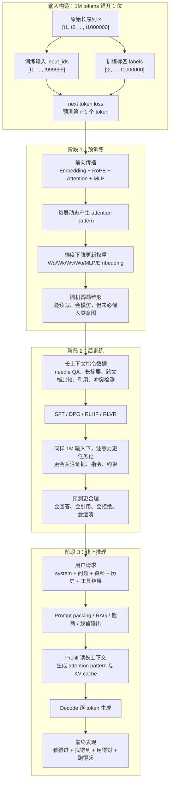
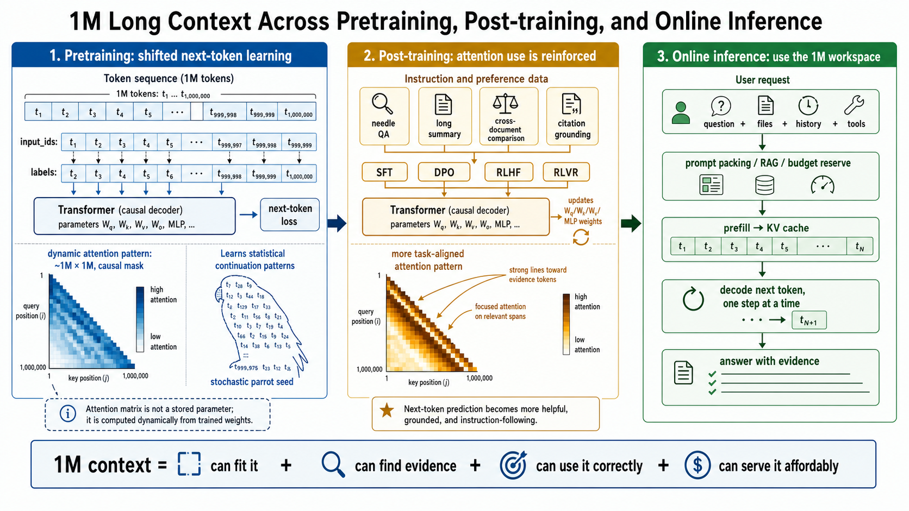

# 一个模型的一生：1M 长上下文，从出生到上岗都经历了什么？

> **这篇是什么**：一篇面向"想真正搞懂'模型支持 100 万 token 上下文'到底在承诺什么"的读者的科普。我们不堆术语，而是**跟着一个模型的一生走一遍**——从它在预训练里"打地基"，到后训练里"学本事"，再到上线后"接客干活"，看长上下文能力在每一站分别意味着什么、又卡在哪里。
>
> **读完你能回答**：
> - "支持 1M 上下文"是不是就是"把输入框拉大到 100 万字"？
> - 为什么"窗口很大"不等于"用得很好"？
> - 同样是长上下文，预训练、后训练、线上推理三个阶段各自在解决什么完全不同的问题？
> - 有了 1M 上下文，还需要 RAG（检索增强）吗？
>
> **怎么读**：从头顺读最佳（有"模型一生"的主线）。赶时间就看**引子里的总纲公式** + 每一站开头的 **✦ 一句话** + 结尾的「一页纸心智模型」。想动手实验的看最后一节。
>
> **证据约定**：结论尽量给出机制层面的因果，涉及具体复杂度/公式的地方标了出处或口径；标 `[推测]` 的是推断。本篇是对旧版《Long_Context_1M_三阶段深度解析》的科普重构，旧版工程细节更全，见文末回链。

---

## 引子 · "支持 1M 上下文"到底在承诺什么？

厂商发布会上最爱说的一句话是："我们的新模型支持 **100 万 token** 上下文！"

听起来像是"输入框变大了 250 倍"。但这个理解，**基本是错的**——或者说，只对了 1/4。

先给你全篇的总纲，一句话记住它：

```text
真正的 1M 上下文能力 = 看得进 + 找得到 + 用得对 + 跑得起
```

- **看得进**：模型架构和训练，能不能承受 100 万 token 的序列？（预训练的事）
- **找得到 + 用得对**：在 100 万 token 的海量信息里，模型能不能定位到关键那几句、并正确使用？（后训练的事）
- **跑得起**：线上服务能不能在可接受的时间和成本内，真的把这么多 token 读进去、算出来？（推理的事）

**四个条件缺一不可。** 只满足"看得进"，它就只是一个"很大但没用的输入框"——你塞进去 100 万字，它可能只看了开头结尾，中间全忽略，还慢得要命、贵得离谱。

这四件事，恰好分布在一个模型一生的三个阶段里。下面我们就跟着这个模型，从出生走到上岗。

> 📊 下面这张信息图是全篇的"地图"，把一个模型三阶段的长上下文含义画在了一起，可以先扫一眼建立整体印象，读完全文再回来看会更清晰：
>
> 

---

## 第一站 · 先建立直觉：窗口大 ≠ 用得好

✦ **一句话**：上下文窗口像模型干活时的"桌面"，桌面大只是前提，能不能在大桌面上把活干好是另一回事。

把上下文窗口想象成模型**这一次工作时的桌面**：

- **4K 窗口**像一张小书桌——摊得开一篇短文、几段代码、一次对话。
- **32K 窗口**像一张会议桌——摊得开一篇论文、一个中等模块、几十页材料。
- **1M 窗口**像一整间档案室——整本书、多篇论文、长会议记录、大型代码库的关键部分，可以同时摆在眼前。

但档案室很大，**不代表工作自然就变好**。真正决定成败的，是下面这几个"大桌面也解决不了"的问题：

- 资料能不能**搬得进来**（推理系统扛不扛得住）？
- 模型知不知道**每份资料摆在哪**（位置编码够不够用）？
- 在海量无关内容里，能不能**找到那关键一句**（抗噪声能力）？
- 遇到**旧版本和新版本冲突**，会不会判断？
- 服务器**付不付得起**读这一大堆资料的时间和显存？

所以谈 1M 上下文，不能只问"窗口有多大"，得问"**训练、对齐、推理系统是不是一起支持它**"。这就是为什么我们要跟着模型的一生走三站——因为这四种能力，是在不同阶段分别被"养成"的。

---

## 第二站 · 先说清楚：到底什么是"上下文窗口"

✦ **一句话**：上下文窗口是"一次调用里所有 token 的总预算"，是**临时的工作台**，不是模型的永久记忆。

在跟模型走三阶段之前，先把这个核心概念的定义和三个高频误解澄清了。

**定义**：上下文窗口，是一次模型调用中，能同时参与计算的 token 总预算：

```text
context_window ≥ system 提示 + 用户问题 + 文档 + 工具结果 + 对话历史 + 生成的输出
```

说一个模型支持"1M 上下文"，通常指这个总预算接近 100 万 token（工程上常见 2²⁰ = 1,048,576 这个二进制近似）。

**三个必须澄清的点**：

1. **token ≠ 字符，也 ≠ 汉字或单词。** 同一段文字，不同分词器算出的 token 数不同。"100 万 token"不等于"100 万字"。
2. **输入和输出共享同一个预算。** 如果输入已经占了 99 万 token，留给模型回答的空间就只剩 1 万——所以工程上必须**预留输出预算**。
3. **窗口是临时的，不是记忆。** 这一次请求里塞进去的信息，下一次请求默认就没了。永久记忆来自模型参数、外部数据库或专门的 memory 系统，不是上下文窗口。

**从 Transformer 的角度**，长上下文的压力主要压在三个部件上——记住这三个，后面三站讲的其实都是它们：

| 部件 | 作用 | 长上下文带来的压力 |
|---|---|---|
| **位置编码**（RoPE / ALiBi 等） | 告诉模型每个 token 的位置 | 位置范围要覆盖到 100 万，还要能区分远距离 |
| **注意力层**（QKᵀ） | 让每个 token"看"其他 token | 朴素实现是 O(n²)，100 万会爆炸 |
| **KV cache** | 推理时缓存历史 token 的键值 | 序列越长，显存占用越大 |

这三个部件，恰好在预训练、后训练、推理三个阶段被反复"施压"。现在正式开始跟着模型走。

---

## 第三站 · 预训练：把地基打到 100 万（"看得进"）

✦ **一句话**：预训练阶段的 1M，意味着模型在学习时**真的见过足够长的序列**、且梯度能跨越百万级距离传播——这决定了它"能不能学到"长距离规律，是打地基，不是盖房子。

一个模型的"出生"，是在海量互联网语料上做**预训练**：把长文本错开一位，让模型不断预测"下一个 token"（next-token prediction）。所谓"随机鹦鹉"的续写能力，就是这么来的。

预训练阶段的长上下文，回答的是最底层的问题：**"这个模型骨子里具不具备处理长序列的能力？"** 它只打地基——地基打到 1M，不代表上线后就擅长回答长文档问题，但地基没打到，后面一切免谈。

这一站有四道坎：

### 坎一：`max_seq_len` 不是一个配置数字，是一串连锁约束

代码里，长上下文常常就体现为一个参数：`max_seq_len = 1048576`。但改大这个数字，**远不止"输入框变长"**——它牵一发动全身：

- 位置编码表 / RoPE 的位置范围
- causal mask（因果掩码）的尺寸
- 训练样本怎么打包（batch packing）
- 每一步处理多少 token、显存峰值多高
- 要不要上序列并行、激活重算等策略

> **一个关键陷阱**：如果模型只在 4K 上训练，然后直接把 `max_seq_len` 改成 1M，**大概率只是"形状上能跑"，能力上完全不可靠**。这就是为什么长上下文模型往往要专门做 long-context pretraining 或 continued pretraining。

### 坎二：位置编码——长上下文的第一道门槛

Transformer 本身不知道 token 的先后顺序，全靠位置编码告诉它。而长上下文对位置编码提出了一个矛盾的要求：

```text
局部：相邻 token 的顺序要分得很精细；
全局：相隔 100 万的两个 token，位置也要能区分开。
```

各种方案在这个矛盾上各有取舍：

| 方案 | 长上下文含义 | 风险 |
|---|---|---|
| 绝对位置 embedding | 位置表必须覆盖最大长度 | 外推能力差 |
| 正弦位置编码 | 可外推到更长 | 远距离区分能力有限 |
| **RoPE**（主流） | 相对位置信息进入 Q/K 的旋转 | 超过训练长度后相位可能失真 |
| ALiBi | 注意力偏置随距离线性衰减 | 表达能力与实现需权衡 |
| 位置插值 / scaling | 把长位置压缩映射回训练范围 | 可能损失局部精度 |

### 坎三：注意力的 O(n²) 高墙——朴素实现根本扛不住 1M

标准注意力要算一个 `[seq_len, seq_len]` 的矩阵。当 seq_len = 100 万时：

```text
1,048,576² ≈ 1.1 × 10¹²  （一万亿个元素）
```

这个规模，普通训练**根本承受不起**。所以真实的长上下文训练必须靠一整套"省算力"的武器：

- **FlashAttention** 等 IO-aware 的精确注意力内核（不省精度，只省显存搬运）
- 滑动窗口注意力、块稀疏注意力、局部-全局混合注意力（牺牲部分全连接换效率）
- 序列并行、激活重算、分块 prefill 等系统级手段

> 本库另有 `18_flashattention_2022`（训练侧注意力内核）和 `KV_Cache_深度解析_20260330`（推理侧缓存）专门覆盖这两块。

### 坎四：长数据不是短文本硬拼

长上下文预训练还需要**数据本身有长结构**——书籍章节、长论文、跨文件的代码依赖、多轮长对话、有版本演化关系的文档集。

> **反例警告**：如果只是把一堆**互不相关的短文本**硬拼到 1M 长度，模型会学到一个糟糕的先验——"长输入里大部分内容互不相关"，反而**加强它忽略中间内容的倾向**（这正是后面"lost-in-the-middle"问题的祸根之一）。

**这一站的结论**：预训练里的 1M，代表的是**底层"可学习范围"，不是最终"可用能力"**。地基打好了，接下来该教它干活了。

---

## 第四站 · 后训练：从"看得很长"到"会用很长"（"找得到 + 用得对"）

✦ **一句话**：后训练阶段的 1M，是把"能看很长"训练成"会用很长"——教模型在长上下文里定位证据、抗干扰、跨段综合、遵循引用。这是长上下文从"容量"变成"能力"的关键一跃。

模型预训练完，是个博学但"不太会干活"的天才：它能续写、会模仿，但**不会天然遵循人类的工作流**。**后训练**（SFT 监督微调、DPO/RLHF 偏好对齐、RLVR 等）就是来教它规矩的。

### 为什么预训练不够？

预训练的目标是"预测下一个 token"，这会让模型学到语言和知识，但**不会**让它天然学会这些长文档工作流：

- 先定位证据，再回答
- 只用给定的材料，不掺入脑子里的旧知识
- 比较相隔很远的多个段落
- 在一堆无关噪声里忽略干扰
- 遇到冲突信息，做版本判断
- 证据不足时，老实说"不确定"

这些行为，得靠专门的指令数据和对齐来"塑形"。

### 六类长上下文训练任务

后训练会喂给模型这些典型的长任务，每一类都在练一种具体能力：

| 任务 | 例子 | 练的是 |
|---|---|---|
| **Needle retrieval**（大海捞针） | 在 10 万 token 里找一个 key | 精确检索 |
| **Multi-hop QA**（多跳问答） | 答案分散在多个段落，要串起来 | 跨段综合 |
| **Long summarization** | 总结一本书 / 一份长会议纪要 | 信息压缩 |
| **Conflict detection** | 找出合同条款里的冲突 | 证据比较 |
| **Codebase QA** | 跨文件定位一个 bug | 结构导航 |
| **Citation grounding** | 回答时标出处段落 | 可验证输出 |

这些数据的作用，是让模型把长上下文**当成一个资料库来查**，而不是当成一堆背景噪声。

### "大海捞针"是底线，不是上限

Needle-in-a-haystack（在长文里藏一句话让模型找）是最出名的长上下文测试。它很有用——能测出模型到底能不能从长输入里捞到信息。

但它**只是底线**。真实任务远比"找一个字符串"复杂：多处相似证据要消歧、时间线和版本要判断、多文档要综合、例外条款要识别、来源可信度要权衡。所以：**能通过 needle 测试，只说明模型没瞎，不代表它真的会用长上下文。**

### 什么是"用得对"：好回答 vs 坏回答

偏好对齐阶段，要教模型区分下面两种回答——这就是总纲里"用得对"的含义：

| ✅ 好回答 | ❌ 坏回答 |
|---|---|
| 先给结论 | 只看了开头或结尾 |
| 标出证据在哪 | 忽略了中间的关键证据 |
| 不确定的地方明确标注 | 把几处相似片段混为一谈 |
| 不把上下文外的知识当证据 | 长篇复述但没回答问题 |
| 能解释冲突的原因 | 编造引用 |

**这一站的结论**：后训练里的 1M，代表**长上下文任务能力**，而不只是架构容量。模型现在既看得进、也找得到、用得对了——但还有最后一关：它得真的能**跑起来**。

---

## 第五站 · 线上推理：让这一切"跑得起"（成本与延迟）

✦ **一句话**：推理阶段的 1M，意味着用户请求真的能带着近百万 token，由服务系统扛下 prefill、KV cache、调度和成本——这是能力能不能"落地服务"的最后一道关。

模型训练好、上线接客了。这一站回答的是最现实的问题：**"这个能力跑得起、用得稳、成本能接受吗？"**

### Prefill 和 Decode：两种完全不同的压力

一次推理分两段（这和本库《Agent 请求全链路》里讲的是同一套机制）：

```text
Prefill（预填充）：读完全部输入上下文，为每个 token 算出中间状态（K/V）
Decode（解码）：  逐个 token 生成输出，每步增量更新 KV cache
```

**长上下文的压力，几乎全压在 prefill 上**：1M 输入意味着模型必须先把 100 万 token 全读完、全算完，才能吐出**第一个**字。这会让"首字延迟"（time-to-first-token）显著变高——用户会明显感觉到"卡了一下才开始回答"。

### KV Cache：推理阶段的"显存账本"

自回归生成时，每一步都要用到历史 token 的 K/V，于是把它们缓存下来。这个缓存的显存占用近似为：

```text
KV 显存 ≈ 2 × 序列长度 × 层数 × KV头数 × 每头维度 × 每值字节数
         ↑
         K 和 V 两份
```

序列越长，这个账本越大。这就是为什么一系列技术对长上下文推理**至关重要**：GQA/MQA（减少 KV 头数）、KV cache 量化（减少每值字节）、PagedAttention（解决显存碎片）、Prefix Caching（跨请求复用前缀）。

### Prompt Packing：1M 不是随便乱塞

线上系统必须精心决定"把什么放进这 1M 空间"：固定的 system 提示、最近的对话窗口、用户上传的材料、检索到的高相关片段、工具结果、必须保留的约束……

> **如果无差别地把所有材料塞满 1M**，后果是：延迟上升、成本上升、干扰上升、模型注意力被噪声稀释、输出空间被挤占。**"塞满"往往比"塞对"更糟。**

### 有了 1M，还需要 RAG 吗？—— 需要，而且是好搭档

这是最常见的误解之一。答案是：**1M 上下文和 RAG 不是互斥，而是分工协作**：

```text
RAG 负责把资料"变干净"（检索、去重、排序、权限过滤、引用）；
Long context 负责让更多必要证据"同时在场"。
```

具体怎么选，看场景：

| 策略 | 优点 | 缺点 | 适用场景 |
|---|---|---|---|
| **Full-context**（全塞进去） | 证据全在场，不依赖检索召回率 | 贵、慢、噪声大 | 小批量、高价值的审查 |
| **RAG**（只检索相关片段） | 便宜、快、可做权限过滤 | 检索漏召回就会丢证据 | 企业知识库、常规问答 |
| **Hybrid**（先检索再扩展邻域） | 兼顾召回与上下文 | 系统复杂 | 长文档严肃分析 |
| **分层摘要** | 多级压缩 | 摘要可能丢细节 | 会议/报告归档 |

**这一站的结论**：推理里的 1M，代表**服务系统的上下文预算和成本边界**。到这里，"看得进+找得到+用得对+跑得起"四件事才算凑齐。

---

## 装进脑子

### 三阶段一览：一句话记住每一站

| 阶段 | 1M 代表什么 | 典型代码/配置 | 主要风险 | 一句话 |
|---|---|---|---|---|
| **预训练** | 长序列的**可学习范围** | `max_seq_len`、位置编码、注意力掩码 | 算不动、位置外推差 | 让模型**有**一张长桌面 |
| **后训练** | 长上下文的**任务能力** | long-context SFT/RLHF 数据 | 找不到、被噪声干扰 | 教模型**整理**长桌面 |
| **推理** | 请求时的**上下文预算** | prompt packing、KV cache、prefill | 慢、贵、显存爆 | 让系统真的**搬得动**长桌面 |

### 生命周期全景图（Mermaid）

下图把"从错位的 next-token 训练，到三阶段如何让预测越来越合理"串成一条线。**先记一个容易混淆的点**：图里的"注意力图（attention pattern）"是模型在某个具体输入上由 QKᵀ **动态算出来的**，不是被永久保存的参数；真正被训练更新的是 `Wq/Wk/Wv/Wo`、MLP、Embedding 等**权重**。预训练和后训练改变的是权重，于是同样的 1M 输入会产生不同、更有用的注意力分布。



> 英文版同款信息图（适合分享给英文读者）：
>
> 

### 四个容易踩的误区

| 误区 | 真相 |
|---|---|
| "1M 上下文 = 永久记忆" | ❌ 上下文是**这次请求临时可见**的信息。永久记忆来自参数、外部数据库或专门 memory 系统。 |
| "1M 上下文消灭了 RAG" | ❌ RAG 的价值（检索、权限过滤、去重、排序、引用、缓存、更新）都还在。1M 只是降低了"放不下"的概率。 |
| "上下文越长越准" | ❌ 低相关信息越多，干扰越强。决定质量的是**上下文的质量和任务提示**，不是长度。 |
| "支持 1M 就能稳定用满 1M" | ❌ 模型在"短长上下文"和"接近满窗"时表现可能天差地别。要看长距离检索、lost-in-the-middle 曲线、多文档综合和线上延迟这些真实指标。 |

---

## 动手实验建议（给 B 类 ai-practice）

真实的 1M 训练成本高到个人无法复现，但**机制可以缩尺模拟**。把"真实 1M token"缩放成"实验用 4K / 8K / 32K token"，观察的是**同一套机制**：

- `max_seq_len` 怎么改变 mask 和 position ids
- context 长度怎么改变全量注意力的成本
- needle 的**位置**怎么影响检索准确性（复现 lost-in-the-middle）
- chunk 大小 / top_k 怎么改变 RAG 召回
- 序列长度怎么改变 KV cache 内存占用
- prefill 的 token 数怎么改变首字延迟

这比空谈"1M 很大"有教学价值得多——你能亲眼看到每个旋钮的因果。

---

## 结论：四个问题，检验一个"1M 系统"是真是假

1M 长上下文是一个**跨阶段的系统能力**：预训练决定能不能学到长距离模式，后训练决定能不能按任务使用，推理决定能不能以可接受成本服务。所以，下次看到"支持 1M 上下文"的宣传，用这四个问题一戳就知道真假：

```text
1. 训练时是否真的覆盖了长序列？（不是改个 max_seq_len 就算）
2. 后训练是否覆盖检索、综合、抗干扰、引用？
3. 推理系统是否有 KV cache、prefill、prompt packing、RAG 和成本控制？
4. 在接近 1M 的长度上，是否有真实 benchmark，而不是只秀窗口上限？
```

**四个问题都答清楚，1M 上下文才从一个营销数字，变成真正的工程能力。**

---

## 🔗 延伸阅读（本库）

- **旧版三阶段深度解析**（本篇前身，工程细节/可观测指标更全）：`Long_Context_1M_三阶段深度解析_20260507.md`
- **KV Cache 注意力原理**：`wiki/concepts/kv_cache.md` & `KV_Cache_深度解析_20260330.md`
- **长上下文系统工程**：`wiki/concepts/long_context_systems.md`
- **Prefill/Decode 与两级缓存**：`Agent请求全链路_科普讲解_20260715.md`（第 7 节）
- **RAG 注入**：`wiki/concepts/rag.md`

---

## 💭 思考与追问

1. **我真正理解了什么？**
   我把"1M 上下文"从一个"输入框大小"的单点认知，升级成了一个**贯穿模型一生的系统约束**：预训练管"看得进"（可学习范围）、后训练管"找得到+用得对"（任务能力）、推理管"跑得起"（成本边界）。最有价值的认知是那句总纲——**四个条件缺一不可**，任何一个短板都会让"1M"沦为营销数字。同时理清了三个部件（位置编码/注意力/KV cache）如何在三个阶段被反复施压，以及"1M 与 RAG 是搭档不是替代"这个反直觉但关键的关系。

2. **我还没搞懂什么？**（汇入 open-questions）
   - Lost-in-the-middle 到底是位置编码的锅、还是训练数据分布的锅、还是注意力机制的固有缺陷？三者各占多少，有没有可控实验能拆开？
   - 后训练要多少长上下文数据、什么配比，才能把"能看很长"真正转化成"会用很长"？有没有 scaling law？
   - 服务端在接近满窗时，prefill 的超线性增长具体是什么曲线？1M 的首字延迟在真实系统里是几秒量级？（需实测，见下一步）

3. **下一步做什么？**
   - 落一个缩尺 demo（B 类 `ai-practice`）：在 4K/8K/32K 上复现 lost-in-the-middle 曲线，把 needle 位置–准确率画出来。
   - 追一份主流 1M 模型（如 Gemini / Claude / GPT 系）在长上下文 benchmark（如 RULER、LongBench）上的真实成绩，把"窗口上限"和"有效长度"的差距量化出来。
