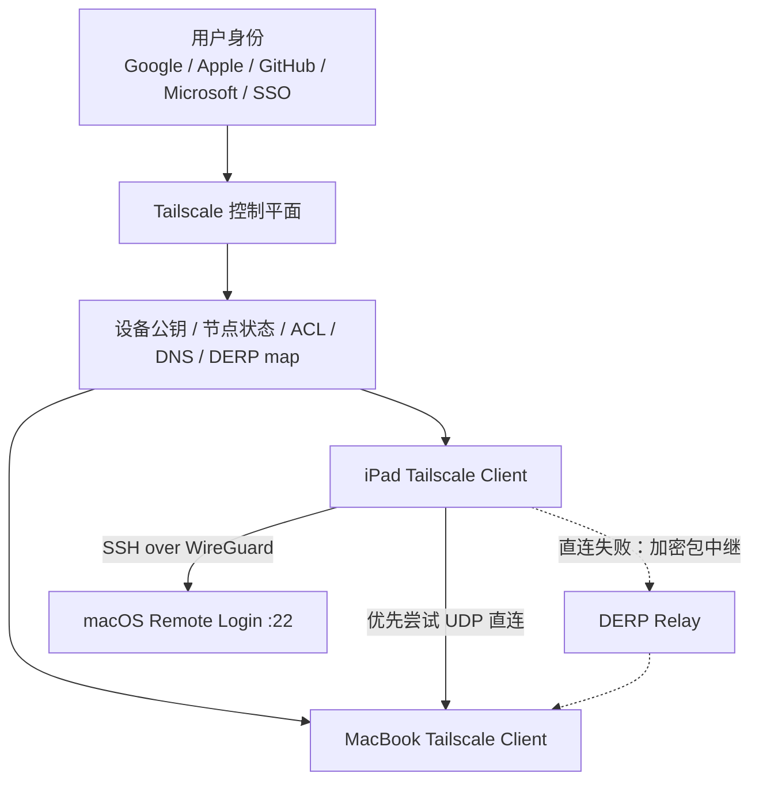
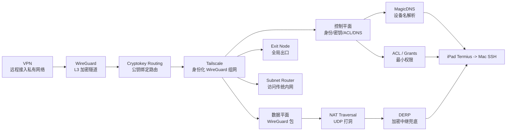

# Tailscale、WireGuard 与现代 VPN：从加密隧道到零信任私有网络

> 研究对象：Tailscale、WireGuard、传统 VPN、NAT 穿透、DERP 中继、MagicDNS、ACL、Exit Node、Subnet Router。
> 应用场景：iPad + Termius 远程 SSH 到 MacBook Pro，同时与 Clash Verge 等代理软件共存。
> 主要来源：WireGuard 官方协议说明/白皮书、Tailscale 官方文档。

---

## 1. 专题定义与边界

### 1.1 本报告回答什么问题

本报告要回答一个很实际的问题：

> 为什么 Tailscale 可以让一台在外网的 iPad 像在同一局域网一样 SSH 到家里的 MacBook？

为了回答它，需要把几个经常混用的词拆开：

- **VPN**：一种把远程设备接入私有网络的网络形态。
- **WireGuard**：一种现代 VPN 协议和隧道实现，负责端到端加密和三层 IP 隧道。
- **Tailscale**：基于 WireGuard 的私有组网产品，负责身份、密钥分发、NAT 穿透、DNS、ACL 和中继兜底。
- **Clash Verge**：更偏代理/规则路由工具，通常处理访问互联网的 HTTP/SOCKS/TUN 流量，不等同于私有组网。

一句话：

> WireGuard 是发动机，Tailscale 是带自动导航、钥匙管理、道路救援和权限系统的整车。

### 1.2 研究边界

本报告聚焦现代远程访问网络，不深入以下主题：

- 不做 OpenVPN/IPsec 的完整协议精读，只作为传统 VPN 参照物。
- 不展开 WireGuard 每个握手字段的形式化证明，只解释关键机制。
- 不讨论商业套餐细节，只讨论技术架构。
- 不覆盖所有移动端兼容性，只围绕 iPad/Mac/服务器常见场景。

### 1.3 为什么它属于 CS 网络与系统主题

Tailscale / WireGuard 看起来是“工具”，本质上却横跨多个经典 CS 系统问题：

- **加密通信**：如何在不可信网络上建立安全信道。
- **网络层抽象**：如何把远程节点纳入同一个三层地址空间。
- **NAT 穿透**：如何让两个没有公网 IP 的设备直接通信。
- **控制平面 / 数据平面分离**：谁负责身份和元数据，谁负责真正传包。
- **零信任访问控制**：如何从“进了 VPN 就全网可达”转向最小权限。
- **故障降级**：直连失败时如何用中继保持可用。

---

## 2. 核心主线：从传统 VPN 到身份化私有网络

### 2.1 传统 VPN 的默认模型

传统企业 VPN 常见模型是：

```text
用户设备 -> VPN 网关 -> 企业内网
```

这个模型的优点是清晰：

- 用户只要连上 VPN，就像进入公司网络。
- 内部服务不必直接暴露到公网。
- 运维可以集中审计一个或少数 VPN 网关。

但它也有几个结构性问题：

- **中心化瓶颈**：所有远程流量绕过 VPN 网关。
- **权限粗糙**：很多 VPN 默认是“连上后可见大片内网”。
- **配置复杂**：证书、客户端、路由、防火墙规则容易漂移。
- **移动场景脆弱**：网络切换、NAT、UDP 被封时体验差。

### 2.2 WireGuard 的改进方向

WireGuard 把 VPN 隧道压缩成一个非常小的核心模型：

- 每个 peer 有一对公私钥。
- peer 的公钥与允许通过隧道的 IP 前缀绑定。
- 数据包通过 UDP 承载。
- 握手使用 Noise_IK，数据加密使用 ChaCha20Poly1305。
- 隧道呈现为一个三层网络接口。

WireGuard 官方白皮书把它定义为一个三层安全网络隧道，目标是替代许多 IPsec/OpenVPN 场景，并强调更安全、更快、更易用、代码更少。

这带来一个非常重要的转变：

> VPN 不再必须是“登录一个大网关”，也可以是一组 peer 之间的加密 IP 路由关系。

### 2.3 Tailscale 的再抽象

直接使用 WireGuard 仍然要手动解决很多麻烦：

- 每台设备的公钥怎么分发？
- 每台设备的 AllowedIPs 怎么写？
- 设备换网络、换公网出口后怎么办？
- 两端都在 NAT 后面怎么打洞？
- 用户离职或设备丢失怎么撤销权限？
- 家庭/团队里设备名怎么解析？

Tailscale 在 WireGuard 之上增加了一个控制平面：

- 用身份提供商登录用户。
- 自动生成并注册设备密钥。
- 给设备分配稳定的 Tailscale IP。
- 自动分发 peer 列表和路由信息。
- 通过 NAT traversal 尝试建立直连。
- 直连失败时通过 DERP relay 转发加密包。
- 用 ACL / grants 做访问控制。
- 用 MagicDNS 做设备名解析。

关键是：

> Tailscale 控制平面帮助设备“认识彼此”，数据平面仍然由 WireGuard 端到端加密。

---

## 3. WireGuard 原理：公钥即身份，路由即权限

### 3.1 Cryptokey Routing

WireGuard 最核心的抽象是 cryptokey routing：

```text
Peer public key <-> AllowedIPs
```

这意味着一个 peer 的公钥不仅用于加密身份认证，还参与路由决策。

例如：

```text
Peer A public key -> 100.64.1.10/32
Peer B public key -> 100.64.1.11/32
```

当本机要发往 `100.64.1.11`，WireGuard 根据 AllowedIPs 找到 Peer B 的公钥，然后把内部 IP 包封装成加密 UDP 包发给 B 的 endpoint。

### 3.2 握手与加密

WireGuard 官方协议说明列出的关键密码学原语包括：

- ChaCha20 + Poly1305：对称加密与认证。
- Curve25519：ECDH 密钥交换。
- BLAKE2s：哈希与 keyed hashing。
- HKDF：密钥派生。
- SipHash24：哈希表 key。

握手使用 Noise_IK 模式。它提供：

- 双方身份认证。
- 前向安全。
- 抗重放。
- 一定程度的身份隐藏。
- 单个 round trip 建立会话密钥。

### 3.3 UDP 与“无连接”

WireGuard 运行在 UDP 上。

这不是“UDP 不可靠所以不安全”，而是为了：

- 避免 TCP-over-TCP 的拥塞控制叠加问题。
- 让隧道更容易在移动网络中切换 endpoint。
- 保持协议核心简单。
- 让上层 TCP/QUIC/应用协议自己处理可靠性。

WireGuard 本身维护握手、session key、计时器和 keepalive。官方协议说明中提到握手会周期性重协商，session key 会轮换，用于提供前向安全。

### 3.4 WireGuard 没有解决的一些产品问题

WireGuard 是优秀的底层协议，但直接使用时仍然偏“系统管理员工具”：

- 需要手工维护 peer 配置。
- 没有内置用户身份系统。
- 没有自动 DNS。
- 没有开箱即用的团队 ACL 管理。
- 不负责复杂 NAT 穿透编排。
- 不提供全球中继兜底网络。

Tailscale 的价值正是在这些边界之外。

---

## 4. Tailscale 架构：控制平面与数据平面分离

### 4.1 架构分层



这里有两条平面：

- **控制平面**：登录、设备注册、公钥分发、ACL、DNS、DERP 地图。
- **数据平面**：设备之间真正传输的 WireGuard 加密 IP 包。

### 4.2 控制平面知道什么

控制平面知道：

- 哪些用户属于同一个 tailnet。
- 哪些设备被授权加入。
- 每台设备的公钥、节点信息、地址。
- ACL / grants 规则。
- DERP 服务器列表。
- DNS 配置。

控制平面不需要解密设备之间的业务流量。

### 4.3 数据平面怎么走

Tailscale 官方文档把连接类型分成三类：

1. **Direct connection**：设备之间直接通过 UDP 发包。
2. **DERP relayed connection**：通过 Tailscale DERP 服务器中继。
3. **Peer Relay connection**：通过 tailnet 内其他设备中继。

三者的共同点：

- 都使用 WireGuard 端到端加密。
- 安全差异不是重点，主要差异是性能。
- 直连通常延迟最低、吞吐最高。
- DERP 是直连失败时的兜底。

### 4.4 tailnet 是什么

tailnet 可以理解为你的 Tailscale 私有网络：

```text
你的账号 / 组织
  ├── iPad
  ├── MacBook
  ├── NAS
  ├── VPS
  └── Raspberry Pi
```

这些设备拿到 `100.64.0.0/10` 范围内的地址。这个地址空间来自 Carrier-Grade NAT 保留网段，Tailscale 用它作为私有 overlay 网络地址。

---

## 5. NAT 穿透：为什么没有公网 IP 也能互连

### 5.1 NAT 带来的问题

家庭路由器、公司网络、运营商移动网络通常都使用 NAT。

这意味着：

```text
MacBook 内网地址: 192.168.1.23
路由器公网地址: 203.0.113.10
```

外部 iPad 不能直接访问 `192.168.1.23`，因为这是私有地址。也不能随便访问 `203.0.113.10:22`，因为路由器不知道要把入站连接转发给谁。

传统做法是端口转发：

```text
公网 203.0.113.10:2222 -> MacBook 192.168.1.23:22
```

这麻烦，而且把 SSH 暴露到公网，不够优雅。

### 5.2 Tailscale 的路径发现

Tailscale 会让两台设备先通过控制平面和 DERP 建立“介绍关系”，交换可用的连接候选信息。

然后双方尝试各种 NAT traversal 策略：

- 发现自己从不同外部观察点看起来的 IP/端口。
- 交换候选 endpoint。
- 尝试 UDP hole punching。
- 直连成功后切到 peer-to-peer。
- 失败则保持 relayed。

Tailscale 的连接类型文档说明：连接通常先通过 DERP 协调，然后尝试升级到直连；如果直连失败，再使用 peer relay 或 DERP。

### 5.3 easy NAT 与 hard NAT

Tailscale 的设备连接文档把 NAT 粗略分为 no NAT、easy NAT、hard NAT。

直观理解：

- **No NAT**：设备有公网可达地址。
- **Easy NAT**：端口映射相对稳定，适合打洞。
- **Hard NAT**：不同目标得到不同外部端口，外部很难预测并回连。

当两端都是 hard NAT，或者一端 hard NAT 一端 easy NAT 时，Tailscale 更可能使用 relayed connection。

### 5.4 为什么 SSH 不需要暴露到公网

用 Tailscale 后，iPad 访问 Mac 的路径是：

```text
iPad Termius -> Tailscale IP 100.x.y.z:22 -> WireGuard 隧道 -> MacBook sshd
```

Mac 的 `22` 端口只需要对 Tailscale 虚拟网卡可达，不需要在家庭路由器上做公网端口转发。

这就是 Tailscale 对个人远程访问特别友好的原因。

---

## 6. DERP 中继：直连失败时的可用性保险

### 6.1 DERP 是什么

DERP 是 Designated Encrypted Relay for Packets。

Tailscale 官方文档说明 DERP 主要有两个用途：

- 协商并建立 tailnet 设备之间的连接。
- 当直连不可用、peer relay 不可用时作为 fallback relay。

### 6.2 DERP 看得到内容吗

看不到业务明文。

DERP 转发的是已经由 WireGuard 加密的包。Tailscale 文档明确说明，Tailscale 私钥不会离开本地设备，因此 DERP 服务器无法解密流量。

这很关键：

```text
iPad --WireGuard encrypted packet--> DERP --same encrypted packet--> MacBook
```

DERP 知道有两台设备在通信，但不知道 SSH 会话里具体传了什么命令和输出。

### 6.3 DERP 的代价

DERP 的代价是性能：

- 路径更长。
- 延迟更高。
- 吞吐可能受中继带宽限制。

但对 SSH、远程维护、偶尔访问 NAS 来说通常足够。

如果你发现延迟明显高，可以用：

```bash
tailscale status
tailscale ping <device>
tailscale netcheck
```

`tailscale status` 中如果出现 `relay "xxx"`，说明当前路径经由 DERP。`tailscale ping` 也会显示 via DERP 或 direct path。

---

## 7. MagicDNS、ACL、Exit Node 与 Subnet Router

### 7.1 MagicDNS：把 IP 变成设备名

没有 MagicDNS 时，你需要记：

```bash
ssh user@100.101.102.103
```

开启 MagicDNS 后，可以用：

```bash
ssh user@macbook-pro
```

Tailscale 官方文档说明 MagicDNS 会自动为 tailnet 中的设备注册 DNS 名称，并且对所有计划可用。新 tailnet 通常默认启用。

### 7.2 ACL / grants：从“全网可达”到最小权限

传统 VPN 常见风险是：

> 一旦连上 VPN，用户可能看到不该看到的内网资源。

Tailscale 用 tailnet policy 文件控制访问。旧语法叫 ACL，新一代语法叫 grants。官方文档说明 ACL 会继续支持，但推荐新配置迁移到 grants。

ACL 的基本结构是：

```json
{
  "acls": [
    {
      "action": "accept",
      "src": ["user@example.com"],
      "dst": ["macbook-pro:22"]
    }
  ]
}
```

这表达的是：

> 只有 user@example.com 可以访问 macbook-pro 的 22 端口。

这就是零信任网络访问的核心味道：

- 不因为“在 VPN 内”就默认可信。
- 按用户、设备、标签、端口授权。
- 默认拒绝，再显式放行。

### 7.3 Exit Node：让所有流量走某台设备

Exit Node 是 Tailscale 的“全局出口”能力。

如果你把家里的 Mac 或 VPS 设为 Exit Node，iPad 的互联网流量可以从它出去：

```text
iPad -> Tailscale -> Home Mac / VPS -> Internet
```

典型用途：

- 在不可信 Wi-Fi 下把流量导回可信出口。
- 出国时访问只允许本地 IP 的服务。
- 统一某些设备的公网出口。

但它和 Clash Verge 的用途会重叠。如果只是 SSH 回 Mac，不需要启用 Exit Node。

### 7.4 Subnet Router：访问没装 Tailscale 的内网设备

Subnet Router 解决另一个问题：

> 如果 NAS、打印机、摄像头不能安装 Tailscale，如何从 tailnet 访问它们？

做法是让某台安装了 Tailscale 的设备广告本地子网：

```bash
sudo tailscale set --advertise-routes=192.168.1.0/24
```

然后其他 tailnet 设备访问 `192.168.1.x` 时，会通过这台 subnet router 转发。

这适合家庭 homelab 或小型办公室，但要非常小心 ACL，避免把整个局域网无差别暴露给所有 tailnet 成员。

---

## 8. Tailscale 与 Clash Verge 的关系

### 8.1 两者不是同一类工具

Tailscale 解决的是：

```text
我的设备之间如何安全互连？
```

Clash Verge 解决的是：

```text
我的设备访问互联网时，哪些域名/IP 走哪个代理出口？
```

所以它们一般可以共存。

### 8.2 容易冲突的位置

冲突通常发生在三层：

1. DNS：MagicDNS 与 Clash DNS 接管可能打架。
2. 路由：Clash TUN 模式可能截获 `100.64.0.0/10`。
3. 全局出口：Tailscale Exit Node 与 Clash 全局代理都想接管默认路由。

### 8.3 推荐规则

在 Clash 规则里让 Tailscale 网段直连：

```yaml
IP-CIDR,100.64.0.0/10,DIRECT
DOMAIN-SUFFIX,ts.net,DIRECT
```

如果 MagicDNS 不稳定，优先测试：

```bash
ssh user@100.x.y.z
```

如果 IP 可连、设备名不可连，就是 DNS 解析层问题，不是 SSH 或 Tailscale 隧道问题。

---

## 9. 实战：iPad + Termius 远程连接 MacBook

### 9.1 Mac 侧准备

在 MacBook 上：

1. 安装 Tailscale 并登录。
2. 打开系统设置。
3. 进入“通用 -> 共享”。
4. 开启“远程登录”。
5. 确认 SSH 用户名。

本机可验证：

```bash
ssh $(whoami)@localhost
```

### 9.2 iPad 侧准备

在 iPad 上：

1. 安装 Tailscale 并登录同一账号。
2. 确认 MacBook 出现在 Tailscale 设备列表。
3. 复制 MacBook 的 Tailscale IP，通常是 `100.x.y.z`。
4. 在 Termius 新建 Host。

Termius 配置：

```text
Address: 100.x.y.z
Port: 22
Username: <macOS 用户名>
Password 或 SSH Key: 按实际配置
```

### 9.3 更推荐 SSH key

密码登录方便，但长期使用推荐 SSH key：

```bash
ssh-keygen -t ed25519 -C "ipad-termius-to-mac"
```

把公钥加入 Mac 的：

```text
~/.ssh/authorized_keys
```

然后在 Termius 里导入私钥。

### 9.4 常见故障定位

| 现象 | 可能原因 | 排查 |
|------|----------|------|
| Termius 连不上 `macbook-pro` | MagicDNS 被 Clash DNS 影响 | 改用 `100.x.y.z` |
| IP 也连不上 | Tailscale 未在线 / ACL 不放行 | 看 Tailscale 设备状态 |
| Tailscale 在线但 22 不通 | Mac 未开远程登录 | 系统设置开启 SSH |
| 可以连但慢 | 走 DERP 中继 | `tailscale ping macbook-pro` |
| 睡眠后连不上 | Mac 休眠断网 | 配置网络唤醒或保持唤醒 |

---

## 10. 关键论文 / 文档矩阵

| 文档 | 核心贡献 | 与本专题关系 |
|------|----------|--------------|
| WireGuard Whitepaper | 三层安全隧道、公钥到隧道源 IP 的绑定、NoiseIK、ChaCha20Poly1305、少量代码实现 | 解释 WireGuard 为什么是现代 VPN 的底层核心 |
| WireGuard Protocol & Cryptography | 密码学原语、握手流程、key rotation、replay/DoS 防护 | 给出协议级事实来源 |
| Tailscale Connection Types | direct / DERP / peer relay 三种连接类型 | 解释 Tailscale 数据路径 |
| Tailscale Device Connectivity | NAT 类型与 direct/relayed 的关系 | 解释为什么有时直连、有时中继 |
| Tailscale DERP Servers | DERP 协商连接与兜底中继，且只转发加密包 | 解释中继安全边界 |
| Tailscale Encryption | 数据平面使用 WireGuard，DERP 不解密业务流量 | 解释控制平面与数据平面安全模型 |
| Tailscale MagicDNS | tailnet 内设备名自动注册 | 解释为什么可用设备名 SSH |
| Tailscale ACLs / Grants | deny-by-default、按用户/设备/端口授权 | 解释零信任访问控制 |
| Tailscale Exit Nodes | 把全部互联网流量导向某台 tailnet 设备 | 区分远程访问与全局代理 |
| Tailscale Subnet Routers | 让 tailnet 访问未安装 Tailscale 的内网网段 | 扩展到家庭/办公室网络 |

---

## 11. 概念关联图



---

## 12. 学习路径建议

### 12.1 第一层：使用者视角

目标：会安全地连回自己的设备。

应该掌握：

- Tailscale IP 与 MagicDNS。
- macOS 远程登录。
- Termius Host 配置。
- SSH key 基础。
- Clash 里把 `100.64.0.0/10` 设为直连。

### 12.2 第二层：系统视角

目标：理解为什么它能工作。

应该掌握：

- VPN 与 overlay network。
- WireGuard peer、公钥、AllowedIPs。
- 控制平面 / 数据平面分离。
- NAT traversal 与 DERP fallback。
- Exit Node 与 Subnet Router 的区别。

### 12.3 第三层：安全视角

目标：把“能连”变成“只该连的能连”。

应该掌握：

- 禁止公网暴露 SSH。
- 使用 SSH key，减少密码登录。
- ACL / grants 最小权限。
- 设备丢失时撤销 device。
- 对 subnet router 做端口级授权。

### 12.4 第四层：工程诊断视角

目标：连接慢或失败时能定位层次。

诊断顺序：

1. Tailscale 设备是否在线。
2. `tailscale ping` 是 direct 还是 DERP。
3. `100.x.y.z` 是否可达。
4. MagicDNS 是否解析。
5. SSH 服务是否监听 22。
6. ACL 是否允许源到目标端口。
7. Clash TUN/DNS 是否截获 Tailscale 网段。

---

## 13. 未解问题与前沿方向

### 13.1 NAT 穿透不是必胜算法

Hard NAT、企业防火墙、UDP 阻断、运营商策略都会让直连失败。

Tailscale 的工程答案不是“永远直连”，而是：

```text
优先直连 -> peer relay -> DERP 中继兜底
```

这体现了系统设计中的现实主义：可用性常常比路径完美更重要。

### 13.2 零信任不是“买一个 VPN”

Tailscale 给了 ACL / grants / identity-based connectivity，但真正的零信任还需要：

- 正确的权限建模。
- 设备健康检查。
- 密钥轮换。
- 审计。
- 用户生命周期管理。

工具只能降低门槛，不能替代安全治理。

### 13.3 Overlay 网络与传统网络的边界

Subnet Router 可以把传统局域网接入 tailnet，但也会把传统网络的复杂性带回来：

- 重叠网段。
- DNS split horizon。
- 路由优先级。
- SNAT / no-SNAT。
- 广播协议不可跨三层隧道。

个人使用时要克制，不要一开始就把整个家庭网段全接进去。

### 13.4 与代理工具共存会成为常态

现代个人开发环境经常同时运行：

- Tailscale / WireGuard 私有组网。
- Clash Verge / Surge / Shadowrocket 代理。
- Docker Desktop 网络。
- 企业 VPN。
- 本地开发端口转发。

未来的关键能力不是“只会安装”，而是理解路由表、DNS、虚拟网卡和分流规则之间的优先级。

---

## 14. 结论

Tailscale 的核心价值不是“又一个 VPN 客户端”，而是把 WireGuard 的强协议内核包装成一套可日常使用的身份化私有网络。

它的设计精华可以压缩成五句话：

1. WireGuard 负责端到端加密和三层隧道。
2. Tailscale 控制平面负责身份、密钥、设备列表、ACL 和 DNS。
3. 设备优先通过 UDP NAT traversal 建立直连。
4. 直连失败时，DERP 只中继已加密的 WireGuard 包。
5. 用 ACL / grants 把“连上 VPN”升级为“只访问被授权的资源”。

对 iPad 远程连接 MacBook 这个场景，最稳妥的实践是：

- Mac 开启远程登录。
- iPad 与 Mac 登录同一 Tailscale tailnet。
- Termius 连接 Mac 的 Tailscale IP 或 MagicDNS 名称。
- Clash Verge 把 `100.64.0.0/10` 和 `*.ts.net` 设为 DIRECT。
- 不把 SSH 22 端口暴露到公网。
- 长期使用 SSH key 和最小权限 ACL。

这条路径把“远程运维”从公网端口转发、防火墙试错、证书管理里解放出来，同时保留了网络系统最重要的性质：端到端加密、明确身份、可诊断路径、可收敛权限。

---

## 15. 参考资料

- WireGuard Protocol & Cryptography: https://www.wireguard.com/protocol/
- WireGuard Whitepaper: https://www.wireguard.com/papers/wireguard.pdf
- Tailscale Connection Types: https://tailscale.com/docs/reference/connection-types
- Tailscale Device Connectivity: https://tailscale.com/docs/reference/device-connectivity
- Tailscale DERP Servers: https://tailscale.com/docs/reference/derp-servers
- Tailscale Encryption: https://tailscale.com/docs/concepts/tailscale-encryption
- Tailscale MagicDNS: https://tailscale.com/docs/features/magicdns
- Tailscale ACLs: https://tailscale.com/docs/features/access-control/acls
- Tailscale Exit Nodes: https://tailscale.com/docs/features/exit-nodes
- Tailscale Subnet Routers: https://tailscale.com/kb/1019/subnets
