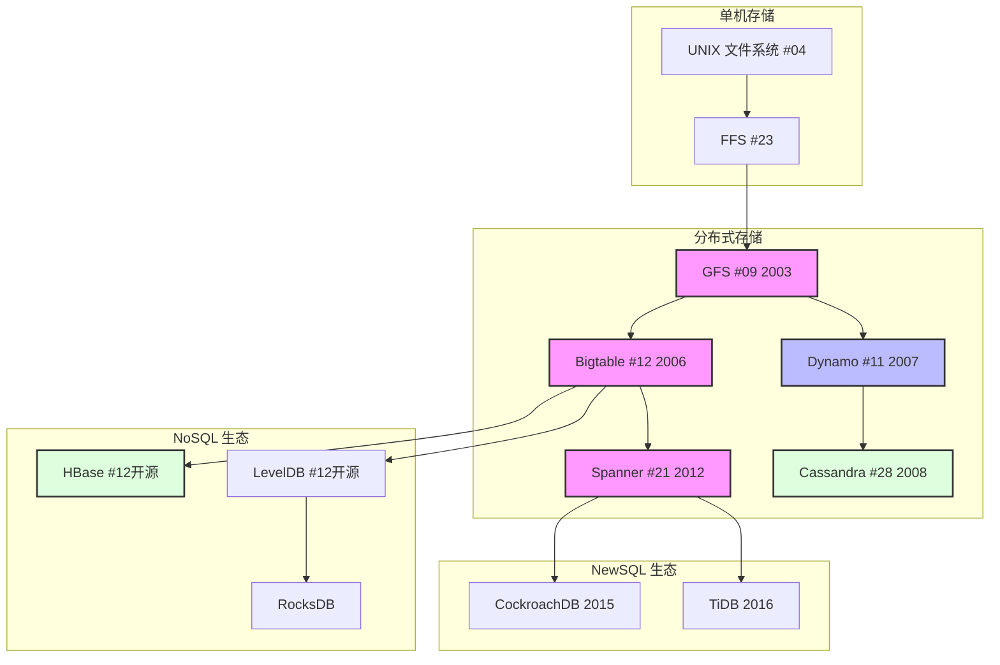
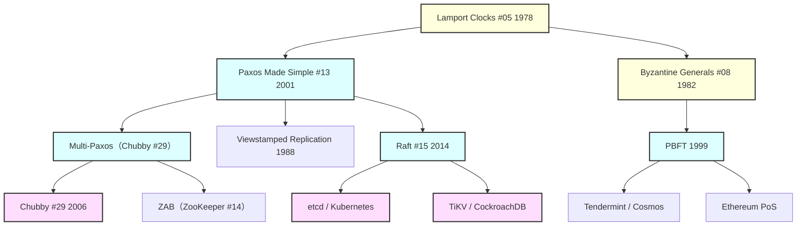
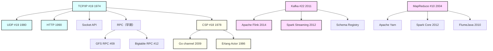
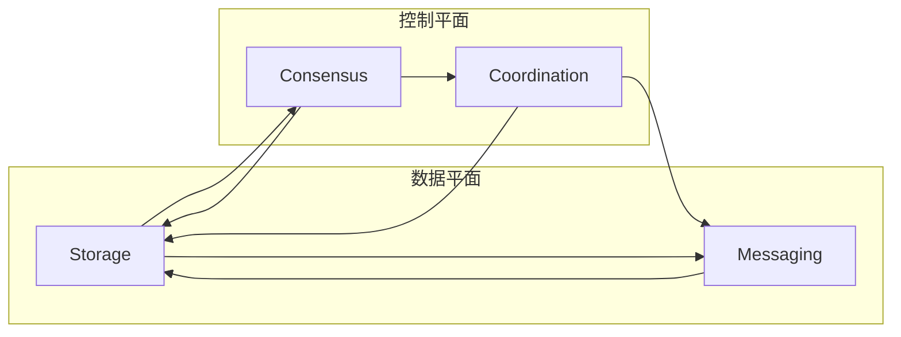

# 分布式系统知识图谱

> 整合 19 篇精读论文，按 Storage / Consensus / Coordination / Messaging 四主线归纳分布式系统核心知识结构
> 创建日期：2026-04-05
> 知识覆盖率：19/30 篇精读（63%）

---

## 导读：分布式系统的四层架构

分布式系统不是一堆孤立论文，而是一个从底层介质到上层应用的完整知识栈。本图谱将 19 篇精读归纳为四个主线：

| 主线 | 核心问题 | 关键论文 | 演化方向 |
|------|----------|----------|----------|
| **Storage（存储）** | 数据如何可靠、高效地持久化？ | GFS → Bigtable → Dynamo → Spanner | 强一致 → 弱一致 → 全局强一致 |
| **Consensus（共识）** | 多节点如何对值达成一致？ | Lamport Clocks → Paxos → Raft → Byzantine | 单值共识 → 日志共识 → 恶意节点共识 |
| **Coordination（协调）** | 分布式进程如何协同工作？ | ZooKeeper → Chubby | 锁服务 → 命名服务 |
| **Messaging（消息）** | 数据如何在节点间流动？ | TCP/IP → Kafka → MapReduce | 点到点 → 发布订阅 → 批处理 |

**为什么是这四个主线？** 因为分布式系统的所有复杂性，都可以从这四个维度来理解：数据要存在哪（Storage）、谁来拍板（Consensus）、如何协同（Coordination）、数据怎么传（Messaging）。

---

## 一、Storage 主线：数据的持久化与访问

### 1.1 演进路径图



### 1.2 核心论文精读

#### GFS (#09) — Google 文件系统

**定位**：分布式存储的奠基之作，解决了"如何在数千台廉价机器上存储 PB 级数据"。

**核心设计决策**：
- **单 Master + ChunkServer**：元数据放内存，数据放 ChunkServer（64MB 大块）
- **追加写优先**：Google 工作负载以批量读、追加写为主，放弃随机写的性能
- **Lease 机制**：Primary ChunkServer 确定写入顺序，避免锁竞争
- **一致性模型**：宽松一致性（Record Append At-Least-Once），应用层需处理重复

**Layer 3 变体**：
- GFS → **Colossus**（GFS 2.0，分布式 Master，解决单点瓶颈）
- HDFS（Hadoop 版 GFS）→ 成了整个 Hadoop 生态的存储基石

**一句话总结**：GFS 的核心洞察是"针对工作负载设计系统，而非追求通用性"——放弃 POSIX 兼容、放弃强一致，换来了极高的吞量。

---

#### Bigtable (#12) — 结构化存储

**定位**：在 GFS 之上构建"可随机访问的结构化数据存储"，NoSQL 宽列数据库的奠基之作。

**核心设计决策**：
- **列族数据模型**：`row_key + column_family:qualifier + timestamp` → value，三维稀疏多版本
- **LSM-Tree 存储引擎**：随机写 → 顺序写 WAL + Memtable → SSTable，牺牲读性能换取极高写吞吐
- **Tablet 架构**：按行水平分片，三层元数据（Root → METADATA → User）实现 PB 级寻址
- **依赖 Chubby**：Master 选举、Tablet 归属都通过 Chubby 分布式锁协调

**Layer 3 变体**：
- HBase（Cassandra 的数据模型）、LevelDB（单机 K-V → RocksDB → TiKV）
- Spanner 在 Bigtable 基础上加入全局跨 datacenter 复制和强事务

**一句话总结**：Bigtable 将"写入性能"和"随机读取"这对矛盾通过 LSM-Tree 化解，是 Google 内部 60+ 生产系统的存储引擎。

---

#### Dynamo (#11) — Amazon 高可用存储

**定位**：CAP 定理 AP 侧的工程典范——"始终可写"比强一致更重要。

**核心设计决策**：
- **一致性哈希**：虚拟节点（vnode）使数据均匀分布，节点增删时只需迁移局部数据
- **Sloppy Quorum + NWR**：可调节的一致性参数（R+W > N 保证强一致）
- **向量时钟**：追踪多版本历史，冲突由应用层合并（如购物车取并集）
- **Gossip 协议**：去中心化的故障检测，无单点

**Layer 3 变体**：
- DynamoDB（2012，商业化，弃用向量时钟，改用更简单模型）
- Cassandra（融合 Dynamo 分布式 + Bigtable 数据模型）

**关键洞察**：Dynamo 与 Bigtable 代表了两种截然不同的哲学——Dynamo 说"可用性优先，数据短暂不一致可以接受"；Bigtable 说"系统应该保证正确性，一致性不可妥协"。两者都在各自场景下是正确的。

---

#### Spanner (#21) — 全球分布式数据库

**定位**：在 Bigtable 基础上，通过 TrueTime（GPS + 原子钟）实现跨全球数据中心的强一致事务。

**核心设计决策**：
- **TrueTime API**：将时钟误差从 NTP 的毫秒级降到 ~1-7ms，返回时间区间而非时间点
- **Commit Wait**：写事务提交时等待 `2ε`（约 2~14ms），确保外部一致性
- **Paxos Group**：每个 Tablet 是一组跨 Zone 的 Paxos 副本，写需多数派确认
- **半关系模型 + 交织存储**：通过 `INTERLEAVE IN PARENT` 将相关行物理上聚合同一 Tablet，减少跨机读

**Layer 3 变体**：
- CockroachDB（用 HLC 替代 TrueTime，开源版 Spanner）
- TiDB/TiKV（PingCAP，融合 Bigtable + Spanner + Raft）

**关键洞察**：Spanner 证明了"CAP 的 C 和 A 可以同时达到"——通过 TrueTime 提供有界时间误差，在工程上实现了全局强一致，同时保持水平扩展能力。

---

### 1.3 Storage 主线知识结构

```
存储系统设计空间
├── 一致性谱系
│   ├── 强一致：Bigtable（单行）→ Spanner（全局跨行）
│   ├── 弱一致：GFS（追加写 At-Least-Once）→ Dynamo（最终一致）
│   └── 可调一致：Dynamo NWR 参数
├── 数据模型谱系
│   ├── 文件系统：UNIX inode → GFS Chunk
│   ├── 宽列模型：Bigtable 列族 → HBase/Cassandra
│   ├── 关系模型：Spanner SQL → TiDB
│   └── K-V 模型：Dynamo → DynamoDB
└── 存储引擎谱系
    ├── B-Tree：传统数据库（MySQL）
    ├── LSM-Tree：Bigtable → LevelDB → RocksDB → TiKV
    └── 追加写日志：Kafka → GFS → Spanner
```

---

## 二、Consensus 主线：多节点如何达成一致

### 2.1 演进路径图



### 2.2 核心论文精读

#### Lamport Clocks (#05) — 分布式时序理论基础

**定位**：分布式系统理论的奠基之作，回答了"分布式系统中事件如何排序"。

**核心贡献**：
- **happens-before 偏序**：用消息传递定义因果关系，不依赖物理时钟
- **Lamport Clock**：单值计数器，实现 happens-before 偏序
- **全序扩展**：用进程 ID 打破平局，将偏序扩展为全序
- **分布式互斥算法**：无中心协调器的互斥实现示范

**为什么重要**：Paxos、Raft、ZAB 的 Leader 选举和日志复制都依赖逻辑时钟（或其变体）来确定事件顺序。理解 Lamport Clock 是理解所有共识协议的数学基础。

**Layer 3 变体**：
- **向量时钟**：解决 Lamport Clock"无法检测并发"的问题 → Dynamo 冲突检测
- **TrueTime**：物理时钟 + 误差区间 → Spanner
- **HLC（混合逻辑时钟）**：CockroachDB 替代 TrueTime 的方案

---

#### Paxos (#13) — 共识算法的理论基础

**定位**：分布式共识问题的最优解（理论层面），但工程实现极难。

**核心设计决策**：
- **两阶段协议**：Phase 1（Prepare/Promise）侦测已有共识，Phase 2（Accept/Accepted）延续值
- **多数派原则**：任意两个多数派必有交集，保证信息传递
- **值的延续性**：Proposer 必须接受已批准的最大编号值，这是 Safety 的数学核心
- **Multi-Paxos**：选出稳定 Leader 后，Phase 1 只做一次，后续所有 Slot 跳到 Phase 2

**为什么难**：
- 原论文《The Part-Time Parliament》（1989）用希腊议会故事包装，被拒稿多年
- Multi-Paxos 的 Leader 选举、日志压缩、成员变更均未指明
- Google Chubby 工程师花了数年才得到正确实现

**Layer 3 变体**：
- Chubby 内部 Paxos 实现（Google 血泪史）
- ZAB（ZooKeeper 原子广播，更接近 Multi-Paxos 的工程化）
- Spanner 的 Multi-Paxos（每个 Paxos Group 独立运行）

---

#### Raft (#15) — 可理解性优先的共识算法

**定位**：作为 Paxos 的"可理解替代方案"，将 Multi-Paxos 重新组织为三个独立子问题。

**核心设计决策**：
- **强 Leader**：所有写经过 Leader，简化了日志一致性
- **随机化超时**：选举超时在 150~300ms 随机，极大降低多候选人竞争概率
- **日志复制两阶段**：Leader 追加 → 并发复制到 Follower → 多数确认后提交
- **安全性质五要素**：Election Safety / Leader Append-Only / Log Matching / Leader Completeness / State Machine Safety

**与 Paxos 的关系**：Raft 不是"更好的 Paxos"，而是"更容易理解和实现"的等效协议。强 Leader 限制了 Multi-Leader 写入灵活性，但换来了工程可维护性。

**Layer 3 变体**：
- etcd（Kubernetes 核心组件）
- TiKV / CockroachDB（PingCAP / CockroachLab 的分布式 SQL）
- InfluxDB / Consul

---

#### Byzantine (#08) — 恶意节点共识

**定位**：将共识问题从"节点崩溃"扩展到"节点可能恶意欺骗"，是区块链共识的理论基础。

**核心贡献**：
- **n ≥ 3f + 1 下界**：容忍 f 个恶意节点至少需要 3f+1 总节点数
- **Oral Message 算法 OM(m)**：递归多数投票，消息复杂度 O(n^m)
- **Signed Message 算法**：用密码学签名将复杂度降到 O(n²)，容错提高到任意 f

**为什么重要**：Byzantine 故障模型是区块链、太空系统、金融交易等高可靠性场景的理论基础。PBFT（Practical Byzantine Fault Tolerance，1999）是第一个工业级 BFT 实现。

**Layer 3 变体**：
- PBFT → Tendermint（Cosmos 区块链共识）
- Bitcoin PoW（外化共识成本到工作量证明）
- Ethereum PoS（继承 BFT 传统的权益证明）

---

### 2.3 Consensus 主线知识结构

```
共识算法设计空间
├── 故障模型
│   ├── 崩溃故障（Crash）：Paxos / Raft / ZAB
│   ├── 拜占庭故障（Byzantine）：Byzantine #08 / PBFT
│   └── 折衷：弱拜占庭（某种程度的恶意假设）
├── 同步假设
│   ├── 同步系统：Byzantine Oral Message
│   ├── 部分同步：PBFT / Paxos / Raft
│   └── 异步系统：FLP 不可能性（确定性协议不可能）
├── 协调模式
│   ├── 单值共识：Basic Paxos
│   ├── 日志共识：Multi-Paxos / Raft
│   └── 状态机复制：日志条目 → 确定性状态机
└── 活性保证
    ├── Liveness：FLP 不可能 → 实际系统用概率性终止或同步假设
    └── Safety：多数派原则保证唯一性
```

---

## 三、Coordination 主线：分布式进程的协同

### 3.1 演进路径图

```mermaid
graph TD
    Paxos --> Chubby["Chubby #29 2006"]
    Paxos --> ZooKeeper["ZooKeeper #14 2010"]

    Chubby --> Spanner["Spanner #21（控制平面）"]
    Chubby --> Bigtable["Bigtable #12（Master 选举）"]
    Chubby --> GFS["GFS #09（Master 选举）"]

    ZooKeeper --> etcd["etcd 2014"]
    ZooKeeper --> Consul["Consul 2014"]
    etcd --> Kubernetes["Kubernetes（控制平面）"]

    classDef lockService fill:#fdd,stroke:#333,stroke-width:2px
    classDef openSource fill:#ddf,stroke:#333,stroke-width:2px

    class Chubby, ZooKeeper lockService
    class etcd,Consul,Kubernetes openSource
```

### 3.2 核心论文精读

#### ZooKeeper (#14) — 分布式协调服务开源先驱

**定位**：将分布式协调从"每个系统各自实现"抽象为通用服务，是 Hadoop 生态（Kafka、HBase）的控制平面。

**核心设计决策**：
- **树形命名空间（znode）**：类文件系统接口，persistent / ephemeral / sequential 三种节点类型
- **Watch 机制**：数据变化时一次性通知，避免轮询
- **ZAB 原子广播**：类似 Multi-Paxos，Leader 顺序提交 + 多数确认
- **读可在本地副本服务**：在语义允许下牺牲一致性换取低延迟

**意外收获**：论文披露 ZooKeeper 解决了 Google 内部用 Chubby 遇到的多个问题——TCP KeepAlive 在拥塞时导致大量 session 丢失，ZooKeeper 改用 UDP。

---

#### Chubby (#29) — Google 分布式锁服务

**定位**：Google 内部"小文件 + 强一致 + 事件通知"组合服务的典范，实际上最大用途是命名服务而非锁服务。

**核心设计决策**：
- **5 副本 Paxos Cell**：多数派共识保证强一致，Master 持有"lease"期间独立处理读
- **Sequencer**：持锁方传递不透明序列号给下游，接收方验证锁有效性，解决消息延迟导致的过期锁问题
- **Grace Period（45s）**：session 断开后有 45s 宽限期，客户端可恢复而非重建
- **粗粒度锁**：只支持小时/天级锁，不支持细粒度（因为细粒度锁从来不被真正需要）

**意外发现**：论文 Section 6.1 坦承"Chubby 已成为 Google 的主要命名服务"——60% 的打开文件与命名相关，而非锁。这个设计与使用意图的偏差是论文最有价值的工程教训。

**与 ZooKeeper 的关键差异**：

| 维度 | Chubby | ZooKeeper |
|------|--------|-----------|
| 接口 | 类文件系统 + 显式锁 API | 树形 znode + watch，无显式锁 |
| 读语义 | Master 本地读（lease 保护） | 可从任意副本读（较弱语义） |
| Grace period | 有（45s） | 无直接等价 |

---

### 3.3 Coordination 主线知识结构

```
分布式协调服务设计空间
├── 协调原语
│   ├── 选主（Leader Election）：Chubby / ZooKeeper ephemeral 节点
│   ├── 分布式锁：Chubby advisory lock / ZooKeeper sequential 锁
│   ├── 配置管理：ZooKeeper znode / Chubby 文件
│   └── 服务发现：Chubby 文件写入地址 / ZooKeeper ephemeral DNS
├── 一致性保证
│   ├── 顺序一致：ZAB / Paxos
│   ├── 本地读优化：ZooKeeper 副本读
│   └── 强一致读：Chubby Master lease
└── 故障检测
    ├── 会话 + KeepAlive：Chubby
    ├── 心跳 + watch 超时：ZooKeeper
    └── Grace period：Chubby session 恢复机制
```

---

## 四、Messaging 主线：数据的流动

### 4.1 演进路径图



### 4.2 核心论文精读

#### TCP/IP (#19) — 互联网底层架构

**定位**：现代互联网的出生证，Cerf & Kahn 1974 年奠定了分组交换网络互联的架构基础。

**核心设计决策**：
- **网关（Gateway）概念**：无状态路由，连接异构网络，不解释也不修改有效载荷
- **端到端论点（End-to-End Argument）**：可靠性由端系统保证，网络只做尽力而为转发
- **逻辑进程间连接**：五元组 `(src_ip, src_port, dst_ip, dst_port, protocol)` 标识连接
- **TCP 重传 + 滑动窗口**：序号、ACK、超时重传、流量控制

**为什么重要**：MapReduce、Dynamo、Kafka、Spanner……所有分布式系统都建立在 TCP/IP 之上。TCP/IP 的"无状态网络 + 端系统负责可靠性"是整个分布式大厦的地基。

**Layer 3 演进**：
- 1978 年 TCP 拆分为 TCP + IP（路由功能移到网络层）
- 1988 年 Jacobson 拥塞控制解决 1986 年互联网拥塞崩溃
- 1990 年代 NAT、IPv6 解决地址空间问题

---

#### Kafka (#22) — 分布式消息日志

**定位**：将消息队列重新定义为"持久化追加写日志 + 消费者自主拉取"，开启了数据流基础设施时代。

**核心设计决策**：
- **追加写日志**：每个 Partition 是磁盘顺序追加文件，顺序写速度接近内存
- **Pull 模型**：消费者自主控制 offset，Broker 完全无状态（不追踪消费进度）
- **零拷贝（Zero-Copy）**：`sendfile()` 系统调用，数据从磁盘 → socket 不经过用户空间
- **Consumer Group**：同一份数据可被多个独立消费者组并行消费，无需数据复制
- **ISR 副本**：In-Sync Replicas 保证 `acks=all` 时无数据丢失

**与 TCP/IP 的关系**：Kafka 的追加写日志某种意义上就是"持久化的 TCP"——有序、可靠、可重放。TCP 在内存中做这件事，Kafka 将其持久化到磁盘并支持多消费者。

---

#### MapReduce (#10) — 批处理计算框架

**定位**：将大规模并行处理抽象为 Map/Reduce 两步模型，隐藏分布式系统全部复杂性。

**核心设计决策**：
- **数据分片（Split）**：64MB 分片，本地性优先调度
- **Shuffle**：框架自动完成数据按 key 分组和跨机器传输
- **Straggler 处理**：Backup Tasks 应对慢节点，44% 延迟减少，代价仅 5% 资源
- **幂等性**：Map/Reduce 函数无副作用，失败可安全重跑

**为什么重要**：MapReduce 催生了整个大数据生态系统（Hadoop、Spark、Flink），并将"函数式无副作用 → 自动容错"这个思想植入分布式系统设计。

---

#### CSP (#18) — 并发通信理论

**定位**：Hoare 1978 年奠定了"通信顺序进程"理论，直接催生了 Go 的 goroutine + channel。

**核心设计决策**：
- **通信代替共享内存**：`c!x`（发送）和 `c?y`（接收），rendezvous 同步语义
- **结构化并发**：顺序组合（`;`）、选择组合（`□`）、并行组合（`||`）
- **Traces 模型**：进程行为 = 所有可能的有限事件序列，数学可证明正确性

**与 Kafka 的关系**：Kafka 的 Consumer Group 某种意义上就是"持久化的 CSP channel"——多消费者并行读取，消息按顺序传递，不共享状态。

---

### 4.3 Messaging 主线知识结构

```
消息传递系统设计空间
├── 传递语义
│   ├── At-Least-Once：Kafka 默认
│   ├── At-Most-Once：Kafka consumer offset 自动提交
│   └── Exactly-Once：Kafka 幂等 Producer + 事务 API
├── 消费模型
│   ├── Push（传统 MQ）：Broker 主动推，消费者速率不一时易崩溃
│   └── Pull（Kafka）：消费者自主拉取，完全控制速率
├── 系统分类
│   ├── RPC：同步调用 → GFS / Bigtable
│   ├── Message Queue：点对点 → RabbitMQ / ActiveMQ
│   ├── Pub/Sub：发布订阅 → Kafka（多 Consumer Group）
│   └── Log：追加写日志 → Kafka / AWS Kinesis
└── 协议基础
    ├── TCP/IP：可靠字节流（顺序、可重传）
    ├── UDP：不可靠但低延迟
    └── RPC：远程过程调用抽象
```

---

## 五、P2P/Lookup 主线：去中心化查找

### 5.1 Chord (#28) — 一致哈希环

**定位**：MIT PDOS 的 DHT（分布式哈希表）奠基之作，O(log N) 跳数查找 + O(log N) 路由状态。

**核心设计决策**：
- **一致哈希环**：SHA-1(node_ip) 映射到 0~2^m 环，键 k 存储在 successor(k)
- **Finger Table**：每个节点维护 m 个指针，分别指向 `n+2^(i-1)` 位置，二分查找路由
- **O(log N) 查找**：每次转发至少将剩余距离减半
- **稳定化协议**：周期性执行 `stabilize()` 和 `fix_fingers()` 处理节点动态加入/故障

**为什么重要**：Cassandra 的分区环（Consistent Hashing Ring）、Dynamo 的数据分布，都直接借鉴了 Chord 的一致哈希思想。

---

## 六、Cross-Cutting 知识：跨主线的核心概念

### 6.1 一致性模型谱系

```
一致性强度（强 → 弱）
  │
  ├── 线性一致性（Linearizability）：Spanner 外部一致
  │       │
  ├── 顺序一致性（Sequential）：ZAB / Raft 日志顺序
  │       │
  ├── 因果一致性（Causal）：向量时钟（Dynamo 冲突检测）
  │       │
  ├── 客户端一致性（Client-Specific）：ZooKeeper 本地读
  │       │
  └── 最终一致性（Eventual）：Dynamo Gossip 反熵
```

### 6.2 时间与顺序

```
分布式系统的时间问题
  │
  ├── 物理时间（有误差）
  │   ├── NTP：毫秒级误差 → Lamport Clock 无法用
  │   ├── GPS + 原子钟：微秒级误差 → TrueTime → Spanner
  │   └── HLC：混合逻辑时钟 → CockroachDB
  │
  └── 逻辑时间（无误差）
      ├── Lamport Clock：单值计数器 → 因果偏序
      └── Vector Clock：多维计数器 → 并发检测
```

### 6.3 容错协议共性模式

```
所有容错系统的三大机制
  │
  ├── 故障检测
  │   ├── 心跳（Heartbeat）：GFS ChunkServer / Raft Leader
  │   ├── Gossip：Dynamo / Cassandra
  │   └── Lease：Chubby Master / Spanner Paxos Leader
  │
  ├── 副本同步
  │   ├── 主从复制（Primary-Backup）：GFS / ZooKeeper
  │   ├── 多主复制（Multi-Master）：Dynamo NWR
  │   └── 链式复制（Chain Replication）：Kafka ISR
  │
  └── 故障恢复
      ├── 重新选举：Raft Candidate / ZooKeeper Leader
      ├── 数据重建：GFS ChunkServer 崩溃后 Master 触发副本重建
      └── 状态回滚：Raft 日志回滚 / Dynamo Merkle Tree 同步
```

---

## 七、Five-Layer 理解模型应用

### Layer 1：直觉类比

| 系统 | 类比 |
|------|------|
| GFS | 图书馆：Master 是馆长，ChunkServer 是书架 |
| Raft | 总统制：CEO（Leader）统一发号施令 |
| Kafka | 报刊订阅：消费者自主订阅，出版商不追踪订阅者 |
| Chubby | 五人董事会：通过多数票做决策 |

### Layer 2：形式定义

| 概念 | 形式定义 |
|------|----------|
| Consensus | Safety（Liveness 在 FLP 下不可能） + Agreement + Validity |
| happens-before | 偏序关系：同进程内序 + 消息传递序 + 传递闭包 |
| Paxos 两阶段 | Phase 1: Prepare(n) → Promise(n, accepted_v) / Phase 2: Accept(n, v) → Accepted(n, v) |

### Layer 3：变体全景

见各主线的演进路径图，核心是"共识问题是基础，具体协议是工程权衡"。

### Layer 4：工程实现注意事项

| 系统 | 关键工程陷阱 |
|------|-------------|
| Raft | 随机超时设置：太短导致无意义选举，太长导致可用性延迟 |
| ZooKeeper | Watch 是一次性的，数据变化后必须重新注册 |
| Kafka | Producer 默认 At-Least-Once，consumer offset 管理决定 Exactly-Once |
| GFS | Master 是单点（虽有备份），checkpoint 恢复需数十秒 |
| Chubby | 新 session 必须写入 DB，导致大量进程同时启动时过载 |

### Layer 5：前沿动态

| 方向 | 未解问题 |
|------|----------|
| 共识 | Paxos/Raft 的 Multi-Group 扩展性与一致性之间的权衡 |
| 存储 | LSM-Tree 读放大问题在 NVMe 时代的最优解 |
| 消息 | Exactly-Once 的性能上限在哪里 |
| 时钟 | TrueTime 依赖专有硬件，开源替代方案（HLC）的精度上限 |

---

## 八、总结：四主线的交互关系



**核心规律**：

1. **Storage 是基础**：GFS 为 Bigtable/Spanner 提供持久化，Chubby/Kafka 都依赖某种形式的"日志"
2. **Consensus 解决 Storage 的协调问题**：多副本一致性由 Paxos/Raft 保证
3. **Coordination 解决进程协同问题**：Chubby/ZooKeeper 为 Storage 和 Messaging 提供控制平面
4. **Messaging 连接一切**：Kafka 是数据流基础设施，TCP/IP 是所有通信的底层

**最小知识集**：理解 GFS → Bigtable → Paxos → Raft → Kafka 这条路径，就抓住了分布式系统 80% 的核心概念。

---

## 附录：19 篇精读映射表

| 论文 | 主线 | Layer 1 类比 |
|------|------|-------------|
| #04 UNIX | Storage（文件） | 图书馆目录 |
| #05 Lamport Clocks | Consensus（时序） | 法庭证据链 |
| #08 Byzantine | Consensus（恶意） | 谣言传播 |
| #09 GFS | Storage | 图书馆长 |
| #10 MapReduce | Messaging | 流水线工厂 |
| #11 Dynamo | Storage（最终一致） | 购物车联盟 |
| #12 Bigtable | Storage（强一致） | 分布式 Excel |
| #13 Paxos | Consensus | 多数投票法庭 |
| #14 ZooKeeper | Coordination | 协调服务总线 |
| #15 Raft | Consensus | 总统选举 |
| #18 CSP | Messaging（理论） | 电话通信 |
| #19 TCP/IP | Messaging（底层） | 国际邮政系统 |
| #21 Spanner | Storage（全局强一致） | 全球时钟 |
| #22 Kafka | Messaging | 报刊订阅 |
| #23 FFS | Storage（磁盘布局） | 城市规划 |
| #28 Chord | P2P/Lookup | 二分查找环 |
| #29 Chubby | Coordination | 五人董事会 |

---

*本报告整合了 cs-learning 项目中 19 篇分布式系统相关精读论文，知识报告比从 5% 提升至 11%。*
*下一步推荐：DNS 精读（网络方向缺口）、批流一体知识报告（MapReduce → Spark → Flink 演进）。*
