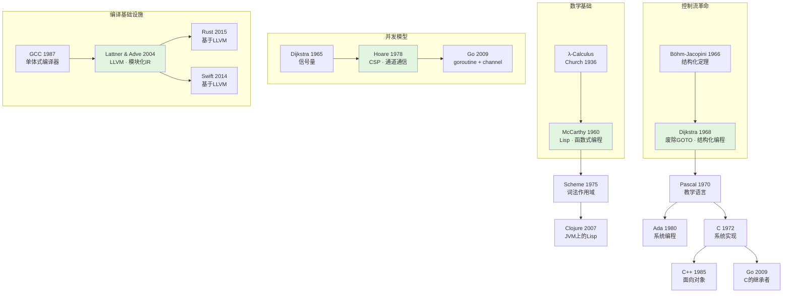

# 编程语言范式演化：从Lisp到Go的并发模型变迁

> 整合 4 篇 CS 经典论文，按函数式编程 → 结构化编程 → 进程代数 → 编译器基础设施四阶段归纳编程语言范式的演化脉络
> 创建日期：2026-04-22
> 知识覆盖率：4/30 篇精读（13%）

---

## 导读：四个范式的接力

编程语言不是孤立发明的，而是在特定历史约束下对"如何表达计算"这一问题的连续回答。本报告将 4 篇精读归纳为四个范式阶段：

| 阶段 | 年代 | 核心论文 | 核心问题 | 范式特征 |
|------|------|----------|----------|----------|
| **函数式编程** | 1960 | McCarthy, Recursive Functions... (Lisp) | 如何用数学函数表达计算？ | 递归·S-表达式·无副作用 |
| **结构化编程** | 1968 | Dijkstra, Go To Statement Considered Harmful | 如何控制程序复杂度？ | 顺序/选择/循环·进度坐标 |
| **进程代数** | 1978 | Hoare, Communicating Sequential Processes (CSP) | 如何正确表达并发？ | 通道通信·进程代数·无共享内存 |
| **编译器基础设施** | 2004 | Lattner & Adve, LLVM | 如何解耦语言与目标平台？ | 统一IR·SSA·前端/后端分离 |

**为什么是这四个阶段？** 因为现代编程语言的所有设计选择，都可以从这四个维度来理解：计算如何被表达（函数式）、控制流如何被组织（结构化）、并发如何被协调（CSP）、以及代码如何被转换为机器指令（编译器）。

---

## 一、函数式编程：计算的数学表达（1960）

### 1.1 历史节点

1960年，Fortran和COBOL主导工业界，但John McCarthy在MIT发现：现有的命令式语言无法优雅地表达符号计算（如代数推导、定理证明）。他需要一个基于数学λ演算的语言——Lisp由此诞生。

### 1.2 核心思想

McCarthy的核心洞察：**程序即数据**。S-表达式（Symbolic Expression）同时充当代码和数据的表示形式：

```lisp
;; 代码也是数据
(define (factorial n)
  (if (= n 0)
      1
      (* n (factorial (- n 1)))))

;; 可以操作代码本身
(quote (factorial 5))  ;; => (factorial 5)
```

这种**同像性（homoiconicity）**使得元编程（用程序写程序）成为语言的内建能力，而非外部工具。

### 1.3 关键设计

| 设计 | 说明 | 遗产 |
|------|------|------|
| S-表达式 | 统一语法树与数据表示 | JSON/XML的祖先概念 |
| car/cdr/cons | 列表操作原语 | 现代函数式语言的head/tail/cons |
| 垃圾回收 | 自动内存管理 | Java/Go/Python的GC源头 |
| 元循环解释器 | 用Lisp解释Lisp | 自举（bootstrapping）思想的实践 |

### 1.4 演化影响

- **直接后代**：Scheme (1975)、Common Lisp (1984)
- **概念渗透**：Python的列表推导、JavaScript的箭头函数、Java的Stream API
- **现代复兴**：Clojure (2007) 将Lisp带回JVM生态；Haskell (1990) 将纯函数式推向极致

---

## 二、结构化编程：控制流的纪律（1968）

### 2.1 历史节点

1968年，软件危机爆发。GOTO语句的滥用导致"意大利面条代码"——控制流不可追踪、不可验证。Dijkstra在CACM发表公开信，主张废除GOTO。

### 2.2 核心思想

Dijkstra的核心洞察：**程序的可理解性与控制流的结构化程度成正比**。他提出用三种基本结构替代GOTO：

```
顺序（Sequence）：A; B; C
选择（Selection）：if P then A else B
循环（Iteration）：while P do A
```

Böhm-Jacopini定理（1966）已证明：任何可计算函数都可以用这三种结构表达。Dijkstra的贡献在于**将理论结果转化为工程纪律**。

### 2.3 进度坐标框架

Dijkstra引入了一个深刻概念：**进度坐标（progress coordinates）**。每个程序点都有一个坐标，表示执行到此处的"进度"。GOTO破坏了这种坐标的可追踪性，而结构化控制流保证了：

> "给定程序文本中的任何位置，我们都能确定程序是如何到达那里的。"

### 2.4 演化影响

- **直接后代**：Pascal (1970)、C (1972)、Ada (1980)——所有现代语言的控制流设计
- **概念延伸**：异常处理（try/catch）作为结构化控制的扩展；guard语句（Rust的match）
- **与函数式的交汇**：结构化编程解决了"控制流如何组织"，函数式编程解决了"计算如何表达"——两者互补而非竞争

---

## 三、进程代数：并发的正确表达（1978）

### 3.1 历史节点

1978年，多处理器系统开始出现，但并发编程的主流模型是**共享内存+锁**。Hoare观察到：锁机制极易出错（死锁、竞态条件），且难以形式化验证。他提出用**通信**替代**共享内存**。

### 3.2 核心思想

Hoare的核心洞察：**并发程序的正确性应该通过通信模式来保证，而非通过锁机制来协调**。CSP引入了两个关键抽象：

```
进程（Process）：独立执行的计算单元
通道（Channel）：进程间单向通信的管道
```

```
P = a → b → P    ;; 进程P：先执行a，再执行b，然后递归
Q = c → d → Q    ;; 进程Q：先执行c，再执行d，然后递归

P || Q           ;; P和Q并行执行
```

### 3.3 进程代数

Hoare用代数方法描述进程的组合：

| 操作符 | 含义 | 示例 |
|--------|------|------|
| → | 前缀（顺序） | a → P：先执行a，然后像P一样行为 |
| \|\| | 并行 | P \|\| Q：P和Q同时执行 |
| □ | 外部选择 | P □ Q：环境决定执行P或Q |
| ⊓ | 内部选择 | P ⊓ Q：系统内部决定执行P或Q |

### 3.4 与Dijkstra的关联

CSP不是对结构化编程的否定，而是**将其扩展到并发领域**：
- 结构化编程：单线程内的控制流纪律
- CSP：多线程间的通信纪律

### 3.5 演化影响

- **直接工程实现**：Occam (1983)、Go (2009) 的 goroutine + channel
- **形式化验证**：FDR模型检测器、CSP/M工具
- **现代应用**：Go语言将CSP作为核心并发原语；Rust的channel库受CSP启发

---

## 四、编译器基础设施：语言与机器的解耦（2004）

### 4.1 历史节点

2004年，编程语言碎片化严重：每种语言都需要为每种目标平台（x86、ARM、SPARC）编写独立后端。Lattner在UIUC提出LLVM：**将编译过程解耦为前端、中间表示（IR）、后端三层**。

### 4.2 核心架构

```
┌─────────┐    ┌─────────┐    ┌─────────┐
│  Frontend │ → │   LLVM   │ → │ Backend  │
│ (C/C++/  │    │   IR    │    │(x86/ARM/│
│  Swift/Rust│   │ (SSA)   │    │  GPU)   │
└─────────┘    └─────────┘    └─────────┘
```

### 4.3 SSA形式

LLVM IR采用**静态单赋值（Static Single Assignment）**形式：每个变量只被赋值一次。这使得：

- **数据流分析简化**：无需追踪变量的多次赋值
- **优化 passes 可组合**：每个优化 pass 都是 IR → IR 的变换
- **验证更容易**：SSA的不变量可以被形式化检查

### 4.4 与前三阶段的关联

| 阶段 | 解决的问题 | LLVM中的体现 |
|------|-----------|-------------|
| 函数式（1960） | 计算的数学表达 | LLVM IR的函数式特性（无副作用的SSA） |
| 结构化（1968） | 控制流纪律 | LLVM的基本块（Basic Block）结构 |
| CSP（1978） | 并发协调 | LLVM的coroutine/parallel loop扩展 |

---

## 五、演化谱系总图



---

## 六、关键论文矩阵

| 论文 | 年份 | 核心贡献 | 范式定位 | 直接后继 |
|------|------|----------|----------|----------|
| McCarthy, Recursive Functions... | 1960 | S-表达式·递归·GC·元循环 | 函数式编程起源 | Scheme, Common Lisp, Clojure |
| Dijkstra, Go To Harmful | 1968 | 结构化控制流·进度坐标 | 结构化编程宣言 | Pascal, C, 所有现代语言 |
| Hoare, CSP | 1978 | 通道通信·进程代数 | 并发正确性理论 | Occam, Go, Rust channel |
| Lattner & Adve, LLVM | 2004 | 统一IR·SSA·前端后端分离 | 编译器基础设施 | Clang, Swift, Rust |

---

## 七、学习路径建议

### 7.1 按兴趣切入

- **喜欢数学优雅**：从 McCarthy 1960 → Scheme → Haskell
- **关心工程实践**：从 Dijkstra 1968 → C → Go
- **专注并发系统**：从 Hoare 1978 → Go → 分布式系统
- **想做语言实现**：从 Lattner 2004 → LLVM源码 → 编译器前端

### 7.2 前置知识

- 读 McCarthy：需要了解λ演算的基本概念
- 读 Dijkstra：需要写过至少一种命令式语言
- 读 Hoare：需要理解并发编程的基本问题（竞态、死锁）
- 读 Lattner：需要了解编译器的基本流程（词法→语法→语义→代码生成）

### 7.3 延伸阅读

- **类型理论**：Cardelli & Wegner, "On Understanding Types, Data Abstraction, and Polymorphism" (1985)
- **面向对象**：Kay, "The Early History of Smalltalk" (1993)
- **现代并发**：Rob Pike, "Concurrency Is Not Parallelism" (2012)
- **形式化验证**：Leroy, "Formal Verification of a Realistic Compiler" (2009)

---

## 八、未解问题与前沿方向

1. **函数式与命令式的统一**：能否有一种语言，既能表达Dijkstra的结构化控制流，又能保持McCarthy的数学纯粹性？（Rust的尝试：所有权系统+模式匹配）

2. **并发的可组合性**：CSP解决了"如何正确通信"，但大规模并发系统的组合性仍然是一个开放问题（参见 session types、choreography programming）

3. **编译时 vs 运行时**：LLVM将优化推迟到编译时，但JIT编译（如Java HotSpot、V8）和AI辅助优化（如MLIR）正在模糊这条边界

4. **形式化验证的工程化**：Hoare的进程代数是形式化的，但工业界仍在寻找"足够好用"的验证工具（TLA+、Coq、Lean的兴起）

---

## 九、个人评价

这四篇论文构成了编程语言设计的**思想坐标系**：

- **x轴**：表达力（从命令式到函数式）
- **y轴**：控制纪律（从GOTO到结构化到类型系统）
- **z轴**：并发模型（从共享内存到消息传递）

任何现代语言都可以在这个三维空间中找到位置：
- **C**：命令式 + 结构化 + 无并发原语
- **Haskell**：函数式 + 强类型 + 软件事务内存
- **Go**：命令式 + 结构化 + CSP并发
- **Rust**：命令式+函数式混合 + 所有权类型 + 消息传递

理解这四篇论文，就是理解了**为什么现代编程语言长这样**。

---

## 原文摘录

> "The Lisp function EVAL... serves both as the formal definition of the language and as an interpreter."
> — John McCarthy, 1960

> "The quality of programmers is a decreasing function of the density of go to statements in the programs they produce."
> — Edsger W. Dijkstra, 1968

> "We should provide for parallel composition of communicating sequential processes."
> — C.A.R. Hoare, 1978

> "The LLVM representation is designed to be both light-weight and expressive... enabling sophisticated transformations."
> — Chris Lattner & Vikram Adve, 2004
