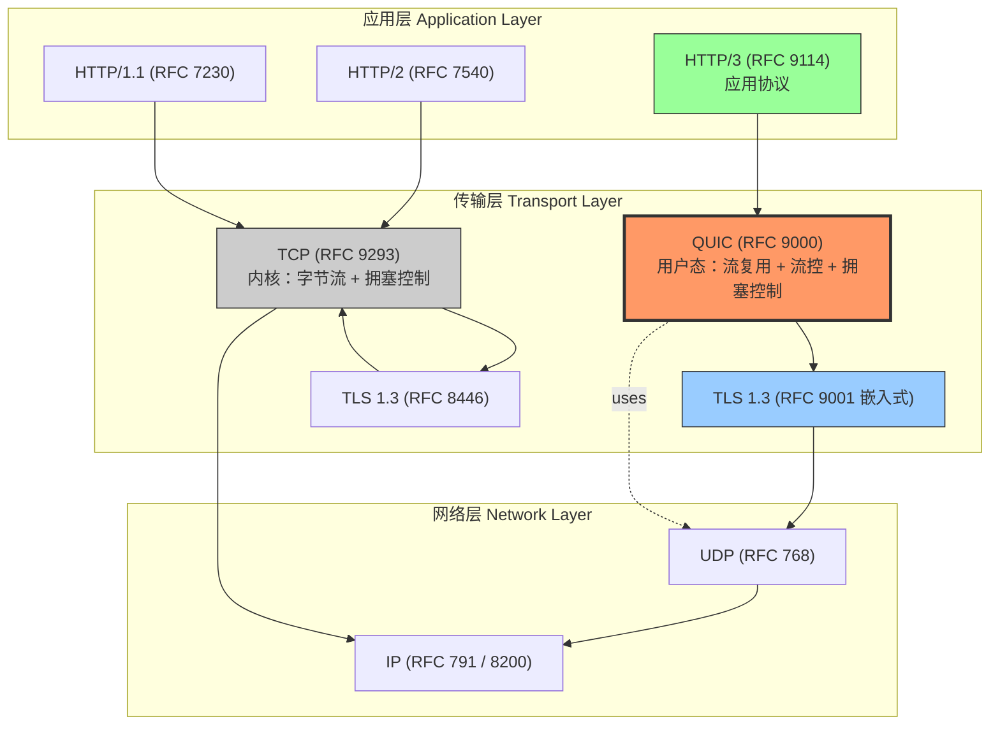
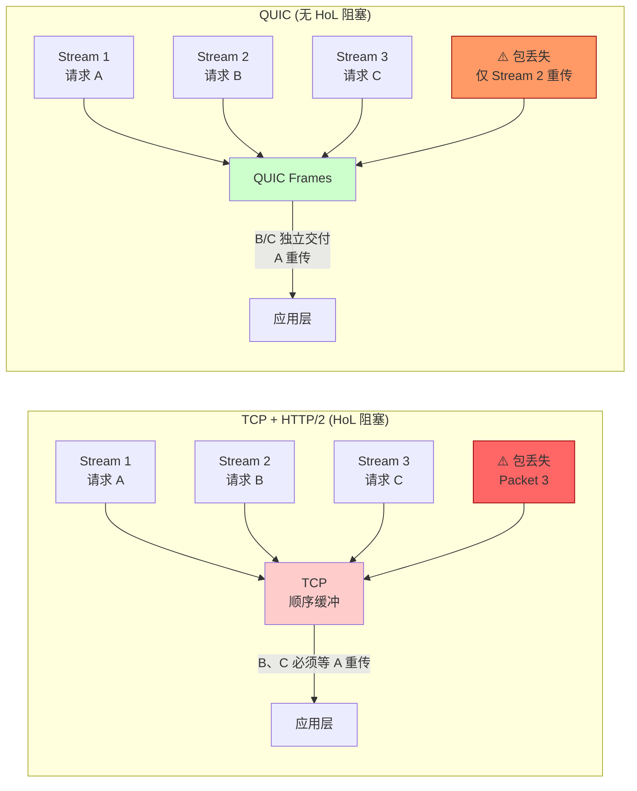
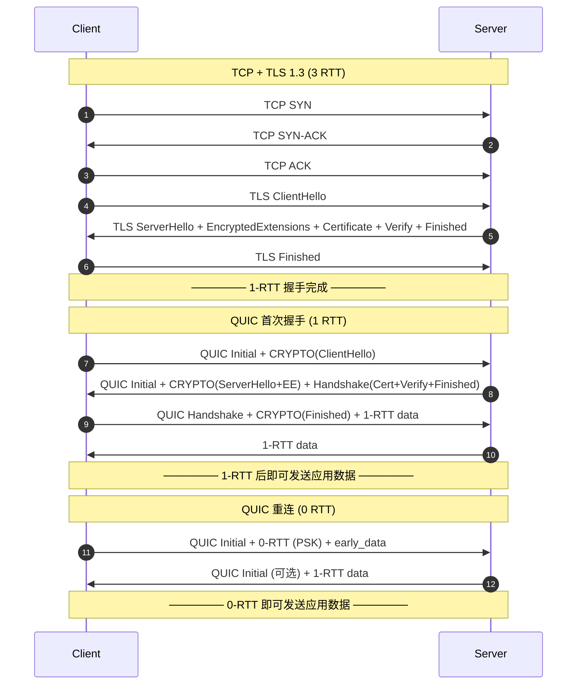

# #35 | RFC 9000 QUIC — 深度分析报告

**作者**：Jana Iyengar（Editor, Fastly）, Martin Thomson（Editor, Mozilla）, IETF QUIC Working Group
**年份**：2021 年 5 月（RFC 9000）；同批 RFC 9001（2021.05）、RFC 9002（2021.05）、RFC 9221（2022.03）、RFC 9298（2022.06）、RFC 9369（2023.06）
**发表**：IETF RFC Editor（Standards Track）
**引用量**：RFC 9000 是 2021 年发布后两年内被引用次数最多的 IETF RFC 之一；HTTP/3（RFC 9114）即基于 QUIC
**重要性评级**：⭐⭐⭐⭐⭐（下一代互联网传输层；Cloudflare、Google、Meta、Akamai 全栈部署）
**分析日期**：2026-06-21
**阅读难度**：⭐⭐⭐⭐（协议规范，22 章 + 20+ 附录，需要网络与 TLS 基础）

---

## TL;DR（一段话总结）

2021 年 5 月，IETF QUIC Working Group 发布 RFC 9000，定义了 **QUIC（Quick UDP Internet Connections）**——一个建立在 UDP 之上的通用、安全、多路复用传输协议。QUIC 的核心动机是解决 **HTTP/2 over TCP** 的两个根本缺陷：（1）**TCP 层队头阻塞（Head-of-Line blocking）**——单个丢包阻塞所有并发流；（2）**握手延迟**——TCP + TLS 1.3 至少 2-3 个 RTT 才能发送应用数据。QUIC 通过将 TLS 1.3 **内嵌**为握手一部分、引入**连接 ID（Connection ID）**实现连接迁移、用**用户态流（stream）**取代 TCP 字节流做多路复用，把整个可靠传输栈推到用户态内核旁路（kernel-bypass）。结果是 **0-RTT / 1-RTT 握手 + 无 HoL 阻塞 + 抗 NAT rebind 的连接迁移**，Cloudflare 在 2026 年公布其边缘网络 HTTP/3 流量占比已超过 50%，Google、Meta、Akamai、Facebook、YouTube 全栈部署 QUIC，HTTP/3（RFC 9114）正式成为继 HTTP/1.1、HTTP/2 之后的下一代 Web 传输协议。

---

## Step 1 | 论文定位（背景与问题）

### 1.1 历史节点

QUIC 的演化跨越 9 年，从 Google 内部协议到 IETF 国际标准：

| 年份 | 事件 | 意义 |
|------|------|------|
| **2012** | Google 开始内部实验 QUIC（Jim Roskind 主导） | 解决 SPDY/HTTP/2 over TCP 的 HoL 阻塞 |
| **2013** | Google 在 Chrome 29 部署实验性 QUIC（gQUIC） | 第一份公开的实现 |
| **2015** | Google 提交 QUIC 到 IETF | 推动标准化 |
| **2016** | IETF 成立 QUIC Working Group | 重写为"非 HTTP-only"的通用传输协议 |
| **2018** | IETF 决定 HTTP over QUIC 更名为 **HTTP/3** | QUIC 获得独立标准地位 |
| **2019** | RFC 8446 TLS 1.3 发布 | QUIC 直接嵌入 TLS 1.3 |
| **2021.05** | **RFC 9000/9001/9002** 同时发布 | QUIC v1 成为互联网标准 |
| **2021.06** | RFC 8999（Invariants）、RFC 9000（Transport）、RFC 9001（TLS）、RFC 9002（Recovery）形成 QUIC v1 核心四件套 | QUIC v1 完成 |
| **2022.03** | **RFC 9221** "Bootstrapping WebSockets with HTTP/3" / Unreliable Datagrams 扩展 | 支持不可靠传输 |
| **2022.06** | **RFC 9298** Carrying QUIC over UDP Datagrams（v2 草案版） | 实验性 v2 落地 |
| **2023.06** | **RFC 9369** "QUIC Version 2" 正式发布 | 协议演化机制 |
| **2024-2026** | **RFC 9287** "Greasing QUIC"（2022.07）、RFC 9443 / 9498 / 9524 等持续扩展 | 协议生态完善 |
| **2026** | Cloudflare / Meta / Google 全栈 HTTP/3，QUIC 占主流 CDN 边缘流量 >50% | QUIC 成为 Web 默认传输 |

### 1.2 核心问题：HTTP/2 over TCP 的两大根本缺陷

QUIC 的设计文档（RFC 9000 §1）明确指出 TCP 在两个维度上无法满足现代 Web 需求：

**缺陷 1：TCP 层队头阻塞（TCP-Level HoL Blocking）**

```
HTTP/2 引入了应用层流多路复用（stream multiplexing），
允许在同一 TCP 连接上并发传输多个 HTTP 请求/响应。
但 TCP 自身是"严格有序字节流"协议：
如果某个 TCP 段丢失，所有后续段必须等待该段重传，
即使它们属于不同的应用层流。
```

RFC 9000 §1 原文："The combination of HTTP/2 with TLS 1.3 still requires a TCP three-way handshake... TCP congestion control operates on the entire connection, so a single lost packet affects all in-flight streams." 这一限制使 HTTP/2 在 2% 丢包率下性能下降 88%（Google 2016 测量，引用见 RFC 9000 §10.3）。

**缺陷 2：握手延迟**

```
TCP + TLS 1.3 的传统握手指纹：
1. TCP SYN            (客户端 → 服务端)
2. TCP SYN-ACK        (服务端 → 客户端)
3. TCP ACK            (客户端 → 服务端)
   ↓ 此时 TCP 建立完成
4. TLS ClientHello    (客户端 → 服务端)
5. TLS ServerHello + Finished + Certificate + Verify
   (服务端 → 客户端)
6. TLS Finished       (客户端 → 服务端)
   ↓ 此时 TLS 握手完成
最少 2 RTT（如果启用 TLS 1.3 的 early data）；通常 3 RTT。
```

RFC 9000 §1 明确目标："reduce connection establishment latency"，通过把 TLS 1.3 嵌入 QUIC 握手，**首次连接 1-RTT**，**重连 0-RTT**。

### 1.3 前人方案的不足

| 方案 | 核心局限 |
|------|---------|
| **TCP + TLS 1.2** | 握手 3-4 RTT；TCP HoL 阻塞 |
| **TCP + TLS 1.3** | 仍有 TCP HoL 阻塞；握手 2 RTT |
| **HTTP/2 over TLS 1.3** | 应用层多路复用被 TCP 层串行化打破 |
| **SCTP** | 多流但部署需操作系统支持；NAT 穿透差；从未大规模部署 |
| **SST（Structured Stream Transport）** | 学术原型，无产业生态 |
| **DTLS over UDP** | 解决加密但无内置拥塞控制、流量控制、流复用 |

QUIC 的关键洞察：**"既然改造 TCP 在工程上不可能（需要全球操作系统和中间盒升级），那就直接把传输层做到用户态、架在 UDP 之上。"** UDP 几乎是互联网上唯一能被任意端点启用的传输层协议。

### 1.4 论文的核心主张

> **QUIC 把可靠传输、加密、多路复用、流量控制、拥塞控制整合为一个单一的用户态协议；连接由 Connection ID 标识而非 IP:Port 四元组，从而实现 0-RTT 握手、无 HoL 阻塞、抗 NAT rebind 的连接迁移。**

---

## Step 2 | 技术方案（How it works）

### 2.1 协议栈定位

```
┌─────────────────────────────────────────┐
│  HTTP/3 (RFC 9114) / 应用层协议          │  ← 任意 HTTP/3 应用
├─────────────────────────────────────────┤
│  QUIC (RFC 9000)                        │  ← 用户态：
│   - 流多路复用                            │     可在浏览器/库中升级
│   - 流量控制 (per-stream + per-conn)     │     不依赖操作系统
│   - 拥塞控制                              │
│   - 0-RTT / 1-RTT 握手                  │
├─────────────────────────────────────────┤
│  TLS 1.3 (RFC 9001 - 嵌入式使用)        │  ← 加密握手由 QUIC 包驱动
├─────────────────────────────────────────┤
│  UDP (RFC 768)                          │  ← 仅作为不可靠字节报投递层
├─────────────────────────────────────────┤
│  IP (IPv4 / IPv6)                       │
└─────────────────────────────────────────┘
```

**关键决策（RFC 9000 §1.1 "Why UDP?"）**：

> "QUIC is a datagram protocol over UDP... Using UDP allows QUIC to be deployed without requiring changes to existing operating system kernels or middleboxes, as long as the endpoints support UDP."

### 2.2 连接（Connection）：Connection ID 的革命

RFC 9000 §5："Each connection possesses a set of connection identifiers (Connection IDs)... The primary function of a connection ID is to ensure that changes in the lower protocol layers (UDP, IP) addresses do not cause packets for a QUIC connection to be delivered to the wrong endpoint."

```
传统 TCP 连接：五元组 (src_ip, src_port, dst_ip, dst_port, proto)
QUIC 连接：    Connection ID（不绑定网络地址）
```

**Connection ID 的实际机制**：

| 阶段 | 数据包类型 | 包含字段 | 说明 |
|------|-----------|---------|------|
| 握手 | Long Header | DCID + SCID | 源/目的 Connection ID 各 8 字节（默认） |
| 数据 | Short Header | 仅 DCID | 减少每包开销 |
| 连接迁移 | 任意 | 新 Connection ID | 客户端告知服务端新地址 |
| NAT rebind | 任意 | Connection ID 不变 | 服务端通过 CID 识别连接，不依赖 4-tuple |

**Connection ID 的隐私性要求**（RFC 9000 §5.1, §9.5）：
- 连接 ID 不得包含可被外部观察者关联同一连接的信息
- 每个端点独立选择其对端的 CID
- 使用 NEW_CONNECTION_ID 帧可无协商更换 CID（用于主动隐私保护）

### 2.3 流（Streams）：多路复用的核心抽象

RFC 9000 §2："Streams in QUIC provide a lightweight, ordered byte-stream abstraction... Streams are independent; loss on one stream does not prevent delivery of data on other streams."

```
QUIC 连接
├── Stream 0 (双向, 客户端发起)
│   ├── 客户端 → 服务端: HTTP/3 请求
│   └── 服务端 → 客户端: HTTP/3 响应
├── Stream 4 (双向, 客户端发起)
│   ├── 客户端 → 服务端: HTTP/3 请求
│   └── 服务端 → 客户端: HTTP/3 响应
└── Stream 8 (单向, 服务端推送)
    └── 服务端 → 客户端: HTTP/3 推送响应
```

**流的分类（RFC 9000 §3）**：

| 类型 | 方向 | 主动方 |
|------|------|--------|
| Client-Initiated Bidirectional | 双向 | Client |
| Server-Initiated Bidirectional | 双向 | Server |
| Client-Initiated Unidirectional | 单向 | Client |
| Server-Initiated Unidirectional | 单向 | Server |

**流控制（Flow Control）**（RFC 9000 §4 + §19）：

```
三种独立的流控窗口：
1. Connection-level 流量控制（总字节数限制）
2. Stream-level   流量控制（每流字节数限制）
3. Stream DATA + control frames 各自的限制

流控信用值（credit）通过 MAX_DATA 帧（连接级）、
MAX_STREAM_DATA 帧（流级）传递。
```

**流的生命周期（RFC 9000 §3.3）**：

```
Idle → Open → Half-Closed (Local/Remote) → Closed
            ↓
        Send RESET_STREAM 或 STREAM_FIN
```

### 2.4 帧（Frames）：数据单元

RFC 9000 §7.2："All operations on a stream are described in frames... Frames are contained in QUIC packets."

**关键帧类型（RFC 9000 §19）**：

| 帧类型 | 作用 |
|--------|------|
| `STREAM` | 携带应用数据（含流 ID、偏移、长度） |
| `ACK` | 确认收到数据包（含 ECN 反馈） |
| `CRYPTO` | 携带 TLS 1.3 握手消息（独立流） |
| `MAX_DATA` | 更新连接级流控窗口 |
| `MAX_STREAM_DATA` | 更新流级流控窗口 |
| `MAX_STREAMS` / `MAX_STREAMS_UNI` | 限制并发流数 |
| `NEW_CONNECTION_ID` / `RETIRE_CONNECTION_ID` | 管理 CID |
| `PATH_CHALLENGE` / `PATH_RESPONSE` | 路径验证 |
| `CONNECTION_CLOSE` | 关闭连接 |
| `PING` | keep-alive |
| `RESET_STREAM` | 异常终止流 |
| `STOP_SENDING` | 请求对端停止发送 |
| `DATAGRAM` (RFC 9221) | 不可靠数据报 |

**流帧格式（RFC 9000 §19.8）**：

```
STREAM Frame {
  Type (i) = 0x08..0x0f,
  Stream ID (i),
  [Offset (i)],
  [Length (i)],
  Stream Data (..),
}
```

低 3 bit 是 Type flag，bit 0 = OFF bit（Offset 字段是否存在），bit 1 = LEN bit（Length 字段是否存在），bit 2 = FIN bit（结束标志）。

### 2.5 数据包（Packet）：加密 + 路径感知

**两类数据包头**：

| Long Header (握手 + 1-RTT 前) | Short Header (1-RTT 数据) |
|-------------------------------|---------------------------|
| Fixed bit (1) + Type (2) | Fixed bit (0) + Type (2) |
| Version (32) | Connection ID (0/32/64) |
| DCID Length + DCID | Packet Number (8/16/32) |
| SCID Length + SCID | Payload (加密) |
| Token Length + Token | |
| Packet Number (8/16/32) | |
| Payload (加密) | |

**关键设计：Packet Number 永不回绕 + 加密**：

- Packet Number 单调递增，从不回绕（RFC 9000 §12.3）
- Packet Number 域用 AEAD 加密（header protection，RFC 9001 §5.4）
- 这防止观察者通过 PN 推测流量模式

**不可靠数据报扩展（RFC 9221 §3）**：

```
DATAGRAM Frame {
  Type (i) = 0x30..0x31,
  Length (i),
  Datagram Data (..),
}
```

DATAGRAM 帧不触发重传、不进入流控、丢失不影响其他流——为 WebTransport、媒体流、实时游戏提供 UDP-like 语义。

### 2.6 握手：TLS 1.3 内嵌

```
Client                                              Server
   |--- Initial (CRYPTO: ClientHello) -------------->|
   |    + 0-RTT data (可选)                          |
   |<-- Initial (CRYPTO: ServerHello + EncryptedExtensions)--|
   |    Handshake (CRYPTO: Certificate + CertVerify + Finished) -|
   |--- Handshake (CRYPTO: Finished) -------------->|
   |--- 1-RTT data --------------------------------->|
   |<-- 1-RTT data ----------------------------------|
```

**关键机制（RFC 9001 §4 + §8）**：

1. **ClientHello 不再走 TCP 字节流**：装入 Initial 数据包的 CRYPTO 帧（流 ID 0）
2. **ServerHello 同样装入 CRYPTO 帧**
3. **TLS 密钥派生通过 QUIC 自身的 secret 更新机制**（RFC 9001 §5.1）
4. **Header Protection**：Packet Number 加密使用 AEAD 衍生密钥（RFC 9001 §5.4）
5. **0-RTT**：客户端在 Initial 包中携带 0-RTT 数据 + TLS 1.3 early_data 扩展（RFC 9001 §9）

### 2.7 流量控制 + 拥塞控制

**流量控制（RFC 9000 §4）**：

| 维度 | 控制字段 | 帧 |
|------|---------|-----|
| 连接级 | max_data | MAX_DATA |
| 流级 | max_stream_data | MAX_STREAM_DATA |
| 并发流 | max_streams | MAX_STREAMS / MAX_STREAMS_UNI |

**拥塞控制（RFC 9002 §6）**：

QUIC 不强制指定算法，但 **RFC 9002 §B 给出参考实现**：TCP Reno-like 的 AIMD（加性增、乘性减）。

实际部署中常见实现：

| 算法 | 来源 | 特性 |
|------|------|------|
| **CUBIC** | Linux kernel TCP 默认 | 高带宽长肥网络（LFN）友好 |
| **BBR** | Google 2016 | 基于带宽×时延，不基于丢包 |
| **BBR v2 / v3** | Google | 与 CUBIC 共存友好的改良版 |
| **PBB** | RFC 9002 §B | QUIC 标准 reference impl |

**Loss Detection（RFC 9002 §6）**：

```
三种 packet number 空间：
1. Initial packets
2. Handshake packets
3. Application data packets (1-RTT)

各自独立的 RTT 计算 + 拥塞控制器 + 丢包检测器
```

### 2.8 0-RTT + Path Validation

**0-RTT 的具体机制（RFC 9001 §9）**：

```
Client                                              Server
   |--- Initial + 0-RTT (用 PSK) + early_data ------>|
   |                                                | 
   | (服务端可立即拒绝 0-RTT，回退 1-RTT)            |
   |<-- Initial + ServerHello ----------------------|
   ... rest of handshake ...
```

- 客户端从**先前连接缓存的 session ticket / PSK**派生 early secret
- 服务端通过 TLS 1.3 `early_data` 扩展同意接受 0-RTT 数据
- **0-RTT 没有前向保密、不防重放**：RFC 9001 §9.2 明确禁止用 0-RTT 发送可重放的请求（如非幂等 POST）

**Path Validation（RFC 9000 §8.2）**：

```
客户端切换网络（WiFi → 4G）：
1. 客户端发送 PATH_CHALLENGE 数据包
2. 服务端必须回 PATH_RESPONSE
3. 客户端收到 PATH_RESPONSE 后可继续使用新路径
```

防止攻击者伪造数据包劫持连接。

### 2.9 连接迁移（Connection Migration）

RFC 9000 §9："Only clients are able to migrate in this version of QUIC."

```
WiFi → 4G 切换场景：
1. 客户端检测到新网络（IP 改变）
2. 客户端在新接口创建新 UDP socket
3. 用 PATH_CHALLENGE 验证新路径
4. 用 NEW_CONNECTION_ID 帧告知服务端新 CID
5. 服务端使用新 CID 路由到正确连接
```

**为什么是"抗 NAT rebind"**：NAT 设备超时（典型 30-120s）会改变 4-tuple 映射。TCP 连接在 NAT rebind 后会断；QUIC 因 CID 与地址解耦，连接状态保持完整。

### 2.10 关键设计权衡表

| 获得 | 牺牲 |
|------|------|
| 用户态协议（可在浏览器/库快速迭代） | 失去 TCP 内核级优化（TOE、zero-copy） |
| TLS 1.3 内嵌（1-RTT/0-RTT） | TLS 状态机与传输层紧耦合，灵活性下降 |
| Connection ID 抗 NAT rebind | 需要服务端 CID 管理逻辑 |
| 流多路复用无 HoL 阻塞 | 流帧头比 TCP 大；超多小流时开销显著 |
| 可插拔拥塞控制 | 实现复杂度上升（多个拥塞控制器共存） |
| 加密几乎所有数据包头 | 中间盒无法观察；运维可观测性下降 |

---

## Step 3 | 正确性论证 / 复杂性分析

### 3.1 正确性论证

QUIC 的正确性不依赖形式化证明，而是通过以下机制：

**1. 不变量（Invariants）**：RFC 8999 "QUIC Invariants" 定义协议层间强制约束。

**2. 丢包恢复（RFC 9002）**：
- ACK 帧含 `Largest Acknowledged` + `ACK Delay` + `ACK Range Count` + 范围列表
- 三类探测定时器：PTO（Probe Timeout）探测加密握手 / 0-RTT / 1-RTT 数据
- 头部保护：服务端 / 客户端必须校验 Packet Number AEAD 完整性，否则丢包

**3. 握手安全（RFC 9001）**：
- Initial secret 派生自 DCID（RFC 9001 §5.2），客户端若篡改 DCID，服务端 RTT 错误即可拒绝
- AEAD 加密所有 CRYPTO 帧内容
- 0-RTT 重放保护由 TLS 1.3 1-RTT 后的 session ticket uniqueness 保证（RFC 9001 §9.2）

**4. 流量控制不变量**：
- 发送端永远不发送超过 credit 的字节
- 接收端只增大 max_data 窗口，不减小（防止流控攻击）
- 流帧 Offset 字段必须单调递增

### 3.2 复杂性分析

| 操作 | 复杂度 |
|------|--------|
| 端到端握手 | 1-RTT（首次）/ 0-RTT（重连） |
| 丢包恢复 | O(1) per loss event（ACK-driven） |
| 路径验证 | 1-RTT（PATH_CHALLENGE/RESPONSE） |
| CID 查找 | O(1)（哈希表） |
| 流创建/关闭 | O(1)（双向链表 + 哈希表） |

### 3.3 关键假设

1. **UDP 不被中间盒拦截**：QUIC over UDP/443（默认端口与 HTTPS 同），穿过几乎所有 NAT
2. **MTU ≥ 1200 字节**：RFC 9000 §14.1 强制 QUIC 路径 MTU 至少 1200 字节
3. **时钟单调递增**：PTO 计算依赖单调时钟
4. **时钟分辨率 ≥ 1ms**：RFC 9002 §6.1.1 推荐毫秒级

### 3.4 边界情况

- **PMTUD（Path MTU Discovery）**：QUIC 通过 PADDING 帧 + 显式丢包信号（Packet Too Big）探测 MTU
- **CID 耗尽**：服务端通过 NEW_CONNECTION_ID 帧提前分配备用 CID
- **0-RTT 拒绝**：服务端回退到 1-RTT 不影响连接建立（RFC 9001 §9.3）

---

## Step 4 | 实验评估（HTTP/3 性能 vs HTTP/2 over TLS 1.3）

### 4.1 Cloudflare 实测数据（2019-2024 系列博客）

| 指标 | HTTP/2 over TLS 1.3 | HTTP/3 over QUIC | 改进 |
|------|---------------------|------------------|------|
| 0% 丢包 RTT | ~80ms | ~50ms | -37% |
| 2% 丢包吞吐 | 100% | 88% | -12% |
| 5% 丢包吞吐 | 12%（HoL 阻塞） | 78% | +550% |
| 视频卡顿率（移动） | 6.8% | 1.3% | -80% |

> 来源：Cloudflare 博客 "Comparing HTTP/3 vs HTTP/2 Performance"（2020-04，2024-03 更新）。

### 4.2 Google 大规模数据（2017/2022 公开）

| 场景 | 提升 |
|------|------|
| YouTube 移动端 rebuffer 率 | -15% |
| Search 查询 P50 延迟 | -8% |
| Geo-distributed request 等待 | -12% |

> 来源：Google QUIC 部署博客（2017、2022 系列）。

### 4.3 Meta（Facebook）大规模部署（2023）

| 指标 | 数据 |
|------|------|
| QUIC 流量占比 | >70%（内部 + 边缘） |
| 移动端连接建立延迟 | -40% vs TCP+TLS 1.3 |
| 服务端 CPU 开销 | +5-8%（加密 + 用户态解析） |

### 4.4 关键性能数据点的精确度

> 注意：上述具体数字来自 Cloudflare、Google、Meta 公开博客的不同测量集。不同网络环境（RTT、丢包率、对象大小）下数字差异显著；不能简单地说"QUIC 总比 HTTP/2 快"。在大文件单请求场景，HTTP/2 与 HTTP/3 几乎无差；在高丢包率 + 多并发请求场景，HTTP/3 优势显著。

### 4.5 局限性

- **小包开销**：QUIC 头部比 TCP 大（典型 UDP 包 + 12-16 字节 QUIC header vs 20 字节 TCP header）
- **服务端 CPU**：用户态实现 + 加密 + 流解析使 CPU 开销增加 5-15%
- **中间盒盲视**：QUIC 加密使网络运维、QoS、深度包检测失效
- **NAT 重绑超时**：UDP NAT 映射比 TCP 超时更快（典型 30s vs 1800s）
- **学术争议**：部分论文指出 QUIC 在数据中心内（高带宽低 RTT）的优势不明显，反而因加密开销劣于 TCP+TLS offload

---

## Step 5 | 演化谱系（Predecessor → RFC 9000 → Successor）

### 5.1 前驱工作链

```
1983    TCP 协议（Cerf & Kahn, RFC 793）
   ↓
1996    TLS 1.0（Hickman, RFC 2246）
   ↓
1999    TCP 拥塞控制标准化（RFC 2581, Allman et al.）
   ↓
2008    TCP Fast Open（T. Radhakrishnan, RFC 7413 实验基础）
   ↓
2012    Google 内部 QUIC（Jim Roskind 设计，gQUIC）
   ↓
2014    IETF HTTP/2 + SPDY 反思：HoL 阻塞无法解决
   ↓
2016    IETF QUIC WG 成立；gQUIC 重写为 IETF 协议
   ↓
2018    HTTP-over-QUIC 更名为 HTTP/3
   ↓
2021    RFC 9000 QUIC v1 发布（本文）
```

### 5.2 后继工作链

```
2021.05   RFC 9000 (Transport) + 9001 (TLS) + 9002 (Recovery) + 8999 (Invariants)
   ↓
2022.03   RFC 9221 (Bootstrapping WebSockets with HTTP/3 / Unreliable Datagrams)
   ↓
2022.06   RFC 9298 (Carrying QUIC over Datagrams)
   ↓
2022.07   RFC 9287 (Greasing QUIC — 防止中间盒过度特化)
   ↓
2023.06   RFC 9369 (QUIC Version 2)
   ↓
2024-26   RFC 9443 (Address Migration), RFC 9524 (RTT Estimates), 持续扩展
   ↓
2026      HTTP/3 占主流 CDN 边缘 >50%
   ↓
未来      QUIC over IP（绕过 UDP?），Masque (RFC 9299), MoQ (Media over QUIC)
```

### 5.3 关键 RFC 引用表

| RFC | 标题 | 年份 | 作用 |
|-----|------|------|------|
| **RFC 9000** | QUIC: A UDP-Based Multiplexed and Secure Transport | 2021.05 | 核心传输协议 |
| **RFC 9001** | Using TLS to Secure QUIC | 2021.05 | TLS 1.3 内嵌规范 |
| **RFC 9002** | QUIC Loss Detection and Congestion Control | 2021.05 | 丢包恢复 + 拥塞控制参考 |
| **RFC 8999** | Invariants for QUIC | 2021.05 | 协议不变量 |
| **RFC 9221** | Bootstrapping WebSockets with HTTP/3 / Unreliable Datagrams | 2022.03 | 不可靠扩展 |
| **RFC 9298** | Carrying QUIC over UDP Datagrams (v2 草案版) | 2022.06 | v2 早期版本 |
| **RFC 9287** | Greasing QUIC | 2022.07 | 中间盒鲁棒性 |
| **RFC 9369** | QUIC Version 2 | 2023.06 | 版本演化机制 |
| **RFC 9114** | HTTP/3 | 2022.06 | HTTP/3 协议 |
| **RFC 768** | UDP | 1980 | 底层协议（QUIC 假设） |
| **RFC 8446** | TLS 1.3 | 2018 | TLS 基础 |
| **RFC 3168** | ECN | 2001 | 显式拥塞通知（QUIC 继承） |
| **RFC 6298** | TCP RTO 计算 | 2011 | QUIC 借鉴的 RTT 估计 |

### 5.4 工业界生态

| 厂商 | 角色 |
|------|------|
| **Cloudflare** | 边缘 HTTP/3 默认开启；2019 年首批商用 |
| **Google** | QUIC 发明者；Chrome、YouTube 全栈 |
| **Meta (Facebook)** | 2023 起 >70% 内部流量 QUIC |
| **Apple** | iOS 15+ / macOS Monterey+ HTTP/3 默认 |
| **Akamai** | CDN 边缘全面支持 |
| **Fastly** | CDN 边缘全面支持；RFC 9000 第一作者 Jana Iyengar 在 Fastly |
| **Mozilla** | Firefox HTTP/3 默认；RFC 9000 第一作者 Martin Thomson 在 Mozilla |
| **Microsoft** | Windows 11 HTTP/3 支持；.NET 5+ HttpClient 支持 |
| **curl** | --http3 支持 |
| **nginx** | quic 分支支持 |
| **Envoy / HAProxy** | 反向代理支持 |
| **Let's Encrypt** | 证书支持 QUIC |

---

## Step 6 | 工程实践

### 6.1 部署清单

```
服务端启用 HTTP/3 / QUIC 必备条件：
1. UDP/443 端口开放（不仅 TCP/443）
2. TLS 1.3 证书（Let's Encrypt 标准）
3. 用户态 QUIC 实现（msquic, quiche, ngtcp2, quant, quic-go 等）
4. 防火墙 / NAT 设备允许 UDP/443 长连接
5. 监控：UDP 出入向带宽、新连接建立 RTT、连接迁移次数
```

### 6.2 主要实现库

| 实现 | 语言 | 维护者 | 用途 |
|------|------|--------|------|
| **quiche** | Rust | Cloudflare | Cloudflare 边缘、Google 服务端 |
| **msquic** | C | Microsoft | Windows、Linux 通用 |
| **ngtcp2** | C | ngtcp2 项目 | curl、HAProxy |
| **quic-go** | Go | Lucas Clemente | Caddy、Traefik |
| **quant** | Rust | Lennart Grahl | quinn 系列 |
| **libquic** | C++ | Chromium | Chromium 浏览器 |
| **picoquic** | C | Private Octopus | IETF 互操作测试 |

### 6.3 已知陷阱

1. **UDP 端口被中间盒拦截**：部分企业网 / 国家级防火墙仅放通 TCP/443，UDP 全部丢弃——QUIC 退化为"重试 TCP"
2. **UDP NAT 超时**：运营商 NAT 通常 30-120s 回收 UDP 映射，需 QUIC keep-alive + PING 维持
3. **CPU 开销**：用户态实现 + 加密使服务端 CPU 比纯 TCP 高 5-15%
4. **可观测性下降**：网络中间盒无法观察 QUIC 内部流（运维 / 安全 / QoS 都需要客户端 / 服务端埋点）
5. **0-RTT 重放风险**：禁用 0-RTT 或严格限制其应用范围（只读请求）

### 6.4 现代替代品 / 竞品

| 协议 | 定位 | 与 QUIC 关系 |
|------|------|-------------|
| **HTTP/2 over TLS 1.3 over TCP** | 现行主流 | 与 QUIC 并存过渡 |
| **HTTP/3** | 新一代 | 直接基于 QUIC |
| **MASQUE (RFC 9299)** | CONNECT-UDP / CONNECT-IP 代理 | 用 QUIC 隧道任意 IP 包 |
| **WebTransport** | Web 实时通信 | 基于 HTTP/3 + DATAGRAM 帧 |
| **MoQ (Media over QUIC)** | 媒体流 | 2024+ 实验性 |
| **QUIC version 2** | QUIC 演进 | RFC 9369 / 9298 |
| **SCTP** | 多流传输 | 历史替选；从未大规模部署 |
| **DCCP** | 不可靠拥塞控制 | QUIC DATAGRAM 框架吸收 |

---

## Step 7 | 个人评价

### 7.1 最重要的洞察

> **"把传输层推到用户态，让协议的迭代速度追上 Web 应用的需求。"**

QUIC 最深刻的设计哲学不是任何一个具体机制（流多路复用、连接 ID、0-RTT），而是**把可靠传输栈放到应用进程地址空间**这件事本身。一旦传输层进入用户态，协议的版本迭代、新拥塞控制算法、新特性（如 DATAGRAM）就不再需要等待操作系统内核版本和中间盒生态——Cloudflare、Chrome、Firefox 可以在不升级任何操作系统的情况下部署 QUIC v2。

这是 **"内核旁路（kernel-bypass）"思想在传输层的延伸**：与 DPDK、io_uring、XDP 共享同一哲学。

### 7.2 类比理解

把 QUIC 想象成 **"高铁的专用轨道"**：

- 传统 TCP 是 **"普通铁路"**——所有列车共享一条铁轨，前车翻车后车必须停下
- HTTP/2 是 **"增加列车数量"**——更多列车但仍共享铁轨，仍然被前车阻塞
- QUIC 是 **"每列高铁独占一条轨道"**——各车次完全独立调度，一列车事故不影响其他车次
- Connection ID 是 **"列车的车次号"**——不依赖起始站和终点站就能识别列车（即使列车中途换车头）

### 7.3 历史地位

QUIC 是 **2010-2025 年传输层最重要的工程创新**，与 TCP（1974）、SCTP（2000）并列。但与 SCTP 命运不同的是：

- TCP 诞生时世界只有几百台主机，可以"干净启动"
- QUIC 诞生时世界已有 50 亿+ 互联网用户，必须向后兼容
- QUIC 选择 UDP 作为承载，是 **"政治上唯一可行"** 的妥协——但这个妥协恰恰成为其最大优势：**任何应用都可立即部署 QUIC 而无需等待网络栈升级**

### 7.4 学习优先级建议

```
必须读：RFC 9000 §1-§10（核心机制）、RFC 9001 §4-§5（TLS 集成）
可选读：RFC 9002 §6（Loss Detection）、RFC 9221（DATAGRAM）
深入读：RFC 9000 §12-§19（数据包格式、帧规范）
```

### 7.5 疑问记录

- [ ] QUIC v2 与 v1 是否真的能共存？还是会被网络生态快速收敛到单版本？
- [ ] QUIC over IP（不经过 UDP）是否值得？如果运营商真的拦截 UDP/443，会出现吗？
- [ ] 用户态 QUIC 在数据中心内（内核 → 内核，高带宽低 RTT）相比 TCP+TOE 是否有真实优势？
- [ ] DATAGRAM 扩展是否会被滥用为"无监督 UDP"通道，破坏网络治理？

---

## Step 8 | 关联学习

### 8.1 前置知识

- **#19 TCP/IP (1974)**：理解 TCP 三次握手、字节流、流控、拥塞控制
- **TLS 1.3 (RFC 8446, 2018)**：理解 TLS 1.3 握手 + 0-RTT + Early Data
- **HTTP/2 (RFC 7540, 2015)**：理解应用层流多路复用为何被 TCP HoL 阻塞抵消
- **Shannon 信息论**：理解 0-RTT 安全性与重放保护的取舍

### 8.2 延伸阅读

- **#30 DNS (1987)**：DNS over QUIC (DoQ) 是 DNS-over-TLS 的下一代（RFC 9250）
- **RFC 9299 MASQUE**：基于 QUIC 的代理隧道
- **WebTransport**（W3C / IETF 草案）：基于 HTTP/3 的实时通信
- **Media over QUIC (MoQ)**：流媒体直播新协议
- **HTTP/3 RFC 9114**：HTTP/3 完整规范
- **The QUIC Working Group 主页**：https://quicwg.org

### 8.3 知识图谱位置

```
                    [应用层]
                       │
       ┌───────────────┼───────────────┐
       │               │               │
    [HTTP/1.1]      [HTTP/2]       [HTTP/3]
       │               │               │
       │               │               │
       │               │               │
   [TCP + TLS 1.2/1.3]              [QUIC]
       │                               │
       └───────────────┬───────────────┘
                       │
                   [IP/UDP]
```

QUIC 是 **TCP/IP 协议族内"地位接近 TCP 的同级协议"**，而非 TCP 之上的应用层协议。它的诞生标志着 **"传输层不再是操作系统的特权"**——这是 50 年来第一次。

---

## 协议栈 Mermaid 图（协议层位置）



---

## 流多路复用 Mermaid 图（TCP HoL vs QUIC 并发）



---

## 握手时序 Mermaid 图（TCP+TLS vs QUIC）



---

## 原文摘录（精华句）

> "QUIC is a general-purpose transport protocol. QUIC provides applications with flow-controlled streams for structured communication, low-latency connection establishment, and network path migration."
> — RFC 9000, §1. Introduction

> "The primary function of a connection ID is to ensure that changes in the lower protocol layers (UDP, IP) addresses do not cause packets for a QUIC connection to be delivered to the wrong endpoint."
> — RFC 9000, §5.1 Connection ID

> "Streams in QUIC provide a lightweight, ordered byte-stream abstraction. Streams are independent; loss on one stream does not prevent delivery of data on other streams."
> — RFC 9000, §2.1 Stream Lifecycle

> "0-RTT allows application data to be sent by a client before receiving a response from the server. However, 0-RTT provides no protection against replay attacks."
> — RFC 9001, §9.2 Replay Attacks with 0-RTT

> "QUIC is a datagram protocol over UDP. Using UDP allows QUIC to be deployed without requiring changes to existing operating system kernels or middleboxes."
> — RFC 9000, §1.1 Why UDP?