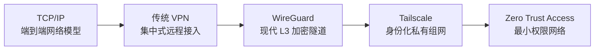

# Tailscale / WireGuard / VPN

## 一句话定义

Tailscale 是基于 WireGuard 的身份化私有组网系统：WireGuard 负责端到端加密隧道，Tailscale 负责身份、密钥分发、NAT 穿透、DERP 中继、MagicDNS 与 ACL。

## 核心原理

- **VPN**：把远程设备接入私有网络的抽象。
- **WireGuard**：三层加密隧道协议，用公钥识别 peer，并把 peer public key 与 AllowedIPs 绑定。
- **Tailscale**：在 WireGuard 之上加入控制平面，自动完成设备注册、公钥分发、路由同步、DNS 和权限控制。
- **NAT Traversal**：优先尝试 UDP 打洞，让两个 NAT 后设备直接通信。
- **DERP**：直连失败时的中继兜底，只转发已经加密的 WireGuard 包。
- **MagicDNS**：用设备名替代 `100.x.y.z` 地址。
- **ACL / grants**：按用户、设备、标签、端口做最小权限访问控制。

## 演化脉络

## 与传统 VPN 的区别

传统 VPN 常常是用户设备先连到中心网关，再进入一大片内网。Tailscale 更像一个 overlay mesh：设备之间优先直连，控制平面只负责介绍设备、下发密钥和权限策略。

这使它更适合个人 homelab、远程开发、移动设备访问 Mac/NAS/VPS 等场景。

## 工程实践要点

- iPad 用 Termius 连接 MacBook 时，优先连接 Mac 的 Tailscale IP 或 MagicDNS 名称。
- macOS 需要开启“远程登录”，也就是 SSH server。
- 不建议把 SSH 22 端口暴露到公网。
- 与 Clash Verge 共存时，应让 `100.64.0.0/10` 和 `*.ts.net` 走 DIRECT。
- 只做 SSH 回家时通常不需要 Exit Node。
- 要访问没装 Tailscale 的 NAS/打印机，再考虑 Subnet Router。

## 在本项目的相关报告

- [Tailscale、WireGuard 与现代 VPN](../../reports/knowledge_reports/Tailscale_WireGuard_VPN_原理深度解析.md)
- [19_tcpip_1974](../../reports/paper_analyses/19_tcpip_1974.md)
- [30_dns_1987](../../reports/paper_analyses/30_dns_1987.md)
- [31_bgp_rfc4271_2006](../../reports/paper_analyses/31_bgp_rfc4271_2006.md)
- [DHT实战排查：从协议理论到工程故障诊断](../../reports/knowledge_reports/DHT实战排查：从协议理论到工程故障诊断.md)

## 跨域连接

- [tcp_ip](./tcp_ip.md)：WireGuard/Tailscale 都建立在 IP 网络与 UDP 传输之上。
- [dns](./dns.md)：MagicDNS 是 tailnet 内的设备名解析层。
- [bgp_interdomain_routing](./bgp_interdomain_routing.md)：Tailscale overlay 网络与公网 BGP 路由是两层不同的可达性系统。
- [dht_chord](./dht_chord.md)：DHT、WireGuard、Tailscale 都会面对 NAT 与 UDP 可达性问题。
- [distributed_storage](./distributed_storage.md)：长期运行的家庭/团队基础设施需要把网络访问控制作为可靠性边界。

## 被引用于

- [tcp_ip](./tcp_ip.md)
- [dns](./dns.md)
- [bgp_interdomain_routing](./bgp_interdomain_routing.md)

## 开放问题

- 复杂企业网络中，Tailscale ACL / grants 如何与已有 IAM、MDM、EDR、审计系统闭环。
- 多层代理、TUN、Docker 网络、企业 VPN 同时存在时，如何系统化诊断路由优先级。
- Overlay 网络扩展到 subnet router 后，如何避免把传统内网的横向移动风险带入 tailnet。
