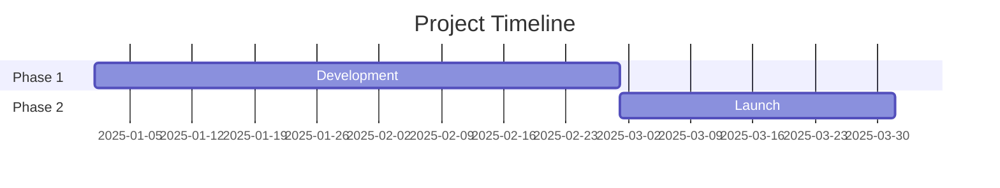
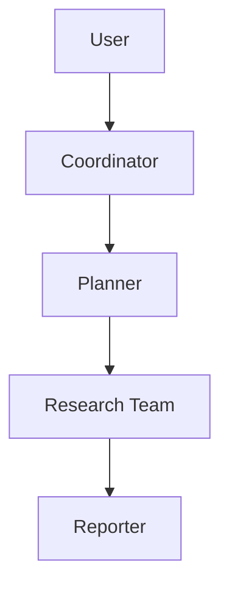
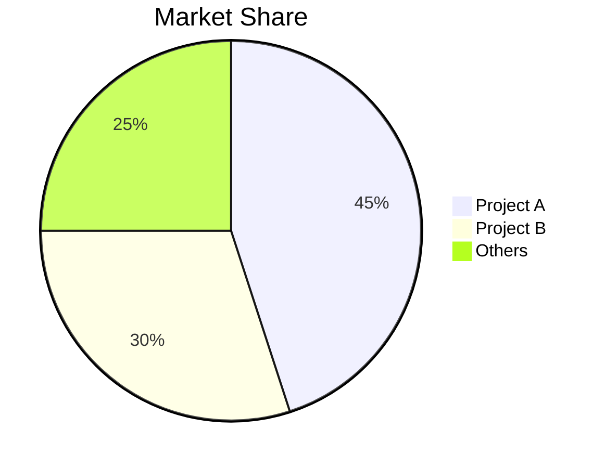

# GitHub Deep Research Skill

Multi-round research combining GitHub API, web_search, web_fetch to produce comprehensive markdown reports.

关键约束：当本技能被 `github-trending-analyzer` 调用时，必须遵守上层技能的输出路径、命名规则、图表限制和中文结构要求。
完整约束见 [`TASK_PROTOCOL.md`](../TASK_PROTOCOL.md) TT-1/TT-2 章节。

## Research Workflow

四轮研究，每轮有**强制产出物（artifact）**。没有产出物的轮次视为未完成，不得进入下一轮。
核心原则：**技术分析必须基于真实代码，竞品数据必须经 API 核验，社区/趋势结论必须有量化信号支撑。**

| 轮次 | 目标 | 强制产出物 |
|------|------|-----------|
| Round 1 元数据 | 仓库客观事实 | 语言占比、头部 5 贡献者及提交数、近 10 次发版节奏、顶层目录树 |
| Round 2 读代码 | 代码驱动的架构理解 | 依赖清单要点 + 2-5 个核心源文件的关键发现（[代码] 证据） |
| Round 3 竞品核验 | 真实、可验证的竞品表 | ≥2 个竞品的 `gh` 实测 stars/license/最近推送 |
| Round 4 量化信号 | 数据驱动的活跃度/趋势 | 近 52 周提交曲线特征 + issue 响应概况 |

## Core Methodology

### Query Strategy

**Broad to Narrow**: Start with GitHub API + 源码, then targeted web queries, refine based on findings.

**Source Prioritization**:
1. 仓库源代码与官方 docs（最高权重，[代码]/[README]）
2. Technical blogs（Medium, Dev.to）
3. News articles（verified outlets）
4. Community discussions（Reddit, HN）
5. Social media（最低权重，仅用于 sentiment）

### Research Rounds

**Round 1 — 元数据（GitHub API）**

直接执行 `scripts/github_api.py`，不必先 `read_file()`：
```bash
python3 /path/to/skill/scripts/github_api.py <owner> <repo> summary
python3 /path/to/skill/scripts/github_api.py <owner> <repo> readme
python3 /path/to/skill/scripts/github_api.py <owner> <repo> contributors
python3 /path/to/skill/scripts/github_api.py <owner> <repo> releases
python3 /path/to/skill/scripts/github_api.py <owner> <repo> languages
python3 /path/to/skill/scripts/github_api.py <owner> <repo> tree
```
**产出物**：语言字节占比、头部 5 贡献者及 contributions、近 10 次发版（看 alpha/beta/rc → 正式版节奏）、顶层目录结构。

**可用命令**（`github_api.py` 末位参数）：
`summary` · `info` · `readme` · `tree` · `file <path>` · `languages` · `contributors` · `commits` · `commit_activity` · `issues` · `prs` · `releases` · `tags`

**Round 2 — 读代码（强制，决定"技术分析"章质量）**

> ⚠️ 不读代码就写架构 = README 复述。技术分析章必须出现 ≥1 处 [代码] 证据。

1. 看 `tree` 输出定位入口与核心模块。
2. 读依赖清单（按语言择一）：`package.json` / `pyproject.toml` / `Cargo.toml` / `go.mod` / `pom.xml` / `build.gradle`。
3. 读 **2-5 个关键源文件**（入口文件、核心模块、关键配置）：
```bash
python3 /path/to/skill/scripts/github_api.py <owner> <repo> file package.json
python3 /path/to/skill/scripts/github_api.py <owner> <repo> file src/main.py
```
**产出物**：从真实代码得出的架构判断（模块划分、数据流、关键依赖、设计取舍），标注 [代码]。README 与代码冲突时以代码为准并指出冲突。

**Round 3 — 竞品核验（强制，决定"竞品对比"章可信度）**

> ⚠️ 禁止凭记忆填竞品 stars。所有竞品数值必须现查现填。

1. web_search 找同类项目（"{topic} alternatives" / "{topic} vs"）。
2. 把每个候选竞品解析为 `owner/repo`。
3. **逐个用 `gh` 拉真实数据**后才允许写入表格：
```bash
gh api -X GET repos/<owner>/<repo> --jq '"\(.full_name) | stars=\(.stargazers_count) | lang=\(.language) | license=\(.license.spdx_id) | pushed=\(.pushed_at[0:10])"'
```
**产出物**：≥2 个竞品的实测 stars/语言/协议/最近推送日期。闭源竞品标注"闭源"，不编造数字。

**Round 4 — 量化信号 + 深挖（决定"社区活跃度/发展趋势"章）**

```bash
python3 /path/to/skill/scripts/github_api.py <owner> <repo> commit_activity   # 近 52 周周提交
python3 /path/to/skill/scripts/github_api.py <owner> <repo> issues            # issue 响应概况
```
- 用 commit_activity 描述趋势（"近 8 周均值 vs 全年均值"），替代"几乎每日提交"这类定性话术。
- 用 issues 的 created/closed 时间估算响应概况。
- web_fetch 有价值 URL 补充 sentiment 与 roadmap。
**产出物**：≥1 个量化结论（提交曲线特征 / issue 响应概况）。

## Report Structure

Follow template in `assets/report_template.md`:

1. **Metadata Block** - Date, confidence level, subject
2. **Executive Summary** - 2-3 sentence overview with key metrics
3. **Chronological Timeline** - Phased breakdown with dates
4. **Key Analysis Sections** - Topic-specific deep dives
5. **Metrics & Comparisons** - Tables, growth charts
6. **Strengths & Weaknesses** - Balanced assessment
7. **Sources** - Categorized references
8. **Confidence Assessment** - Claims by confidence level
9. **Methodology** - Research approach used

When invoked by `github-trending-analyzer`, the deep research result is an intermediate artifact. The final saved report must be converted into the parent skill's 7-section Chinese structure rather than storing the English template directly.

### Mermaid Diagrams

Include diagrams where helpful:

Allowed Mermaid types only: `flowchart`, `sequenceDiagram`, `gantt`, `pie`.
Do not use `mindmap`, `timeline`, or any other unsupported Mermaid chart types.

**Timeline (Gantt)**:


**Architecture (Flowchart)**:


**Comparison (Pie)**:


## Confidence Scoring

Assign confidence based on source quality:

| Confidence | Criteria |
|------------|----------|
| High (90%+) | Official docs, GitHub data, multiple corroborating sources |
| Medium (70-89%) | Single reliable source, recent articles |
| Low (50-69%) | Social media, unverified claims, outdated info |

## Output

Default standalone naming: `research_{topic}_{YYYYMMDD}.md`

When invoked by `github-trending-analyzer`, use the parent skill naming convention instead:
- `research_{owner}_{repo}.md`
- Preserve the original GitHub owner/repo casing and hyphenation exactly
- Do not append a date suffix

### Formatting Rules

- Chinese content: Use full-width punctuation（，。：；！？）
- Technical terms: Provide Wiki/doc URL on first mention
- Tables: Use for metrics, comparisons
- Code blocks: For technical examples
- Mermaid: For architecture, timelines, flows

## Best Practices

1. **Start with official sources** - Repo 源码、docs、company blog
2. **Verify dates from commits/PRs** - More reliable than articles
3. **Triangulate claims** - 2+ independent sources
4. **Note conflicting info** - 代码与 README 冲突时以代码为准并指出
5. **Distinguish fact vs opinion** - Label speculation clearly
6. **Reference sources** - Add source references near claims where applicable
7. **Update as you go** - Don't wait until end to synthesize

### 证据就地标注（强制）

转成中文 7 章存档时，英文模板的 "Confidence Assessment" 单列章节会丢失，因此 provenance 必须**跟着结论就地标注**，而非集中在文末：

| 标签 | 含义 | 适用 |
|------|------|------|
| `[代码]` | 来自仓库真实源代码 | 技术分析、架构判断 |
| `[README]` | 来自项目自述文档 | 功能描述、定位 |
| `[API]` | 来自 GitHub API 精确数据 | stars/forks/贡献者/发版/提交曲线 |
| `[Web]` | 来自网络搜索/第三方报道 | sentiment、行业背景 |
| `[推测]` | 作者推断，无直接证据 | 商业模式、未公开 roadmap |

关键结论（尤其技术分析与竞品对比）应能追溯到 `[代码]`/`[API]`/`[Web]` 之一；纯推断必须标 `[推测]`，不得伪装成事实。
