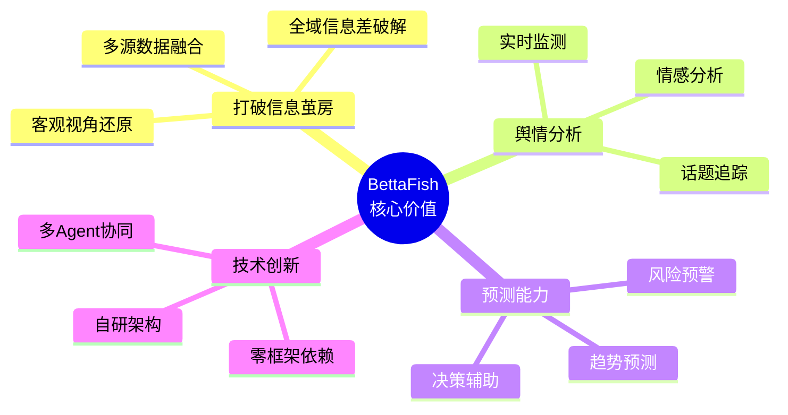
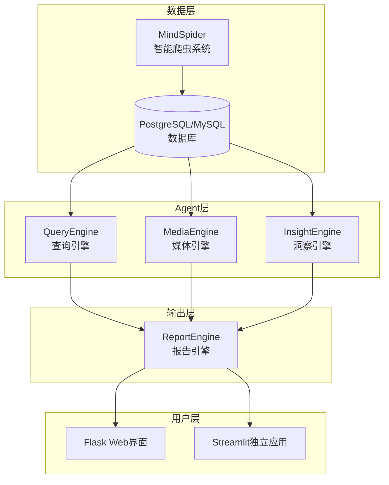
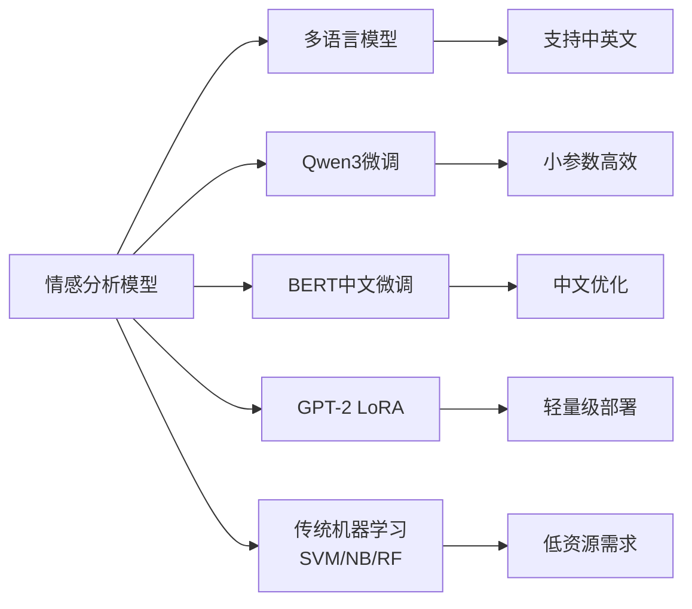
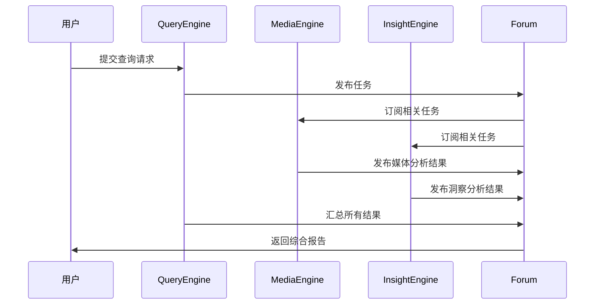
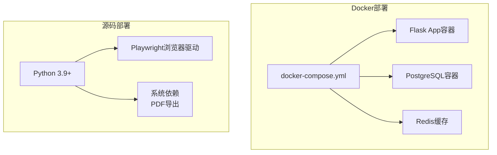
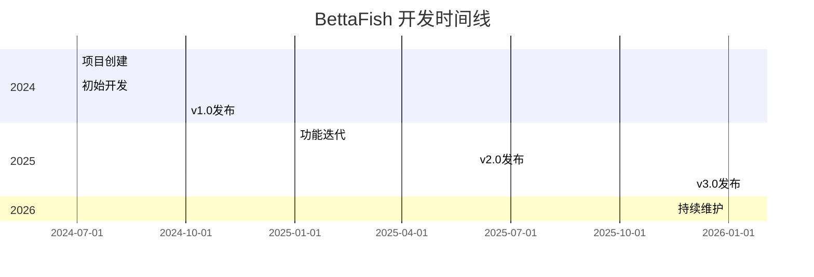
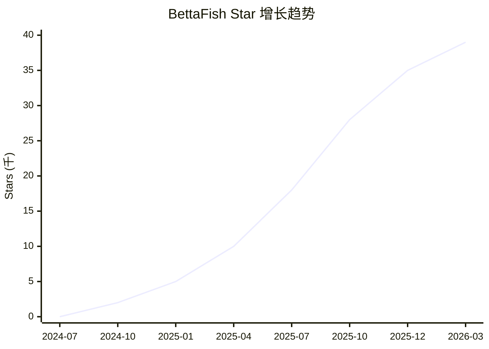
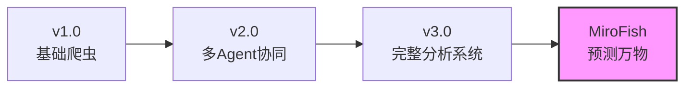
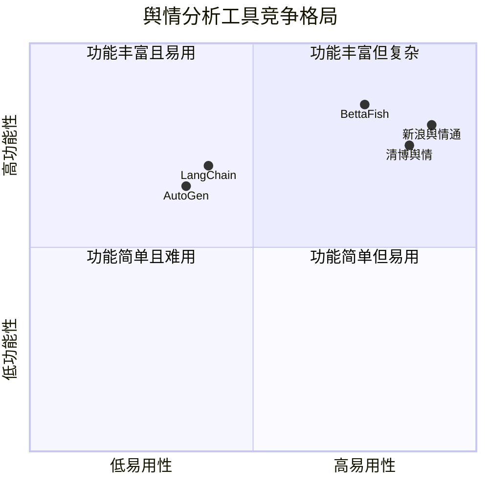

# 666ghj/BettaFish 深度研究报告

> 微舆：人人可用的多Agent舆情分析助手，打破信息茧房，还原舆情原貌，预测未来走向，辅助决策！

---

## 目录

1. [项目概述](#项目概述)
2. [基本信息](#基本信息)
3. [技术分析](#技术分析)
4. [社区活跃度](#社区活跃度)
5. [发展趋势](#发展趋势)
6. [竞品对比](#竞品对比)
7. [总结评价](#总结评价)

---

## 项目概述

### 项目简介

**BettaFish（微舆）** 是一个创新型的多智能体舆情分析系统，由开发者 666ghj 创建并开源。该项目的核心理念是"打破信息茧房，还原舆情原貌，预测未来走向，辅助决策"。

项目最大的技术亮点是**从零实现，不依赖任何现有 Agent 框架**，展示了作者对多智能体系统架构的深刻理解和独立设计能力。

### 核心价值主张



### 应用场景

- **品牌声量分析**：监测品牌在社交媒体上的讨论热度
- **竞品对比分析**：对比竞争对手的舆情表现
- **热点事件追踪**：实时追踪和深度分析热点事件
- **舆情风险预警**：提前识别潜在的舆情风险
- **市场趋势预测**：基于舆情数据预测市场走向

---

## 基本信息

### 项目元数据

| 指标 | 数值 |
|------|------|
| **项目名称** | 666ghj/BettaFish |
| **Stars** | 39,224 ⭐ |
| **Forks** | 7,324 |
| **Open Issues** | 52 |
| **主要语言** | Python |
| **开源协议** | GPL-2.0 |
| **创建时间** | 2024-07-01 |
| **最近更新** | 2026-03-17 |
| **最新版本** | v3.0.0 (微舆v3.0.0) |
| **贡献者数量** | 35 |
| **GitHub 地址** | [https://github.com/666ghj/BettaFish](https://github.com/666ghj/BettaFish) |

### 代码规模统计

| 语言 | 代码行数 | 占比 |
|------|---------|------|
| Python | 2,147,250 | 98.4% |
| Jupyter Notebook | 32,646 | 1.5% |
| Dockerfile | 2,264 | 0.1% |

### 项目标签 (Topics)

```
agent-framework | data-analysis | deep-research | deep-search 
llms | multi-agent-system | nlp | public-opinion-analysis 
python3 | sentiment-analysis
```

---

## 技术分析

### 系统架构

BettaFish 采用多智能体协同架构，核心由四大引擎组成：



### 核心组件详解

#### 1. MindSpider 智能爬虫系统

- **平台覆盖**：微博、小红书、抖音等主流社交媒体
- **数据规模**：约210万有效文本、3.8亿次阅读量、420万次互动
- **功能特性**：
  - 话题自动提取
  - 深度情感爬取
  - 多平台数据整合

#### 2. 三大分析引擎

| 引擎 | 功能定位 | 核心能力 |
|------|---------|---------|
| **QueryEngine** | 查询分析 | 深度搜索、信息整合、反思机制 |
| **MediaEngine** | 媒体分析 | 媒体覆盖分析、传播路径追踪 |
| **InsightEngine** | 洞察分析 | 情感分析、趋势识别、观点提取 |

#### 3. ReportEngine 报告引擎

- 支持多种输出格式：HTML、PDF、Markdown
- 自动生成结构化分析报告
- 支持自定义模板

### 情感分析技术栈

项目集成了多种情感分析方法：



### 技术亮点

#### 零框架依赖设计

项目完全从零实现多智能体系统，不依赖 LangChain、AutoGen 等主流框架：

```python
class DeepSearchAgent:
    def __init__(self, config=None):
        self.max_reflections = 2
        self.max_search_results = 15
        self.forum_reader = ForumReader()
        
    def execute_search(self, query: str):
        results = self.search_tool(query)
        refined = self.reflect(results)
        return self.synthesize(refined)
```

#### Agent 间通信机制

采用论坛模式实现 Agent 间协作：



### 部署架构



---

## 社区活跃度

### 开发活跃度分析



### 社区参与度

| 指标 | 状态 |
|------|------|
| **贡献者数量** | 35 人 |
| **Open Issues** | 52 个 |
| **最近 Commit** | 2026-03-13 |
| **最新 Release** | v3.0.0 (2025-12-23) |

### 社区支持渠道

- **GitHub Issues**：问题反馈和功能建议
- **GitHub Discussions**：技术讨论
- **QQ 技术交流群**：实时交流支持
- **邮箱支持**：hangjiang@bupt.edu.cn

### Star 增长趋势



---

## 发展趋势

### 项目演进路径



### 技术发展方向

1. **预测能力增强**：项目作者已推出 [MiroFish](https://github.com/666ghj/MiroFish)，专注于"预测万物"
2. **多模态支持**：扩展到图片、视频等多媒体内容分析
3. **实时性提升**：优化数据处理流水线，支持近实时分析
4. **企业级功能**：增强稳定性、安全性和可扩展性

### 市场定位

BettaFish 定位于"人人可用"的舆情分析工具，填补了以下市场空白：

- 开源舆情分析工具稀缺
- 多 Agent 系统落地案例不足
- 中小企业舆情分析成本高

---

## 竞品对比

### 开源竞品对比

| 项目 | BettaFish | LangChain | AutoGen | CrewAI |
|------|-----------|-----------|---------|--------|
| **定位** | 舆情分析专用 | 通用Agent框架 | 多Agent对话框架 | 多Agent协作框架 |
| **框架依赖** | 无 | 自身 | 自身 | 自身 |
| **开箱即用** | ✅ | ❌ | ❌ | ❌ |
| **中文支持** | ✅ 原生 | ⚠️ 需配置 | ⚠️ 需配置 | ⚠️ 需配置 |
| **情感分析** | ✅ 内置 | ❌ | ❌ | ❌ |
| **数据爬取** | ✅ 内置 | ❌ | ❌ | ❌ |
| **报告生成** | ✅ 内置 | ❌ | ❌ | ❌ |
| **学习曲线** | 低 | 中 | 中 | 中 |

### 商业竞品对比

| 产品 | 类型 | 优势 | 劣势 |
|------|------|------|------|
| **BettaFish** | 开源免费 | 完整功能、可定制、免费 | 需自部署 |
| **新浪舆情通 V助手** | 商业SaaS | 企业级支持、稳定服务 | 收费昂贵 |
| **蜜度舆情** | 商业SaaS | 数据源丰富、专业团队 | 闭源、成本高 |
| **清博舆情** | 商业SaaS | 行业深耕、报告专业 | 定制困难 |

### 竞争优势分析



---

## 总结评价

### 优势

1. **技术创新**：从零实现多智能体系统，展示深厚技术功底
2. **功能完整**：覆盖数据采集、分析、报告全流程
3. **开箱即用**：Docker 一键部署，降低使用门槛
4. **中文优化**：原生支持中文情感分析，本地化程度高
5. **社区活跃**：持续迭代，文档完善，社区支持良好
6. **成本优势**：开源免费，适合中小企业和个人用户

### 不足

1. **部署复杂度**：需要配置数据库、LLM API 等，对新手有一定门槛
2. **数据源限制**：主要覆盖国内社交平台，国际平台支持有限
3. **实时性**：非实时流处理架构，适合离线分析场景
4. **企业级特性**：缺少高可用、负载均衡等企业级部署方案

### 适用场景推荐

| 场景 | 推荐度 | 说明 |
|------|--------|------|
| 学术研究 | ⭐⭐⭐⭐⭐ | 开源可定制，适合研究用途 |
| 中小企业舆情监测 | ⭐⭐⭐⭐⭐ | 成本低，功能完整 |
| 个人自媒体分析 | ⭐⭐⭐⭐ | 免费使用，功能够用 |
| 大型企业部署 | ⭐⭐⭐ | 需要二次开发增强稳定性 |
| 实时舆情监控 | ⭐⭐⭐ | 架构限制，需优化 |

### 综合评分

| 维度 | 评分 | 说明 |
|------|------|------|
| **技术创新** | 9/10 | 零框架实现多Agent系统 |
| **功能完整性** | 9/10 | 覆盖舆情分析全流程 |
| **易用性** | 7/10 | Docker部署友好，配置略复杂 |
| **文档质量** | 8/10 | 中英文档齐全，示例丰富 |
| **社区活跃度** | 8/10 | 持续更新，响应及时 |
| **商业价值** | 9/10 | 填补市场空白，应用前景广阔 |

### 总体评价

BettaFish 是一个**技术扎实、功能完整、具有实际应用价值**的开源项目。它不仅是一个可用的舆情分析工具，更是一个优秀的学习案例，展示了如何从零构建一个多智能体系统。

项目在 GitHub 上获得近 4 万 Star，证明了其技术价值和市场需求。对于想要学习多智能体系统设计、或者需要舆情分析工具的开发者来说，BettaFish 都是一个值得关注和使用的项目。

---

## 相关链接

- **GitHub 仓库**：[https://github.com/666ghj/BettaFish](https://github.com/666ghj/BettaFish)
- **姊妹项目 MiroFish**：[https://github.com/666ghj/MiroFish](https://github.com/666ghj/MiroFish)
- **Demo 项目**：[Deep Search Agent Demo](https://github.com/666ghj/DeepSearchAgent-Demo)

---

*报告生成时间: 2026-03-17*

*数据来源: GitHub API、Web Search、项目文档*
