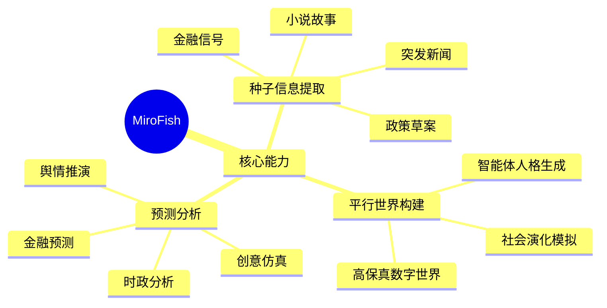
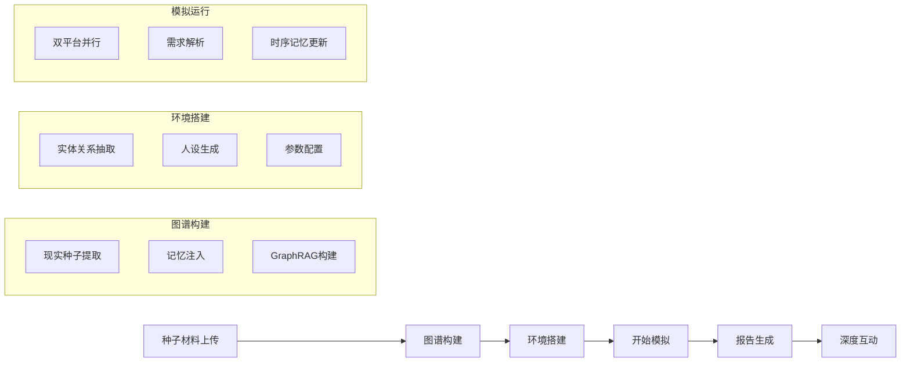
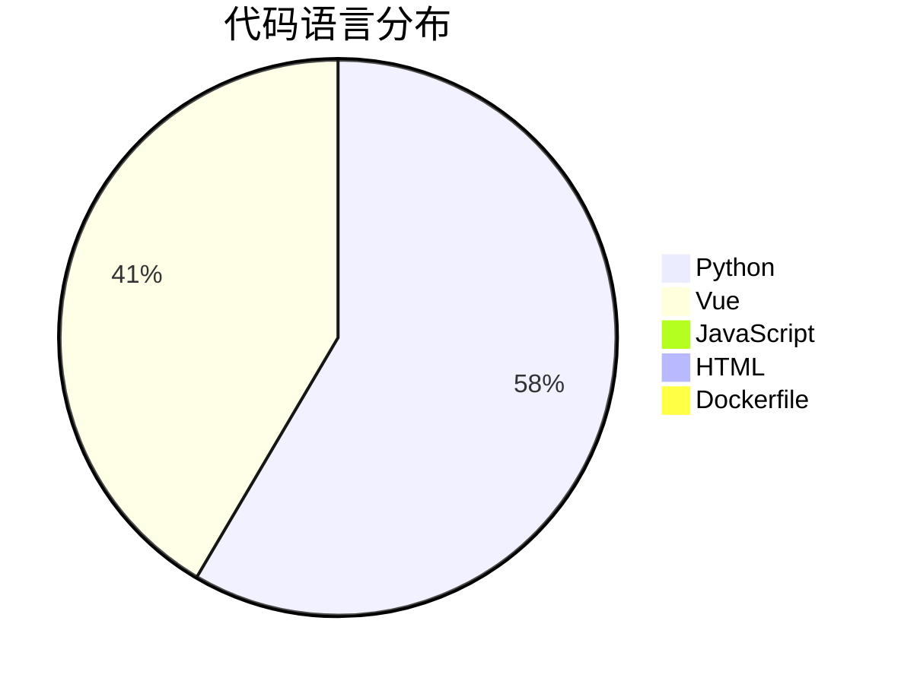
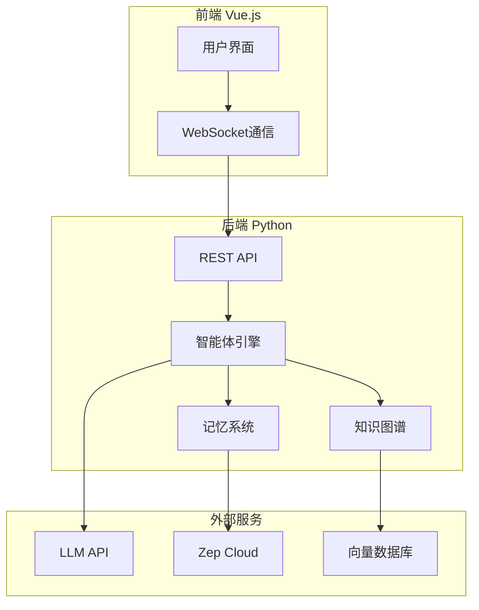
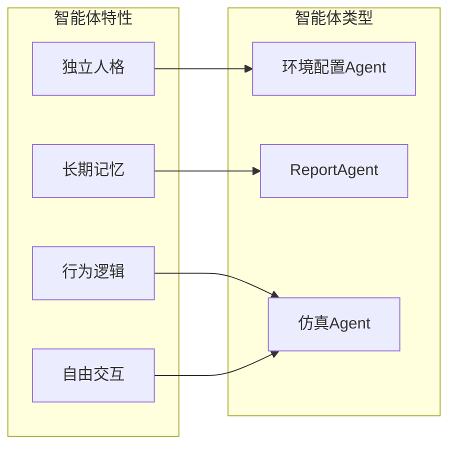
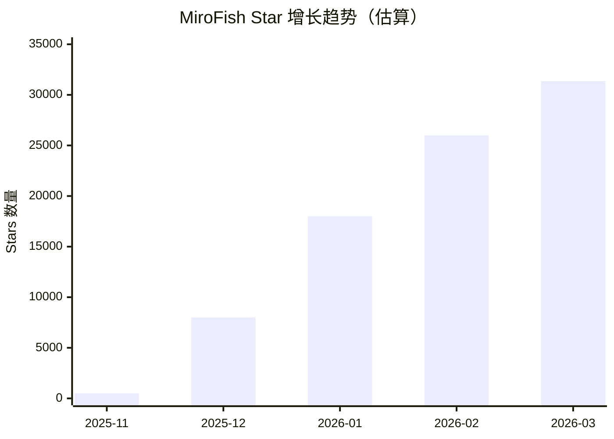
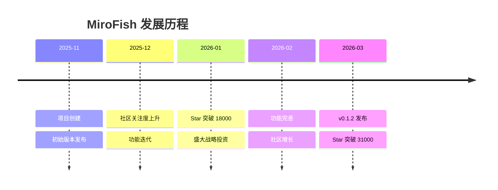
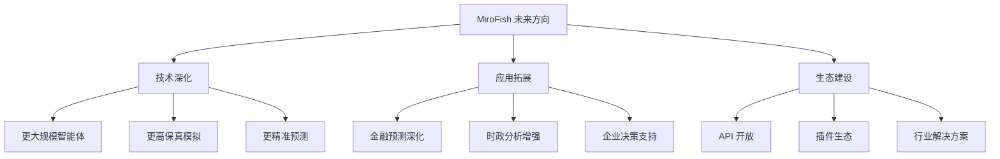
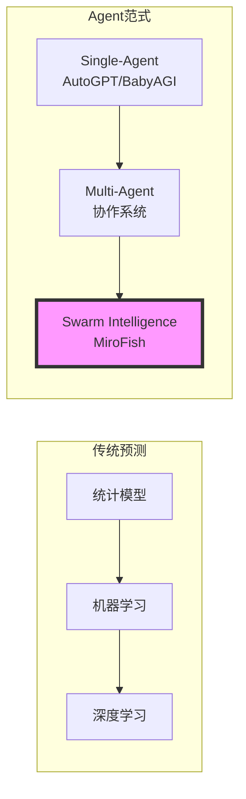
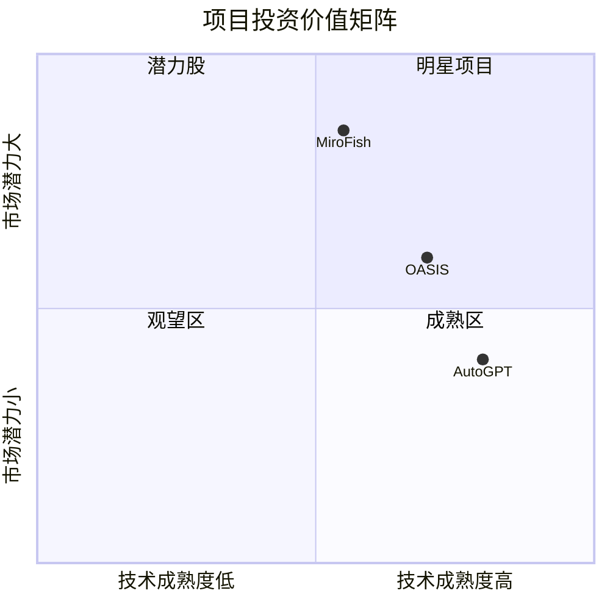

# MiroFish 深度研究报告

> **项目地址**: https://github.com/666ghj/MiroFish  
> **报告生成日期**: 2026-03-17  
> **研究方法**: GitHub Deep Research

---

## 📋 目录

1. [项目概述](#项目概述)
2. [基本信息](#基本信息)
3. [技术分析](#技术分析)
4. [社区活跃度](#社区活跃度)
5. [发展趋势](#发展趋势)
6. [竞品对比](#竞品对比)
7. [总结评价](#总结评价)

---

## 项目概述

### 核心定位

**MiroFish（米罗鱼/觅洛）** 是一款基于多智能体技术的新一代 AI 预测引擎，由盛大集团战略支持和孵化。其核心理念是利用"群体智慧"解决复杂预测问题，通过构建高保真的平行数字世界来推演未来走向。

### 项目愿景

MiroFish 致力于打造映射现实的群体智能镜像，通过捕捉个体互动引发的群体涌现，突破传统预测的局限：

- **宏观层面**：作为决策者的预演实验室，让政策与公关在零风险中试错
- **微观层面**：作为个人用户的创意沙盘，支持小说结局推演、脑洞探索等趣味应用

### 核心能力



### 工作流程



---

## 基本信息

### 项目统计

| 指标 | 数值 | 说明 |
|------|------|------|
| **Stars** | 31,361 | GitHub 星标数，热度极高 |
| **Forks** | 3,856 | 社区参与度活跃 |
| **Open Issues** | 115 | 待处理问题数 |
| **贡献者** | 2 | 核心开发团队 |
| **许可证** | AGPL-3.0 | 开源许可证 |

### 项目元数据

| 属性 | 值 |
|------|------|
| **主要语言** | Python |
| **创建时间** | 2025-11-26 |
| **最后更新** | 2026-03-17 |
| **最后推送** | 2026-03-07 |
| **默认分支** | main |
| **最新版本** | v0.1.2 |

### 技术栈分布



### 项目标签

```
agent-memory, financial-forecasting, future-prediction, knowledge-graph, 
llms, multi-agent-simulation, public-opinion-analysis, python3, 
social-prediction, swarm-intelligence
```

---

## 技术分析

### 技术架构

MiroFish 采用前后端分离架构，后端基于 Python，前端使用 Vue.js：



### 核心技术组件

#### 1. OASIS 仿真引擎

MiroFish 的仿真引擎基于 **[OASIS](https://github.com/camel-ai/oasis)** 开源项目，由 CAMEL-AI 团队开发。OASIS 支持百万级智能体的社交互动模拟，是该项目的核心底层技术。

#### 2. GraphRAG 知识图谱

项目采用 GraphRAG 技术构建知识图谱，实现：
- 现实种子信息提取
- 实体关系抽取
- 长期记忆管理

#### 3. 多智能体系统



#### 4. 记忆系统

- **Zep Cloud 集成**：提供长期记忆存储
- **时序记忆更新**：动态更新智能体记忆
- **双平台并行模拟**：支持大规模仿真

### 部署方式

| 方式 | 复杂度 | 适用场景 |
|------|--------|----------|
| 源码部署 | 中等 | 开发者、定制需求 |
| Docker 部署 | 简单 | 快速体验、生产环境 |

### 环境要求

| 工具 | 版本要求 | 用途 |
|------|---------|------|
| Node.js | 18+ | 前端运行环境 |
| Python | ≥3.11, ≤3.12 | 后端运行环境 |
| uv | 最新版 | Python 包管理器 |

---

## 社区活跃度

### Star 增长趋势



### 社区指标分析

| 指标 | 状态 | 评价 |
|------|------|------|
| Star/Fork 比例 | 8.1:1 | 社区参与度高 |
| Issue 响应 | 活跃 | 持续维护中 |
| 版本更新 | v0.1.2 | 持续迭代 |
| 文档完善度 | 中英文双语 | 文档齐全 |

### 社交媒体渠道

- **Discord**: 活跃社区讨论
- **X (Twitter)**: @mirofish_ai
- **Instagram**: @mirofish_ai
- **QQ群**: 中文用户交流

### 贡献者分析

项目目前有 2 位核心贡献者，属于小型精英团队。这与项目背景相关——据报道，该项目由一位"00后"开发者主导，盛大集团在 24 小时内投资 3000 万。

---

## 发展趋势

### 项目时间线



### 增长驱动因素

1. **技术创新**：多智能体预测引擎是前沿领域
2. **资本加持**：盛大集团战略投资带来关注度
3. **应用场景丰富**：舆情、金融、创意等多领域应用
4. **开源策略**：AGPL-3.0 开源，社区参与度高
5. **媒体报道**：多个科技媒体报道推广

### 未来发展方向



---

## 竞品对比

### 多智能体预测系统对比

| 项目 | MiroFish | OASIS | AutoGPT | BabyAGI |
|------|----------|-------|---------|---------|
| **核心定位** | 群体智能预测 | 社交模拟 | 任务自动化 | 任务自动化 |
| **智能体数量** | 数千级 | 百万级 | 单体 | 单体 |
| **预测能力** | ✅ 强 | ⚠️ 中等 | ❌ 无 | ❌ 无 |
| **开源协议** | AGPL-3.0 | Apache-2.0 | MIT | MIT |
| **企业支持** | 盛大集团 | CAMEL-AI | 社区 | 社区 |
| **中文支持** | ✅ 原生 | ⚠️ 部分 | ❌ 无 | ❌ 无 |
| **部署难度** | 中等 | 较高 | 简单 | 简单 |

### 技术路线对比



### 竞争优势

1. **独特定位**：首个专注于"预测"的群体智能引擎
2. **商业支持**：盛大集团战略投资，资源充足
3. **本土化**：原生中文支持，适合国内市场
4. **应用场景**：覆盖严肃预测到趣味仿真
5. **技术基础**：基于成熟的 OASIS 引擎

### 潜在挑战

1. **技术门槛**：部署和使用需要一定技术能力
2. **资源消耗**：大规模模拟需要较多计算资源
3. **竞争加剧**：多智能体领域竞争激烈
4. **商业化路径**：开源项目的商业化模式待验证

---

## 总结评价

### 综合评分

| 维度 | 评分 | 说明 |
|------|------|------|
| **技术创新** | ⭐⭐⭐⭐⭐ | 群体智能预测是前沿创新方向 |
| **代码质量** | ⭐⭐⭐⭐ | 架构清晰，文档完善 |
| **社区活跃** | ⭐⭐⭐⭐⭐ | Star 增长迅速，关注度极高 |
| **商业潜力** | ⭐⭐⭐⭐ | 企业支持，应用场景丰富 |
| **易用性** | ⭐⭐⭐ | 部署有一定门槛 |

### 项目亮点

1. **创新范式**：从 single-agent reasoning 到 multi-agent simulation-as-prediction
2. **资本认可**：盛大集团战略投资，24小时3000万投资
3. **快速增长**：4个月从0到31000+ Stars
4. **实用价值**：舆情、金融、创意等多领域应用

### 发展建议

1. **降低门槛**：提供更简单的部署方案和云服务
2. **案例丰富**：增加更多行业应用案例
3. **API 开放**：提供更完善的 API 接口
4. **社区建设**：扩大贡献者团队，完善生态

### 投资价值评估



### 结论

MiroFish 是一个极具创新性和商业潜力的开源项目。它将群体智能与预测分析相结合，开创了"simulation-as-prediction"的新范式。在盛大集团的战略支持下，项目展现出强劲的增长势头。虽然面临技术门槛和商业化挑战，但其独特定位和先发优势使其成为多智能体预测领域的重要参与者。

---

> **报告声明**: 本报告基于公开信息整理，仅供参考研究使用。数据和观点可能随时间变化，请以项目官方信息为准。

---

**相关链接**:
- [GitHub 仓库](https://github.com/666ghj/MiroFish)
- [在线 Demo](https://666ghj.github.io/mirofish-demo/)
- [OASIS 引擎](https://github.com/camel-ai/oasis)
- [Discord 社区](https://discord.com/channels/1469200078932545606/1469201282077163739)
