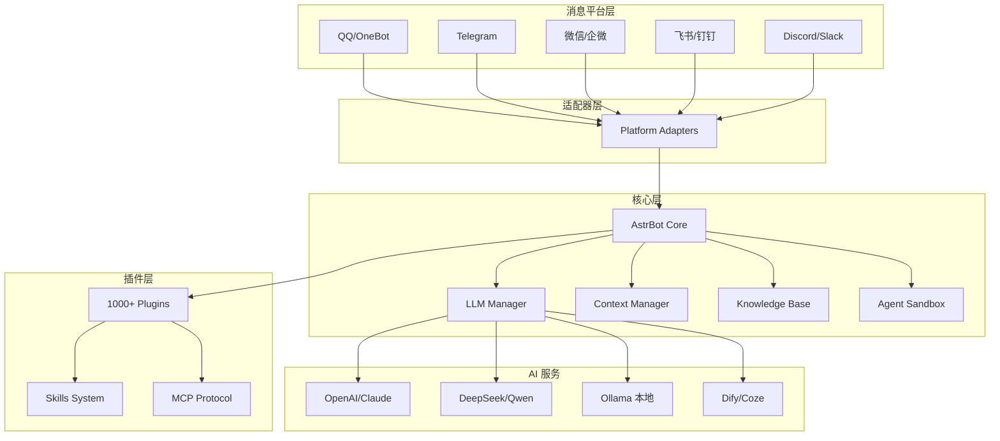
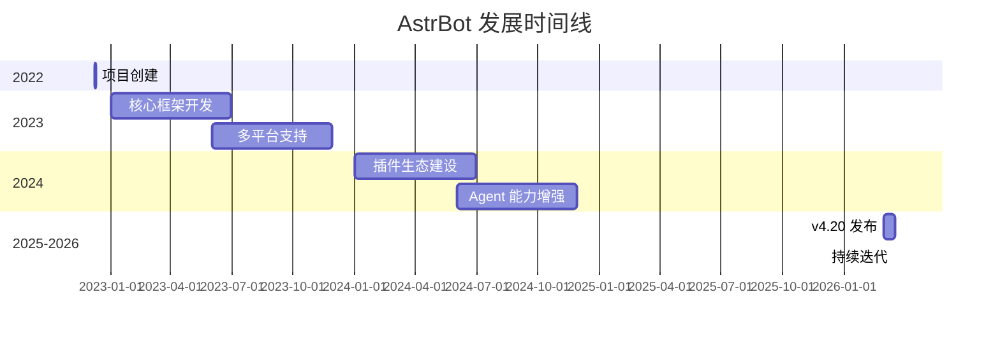

# AstrBotDevs/AstrBot

> Agentic IM Chatbot infrastructure that integrates lots of IM platforms, LLMs, plugins and AI feature, and can be your openclaw alternative. ✨

## 项目概述

AstrBot 是一个开源的一体化 Agent 聊天机器人平台，旨在将大语言模型（LLM）集成到主流即时通讯应用中。它为个人用户、开发者和团队提供可靠且可扩展的对话式 AI 基础设施，帮助用户快速构建生产级的 AI 应用。项目支持 QQ、微信、Telegram、Discord、飞书、钉钉等 13+ 消息平台，拥有 1000+ 社区插件，是中文开源社区中最受欢迎的 IM 聊天机器人框架之一。

## 基本信息

| 指标 | 数值 |
|------|------|
| Stars | 25,456 |
| Forks | 1,736 |
| 语言 | Python |
| 开源协议 | AGPL-3.0 |
| Open Issues | 815 |
| 创建时间 | 2022-12-08 |
| 最近更新 | 2026-03-17 |
| 最新版本 | v4.20.1 |
| GitHub | [AstrBotDevs/AstrBot](https://github.com/AstrBotDevs/AstrBot) |

### 语言分布

| 语言 | 代码行数 | 占比 |
|------|----------|------|
| Python | 4.12M | 68.5% |
| Vue | 1.51M | 25.2% |
| TypeScript | 203K | 3.4% |
| JavaScript | 81K | 1.3% |
| 其他 | 40K+ | 0.7% |

### Topics 标签

`agent`, `ai`, `chatbot`, `chatgpt`, `discord`, `docker`, `gemini`, `gpt`, `llama`, `llm`, `mcp`, `openai`, `python`, `qq`, `qqbot`, `telegram`

## 技术分析

### 架构设计

AstrBot 采用高度模块化的架构设计，核心组件包括消息适配层、Agent 核心层和插件扩展层：



### 核心技术特性

#### 1. 多平台消息支持

| 平台 | 维护者 | 状态 |
|------|--------|------|
| QQ | 官方 | ✅ 稳定 |
| OneBot v11 协议 | 官方 | ✅ 稳定 |
| Telegram | 官方 | ✅ 稳定 |
| 企业微信/企微 AI 机器人 | 官方 | ✅ 稳定 |
| 微信公众号 | 官方 | ✅ 稳定 |
| 飞书 (Lark) | 官方 | ✅ 稳定 |
| 钉钉 | 官方 | ✅ 稳定 |
| Slack | 官方 | ✅ 稳定 |
| Discord | 官方 | ✅ 稳定 |
| LINE | 官方 | ✅ 稳定 |
| WhatsApp | 官方 | 🚧 即将推出 |
| Matrix/KOOK/VoceChat | 社区 | ✅ 第三方插件 |

#### 2. Agent 能力

- **多模态支持**：支持文本、图像等多种模态的输入输出
- **MCP (Model Context Protocol)**：支持模型上下文协议
- **Skills 技能系统**：可扩展的技能框架
- **知识库集成**：支持企业知识库构建
- **人格设置**：支持自定义 AI 人格
- **自动上下文压缩**：智能管理对话上下文

#### 3. Agent Sandbox 沙箱

AstrBot 提供了独特的 Agent 沙箱功能：
- **隔离执行**：安全执行代码和 Shell 调用
- **会话级资源复用**：高效的资源管理
- **安全防护**：防止恶意代码执行

#### 4. 插件系统

- **插件数量**：1000+ 社区插件
- **一键安装**：支持插件市场快速安装
- **开发者友好**：完善的插件开发文档和 SDK

### 支持的 LLM 提供商

| 类别 | 提供商 |
|------|--------|
| 国际 | OpenAI, Anthropic Claude, Google Gemini, xAI, Mistral |
| 国内 | DeepSeek, Qwen, Zhipu, Moonshot, Minimax |
| 本地 | Ollama, LM Studio |
| API 网关 | AIHubMix, 302.AI, TokenPony, SiliconFlow, PPIO Cloud |
| LLMOps | Dify, 阿里云百炼, Coze |

### 技术栈

| 类别 | 技术 |
|------|------|
| **后端语言** | Python 3.10+ |
| **代码规范** | Ruff (格式化 + Lint) |
| **包管理** | uv (推荐) |
| **容器化** | Docker / Docker Compose |
| **前端** | Vue + WebUI + ChatUI |
| **国际化** | i18n 多语言支持 |

## 社区活跃度

### 贡献者分析

- **贡献者数量**：100+
- **主要贡献者**：Soulter（核心开发者）
- **贡献分布**：活跃的开源社区，持续迭代

### Issue/PR 活跃度

- **Open Issues**: 815
- **响应速度**：活跃维护，频繁更新
- **文档质量**：完善的官方文档和开发指南

### 最近动态

**版本更新节奏**：
- v4.20.1 (2026-03-16)
- v4.18.2 (2026-02-26)
- v4.18.1 (2026-02-22)

**QQ 社区**：
- 用户群：10 个（群号：1076659624, 1078079676 等）
- 开发者群：2 个

**Discord 社区**：https://discord.gg/hAVk6tgV36

### 认可与荣誉

| 平台 | 认证 |
|------|------|
| TrendShift | 趋势项目徽章 |
| HelloGitHub | 推荐项目 |
| DeepWiki | 项目文档 |
| Zread | AI 阅读 |

## 发展趋势

### 版本演进



### 增长数据

- **Stars 增长**：从 0 到 2.5 万约 39 个月
- **Fork 增长**：1,736 Fork
- **社区规模**：100+ 贡献者，1000+ 插件

### Roadmap 方向

1. **平台扩展**
   - WhatsApp 即将支持
   - 持续新增消息平台

2. **Agent 能力增强**
   - 更强大的主动 Agent 能力
   - 更智能的任务规划和执行

3. **企业级功能**
   - 知识库增强
   - 多租户支持
   - 安全性提升

## 竞品对比

| 项目 | Stars | 语言 | 特点 | IM 平台 | 插件生态 |
|------|-------|------|------|---------|----------|
| **AstrBot** | 25K | Python | IM 原生集成 | 13+ 平台 | 1000+ |
| ChatGPT-Next-Web | 80K+ | TypeScript | Web 聊天界面 | 无 | 有限 |
| Dify | 50K+ | Python | LLMOps 平台 | 无 | 丰富 |
| LangChain | 100K+ | Python | 开发框架 | 需开发 | 丰富 |
| OpenClaw | 300K+ | TypeScript | 个人 AI 助手 | 20+ | 丰富 |

### 核心差异化

1. **vs ChatGPT-Next-Web**
   - AstrBot: IM 平台原生集成、Agent 能力
   - ChatGPT-Next-Web: 纯 Web 聊天界面

2. **vs Dify**
   - AstrBot: IM 原生、开箱即用
   - Dify: LLMOps 平台、需要集成

3. **vs OpenClaw**
   - AstrBot: 专注 IM 场景、中文社区
   - OpenClaw: 个人 AI 助手、更广泛

### 适用场景推荐

| 场景 | 推荐方案 |
|------|----------|
| QQ/微信机器人 | **AstrBot** ✅ |
| 企业智能客服 | **AstrBot** / Dify |
| Web 聊天界面 | ChatGPT-Next-Web |
| LLMOps 平台 | Dify |
| 定制化开发 | LangChain |

## 部署指南

### 一键部署（推荐）

```bash
uv tool install astrbot
astrbot init
astrbot run
```

### Docker 部署

```bash
docker pull soulter/astrbot
docker run -d -p 6185:6185 soulter/astrbot
```

### 桌面应用

访问 [AstrBot-desktop](https://github.com/AstrBotDevs/AstrBot-desktop) 下载安装

## 适用场景

### 最佳场景

1. **IM 聊天机器人**
   - QQ 群机器人
   - 微信客服
   - Telegram Bot

2. **企业智能客服**
   - 知识库问答
   - 自动回复
   - 工单处理

3. **AI Agent 应用**
   - 任务自动化
   - 信息检索
   - 代码执行

### 不适用场景

1. **纯 Web 聊天**：有更轻量的选择
2. **非 IM 场景**：Dify 等更合适
3. **企业级高并发**：需要额外优化

## 总结评价

### 优势

- **IM 原生集成**：13+ 消息平台开箱即用
- **插件生态丰富**：1000+ 社区插件
- **Agent 能力强**：沙箱、MCP、Skills
- **中文社区活跃**：完善的中文文档和支持
- **部署简单**：多种部署方式，低学习曲线
- **免费开源**：AGPL-3.0 协议

### 劣势

- **协议限制**：AGPL-3.0 对商业使用有限制
- **性能优化**：大规模部署需要调优
- **企业级功能**：仍在完善中
- **国际化**：主要面向中文用户

### 适用场景

1. **个人开发者**：快速构建 IM 机器人
2. **中小企业**：智能客服和知识库
3. **AI 爱好者**：学习和实验 Agent 技术
4. **插件开发者**：丰富的 SDK 和社区

### 推荐指数

| 用户类型 | 推荐度 |
|----------|--------|
| 个人开发者 | ⭐⭐⭐⭐⭐ |
| 中小企业 | ⭐⭐⭐⭐ |
| AI 爱好者 | ⭐⭐⭐⭐⭐ |
| 插件开发者 | ⭐⭐⭐⭐⭐ |
| 大型企业 | ⭐⭐⭐ (需评估) |

---
*报告生成时间: 2026-03-17*
*研究方法: github-deep-research 多轮深度分析*
*数据来源: GitHub API, Web Search, 官方文档*
