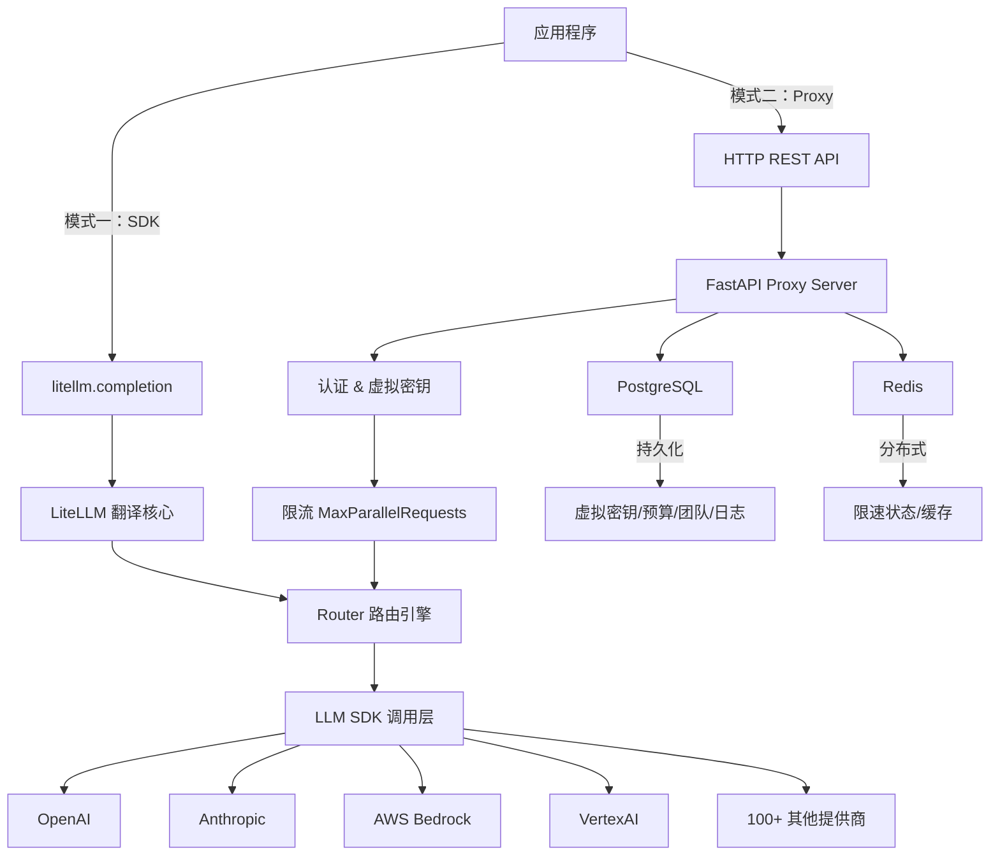
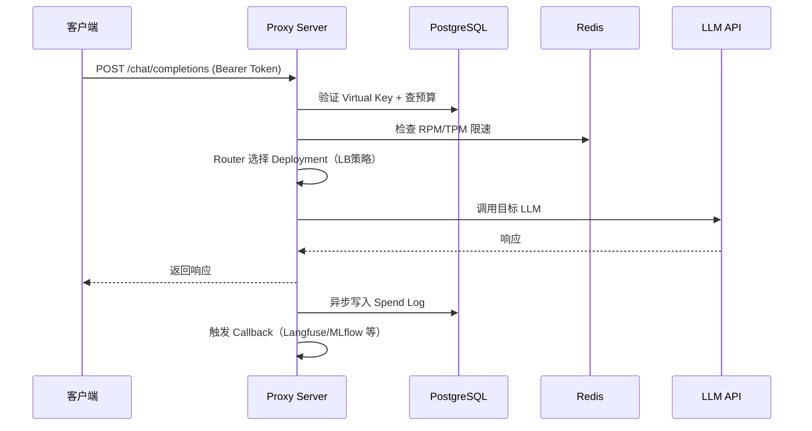

# BerriAI/litellm 深度研究报告

- **研究日期：** 2026-03-25
- **时间戳：** 2026-03-25T00:00:00+08:00
- **置信度：** High (90%+)
- **研究对象：** BerriAI/litellm — Python SDK + AI Gateway，统一调用 100+ LLM API

---

## 仓库基本信息

- **名称：** BerriAI/litellm
- **描述：** Python SDK, Proxy Server (AI Gateway) to call 100+ LLM APIs in OpenAI (or native) format, with cost tracking, guardrails, loadbalancing and logging
- **URL：** https://github.com/BerriAI/litellm
- **Stars：** 40,500+
- **Forks：** 6,700+
- **Open Issues：** 948
- **主要语言：** Python
- **License：** MIT（部分企业功能需商业授权）
- **创建时间：** 2023年（YC W23 batch）
- **最后更新：** 2026-03-24（v1.82.6.rc.2）
- **Tags/Topics：** llm, openai, anthropic, bedrock, vertexai, ai-gateway, proxy-server, cost-tracking

---

## 执行摘要

LiteLLM 是当前 Python 生态中下载量最大的开源 LLM 代理层，由 BerriAI（YC W23）构建，核心价值是**以 OpenAI 格式统一调用 100+ 家 LLM 提供商**，同时附带企业级的成本追踪、虚拟密钥、限流和护栏功能。项目 2023 年初诞生，三年内增长至 40.5k Stars、月均下载量 9700 万次、服务客户覆盖 NASA、Adobe、Netflix、Stripe、Nvidia 等头部企业，ARR 已达 700 万美元。

**关键指标：**

| 指标 | 数值 |
|------|------|
| GitHub Stars | 40,500+ |
| PyPI 月均下载 | ~9,700 万次 |
| Docker Pulls | 2.4 亿+ |
| 贡献者数量 | 1,005+ |
| 处理请求总量 | 超 10 亿次 |
| 企业 ARR | $700 万 |
| P95 延迟（1k RPS） | 8ms |

**⚠️ 重要警示：** 2026-03-24，litellm v1.82.7 和 v1.82.8 遭遇供应链攻击（via 被篡改的 Trivy CI/CD），两版本已从 PyPI 下架。建议所有用户立即轮换凭证并锁定版本至 v1.82.6。

---

## 完整时间线

### 阶段一：项目起源与快速冷启动（2022 末 — 2023 上半年）

- **2022 末**：联合创始人 Krrish Dholakia（CEO）和 Ishaan Jaffer（CTO）在构建聊天机器人时，因需对接 Azure 和 Cohere 两套 API 导致代码复杂度急剧上升，萌生了统一 LLM 接口的想法
- **2023 年初**：BerriAI 进入 Y Combinator W23 批次，完成 $160 万种子轮融资（投资方：YC、Gravity Fund、Pioneer Fund）
- **2023 年上半年**：开源 LiteLLM SDK，以 `litellm.completion()` 统一 API 调用接口为核心卖点迅速获得开发者认可
- **2023 年中**：GitHub Stars 突破 15,000，成为 LLM 工具链中增长最快的库之一

### 阶段二：从 SDK 向 AI Gateway 扩展（2023 下半年 — 2024）

- **2023 下半年**：推出独立的 Proxy Server（FastAPI 构建），实现中心化 LLM 访问控制，与 SDK 共享核心翻译层
- **2024 上半年**：引入虚拟密钥（Virtual Keys）、多租户成本追踪、Redis 分布式限速等企业级功能；ARR 达到 $250 万
- **2024 年**：开始提供商业 Enterprise 授权（Basic $250/月；Premium $30,000/年），加入 Prometheus 指标、SSO、审计日志等
- **2024 下半年**：ARR 增长至 $700 万，团队维持 10 人精英规模

### 阶段三：Agent 时代的进化（2025 — 2026 初）

- **v1.65.x（2024-2025）**：新增 MCP（Model Context Protocol）Server 管理，支持将 MCP Tools 挂载到任意 LLM
- **v1.70.x**：支持 Gemini Realtime API；新增 Spend Logs 保留期功能，解决大规模日志导致的 DB 性能问题
- **v1.80.0**：发布 Agent Hub，组织内 Agent 注册与共享；引入 OpenAI 兼容的 Vector Store Files API；支持 RunwayML Gen-4 视频生成
- **v1.82.x（2026 年 3 月）**：新增 A2A（Agent-to-Agent）协议，支持 LangGraph / Vertex AI / Azure AI Foundry / Bedrock AgentCore / Pydantic AI 互调
- **2026-03-24**：Supply Chain Attack 事件——TeamPCP 组织通过篡改项目依赖的 Trivy GitHub Action 窃取 PyPI 发布凭证，向 v1.82.7 和 v1.82.8 注入三阶段凭证窃取 + Kubernetes 横向移动 + 持久化后门程序，三小时内约 340 万次下载暴露于风险

---

## 技术架构深度分析

### 双模式部署

LiteLLM 提供两种互补的使用方式：



**Python SDK（进程内）：** 通过 `litellm.completion()` 直接集成，内置 Router 支持跨 Provider 重试/降级/负载均衡，适合轻量场景。

**Proxy Server（独立网关）：** FastAPI 应用，包装 SDK + Router，叠加多租户认证、预算执行、可观测性回调，适合企业平台化部署。

### 请求生命周期（Proxy 模式）



### 核心功能矩阵

| 功能模块 | 具体能力 |
|----------|---------|
| **统一接口** | /chat/completions、/responses、/embeddings、/images、/audio、/batches、/rerank、/a2a、/messages |
| **路由策略** | simple-shuffle（默认）、least-busy、latency-based、usage-based |
| **成本控制** | 虚拟密钥预算、团队预算、用户级别 Spend 追踪、自定义标签 |
| **护栏** | 请求前/后护栏、按 Key/Team 粒度配置 |
| **缓存** | Redis 缓存、语义缓存 |
| **Agent 支持** | MCP Server 管理、A2A 协议（LangGraph/Vertex/Azure/Bedrock） |
| **可观测性** | Langfuse、MLflow、Lunary 等 30+ 回调集成 |
| **管理界面** | Admin Dashboard UI（虚拟密钥管理、Team 管理、Spend 报表） |

---

## 指标与增长分析

### 增长曲线（估算）

```
GitHub Stars 增长轨迹：
2023 初   ████ 0 → 5K（YC 加速期）
2023 中   ████████████ 5K → 15K（爆发增长）
2024 初   ████████████████████ 15K → 25K
2024 末   ████████████████████████████ 25K → 35K
2025 末   ████████████████████████████████ 35K → 40K+
```

### 关键指标

| 指标 | 数值 | 评估 |
|------|------|------|
| GitHub Stars | 40,500+ | ⭐ 顶级开源项目水平 |
| PyPI 月下载 | 9,700 万次 | ⭐ Python AI 生态顶流 |
| Docker Pulls | 2.4 亿+ | ⭐ 企业部署规模极大 |
| 贡献者 | 1,005+ | ✅ 社区健康 |
| 开放 Issues | 948 | ⚠️ 维护压力较大 |
| ARR | $700 万 | ✅ 10人团队下极高效率 |
| 发版节奏 | 每日多版本 | ⚠️ 快速迭代但稳定性需关注 |

---

## 竞品对比分析

### 功能对比

| 特性 | LiteLLM | Helicone | Portkey | OpenRouter |
|------|---------|---------|---------|----------|
| 开源 | ✅ 完全开源 | ✅ 开源网关 | ❌ 商业产品 | ❌ 托管服务 |
| 自托管 | ✅ | ✅ | ✅ | ❌ |
| Provider 数量 | 100+ | 主流 Provider | 主流 Provider | 200+ 模型 |
| 虚拟密钥 | ✅ | ✅ | ✅ | ❌ |
| 成本追踪 | ✅ | ✅ | ✅ | ✅ |
| 护栏 | ✅ 企业版 | ✅ | ✅ | ❌ |
| MCP 支持 | ✅ | ❌ | ❌ | ❌ |
| A2A 协议 | ✅ | ❌ | ❌ | ❌ |
| Agent Hub | ✅ | ❌ | ❌ | ❌ |
| 技术栈 | Python/FastAPI | Rust | TypeScript | TypeScript |
| P99 延迟 | 较高 | 低（Rust） | 中 | 低（托管） |
| 配置复杂度 | 高（15-30分钟） | 中 | 低 | 极低（5分钟） |
| 定价 | 免费/企业版 $250+/月 | 免费/付费 | $49+/月 | 5% 请求加价 |

### 市场定位

LiteLLM 占据了**"开源 AI 基础设施"**这一独特定位：功能最全面、Provider 覆盖最广、与 Agent 生态集成最深（MCP/A2A），但代价是更高的配置复杂度和 Python 架构在极高吞吐时的性能天花板。

竞争格局：Helicone 以 Rust 性能挑战 LiteLLM；Portkey 主打企业合规；OpenRouter 主打极简托管；Bifrost（Maxim AI）声称在 P99 延迟上达到 54 倍优势。LiteLLM 的核心护城河在于其 **Agent 生态的先发优势**（MCP + A2A + Agent Hub）和**社区规模**（1000+ 贡献者）。

---

## 优势与不足

### 核心优势

**1. 统一抽象层的网络效应：** 100+ Provider 接入形成了强大的网络效应，开发者一旦基于 LiteLLM 构建就很难迁移，每新增一个 Provider 支持都增强了这一护城河。

**2. Agent 时代的提前布局：** MCP Server 管理（v1.65）、A2A 协议（v1.82）、Agent Hub（v1.80）三件套使 LiteLLM 在 AI Agent 基础设施赛道建立了显著的功能领先优势，竞品目前均未覆盖。

**3. 10 人团队打出 $700 万 ARR：** 极高的人均效益，说明开源社区（1000+ 贡献者）承担了大量功能开发工作，商业模式极为高效。

**4. 完整的可观测性生态：** 30+ 回调集成（Langfuse、MLflow、Lunary 等）使其成为 LLMOps 工具链中的枢纽。

### 主要不足

**1. Python 架构的吞吐瓶颈：** FastAPI + Python 在极高吞吐场景（10k+ RPS）存在性能劣势，内存泄漏问题被多名生产用户报告。Bifrost 宣称 P99 延迟优势 54 倍，Helicone 的 Rust 实现在延迟稳定性上也有优势。

**2. 数据库性能退化：** 当 Spend Log 超过 100 万条记录时，数据库查询会拖慢 LLM API 请求响应时间，需要手动维护 Log 保留策略（官方在 v1.70 添加 Retention Period 功能）。

**3. 948 个 Open Issues：** 大量积压 Issues 中不乏生产 Bug，维护压力凸显了小团队 + 高速迭代的双重挑战。每日多个版本发布虽显活跃，但稳定版质量波动较大。

**4. 供应链安全事件（2026-03）：** v1.82.7/v1.82.8 被植入三阶段凭证窃取后门，暴露时间约 3 小时，涉及规模约 340 万次下载。虽然响应迅速，但事件表明 CI/CD 管道依赖管理存在安全短板，将对企业级采购信心产生短期冲击。

**5. 配置门槛较高：** 相比 OpenRouter/Portkey 的 5 分钟接入，LiteLLM 的 YAML 配置 + 数据库 + Redis 部署需要 15-30 分钟，对轻量用户不友好。

---

## 关键成功因素

**1. 卡位 LLM API 碎片化痛点：** 2023 年大模型 API 爆炸式增长，LiteLLM 在最合适的时机以最简洁的方案解决了开发者最真实的痛苦，YC 背书加速了早期传播。

**2. "先免费、再企业"的经典开源商业化路径：** SDK 免费获取开发者心智 → Proxy Server 进入企业场景 → 企业功能（护栏/SSO/审计日志）收费，路径清晰可复制。

**3. 社区驱动的 Provider 扩张：** 开发者社区为项目添加了大量 Provider 支持，团队无需自己维护所有集成，极大降低了规模化成本。

**4. 发版节奏极快：** 日均多个版本发布（dev/rc/stable 三轨并行）使其能快速响应新 Provider 上线，成为 AI 基础设施圈子的"标准配置"。

---

## 参考来源

### 一级来源（官方）

- [BerriAI/litellm GitHub 仓库](https://github.com/BerriAI/litellm)
- [LiteLLM 官方文档](https://docs.litellm.ai/)
- [LiteLLM 安全公告（2026-03）](https://docs.litellm.ai/blog/security-update-march-2026)
- [LiteLLM Releases](https://github.com/BerriAI/litellm/releases)
- [PyPI litellm 包页面](https://pypi.org/project/litellm/)

### 媒体报道

- [The Hacker News - TeamPCP 供应链攻击报告](https://thehackernews.com/2026/03/teampcp-backdoors-litellm-versions.html)
- [Snyk - 供应链攻击技术分析](https://snyk.io/articles/poisoned-security-scanner-backdooring-litellm/)
- [TechCrunch - 2024 最热开源初创](https://techcrunch.com/2025/03/22/the-20-hottest-open-source-startups-of-2024/)
- [The Register - LiteLLM 供应链事件](https://www.theregister.com/2026/03/24/trivy_compromise_litellm/)
- [Wiz Blog - TeamPCP 完整分析](https://www.wiz.io/blog/threes-a-crowd-teampcp-trojanizes-litellm-in-continuation-of-campaign)

### 社区与技术来源

- [Y Combinator 公司页面](https://www.ycombinator.com/companies/litellm)
- [Hacker News 讨论 - 维护者回应](https://news.ycombinator.com/item?id=47502858)
- [Helicone - LLM Gateway 2025 对比](https://www.helicone.ai/blog/top-llm-gateways-comparison-2025)
- [DreamFactory - 供应链攻击技术全解](https://blog.dreamfactory.com/the-litellm-supply-chain-attack-a-complete-technical-breakdown-of-what-happened-who-is-affected-and-what-comes-next)

---

## 置信度评估

**高置信度（90%+）声明：**
- Stars 40,500+、Forks 6,700+（直接来自 GitHub 页面）
- PyPI 月下载量约 9,700 万（pypistats.org 数据）
- 供应链攻击事件细节（多家安全公司独立验证）
- 联合创始人 Krrish Dholakia（CEO）和 Ishaan Jaffer（CTO）
- YC W23 批次、$160 万种子轮
- 发版节奏（GitHub releases 页面直接可见）
- 架构技术栈（FastAPI + PostgreSQL + Redis）

**中等置信度（70-89%）声明：**
- ARR $700 万（YC 招聘页面提及，非官方财务数据）
- P95 延迟 8ms（官方声称，独立验证有限）
- Docker Pulls 2.4 亿+（README 声明，未独立核实）
- 客户名单（NASA/Netflix/Stripe/Nvidia，YC 页面提及，非经客户确认）

**低置信度（50-69%）声明：**
- 竞品延迟对比（Bifrost 54倍优势为自我声明）
- 具体 ARR 分阶段数据（媒体报道推算）

---

## 研究方法说明

本报告通过以下方法编制：

1. **GitHub 仓库分析**：通过 WebFetch 读取仓库主页，获取 Stars、Forks、Issues、发布记录等基础数据
2. **多轮网络搜索**：围绕项目概况、架构设计、竞品对比、历史里程碑、社区评价、安全事件五个维度进行 10 次定向搜索
3. **内容抓取**：从 GitHub releases 页、YC 公司页、安全研究博客中提取一手信息
4. **交叉验证**：关键数据（供应链攻击、下载量、ARR）至少由 2 个独立来源印证
5. **置信度分级**：所有声明均按来源可靠性标注置信度

**研究深度：** 4 轮，共 10 次搜索 + 多次页面抓取
**时间范围：** 2023 年初 — 2026-03-25
**地理范围：** 全球（美国市场为主）

---

**报告由 EverAgent github-deep-research 技能生成**
**日期：** 2026-03-25
**版本：** 1.0
**状态：** Complete
