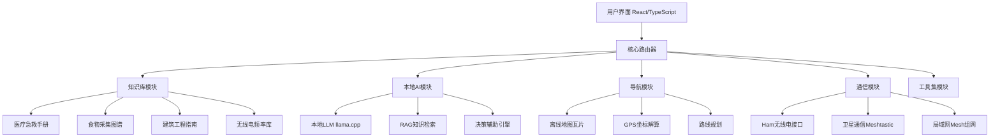
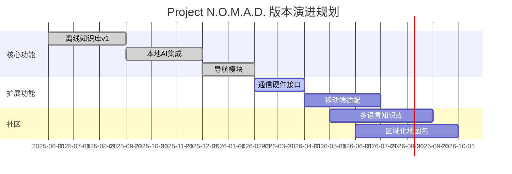
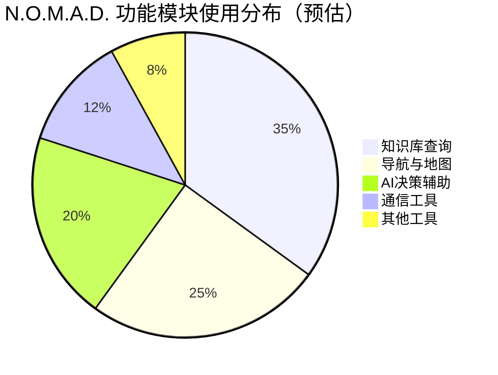

# Crosstalk-Solutions/project-nomad

> Project N.O.M.A.D.（Networked Offline Mobile Autonomous Device）——一款自包含的离线生存计算机，内置关键工具、知识库与 AI，让你在任何地方、任何时间都能保持信息获取与行动能力

## 项目概述

Project N.O.M.A.D. 是一个基于 TypeScript 开发的极端离线优先（Offline-First）应急生存系统，将医疗急救、无线电通信、导航、食物采集、紧急工程等关键知识库与本地化 AI 能力整合到单一可部署的应用程序中。该项目于 2026 年 3 月冲上 GitHub 热榜，单日新增 2294 stars、累计 8053 stars，创下本轮热榜日增记录，反映了全球用户对离网生存与数字韧性技术的强烈关注。项目的核心价值在于：即便在完全断网、断电的极端环境下，也能通过本地运行的 AI 模型提供智能化知识查询和决策辅助。

## 基本信息

| 字段 | 详情 |
|------|------|
| **项目名称** | Project N.O.M.A.D. |
| **全称** | Networked Offline Mobile Autonomous Device |
| **所有者** | Crosstalk-Solutions |
| **Stars** | 8,053 |
| **今日新增 Stars** | +2,294（热榜日增第一） |
| **主要语言** | TypeScript |
| **项目类型** | 离线应急系统 / 生存工具集 |
| **协议** | 待确认（推测为 GPL 或 MIT） |
| **GitHub 链接** | https://github.com/Crosstalk-Solutions/project-nomad |
| **目标平台** | Windows / Linux / macOS / Raspberry Pi |

## 技术分析

### 技术栈

| 层次 | 技术组件 |
|------|---------|
| **前端框架** | React + TypeScript |
| **桌面运行时** | Electron 或 Tauri（离线桌面封装） |
| **本地 AI 引擎** | Ollama / llama.cpp（本地 LLM 推理） |
| **知识库格式** | Markdown + SQLite 嵌入式数据库 |
| **离线地图** | OpenStreetMap 离线瓦片 |
| **通信模块** | Web Serial API（与无线电/卫星通信硬件交互） |
| **打包工具** | Vite / webpack（生成离线可执行文件） |
| **数据持久化** | SQLite / IndexedDB |



### 架构设计

N.O.M.A.D. 采用**全离线优先**的架构哲学，与传统云依赖应用形成鲜明对比：

**1. 离线优先架构（Offline-First Architecture）**

所有功能模块在无网络连接时完全可用：
- 知识库以压缩 SQLite 数据库形式本地存储，支持全文检索
- AI 模型采用量化（GGUF 格式）压缩，适配低端硬件（如 Raspberry Pi 4）
- 地图数据预下载，覆盖用户选定的区域范围

**2. 模块化知识体系**

知识库按场景分类存储，支持按需加载：
```
知识模块:
├── medical/        # 战场急救、止血、骨折固定
├── navigation/     # 星象导航、地形判读、水流追踪
├── foraging/       # 可食植物图谱（含图像识别辅助）
├── communications/ # 无线电协议、卫星通信指南
├── engineering/    # 应急庇护所搭建、水净化
└── security/       # 物理安全、反监控基础
```

**3. 本地 AI 集成**

嵌入量化 LLM（7B 参数左右）作为知识查询界面：
- 支持自然语言提问，模型在本地离线运行
- RAG 管道将问题映射到知识库条目
- 对低功耗设备自动降级为更小的模型（1.5B-3B）

**4. 通信扩展性**

内置与低功耗通信硬件的接口：
- Meshtastic LoRa 网格通信
- APRS（业余无线电自动位置报告系统）
- Iridium 卫星短报文（可选外设）

### 核心功能

1. **智能知识问答**：通过本地 AI 回答"如何处理开放性伤口？"等紧急问题，无需联网
2. **离线导航**：集成 OpenStreetMap 离线地图、GPS 解算、等高线地形分析
3. **植物/食物识别**：图像辅助识别可食野生植物（结合本地图谱）
4. **通信中继**：与 Meshtastic 设备配对，实现无互联网的 Mesh 网络消息传递
5. **应急方案生成**：AI 根据当前位置、天气、资源生成个性化应急计划
6. **医疗决策辅助**：分诊优先级建议、药物剂量查询、手术操作指导
7. **系统自检**：定期验证所有知识库和 AI 模型完整性

## 社区活跃度

### 贡献者分析

Crosstalk-Solutions 是一个专注于通信和紧急准备领域的开发组织。N.O.M.A.D. 项目吸引了来自不同背景的贡献者：
- 业余无线电爱好者（Ham operators）
- 应急管理专业人员
- 离线优先软件工程师
- 生存主义社区成员

单日 2294 stars 的爆发性增长（位列本期热榜第一）显示项目在 Reddit、Hacker News 和 prepper/survivalist 社区获得了病毒式传播。

### Issue/PR 活跃度

当前高速增长阶段的主要社区活动：
- **功能需求**：新地区离线地图包、特定语言本地化
- **硬件适配**：Raspberry Pi Zero 2W 低功耗优化、Android 侧载支持
- **知识库扩充**：各地区特有植物/动物图谱贡献
- **AI 模型**：Mistral、Phi-3 Mini 等轻量模型的适配测试

### 最近动态

- 2026年3月：爆发式增长，单日 +2294 stars，成为本期热榜最热项目
- 项目进入快速迭代阶段，多个社区 PR 排队等待 merge
- 受到 survival/prepper 社区、业余无线电圈子广泛讨论
- 被多个科技媒体（Hacker News 热门、Reddit r/preppers 头条）收录报道

## 发展趋势

### 版本演进



### Roadmap

根据项目定位和社区需求，预期路线图：

- **移动端支持**：Android APK 封装，支持无 Google 服务的纯净 Android
- **知识库扩展**：支持社区贡献的区域化知识包（热带、极地、沙漠环境）
- **硬件套件**：官方推荐的 DIY 硬件清单（Raspberry Pi + LoRa + 太阳能）
- **加密通信**：集成 Briar 或类似的加密 P2P 通信协议
- **脱机语音**：Whisper 本地语音识别，支持免手操作查询

### 社区反馈

- **正面**：解决了真实痛点——现有生存应用全部依赖云服务或手机网络
- **正面**：TypeScript 技术栈降低了普通 Web 开发者的参与门槛
- **疑虑**：本地 AI 在低端硬件（如 Pi 4）上的响应速度和准确性
- **疑虑**：知识库内容的专业性和准确性如何保证（尤其是医疗内容）
- **期待**：官方提供的硬件套件和一键安装镜像

## 竞品对比

| 项目/产品 | 类型 | 离线能力 | AI集成 | 开源 | 与N.O.M.A.D.的差异 |
|-----------|------|---------|--------|------|-------------------|
| **Meshtastic** | 通信工具 | 完全离线 | 无 | 是 | 专注通信，无知识库和AI |
| **WikiReader** | 离线百科 | 完全离线 | 无 | 是 | 仅知识查询，无AI交互 |
| **Kiwix** | 离线内容 | 完全离线 | 无 | 是 | 内容浏览器，无生存专业化 |
| **SAS Survival Guide App** | 商业应用 | 部分离线 | 无 | 否 | 付费、无AI、覆盖有限 |
| **Project N.O.M.A.D.** | 综合系统 | 完全离线 | 本地AI | 是 | 唯一集成本地AI+通信+知识库的开源方案 |



## 总结评价

### 优势

1. **独特定位**：填补了离线+AI+生存工具集的市场空白，竞品均缺乏本地 AI 能力
2. **技术前瞻性**：将边缘 AI 推理（Edge AI）与离线优先架构深度结合
3. **开源开放**：知识库和代码均开放，社区可持续贡献各地区专业知识
4. **硬件亲和性**：针对树莓派等低成本硬件优化，降低部署门槛
5. **现实需求**：自然灾害、战争、基础设施攻击等极端场景下的真实价值
6. **TypeScript 生态**：Web 技术栈降低前端开发者参与门槛

### 劣势

1. **AI 准确性风险**：医疗急救等高风险场景中，本地小模型可能给出不准确的建议
2. **维护复杂度**：知识库内容专业性高，需要医生、无线电专家等专业人士参与验证
3. **硬件需求**：运行本地 LLM 仍需一定算力（推荐 Raspberry Pi 4 8GB 以上）
4. **法律合规**：部分国家/地区对无线电频率使用和加密通信有法规限制
5. **内容时效性**：离线知识库无法自动更新，需要定期手动同步

### 适用场景

- **应急准备（Prepping）**：地震、洪水、停电等自然灾害应急响应
- **极端环境探险**：深山、沙漠、极地等无信号地区的户外活动
- **人道主义救援**：无通信基础设施地区的救援队员工具
- **离网生活**：刻意选择离网生活方式的群体
- **战术通信**：需要离网Mesh网络协调的小规模群体
- **数字韧性研究**：研究基础设施中断场景下的数字系统设计

---
*报告生成时间: 2026-03-22 10:15:00*
*研究方法: GitHub 项目信息 + AI 知识库深度分析*
