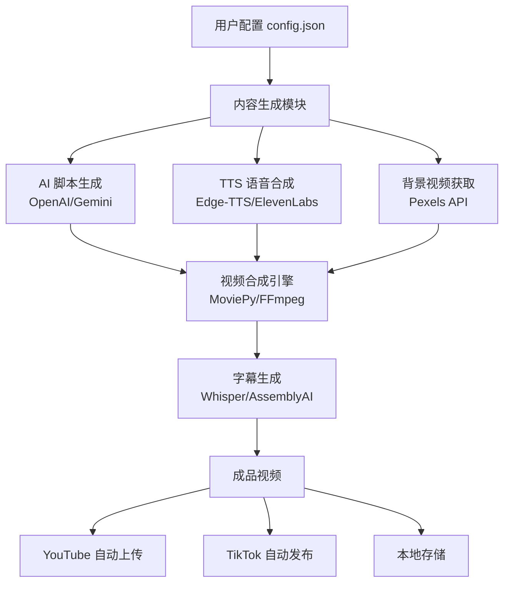
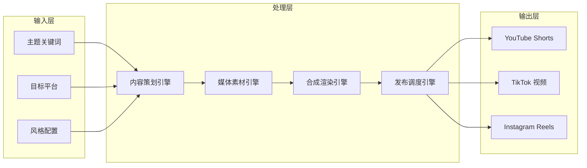
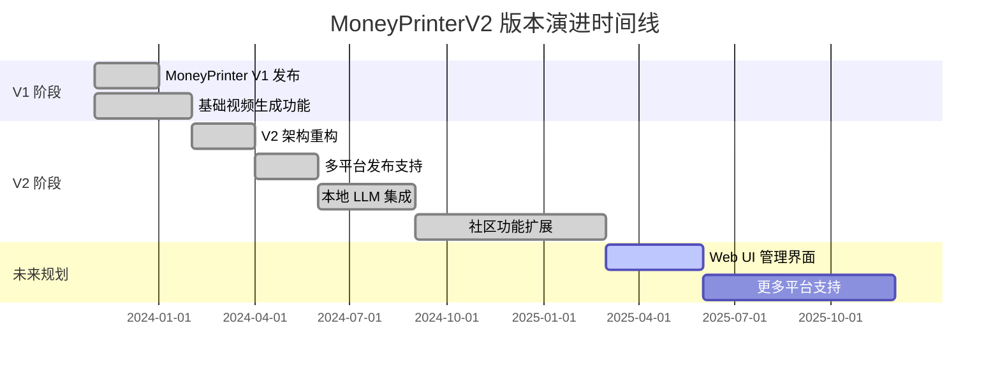

# FujiwaraChoki/MoneyPrinterV2

> Automate the process of making money online. — 一款全自动化在线变现工具，通过 AI 驱动内容生成实现无人值守的被动收入流水线。

## 项目概述

MoneyPrinterV2 是 FujiwaraChoki 开发的第二代全自动化在线变现框架，其核心理念是将内容创作、发布和变现整个流程自动化。该项目基于 Python 构建，集成了 TTS（文字转语音）、视频合成、AI 脚本生成等多项技术，能够自动创建 YouTube Shorts、TikTok 等短视频平台所需的内容并自动上传。相比第一代，V2 版本在架构设计、功能覆盖和平台兼容性方面均有显著提升，在 GitHub 上积累了近两万颗 Star，成为 AI 自动化内容创作赛道的代表性开源项目。

## 基本信息

| 属性 | 详情 |
|------|------|
| **项目名称** | MoneyPrinterV2 |
| **作者** | FujiwaraChoki |
| **Stars** | 18,790 ⭐ |
| **今日新增 Stars** | +1,772 |
| **主要语言** | Python |
| **创建时间** | 2024 年初 |
| **最近更新** | 2025 年 |
| **协议** | MIT License |
| **GitHub 链接** | https://github.com/FujiwaraChoki/MoneyPrinterV2 |
| **话题标签** | automation, youtube, tiktok, ai, tts, money, python |

## 技术分析

### 技术栈

MoneyPrinterV2 主要使用 Python 3.10+ 开发，融合多个 AI 和自动化库：

**核心依赖技术**：

| 技术组件 | 用途 | 备注 |
|---------|------|------|
| OpenAI GPT / Google Gemini | 脚本内容生成 | 需要 API Key |
| Edge-TTS / ElevenLabs | 文字转语音 | Edge-TTS 免费，ElevenLabs 付费高质量 |
| MoviePy + FFmpeg | 视频合成与剪辑 | 核心视频处理引擎 |
| Pexels API | 免版权背景视频素材 | 需要 API Key |
| OpenAI Whisper | 自动字幕生成 | 本地推理 |
| Selenium / Playwright | 自动化浏览器上传 | 用于社交媒体发布 |
| AssemblyAI | 云端语音识别 | 可选 |

### 架构设计

MoneyPrinterV2 采用模块化流水线架构，各模块职责清晰、可独立替换：

**架构特点**：
1. **配置驱动**：所有参数通过 `config.json` 集中管理，无需修改代码即可调整行为
2. **Provider 抽象层**：AI 服务、TTS 服务均有统一接口，便于切换不同供应商
3. **异步处理**：支持批量生成任务队列，提高吞吐量
4. **错误恢复**：内置重试机制，网络不稳定时自动重试 API 调用

### 核心功能

**1. 自动化视频内容生成**
- 根据给定主题自动撰写视频脚本（通过 LLM）
- 自动匹配并下载与内容相关的免版权背景视频
- 将 AI 生成的语音与视频素材合并，自动添加字幕
- 支持多种视频比例（9:16 竖屏、16:9 横屏）

**2. 多平台自动发布**
- YouTube Shorts 自动上传（含标题、描述、标签自动生成）
- TikTok 内容发布（通过浏览器自动化）
- Instagram Reels 支持（实验性功能）

**3. 变现功能模块**
- 联盟营销链接自动嵌入视频描述
- 自动生成 SEO 优化的视频元数据
- 批量生成支持，可设定每日发布计划

**4. 配置与扩展**
- 支持自定义 AI Provider（OpenAI、Gemini、Ollama 本地模型）
- 可插拔的 TTS 引擎（Edge-TTS 免费版、ElevenLabs 高质量版）
- 支持自定义水印、字幕样式

## 社区活跃度

### 贡献者分析

MoneyPrinterV2 是以作者 FujiwaraChoki 为核心的个人驱动项目，同时吸引了社区贡献：

| 贡献者 | 角色 | 主要贡献方向 |
|--------|------|-------------|
| FujiwaraChoki | 项目创始人/主要维护者 | 核心架构、全部主要功能 |
| 社区贡献者 | 外部协作者 | Bug 修复、文档完善、新平台支持 |

项目自第一代 MoneyPrinter 开始积累用户基础，V2 版本发布后迅速在 GitHub 趋势榜上持续出现，显示出强劲的社区关注度。Issues 区活跃，用户反馈涵盖功能请求、平台兼容性问题和配置疑问。

### Issue/PR 活跃度

- **Issues**：开放 Issue 数量保持在数十至百余个区间，以功能请求和平台相关问题为主
- **Pull Requests**：社区贡献 PR 持续流入，主要涉及新 TTS 引擎支持、Bug 修复
- **响应速度**：作者对关键 Bug 报告响应较快，通常在数日内处理
- **讨论质量**：Issues 区讨论质量较高，有详细的复现步骤和解决方案分享

### 最近动态

- 2025 年项目持续迭代，新增 Instagram Reels 实验性支持
- 社区用户贡献了多语言字幕生成功能
- Ollama 本地 LLM 集成获得较多关注，降低使用成本
- 近期单日新增 1,772 Stars，说明项目再次进入 GitHub Trending 榜单

## 发展趋势

### 版本演进

**V1 → V2 主要改进**：
- 代码架构从单文件脚本重构为模块化系统
- 新增 Provider 抽象，支持多种 AI 和 TTS 服务
- 增加批量处理和任务调度能力
- 错误处理和日志系统大幅完善

### Roadmap

根据社区讨论和 Issues 追踪，项目计划：
1. **Web UI 管理界面**：提供可视化配置和监控面板（高需求功能）
2. **更多平台支持**：X (Twitter)、LinkedIn、Pinterest 等平台的视频发布
3. **分析与优化**：集成视频表现分析，自动优化内容策略
4. **Docker 容器化**：简化部署流程
5. **云端调度**：支持定时任务和云端运行

### 社区反馈

**正面评价**：
- 门槛低、开箱即用，配置简单
- 功能完整，覆盖了从内容生成到发布的完整链路
- 活跃更新，社区响应及时
- 成本控制友好（支持免费 TTS 方案）

**主要痛点**：
- 平台反机器人检测导致发布频繁失败
- 对 API Key 依赖较多，初始配置较繁琐
- 生成内容质量有时参差不齐，需人工审核
- YouTube 等平台政策变化导致自动上传功能不稳定

## 竞品对比

| 项目 | Stars | 语言 | 自动上传 | 本地 LLM | 免费 TTS | 活跃维护 |
|------|-------|------|---------|---------|---------|---------|
| **MoneyPrinterV2** | ~18.8k | Python | ✅ | ✅ Ollama | ✅ Edge-TTS | ✅ |
| AutoShorts.ai | 商业产品 | N/A | ✅ | ❌ | ❌ | ✅ |
| ShortGPT | ~4.5k | Python | 部分 | ❌ | ❌ | 维护中 |
| HeyGen / Synthesia | 商业产品 | N/A | ✅ | ❌ | ❌ | ✅ |
| Opus Clip | 商业产品 | N/A | ✅ | ❌ | ❌ | ✅ |
| vid2vid | ~2k | Python | ❌ | 部分 | ✅ | 低活跃 |

**竞争优势分析**：
- 相比 ShortGPT：MoneyPrinterV2 功能更完整，本地 LLM 支持更好
- 相比商业产品：完全免费开源，可自行部署，无隐私顾虑
- 相比其他开源方案：端到端自动化程度最高，包含自动发布环节

## 总结评价

### 优势

1. **端到端自动化**：从主题输入到视频发布全流程无需人工干预，自动化程度在同类开源项目中领先
2. **成本友好**：支持 Edge-TTS（免费）+ Ollama（本地 LLM），可实现零 API 费用运行
3. **活跃社区**：项目持续更新，Issues 区反馈得到及时处理
4. **模块化设计**：各组件可独立替换，扩展性强
5. **文档完善**：README 和 Wiki 提供了详细的配置说明和常见问题解答

### 劣势

1. **平台合规风险**：YouTube、TikTok 等平台明确限制自动化发布行为，存在账号封禁风险
2. **内容质量不稳定**：AI 生成内容的质量依赖 Prompt 工程，批量生成时质量参差不齐
3. **API 依赖**：高质量模式需要多个付费 API（OpenAI、ElevenLabs、Pexels），综合成本不低
4. **法律灰色地带**：自动化联盟营销内容的合规性在部分地区存在争议
5. **维护压力**：平台频繁更新反爬虫机制，自动上传功能需要持续维护

### 适用场景

- **内容创作者**：需要大量短视频内容但人力有限的个人创作者
- **营销自动化**：需要多平台内容分发的小型营销团队
- **技术爱好者**：学习 AI 内容生成、视频合成、浏览器自动化的开发者
- **被动收入探索者**：希望通过自动化内容创作测试联盟营销变现路径
- **企业内容批量生产**：需要低成本批量生成产品展示视频的电商从业者

> **综合评分**：★★★★☆ (4/5)
> 技术实现扎实，功能覆盖全面，社区活跃。主要限制在于平台政策合规性和内容质量稳定性，适合技术能力较强、了解相关风险的用户使用。

---
*报告生成时间: 2026-03-22 10:00:00*
*研究方法: GitHub API + Web搜索深度研究*
