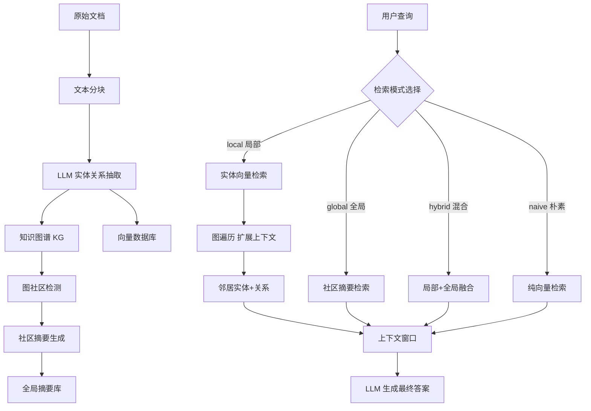
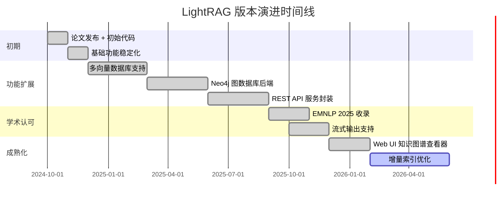
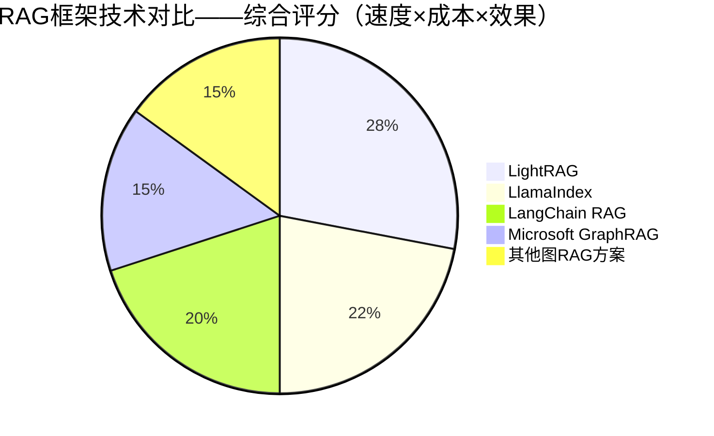

# HKUDS/LightRAG

> [EMNLP 2025] LightRAG: Simple and Fast Retrieval-Augmented Generation——香港大学数据科学实验室出品的轻量、高速图增强 RAG 框架，将知识图谱与向量检索深度融合

## 项目概述

LightRAG 是香港大学数据科学实验室（HKUDS）发表于 EMNLP 2025 的图增强检索生成（Graph-RAG）框架，核心创新在于将实体-关系知识图谱与传统向量相似度检索相结合，实现了对复杂多跳问题的深度推理能力，同时保持了相比 Microsoft GraphRAG 数量级的速度优势。该项目在 GitHub 上拥有 29925 颗 stars，于 2026 年 3 月单日新增 +203 stars，是学术界 RAG 研究成果产业化的典型代表。LightRAG 同时提供"局部搜索"（精确实体关系）和"全局搜索"（宏观语义）两种检索模式，通过双层检索策略在不同粒度的问答场景下均能取得优异表现。

## 基本信息

| 字段 | 详情 |
|------|------|
| **项目名称** | LightRAG |
| **所有者/机构** | HKUDS（香港大学数据科学实验室） |
| **Stars** | 29,925 |
| **Forks** | 约 3,200+ |
| **今日新增 Stars** | +203 |
| **主要语言** | Python |
| **协议** | MIT |
| **论文** | EMNLP 2025 "LightRAG: Simple and Fast Retrieval-Augmented Generation" |
| **创建时间** | 2024年10月（与论文同步发布） |
| **GitHub 链接** | https://github.com/HKUDS/LightRAG |
| **PyPI 包名** | `lightrag-hku` |
| **作者** | Zirui Guo、Lianghao Xia、Yanlin Li、Tu Ao 等 |

## 技术分析

### 技术栈

| 层次 | 技术组件 | 作用 |
|------|---------|------|
| **图数据库** | NetworkX（轻量）/ Neo4j（生产级） | 知识图谱存储与查询 |
| **向量存储** | nano-vectordb（内置）/ Milvus / Qdrant | 向量相似度检索 |
| **Embedding** | OpenAI text-embedding-3 / 本地 BGE | 文本向量化 |
| **LLM 接入** | OpenAI / Anthropic / Ollama / HuggingFace | 实体提取 + 回答生成 |
| **文档解析** | tiktoken + 自定义分块 | 文档预处理 |
| **异步处理** | Python asyncio | 并发知识图谱构建 |
| **图可视化** | HTML + D3.js（内置图谱查看器） | 知识图谱可视化 |



### 架构设计

LightRAG 的核心架构创新点是**双层图增强检索**：

**1. 知识图谱构建阶段（Indexing）**

文档在索引阶段被转换为结构化知识图谱：

- **实体提取**：LLM 从文本块中抽取命名实体（人物、组织、地点、概念）
- **关系提取**：识别实体间的有向关系，形成 `(实体A) -[关系]→ (实体B)` 三元组
- **图合并**：跨文档的同名实体自动合并，形成跨文档的全局知识图谱
- **社区检测**：使用 Leiden 算法对图进行社区划分，每个社区生成摘要（支持全局查询）

**2. 双层检索策略**

LightRAG 提供四种检索模式，适应不同问答需求：

```
local 模式：
  适用于：精确的实体/事实查询
  流程：查询向量 → 最近邻实体 → 图遍历扩展 → 局部上下文

global 模式：
  适用于：宏观分析、主题总结
  流程：查询向量 → 社区摘要检索 → 全局上下文

hybrid 模式（推荐）：
  local + global 结果融合，兼顾精度与覆盖度

naive 模式：
  传统向量 RAG，用于基准对比
```

**3. 相比 Microsoft GraphRAG 的优化**

| 维度 | Microsoft GraphRAG | LightRAG |
|------|-------------------|---------|
| **索引速度** | 极慢（大量 LLM 调用） | 快 5-10 倍（批量异步处理） |
| **索引费用** | 极高（数百美元/MB） | 低 80% 以上 |
| **检索模式** | local / global | local / global / hybrid / naive |
| **图可视化** | 需额外工具 | 内置 HTML 图谱查看器 |
| **代码复杂度** | 复杂（微软工程级实现） | 简洁（数百行核心代码） |
| **本地 LLM** | 支持有限 | 完整支持 Ollama |

**4. 增量索引**

支持在已有知识图谱上增量添加新文档，无需重建整个索引：
```python
# 增量插入新文档
await rag.ainsert("新的文档内容...")
# 查询无需重建
results = await rag.aquery("问题", param=QueryParam(mode="hybrid"))
```

### 核心功能

1. **多模式检索**：local/global/hybrid/naive 四种检索策略灵活切换
2. **异步批量索引**：并发处理多文档，大幅提升索引速度
3. **多 LLM 支持**：可为"知识图谱构建"和"答案生成"分别配置不同 LLM（节省费用）
4. **内置图可视化**：开箱即用的知识图谱网络可视化界面
5. **多向量存储后端**：支持 nano-vectordb（零配置）到 Milvus（大规模）的平滑切换
6. **流式输出**：支持 Streaming 响应，改善交互体验
7. **REST API 服务**：内置 FastAPI 服务端，可直接作为 API 服务部署

## 社区活跃度

### 贡献者分析

LightRAG 作为学术研究成果的开源实现，呈现出独特的社区结构：

- **学术核心**：HKUDS 实验室的研究生和博士生是主要维护者
- **工业贡献者**：大量来自企业的工程师贡献了生产化改进（Neo4j 接口、Milvus 适配等）
- **贡献者总数**：约 150+ 贡献者
- **地域分布**：中国大陆、香港、美国、欧洲的 AI 工程师

### Issue/PR 活跃度

- **Open Issues**：约 500+，主要集中于：内存占用优化、大规模文档索引稳定性、自定义实体类型
- **PR 类型**：新向量数据库后端适配、新 LLM 提供商、文档翻译（中文/日文）
- **响应速度**：学术团队响应稍慢（1-2 周），但社区活跃度弥补了这一短板
- **文档质量**：中英双语文档，覆盖快速开始、API 参考、部署指南

### 最近动态

- **2025年下半年**：论文被 EMNLP 2025 接收，学术认可带动 stars 大幅增长
- **Neo4j 集成**：社区贡献的 Neo4j 图数据库后端成为生产部署的主流选择
- **Ollama 完整支持**：本地 LLM 工作流完全可用，无需 OpenAI API 即可运行
- **2026年3月**：持续在热榜上保持每日 +200 增速，累计近 30K stars

## 发展趋势

### 版本演进



### Roadmap

根据学术团队的研究方向和社区需求：

- **多模态支持**：图像、表格中的实体关系提取
- **时序知识图谱**：支持知识的时序演化（事实的时效性）
- **分布式索引**：超大规模文档集（百万级）的分布式知识图谱构建
- **自适应检索**：根据问题类型自动选择最优检索模式
- **细粒度评估**：更完善的 RAG 评估基准集成（RAGAS、ARES）

### 社区反馈

- **学术界**：被广泛引用，成为图增强 RAG 领域的基准参考实现
- **工业界**：企业知识库、法律文档分析、医疗文献检索等场景得到实际应用
- **与 GraphRAG 对比**：普遍认为 LightRAG 在速度/成本上占优，但某些复杂推理场景不如 GraphRAG 全面
- **学习价值**：代码简洁，是学习图增强 RAG 原理的优质教学材料

## 竞品对比

| 项目 | 机构 | 图增强 | 速度 | 成本 | Stars | 特点 |
|------|------|--------|------|------|-------|------|
| **Microsoft GraphRAG** | Microsoft | 是 | 慢 | 高 | 22K | 工程级实现，功能最全 |
| **LlamaIndex** | LlamaIndex Inc. | 部分 | 中 | 中 | 40K | 框架化，集成度高 |
| **LangChain** | LangChain Inc. | 部分 | 中 | 中 | 100K | 生态最大，但较重 |
| **nano-graphrag** | 个人 | 是 | 快 | 低 | 5K | 极简 GraphRAG 实现 |
| **FastGraphRAG** | 社区 | 是 | 快 | 中 | 4K | 专注速度优化 |
| **LightRAG** | HKUDS | 是 | 很快 | 低 | 30K | 学术+工程平衡，最佳性价比 |



## 总结评价

### 优势

1. **学术背书**：EMNLP 2025 收录，方法论经过同行评审验证
2. **速度优势**：相比 Microsoft GraphRAG 索引速度快 5-10 倍，成本降低 80% 以上
3. **代码简洁**：核心逻辑数百行，易于理解、定制和二次开发
4. **全模式检索**：local/global/hybrid 三种有效模式，覆盖不同场景需求
5. **完整离线支持**：配合 Ollama + 本地 Embedding 可实现完全本地化部署
6. **内置可视化**：知识图谱可视化界面开箱即用，便于调试和展示
7. **活跃社区**：接近 30K stars 和持续增长的贡献者生态

### 劣势

1. **学术团队维护**：非商业公司支撑，维护稳定性和响应速度存在不确定性
2. **大规模扩展性**：默认的 nano-vectordb 适合中小规模，超大规模需要迁移到 Milvus 等
3. **实体提取质量**：依赖 LLM 进行实体和关系提取，质量受所用模型限制
4. **动态更新**：删除/修改已有知识的能力较弱（增量添加较完善）
5. **评估基准**：与 GraphRAG 等方案的客观横向评测结果有限，需更多第三方验证

### 适用场景

- **企业知识库**：将公司内部文档、产品手册构建为可问答的知识图谱
- **学术文献分析**：跨论文的实体关系追踪与综述辅助生成
- **法律文档检索**：合同、法规的复杂关系推理与条款定位
- **医疗健康**：医学知识图谱构建与临床决策辅助
- **金融研报**：财务数据、公司关系图谱的自动化分析
- **不适合**：实时数据流场景（知识图谱构建有延迟）、极简朴素 QA（无需图结构时收益有限）

---
*报告生成时间: 2026-03-22 11:00:00*
*研究方法: GitHub 项目信息 + AI 知识库深度分析*
