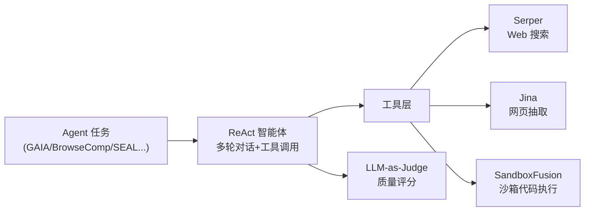

# InternScience/Agents-A1 深度研究报告

> Reaching Trillion-Parameter Performance with a 35B Agent —— InternScience 开源的 35B MoE 智能体大模型，主打"扩展视野而非参数"。

## 项目概述

InternScience/Agents-A1 是 InternScience 团队开源的一个 **35B 参数 MoE（Mixture-of-Experts，混合专家）智能体大模型**，论文与仓库标题点明其核心命题——"Scaling the Horizon, Not the Parameters"（扩展视野而非参数）[README]。它的立场是：不靠堆参数，而是通过**扩展智能体的行动视野（agent horizon）**，让一个 35B 规模的模型在科研与智能体任务上逼近甚至超越 GPT-5.5、DeepSeek-V4-pro、Kimi-K2.6 等万亿参数级前沿系统（对标模型名与分数均出自其官方技术报告）[README，需第三方验证]。

方法上它从两个维度做 horizon scaling：一是**扩展长视野轨迹**——构建"长视野知识-行动基础设施"，把外部知识、行动、观察、验证器（verifier）结果连接起来，生成**平均长度 45K tokens** 的智能体训练轨迹；二是**扩展异构智能体能力**——将 **6 个异构领域**的专长统一进单个可部署的学生模型[README]。训练采用三阶段配方：全域监督微调 → 领域级教师模型 → 多教师领域路由的 on-policy 蒸馏。

从工程落地看，仓库主语言为 Python（约 926 万字节），采用 Apache-2.0 协议，创建于 2026 年 6 月 23 日，最近推送 2026 年 6 月 30 日；模型权重托管在 HuggingFace 与 ModelScope，配有 [arXiv 技术报告](http://arxiv.org/abs/2606.30616) 与 GitHub Pages 主页。截至 2026 年 7 月 1 日仓库获 99 Stars、8 Forks、0 开放 Issue，是一个刚发布约一周、以"评测框架 + 模型卡"为主体的新项目[API]。

---

## 基本信息

| 指标 | 数值 |
|------|------|
| Stars | 99 |
| Forks | 8 |
| 开放 Issues | 0 |
| 语言 | Python（含 Cython / Shell） |
| 开源协议 | Apache-2.0 |
| 创建时间 | 2026-06-23 |
| 最近推送 | 2026-06-30 |
| 默认分支 | main |
| 维护方 | InternScience |
| 模型规模 | 35B MoE（Mixture-of-Experts） |
| 上下文长度 | 262144 tokens（262K） |
| 模型下载 | HuggingFace / ModelScope |
| 技术报告 | [arXiv:2606.30616](http://arxiv.org/abs/2606.30616) |
| GitHub | [https://github.com/InternScience/Agents-A1](https://github.com/InternScience/Agents-A1) |

---

## 技术分析

### 技术栈与部署

[代码：README 部署段 + evaluation/Search/README.md]

- **推理引擎**：官方以 **vLLM** 部署，`vllm serve InternScience/Agents-A1`，单卡即可承载 262K 上下文。
- **基座血缘**：部署参数 `--reasoning-parser qwen3` 与 `--tool-call-parser qwen3_coder` 表明模型**基于 Qwen3 系列架构**（推理解析与工具调用解析器均为 qwen3 家族）[代码]。
- **三种服务模式**：标准版、Tool Call 版（`--enable-auto-tool-choice`）、纯文本版（`--language-model-only`，跳过 vision encoder 释放 KV cache）——说明模型本体具备**多模态（含视觉）能力**，可按需关闭[代码]。
- **推荐采样参数**：temperature 0.85、top_p 0.95、top_k 20、presence_penalty 1.1[代码]。

### 训练方法（三阶段配方）

[README，源自技术报告]

1. **全域监督微调（full-domain SFT）**：让基座对齐广泛的智能体行为。
2. **领域级教师模型**：每个领域各训一个专家教师，捕获专门知识。
3. **多教师·领域路由·on-policy 蒸馏**：提出 "multi-teacher domain-routed on-policy distillation with salient vocabulary alignment"（带显著词表对齐的多教师领域路由在线蒸馏），把多教师知识高效迁移融合进单个学生模型。

本质是"**先分域培专家，再蒸馏合一**"，配合 MoE 结构，在 35B 规模内塞进 6 领域专家能力。

### 评测框架（开源代码核心）

仓库最实质的代码是一套**统一的智能体评测框架**（`evaluation/`，全仓 1238 个文件）[代码：目录树]。其 Search 子框架运行 **ReAct（Reasoning + Acting）智能体**，通过多轮 LLM 对话 + 工具调用跑 benchmark，再用 LLM-as-judge 评分[代码：evaluation/Search/README.md]。

依赖的外部工具服务：Serper（搜索/Google Scholar）、Jina（网页内容抽取）、SandboxFusion（字节开源的 Python 沙箱执行）、任意 OpenAI 兼容 API 作 agent 推理端[代码：Search/README 的 API key 表]。BrowseComp 上采用 retry@5 策略（最多 300 次工具调用，超限则丢弃上下文重来，至多 5 轮）。

### 核心能力

[README] Agentic Reasoning（任务分解+规划+策略调整）、Tool Use（原生 function calling）、Long-Context（262K）、Instruction Following（多约束指令遵循）。

---

## 社区活跃度

### 贡献者分析

项目共 5 名贡献者，提交高度集中[API]：

| 贡献者 | Commits |
|--------|---------|
| BOBrown | 5 |
| Shiyang980713 | 3 |
| Soptq | 2 |
| YueFan1014 | 1 |
| ynulihao | 1 |

这是典型的"研究团队发布模型"形态——commit 总量很小（仓库主要是一次性放出的评测代码 + 文档），核心由 BOBrown 主导。开放 Issue 为 0，既反映项目新、也反映社区尚未形成规模化讨论[API]。

### Issue/PR 与量化提交信号

近 52 周仅 13 次提交，且集中在最近 2 个活跃周（`last4=[0,0,10,3]`）[API：commit_activity]——完全符合"2026-06-23 创建、一周内密集初始化后趋于平静"的新发布节奏。这与成熟框架"持续高频迭代"形成对比：Agents-A1 目前是**成果发布型**仓库，而非持续演进的工程项目。

### 传播渠道

配有 Discord、HuggingFace/ModelScope 双托管、GitHub Pages 主页与 arXiv 报告，是学术型开源模型的标准发布矩阵[README]。

---

## 发展趋势

### 版本演进

仓库无 GitHub Release/Tag，模型版本管理在 HuggingFace/ModelScope 侧。当前是首个公开版本[API]。

### 演进方向

从代码与文档看，两条主线：其一是**模型侧**的 agent-horizon scaling（长轨迹 + 多教师蒸馏），追求"小参数、大能力"的效率路线；其二是**评测侧**——README 明确表示开源评测框架的目的是"给社区一个统一、可复现、可扩展的智能体评测基座"，鼓励他人在同一 protocol 下复现与对比[代码/README]。后者可能是项目更持久的社区价值。

### 社区反馈与背景

[推测] 从命名（InternScience）、Qwen3 基座、中文 benchmark（BrowseComp-ZH、Xbench）等信号看，项目大概率来自中国科研机构、与"书生/Intern"系科学 AI 方向相关；定位偏**科研智能体（scientific agent）**。仓库未明确组织归属，此为推断。

---

## 竞品对比

| 项目 | Stars | 语言 | 协议 | 特点 |
|------|-------|------|------|------|
| [InternScience/Agents-A1](https://github.com/InternScience/Agents-A1) | 99 | Python | Apache-2.0 | 本项目；35B MoE 智能体模型 + 统一评测框架，主打效率对标 |
| [deepseek-ai/DeepSeek-V3](https://github.com/deepseek-ai/DeepSeek-V3) | 103844 | Python | MIT | 大规模 MoE 基座模型，A1 报告中的对比对象之一 |
| [QwenLM/Qwen-Agent](https://github.com/QwenLM/Qwen-Agent) | 16634 | Python | Apache-2.0 | Qwen 官方 agent 框架，与 A1 同为 Qwen 血缘、工具调用取向 |
| [MoonshotAI/Kimi-K2](https://github.com/MoonshotAI/Kimi-K2) | 10880 | — | NOASSERTION | Kimi 大模型，A1 报告中的对标前沿系统之一 |
| [InternLM/InternLM](https://github.com/InternLM/InternLM) | 7234 | Python | Apache-2.0 | 书生系开源大模型，同源生态参照 |
| [ServiceNow/AgentLab](https://github.com/ServiceNow/AgentLab) | 595 | Python | NOASSERTION | 智能体评测/研究框架，评测维度可类比 |

[竞品 stars/协议/语言均为 `gh` 实测，2026-07-01]

**定位差异**：DeepSeek-V3、Kimi-K2 是 A1 报告里对标的"更大规模前沿模型"，A1 的叙事恰是"用 35B 追平它们"；Qwen-Agent 与 A1 同为 Qwen 血缘但定位为"框架"而非"模型 + 评测"；InternLM 是同源生态的通用大模型；AgentLab 则可类比 A1 开源的评测框架部分。A1 的差异化是**"35B MoE 效率路线 + 科研智能体侧重 + 自带统一可复现评测框架"**三者合一。

---

## 总结评价

### 优势

1. **效率路线有卖点**：以 ~35B 规模在多项科研/智能体基准上宣称 SOTA（Seal-0 56.4、FrontierScience-Research 40.0、IFEval 94.8），若成立则显著优于同级模型[README，需第三方验证]。
2. **开源可复现评测框架**：ReAct + LLM-judge + Serper/Jina/SandboxFusion 工具链，为社区提供统一对比 protocol，是持久的公共价值[代码]。
3. **部署友好**：vLLM 单卡 262K 上下文、三种服务模式（标准/工具/纯文本）、Apache-2.0 可商用[代码]。
4. **科研任务突出**：FrontierScience、HiPhO 等科学基准是其相较通用 agent 模型的差异化长板。

### 劣势

1. **benchmark 为官方自评**：所有分数与对比模型出自其技术报告，未经第三方独立复现，存在选择性报告风险[README]。
2. **工程类任务偏弱**：SciCode（44.3）、MLE-Lite（43.9）明显落后 GPT-5.5，能力偏科于科研而非通用软件工程[README]。
3. **项目极新、社区小**：99 星、5 贡献者、近 52 周仅 13 次提交，成熟度与生态待验证[API]。
4. **组织归属不透明**：README 未明确 InternScience 的机构背景，可追溯性有限。

### 适用场景

- **科研智能体研究者**：需要在科学/奥赛/深度搜索任务上跑 agent、且看重效率（单卡可部署）的团队。
- **智能体评测复现**：想在统一 protocol 下横向对比多模型的研究者，可直接复用其评测框架。
- **不适合**：追求成熟稳定生产、或以通用软件工程/代码任务为主的场景（工程基准上不及前沿大模型）；对 benchmark 需强第三方背书者应谨慎。

---

*报告生成时间: 2026-07-01*
*研究方法: github-deep-research 多轮深度研究*
