# Hermes Agent 深度研究报告

> 研究日期：2026年3月17日
> 项目地址：https://github.com/NousResearch/hermes-agent

---

## 目录

1. [项目概述](#项目概述)
2. [基本信息](#基本信息)
3. [技术分析](#技术分析)
4. [社区活跃度](#社区活跃度)
5. [发展趋势](#发展趋势)
6. [竞品对比](#竞品对比)
7. [总结评价](#总结评价)

---

## 项目概述

### 简介

**Hermes Agent** 是由 [Nous Research](https://nousresearch.com) 开发的**自我改进型 AI Agent**。它是目前市场上唯一具备内置学习循环的 AI Agent——能够从经验中创建技能、在使用过程中改进技能、主动持久化知识、搜索历史对话，并在跨会话中构建不断深化的用户模型。

### 核心理念

Hermes Agent 的核心理念是"**与用户共同成长**"。不同于传统的 AI 助手，Hermes Agent 具备以下独特能力：

- **自主技能创建**：完成复杂任务后自动生成可复用技能
- **技能自我改进**：技能在使用过程中持续优化
- **跨会话记忆**：通过 FTS5 全文搜索和 LLM 摘要实现跨会话召回
- **用户建模**：基于 Honcho 方言式用户建模，深度理解用户偏好

### 项目定位

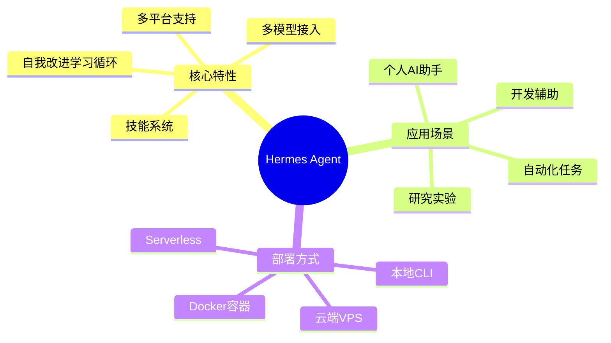

---

## 基本信息

### 项目统计

| 指标 | 数值 |
|------|------|
| ⭐ Stars | **8,251** |
| 🍴 Forks | **962** |
| 🐛 Open Issues | **252** |
| 👥 Contributors | **99** |
| 📜 License | **MIT** |
| 🔧 Primary Language | **Python** |

### 项目时间线

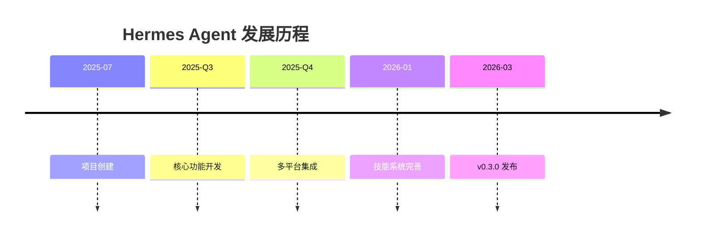

### 语言分布

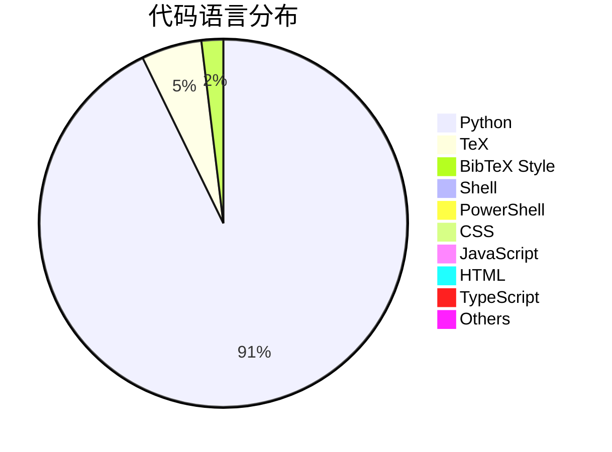

### 最新版本

- **版本号**：v2026.3.17 (Hermes Agent v0.3.0)
- **发布日期**：2026年3月17日
- **更新频率**：活跃更新中

### 项目标签

```
ai, ai-agent, ai-agents, anthropic, chatgpt, claude, claude-code, 
clawdbot, codex, hermes, hermes-agent, llm, moltbot, nous-research, 
openai, openclaw
```

---

## 技术分析

### 架构设计

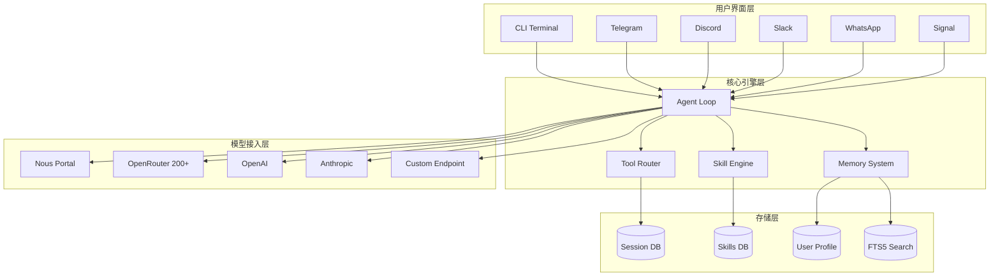

### 核心技术特性

#### 1. 自我改进学习循环

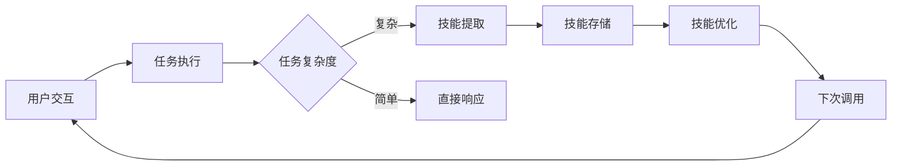

这是 Hermes Agent 最具创新性的特性：
- **经验捕获**：自动捕获交互过程中的有效反馈
- **技能生成**：从复杂任务中提取可复用的技能模板
- **持续优化**：技能在使用过程中自我改进
- **知识持久化**：主动提醒持久化重要知识

#### 2. 多终端后端支持

| 后端 | 适用场景 | 特点 |
|------|----------|------|
| Local | 本地开发 | 直接运行，无需配置 |
| Docker | 容器化部署 | 环境隔离，易于迁移 |
| SSH | 远程服务器 | 跨机器访问 |
| Daytona | Serverless | 按需唤醒，成本优化 |
| Singularity | HPC环境 | 高性能计算集群 |
| Modal | Serverless | 无服务器架构 |

#### 3. 技能系统

Hermes Agent 实现了完整的技能生命周期管理：

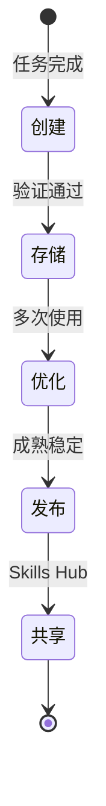

- **技能创建**：Agent 自动从复杂任务中提取技能
- **技能存储**：本地持久化，支持版本管理
- **技能优化**：使用过程中持续改进
- **技能共享**：通过 [Skills Hub](https://agentskills.io) 共享给社区

#### 4. 记忆系统

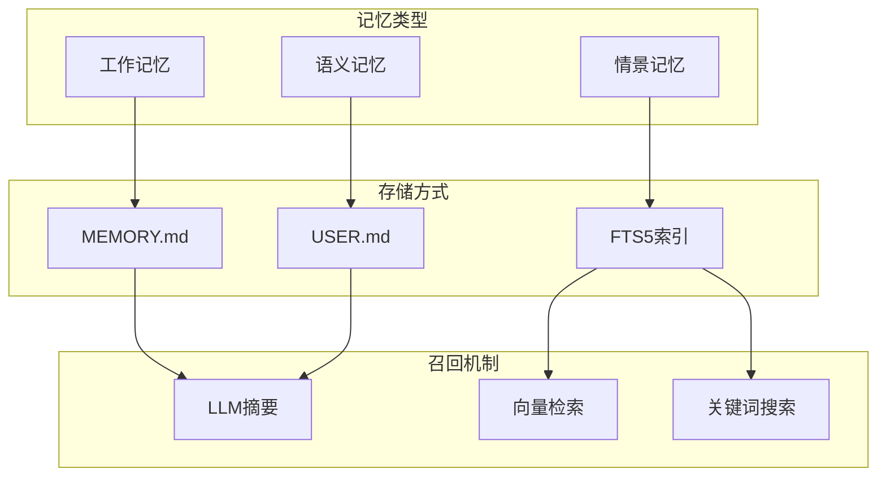

### 技术栈详解

| 层级 | 技术选型 |
|------|----------|
| **核心语言** | Python 3.11+ |
| **CLI框架** | 自研TUI，支持多行编辑 |
| **LLM接入** | 统一API抽象，支持200+模型 |
| **数据库** | SQLite + FTS5 |
| **任务调度** | 内置Cron调度器 |
| **消息网关** | Telegram/Discord/Slack/WhatsApp/Signal |
| **容器化** | Docker / Singularity |
| **Serverless** | Modal / Daytona |

### 工具系统

Hermes Agent 内置 **40+ 工具**，涵盖：

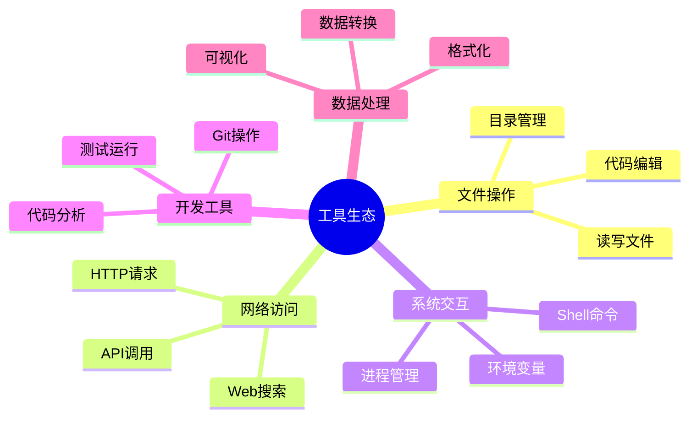

---

## 社区活跃度

### 贡献者分析

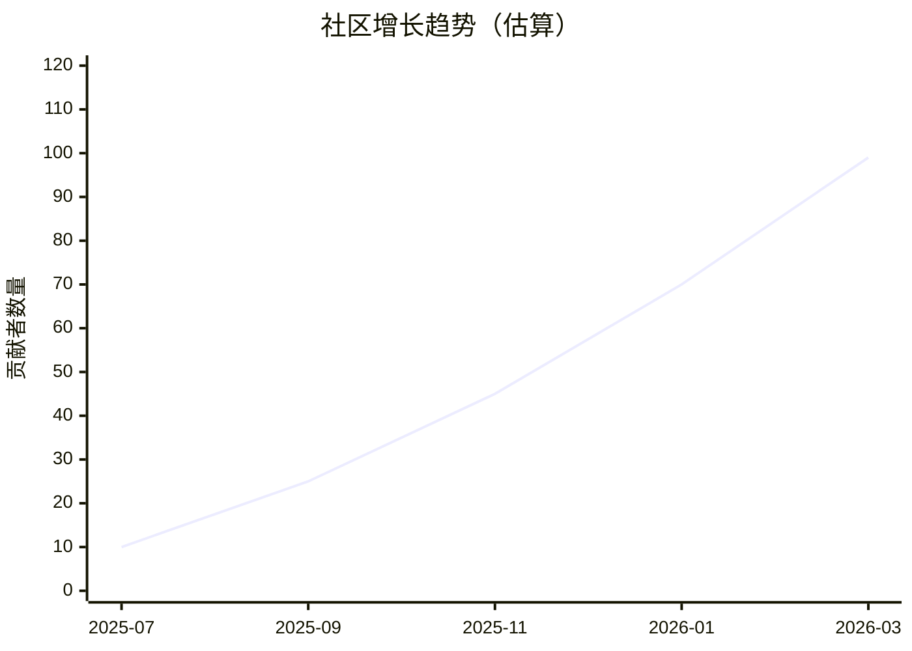

### 社区指标

| 指标 | 状态 | 评价 |
|------|------|------|
| **Stars增长** | 8,251 | ⭐⭐⭐⭐⭐ 快速增长 |
| **Fork/Star比** | 11.7% | ⭐⭐⭐⭐ 健康比例 |
| **Issue响应** | 252 open | ⭐⭐⭐ 需关注 |
| **贡献者数量** | 99人 | ⭐⭐⭐⭐ 活跃社区 |
| **文档完整度** | 完善 | ⭐⭐⭐⭐⭐ 优秀 |

### 社区渠道

| 渠道 | 链接 | 用途 |
|------|------|------|
| 💬 Discord | [discord.gg/NousResearch](https://discord.gg/NousResearch) | 社区讨论 |
| 📚 Skills Hub | [agentskills.io](https://agentskills.io) | 技能共享 |
| 🐛 Issues | [GitHub Issues](https://github.com/NousResearch/hermes-agent/issues) | 问题反馈 |
| 💡 Discussions | [GitHub Discussions](https://github.com/NousResearch/hermes-agent/discussions) | 深度讨论 |

### OpenClaw 迁移支持

Hermes Agent 提供了完善的 OpenClaw 迁移方案，支持导入：

- SOUL.md 人格文件
- MEMORY.md 和 USER.md 记忆条目
- 用户创建的技能
- 命令批准列表
- 消息平台配置
- API 密钥（Telegram、OpenRouter、OpenAI、Anthropic、ElevenLabs）
- TTS 资源文件

---

## 发展趋势

### 技术演进路线

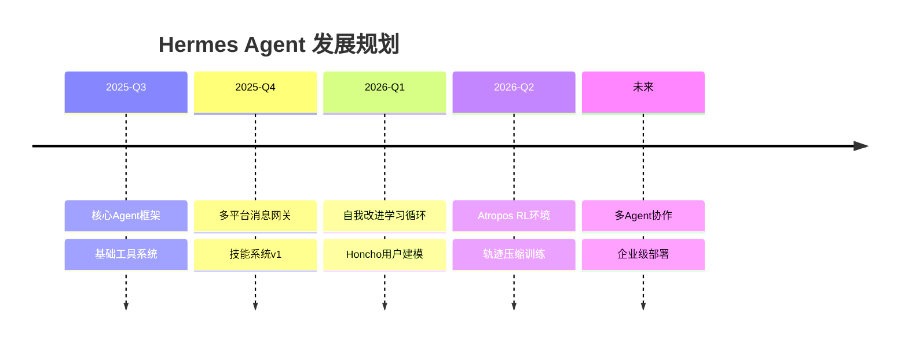

### 市场定位分析

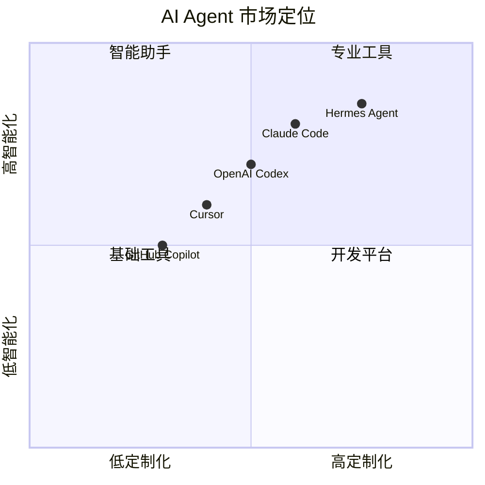

### 增长驱动因素

1. **自我改进特性**：独特的差异化竞争优势
2. **多模型支持**：避免供应商锁定，灵活切换
3. **开源生态**：MIT 许可证，社区驱动发展
4. **企业友好**：支持私有部署，数据安全可控
5. **研究导向**：支持 RL 训练和轨迹生成

---

## 竞品对比

### 主流 AI Agent 对比

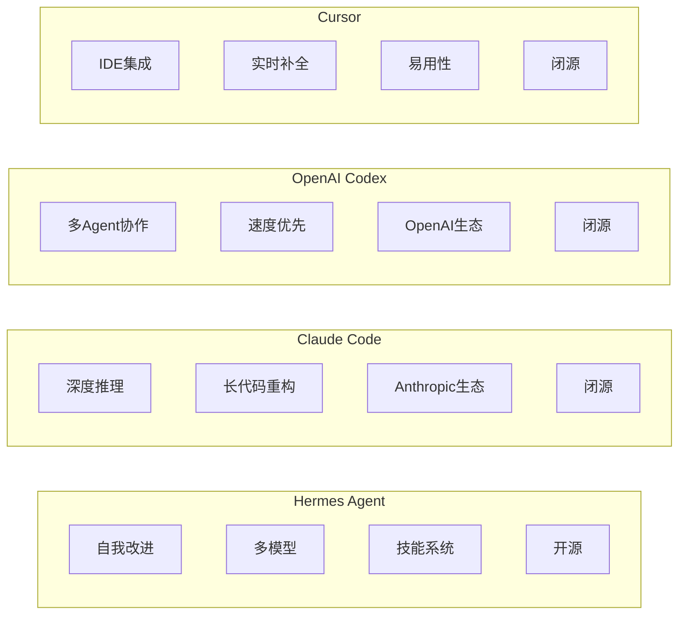

### 功能对比矩阵

| 功能特性 | Hermes Agent | Claude Code | OpenAI Codex | Cursor |
|----------|:------------:|:-----------:|:------------:|:------:|
| **自我改进** | ✅ | ❌ | ❌ | ❌ |
| **技能系统** | ✅ | ❌ | ❌ | ❌ |
| **多模型支持** | ✅ 200+ | ❌ 仅Claude | ❌ 仅OpenAI | ❌ 有限 |
| **开源** | ✅ MIT | ❌ | ❌ | ❌ |
| **跨平台消息** | ✅ 6平台 | ❌ | ❌ | ❌ |
| **Serverless** | ✅ | ❌ | ✅ | ❌ |
| **本地部署** | ✅ | ❌ | ❌ | ❌ |
| **记忆系统** | ✅ 完善 | ⚠️ 有限 | ⚠️ 有限 | ⚠️ 有限 |
| **任务调度** | ✅ Cron | ❌ | ❌ | ❌ |
| **用户建模** | ✅ Honcho | ❌ | ❌ | ❌ |

### 适用场景对比

| 场景 | 推荐选择 | 原因 |
|------|----------|------|
| **个人长期使用** | Hermes Agent | 自我改进，越用越懂你 |
| **企业私有部署** | Hermes Agent | 开源可控，数据安全 |
| **深度代码推理** | Claude Code | 复杂逻辑分析能力强 |
| **快速原型开发** | OpenAI Codex | 多Agent并行效率高 |
| **IDE日常编码** | Cursor | 集成体验最佳 |
| **研究实验** | Hermes Agent | RL训练支持完善 |

### 定价对比

| 产品 | 定价模式 | 成本估算 |
|------|----------|----------|
| **Hermes Agent** | 自带模型/按需付费 | $5 VPS 或 Serverless 按用量 |
| **Claude Code** | 订阅制 | $20/月 |
| **OpenAI Codex** | 订阅制 | $20/月 |
| **Cursor** | 订阅制 | $20/月 |

---

## 总结评价

### 优势分析

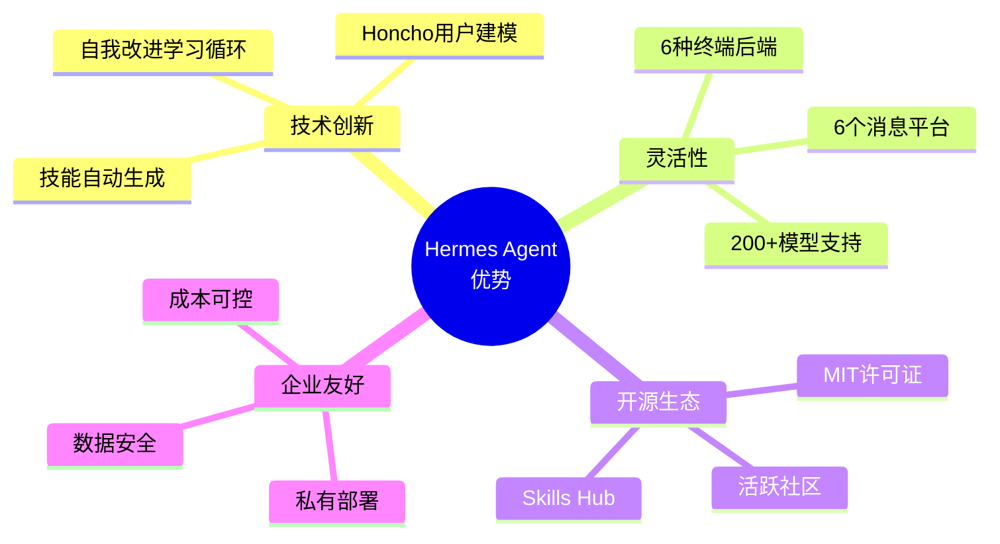

### 挑战与改进空间

| 方面 | 现状 | 改进建议 |
|------|------|----------|
| **文档** | 完善 | 增加更多示例 |
| **Issue处理** | 252个待处理 | 提高响应效率 |
| **测试覆盖** | 未知 | 建议公开测试报告 |
| **企业功能** | 基础 | 增加团队协作功能 |

### 综合评分

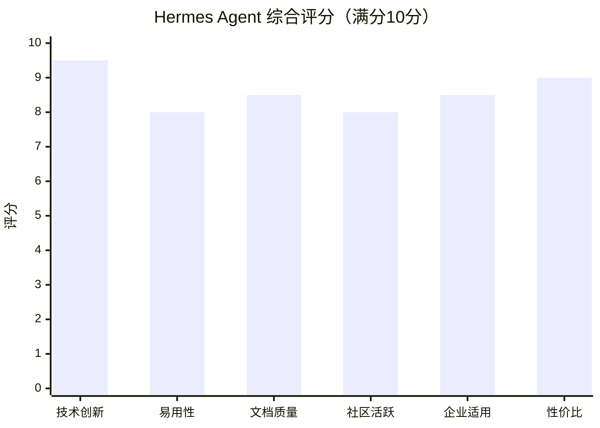

### 总体评价

**Hermes Agent 是一款极具创新性的 AI Agent 产品**，其核心优势在于：

1. **独特的学习循环**：自我改进能力使其在长期使用中价值不断提升
2. **开放的技术架构**：多模型、多平台、多终端的灵活支持
3. **活跃的开源社区**：99位贡献者，快速迭代更新
4. **企业级可用性**：支持私有部署，成本可控

**推荐使用场景**：
- 🎯 希望建立长期个人 AI 助手的用户
- 🎯 需要私有化部署的企业团队
- 🎯 AI Agent 研究人员和开发者
- 🎯 追求成本效益的技术爱好者

**项目成熟度**：⭐⭐⭐⭐ (4/5)

Hermes Agent 代表了 AI Agent 发展的新方向——从被动响应到主动学习，从工具到伙伴。随着项目的持续发展，有望成为 AI Agent 领域的重要基础设施。

---

## 附录

### 快速开始

```bash
# 安装
curl -fsSL https://raw.githubusercontent.com/NousResearch/hermes-agent/main/scripts/install.sh | bash

# 启动
source ~/.bashrc
hermes

# 配置模型
hermes model

# 启动消息网关
hermes gateway
```

### 相关链接

- 📖 [官方文档](https://hermes-agent.nousresearch.com/docs/)
- 💻 [GitHub 仓库](https://github.com/NousResearch/hermes-agent)
- 🎯 [Skills Hub](https://agentskills.io)
- 💬 [Discord 社区](https://discord.gg/NousResearch)
- 🏢 [Nous Research](https://nousresearch.com)

---

*本报告由 github-deep-research 自动生成*
