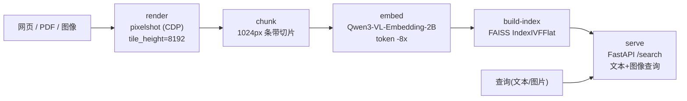

# StarTrail-org/PixelRAG 深度研究报告

> The end of web parsing. The beginning of scalable pixel-native search. —— 用 VLM 直接对"页面截图/文档图像"做检索，绕开传统 HTML/文本解析。PixelRAG 是 UC Berkeley SkyLab / BAIR / NLP Group 论文《PIXELRAG: Web Screenshots Beat Text for Retrieval-Augmented Generation》(arXiv:2606.28344) 的官方开源实现。

## 项目概述

PixelRAG 的核心命题是一句反直觉的口号——"**用文档"长什么样"来检索，而不只是它"写了什么"**"（README 原文 "Search any document by how it looks, not just the text it contains."）[README]。它把整个 RAG 的第一步从"把网页/PDF 解析成文本 chunk"改成"**把文档渲染成截图 tile，再直接在图像空间里检索**"。这样一来，传统文本 RAG 在 HTML 解析阶段会丢掉的视觉结构——表格、图表、版式、信息图——被完整保留，阅读模型（reader）因此能真正回答依赖这些结构的问题[README]。

这一定位精准踩中了 2026 年多模态检索领域最热的方向之一：**像素原生检索 / 视觉 RAG（pixel-native / vision-based retrieval）**。其思想脉络与 2024 年的 ColPali（用 VLM 对文档页图直接做后期交互检索）一脉相承，但 PixelRAG 把它推向了"**全网页规模**"——README 宣称其托管的 `https://api.pixelrag.ai` 已提供一个**预建的 8.28M 篇 Wikipedia 页面**索引，无需 setup、无需 API key，甚至可以用一张图片作为查询做视觉检索[README]。

一个对判断项目分量至关重要的事实：PixelRAG 并非无名之作，而是一篇 arXiv 论文（编号 2606.28344）的官方代码库[README]。作者阵容包括 Yichuan Wang、Zhifei Li（并列一作），以及 **Matei Zaharia、Joseph E. Gonzalez、Sewon Min** 三位并列指导——Matei Zaharia 是 Spark/Databricks 联合创始人、MLflow 主导者[README]。仓库的 `authors` 字段署名 "Zhifei Li"（邮箱 andylizf@outlook.com），而头号贡献者正是 `andylizf`[代码：pyproject.toml + API]。同组此前的明星项目 LEANN（低存储向量索引）已获 12618 Stars[API]，PixelRAG 可视为该团队在"视觉检索"方向的延伸。

项目主语言为 Python（按字节占比 74.2%），辅以 Markdown（15.96%，大量论文复现/工程文档）、TypeScript（6.77%，Next.js Web 前端）、Shell（1.65%）等[API：languages]。采用 Apache-2.0 协议，2026 年 5 月 29 日创建，截至 2026 年 7 月 1 日获 5722 Stars、452 Forks、8 名贡献者，最新版本 v0.3.0（2026-06-23）[API]——是一个诞生仅约一个月、以论文实现为内核、迅速冲上 GitHub Trending 的学术型开源项目。

---

## 基本信息

| 指标 | 数值 |
|------|------|
| Stars | 5722 |
| Forks | 452 |
| 开放 Issues（纯 Issue） | 13（已关闭 11） |
| 开放 Issues/PR（API open_issues 合计） | 31 |
| 已合并 PR | 56 |
| 语言 | Python（74.2%）+ Markdown（15.96%）+ TypeScript（6.77%）+ Shell/JS/CSS 等 |
| 开源协议 | Apache-2.0 |
| 创建时间 | 2026-05-29 |
| 最近推送 | 2026-06-30 |
| 默认分支 | main |
| 贡献者数 | 8 |
| 维护方 | UC Berkeley SkyLab / BAIR / NLP Group（论文官方实现）[README] |
| 论文 | arXiv:2606.28344 《Web Screenshots Beat Text for RAG》 |
| 发行渠道 | PyPI（`pixelrag`，含 `pixelshot` CLI）、Claude Code 插件市场、托管 API |
| 最新版本 | v0.3.0（2026-06-23） |
| 官网 | [https://pixelrag.ai](https://pixelrag.ai) |
| GitHub | [https://github.com/StarTrail-org/PixelRAG](https://github.com/StarTrail-org/PixelRAG) |
| Topics | agent, ai, memory, multimodal, rag, search, searchengine, vision, vlm |

---

## 技术分析

### 技术栈与工程分层

[代码：pyproject.toml]

PixelRAG 在包结构上做了刻意的"**分层与瘦核心**"设计。`pyproject.toml` 的 `[tool.hatch.build.targets.wheel].packages` 把仓库拆成五个独立源码包：`src/pixelrag`（umbrella）、`render/`、`embed/`、`index/`、`serve/`[代码]。核心依赖被刻意压到最轻——注释明确写道 "Core stays light — rendering / screenshots only (no torch)"，核心 `dependencies` 只含 `pillow / websockets / pymupdf / pyturbojpeg / cef-capi-py / anthropic`，**不含 torch**[代码]。重量级 ML 依赖全部下放到可选 extras：

- `embed`：`torch>=2.9.0`、`torchvision`、`transformers>=4.57.0`、`faiss-cpu>=1.9.0`
- `serve`：`fastapi` + `uvicorn` + `faiss-cpu` + `transformers` + `torch` + `qwen-vl-utils` + `pydantic`
- `index`：`pixelrag[embed]` + `pyyaml` + `markdown`
- `gpu`：`faiss-gpu-cu12>=1.13.2`（仅 Linux）
- 另有 `playwright / pdf / kiwix / distributed / eval` 等按需安装的 extra[代码]

`[project.scripts]` 暴露两个入口：`pixelshot = pixelrag_render.render:main`（截图捕获）与 `pixelrag = pixelrag.cli:main`（流水线总控）[代码]。这印证了 README 的说法——`pixelshot` 是一个独立、轻量、可单独用于给 Agent"配眼睛"的原语，而 `pixelrag <stage>` 才是完整流水线。

### 架构：render → chunk → embed → index → serve 五段流水线

PixelRAG 的检索流水线在代码里是**可枚举的五个 stage**。总控 CLI `src/pixelrag/cli.py` 用一个 `STAGES` 字典把子命令惰性映射到各自的包，找不到时打印清晰的安装提示[代码：cli.py]：

```python
STAGES = {
    "chunk": ("pixelrag_embed.chunk", "main", "pixelrag-embed", "embed"),
    "embed": ("pixelrag_embed.embed", "main", "pixelrag-embed", "embed"),
    "build-index": ("pixelrag_embed.index", "main", "pixelrag-embed", "embed"),
    "index": ("pixelrag_index.pipelines", "main", "pixelrag-index", "index"),
    "monitor": ("pixelrag_index.monitor", "main", "pixelrag-index", "index"),
    "serve": ("pixelrag_serve.api", "main", "pixelrag-serve", "serve"),
}
```

各段职责如下（均基于真实源码）：

**(1) render（截图捕获）**——`render/src/pixelrag_render/render.py` 的 `render_url()` 把 URL/PDF/本地文件渲染成 tile 图像，默认后端 `cdp`（headless Chromium 走 Chrome DevTools Protocol），关键默认参数为 `tile_height=8192`、`viewport_width=875`、`quality=85`[代码：render.py]。仓库甚至自带 `render/chrome-build/` 打补丁自编译的 headless Chromium（release 里有 `chrome-150.0.7844.0` 这个专门的构建 tag），说明团队为了截图吞吐量下沉到了浏览器构建层[API + 代码：tree]。

**(2) chunk（切片）**——`embed/src/pixelrag_embed/chunk.py` 把每张 8192px 的大 tile 预切成 `CHUNK_HEIGHT = 1024`px 高的条带（chunk），并写出 `chunks.json` manifest 记录每个 chunk 的 x/y 偏移与宽高；`MIN_CHUNK_HEIGHT = 28` 是"一个 Qwen3-VL patch"，用于把过小的尾部合并进上一块[代码：chunk.py]。它还用 MD5 tile hash 做变更检测以支持增量重切。

**(3) embed（向量化）**——`embed/src/pixelrag_embed/embed.py` 用 VLM 把 chunk 图像编码成向量。注释明确点出核心优化："Embedding chunks instead of full tiles reduces the visual token count ~8x, significantly improving throughput"[代码：embed.py]。图像会先经 `_smart_resize_pil()` 缩放，尺寸对齐到 28 的倍数（`_RESIZE_FACTOR = 28`，即 Qwen3-VL 的 patch 对齐），宽度上限 `_MAX_CHUNK_WIDTH = 875`[代码]。输出是 `.npz` 分片，字段包含 `embeddings(float16 [N,D])`、`article_ids`、`tile_indices`、`chunk_indices`、`y_offsets` 等，查找主键为 `(article_id, tile_index, chunk_index)`[代码]。

**(4) build-index（建索引）**——`embed/src/pixelrag_embed/index.py` 把所有 shard 的 `.npz` 合并，默认后端为 **FAISS `IndexIVFFlat`**（注释："ivf (default): FAISS IndexIVFFlat — fast build (~10 min)"），另支持 DiskANN[代码：index.py]。它用 numpy 向量化的方式做全局去重——把 `(article_id, tile, chunk)` 打包成单个 int64 键（`article_id * 1e8 + tile * 1e4 + chunk`）后 `np.unique`，避免 Python 循环[代码]。

**(5) serve（检索 API）**——`serve/src/pixelrag_serve/api.py` 用 FastAPI 暴露 `/search`。它加载 FAISS 索引（`faiss.read_index`），用 **Qwen3-VL-Embedding-2B**（transformers + SDPA attention）编码查询，**同时支持文本查询与图像查询、单条或批量**[代码：api.py]。检索核心逻辑：

```python
if req.articles_only:
    fetch_k = req.n_docs * 10
elif req.min_tile_height:
    fetch_k = req.n_docs * 5
else:
    fetch_k = req.n_docs
distances, indices = index.search(query_vectors, fetch_k)
```

即当需要过滤（只要正文页 / 限定 tile 高度）时**超额召回**再过滤，保证过滤后仍有足够结果[代码]。值得称道的一个工程细节：返回结果时它刻意用 `os.path.relpath` 把绝对 tile 路径转成相对路径，注释写明"avoids leaking the host's directory layout"——客户端只能通过 `/tile/{article_id}/{tile_index}/{chunk_index}` 拉图[代码]。



### 关键技术创新点

[README + 代码交叉验证]

- **像素原生检索**：整条链路不经过 HTML/文本解析，检索单元是"页面截图条带"，保留表格/图表/版式等视觉信息[README + 代码]。
- **LoRA 微调的 VLM 嵌入器**：以 `Qwen/Qwen3-VL-Embedding-2B` 为骨干，在 screenshot 数据上做 LoRA 微调，把页面图像嵌入到"视觉内容可检索"的空间；训练适配器与训练集均已开源在 Hugging Face[README]。
- **chunk 级嵌入降 8 倍 token**：把 8192px tile 预切为 1024px 条带再嵌入，是吞吐量优化的关键[代码：embed.py]。
- **托管全网页规模索引**：预建 8.28M 篇 Wikipedia 页面索引，提供免 key 的托管 `/search` API[README]。
- **给 Claude "配眼睛"**：`pixelshot` 作为 Claude Code 插件（pixelbrowse skill）发布，让 Claude 截图读页面而非抓 HTML，无需 MCP server[README + 代码：plugin/]。

---

## 社区活跃度

### 贡献者分析

项目共 8 名贡献者[API]，是典型的"**小型学术团队 + 少量外部 PR**"结构，贡献高度集中：

| 贡献者 | Commits（contributions） |
|--------|--------------------------|
| andylizf（Zhifei Li，论文并列一作） | 35 |
| yichuan-w（Yichuan Wang，论文并列一作） | 16 |
| MrTHROS | 1 |
| nadiadatepe-eng | 1 |
| dex0shubham | 1 |
| luojiyin1987 | 1 |

前两名（两位论文一作）合计贡献 51 次，占绝对主导，其余 6 人各 1 次——这与"团队化大厂项目"（如头部分布均衡的框架级项目）不同，更接近"研究团队自研 + 社区零星补丁"的形态[API]。这符合其"论文官方实现"的身份定位。

### Issue/PR 与量化提交信号

社区参与度对一个仅约一个月的新项目来说处于早期但真实：GitHub search API 报告**纯 Issue 开放 13、已关闭 11**（关闭率约 45.8%），**已合并 PR 共 56 个**；仓库 `open_issues_count`（含 PR）为 31[API：search + summary]。

提交曲线给出直接的"近期活跃"证据：`stats/commit_activity` 近 52 周中绝大部分为 0（仓库尚未创建），**最近 6 个自然周为 [1, 25, 11, 0, 18, 1]**[API：commit_activity]。可见项目在创建后经历了一波高强度提交（单周 25 次），随后节奏起伏（含一个 0 提交周），最新一周（截至 2026-06-30 的部分周）为 1 次。这是"论文放出后集中冲刺、之后转入维护 + 间歇迭代"的典型学术项目节奏，而非商业团队的持续高频推进。

### 传播渠道

配有独立官网 pixelrag.ai、状态页 status.pixelrag.ai、Slack 社区、Colab quickstart notebook、以及 Claude Code 插件市场入口，README 顶部挂有 CI / live demo / status / Slack / license 五个徽章——具备"研究项目产品化"的传播矩阵，但社群规模仍在早期[README]。

---

## 发展趋势

### 版本演进

仓库版本记录简洁但清晰[API：releases + tags]：

| 版本 | 发布时间 | 阶段 |
|------|----------|------|
| v0.3.0 | 2026-06-23 | 最新正式版 |
| chrome-150.0.7844.0 | 2026-06-01 | 专用 headless Chromium 构建 tag |
| v0.1.0 | 2026-05-31 | 首发版本 |

从 2026-05-29 创建到 2026-05-31 首发 v0.1.0 只隔两天，再到 6 月 23 日的 v0.3.0，一个月内走完 v0.1→v0.3[API]。特殊的 `chrome-150.0.7844.0` tag 说明团队把"自编译打补丁的 headless Chromium"当作一等交付物，用于提升截图吞吐——这是纯文本 RAG 项目不会有的工程投入[API + 代码]。

### 演进方向

结合代码与 README，三条主线清晰：**(1) 规模化托管**——把 8.28M Wikipedia 页面的预建索引做成免 key 的公开 API，降低尝鲜门槛，是"论文 → 可用产品"的关键一跳[README]；**(2) 生态嵌入**——通过 Claude Code 插件（pixelbrowse）把 `pixelshot` 变成 Agent 的"眼睛"，切入 coding agent 生态[README + 代码]；**(3) 多源接入**——`index/src/pixelrag_index/sources/` 下已有 `web.py / pdf.py / local.py / kiwix.py` 多种数据源适配器，朝"通用文档视觉检索管线"扩展[代码：tree]。当前版本号仍是 0.x（v0.3.0），处于早期迭代阶段，API 与索引格式可能仍会变动[推测：基于 0.x 版本号]。

### 学术与工程双轨背景

[推测] 从论文一作/指导阵容（Matei Zaharia、Joseph Gonzalez、Sewon Min）、Berkeley SkyLab/BAIR/NLP 的机构背书、以及同团队 LEANN 已积累 12618 Stars 来看，PixelRAG 更像一个**由顶尖学术实验室发起、意图定义"视觉 RAG"这一新范式的旗舰开源项目**。其商业化路径尚不明确（Apache-2.0 开源 + 托管 API），此为基于作者身份与项目形态的推断，仓库未显式声明商业计划。

---

## 竞品对比

| 项目 | Stars | 语言 | 协议 | 最近推送 | 特点 |
|------|-------|------|------|----------|------|
| [StarTrail-org/PixelRAG](https://github.com/StarTrail-org/PixelRAG) | 5722 | Python | Apache-2.0 | 2026-06-30 | 本项目；像素原生检索，render→embed→index→serve 全链路 + 托管 8.28M 页索引 |
| [illuin-tech/colpali](https://github.com/illuin-tech/colpali) | 2679 | Python | MIT | 2026-06-10 | 视觉 RAG 开山之作，VLM 对文档页图做后期交互（late-interaction）检索 |
| [AnswerDotAI/byaldi](https://github.com/AnswerDotAI/byaldi) | 850 | Python | Apache-2.0 | 2025-01-28 | ColPali 的高层封装库，让多向量视觉检索易于上手 |
| [infiniflow/ragflow](https://github.com/infiniflow/ragflow) | 83987 | Go | Apache-2.0 | 2026-07-01 | 深度文档理解型 RAG 引擎，走 OCR/布局解析路线（文本派代表） |
| [microsoft/markitdown](https://github.com/microsoft/markitdown) | 161822 | Python | MIT | 2026-06-24 | 把各类文档转成 Markdown 文本喂给 LLM，是"解析为文本"路线的典型对立面 |
| [StarTrail-org/LEANN](https://github.com/StarTrail-org/LEANN) | 12618 | Python | MIT | 2026-06-29 | 同团队前作，低存储向量索引，PixelRAG 的技术传承来源 |

[竞品 stars/协议/语言/最近推送均为 `gh` 实测，2026-07-01]

**定位差异**：colpali/byaldi 是与 PixelRAG **最同源**的对手——同属"用 VLM 对文档页图直接检索"的视觉 RAG 路线；但 colpali 侧重"多向量后期交互"的检索方法与模型，PixelRAG 则把范围扩到"**全网页渲染 + 单向量 FAISS 大规模检索 + 托管 API**"这一端到端工程系统，并额外提供了自编译 Chromium 截图管线与 8.28M 页预建索引[代码/README]。而 ragflow/markitdown 代表的是**对立路线**——它们仍把文档"解析成文本/Markdown"再检索，正是 PixelRAG README 里点名要终结的 "web parsing"。LEANN 则是同团队前作，PixelRAG 承接了其向量检索的工程积累。代价是 PixelRAG 起步最晚、星数尚不及 ragflow/markitdown 等成熟项目，生态与稳定性仍在早期（5722 vs ragflow 83987）。

---

## 总结评价

### 优势

1. **范式新颖、代码可支撑**："像素原生检索"不是口号——`render→chunk→embed→index→serve` 五段流水线在代码里逐一可查，检索单元确实是页面截图条带，绕开了 HTML 解析[代码]。
2. **工程完整度高**：从自编译 headless Chromium（截图吞吐）、chunk 级嵌入降 8 倍 token、FAISS IVF 索引 + 向量化去重，到 FastAPI 检索服务，端到端可跑且有性能优化痕迹[代码]。
3. **学术背书强**：论文一作/指导含 Matei Zaharia、Joseph Gonzalez、Sewon Min，出自 Berkeley SkyLab/BAIR/NLP，方法有 arXiv 论文支撑[README]。
4. **上手门槛低**：提供免 key 的托管 8.28M 页 Wikipedia 索引与 Colab notebook，`pip install pixelrag` 即可用 `pixelshot`；还做成 Claude Code 插件切入 Agent 生态[README]。
5. **模型与数据开源**：LoRA 适配器、训练集、数据合成管线均已公开，便于社区在其他骨干上复现[README]。

### 劣势

1. **仍是 0.x 早期阶段**：v0.3.0、创建仅约一个月，API 与索引格式可能变动，生产采用需承担迭代风险[推测：0.x 版本号]。
2. **贡献者集中、Bus factor 低**：8 名贡献者中两位一作贡献 51 次占绝对主导，社区尚未形成规模化协作[API]。
3. **算力与依赖较重**：完整链路依赖 GPU + torch + transformers + FAISS，自建索引成本高（README 提到单个预建索引约 217G）；`pixelshot` 之外的重活并不"轻量"[代码/README]。
4. **视觉检索的固有权衡**：截图检索对纯文本精确匹配、可复制文本、无障碍访问等场景未必优于文本 RAG，其"视觉优于文本"的结论依赖论文特定基准[推测]。
5. **生态后发**：星数与社区积累落后 ragflow/markitdown 等成熟 RAG 项目，第三方集成仍少[API]。

### 适用场景

- **强视觉结构文档的检索/问答**：表格密集、图表为主、版式复杂的网页/PDF/信息图，文本解析会丢信息的场景。
- **给 coding agent"配眼睛"**：希望 Claude 等 Agent 直接"看"页面（图表/布局）而非抓 HTML 的用户，直接用 `pixelshot` 插件。
- **研究与复现**：想在视觉 RAG 方向做实验、复现论文、或在其他 VLM 骨干上微调的研究者。
- **快速尝鲜**：想零配置体验"用图检索 Wikipedia"的开发者，直接打托管 API。
- **不适合**：追求稳定冻结 API 的生产系统、纯文本精确检索需求、或缺乏 GPU 又要自建大规模索引的团队。

---

*报告生成时间: 2026-07-01*
*研究方法: github-deep-research 多轮深度研究*
