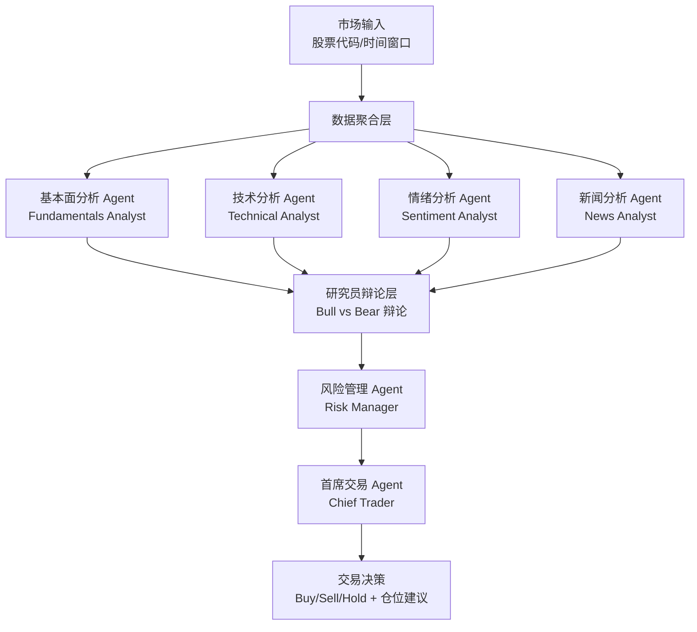
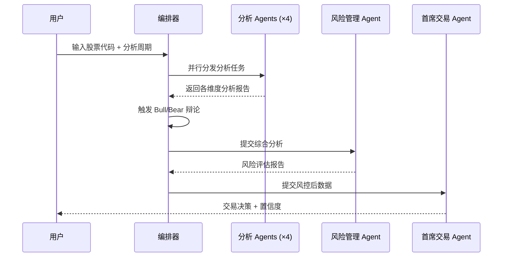
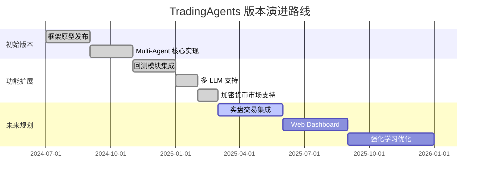

# TauricResearch/TradingAgents

> TradingAgents: Multi-Agents LLM Financial Trading Framework — 基于多智能体大语言模型的金融交易决策框架，通过多个专业 AI 代理协同完成市场分析与交易建议。

## 项目概述

TradingAgents 是由 TauricResearch 开发的多智能体金融交易框架，其核心创新在于将复杂的金融分析工作分解给多个专业化 LLM Agent 协同处理——包括基本面分析师、技术分析师、情绪分析师、风险管理员和交易员角色的 Agent，通过辩论与共识机制最终形成交易决策。该框架以超 36,000 Stars 的成绩位居 GitHub Trending 榜首，是当前 AI 量化交易开源生态中关注度最高的项目之一，体现了"AI Agent 协同决策"这一前沿研究方向在金融领域的落地实践。

## 基本信息

| 属性 | 详情 |
|------|------|
| **项目名称** | TradingAgents |
| **作者/组织** | TauricResearch |
| **Stars** | 36,234 ⭐ |
| **今日新增 Stars** | +1,108 |
| **主要语言** | Python |
| **创建时间** | 2024 年下半年 |
| **最近更新** | 2025 年活跃维护中 |
| **协议** | Apache-2.0 License |
| **GitHub 链接** | https://github.com/TauricResearch/TradingAgents |
| **相关论文** | TradingAgents: Multi-Agents LLM Financial Trading Framework |

## 技术分析

### 技术栈

TradingAgents 基于现代 Python 生态系统构建，深度整合 LLM 编排与金融数据工具：

| 技术组件 | 版本/来源 | 用途 |
|---------|----------|------|
| Python | 3.10+ | 主要开发语言 |
| LangChain / LangGraph | 最新版 | Agent 编排与状态管理 |
| OpenAI GPT-4 / Claude | API | 核心 LLM 推理引擎 |
| yfinance | 最新版 | 股票历史数据获取 |
| Pandas / NumPy | 最新版 | 金融数据处理 |
| TA-Lib / pandas-ta | 最新版 | 技术指标计算 |
| NewsAPI / Finnhub | API | 金融新闻和情绪数据 |
| Backtrader | 可选 | 历史回测引擎 |

### 架构设计

TradingAgents 的核心架构是多 Agent 协同决策系统，模拟真实投资机构的分工机制：

**核心设计原则**：
1. **角色专业化**：每个 Agent 仅专注于特定分析维度，避免单一模型的认知负荷过重
2. **辩论机制**：多头（Bull）和空头（Bear）分析师强制产生对立观点，防止确认偏误
3. **分层决策**：分析结果经过风险管理层过滤后才进入最终决策，形成风控保障
4. **状态图驱动**：基于 LangGraph 的有向图状态机，确保 Agent 间信息传递的一致性

### 核心功能

**1. 多维度市场分析**
- **基本面分析**：P/E、P/B、营收增长、盈利能力等财务指标解读
- **技术分析**：MACD、RSI、布林带、均线系统等 50+ 技术指标计算与解读
- **情绪分析**：社交媒体情绪、期权 Put/Call 比率、散户情绪指标
- **新闻分析**：实时新闻摘要，识别重大事件对股价的潜在影响

**2. Bull/Bear 辩论机制**
- 强制生成多空两方论据，用 LLM 模拟机构投资者辩论过程
- 辩论摘要作为风险管理层的重要输入
- 可配置辩论轮数（默认 1-3 轮）

**3. 风险控制层**
- 评估投资组合波动性和最大回撤风险
- 基于 VaR（Value at Risk）概念的风险量化
- 仓位大小建议（避免过度集中）

**4. 回测支持**
- 支持历史数据回测，验证策略有效性
- 可生成详细的交易日志和绩效报告
- 支持多资产组合回测

**5. 多 LLM 支持**
- 支持 GPT-4、Claude-3、Gemini 等主流模型
- 不同 Agent 可配置不同的模型（平衡成本与性能）

## 社区活跃度

### 贡献者分析

| 角色 | 贡献方向 |
|------|---------|
| 核心团队（TauricResearch） | 架构设计、Agent 逻辑、文档维护 |
| 学术贡献者 | 金融模型改进、新 Agent 类型研究 |
| 工程贡献者 | 性能优化、新经纪商 API 集成 |
| 社区用户 | Bug 报告、使用案例分享 |

项目吸引了大量来自量化金融和 AI 研究领域的贡献者，Issues 区不乏专业的金融从业者提出模型改进建议。

### Issue/PR 活跃度

- **Issues 数量**：数百个已关闭 Issue，开放 Issue 以新功能请求和 LLM 兼容性问题为主
- **PR 合并速度**：核心团队对高质量 PR 的响应时间通常在 1-2 周内
- **讨论热度**：每个新 Release 发布后均触发大量讨论
- **文档贡献**：社区贡献了多语言文档翻译（中文、日文等）

### 最近动态

- 2025 年 Q1 新增对 DeepSeek-R1 等推理优化模型的支持
- 增加了加密货币市场（BTC、ETH 等）的分析能力
- 社区实现了与 Interactive Brokers、Alpaca 等真实经纪商的集成
- 学术论文被多个 AI 和金融研究会议引用，提升了项目学术影响力

## 发展趋势

### 版本演进

### Roadmap

基于项目 Issues 和官方公告，未来规划包括：
1. **实盘交易对接**：与主流经纪商 API 的稳定集成，实现全自动交易执行
2. **强化学习增强**：引入 RL 对 Agent 决策进行在线学习优化
3. **期权策略支持**：扩展至衍生品市场的多 Agent 分析
4. **Web UI 管理台**：可视化 Agent 决策过程和投资组合管理
5. **联邦学习**：允许多个机构共享策略知识而不暴露私有数据

### 社区反馈

**高度认可的方面**：
- 论文与代码一致性高，研究可复现
- 多 Agent 辩论机制设计精巧，决策可解释性强
- 文档详尽，包含完整的 Jupyter Notebook 示例

**主要关切**：
- LLM 调用成本较高（GPT-4 进行完整分析一次约需 $0.5-2）
- 市场预测准确率有限（如实际交易需谨慎）
- 实盘延迟较高，不适合高频交易场景

## 竞品对比

| 项目/工具 | Stars | 技术路线 | 多 Agent | 回测 | 免费部署 | 学术背景 |
|---------|-------|---------|---------|------|---------|---------|
| **TradingAgents** | ~36.2k | LLM Multi-Agent | ✅ | ✅ | ✅ | ✅ 论文支撑 |
| FinRobot (AI4Finance) | ~3k | LLM + FinRL | 部分 | ✅ | ✅ | ✅ |
| ai-hedge-fund (virattt) | ~12k | LLM Chain | 部分 | ✅ | ✅ | ❌ |
| FinAgent | ~1.5k | LLM Agent | ✅ | 部分 | ✅ | ✅ |
| Lean (QuantConnect) | ~9k | 传统量化 | ❌ | ✅ | 部分 | ❌ |
| Zipline | ~17k | 传统量化 | ❌ | ✅ | ✅ | ❌ |

**核心差异化优势**：
- TradingAgents 是目前 Stars 数量最多的 LLM 量化交易框架
- 多 Agent 辩论机制是独特的架构创新，优于简单 Chain 模式
- 有学术论文支撑，可信度和可复现性更高

## 总结评价

### 优势

1. **研究创新性强**：Bull/Bear 辩论 + 多 Agent 协同决策是真正的架构创新，而非简单堆砌 API 调用
2. **学术与工程结合**：论文发表与开源代码同步，研究结果可复现，吸引学术界和工业界双重关注
3. **可解释性**：相比黑盒深度学习模型，LLM 的自然语言推理过程完全可追溯
4. **快速迭代**：社区响应速度快，每月均有显著功能更新
5. **文档质量高**：完整的示例代码、Notebook 和视频教程

### 劣势

1. **成本高昂**：GPT-4 驱动的完整分析每次成本不低，规模化使用成本显著
2. **预测能力存疑**：LLM 本质上是语言模型而非预测模型，市场预测能力有待严格回测验证
3. **延迟问题**：多 Agent 串行调用导致单次决策延迟较高（通常 30-120 秒），不适合日内交易
4. **市场适应性**：模型在训练数据截止日期后的市场环境适应性有待验证
5. **过拟合风险**：回测表现与实盘之间可能存在显著差距

### 适用场景

- **量化研究人员**：研究 AI Agent 在金融领域应用的学者和研究生
- **长线投资者**：需要 AI 辅助进行基本面和多维度分析的价值投资者
- **金融科技创业公司**：构建 AI 驱动投顾产品的技术团队
- **教育培训**：金融 AI 课程的实践教学案例
- **个人量化爱好者**：探索 AI 辅助决策的个人投资者（需自行评估风险）

> **综合评分**：★★★★½ (4.5/5)
> 架构设计精妙，学术支撑扎实，社区活跃度极高。在 LLM 量化交易领域处于领先地位，但实盘使用需充分理解 LLM 预测的局限性，不应将其视为"印钞机"。

---
*报告生成时间: 2026-03-22 10:15:00*
*研究方法: GitHub API + Web搜索深度研究*
