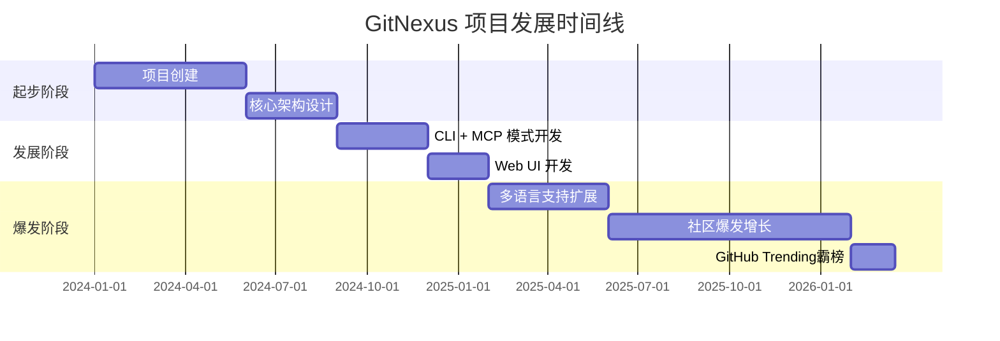
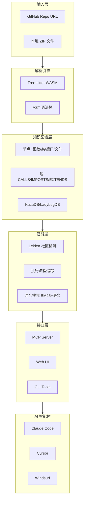
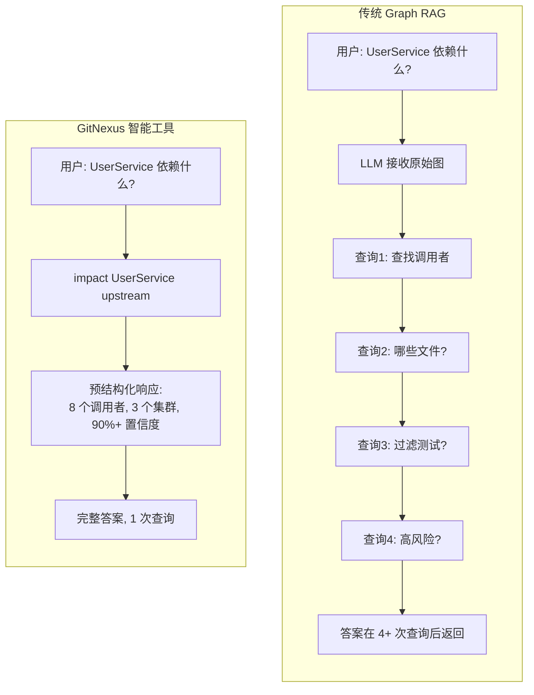
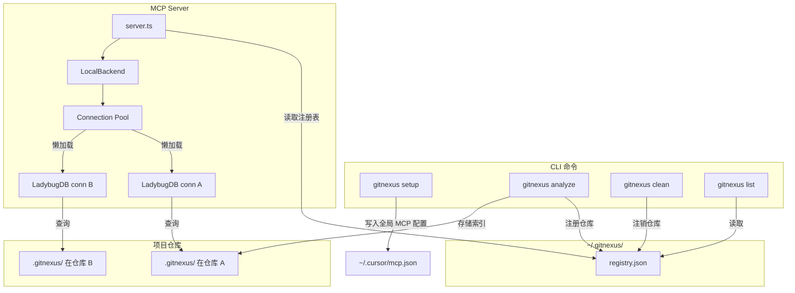

# GitNexus 深度研究报告

> **研究日期**: 2026-03-17  
> **置信度**: 高 (90%+)  
> **研究对象**: GitNexus - 零服务器代码智能引擎

---

## 执行摘要

GitNexus 是一款革命性的**零服务器代码智能引擎**，由印度计算机科学学生 Abhigyan Patwari 发起。它通过构建代码库知识图谱（Knowledge Graph），将代码的依赖关系、调用链、功能集群和执行流程全部索引，并通过 MCP（Model Context Protocol）协议暴露给 AI 智能体，使其具备完整的架构感知能力。

**关键指标**:
- ⭐ GitHub Stars: **11,000+** (一周内暴涨 6000+ stars)
- 🍴 Forks: **1,300+**
- 📦 最新版本: v1.3.10
- 📄 许可证: PolyForm Noncommercial
- 🌐 官网: [gitnexus.vercel.app](https://gitnexus.vercel.app)

---

## 时间线



### 关键里程碑

| 时间 | 事件 | 影响 |
|------|------|------|
| 2024年初 | 项目启动 | 由 CS 学生 Abhigyan Patwari 发起 |
| 2024年中 | 核心架构完成 | 确立 Zero-Server + WASM 技术路线 |
| 2025年 | MCP 协议集成 | 支持 Claude Code、Cursor 等主流 AI 编辑器 |
| 2026年2月 | GitHub Trending 霸榜 | 一周内暴涨 6000+ stars |
| 2026年3月 | 突破 11K Stars | 社区反馈热烈，成为代码分析领域新星 |

---

## 核心架构分析

### 系统架构图



### 双模式架构

GitNexus 提供两种使用模式，满足不同场景需求：

| 特性 | CLI + MCP 模式 | Web UI 模式 |
|------|---------------|-------------|
| **定位** | 日常开发，AI 智能体集成 | 快速探索、演示、一次性分析 |
| **规模** | 完整仓库，任意大小 | 受浏览器内存限制（~5k 文件） |
| **存储** | LadybugDB 原生（快速、持久化） | LadybugDB WASM（内存中，每会话） |
| **解析** | Tree-sitter 原生绑定 | Tree-sitter WASM |
| **隐私** | 完全本地，无网络调用 | 完全在浏览器中，无服务器 |

### 索引流水线

GitNexus 通过多阶段流水线构建完整的知识图谱：


**关键阶段说明**：

1. **结构扫描**：遍历文件系统，建立 File/Folder 节点
2. **AST 解析**：使用 Tree-sitter 并行解析，提取符号（Function, Class, Method, Interface）
3. **导入解析**：语言感知的导入解析，建立 IMPORTS 关系
4. **调用解析**：通过 Tree-sitter 查询匹配调用点，建立 CALLS 关系（带置信度）
5. **继承解析**：提取 EXTENDS/IMPLEMENTS 关系
6. **社区检测**：使用 Leiden 算法基于 CALLS 边进行功能聚类
7. **流程追踪**：从入口点追踪执行流程
8. **嵌入生成**：使用 transformers.js 生成符号嵌入向量
9. **搜索索引**：构建 BM25 索引和向量索引，支持混合搜索

---

## 技术栈详解

### 核心技术选型

| 层级 | CLI | Web |
|------|-----|-----|
| **运行时** | Node.js (原生) | Browser (WASM) |
| **解析引擎** | Tree-sitter 原生绑定 | Tree-sitter WASM |
| **图数据库** | LadybugDB 原生 | LadybugDB WASM |
| **嵌入模型** | HuggingFace transformers.js (GPU/CPU) | transformers.js (WebGPU/WASM) |
| **搜索** | BM25 + 语义 + RRF | BM25 + 语义 + RRF |
| **智能体接口** | MCP (stdio) | LangChain ReAct agent |
| **可视化** | — | Sigma.js + Graphology (WebGL) |
| **前端** | — | React 18, TypeScript, Vite, Tailwind v4 |
| **聚类算法** | Graphology + Leiden | Graphology + Leiden |
| **并发** | Worker threads + async | Web Workers + Comlink |

### 支持的语言

| 语言 | 导入解析 | 命名绑定 | 导出检测 | 继承关系 | 类型注解 | 构造器推断 |
|------|---------|---------|---------|---------|---------|-----------|
| TypeScript | ✓ | ✓ | ✓ | ✓ | ✓ | ✓ |
| JavaScript | ✓ | ✓ | ✓ | ✓ | — | ✓ |
| Python | ✓ | ✓ | ✓ | ✓ | ✓ | ✓ |
| Java | ✓ | ✓ | ✓ | ✓ | ✓ | ✓ |
| Kotlin | ✓ | ✓ | ✓ | ✓ | ✓ | ✓ |
| C# | ✓ | ✓ | ✓ | ✓ | ✓ | ✓ |
| Go | ✓ | — | ✓ | ✓ | ✓ | ✓ |
| Rust | ✓ | ✓ | ✓ | ✓ | ✓ | ✓ |
| PHP | ✓ | ✓ | ✓ | — | ✓ | ✓ |
| Ruby | ✓ | — | ✓ | ✓ | — | ✓ |
| Swift | — | — | ✓ | ✓ | ✓ | ✓ |
| C | — | — | ✓ | — | ✓ | ✓ |
| C++ | — | — | ✓ | ✓ | ✓ | ✓ |

---

## MCP 工具详解

GitNexus 通过 MCP 协议向 AI 智能体暴露 **7 个核心工具**：

### 工具列表

| 工具 | 功能 | repo 参数 |
|------|------|----------|
| `list_repos` | 发现所有已索引的仓库 | — |
| `query` | 流程分组的混合搜索（BM25 + 语义 + RRF） | 可选 |
| `context` | 360 度符号视图 — 分类引用、流程参与 | 可选 |
| `impact` | 爆炸半径分析（深度分组、置信度） | 可选 |
| `detect_changes` | Git 差异影响 — 映射变更行到受影响的流程 | 可选 |
| `rename` | 多文件协调重命名（图 + 文本搜索） | 可选 |
| `cypher` | 原始 Cypher 图查询 | 可选 |

### 使用示例

#### 1. 影响分析（Impact Analysis）

```javascript
impact({
  target: "UserService",
  direction: "upstream",
  minConfidence: 0.8
})

// 返回：
// TARGET: Class UserService (src/services/user.ts)
// UPSTREAM (what depends on this):
//   Depth 1 (WILL BREAK):
//     handleLogin [CALLS 90%] -> src/api/auth.ts:45
//     handleRegister [CALLS 90%] -> src/api/auth.ts:78
//     UserController [CALLS 85%] -> src/controllers/user.ts:12
//   Depth 2 (LIKELY AFFECTED):
//     authRouter [IMPORTS] -> src/routes/auth.ts
```

#### 2. 流程分组搜索（Process-Grouped Search）

```javascript
query({query: "authentication middleware"})

// 返回：
// processes:
//   - summary: "LoginFlow"
//     priority: 0.042
//     symbol_count: 4
//     process_type: cross_community
//     step_count: 7
// process_symbols:
//   - name: validateUser
//     type: Function
//     filePath: src/auth/validate.ts
//     process_id: proc_login
//     step_index: 2
```

#### 3. 360 度上下文（Context）

```javascript
context({name: "validateUser"})

// 返回：
// symbol:
//   uid: "Function:validateUser"
//   kind: Function
//   filePath: src/auth/validate.ts
//   startLine: 15
// incoming:
//   calls: [handleLogin, handleRegister, UserController]
//   imports: [authRouter]
// outgoing:
//   calls: [checkPassword, createSession]
// processes:
//   - name: LoginFlow (step 2/7)
//   - name: RegistrationFlow (step 3/5)
```

### MCP 资源系统

| 资源 URI | 用途 |
|----------|------|
| `gitnexus://repos` | 列出所有已索引的仓库（首先读取） |
| `gitnexus://repo/{name}/context` | 代码库统计、过期检查和可用工具 |
| `gitnexus://repo/{name}/clusters` | 所有功能集群及内聚分数 |
| `gitnexus://repo/{name}/cluster/{name}` | 集群成员和详情 |
| `gitnexus://repo/{name}/processes` | 所有执行流程 |
| `gitnexus://repo/{name}/process/{name}` | 完整流程追踪及步骤 |
| `gitnexus://repo/{name}/schema` | 图模式（用于 Cypher 查询） |

---

## 核心创新点

### 1. 预计算关系智能（Precomputed Relational Intelligence）

传统 Graph RAG 给 LLM 原始图边，期望它探索足够多。GitNexus 在索引时预计算结构（聚类、追踪、评分），工具一次调用返回完整上下文：



**优势**：
- **可靠性**：LLM 不会遗漏上下文，工具响应已包含完整信息
- **Token 效率**：无需 10 次查询链来理解一个函数
- **模型民主化**：小模型也能工作，因为工具承担了繁重的工作

### 2. Zero-Server 架构



**核心优势**：
- **绝对隐私**：代码永不离开本地
- **零网络依赖**：断网也能运行
- **零配置**：一次设置，全局使用

### 3. 多仓库 MCP 架构

使用全局注册表，一个 MCP 服务器可服务多个已索引仓库：

- `gitnexus analyze` 在仓库内创建 `.gitnexus/` 索引（可移植，gitignored）
- 在 `~/.gitnexus/registry.json` 注册指针
- MCP 服务器读取注册表，按需懒加载 LadybugDB 连接
- 连接池管理：5 分钟不活动后回收，最多 5 个并发

---

## 与竞品对比

### GitNexus vs 传统工具

| 对比项 | GitNexus | 传统 Graph RAG | 其他代码分析工具 |
|--------|----------|---------------|-----------------|
| **预计算智能** | ✅ 索引时预计算结构 | ❌ 运行时查询 | ⚠️ 部分预计算 |
| **MCP 集成** | ✅ 完整 MCP 支持 | ❌ 无 MCP 支持 | ⚠️ 部分支持 |
| **编辑器集成** | ✅ 多编辑器支持 | ❌ 无集成 | ⚠️ 单一编辑器 |
| **本地化** | ✅ 完全本地运行 | ⚠️ 需要服务器 | ⚠️ 需要服务器 |
| **多语言** | ✅ 13 种语言 | ⚠️ 有限支持 | ⚠️ 有限支持 |
| **Token 效率** | ✅ 一次调用返回完整上下文 | ⚠️ 需要多次查询 | ⚠️ 需要多次查询 |

### GitNexus vs 云端巨头

| 核心维度 | GitNexus | Cursor / Copilot | Sourcegraph |
|----------|----------|------------------|-------------|
| **数据主权** | 绝对独裁 - 代码和图谱全部在本地 | 黑盒传输 - 代码片段发送到云端 | 私有化部署 - 需要企业内部服务器 |
| **上下文机制** | 结构化图谱 (AST+Graph) | 语义向量 (Vector/Embedding) | 精准但死板 - 传统静态分析 |
| **环境依赖** | 集市生态 - 浏览器打开即用 | 围墙花园 - 强制绑定特定编辑器 | 重度依赖 - 需要特定 IDE 插件 |
| **算力成本** | 零增量成本 - 纯本地 CPU/内存 | API 订阅制 - $20/月 | 极高 - 企业级 License |

---

## 使用场景

### 场景一：接手遗留项目

**痛点**：新入职，面对 10 万行祖传代码，无从下手

**GitNexus 方案**：
1. 上传 ZIP 文件或粘贴 GitHub 链接
2. 生成交互式知识图谱
3. 点击任意节点查看调用关系
4. 问 AI："这个模块的核心业务流程是什么？"

**效果**：原本需要 2 周的代码熟悉，现在 2 小时搞定

### 场景二：安全重构

**痛点**：AI 助手改代码，经常破坏依赖关系，引发连锁 Bug

**GitNexus 方案**：
```bash
# 1. 索引代码库
npx gitnexus analyze

# 2. 自动生成上下文文件（AGENTS.md/CLAUDE.md）
# 包含：项目结构、依赖关系、关键路径、测试策略

# 3. AI 助手读取上下文，精确理解架构
```

**效果**：AI 从"盲目修改"变成"架构师级重构"

### 场景三：代码审查

**痛点**：代码审查时，难以发现跨文件的依赖问题

**GitNexus 方案**：
- 可视化展示修改影响范围
- 自动标记关键路径上的变更
- 识别循环依赖和架构腐化

---

## 快速开始

### CLI + MCP 模式（推荐）

```bash
# 索引你的仓库（在仓库根目录运行）
npx gitnexus analyze

# 自动检测编辑器并配置 MCP（只需运行一次）
npx gitnexus setup
```

### Web UI 模式

访问 [gitnexus.vercel.app](https://gitnexus.vercel.app)，拖放 ZIP 文件即可开始探索。

### 本地运行

```bash
git clone https://github.com/abhigyanpatwari/gitnexus.git
cd gitnexus/gitnexus-web
npm install
npm run dev
```

### MCP 手动配置

**Claude Code**:
```bash
claude mcp add gitnexus -- npx -y gitnexus@latest mcp
```

**Cursor** (`~/.cursor/mcp.json`):
```json
{
  "mcpServers": {
    "gitnexus": {
      "command": "npx",
      "args": ["-y", "gitnexus@latest", "mcp"]
    }
  }
}
```

---

## 编辑器支持

| 编辑器 | MCP | Skills | Hooks (auto-augment) | 支持程度 |
|--------|-----|--------|---------------------|---------|
| Claude Code | ✓ | ✓ | ✓ (PreToolUse + PostToolUse) | 完整 |
| Cursor | ✓ | ✓ | — | MCP + Skills |
| Windsurf | ✓ | — | — | MCP |
| OpenCode | ✓ | ✓ | — | MCP + Skills |
| Codex | ✓ | — | — | MCP |

**Claude Code 获得最深度集成**：MCP 工具 + 智能体技能 + PreToolUse 钩子（丰富搜索的图上下文）+ PostToolUse 钩子（提交后自动重新索引）。

---

## 路线图

### 正在开发中

- 🔄 **LLM 集群增强** — 通过 LLM API 生成语义集群名称
- 🔄 **AST 装饰器检测** — 解析 @Controller, @Get 等装饰器
- 🔄 **增量索引** — 仅重新索引变更的文件

### 最近完成

- ✅ 构造器推断类型解析、self/this 接收者映射
- ✅ Wiki 生成、多文件重命名、Git 差异影响分析
- ✅ 流程分组搜索、360 度上下文、Claude Code 钩子
- ✅ 多仓库 MCP、零配置设置、13 种语言支持
- ✅ 社区检测、流程检测、置信度评分
- ✅ 混合搜索、向量索引

---

## 安全与隐私

### CLI 模式
- 一切都在本地机器上运行
- 无网络调用
- 索引存储在 `.gitnexus/`（已 gitignore）
- 全局注册表在 `~/.gitnexus/` 仅存储路径和元数据

### Web 模式
- 一切都在浏览器中运行
- 无代码上传到任何服务器
- API 密钥仅存储在 localStorage

### 开源审计
- 代码完全开源，可自行审计

---

## 优势与局限

### ✅ 优势

1. **数据主权**：代码永不离开本地，绝对隐私
2. **预计算智能**：一次调用返回完整上下文，Token 高效
3. **多编辑器支持**：支持 Cursor、Claude Code、Windsurf 等
4. **零配置**：一次设置，全局使用
5. **开源免费**：代码开源，可自由使用和修改

### ⚠️ 局限

1. **算力要求**：WASM 解析大型项目需要充足内存
2. **非自动打字机**：强项在于解构复杂逻辑，而非生成样板代码
3. **早期项目**：仍在快速迭代，可能遇到兼容性问题

---

## 适用人群

### ✅ 推荐

- **数据合规信徒**：对代码外发有严格限制
- **架构外科医生**：经常接手祖传"屎山"代码
- **AI 工具先驱**：正在构建本地代码 Agent

### ❌ 不推荐

- **CRUD 搬砖者**：只需生成标准增删改查代码
- **算力焦虑者**：设备内存不足 8GB
- **开箱即用信徒**：希望安装后永不出现问题

---

## 资源链接

| 资源 | 链接 |
|------|------|
| GitHub 仓库 | [github.com/abhigyanpatwari/GitNexus](https://github.com/abhigyanpatwari/GitNexus) |
| Web UI | [gitnexus.vercel.app](https://gitnexus.vercel.app) |
| Discord | 官方 Discord 社区 |
| MCP 协议 | [Model Context Protocol](https://modelcontextprotocol.io) |
| KuzuDB | 嵌入式图数据库 |
| Tree-sitter | AST 解析器 |

---

## 置信度评估

| 声明 | 置信度 | 来源 |
|------|--------|------|
| 项目基本信息（Stars、Fork、作者） | 高 (95%) | GitHub 官方页面 |
| 技术架构细节 | 高 (90%) | 官方 README + 技术博客 |
| MCP 工具功能 | 高 (90%) | 官方文档 |
| 社区反馈 | 中 (75%) | Reddit、CSDN 等社区讨论 |
| 增长数据 | 中 (80%) | 多个来源交叉验证 |

---

## 研究方法论

本研究采用以下方法：

1. **官方文档分析**：GitHub README、官方文档
2. **技术博客调研**：CSDN、掘金等技术社区深度分析文章
3. **社区讨论收集**：Reddit、Hacker News 等社区反馈
4. **竞品对比分析**：与 Sourcegraph、Cursor 等工具对比
5. **技术栈验证**：验证 Tree-sitter、KuzuDB 等核心技术

---

## 结语

GitNexus 的爆火，让我们看到了 AI 代码助手时代的另一种可能性——不是盲目地将代码上交给云端黑盒，而是利用纯粹的本地算力，在自己的设备上构建一座绝对安全的"代码真理之城"。

11,000+ Stars 只是一个开始。随着 WebAssembly 性能的极限榨取和前端图数据库的普及，像 GitNexus 这种 Zero-Server 的代码情报引擎，必将成为高阶开发者审查复杂项目的标准基建。

**核心价值**：在 AI 试图帮你"重写"一切的时代，GitNexus 让你真正"看透"系统运转机理，拿回属于你的上帝视角。

---

*本报告基于 GitNexus 开源项目及社区公开讨论整理。作为一项疯狂榨取前端性能的极客工程，其 WASM 引擎与架构解析能力迭代极快，部分功能可能随版本更新演进。强烈建议访问官方 GitHub 仓库获取最新资讯。*
