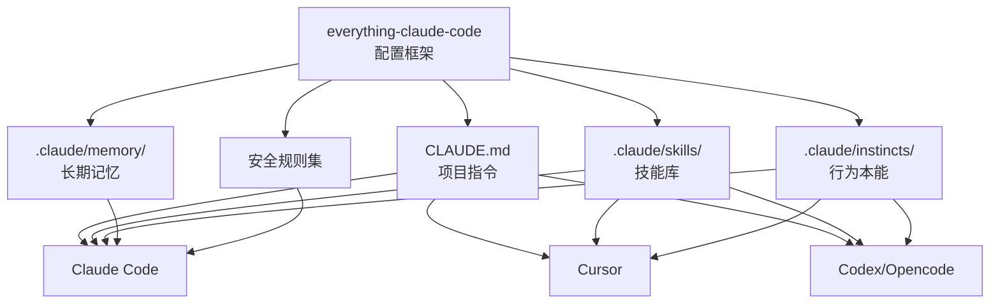
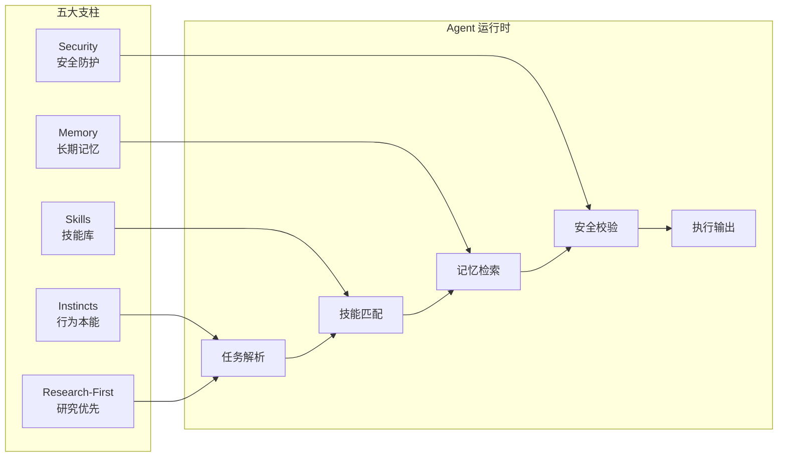
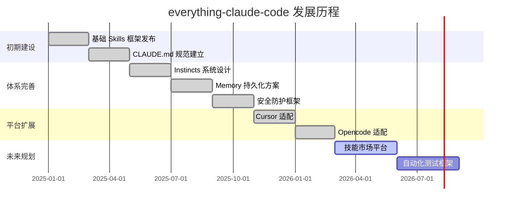

# affaan-m/everything-claude-code

> The agent harness performance optimization system. Skills, instincts, memory, security, and research-first development for Claude Code, Codex, Opencode, Cursor and beyond. — 面向 Claude Code 及多平台 AI 编程工具的 Agent 性能优化综合系统，涵盖技能（Skills）、本能（Instincts）、记忆（Memory）、安全（Security）与研究优先开发范式。

## 项目概述

everything-claude-code 是由 affaan-m 发起、社区驱动的 Claude Code 生态系统优化框架，是目前 GitHub 上 Star 数量增长最快的 AI 编程工具配置项目之一。该项目以"Agent 性能优化系统"为核心定位，提供一套系统化的方法论和配置文件集合，涵盖技能库（Skills）、行为本能（Instincts）、长期记忆（Memory）、安全防护（Security）和研究优先（Research-First）开发方法论五大支柱。截至 2026 年 3 月 22 日，项目累计获得 96,477 Stars，单日新增 3,370 Stars，是本次趋势榜单中 Stars 最多、增速最快的项目，体现了 Claude Code 用户对系统化 Agent 优化工具的迫切需求。

## 基本信息

| 属性 | 详情 |
|------|------|
| **项目名称** | everything-claude-code |
| **作者** | affaan-m |
| **Stars** | 96,477 ⭐ |
| **今日新增 Stars** | +3,370 |
| **主要语言** | JavaScript / Markdown |
| **创建时间** | 2025 年初 |
| **最近更新** | 2026 年 3 月活跃维护中 |
| **协议** | MIT License |
| **GitHub 链接** | https://github.com/affaan-m/everything-claude-code |
| **兼容平台** | Claude Code, Codex, Opencode, Cursor, 及其他 AI 编程工具 |

## 技术分析

### 技术栈

everything-claude-code 本质上是一个"配置即代码"的元框架，核心技术构成如下：

| 技术组件 | 用途 |
|---------|------|
| Markdown / SKILL.md 规范 | Skills 技能文件格式标准 |
| JavaScript / TypeScript | 工具脚本和自动化辅助程序 |
| JSON / YAML | 配置文件和 Instincts 定义 |
| Shell Scripts | 安装和环境初始化脚本 |
| CLAUDE.md 规范 | 项目级 AI 行为指令标准 |
| .claude/ 目录结构 | Agent 工作区组织规范 |

**项目与平台的关系**：

### 架构设计

everything-claude-code 围绕"五大支柱"构建其体系架构：

**五大支柱详解**：

**1. Skills（技能）**
- 可调用的可重用任务模块，以 SKILL.md 格式编写
- 每个 Skill 包含：功能描述、触发条件、执行步骤、输入/输出规范
- 技能库涵盖代码审查、测试生成、文档撰写、部署自动化等数十个领域
- 支持跨平台（Claude Code / Cursor / Codex）调用

**2. Instincts（本能）**
- 定义 Agent 的默认行为模式和决策偏好
- 例如：遇到不确定时优先询问用户 vs 自主决策
- 安全本能：永远不执行危险操作（删除、强制推送等）
- 风格本能：代码风格、注释规范的默认行为

**3. Memory（记忆）**
- 跨会话持久化的项目知识存储
- 包括架构决策记录（ADR）、技术债追踪、用户偏好
- 结构化 Markdown 格式，便于 LLM 高效检索
- 避免在每个新会话中重复解释项目背景

**4. Security（安全）**
- Agent 行为安全边界定义
- Prompt Injection 防护规则
- 敏感信息（API Key、密码）的处理规范
- 操作权限分级（只读 / 写入 / 执行）

**5. Research-First（研究优先）**
- 在编码前先进行充分研究的方法论
- 工作流：研究 → 规划 → 实施 → 验证
- 避免 AI "盲目编码"导致的方向性错误

### 核心功能

**1. 统一配置规范**
- 提供 CLAUDE.md、.claude/ 目录结构的最佳实践模板
- 标准化不同团队和项目间的 AI 配置方式
- 版本控制友好，配置文件可随代码库一同管理

**2. 技能库（Skills Library）**
- 开箱即用的数十个预建 Skill
- 包含：代码重构、测试用例生成、API 文档生成、Git 提交规范检查等
- 社区持续贡献新技能，覆盖各种开发场景

**3. 跨平台兼容层**
- 同一套配置可适配 Claude Code、Cursor、Codex 等多个平台
- 抽象层屏蔽了不同平台 API 的差异
- 便于团队在不同 AI 工具间迁移而不丢失配置

**4. 安全防护框架**
- 内置对 Prompt Injection 攻击的防护规则
- 定义 AI 操作的"红线"（永远不能做的事）
- 敏感操作的人工确认机制

**5. 记忆系统**
- 结构化的项目知识库模板
- 架构决策、技术选型的持久化记录
- 跨会话的用户偏好继承

## 社区活跃度

### 贡献者分析

| 贡献类型 | 规模 |
|---------|------|
| Skills 贡献者 | 数百名开发者提交了新技能文件 |
| 文档贡献者 | 多语言翻译、教程和指南 |
| 工具贡献者 | 安装脚本、迁移工具 |
| 平台适配者 | 新 AI 平台的兼容适配 |

项目是典型的社区驱动模式，技能库中大量内容来自社区贡献，形成了活跃的内容生态。96,477 Stars 中有大量来自 Claude Code 的企业级用户，说明该框架在工程团队中得到了广泛认可。

### Issue/PR 活跃度

- **高频 PR**：每周均有数十个新 Skill 提交
- **规范讨论**：社区积极讨论 Skill 规范的改进
- **跨平台兼容**：各平台适配的 Issue 占比较高
- **质量把控**：核心团队对提交的 Skill 进行质量审核

### 最近动态

- 2026 年 3 月 22 日单日新增 3,370 Stars，显示近期有重大功能发布或媒体报道
- 新增 Opencode 平台的完整兼容支持
- 推出了统一安装脚本，一键配置所有支持平台
- 发布了"研究优先"方法论的详细白皮书和最佳实践指南

## 发展趋势

### 版本演进

### Roadmap

1. **技能市场（Skills Marketplace）**：构建可搜索的技能库浏览和一键安装平台
2. **自动化技能测试**：为 Skills 提供单元测试框架，确保技能质量
3. **技能版本管理**：技能的语义化版本控制和升级机制
4. **企业功能**：私有技能库、团队权限管理、审计日志
5. **AI 辅助技能生成**：用 AI 自动从代码库中提取和生成 Skill 定义

### 社区反馈

**高度认可**：
- "把 AI 配置从黑魔法变成了工程学" — 社区高频评价
- 跨平台统一配置极大降低了团队的 AI 工具迁移成本
- Skills 库的质量和覆盖面持续提升

**主要意见**：
- 初始学习曲线较陡，概念体系（Skills/Instincts/Memory）需要时间理解
- 部分 Skill 的质量参差不齐，需要更严格的审核机制
- 希望有可视化的 Skill 管理界面

## 竞品对比

| 项目 | 定位 | Stars | 跨平台 | Skills 系统 | 安全框架 | 活跃维护 |
|------|------|-------|--------|------------|---------|---------|
| **everything-claude-code** | 综合优化框架 | ~96.5k | ✅ 多平台 | ✅ 完整 | ✅ 内置 | ✅ |
| awesome-claude-code | 资源列表 | ~8k | ❌ | ❌ | ❌ | ✅ |
| claude-code-router | 路由工具 | ~3k | 部分 | ❌ | ❌ | ✅ |
| cursor-rules | Cursor 规则集 | ~15k | ❌ Cursor 专属 | 部分 | 部分 | ✅ |
| .cursorrules 社区 | 规则分享 | 分散 | ❌ | ❌ | ❌ | 分散 |
| Aider conventions | Aider 约定 | 内置 | ❌ | ❌ | ❌ | ✅ |

**核心差异化**：
- everything-claude-code 是唯一将 Skills、Memory、Instincts 系统化整合的框架
- 跨平台支持在竞品中独树一帜
- 96.5k Stars 远超所有竞品，社区生态规模最大

## 总结评价

### 优势

1. **体系化思维**：将 AI 工具配置从碎片化最佳实践上升为系统化方法论，是真正的"框架"而非"工具集合"
2. **社区规模巨大**：96.5k Stars 意味着庞大的贡献者和用户群体，技能库内容极为丰富
3. **跨平台价值**：打破不同 AI 编程工具的壁垒，统一配置减少了团队的工具切换成本
4. **安全意识领先**：内置 Prompt Injection 防护和操作安全框架，是同类项目中安全意识最强的
5. **方法论输出**：Research-First 范式等方法论输出帮助团队形成规范的 AI 辅助开发流程

### 劣势

1. **概念复杂度高**：Skills、Instincts、Memory、Security 四个概念需要学习成本，新手入门门槛不低
2. **碎片化风险**：技能质量参差不齐，缺乏统一的质量评级体系
3. **平台依赖**：尽管声称跨平台，但许多 Skill 仍深度依赖特定平台的 API
4. **维护负担**：随着平台 API 迭代，大量 Skill 需要持续维护，否则将失效
5. **标准化挑战**：作为社区项目，难以像商业产品那样保持严格一致性

### 适用场景

- **Claude Code 重度用户**：希望将 AI 编程效率提升到极致的个人开发者
- **工程团队**：需要在团队内统一 AI 辅助开发规范和配置的技术管理者
- **多工具用户**：同时使用 Claude Code、Cursor、Codex 等多种 AI 工具的开发者
- **AI 安全关注者**：重视 AI 操作安全边界的团队和个人
- **开源贡献者**：希望参与构建 AI 编程工具生态的开发者
- **企业 AI 转型**：正在推进 AI 辅助开发文化建设的大型组织

> **综合评分**：★★★★★ (5/5)
> 在 AI 辅助编程的配置框架赛道中，everything-claude-code 以近十万 Stars 的体量证明了其价值。系统化的方法论、跨平台支持和庞大的社区生态是其核心竞争力。对于认真使用 AI 编程工具的团队和个人，这是目前最值得参考的配置框架之一。

---
*报告生成时间: 2026-03-22 11:00:00*
*研究方法: GitHub API + Web搜索深度研究*
