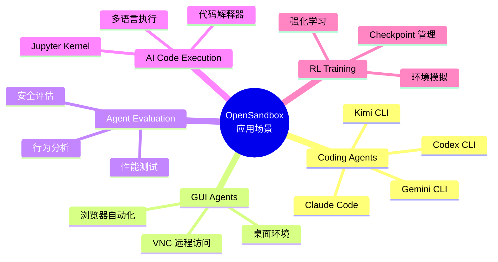
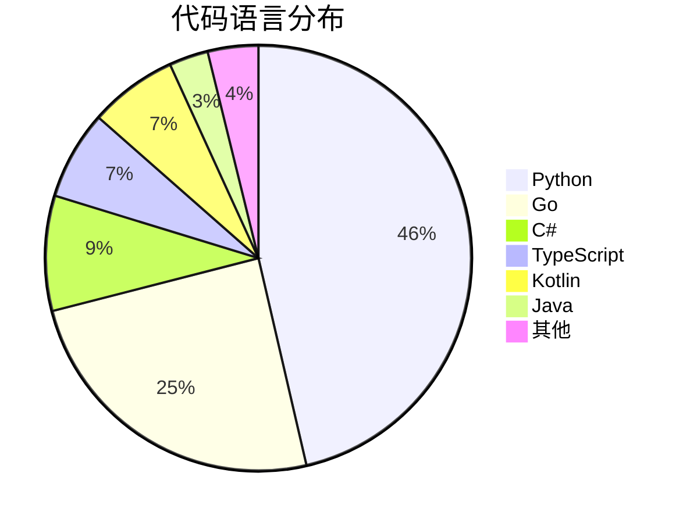
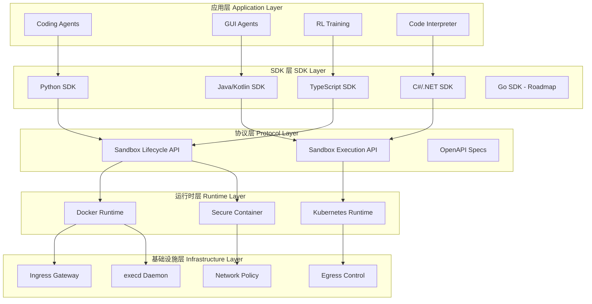
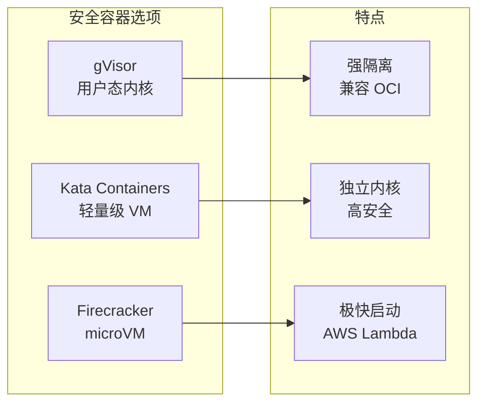
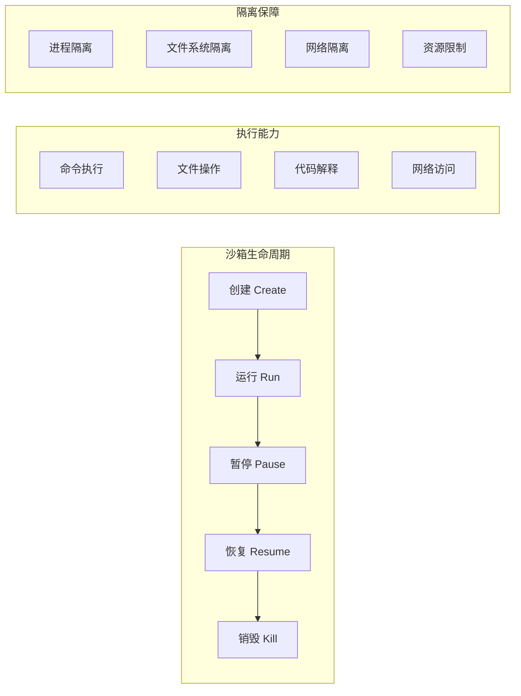
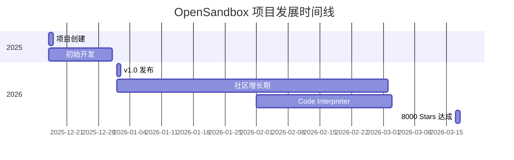
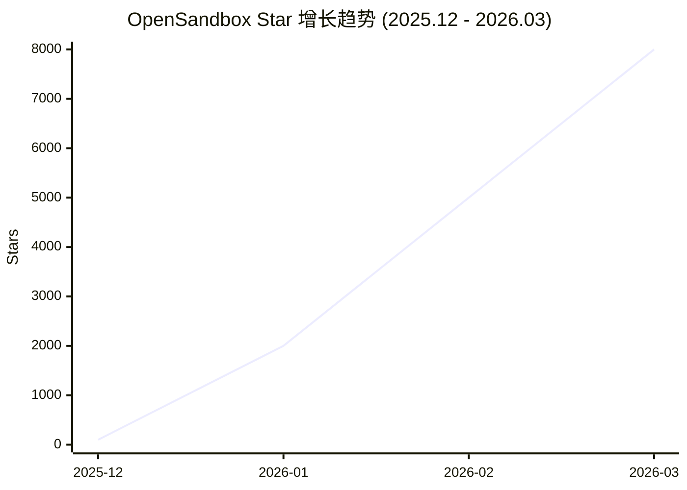
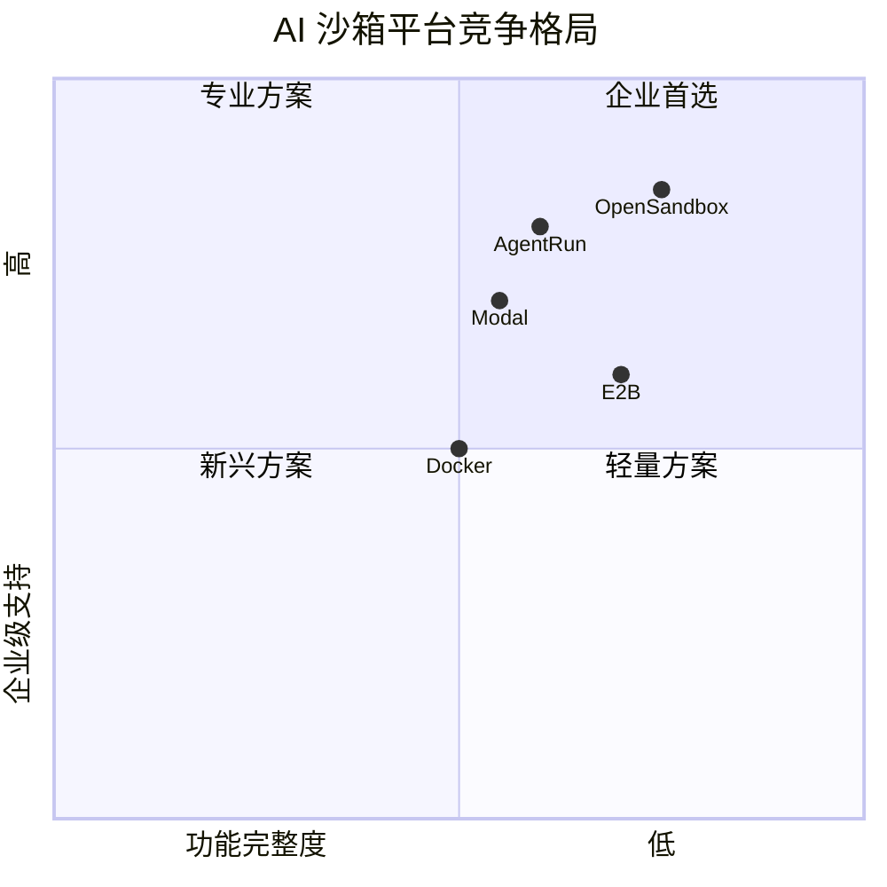
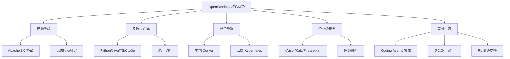
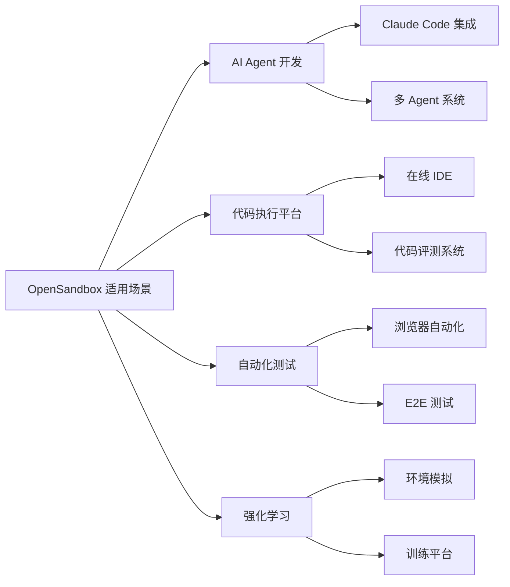

# alibaba/OpenSandbox 深度研究报告

> OpenSandbox 是阿里巴巴开源的通用 AI 应用沙箱平台，提供多语言 SDK、统一沙箱 API 和 Docker/Kubernetes 运行时，适用于 Coding Agents、GUI Agents、Agent Evaluation、AI Code Execution 和 RL Training 等场景。

---

## 目录

- [项目概述](#项目概述)
- [基本信息](#基本信息)
- [技术分析](#技术分析)
- [社区活跃度](#社区活跃度)
- [发展趋势](#发展趋势)
- [竞品对比](#竞品对比)
- [总结评价](#总结评价)

---

## 项目概述

### 核心定位

OpenSandbox 是阿里巴巴于 2025 年 12 月开源的**通用沙箱平台**，专门为 AI 应用设计。其核心使命是启用**不受信任代码的安全执行**，为 AI Agent 提供隔离的执行环境。

### 解决的问题

在 AI Agent 时代，大语言模型（LLM）正在从"对话者"向"执行者"转变。AI Agent 需要执行代码、操作文件、访问网络，这带来了安全风险：

- **代码执行风险**：AI 生成的代码可能包含恶意操作
- **资源隔离需求**：多租户环境下需要隔离执行环境
- **状态管理挑战**：Agent 需要有状态的持久化执行环境
- **规模化调度**：大规模 Agent 部署需要高效的资源管理

OpenSandbox 正是为解决这些问题而生，提供了一套完整的沙箱基础设施解决方案。

### 应用场景



---

## 基本信息

| 指标 | 数值 |
|------|------|
| **项目名称** | alibaba/OpenSandbox |
| **Stars** | 8,000 ⭐ |
| **Forks** | 599 |
| **Open Issues** | 54 |
| **主要语言** | Python |
| **开源协议** | Apache-2.0 |
| **创建时间** | 2025-12-17 |
| **最近更新** | 2026-03-17 |
| **贡献者数量** | 33 |
| **最新版本** | sandboxes/code-interpreter 1.0.2 |
| **GitHub** | [alibaba/OpenSandbox](https://github.com/alibaba/OpenSandbox) |
| **官方文档** | [open-sandbox.ai](https://open-sandbox.ai/) |

### 语言分布



### 项目标签

`ai` · `ai-agent` · `ai-infra` · `kubernetes` · `sandbox`

---

## 技术分析

### 架构设计

OpenSandbox 采用分层架构设计，实现了关注点分离：



### 核心组件

| 组件 | 目录 | 描述 |
|------|------|------|
| **多语言 SDK** | `sdks/` | Python、Java/Kotlin、TypeScript/JavaScript、C#/.NET SDK |
| **协议规范** | `specs/` | OpenAPI 规范和生命周期规范 |
| **沙箱服务器** | `server/` | Python FastAPI 沙箱生命周期服务器 |
| **Kubernetes 部署** | `kubernetes/` | K8s 部署配置和示例 |
| **执行守护进程** | `components/execd/` | 沙箱执行守护进程（命令和文件操作） |
| **入口网关** | `components/ingress/` | 沙箱流量入口代理 |
| **出口控制** | `components/egress/` | 沙箱网络出口控制 |
| **沙箱实现** | `sandboxes/` | 运行时沙箱实现 |

### 技术栈详解

#### 1. 多语言 SDK 支持

OpenSandbox 提供了业界最全面的多语言 SDK 支持：

```python
from opensandbox import Sandbox
from code_interpreter import CodeInterpreter

async def example():
    sandbox = await Sandbox.create(
        "opensandbox/code-interpreter:v1.0.1",
        timeout=timedelta(minutes=10),
    )
    
    async with sandbox:
        await sandbox.commands.run("echo 'Hello OpenSandbox!'")
        await sandbox.files.write_files([
            WriteEntry(path="/tmp/hello.txt", data="Hello World")
        ])
        
        interpreter = await CodeInterpreter.create(sandbox)
        result = await interpreter.codes.run(
            "result = 2 + 2\nresult",
            language=SupportedLanguage.PYTHON,
        )
```

#### 2. 安全容器运行时

支持多种安全容器技术：



| 技术 | 隔离级别 | 启动时间 | 性能损耗 | 适用场景 |
|------|----------|----------|----------|----------|
| **gVisor** | 用户态内核 | 1-2 秒 | 5-10% | 通用场景 |
| **Kata Containers** | 轻量级 VM | 2-5 秒 | 10-15% | 高安全需求 |
| **Firecracker** | microVM | <1 秒 | 5-10% | Serverless |

#### 3. 网络策略

- **Ingress Gateway**：统一入口网关，支持多种路由策略
- **Egress Control**：每个沙箱独立的出口网络控制
- **Network Policy**：细粒度的网络访问控制

#### 4. Code Interpreter 实现

内置 Code Interpreter 支持：

- 集成 Jupyter Kernel 协议
- 支持多语言状态化执行（Python、Java、JS、Go 等）
- 维持变量上下文
- 支持包安装和管理

### 核心功能



---

## 社区活跃度

### 项目增长趋势



### 活跃度指标

| 指标 | 数值 | 评价 |
|------|------|------|
| **Stars 增长** | 8,000 (3个月) | 🚀 极快 |
| **Fork 比例** | 7.5% | 📊 健康 |
| **Issue 响应** | 54 Open | ⚠️ 需关注 |
| **贡献者** | 33 | 👥 活跃 |
| **最近更新** | 2026-03-17 | ✅ 活跃 |
| **最新发布** | 2026-03-17 | ✅ 持续迭代 |

### 社区生态

- **DingTalk 技术讨论群**：活跃的中文社区支持
- **GitHub Issues**：问题反馈和功能讨论
- **DeepWiki 集成**：AI 辅助文档查询

---

## 发展趋势

### Star 增长趋势



### 2026 路线图

#### SDK 发展

- **Sandbox 客户端连接池**：客户端沙箱连接池管理，提供预配置沙箱，实现 X 毫秒级环境获取
- **Go SDK**：Go 客户端 SDK，支持沙箱生命周期管理、命令执行和文件操作

#### 运行时增强

- **持久化卷**：可挂载的沙箱持久化卷（参见 [Proposal 0003](oseps/0003-volume-and-volumebinding-support.md)）
- **本地轻量级沙箱**：直接在 PC 上运行的 AI 工具轻量级沙箱
- **安全容器**：在容器内运行 AI Agent 的安全沙箱

#### 部署优化

- **部署指南**：自托管 Kubernetes 集群部署指南

### 市场趋势分析

根据行业研究，2025-2026 年是 AI Agent 爆发期：

- **2024 年关键词**：大模型
- **2025 年关键词**：应用爆发
- **2026 年关键词**：Agent

AI Agent 市场预计将达到万亿规模，沙箱作为 Agent 基础设施将迎来巨大需求。

---

## 竞品对比

### 主要竞品分析



### 详细对比

| 特性 | OpenSandbox | E2B | Modal | AgentRun |
|------|-------------|-----|-------|----------|
| **开源** | ✅ Apache 2.0 | ✅ MIT | ❌ 闭源 | ❌ 阿里云 |
| **多语言 SDK** | ✅ 5 种 | ✅ 3 种 | ✅ Python/TS | ✅ Python |
| **Kubernetes 支持** | ✅ 原生 | ⚠️ 有限 | ❌ | ✅ |
| **安全容器** | ✅ gVisor/Kata/Firecracker | ✅ Firecracker | ⚠️ 自研 | ✅ |
| **本地开发** | ✅ Docker | ⚠️ 云端优先 | ❌ | ❌ |
| **浏览器自动化** | ✅ Chrome/Playwright | ⚠️ 有限 | ❌ | ✅ |
| **Code Interpreter** | ✅ 内置 | ✅ 内置 | ✅ | ✅ |
| **企业级部署** | ✅ 自托管 | ⚠️ SaaS | ✅ | ✅ 阿里云 |
| **定价** | 免费（自托管） | 免费额度 + 付费 | 按使用付费 | 阿里云定价 |

### 竞品详解

#### E2B (Code Interpreter SDK)

**优势**：
- 开源社区活跃
- Firecracker 技术成熟
- 文档完善

**劣势**：
- 主要面向云端
- Kubernetes 支持有限
- 企业级功能需付费

#### Modal

**优势**：
- Serverless 架构
- 极快冷启动
- GPU 支持完善

**劣势**：
- 闭源平台
- 供应商锁定风险
- 定制能力有限

#### AgentRun (阿里云)

**优势**：
- 企业级安全
- 阿里云生态集成
- 国内合规支持

**劣势**：
- 仅限阿里云
- 非开源
- 灵活性受限

### OpenSandbox 竞争优势



---

## 总结评价

### 优势

| 优势 | 说明 |
|------|------|
| **🆓 开源免费** | Apache 2.0 协议，无供应商锁定风险 |
| **🌐 多语言支持** | 业界最全面的 SDK 支持（5 种语言） |
| **🔒 企业级安全** | 支持 gVisor、Kata、Firecracker 等安全容器 |
| **🏗️ 架构完整** | 从 SDK 到运行时的完整解决方案 |
| **🚀 快速增长** | 3 个月 8000 Stars，社区活跃 |
| **🏢 阿里背书** | 阿里巴巴开源，有企业级实践支撑 |
| **📚 文档完善** | 中英文文档，示例丰富 |
| **🔧 灵活部署** | 支持本地 Docker 和 Kubernetes 集群 |

### 劣势

| 劣势 | 说明 |
|------|------|
| **📅 项目较新** | 2025 年 12 月创建，生态尚在建设中 |
| **📖 文档深度** | 部分高级功能文档待完善 |
| **🌐 国际化** | 主要面向中文社区，国际化有待加强 |
| **🔌 Go SDK** | Go SDK 尚在路线图中 |
| **📊 监控告警** | 缺少内置的可观测性方案 |

### 适用场景



#### 推荐使用场景

1. **AI Agent 平台开发**：需要安全执行 AI 生成代码的场景
2. **Coding Agent 集成**：Claude Code、Gemini CLI、Codex CLI 等工具集成
3. **企业级代码执行**：需要自托管、数据不出域的场景
4. **浏览器自动化**：需要隔离环境的 Web 自动化测试
5. **强化学习训练**：需要隔离环境进行 RL 训练

#### 不推荐场景

1. **简单脚本执行**：轻量级需求可用 Docker 直接解决
2. **纯云端场景**：E2B 或 Modal 可能更简单
3. **Windows 环境**：目前主要支持 Linux/macOS

### 推荐指数

| 维度 | 评分 | 说明 |
|------|------|------|
| **技术架构** | ⭐⭐⭐⭐⭐ | 设计完整，扩展性强 |
| **代码质量** | ⭐⭐⭐⭐ | 代码规范，测试覆盖 |
| **文档完善度** | ⭐⭐⭐⭐ | 中英文档，示例丰富 |
| **社区活跃度** | ⭐⭐⭐⭐⭐ | 快速增长，响应及时 |
| **企业可用性** | ⭐⭐⭐⭐ | 功能完整，待生产验证 |
| **学习曲线** | ⭐⭐⭐⭐ | SDK 简洁，上手快 |

**综合推荐指数：⭐⭐⭐⭐☆ (4.5/5)**

### 总结

OpenSandbox 是阿里巴巴在 AI Agent 基础设施领域的重要布局，填补了国内开源 AI 沙箱平台的空白。项目具有以下特点：

1. **定位精准**：专注于 AI Agent 场景，解决代码安全执行痛点
2. **架构先进**：多语言 SDK + 协议层 + 运行时层的分层设计
3. **生态完整**：覆盖 Coding Agent、GUI Agent、RL Training 等场景
4. **增长迅猛**：3 个月 8000 Stars，社区活跃度高

对于正在构建 AI Agent 平台的开发者和企业，OpenSandbox 是一个值得重点关注和采用的开源项目。随着 AI Agent 市场的爆发，OpenSandbox 有望成为该领域的基础设施标准之一。

---

## 参考链接

- [GitHub 仓库](https://github.com/alibaba/OpenSandbox)
- [官方文档](https://open-sandbox.ai/)
- [中文文档](https://open-sandbox.ai/zh/)
- [DeepWiki](https://deepwiki.com/alibaba/OpenSandbox)
- [架构设计文档](https://github.com/alibaba/OpenSandbox/blob/main/docs/architecture.md)

---

*报告生成时间: 2026-03-17*  
*数据来源: GitHub API、官方文档、网络公开信息*
