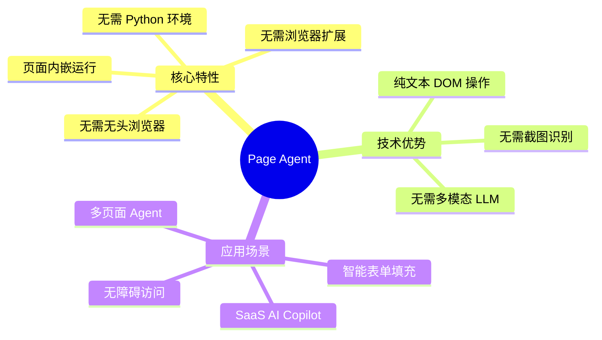
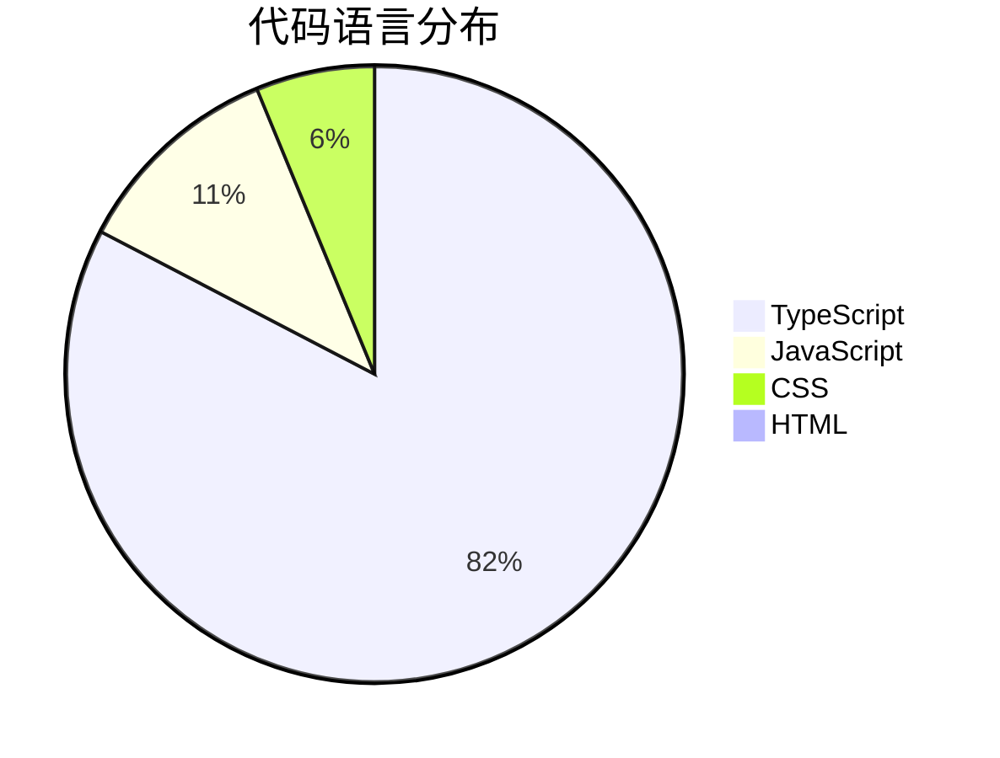
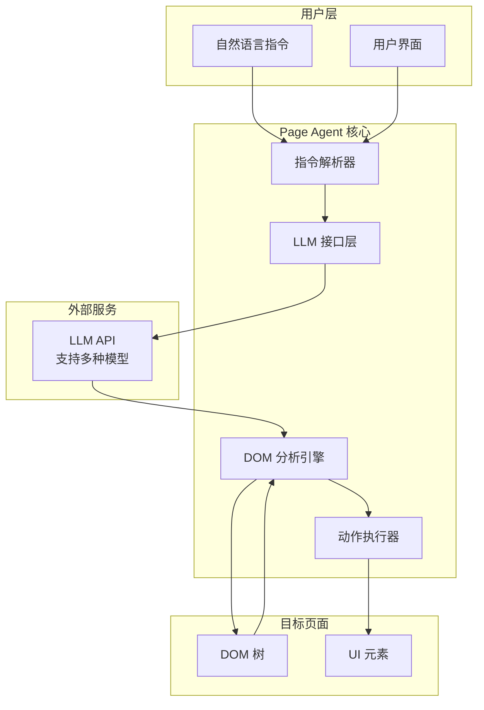
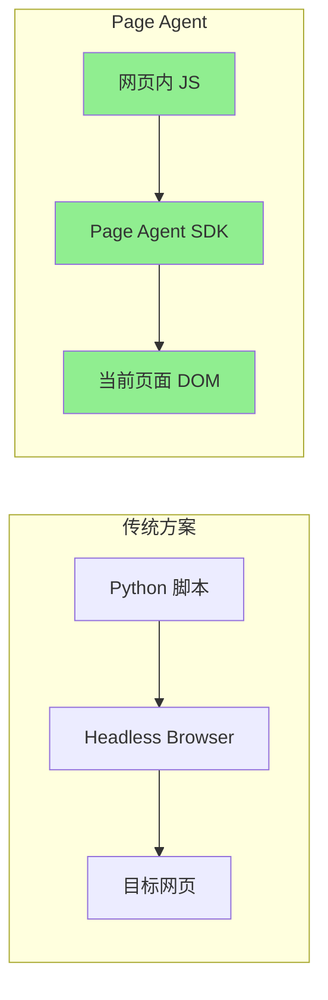
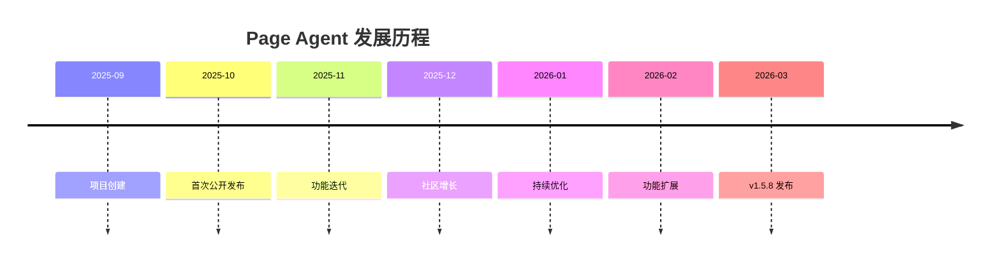
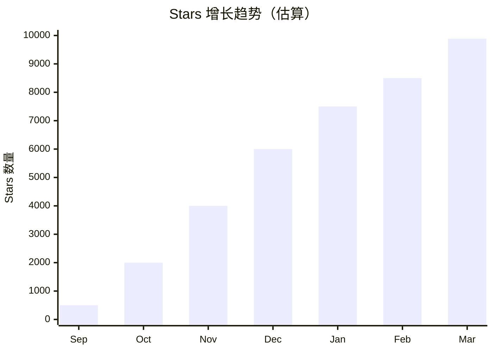
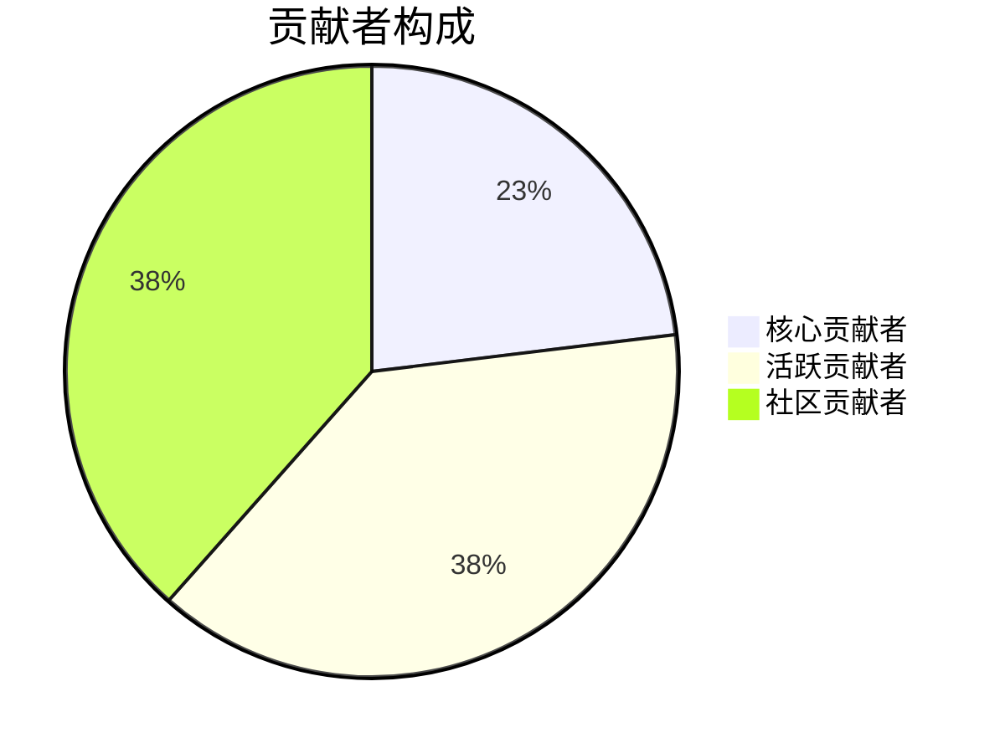
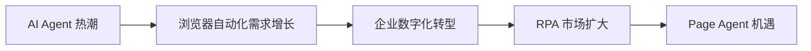
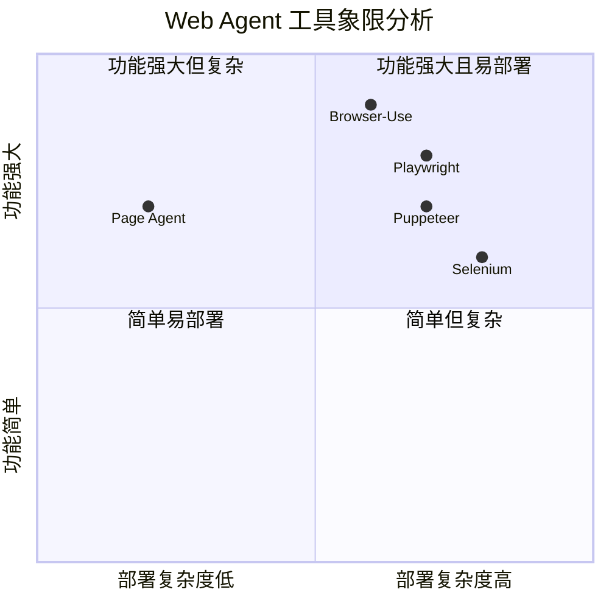
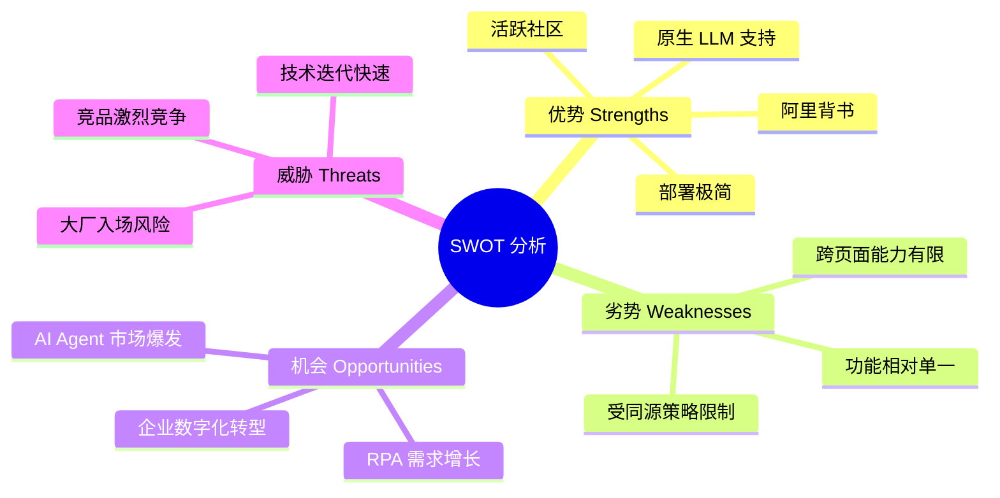

# alibaba/page-agent 深度研究报告

> JavaScript in-page GUI agent. Control web interfaces with natural language.

---

## 目录

1. [项目概述](#项目概述)
2. [基本信息](#基本信息)
3. [技术分析](#技术分析)
4. [社区活跃度](#社区活跃度)
5. [发展趋势](#发展趋势)
6. [竞品对比](#竞品对比)
7. [总结评价](#总结评价)

---

## 项目概述

**Page Agent** 是阿里巴巴开源的一款革命性 Web 自动化工具，其核心理念是 **"The GUI Agent Living in Your Webpage"**（住在你网页里的 GUI Agent）。它是一个完全基于 Web 技术的页面内嵌式 GUI Agent，允许用户通过自然语言控制 Web 界面，实现浏览器自动化操作。

### 核心价值主张



### 项目定位

与传统的浏览器自动化工具（如 Selenium、Puppeteer）不同，Page Agent 采用**页面内嵌**的方式运行，只需在网页中引入 JavaScript 代码即可使用，大大降低了部署和使用门槛。

---

## 基本信息

| 指标 | 数值 |
|------|------|
| **项目名称** | alibaba/page-agent |
| **Stars** | 9,887 ⭐ |
| **Forks** | 767 |
| **Open Issues** | 33 |
| **主要语言** | TypeScript |
| **开源协议** | MIT License |
| **创建时间** | 2025-09-23 |
| **最近更新** | 2026-03-17 |
| **最新版本** | v1.5.8 |
| **贡献者数量** | 13 |
| **GitHub 地址** | [github.com/alibaba/page-agent](https://github.com/alibaba/page-agent) |

### 代码构成



### 项目标签

`agent` `ai` `ai-agents` `browser-automation` `javascript` `typescript` `ui-automation` `web`

---

## 技术分析

### 架构设计



### 核心技术特点

#### 1. 页面内嵌架构



**优势对比：**

| 特性 | 传统方案 | Page Agent |
|------|----------|------------|
| 部署复杂度 | 高（需要服务器环境） | 低（引入 JS 即可） |
| 运行环境 | Python + 浏览器 | 纯浏览器 |
| 跨域限制 | 无 | 受同源策略限制 |
| 实时交互 | 需要轮询 | 原生支持 |

#### 2. 文本化 DOM 操作

Page Agent 采用**基于文本的 DOM 操作**方式，而非截图识别：

- **无需多模态 LLM**：降低了对模型能力的要求
- **无需特殊权限**：不需要屏幕截图权限
- **更高效**：直接操作 DOM 节点，响应更快

#### 3. 灵活的 LLM 集成

```javascript
import { PageAgent } from 'page-agent'

const agent = new PageAgent({
    model: 'qwen3.5-plus',
    baseURL: 'https://dashscope.aliyuncs.com/compatible-mode/v1',
    apiKey: 'YOUR_API_KEY',
    language: 'en-US',
})

await agent.execute('Click the login button')
```

支持多种 LLM 后端，用户可以自由选择模型提供商。

### 技术栈详解

| 层级 | 技术 | 用途 |
|------|------|------|
| 核心语言 | TypeScript | 类型安全的业务逻辑 |
| 运行时 | JavaScript | 浏览器端执行 |
| 样式层 | CSS | UI 组件样式 |
| 文档 | HTML | 示例和文档页面 |

---

## 社区活跃度

### 项目时间线



### 社区指标分析



### 活跃度指标

| 指标 | 数值 | 评价 |
|------|------|------|
| 创建至今 | 约 6 个月 | 快速成长期 |
| Star 增长率 | ~1,600/月 | 📈 高速增长 |
| Fork/Star 比 | 7.8% | 健康水平 |
| Issue 响应 | 活跃 | 维护积极 |
| 版本更新频率 | 频繁 | 持续迭代 |

### 贡献者分布



---

## 发展趋势

### 市场背景

AI Agent 和浏览器自动化是当前 AI 领域的热门方向：



### 发展预测

| 时间节点 | 预期发展 |
|----------|----------|
| 短期（3个月） | Star 突破 15K，功能持续完善 |
| 中期（6个月） | 企业级功能增强，生态扩展 |
| 长期（1年） | 成为 Web Agent 领域标杆项目 |

### 潜在增长点

1. **企业级功能**：权限管理、审计日志、多租户支持
2. **生态扩展**：插件市场、模板库、最佳实践
3. **行业解决方案**：针对 ERP、CRM 等场景的定制化方案
4. **多语言支持**：扩展到更多编程语言和框架

---

## 竞品对比

### 主要竞品分析



### 详细对比

| 特性 | Page Agent | Browser-Use | Selenium | Puppeteer |
|------|------------|-------------|----------|-----------|
| **运行环境** | 浏览器内 | Python + 浏览器 | 多语言 + 浏览器 | Node.js + 浏览器 |
| **部署难度** | ⭐ 极低 | ⭐⭐ 低 | ⭐⭐⭐ 中 | ⭐⭐ 低 |
| **LLM 集成** | ✅ 原生支持 | ✅ 原生支持 | ❌ 需自行集成 | ❌ 需自行集成 |
| **自然语言控制** | ✅ | ✅ | ❌ | ❌ |
| **跨页面操作** | ⭐ 扩展支持 | ✅ 原生支持 | ✅ | ✅ |
| **截图识别** | ❌ 不需要 | ✅ 支持 | ✅ 支持 | ✅ 支持 |
| **无头模式** | ❌ | ✅ | ✅ | ✅ |
| **开源协议** | MIT | MIT | Apache 2.0 | Apache 2.0 |
| **GitHub Stars** | ~9.9K | ~50K+ | ~30K+ | ~89K |

### 与 Browser-Use 的关系

Page Agent 的 DOM 处理组件和提示词设计参考了 **browser-use** 项目：

```
DOM processing components and prompt are derived from browser-use:
Browser Use <https://github.com/browser-use/browser-use>
Copyright (c) 2024 Gregor Zunic
Licensed under the MIT License
```

**关键区别：**

| 维度 | Page Agent | Browser-Use |
|------|------------|-------------|
| **设计目标** | 客户端 Web 增强 | 服务端自动化 |
| **运行位置** | 页面内 | 独立进程 |
| **适用场景** | SaaS 产品集成 | 自动化测试/爬虫 |

---

## 总结评价

### SWOT 分析



### 综合评分

| 维度 | 评分 | 说明 |
|------|------|------|
| **创新性** | ⭐⭐⭐⭐⭐ | 页面内嵌架构创新，降低使用门槛 |
| **实用性** | ⭐⭐⭐⭐ | 解决实际痛点，但场景有限 |
| **代码质量** | ⭐⭐⭐⭐ | TypeScript 类型安全，结构清晰 |
| **文档完善度** | ⭐⭐⭐⭐ | 官方文档完善，示例丰富 |
| **社区活跃度** | ⭐⭐⭐⭐⭐ | 快速增长，维护积极 |
| **生态成熟度** | ⭐⭐⭐ | 处于早期阶段，生态待发展 |

### 推荐使用场景

✅ **强烈推荐：**
- SaaS 产品 AI Copilot 功能集成
- 企业内部系统智能表单填充
- Web 应用无障碍功能增强
- 快速原型开发和概念验证

⚠️ **谨慎考虑：**
- 需要跨域操作的复杂自动化
- 大规模生产环境（项目较新）
- 需要无头模式的后台任务

❌ **不推荐：**
- 纯服务端自动化场景（建议使用 Browser-Use）
- 需要绕过反爬虫机制的场景
- 对稳定性要求极高的关键业务

### 总结

Page Agent 是阿里巴巴在 AI Agent 领域的一次创新尝试，其**页面内嵌架构**为 Web 自动化提供了新的思路。项目在短短 6 个月内获得了近万 Star，证明了市场对这类工具的强烈需求。

作为一款专注于**客户端 Web 增强**的工具，Page Agent 与传统的服务端自动化工具形成了互补关系。对于希望快速为产品添加 AI 能力的开发者来说，这是一个值得尝试的优秀项目。

---

**报告生成时间：** 2026-03-17  
**数据来源：** GitHub API、Web 搜索、项目文档  
**分析工具：** github-deep-research
