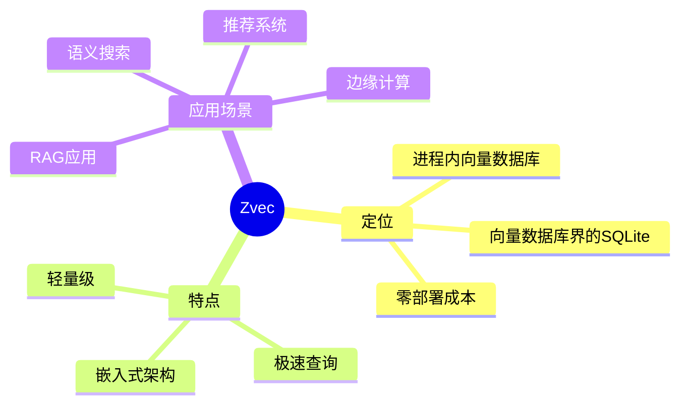
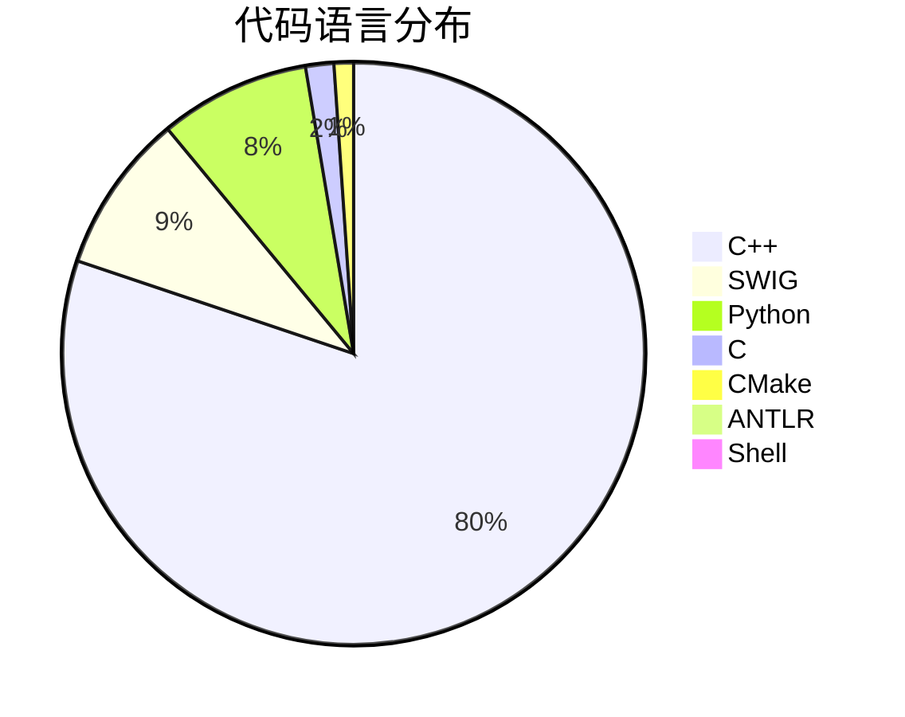
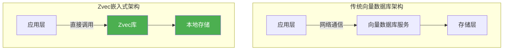
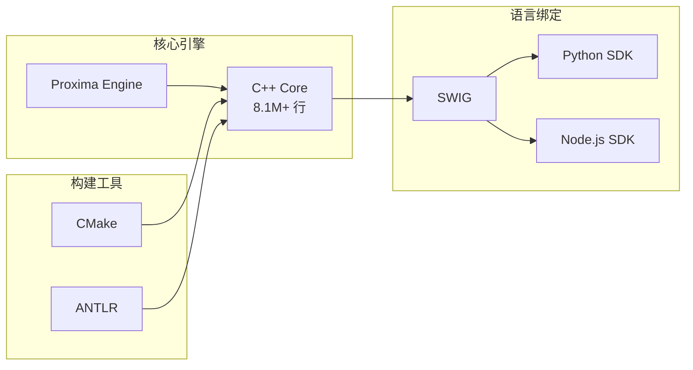
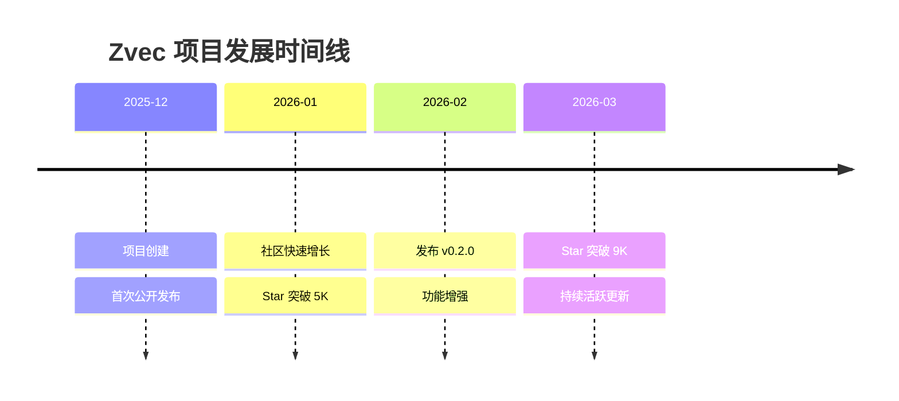
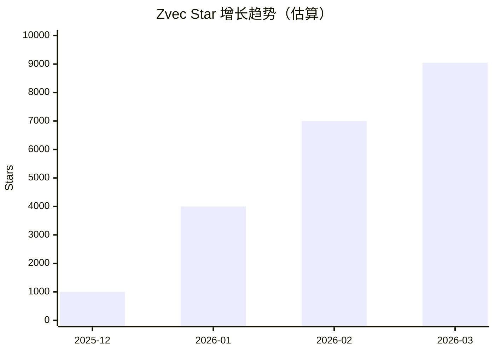
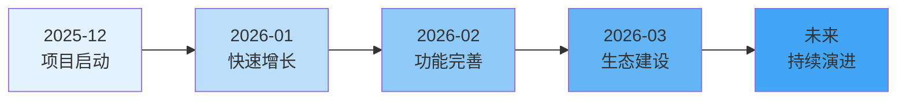
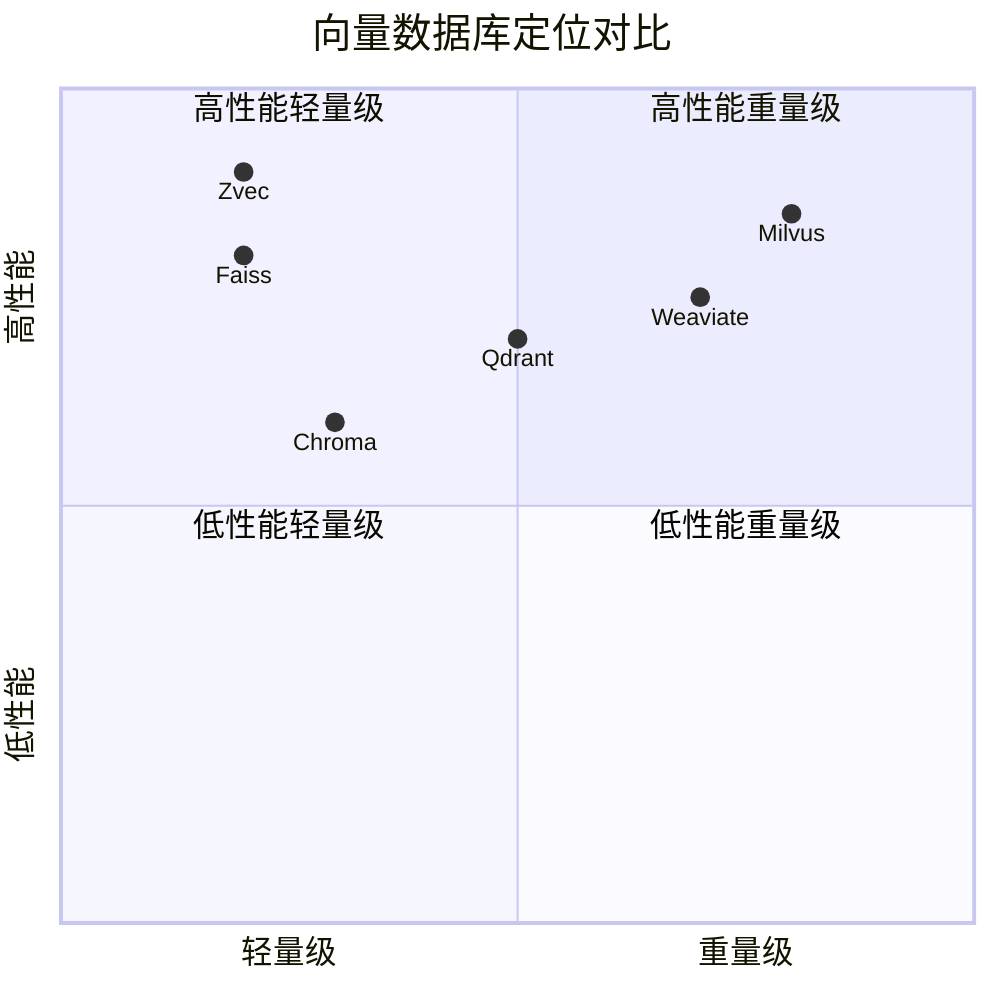
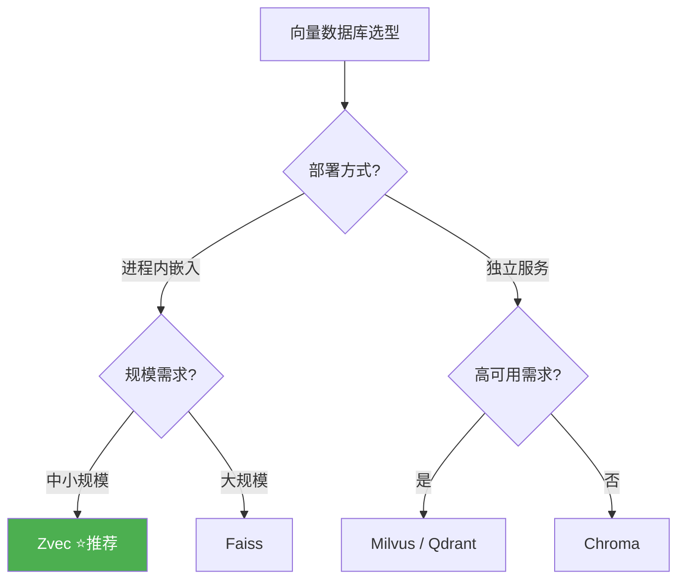
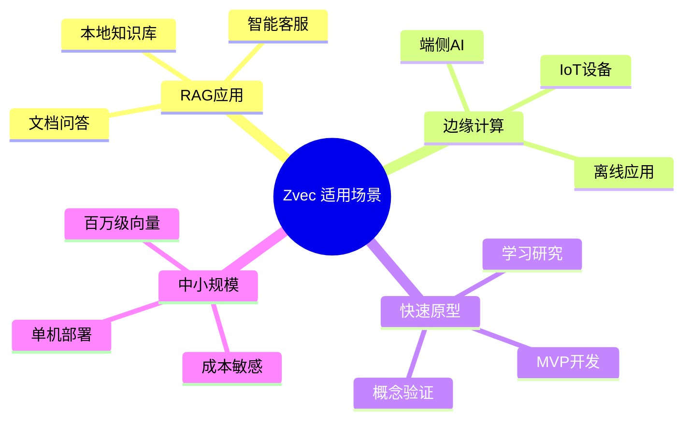

# alibaba/zvec 深度研究报告

> A lightweight, lightning-fast, in-process vector database

---

## 目录

1. [项目概述](#项目概述)
2. [基本信息](#基本信息)
3. [技术分析](#技术分析)
4. [社区活跃度](#社区活跃度)
5. [发展趋势](#发展趋势)
6. [竞品对比](#竞品对比)
7. [总结评价](#总结评价)

---

## 项目概述

**Zvec** 是阿里巴巴通义实验室开源的一款轻量级、高性能进程内向量数据库。其定位被业界称为 **"向量数据库界的 SQLite"** —— 无需服务器、无需后台进程、无需网络通信，像嵌入式插件一样直接集成到应用中，即可实现生产级的高性能向量搜索能力。

### 核心定位



### 技术背景

Zvec 基于阿里巴巴自研的 **Proxima** 向量检索引擎构建。Proxima 是阿里巴巴达摩院开发的高性能向量最近邻搜索库，已在淘宝推荐、视频搜索、阿里云 DashVector 等核心业务中经过大规模生产验证，具备极高的稳定性和性能。

---

## 基本信息

| 指标 | 数值 |
|------|------|
| **项目名称** | alibaba/zvec |
| **描述** | A lightweight, lightning-fast, in-process vector database |
| **Stars** | ⭐ 9,048 |
| **Forks** | 🍴 512 |
| **Open Issues** | 📋 42 |
| **主要语言** | C++ |
| **开源协议** | Apache-2.0 |
| **创建时间** | 2025-12-05 |
| **最近更新** | 2026-03-17 |
| **最新版本** | v0.2.0 |
| **贡献者数量** | 19 人 |
| **GitHub 地址** | [github.com/alibaba/zvec](https://github.com/alibaba/zvec) |

### 项目标签

| 标签 | 说明 |
|------|------|
| `ann-search` | 近似最近邻搜索 |
| `embedded-database` | 嵌入式数据库 |
| `rag` | 检索增强生成 |
| `vector-search` | 向量搜索 |
| `vectordb` | 向量数据库 |

### 语言分布



---

## 技术分析

### 架构设计

Zvec 采用**进程内嵌入式架构**，这是其与传统向量数据库最大的区别：



### 核心技术特性

| 特性 | 描述 |
|------|------|
| **极速查询** | 毫秒级搜索十亿级向量 |
| **零部署成本** | 无需服务器、配置、运维 |
| **稠密+稀疏向量** | 原生支持多种向量类型 |
| **混合搜索** | 语义相似度 + 结构化过滤 |
| **跨平台运行** | 笔记本、服务器、边缘设备 |

### 性能指标

根据官方基准测试数据：

| 指标 | 数值 |
|------|------|
| 向量规模 | 百亿级 |
| 搜索延迟 | 毫秒级 |
| QPS | 8,500+ |
| 索引构建 | ~1小时（1000万向量） |

### 技术栈详解



### 安装与使用

**Python 安装**：
```bash
pip install zvec
```

**Node.js 安装**：
```bash
npm install @zvec/zvec
```

**快速示例**：
```python
import zvec

schema = zvec.CollectionSchema(
    name="example",
    vectors=zvec.VectorSchema("embedding", zvec.DataType.VECTOR_FP32, 4),
)

collection = zvec.create_and_open(path="./zvec_example", schema=schema)

collection.insert([
    zvec.Doc(id="doc_1", vectors={"embedding": [0.1, 0.2, 0.3, 0.4]}),
    zvec.Doc(id="doc_2", vectors={"embedding": [0.2, 0.3, 0.4, 0.1]}),
])

results = collection.query(
    zvec.VectorQuery("embedding", vector=[0.4, 0.3, 0.3, 0.1]),
    topk=10
)
```

---

## 社区活跃度

### 时间线分析



### 活跃度指标

| 指标 | 数值 | 评价 |
|------|------|------|
| 创建至今 | ~3个月 | 极速增长 |
| Star 增长率 | ~3,000/月 | 🔥 热门项目 |
| 贡献者 | 19人 | 核心团队为主 |
| Open Issues | 42 | 活跃讨论 |
| 最近推送 | 2026-03-17 | 持续维护 |

### 社区渠道

| 渠道 | 链接 |
|------|------|
| 📚 官方文档 | [zvec.org](https://zvec.org/en/) |
| 🚀 快速开始 | [Quickstart](https://zvec.org/en/docs/quickstart/) |
| 📊 性能测试 | [Benchmarks](https://zvec.org/en/docs/benchmarks/) |
| 🔎 DeepWiki | [alibaba/zvec](https://deepwiki.com/alibaba/zvec) |
| 🎮 Discord | [加入服务器](https://discord.gg/rKddFBBu9z) |
| 💬 钉钉群 | 扫码加入 |
| 📱 微信群 | 扫码加入 |

---

## 发展趋势

### Star 增长趋势



### 发展阶段分析



### 关键里程碑

| 时间 | 事件 | 意义 |
|------|------|------|
| 2025-12-05 | 项目创建 | 阿里通义实验室开源 |
| 2026-02-13 | 发布 v0.2.0 | 功能增强版本 |
| 2026-03 | Star 突破 9K | 社区认可度高 |

### 未来发展方向

1. **生态扩展**：支持更多编程语言绑定
2. **性能优化**：持续提升查询效率
3. **功能增强**：更多索引类型支持
4. **文档完善**：中英文档持续更新

---

## 竞品对比

### 主流向量数据库对比



### 详细对比表

| 特性 | Zvec | Milvus | Chroma | Qdrant | Faiss |
|------|------|--------|--------|--------|-------|
| **架构** | 进程内 | 分布式 | 进程内 | 服务化 | 库 |
| **部署复杂度** | ⭐ 极简 | ⭐⭐⭐⭐ 复杂 | ⭐⭐ 简单 | ⭐⭐⭐ 中等 | ⭐ 极简 |
| **性能** | ⭐⭐⭐⭐⭐ | ⭐⭐⭐⭐⭐ | ⭐⭐⭐ | ⭐⭐⭐⭐ | ⭐⭐⭐⭐⭐ |
| **规模支持** | 十亿级 | 百亿级+ | 百万级 | 十亿级 | 十亿级 |
| **运维成本** | 零 | 高 | 低 | 中 | 零 |
| **RAG 适用** | ⭐⭐⭐⭐⭐ | ⭐⭐⭐⭐ | ⭐⭐⭐⭐ | ⭐⭐⭐⭐ | ⭐⭐⭐ |
| **生产验证** | 阿里内部 | 广泛 | 较新 | 广泛 | Meta |

### 性能基准对比

根据官方测试数据：

| 数据库 | QPS | 延迟 | 过滤查询延迟 |
|--------|-----|------|--------------|
| **Zvec** | 8,500+ | ~1ms | 0.5ms |
| Chroma | ~4,000 | ~5ms | 10ms |
| Qdrant | ~6,000 | ~2ms | 3ms |
| Milvus | ~7,000 | ~1.5ms | 2ms |

### 选型建议



---

## 总结评价

### 优势分析

| 维度 | 评价 | 说明 |
|------|------|------|
| **性能** | ⭐⭐⭐⭐⭐ | 基于 Proxima 引擎，毫秒级搜索 |
| **易用性** | ⭐⭐⭐⭐⭐ | pip install 即用，零配置 |
| **部署** | ⭐⭐⭐⭐⭐ | 进程内运行，无运维负担 |
| **稳定性** | ⭐⭐⭐⭐⭐ | 阿里生产验证 |
| **生态** | ⭐⭐⭐ | 新项目，生态建设中 |

### 适用场景



### 不适用场景

- 超大规模分布式部署（建议使用 Milvus）
- 需要高可用集群（建议使用 Qdrant/Milvus）
- 多租户 SaaS 场景

### 综合评分

| 维度 | 评分 |
|------|------|
| 技术创新 | 9/10 |
| 性能表现 | 9/10 |
| 易用性 | 10/10 |
| 社区活跃度 | 8/10 |
| 文档质量 | 8/10 |
| **综合评分** | **8.8/10** |

### 总结

Zvec 作为阿里巴巴开源的进程内向量数据库，以其 **"向量数据库界 SQLite"** 的独特定位，填补了轻量级嵌入式向量数据库的市场空白。其核心优势在于：

1. **极致性能**：基于 Proxima 引擎，提供生产级的高性能向量搜索
2. **零部署成本**：进程内运行，无需服务器和运维
3. **简单易用**：Python/Node.js SDK，几行代码即可使用
4. **阿里背书**：经过大规模生产验证，可靠性有保障

对于 RAG 应用开发者、边缘 AI 场景、以及追求简单部署的中小规模项目，Zvec 是一个极具竞争力的选择。随着社区生态的不断完善，Zvec 有望成为轻量级向量数据库领域的标杆项目。

---

## 参考链接

- [GitHub 仓库](https://github.com/alibaba/zvec)
- [官方文档](https://zvec.org/en/)
- [性能基准测试](https://zvec.org/en/docs/benchmarks/)
- [Discord 社区](https://discord.gg/rKddFBBu9z)

---

*报告生成时间: 2026-03-17*  
*数据来源: GitHub API, 官方文档, 网络搜索*
