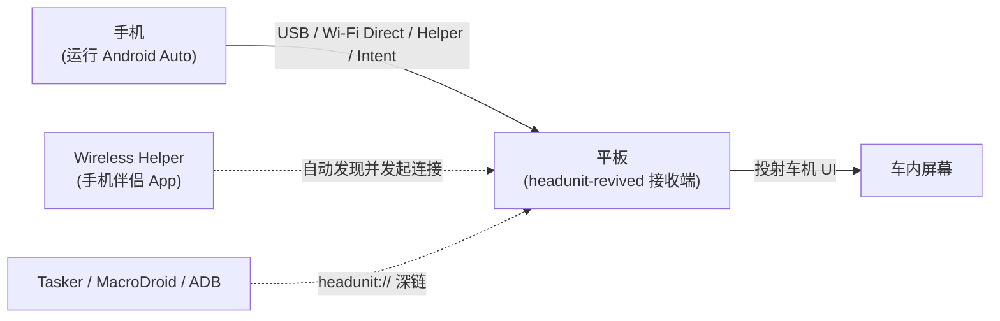

# andreknieriem/headunit-revived 深度研究报告

> Headunit App for displaying Android Auto —— 把任意 Android 平板/手机变成 Android Auto 车载接收端的开源应用。

## 项目概述

andreknieriem/headunit-revived 是一款开源 Android 应用，核心定位是把一台**支持 USB Host 模式的安卓平板（或旧手机）变成 Android Auto 车载接收端（Headunit/Receiver）**。它本身不是导航或音乐软件，而是 Android Auto 协议的"接收方"——你的主力手机仍负责运行 Android Auto，本应用把手机投射出的车机界面、音频与触控承接到平板屏幕上，从而在没有原厂车机的旧车上获得类原厂的驾驶辅助体验。

项目是对已故开发者 Michael Reid 经典开源项目 [mikereidis/headunit](https://github.com/mikereidis/headunit)（C 语言，已于 2018 年停更）的**复活与现代化重写**：用 Kotlin 重构、适配现代 Android 版本、补齐无线 Android Auto 连接，并扩大硬件兼容范围（README 自述最低支持 Android 4.1+/SDK 16）。维护者为 André Rinas（GitHub `andreknieriem`），应用已同时上架 Google Play 与 Amazon Appstore。

项目主语言为 Kotlin（约 128 万字节，占绝对主导，另含少量 Java 7382 字节、Shell 879 字节），采用 **AGPL-3.0** 协议（与原作一致），于 2025 年 10 月 28 日创建。截至 2026 年 6 月 25 日已获 1484 Stars、115 Forks、30 个开放 Issue，并有 30 名贡献者，最新正式版 v.3.0.1 发布于 2026 年 6 月 24 日——是一个起步不到 8 个月却高速迭代的活跃项目。

---

## 基本信息

| 指标 | 数值 |
|------|------|
| Stars | 1484 |
| Forks | 115 |
| 开放 Issues | 30 |
| 语言 | Kotlin（含少量 Java / Shell） |
| 开源协议 | AGPL-3.0 |
| 创建时间 | 2025-10-28 |
| 最近推送 | 2026-06-25 |
| 默认分支 | main |
| 维护者 | André Rinas（andreknieriem） |
| Watchers | 21 |
| 话题标签 | android, androidauto, headunit |
| 最新版本 | v.3.0.1（2026-06-24） |
| GitHub | [https://github.com/andreknieriem/headunit-revived](https://github.com/andreknieriem/headunit-revived) |

---

## 技术分析

### 技术栈

- **语言与平台**：Kotlin 为主（约 128 万字节），目标平台 Android，README 自述最低兼容 Android 4.1+（SDK 16），承继自原作的广覆盖目标。
- **协议核心**：实现 Android Auto 的接收端协议（headunit/receiver 侧）。原始项目 mikereidis/headunit 为 C 语言实现，本项目以 Kotlin 重写并现代化；据社区资料，同源生态普遍基于对 Android Auto 协议的逆向（aasdk 一系），但本仓库自身以 Kotlin 实现协议承接与渲染。[待验证：具体是否内嵌某 C/C++ 协议库，README 未明确]
- **视频/音频**：支持 H.264 / H.265 解码，分辨率从 480p 到 4K 自适应（社区资料与 README 一致）；内置音频混音器，可独立控制导航音、媒体音与通话音的路由。
- **自动化接口**：提供基于 Android Intent 的深链控制（如 `headunit://connect?ip=`、`headunit://exit`、`headunit://disconnect`），可被 Tasker / MacroDroid / ADB 触发，实现车内自动启动与远程控制。

### 架构与连接模型

应用围绕"**手机（AA 发送端）↔ 平板（本应用，接收端）**"两端通信展开，提供四类连接路径：

1. **有线 USB**：手机经 USB 连接平板（平板侧需 USB Host/OTG），最稳定，适合入门。
2. **无线 + Wireless Helper**：在手机上安装配套的 Wireless Helper 伴侣应用，自动发现运行本应用的平板并发起连接；平板侧设为 Helper Mode。
3. **Wi-Fi Direct（P2P）**：自 2.x 起支持点对点直连，无需共享热点或路由器，平板作为 P2P 节点对手机可见，实现零配置发现。
4. **Legacy 无线 / Intent**：兼容 Emil Borconi 的旧版无线启动器路径，以及通过 Intent 深链由自动化工具触发连接。

### 核心功能

- **自动重连**：开启 Auto-Connect Last Session 后，插入 USB 或开机自动恢复上次连接，模拟原厂车机行为。
- **分辨率与 DPI 自适应**：内置自动优化向导，覆盖 480p–4K，针对刘海/挖孔等异形屏做全屏铺满。
- **多语言**：内置 15+ 种语言（含中文）；v3.0.1 的最新提交即包含社区贡献的俄语字符串修复。
- **应用商店分发**：已上架 Google Play 与 Amazon Appstore，降低非技术用户的安装门槛。

---

## 社区活跃度

### 贡献者分析

项目共有 **30 名贡献者**。提交高度集中于核心维护者，但已形成稳定的第二梯队：

| 贡献者 | Commits（contributions） |
|--------|--------------------------|
| andreknieriem（André Rinas，维护者） | 204 |
| andrecuellar | 197 |
| tsabaia | 26 |
| nicoruy | 25 |
| Anton111111 | 22 |
| Bastel2020 | 16 |
| JanRi3D | 13 |

头部两位贡献者合计约 400 次提交，构成项目主力；其后 5–8 位贡献者承担本地化、Wi-Fi 修复等增量工作。README 的更新日志中大量致谢社区 PR，说明项目以"维护者主导 + 社区补丁"的协作模式运转。

### Issue/PR 活跃度

截至 2026-06-25，开放 Issue 为 30 个，相对 1484 Stars 属于较低的未决量，反映维护者响应较及时。最近的合并记录显示 PR 周转很快——例如 #622（俄语字符串修复）在提交当天即被合并。

### 最近动态

最新 10 条提交集中在 2026-06-23 至 06-25，主题包括 Wi-Fi 修复、异常捕获（catching fatal）、发版（releasing 3.0.1）与本地化修订，开发节奏密集，几乎每日有提交。

---

## 发展趋势

### 版本演进

近 10 个 release 显示出"alpha → beta → 正式版"的规范化发布节奏：

| 版本 | 类型 | 发布日期 |
|------|------|----------|
| v.3.0.1 | 正式版 | 2026-06-24 |
| v.3.0.1-alpha | 预览 | 2026-06-20 |
| v.3.0.0 | 正式版 | 2026-06-16 |
| v.3.0.0-beta3 | 预览 | 2026-06-15 |
| v.3.0.0-beta2 | 预览 | 2026-06-04 |
| v.3.0.0-beta1 | 预览 | 2026-06-02 |
| v.2.3.1 | 正式版 | 2026-05-28 |

从 2.3.x 到 3.0.x 的跨越发生在约一个月内，且每个大版本前都有多轮 beta，发布工程相对成熟。

### 演进方向

从更新日志与连接模型看，项目的演进重心在于：**无线连接稳定性**（Wi-Fi Direct、Helper Mode、自动重连）、**显示自适应**（异形屏、4K、自动优化向导）与**自动化集成**（Intent 深链 + Tasker/MacroDroid）。这与"让旧设备稳定长期车载使用"的目标一致。

### 社区反馈与已知问题

README 明示若干已知问题：Google Maps 竖屏模式下触控异常（需把 DPI 调低至 200 以下）、无线连接偶发断流、Self-mode 在 Android 10 上的限制。多家第三方站点（中文媒体、APK 聚合站）已对其报道，反映出"用旧平板省去 4000 元中控"的高性价比卖点正在破圈传播。

---

## 竞品对比

| 项目 | Stars | 语言 | 协议 | 特点 |
|------|-------|------|------|------|
| [andreknieriem/headunit-revived](https://github.com/andreknieriem/headunit-revived) | 1484 | Kotlin | AGPL-3.0 | 本项目；原作的现代化重写，活跃维护，上架双商店 |
| [f1xpl/openauto](https://github.com/f1xpl/openauto) | 2879 | C++ | 无明确 | 树莓派 Android Auto 接收端，社区影响大但已基本停更（2024-12 末次推送） |
| [borconi/headunit（HUR）](https://github.com/borconi/headunit) | 58 | C | AGPL-3.0 | Emil Borconi 的 Headunit Reloaded，付费 APK 的开源侧，2017 停更 |
| [mikereidis/headunit](https://github.com/mikereidis/headunit) | 234 | C | AGPL-3.0 | 本项目的"原作"，Michael Reid 所作，2018 停更 |
| [mossyhub/openautolink](https://github.com/mossyhub/openautolink) | 38 | Kotlin | GPL-3.0 | 面向 AAOS 车机的无线 AA 桥（主攻 GM EV），新兴项目 |

**定位差异**：openauto 主攻树莓派等嵌入式硬件、影响力最大但已停滞；borconi/mikereidis 是同一谱系的前辈但均已多年停更；openautolink 面向的是已有 AAOS 车机的特定场景。headunit-revived 的差异化在于**把"普通安卓平板/旧手机"作为载体 + 持续活跃维护 + 应用商店分发**，在"低成本、易获取、还在更新"三点上同时占优，这也是它 Star 数后来居上的主因。

---

## 总结评价

### 优势

1. **稀缺的"活着的"开源方案**：同谱系前辈（openauto/borconi/mikereidis）几乎全部停更，本项目是少数仍高频迭代（几乎每日提交）的接收端实现。
2. **极高性价比**：用闲置安卓平板替代 600 美元级升级中控，命中明确的真实痛点。
3. **连接方式齐全**：USB、Wireless Helper、Wi-Fi Direct、Intent 自动化四路覆盖，兼顾稳定性与便利性。
4. **分发与本地化成熟**：双应用商店上架、15+ 语言、规范的 alpha/beta/正式发布流程，降低非技术用户门槛。

### 劣势

1. **依赖逆向协议，存在合规与持续性风险**：Android Auto 接收端非官方授权路径，Google 协议变更可能导致功能中断。[推测]
2. **已知稳定性问题**：竖屏地图触控、无线断流、Android 10 Self-mode 限制等仍待打磨。
3. **巴士因子偏高**：核心提交集中于两位贡献者，维护者一旦退出风险较大。
4. **AGPL-3.0 + 上架商业商店**：对二次开发与分发者有较强的开源传染约束，商用集成需谨慎。

### 适用场景

- **个人 DIY 车载**：有旧安卓平板、想低成本给老车加 Android Auto 中控的用户首选。
- **研究 Android Auto 协议/接收端实现**：少数仍在维护、可读性较好的 Kotlin 参考实现。
- **不适合**：需要官方授权、强稳定性 SLA 的商用车机集成场景。

---

*报告生成时间: 2026-06-25*
*研究方法: github-deep-research 多轮深度研究*
