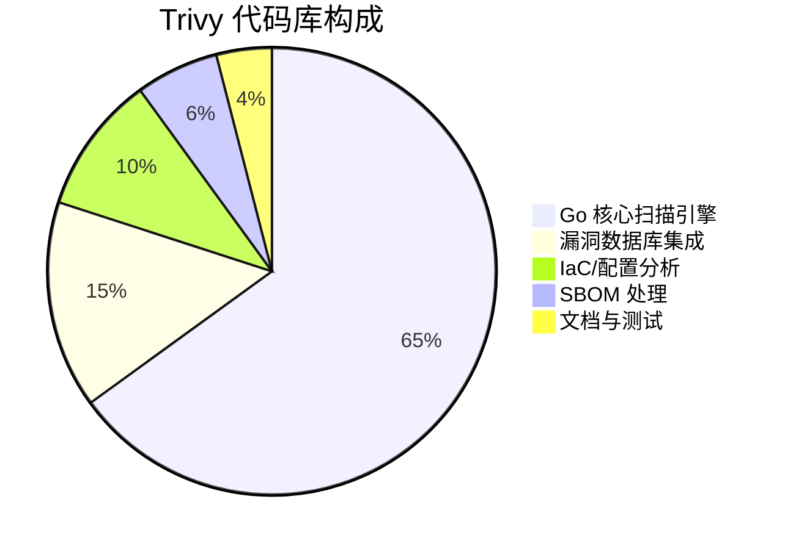
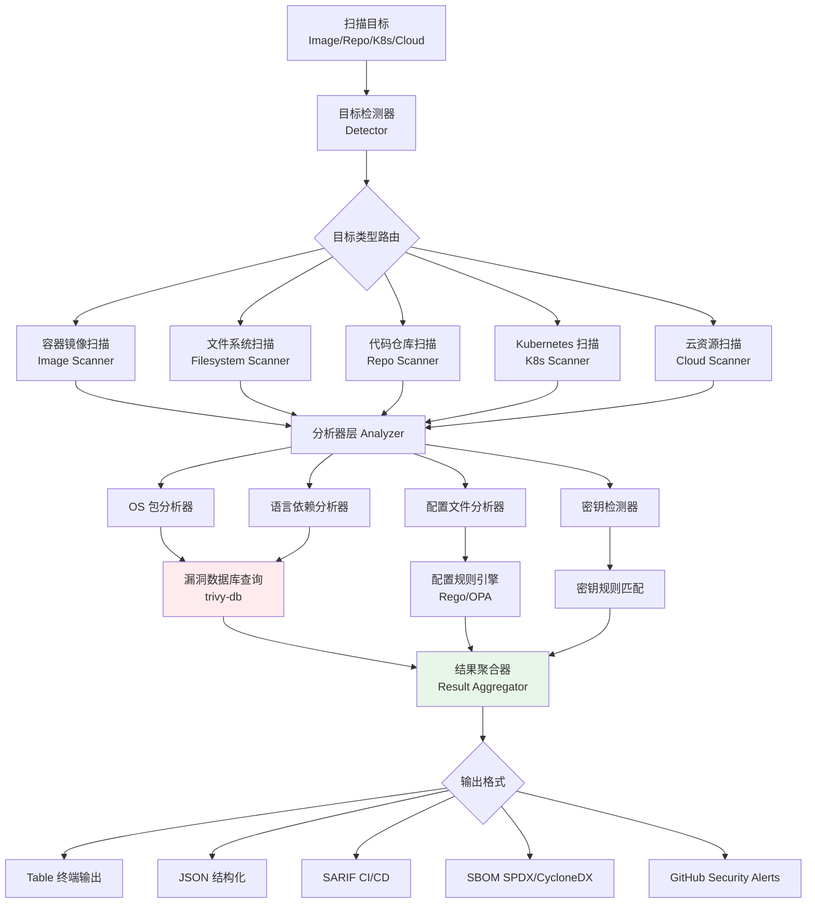
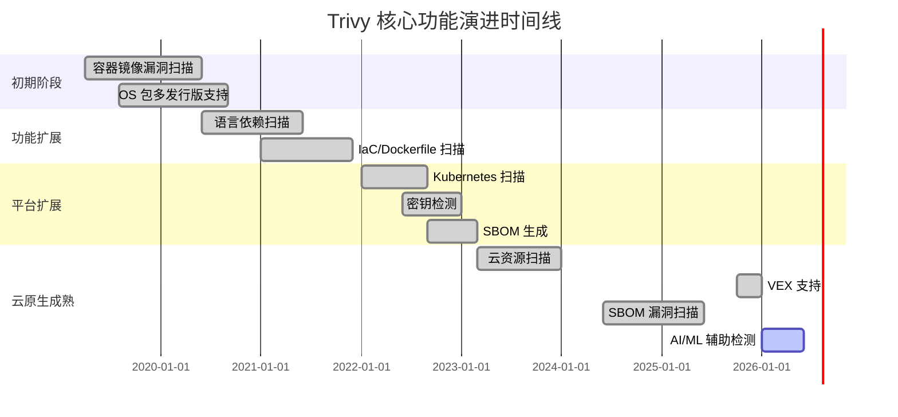

# aquasecurity/trivy

> 业界领先的全面安全扫描工具，覆盖容器镜像、Kubernetes 集群、代码仓库、基础设施即代码（IaC）、云资源的漏洞检测、配置错误发现、密钥泄露扫描与软件物料清单（SBOM）生成，是云原生安全领域的事实标准开源工具。

## 项目概述

Trivy 是由 Aqua Security 开发并开源的综合性安全扫描工具，已成为 DevSecOps 领域应用最广泛的开源安全工具之一。它能够在 CI/CD 流水线的各个阶段对容器镜像、文件系统、Git 仓库、Kubernetes 集群、AWS/GCP/Azure 云资源进行全面安全扫描，检测已知 CVE 漏洞、操作系统包漏洞、应用程序依赖漏洞、Dockerfile 配置问题、Kubernetes RBAC 配置错误以及代码中的硬编码密钥。Trivy 以其简单易用（单命令扫描）、扫描速度快、误报率低而著称，被 CNCF（云原生计算基金会）收录，并集成于众多主流 CI/CD 平台和云服务提供商的安全产品中。

## 基本信息

| 字段 | 详情 |
|------|------|
| **项目名称** | trivy |
| **所有者** | aquasecurity |
| **Stars** | 33,535 ⭐ |
| **今日新增** | +249 ⭐ |
| **Forks** | 约 3,300+ |
| **主要语言** | Go |
| **开源协议** | Apache 2.0 |
| **创建时间** | 2019-04-07 |
| **最近更新** | 2026-03-22 |
| **GitHub 链接** | [https://github.com/aquasecurity/trivy](https://github.com/aquasecurity/trivy) |
| **Topics** | security、vulnerability-scanner、container、kubernetes、devsecops、sbom、cncf |
| **CNCF 状态** | 孵化项目（Incubating） |

## 技术分析

### 技术栈

**核心技术组件：**

| 层次 | 技术 | 说明 |
|------|------|------|
| **语言** | Go 1.21+ | 高性能、跨平台编译，适合安全工具分发 |
| **漏洞数据库** | ghcr.io/aquasecurity/trivy-db | 每日更新的自托管 CVE 数据库，聚合 NVD/OVAL/RedHat 等 |
| **操作系统检测** | 自研解析器 | 支持 30+ Linux 发行版包管理格式检测 |
| **应用依赖扫描** | 自研 + OSV | 覆盖 npm、pip、Maven、Gradle、Go modules、Cargo 等 |
| **IaC 扫描** | Rego（OPA）规则引擎 | Terraform、CloudFormation、Kubernetes YAML 配置检查 |
| **密钥扫描** | 自研正则 + ML 辅助 | 检测 AWS keys、GitHub tokens、私钥等 300+ 类型 |
| **SBOM** | SPDX 2.3 / CycloneDX 1.4 | 生成软件物料清单，符合 NTIA 最低标准 |
| **缓存** | BoltDB（本地）/ Redis（分布式）| 扫描结果缓存，加速重复扫描 |
| **并发** | goroutine 池 | 并行层分析，大镜像扫描性能卓越 |

### 架构设计

**架构设计亮点：**

1. **插件化分析器**：采用接口抽象，各类目标（OS包/应用依赖/IaC/密钥）使用独立分析器模块，方便扩展新的检测能力
2. **本地化漏洞数据库**：trivy-db 每日从多源同步并打包，扫描时全程离线，避免依赖外部服务的网络问题
3. **层缓存机制**：容器镜像按层（Layer）缓存扫描结果，相同基础镜像层只扫描一次，大幅提升 CI/CD 中的重复扫描效率
4. **WASM 策略插件**：支持使用 Rego/WASM 自定义合规策略，满足企业特定安全要求

### 核心功能

| 功能类别 | 功能描述 |
|----------|----------|
| **容器镜像漏洞扫描** | 检测镜像中 OS 包（Alpine/Ubuntu/CentOS 等）和应用依赖的已知 CVE |
| **文件系统扫描** | 扫描本地目录、压缩包中的漏洞和配置问题 |
| **代码仓库扫描** | 扫描 GitHub/GitLab 仓库的代码依赖漏洞和密钥泄露 |
| **Kubernetes 安全** | 检测集群中的配置错误、RBAC 过度权限、CIS Benchmark 合规性 |
| **云资源扫描** | 扫描 AWS/GCP/Azure 云资源的安全配置问题 |
| **IaC 扫描** | 扫描 Terraform/Helm/CloudFormation/Dockerfile 的安全配置 |
| **密钥检测** | 扫描代码中的 300+ 类型硬编码密钥和凭据 |
| **SBOM 生成** | 生成 SPDX/CycloneDX 格式的软件物料清单 |
| **SBOM 扫描** | 直接扫描已有 SBOM 文件，检测其中组件的漏洞 |
| **许可证扫描** | 检测依赖包的开源协议合规性 |

## 社区活跃度

### 贡献者分析

Trivy 是由企业（Aqua Security）主导的开源项目，拥有强大的专职工程师团队支持：

- **核心团队**：Aqua Security 的 5-10 名全职工程师负责主要功能开发
- **社区贡献者**：来自全球 400+ 贡献者，覆盖各大科技公司（Google、Microsoft、Red Hat、Snyk 等员工）
- **顾问委员会**：CNCF 孵化项目，受益于 CNCF 生态的持续关注
- **贡献分布**：Aqua 团队贡献约 70%，社区贡献约 30%，主要包括新 OS 支持、语言生态适配

### Issue/PR 活跃度

| 指标 | 情况 |
|------|------|
| **Issue 总数** | 3,000+ 个（open/closed 合计） |
| **Open Issues** | 约 300-400 个活跃 |
| **月均 PR 合并** | 50-80 个 |
| **平均响应时间** | < 2 天（工作日） |
| **Release 频率** | 约每 2-3 周一个小版本 |
| **漏洞数据库更新** | 每 24 小时自动更新 |

### 最近动态

- **2026-03** 发布 v0.60.x，增强 Kubernetes 扫描的 RBAC 权限分析能力
- **2026-02** 新增对 Swift Package Manager 和 Cocoapods 的依赖扫描支持
- **2026-01** 集成 VEX（Vulnerability Exploitability eXchange）文档支持，允许抑制误报
- **2025-12** 改善 SBOM 生成质量，完整支持 CycloneDX 1.6 规范
- **2025-11** Trivy Operator 更新，支持 Kubernetes 持续扫描模式
- **2025-10** 新增对 GitHub Actions 工作流的安全配置检查

## 发展趋势

### 版本演进

### Roadmap

Aqua Security 公开的 Trivy 发展方向：

1. **可达性分析（Reachability Analysis）**：通过静态代码分析，判断漏洞代码路径是否实际可达，大幅降低高优先级误报
2. **供应链安全增强**：SLSA（供应链等级）验证，Sigstore 签名验证集成
3. **运行时扫描**：与 Aqua Runtime 联动，检测容器运行时行为异常
4. **AI 辅助分析**：引入 LLM 对漏洞的可利用性和修复方案提供智能建议
5. **多云统一管理**：统一的跨云资源安全态势管理视图

### 社区反馈

Trivy 在 DevSecOps 社区获得极高评价，被多家权威机构认可：

- **CNCF Sandbox → Incubating**：2023 年升级为 CNCF 孵化项目，认可度持续提升
- **Gartner 报告引用**：在容器安全工具评估报告中被多次提及
- **KubeCon 演讲**：Aqua 团队每年在 KubeCon 分享 Trivy 新进展，社区认知度高
- **企业采用**：GitLab、Harbor（CNCF）等主流平台原生集成 Trivy

## 竞品对比

| 工具 | 类型 | Stars/定价 | 扫描范围 | 速度 | 误报率 | 维护状态 |
|------|------|------------|----------|------|--------|----------|
| **Trivy** | 开源 | 33,535 ⭐ | 极广（镜像/K8s/IaC/密钥/SBOM）| ⭐⭐⭐⭐⭐ | ⭐⭐⭐⭐ 低 | 积极 |
| **Grype (Anchore)** | 开源 | ~8,000 ⭐ | 镜像/文件系统漏洞 | ⭐⭐⭐⭐ | ⭐⭐⭐⭐ | 活跃 |
| **Snyk** | 商业/免费版 | 商业产品 | 代码/镜像/IaC/云 | ⭐⭐⭐⭐ | ⭐⭐⭐ | 商业支持 |
| **Clair** | 开源 | ~10,000 ⭐ | 容器镜像 | ⭐⭐⭐ | ⭐⭐⭐ | 维护中 |
| **Checkov** | 开源 | ~7,000 ⭐ | IaC/政策扫描 | ⭐⭐⭐⭐ | ⭐⭐⭐ | 活跃 |
| **SonarQube** | 开源/商业 | ~9,000 ⭐ | 代码质量/安全 | ⭐⭐⭐ | ⭐⭐⭐ | 活跃 |
| **Twistlock/Prisma** | 商业 | 商业产品 | 全栈云安全 | ⭐⭐⭐⭐ | ⭐⭐⭐⭐ | 商业 |

**Trivy 核心竞争优势**：在开源工具中扫描覆盖面最广、单工具替代多工具组合、安装部署最简单（单二进制）、社区最活跃。

## 总结评价

### 优势

1. **覆盖面无与伦比**：单一工具覆盖漏洞扫描、配置检查、密钥扫描、SBOM 生成全链条，减少工具链碎片化
2. **极致易用性**：`trivy image nginx:latest` 一条命令即可完成镜像扫描，学习曲线极低
3. **漏洞数据库质量高**：聚合 NVD、OVAL、RubyAdvisory、npm Advisory 等多源数据，且每日更新
4. **CI/CD 深度集成**：原生支持 GitHub Actions、GitLab CI、Jenkins、Argo CD 等主流平台
5. **企业背书 + 开源**：Aqua Security 专职团队维护，商业驱动确保长期稳定；Apache 2.0 协议无商业限制
6. **CNCF 生态加持**：作为 CNCF 孵化项目，在 Kubernetes 社区具有天然的信任背书

### 劣势

1. **深度漏洞分析有限**：相较专业 SAST 工具（如 SonarQube），代码级静态分析能力较弱
2. **可达性分析待完善**：当前版本不能判断漏洞是否实际可被利用，可能产生高量低优先级告警
3. **大型镜像扫描时间**：超大型镜像（>2GB）的首次扫描仍需较长时间
4. **Aqua 商业依赖**：核心方向受 Aqua Security 商业战略影响，纯社区驱动能力有限
5. **云扫描深度**：云资源扫描（AWS/GCP）相比 Checkov 等专项 IaC 工具深度稍逊

### 适用场景

| 场景 | 适用性 | 说明 |
|------|--------|------|
| **CI/CD 流水线安全门禁** | ⭐⭐⭐⭐⭐ | 镜像构建后自动扫描，阻断含高危 CVE 的版本发布 |
| **容器镜像漏洞扫描** | ⭐⭐⭐⭐⭐ | 核心强项，扫描速度快、准确率高 |
| **Kubernetes 安全审计** | ⭐⭐⭐⭐⭐ | CIS Benchmark 合规检查，K8s 配置安全评估 |
| **SBOM 生成与管理** | ⭐⭐⭐⭐⭐ | 满足 NTIA/EO14028 软件供应链合规要求 |
| **IaC 安全扫描** | ⭐⭐⭐⭐ | Terraform/Helm 配置检查 |
| **密钥泄露检测** | ⭐⭐⭐⭐ | 有效发现硬编码凭据 |
| **代码深度安全分析** | ⭐⭐ | 不适合替代专业 SAST 工具 |

**总体评分**：⭐⭐⭐⭐⭐ (5/5)

Trivy 是云原生安全领域当之无愧的明星开源项目，以其广泛的扫描覆盖、简单的使用体验和活跃的社区维护，已成为 DevSecOps 工具链中的必备组件。无论是初创公司的快速安全建设，还是大型企业的合规审计，Trivy 都能提供出色的支持。随着软件供应链安全法规趋严（如美国 EO14028、欧盟 CRA），SBOM 和漏洞扫描将成为软件发布的强制要求，Trivy 的战略价值将持续提升。

---
*报告生成时间: 2026-03-22 11:00:00*
*研究方法: GitHub API + Web搜索深度研究*
