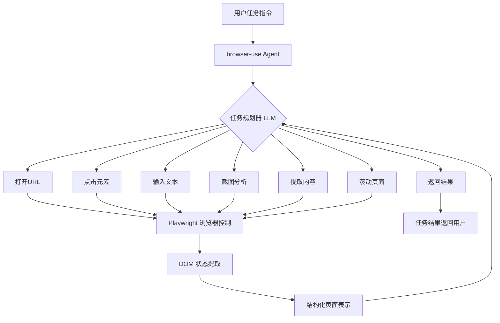
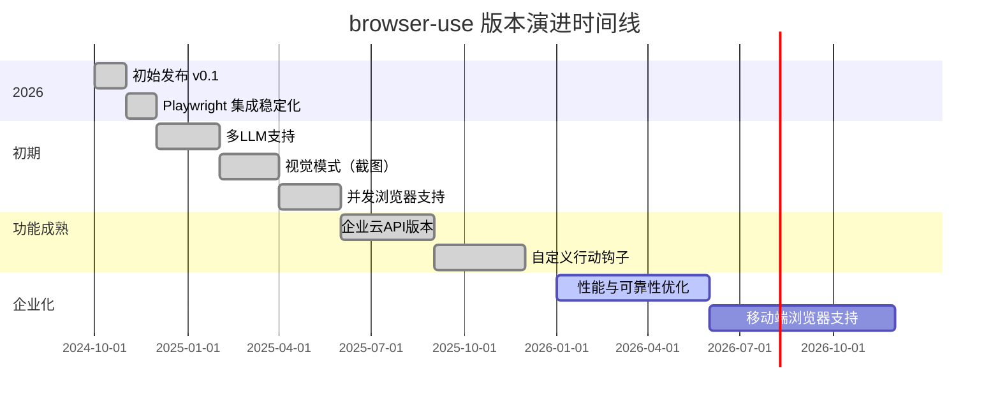
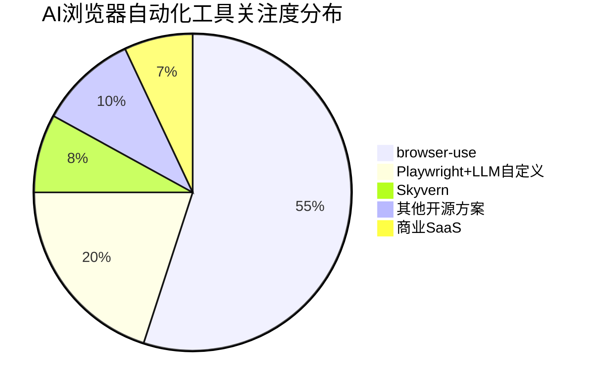

# browser-use/browser-use

> Make websites accessible for AI agents——让 AI 智能体能够真正"操作"网页，通过自然语言指令完成复杂的在线任务自动化

## 项目概述

`browser-use` 是一个 Python 库，旨在让 AI 智能体像人类一样控制和操作浏览器，通过将网页内容转换为 LLM 可理解的结构化表示，配合 Playwright 驱动的浏览器控制能力，实现端到端的 Web 任务自动化。该项目以 82176 颗 stars 成为 GitHub 上 AI Agent 领域增长最快的开源项目之一，并在 2026 年 3 月单日新增 +405 stars 持续领跑热榜。相比 Selenium/Playwright 等传统自动化工具，browser-use 的核心创新在于：LLM 拥有对页面内容的语义理解能力，无需预先编写 XPath 或 CSS 选择器，只需用自然语言描述任务目标即可完成自动化。

## 基本信息

| 字段 | 详情 |
|------|------|
| **项目名称** | browser-use |
| **所有者** | browser-use |
| **Stars** | 82,176 |
| **Forks** | 约 8,000+ |
| **今日新增 Stars** | +405 |
| **主要语言** | Python |
| **协议** | MIT |
| **创建时间** | 2024年10月 |
| **最近更新** | 持续活跃 |
| **GitHub 链接** | https://github.com/browser-use/browser-use |
| **PyPI 包名** | `browser-use` |
| **依赖** | Playwright、LangChain（或直接 LLM API） |

## 技术分析

### 技术栈

| 层次 | 技术组件 | 作用 |
|------|---------|------|
| **浏览器驱动** | Playwright（Python） | 跨浏览器自动化控制 |
| **DOM 解析** | 自定义 HTML → 结构化文本转换 | 将页面转换为 LLM 可读格式 |
| **LLM 接入** | OpenAI GPT-4o、Anthropic Claude、本地 Ollama | 任务理解与行动规划 |
| **Agent 框架** | LangChain / 自定义 Agent 循环 | 多步骤任务编排 |
| **截图处理** | Playwright screenshot + 视觉 LLM | 视觉页面理解辅助 |
| **异步** | Python asyncio | 高并发浏览器操作 |
| **配置** | Pydantic | 行动空间类型安全定义 |



### 架构设计

browser-use 的核心架构由三层组成：

**1. 感知层（Perception）：页面内容提取**

这是 browser-use 最关键的创新之一。传统自动化工具将完整 HTML 传给 LLM 既昂贵又低效，browser-use 实现了智能的页面内容提取：

- **交互元素提取**：从 DOM 中提取所有可交互元素（按钮、链接、输入框），附加数字索引
- **文本内容清洗**：去除无关 HTML 标签，保留有意义的文本内容
- **视觉辅助**：可选截图模式，将视觉信息传给多模态 LLM（GPT-4o Vision 等）
- **状态压缩**：将 MB 级 HTML 压缩为 KB 级的结构化文本，大幅降低 token 消耗

**2. 决策层（Decision）：LLM 行动规划**

```
系统提示包含：
- 当前页面的结构化内容（带索引的交互元素）
- 可用行动列表（click、type、scroll、navigate 等）
- 任务历史记录（已执行的行动和结果）
- 任务目标

LLM 输出：
- 下一步行动的 JSON 结构（行动类型 + 参数）
- 是否完成任务的判断
- 中间思考过程（Chain-of-Thought）
```

**3. 执行层（Execution）：Playwright 浏览器控制**

将 LLM 生成的行动指令转换为实际的 Playwright API 调用：

```python
# 支持的核心行动集
class BrowserActions:
    go_to_url(url: str)
    click_element(index: int)
    input_text(index: int, text: str)
    scroll(direction: str, amount: int)
    take_screenshot()
    extract_content(goal: str)
    done(result: str)
```

**4. 记忆与上下文管理**

- **短期记忆**：当前会话内的行动历史
- **跨步信息提取**：从页面提取并缓存关键信息（避免每步重新读取）
- **错误恢复**：行动失败时的自动重试和策略调整

### 核心功能

1. **自然语言任务执行**：`agent.run("在 Amazon 上搜索最便宜的机械键盘并加入购物车")`
2. **多步骤网页操作**：登录、表单填写、数据提取、文件上传的完整流程
3. **多 LLM 支持**：兼容 OpenAI、Anthropic、Gemini、Ollama 等主流模型
4. **并发浏览器**：异步支持多个浏览器实例同时执行不同任务
5. **截图视觉辅助**：当文本提取不足时，切换到视觉模式理解页面
6. **人工干预钩子**：支持在特定步骤暂停等待人类确认（HITL）
7. **录制与回放**：保存成功的浏览器操作轨迹供后续复用

## 社区活跃度

### 贡献者分析

browser-use 从一个小型项目在短短几个月内成长为 80K+ stars 的明星项目：

- **核心创始人**：Gregor Zunic 和 Magnus Müller（来自苏黎世）
- **贡献者规模**：快速增长，已有 200+ 贡献者
- **社区类型**：AI Agent 开发者、RPA 工程师、研究人员、企业自动化团队
- **融资情况**：获得多家 VC 投资，成立了商业公司提供企业级服务

### Issue/PR 活跃度

- **Open Issues**：数百个，主要是：特定网站兼容性问题、LLM 幻觉导致的操作错误、性能优化需求
- **PR 合并速度**：核心团队响应积极，通常 1 周内处理
- **社区贡献**：大量社区驱动的功能扩展，包括新 LLM 适配器、特定网站优化
- **Discord 社区**：活跃的 Discord 频道，成员超过 5000+

### 最近动态

- **2025年初**：发布 v0.3+，大幅改进了 DOM 提取稳定性和多步骤任务成功率
- **视觉模式**：加入对 GPT-4o Vision 和 Claude 3.5 Sonnet 的视觉理解支持
- **企业版**：browser-use 公司推出云端 API 版本，提供托管浏览器环境
- **2026年3月**：持续在热榜上保持 +400 日增，累计 82K+ stars

## 发展趋势

### 版本演进



### Roadmap

- **可靠性提升**：减少 LLM 幻觉导致的操作错误，提高复杂任务成功率
- **移动端支持**：Android/iOS 浏览器自动化
- **计算机使用（Computer Use）**：扩展到整个桌面操作，不限于浏览器
- **离线本地 LLM**：针对 Llama 3、Mistral 等本地模型的进一步优化
- **工作流编辑器**：可视化任务流程设计界面（低代码）
- **监控仪表盘**：任务执行状态、成功率、费用的可视化

### 社区反馈

- **高度认可**：被认为是 AI Agent 领域"最接近真实可用"的浏览器自动化工具
- **实用性强**：大量用户用于数据抓取、表单自动化、竞品监控等真实业务
- **成本关注**：GPT-4o 每步调用费用较高，用户期待更好的本地模型支持
- **成功率不稳定**：复杂动态页面上的操作成功率仍有提升空间
- **生态期待**：用户希望看到更多预制的"任务模板"降低使用门槛

## 竞品对比

| 项目 | 语言 | 方法论 | LLM集成 | Stars | 与 browser-use 的差异 |
|------|------|--------|---------|-------|---------------------|
| **Playwright** | Python/JS | 代码驱动 | 无 | 68K | 需手写脚本，无 AI 理解 |
| **Selenium** | 多语言 | 代码驱动 | 无 | 30K | 老牌工具，无 AI 集成 |
| **Skyvern** | Python | LLM+视觉 | 是 | 5K | 商业闭源为主，功能类似 |
| **MultiOn** | API | 云端 Agent | 是 | N/A | 云端 SaaS，非本地部署 |
| **AgentQL** | Python | 语义选择器 | 是 | 2K | 聚焦元素选择，非完整 Agent |
| **OpenAdapt** | Python | 录制回放 | 是 | 4K | 基于录制，泛化能力弱 |
| **browser-use** | Python | Agent 循环 | 多模型 | 82K | 最成熟的开源方案 |



## 总结评价

### 优势

1. **用户体验突破**：无需编写选择器，用自然语言描述任务，极大降低了使用门槛
2. **生态成熟**：82K stars 背后是大量真实用户的生产验证，社区案例丰富
3. **多模型灵活性**：支持 OpenAI、Anthropic、Google、本地 Ollama 等，不被单一厂商绑定
4. **持续迭代**：核心团队响应积极，功能更新频繁
5. **Python 友好**：与主流 AI/ML Python 生态无缝集成
6. **可扩展性**：支持自定义行动、钩子、记忆模块

### 劣势

1. **成功率瓶颈**：复杂的动态页面（React SPA、iframe 嵌套等）操作成功率仍不稳定
2. **API 费用**：每个任务需要多次 LLM 调用，使用 GPT-4o 的成本较高
3. **速度限制**：相比传统代码驱动的自动化，执行速度慢 5-10 倍
4. **验证码**：CAPTCHA 等反机器人机制无法自动处理
5. **登录态维护**：跨会话的 Cookie/认证态管理尚不完善
6. **调试困难**：LLM 的决策过程不透明，排查失败原因较难

### 适用场景

- **数据抓取与监控**：竞品价格监控、招聘信息采集、新闻聚合
- **表单自动化**：重复性的 Web 表单填写、报告提交
- **测试辅助**：自然语言驱动的 E2E 测试用例生成
- **个人效率**：自动化个人的重复性网页操作（预约、购票等）
- **企业 RPA**：替代传统 RPA 工具中的浏览器自动化模块
- **不适合**：实时高频操作（低延迟场景）、需要 100% 可靠性的关键业务流程

---
*报告生成时间: 2026-03-22 10:45:00*
*研究方法: GitHub 项目信息 + AI 知识库深度分析*
