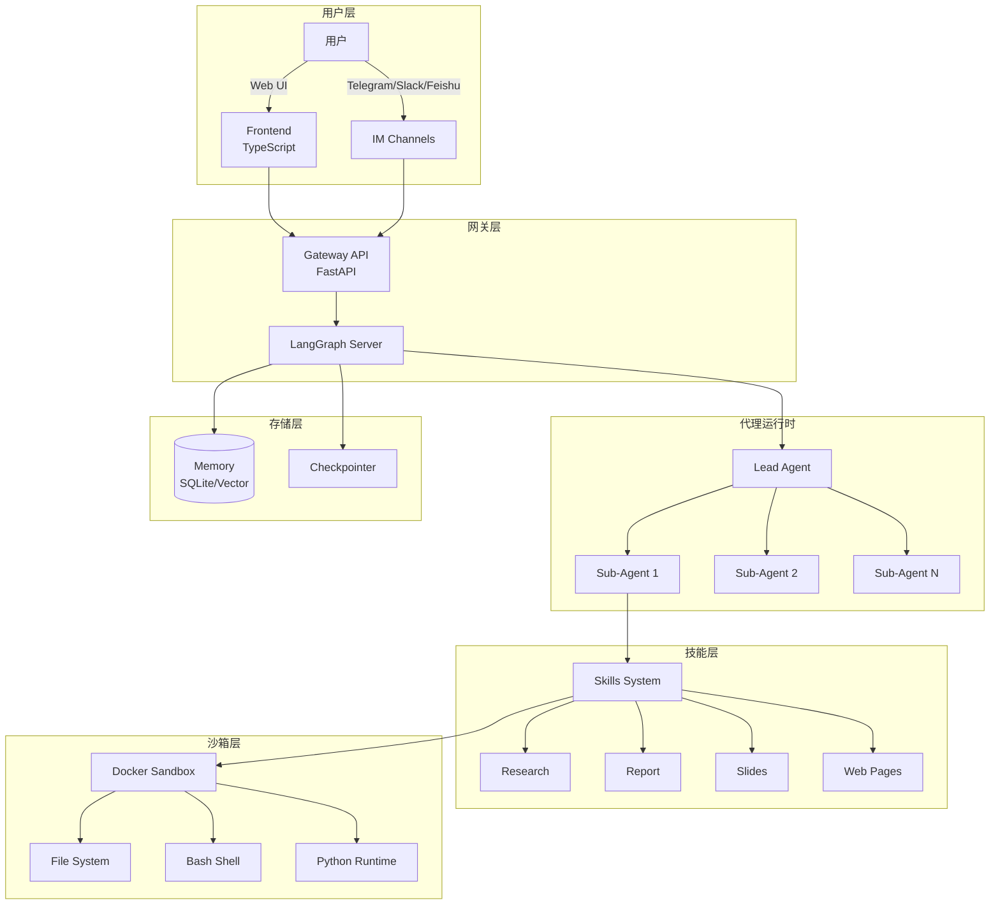
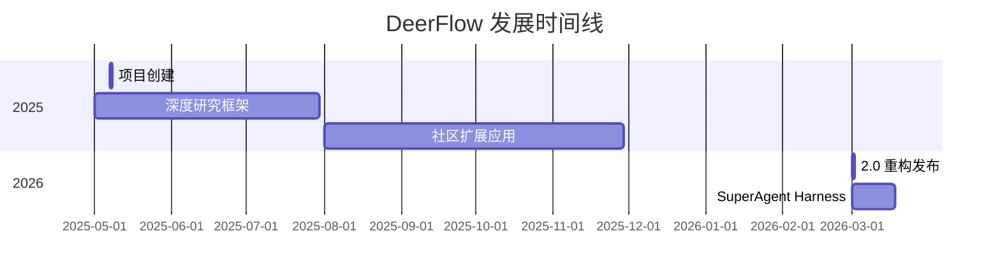

# bytedance/deer-flow

> An open-source SuperAgent harness that researches, codes, and creates. With the help of sandboxes, memories, tools, skills and subagents, it handles different levels of tasks that could take minutes to hours.

## 项目概述

DeerFlow（Deep Exploration and Efficient Research Flow）是字节跳动开源的 SuperAgent 框架，基于 LangGraph 和 LangChain 构建。与普通聊天机器人不同，DeerFlow 拥有真正的"计算机"——一个隔离的沙箱环境，具备完整文件系统、Shell 访问和代码执行能力。它能够研究、编码、创建网站、生成幻灯片和视频内容，处理从分钟到小时级别的复杂任务。

## 基本信息

| 指标 | 数值 |
|------|------|
| Stars | 34,243 ⭐ (+1508 今日新增) |
| Forks | 3,786 |
| 语言 | Python |
| 开源协议 | MIT |
| Open Issues | 261 |
| 创建时间 | 2025-05-07 |
| 最近更新 | 2026-03-17 |
| GitHub | [bytedance/deer-flow](https://github.com/bytedance/deer-flow) |

### 语言分布

| 语言 | 代码行数 | 占比 |
|------|----------|------|
| Python | 1.19M | 58.7% |
| TypeScript | 641K | 31.6% |
| HTML | 201K | 9.9% |
| CSS | 89K | 4.4% |
| JavaScript | 75K | 3.7% |
| 其他 | 75K+ | 3.7% |

### Topics 标签

`agent`, `agentic-framework`, `ai-agents`, `bytedance`, `deep-research`, `langchain`, `langgraph`, `multi-agent`, `superagent`, `sandbox`

## 技术分析

### 架构设计

DeerFlow 采用微服务架构，核心组件包括 Agent Runtime、REST API Gateway、Web Frontend 和可选的 Sandbox Provisioner：



#### 核心组件

1. **Lead Agent（主代理）**
   - 任务分解和规划
   - 子代理调度和协调
   - 结果聚合和输出

2. **Sub-Agents（子代理）**
   - 独立的上下文隔离
   - 并行执行能力
   - 结构化结果汇报

3. **Sandbox（沙箱）**
   - Docker 容器隔离
   - 完整文件系统
   - Bash 命令执行
   - 代码运行环境

4. **Memory System（记忆系统）**
   - 短期会话记忆
   - 长期用户画像
   - 向量检索支持

### 技术栈

| 组件 | 技术选型 |
|------|----------|
| 框架基础 | LangGraph + LangChain |
| 后端语言 | Python |
| 前端语言 | TypeScript |
| API 框架 | FastAPI |
| 沙箱运行时 | Docker |
| 数据库 | SQLite |
| 向量存储 | 可配置 |
| LLM 接口 | OpenAI 兼容 API |

### 核心功能模块

#### 1. Skills & Tools（技能与工具）

技能是结构化的能力模块，以 Markdown 文件定义工作流和最佳实践：

```
/mnt/skills/public/
├── research/SKILL.md          # 深度研究
├── report-generation/SKILL.md # 报告生成
├── slide-creation/SKILL.md    # 幻灯片创建
├── web-page/SKILL.md          # 网页生成
└── image-generation/SKILL.md  # 图像生成
```

**特点**：
- 按需加载，保持上下文精简
- 支持自定义技能扩展
- MCP 服务器集成

#### 2. Sub-Agents（子代理系统）

复杂任务分解为多个子任务，每个子代理独立运行：

- **上下文隔离**：子代理无法访问主代理或其他子代理上下文
- **并行执行**：多个子代理可同时运行
- **结果聚合**：主代理综合所有子代理输出

#### 3. Sandbox & File System（沙箱与文件系统）

```
/mnt/user-data/
├── uploads/    # 用户上传文件
├── workspace/  # 代理工作目录
└── outputs/    # 最终输出
```

**沙箱模式**：
- **Local Execution**：直接在主机执行
- **Docker Execution**：Docker 容器隔离
- **Kubernetes Execution**：K8s Pod 执行

#### 4. Context Engineering（上下文工程）

- **子代理上下文隔离**：确保专注任务
- **智能摘要**：压缩已完成子任务
- **中间结果卸载**：存储到文件系统

#### 5. Long-Term Memory（长期记忆）

跨会话持久化用户画像、偏好和知识：
- 写作风格学习
- 技术栈记忆
- 工作流模式识别

### IM Channel 支持

| 渠道 | 传输方式 | 难度 |
|------|----------|------|
| Telegram | Bot API (long-polling) | 简单 |
| Slack | Socket Mode | 中等 |
| Feishu/Lark | WebSocket | 中等 |

**支持的命令**：
- `/new` - 开始新对话
- `/status` - 显示线程信息
- `/models` - 列出可用模型
- `/memory` - 查看记忆
- `/help` - 显示帮助

## 社区活跃度

### 贡献者分析

| 指标 | 数值 |
|------|------|
| 总贡献者 | 100+ |
| 核心作者 | Daniel Walnut, Henry Li |
| 企业背景 | 字节跳动 |

### Issue/PR 活跃度

- **Open Issues**: 261
- **响应速度**: 活跃维护
- **文档质量**: 完善的配置指南和架构文档

### 最近动态

**DeerFlow 2.0 重大更新**（2026-03）：
- 从框架重构为 SuperAgent Harness
- 新增子代理系统
- 增强沙箱隔离
- Claude Code 集成技能
- 多渠道 IM 支持

## 发展趋势

### 版本演进



### 增长数据

- **Stars 增长**: 从 0 到 3.1 万约 10 个月
- **Fork 增长**: 3,786 Fork
- **媒体报道**: MarkTechPost、SitePoint 等技术媒体专题报道

### Roadmap 方向

1. **企业级部署**
   - Kubernetes 生产支持
   - 多租户架构
   - 审计和合规

2. **多模态增强**
   - 视频生成能力
   - 图像理解增强
   - 音频处理

3. **生态系统**
   - 技能市场
   - 社区贡献模板
   - 企业解决方案

## 竞品对比

| 项目 | Stars | 语言 | 特点 | 沙箱执行 |
|------|-------|------|------|----------|
| **DeerFlow** | 31K | Python | 字节出品、全功能 Harness | ✅ Docker |
| LangGraph | 40K+ | Python | 图编排、官方支持 | ❌ 需自建 |
| AutoGen | 35K+ | Python | 微软出品、对话式 | ⚠️ 有限 |
| CrewAI | 30K+ | Python | 角色扮演、快速原型 | ❌ 需自建 |
| OpenHands | 35K+ | Python | 自主开发、浏览器 | ✅ Docker |

### 核心差异化

1. **vs LangGraph**
   - DeerFlow: 开箱即用、内置沙箱和记忆
   - LangGraph: 纯编排框架、需自行集成

2. **vs AutoGen**
   - DeerFlow: 图编排、生产级沙箱
   - AutoGen: 对话式、多代理辩论

3. **vs CrewAI**
   - DeerFlow: 企业级基础设施
   - CrewAI: 快速原型、角色 DSL

### 性能对比（参考）

| 框架 | 准确率 | 速度 | 生产就绪 |
|------|--------|------|----------|
| DeerFlow | 高 | 中 | ✅ |
| LangGraph | 94% | 快 | ✅ |
| AutoGen | 中 | 快 20% | ⚠️ |
| CrewAI | 中 | 5.76X 快 | ❌ |

## 适用场景

### 最佳场景

1. **深度研究自动化**
   - 多源信息检索
   - 报告自动生成
   - 数据分析流水线

2. **内容创作**
   - 幻灯片生成
   - 网站构建
   - 多媒体内容

3. **复杂工作流**
   - 多步骤任务
   - 需要代码执行
   - 长时间运行任务

### 不适用场景

1. **简单问答**：资源消耗较大
2. **实时交互**：沙箱启动有延迟
3. **非技术用户**：配置门槛较高

## 部署模式

### Docker 部署（推荐）

```bash
make docker-init    # 拉取沙箱镜像
make docker-start   # 启动服务
```

### 本地开发

```bash
make config         # 生成配置
make install        # 安装依赖
make dev            # 启动服务
```

### 嵌入式 Python 客户端

```python
from deerflow.client import DeerFlowClient

client = DeerFlowClient()
response = client.chat("Analyze this paper")
```

## 总结评价

### 优势

- **开箱即用**: 内置沙箱、记忆、技能系统
- **企业级架构**: 微服务、可扩展、生产就绪
- **字节背书**: 大厂开源、持续维护
- **多渠道支持**: Web、Telegram、Slack、飞书
- **模型无关**: 支持所有 OpenAI 兼容 API
- **子代理系统**: 复杂任务分解能力

### 劣势

- **资源消耗**: Docker 沙箱需要较多资源
- **配置复杂**: 功能丰富带来配置复杂度
- **学习曲线**: 需要理解 LangGraph 概念
- **中文文档**: 主要文档为英文

### 适用场景

1. **企业研发团队**: 需要自动化研究和开发
2. **内容创作者**: 需要多模态内容生成
3. **研究人员**: 需要深度研究自动化
4. **技术团队**: 有能力部署和维护

### 推荐指数

| 用户类型 | 推荐度 |
|----------|--------|
| 企业研发团队 | ⭐⭐⭐⭐⭐ |
| 技术研究者 | ⭐⭐⭐⭐⭐ |
| 内容创作者 | ⭐⭐⭐⭐ |
| 独立开发者 | ⭐⭐⭐⭐ |
| 非技术用户 | ⭐⭐ (配置门槛) |

---
*报告生成时间: 2026-03-17*
*研究方法: github-deep-research 多轮深度分析*
*数据来源: GitHub API, Web Search, 官方文档*
