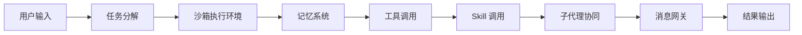

# bytedance/deer-flow

> An open-source long-horizon SuperAgent harness that researches, codes, and creates. With the help of sandboxes, memories, tools, skill, subagents and message gateway, it handles different levels of tasks that could take minutes to hours.

## 项目概述

DeerFlow 是字节跳动开源的长时任务 Agent 系统，定位介于学术研究原型和商业产品之间。不同于 LangGraph/LangChain 等通用框架，DeerFlow 强调"可观测、可理解、可信赖"——集成沙箱、记忆系统、工具调用、Skill 调用、子代理和消息网关，支持从分钟级到小时级的多层次任务。2025 年 5 月上线，2026 年 2 月 28 日登顶 GitHub Trending榜首，体现了其在复杂任务处理领域的高受欢迎程度。

## 基本信息

| 指标 | 数值 |
|------|------|
| Stars | 48,091 |
| Forks | 5,728 |
| Open Issues | 366 |
| 语言 | Python (65.4%), TypeScript (27.5%), HTML, CSS, JavaScript |
| 开源协议 | MIT |
| 创建时间 | 2025-05-07 |
| 最近更新 | 2026-03-26 |
| 贡献者 | 100 人 |
| GitHub | [bytedance/deer-flow](https://github.com/bytedance/deer-flow) |

## 技术分析

### 技术栈

- **Python 3.12+ 主导**：后端推理，LangChain/LangGraph 为核心
- **LangGraph 状态机**：图状状态机，状态节点定义和状态边路由
- **LangChain 工具**：多模型接入、工具调用、记忆管理
- **TypeScript 前端**：交互界面，用户体验优化

### 架构设计

DeerFlow 采用完整 Agent 全栈架构：

### 核心功能

- **沙箱执行**：安全隔离的代码执行环境
- **记忆系统**：长期记忆和短期记忆，支持任务上下文保持
- **多工具调用**：搜索、代码执行、文件操作等
- **Skill 系统**：可扩展的技能模块
- **子代理协同**：多 Agent 协作处理复杂任务
- **消息网关**：统一的消息管理和路由

## 社区活跃度

### 贡献者分析

100 位贡献者（达到 GitHub 上限），说明该项目获得了字节跳动团队和社区的广泛支持。企业级维护保证了项目的持续更新和质量。

### Issue/PR 活跃度

| 指标 | 数值 |
|------|------|
| Open Issues | 366 |
| Forks | 5,728 |
| 贡献者 | 100 人 |
| 18 个 topic 标签 | agent, agentic-framework, ai-agents, deep-research, langchain, langgraph, llm, multi-agent, superagent 等 |

## 发展趋势

### 版本演进

从 2025-05 月上线至今，持续迭代，核心方向：学术原型 → 生产级框架 → 生态系统。

### 技术路线

DeerFlow 的技术路线清晰：提供一个"可观测、可理解、可信赖"的 Agent 运行时，与传统 LangChain 类框架形成差异化。

### 社区反馈

社区反馈极其热烈：GitHub Stars 爆发式增长，2026 年 2 月 28 日登顶 Trending 榜首。技术社区评价其"是目前最完整、最实用的 SuperAgent 框架之一"。

## 竞品对比

| 项目 | Stars | 定位 | 特点 |
|------|-------|------|------|
| **DeerFlow** | 48,091 | 长时任务 Agent | 完整运行时，沙箱+记忆+工具 |
| **LangGraph** | — | 图状态机 | 通用框架，需自行组装 |
| **AutoGPT** | — | 自主 Agent | 通用目标导向 |
| **CrewAI** | — | 多 Agent 协作 | 角色分工明确 |

## 总结评价

### 优势

- 完整的 Agent 运行时，开箱即用
- 字节跳动背书，工程质量和持续维护有保障
- 可观测性强，便于调试和优化
- 活跃的社区和丰富的功能

### 劣势

- 学习曲线相对陡峭
- 依赖字节跳动生态
- 部分高级功能需要企业版

### 适用场景

- 复杂多步推理任务
- 深度研究类任务（报告生成、竞品分析）
- 代码生成和调试任务
- 内容创作和编辑任务

---
*报告生成时间: 2026-03-27*
*研究方法: GitHub API 多维度分析*
