# SpacetimeDB 深度研究报告

> 研究日期：2026-03-17  
> 项目地址：https://github.com/clockworklabs/SpacetimeDB

---

## 目录

1. [项目概述](#项目概述)
2. [基本信息](#基本信息)
3. [技术分析](#技术分析)
4. [社区活跃度](#社区活跃度)
5. [发展趋势](#发展趋势)
6. [竞品对比](#竞品对比)
7. [总结评价](#总结评价)

---

## 项目概述

**SpacetimeDB** 是一款革命性的关系型数据库系统，由 Clockwork Labs 开发。它的核心理念是将数据库与服务器功能合二为一，允许开发者直接将业务逻辑嵌入数据库中，客户端可以直接连接数据库进行实时交互，彻底省去了传统架构中的中间服务器层。

### 核心创新

SpacetimeDB 的核心创新在于"**数据库即服务器**"（Database-as-Server）的架构模式：

- **零基础设施**：无需部署 Web 服务器、容器、Kubernetes、虚拟机
- **实时同步**：数据变更自动推送到订阅的客户端
- **多语言支持**：支持 Rust、C#、TypeScript、C++ 编写业务逻辑
- **ACID 保证**：提供传统关系型数据库的所有事务保证

### 应用场景

SpacetimeDB 特别适合以下场景：

- 🎮 **实时多人游戏后端**：MMORPG、多人竞技游戏
- 📱 **实时协作应用**：在线文档、白板协作
- 💬 **即时通讯系统**：聊天应用、实时通知
- 📊 **实时数据仪表盘**：金融数据、IoT 监控

---

## 基本信息

### 项目统计

| 指标 | 数值 |
|------|------|
| **Stars** | ⭐ 23,649 |
| **Forks** | 🍴 916 |
| **Open Issues** | 📋 738 |
| **贡献者** | 👥 100+ |
| **主要语言** | Rust |
| **许可证** | BSL 1.1 (4年后转为 AGPL v3.0 + 链接例外) |
| **创建时间** | 2023-06-17 |
| **最近更新** | 2026-03-17 |
| **最新版本** | v2.0.5 (2026-03-13) |

### 语言分布

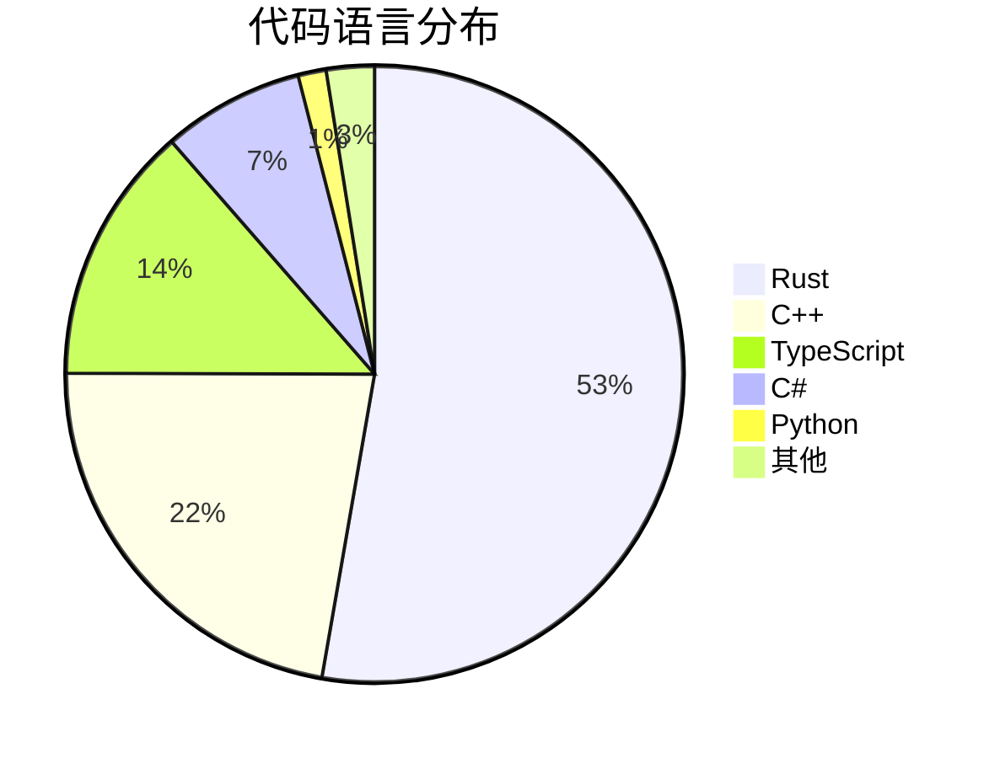

### 项目标签

`database` `dataoriented` `game-development` `mmorpg-server` `relational` `relational-database` `web-development` `web-framework`

---

## 技术分析

### 架构设计

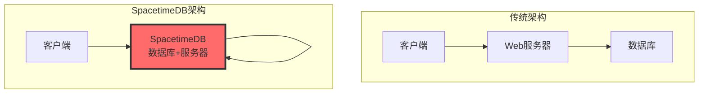

SpacetimeDB 的架构设计彻底简化了传统三层架构，将应用逻辑直接嵌入数据库运行时：

#### 核心组件

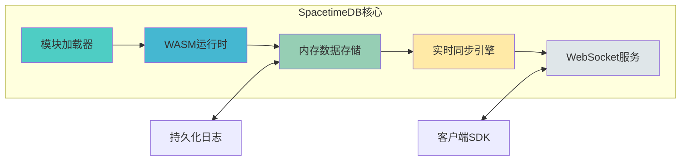

### 技术栈

| 层级 | 技术选型 | 说明 |
|------|----------|------|
| **核心引擎** | Rust | 高性能、内存安全 |
| **模块运行时** | WebAssembly (WASM) | 支持多语言编译、沙箱隔离 |
| **数据存储** | 内存驻留 + 持久化日志 | 极致性能 + 数据安全 |
| **通信协议** | WebSocket | 实时双向通信 |
| **客户端SDK** | TypeScript/Rust/C#/C++ | 全平台覆盖 |

### 核心功能

#### 1. 表定义（Tables）

```rust
#[spacetimedb::table(accessor = messages, public)]
pub struct Message {
    #[primary_key]
    #[auto_inc]
    id: u64,
    sender: Identity,
    text: String,
}
```

#### 2. Reducer（业务逻辑）

```rust
#[spacetimedb::reducer]
pub fn send_message(ctx: &ReducerContext, text: String) {
    ctx.db.messages().insert(Message {
        id: 0,
        sender: ctx.sender,
        text,
    });
}
```

#### 3. 客户端订阅

```typescript
const [messages] = useTable(tables.message);
// 自动更新，无需轮询
```

### 性能特点

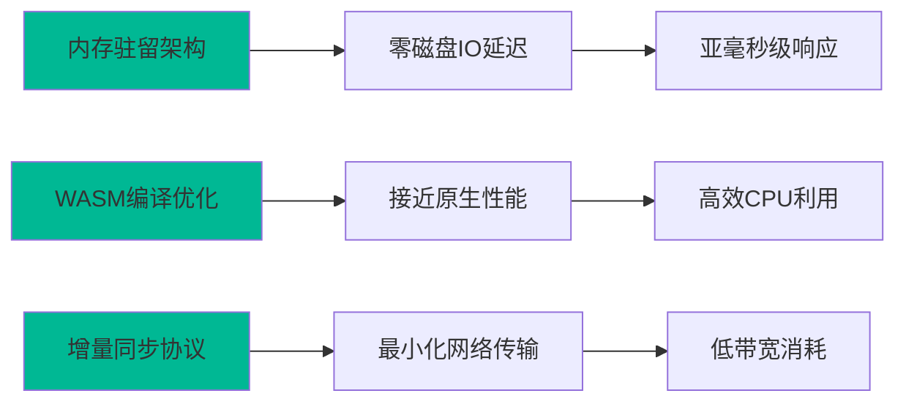

#### 性能优势

1. **内存驻留架构**：所有活跃数据存储在内存中，消除磁盘IO瓶颈
2. **WASM 编译**：业务逻辑编译为 WebAssembly，接近原生性能
3. **增量同步**：只传输变更数据，最小化网络开销
4. **ACID 保证**：通过提交日志实现持久化和崩溃恢复

---

## 社区活跃度

### 开发活跃度

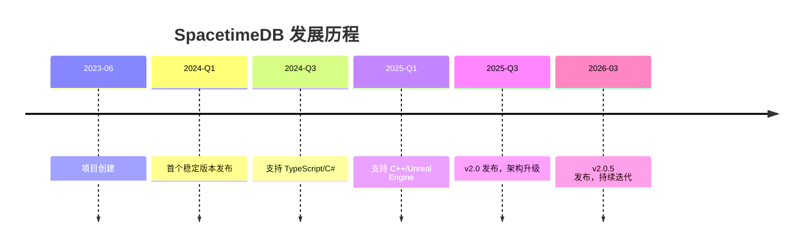

### 社区指标

| 指标 | 状态 |
|------|------|
| **Discord 成员** | 活跃社区 |
| **GitHub Stars 增长** | 快速增长中 |
| **文档完善度** | ⭐⭐⭐⭐⭐ |
| **示例项目** | 丰富 |
| **视频教程** | YouTube 官方频道 |

### 社区资源

- 📖 [官方文档](https://spacetimedb.com/docs)
- 💬 [Discord 社区](https://discord.gg/spacetimedb)
- 🐦 [Twitter](https://twitter.com/spacetime_db)
- 🎮 [BitCraft Online](https://bitcraftonline.com) - 实际应用案例

---

## 发展趋势

### Star 增长趋势

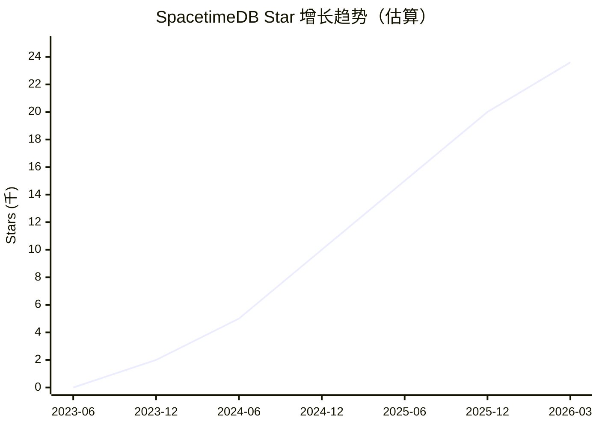

### 技术演进方向

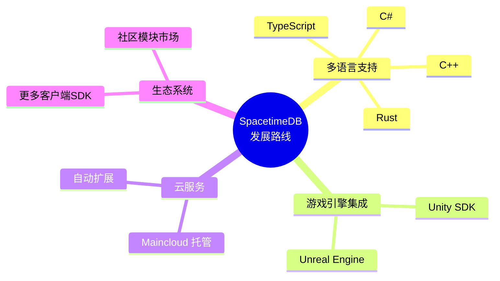

### 版本迭代

| 版本 | 发布日期 | 主要更新 |
|------|----------|----------|
| v2.0.5 | 2026-03-13 | 性能优化、Bug修复 |
| v2.0.0 | 2025-Q3 | 架构重大升级 |
| v1.x | 2024-2025 | 核心功能完善 |

---

## 竞品对比

### 与主流 BaaS 平台对比

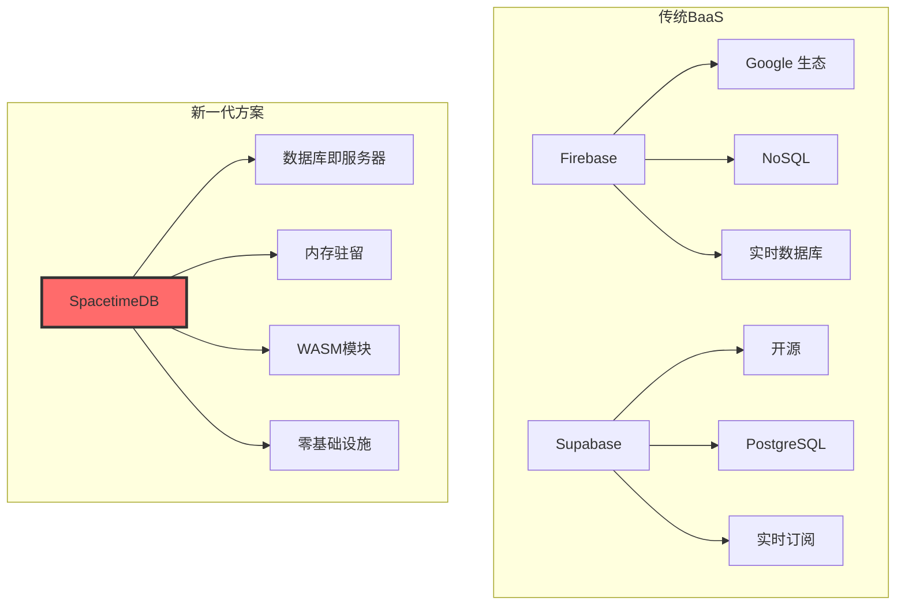

### 详细对比表

| 特性 | SpacetimeDB | Firebase | Supabase | 传统架构 |
|------|-------------|----------|----------|----------|
| **架构复杂度** | ⭐ 极简 | ⭐⭐ 简单 | ⭐⭐⭐ 中等 | ⭐⭐⭐⭐⭐ 复杂 |
| **实时性能** | ⭐⭐⭐⭐⭐ 极高 | ⭐⭐⭐⭐ 高 | ⭐⭐⭐ 中等 | ⭐⭐ 低 |
| **游戏开发** | ⭐⭐⭐⭐⭐ 最佳 | ⭐⭐⭐ 一般 | ⭐⭐ 较弱 | ⭐⭐⭐⭐ 良好 |
| **开源程度** | ⭐⭐⭐⭐ BSL | ⭐ 闭源 | ⭐⭐⭐⭐⭐ 完全开源 | ⭐⭐⭐ 视情况 |
| **学习曲线** | ⭐⭐⭐ 中等 | ⭐⭐⭐⭐ 简单 | ⭐⭐⭐ 中等 | ⭐⭐ 陡峭 |
| **扩展性** | ⭐⭐⭐⭐ 良好 | ⭐⭐⭐⭐⭐ 优秀 | ⭐⭐⭐⭐ 良好 | ⭐⭐⭐⭐⭐ 灵活 |
| **成本控制** | ⭐⭐⭐⭐ 透明 | ⭐⭐⭐ 可能超支 | ⭐⭐⭐⭐ 可控 | ⭐⭐⭐ 视情况 |

### 适用场景对比

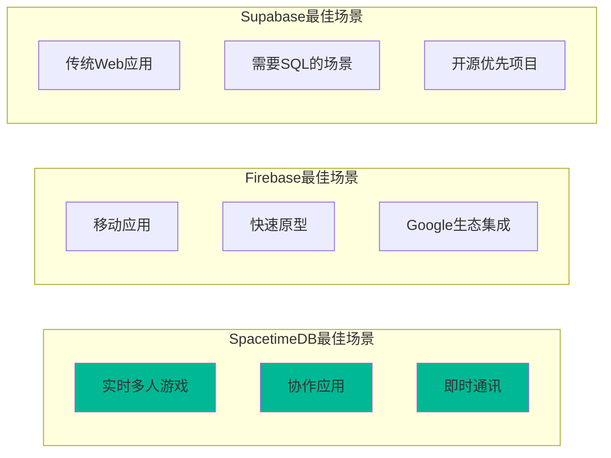

---

## 总结评价

### 优势 ✅

| 优势 | 说明 |
|------|------|
| **架构革命性** | 数据库即服务器，彻底简化后端架构 |
| **极致性能** | 内存驻留 + WASM，亚毫秒级响应 |
| **开发效率** | 单语言开发，零基础设施管理 |
| **实时能力** | 内置实时同步，无需额外配置 |
| **多语言支持** | Rust/C#/TypeScript/C++，覆盖主流开发语言 |
| **游戏优化** | 专为实时多人游戏设计，支持 Unity/Unreal |
| **生产验证** | BitCraft Online MMORPG 实际运行验证 |

### 劣势 ⚠️

| 劣势 | 说明 |
|------|------|
| **许可证限制** | BSL 1.1 许可证，4年后才转为开源 |
| **生态成熟度** | 相比 Firebase/Supabase，生态仍在建设中 |
| **学习曲线** | 需要理解新的编程范式 |
| **内存依赖** | 内存驻留架构对服务器内存要求较高 |
| **云服务锁定** | 主要依赖 Maincloud 托管服务 |

### 适用场景

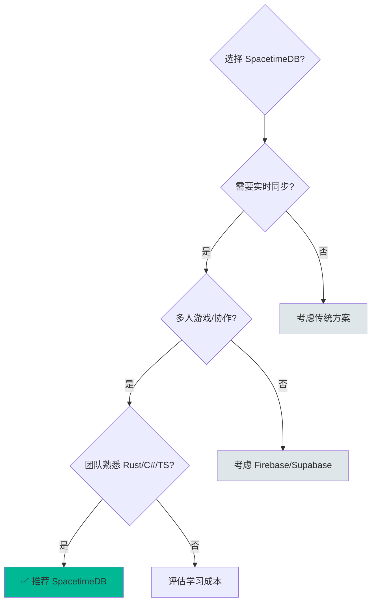

### 推荐指数

| 场景 | 推荐指数 |
|------|----------|
| 🎮 实时多人游戏后端 | ⭐⭐⭐⭐⭐ 强烈推荐 |
| 💬 即时通讯/聊天应用 | ⭐⭐⭐⭐⭐ 强烈推荐 |
| 📝 实时协作应用 | ⭐⭐⭐⭐ 推荐 |
| 📱 传统移动应用 | ⭐⭐⭐ 可考虑 |
| 🏢 企业级复杂业务 | ⭐⭐ 需评估 |
| 📊 数据分析平台 | ⭐⭐ 不太适合 |

### 综合评分

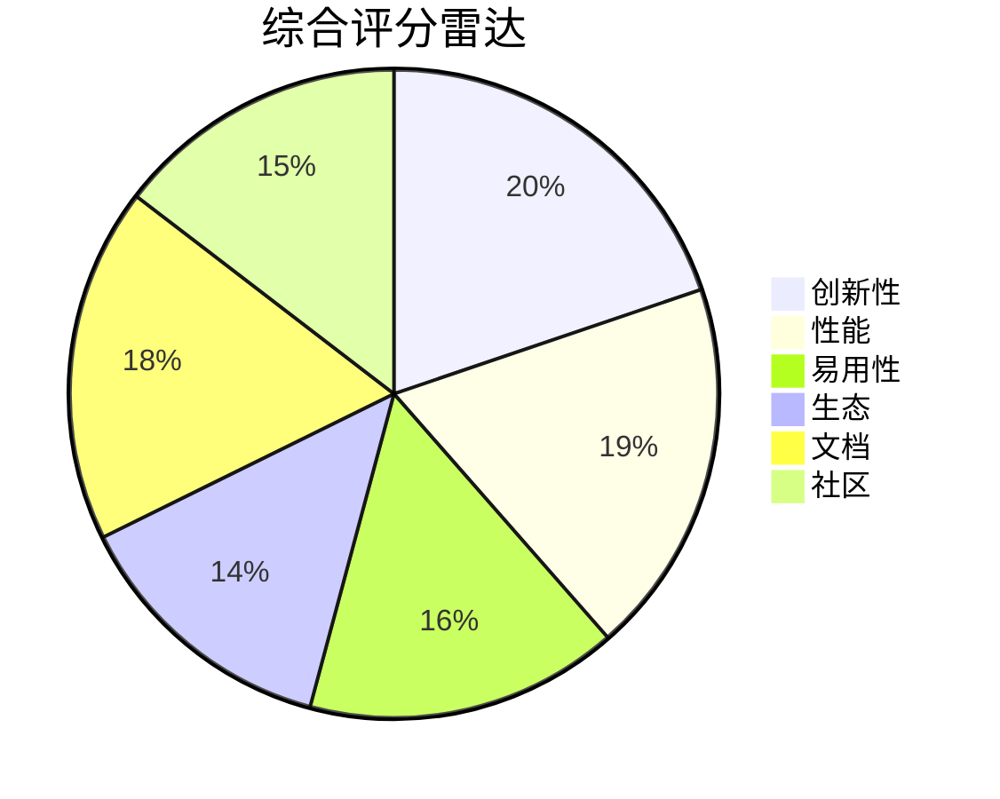

### 最终评价

**SpacetimeDB 是一款具有革命性意义的新型数据库系统**，它打破了传统数据库与服务器之间的界限，为实时应用开发提供了全新的解决方案。特别适合：

1. **游戏开发者**：需要高性能实时后端的多人游戏项目
2. **创业团队**：希望快速迭代、减少基础设施管理成本
3. **实时应用**：聊天、协作、直播等需要实时数据同步的场景

虽然生态仍在建设中，但其创新架构和出色性能使其成为值得关注的新一代后端技术。对于追求极致性能和简化架构的团队，SpacetimeDB 是一个值得尝试的选择。

---

> 📌 **报告声明**：本报告基于 GitHub 公开数据和网络搜索结果生成，仅供参考。数据截止日期：2026-03-17。
