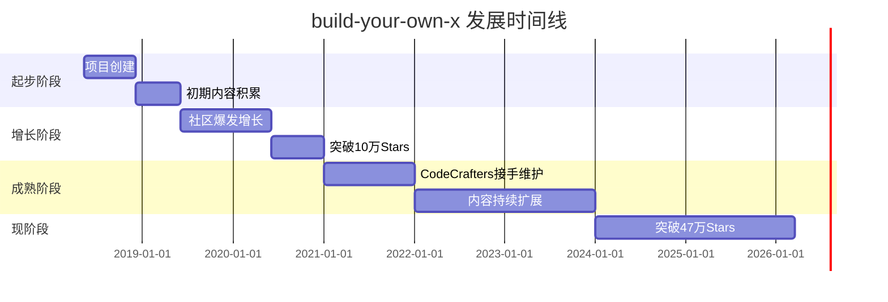

# codecrafters-io/build-your-own-x

> Master programming by recreating your favorite technologies from scratch.

## 项目概述

**build-your-own-x** 是 GitHub 上最受欢迎的编程学习资源库之一，拥有超过 **478,000 颗星**，是一个精心策划的教程合集，指导开发者从零开始重新创建各种流行技术。该项目遵循费曼的名言"我不能创造的，我就不理解"，通过动手实践的方式帮助开发者深入理解底层技术原理。项目涵盖 27+ 个技术领域，包括数据库、编译器、操作系统、解释器、Web 服务器、神经网络、正则表达式引擎等，提供 200+ 个外部教程资源，支持多种编程语言。

## 基本信息

| 指标 | 数值 |
|------|------|
| Stars | 478,761 |
| Forks | 45,049 |
| 语言 | Markdown |
| 开源协议 | CC0 (Public Domain) |
| 创建时间 | 2018-05-09 |
| 最近更新 | 2026-03-17 |
| 贡献者数量 | 100+ |
| GitHub | [codecrafters-io/build-your-own-x](https://github.com/codecrafters-io/build-your-own-x) |

## 技术分析

### 技术栈

该项目本身是一个 Markdown 文档库，主要技术组成：

- **Markdown (100%)** - 所有内容以 Markdown 格式编写
- **静态文档** - 作为教程索引，链接到外部资源
- **社区驱动** - 通过 GitHub Issues 和 PR 进行内容维护

### 架构设计

build-your-own-x 的架构非常简洁：

```
build-your-own-x/
├── README.md          # 主文档，包含所有教程链接
├── .github/           # GitHub 配置
└── 外部教程资源       # 200+ 个外部链接
```

**核心设计理念**：
1. **索引式组织** - 不直接存储教程内容，而是作为高质量教程的索引
2. **分类清晰** - 按技术类型分类（3D Renderer、Blockchain、Bot 等）
3. **语言标注** - 每个教程标注实现语言（Python、Go、Rust、C++ 等）
4. **社区维护** - 通过 PR 和 Issues 接受社区贡献

### 核心功能

**主要技术分类（27+ 个领域）**：

| 类别 | 教程数量 | 热门语言 |
|------|---------|---------|
| 3D Renderer | 10+ | C++, JavaScript |
| Augmented Reality | 5+ | Swift, C# |
| BitTorrent Client | 8+ | Python, Go, Node.js |
| Blockchain/Cryptocurrency | 15+ | Python, JavaScript, Go |
| Bot | 12+ | Python, Node.js |
| Command-Line Tool | 10+ | Go, Rust, Python |
| Database | 20+ | C, C++, Go, Python |
| Docker | 8+ | Go, Python |
| Emulator/Virtual Machine | 15+ | C, C++, Rust |
| Front-end Framework | 10+ | JavaScript, TypeScript |
| Game | 20+ | C++, JavaScript, Python |
| Git | 5+ | Python, Go |
| Network Stack | 8+ | C, Python |
| Neural Network | 25+ | Python, JavaScript, Go |
| Operating System | 15+ | C, Assembly, Rust |
| Physics Engine | 8+ | C++, JavaScript |
| Programming Language | 30+ | C, C++, Python, Haskell |
| Regex Engine | 8+ | C, JavaScript, Python |
| Search Engine | 8+ | Python, JavaScript |
| Shell | 8+ | C, Go, Rust |
| Template Engine | 6+ | JavaScript, Python |
| Text Editor | 8+ | C, Python, Rust |
| Visual Recognition System | 5+ | Python |
| Voxel Engine | 3+ | C++ |
| Web Browser | 4+ | Rust, Python |
| Web Server | 15+ | Python, Node.js, Go |

## 社区活跃度

### 贡献者分析

项目拥有 **100+ 贡献者**，主要贡献者包括：

1. **Daniel Stefanovic (danistefanovic)** - 项目创始人
2. **CodeCrafters, Inc.** - 当前维护者
3. **社区贡献者** - 来自全球的开发者持续提交新教程

### Issue/PR 活跃度

- **开放 Issues**: 444 个
- **PR 合并频率**: 高频（每周多个 PR）
- **响应速度**: 维护者积极响应社区贡献

### 最近动态

- **持续更新**: 项目保持活跃，定期添加新教程
- **社区驱动**: 大量社区贡献的教程提交
- **质量把控**: 维护者对提交内容进行严格审核

## 发展趋势

### 版本演进



### 关键里程碑

| 时间 | 事件 | 影响 |
|------|------|------|
| 2018-05-09 | 项目创建 | Daniel Stefanovic 发起项目 |
| 2018-2019 | 快速增长 | 社区积极响应，内容快速扩展 |
| 2020 | 突破 10 万 Stars | 成为 GitHub 最受欢迎的学习资源之一 |
| 2021 | CodeCrafters 接手 | 专业团队维护，质量提升 |
| 2023 | 突破 30 万 Stars | 全球影响力持续扩大 |
| 2026-03 | 突破 47 万 Stars | GitHub 历史上最受欢迎的项目之一 |

### Roadmap

**未来发展方向**：
1. 持续扩展教程覆盖的技术领域
2. 提高教程质量标准
3. 增加多语言支持
4. 与 CodeCrafters 平台深度整合

### 社区反馈

**用户评价**：
- ⭐ **高度认可**: 被誉为"程序员必收藏的资源库"
- 📚 **学习价值**: 帮助无数开发者深入理解底层技术
- 🌍 **全球影响**: 被翻译成多种语言，全球开发者受益

## 竞品对比

| 项目 | Stars | 语言 | 特点 |
|------|-------|------|------|
| build-your-own-x | 478,761 | Markdown | 最全面的教程索引，27+ 技术领域 |
| awesome-programming | 50,000+ | Markdown | 编程资源合集，范围更广 |
| free-programming-books | 300,000+ | Markdown | 免费编程书籍集合 |
| coding-interview-university | 280,000+ | Markdown | 面试准备资源 |
| system-design-primer | 250,000+ | Python | 系统设计学习资源 |

**竞争优势**：
- ✅ **专注实践**: 强调动手构建，而非理论学习
- ✅ **分类清晰**: 按技术类型和语言组织
- ✅ **质量保证**: 精选高质量教程
- ✅ **社区活跃**: 持续更新和维护

## 总结评价

### 优势

- **学习价值极高**: 通过从零构建深入理解技术原理
- **覆盖面广**: 27+ 技术领域，200+ 教程资源
- **社区驱动**: 持续更新，质量有保障
- **免费开放**: CC0 协议，完全公共领域
- **多语言支持**: 每个技术都有多种语言实现教程

### 劣势

- **内容外部依赖**: 教程链接可能失效
- **质量参差不齐**: 外部教程质量不一
- **缺乏互动性**: 纯静态文档，无练习环境

### 适用场景

**推荐人群**：
- 🎯 **中级开发者**: 想深入理解底层技术原理
- 🎯 **计算机科学学生**: 通过实践巩固理论知识
- 🎯 **技术面试准备**: 深入理解系统设计
- 🎯 **技术爱好者**: 享受从零构建的乐趣

**使用建议**：
1. 选择感兴趣的技术领域
2. 选择熟悉的编程语言
3. 按照教程逐步实现
4. 结合 CodeCrafters 平台进行实践

---
*报告生成时间: 2026-03-17*
*研究方法: github-deep-research 多轮深度分析*
