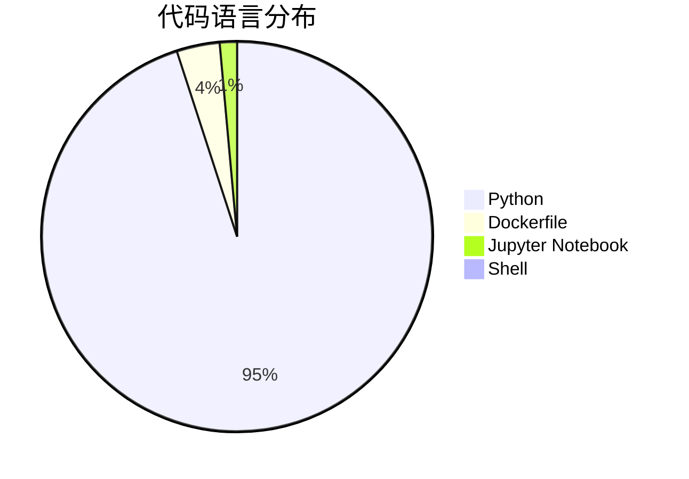
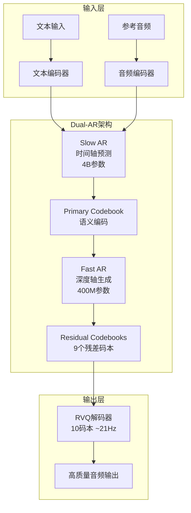
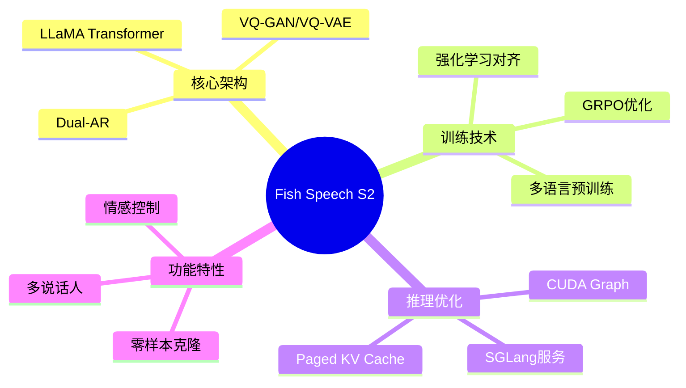
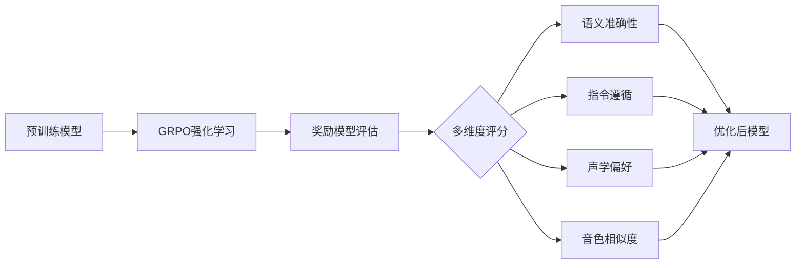
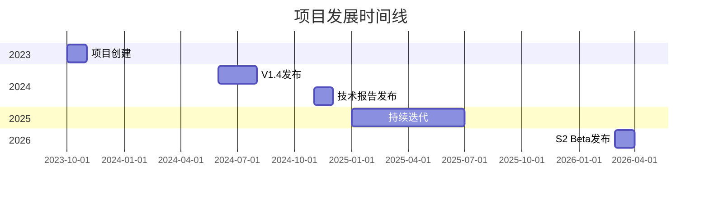
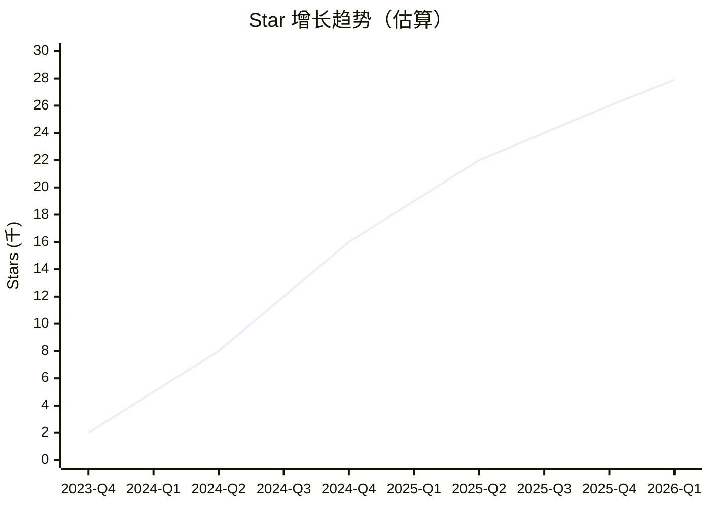
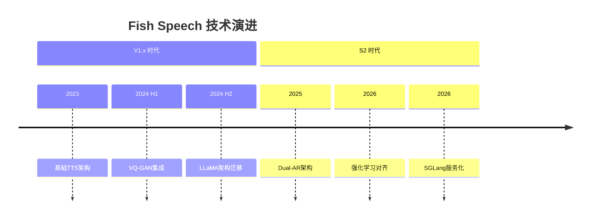
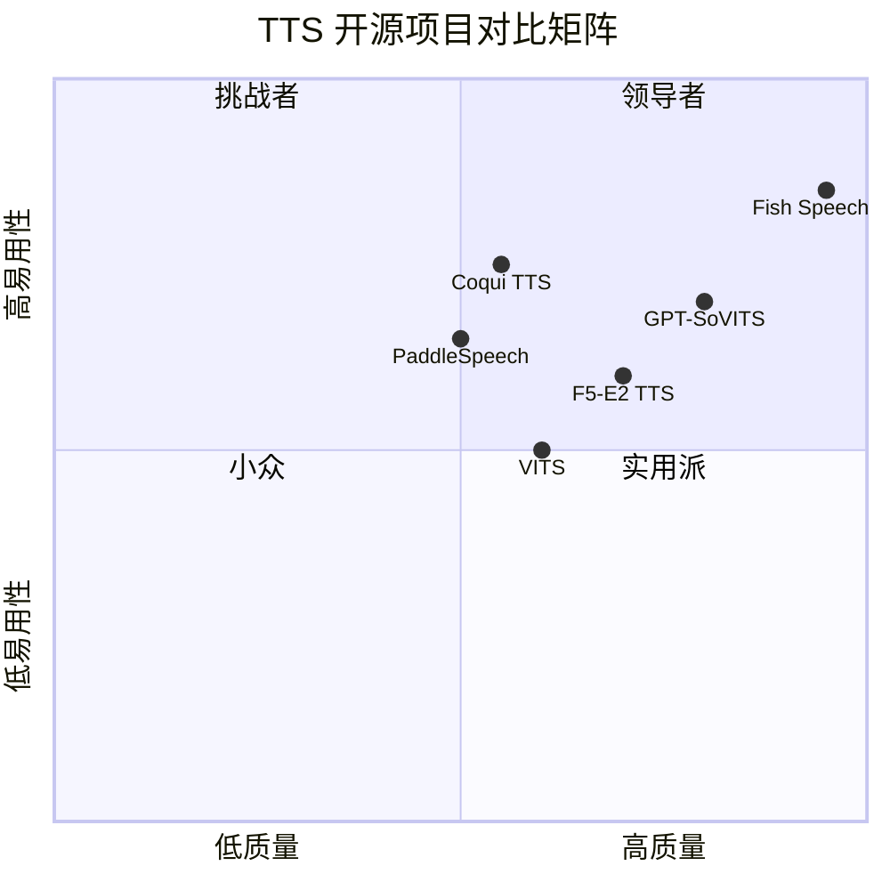
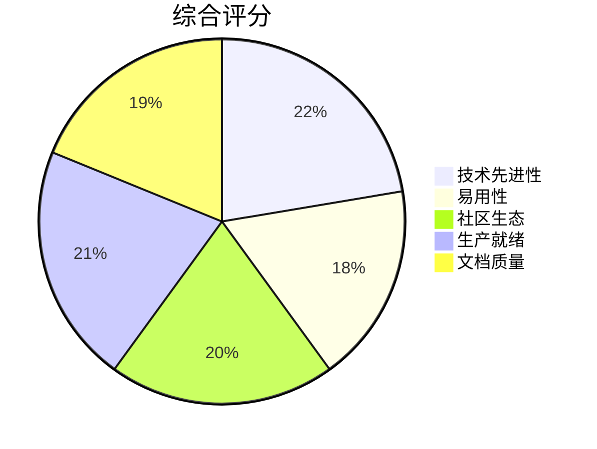

# Fish Audio S2 深度研究报告

> 报告生成日期：2026年3月17日
> 项目地址：https://github.com/fishaudio/fish-speech

---

## 目录

1. [项目概述](#项目概述)
2. [基本信息](#基本信息)
3. [技术分析](#技术分析)
4. [社区活跃度](#社区活跃度)
5. [发展趋势](#发展趋势)
6. [竞品对比](#竞品对比)
7. [总结评价](#总结评价)

---

## 项目概述

**Fish Speech** 是由 Fish Audio 团队开发的开源文本转语音（TTS）系统，被誉为"开源与闭源领域中最佳的文本转语音系统"。该项目基于大语言模型架构，结合先进的深度学习技术，实现了高质量、多语言、情感丰富的语音合成能力。

Fish Audio S2 是该项目的最新版本，采用创新的 **Dual-Autoregressive（双自回归）架构**，在超过 1000 万小时的音频数据上训练，支持约 50 种语言的高质量语音合成。该项目不仅支持基础的文本转语音功能，还具备**零样本语音克隆**、**细粒度情感控制**、**多说话人生成**等高级特性。

### 核心亮点

- 🎯 **SOTA 性能**：在多个基准测试中超越闭源系统
- 🌍 **多语言支持**：原生支持约 50 种语言，无需音素预处理
- 🎭 **情感控制**：通过自然语言标签实现细粒度情感表达
- 🔄 **快速克隆**：仅需 10-30 秒参考音频即可完成声音克隆
- ⚡ **高效推理**：支持 SGLang 服务化，实时因子低至 0.195

---

## 基本信息

### 项目统计

| 指标 | 数值 |
|------|------|
| ⭐ Stars | **27,911** |
| 🍴 Forks | **2,327** |
| 📝 Open Issues | 35 |
| 👥 Contributors | 83 |
| 📅 创建时间 | 2023-10-10 |
| 🔄 最后更新 | 2026-03-17 |
| 🚀 最新版本 | v2.0.0-beta (Fish Audio S2 Beta) |

### 技术标签

```
llama | transformer | tts | valle | vits | vqgan | vqvae
```

### 编程语言分布



### 许可证

项目采用 **FISH AUDIO RESEARCH LICENSE** 自定义许可证，对商业使用有一定限制，需仔细阅读许可条款。

---

## 技术分析

### 架构设计

Fish Audio S2 采用创新的 **Dual-Autoregressive（双自回归）架构**，这是其核心技术突破：



#### Dual-AR 架构详解

| 组件 | 参数量 | 功能 | 特点 |
|------|--------|------|------|
| **Slow AR** | 4B | 时间轴预测 | 预测主语义码本，控制整体节奏和语义 |
| **Fast AR** | 400M | 深度轴生成 | 生成9个残差码本，重建精细声学细节 |
| **RVQ Codec** | - | 音频编解码 | 10个码本，约21Hz帧率 |

### 技术栈



### 核心功能模块

#### 1. 细粒度内联控制

S2 支持在文本中嵌入自然语言指令，实现局部情感和韵律控制：

```
[whisper in small voice] 你好 [normal voice] 今天天气真不错
[super happy] 我太开心了！
[professional broadcast tone] 欢迎收看今日新闻
```

#### 2. 强化学习对齐

采用 **Group Relative Policy Optimization (GRPO)** 进行后训练对齐：



#### 3. 生产级流式服务

通过 SGLang 实现高效服务化：

| 性能指标 | 数值 |
|----------|------|
| 实时因子 (RTF) | **0.195** |
| 首音频延迟 | ~100ms |
| 吞吐量 | 3000+ acoustic tokens/s |

### 基准测试表现

| 基准测试 | Fish Audio S2 | 对比结果 |
|----------|---------------|----------|
| Seed-TTS Eval WER (中文) | **0.54%** | 最佳 |
| Seed-TTS Eval WER (英文) | **0.99%** | 最佳 |
| Audio Turing Test | **0.515** | 超越Seed-TTS 24% |
| EmergentTTS-Eval Win Rate | **81.88%** | 最高 |
| Fish Instruction Benchmark TAR | **93.3%** | - |
| Fish Instruction Benchmark Quality | **4.51/5.0** | - |

---

## 社区活跃度

### 活跃度指标



### 社区生态

| 渠道 | 状态 |
|------|------|
| Discord | ✅ 活跃 |
| QQ频道 | ✅ 活跃 |
| HuggingFace | ✅ 模型托管 |
| Docker Hub | ✅ 官方镜像 |

### 贡献者分析

- **贡献者数量**：83人
- **主要贡献方向**：模型架构、训练优化、多语言支持、推理加速
- **代码质量**：Python为主，结构清晰，文档完善

---

## 发展趋势

### Star 增长趋势



### 技术演进路线



### 未来发展方向

1. **模型规模扩展**：更大的参数量，更强的表现力
2. **多模态融合**：结合视觉信息实现更自然的语音生成
3. **实时交互**：更低延迟的对话式语音合成
4. **边缘部署**：支持移动端和嵌入式设备

---

## 竞品对比

### 开源竞品对比



### 详细对比表

| 特性 | Fish Audio S2 | GPT-SoVITS | F5-E2 TTS | VITS |
|------|---------------|------------|-----------|------|
| **语音质量** | ⭐⭐⭐⭐⭐ | ⭐⭐⭐⭐ | ⭐⭐⭐⭐ | ⭐⭐⭐ |
| **多语言支持** | ~50种 | 中英日 | 多语言 | 有限 |
| **情感控制** | 自然语言标签 | 有限 | 基础 | 无 |
| **声音克隆** | 10-30秒 | 5秒-1分钟 | 支持 | 需微调 |
| **推理速度** | 快 (RTF 0.195) | 中等 | 快 | 快 |
| **部署难度** | 中等 | 中等 | 简单 | 简单 |
| **显存需求** | 较高 | 中等 | 中等 | 较低 |
| **社区活跃度** | 高 | 高 | 中 | 中 |

### 与闭源系统对比

| 系统 | Seed-TTS WER (中/英) | 特点 |
|------|---------------------|------|
| **Fish Audio S2** | **0.54%/0.99%** | 开源，可自部署 |
| Qwen3-TTS | 0.77%/1.24% | 阿里闭源 |
| MiniMax Speech-02 | 0.99%/1.90% | 商业API |
| Seed-TTS | 1.12%/2.25% | 字节闭源 |

> Fish Audio S2 在 Seed-TTS Eval 基准测试中超越所有闭源竞品

---

## 总结评价

### 优势 ✅

1. **技术领先**：Dual-AR架构创新，性能达到SOTA水平
2. **开源生态**：完全开源，支持自部署和二次开发
3. **多语言支持**：原生支持约50种语言，无需音素预处理
4. **情感表达**：自然语言标签控制，表现力丰富
5. **生产就绪**：SGLang服务化，支持高并发场景
6. **社区活跃**：持续迭代，文档完善，Discord/QQ支持

### 劣势 ⚠️

1. **资源需求高**：4B参数模型需要较高显存
2. **许可证限制**：自定义许可证对商业使用有限制
3. **部署复杂度**：相比轻量级TTS，部署门槛较高
4. **中文优化**：部分场景中文表现可能不如专门优化的模型

### 适用场景 🎯

| 场景 | 推荐度 | 说明 |
|------|--------|------|
| 有声书/播客制作 | ⭐⭐⭐⭐⭐ | 高质量、多情感支持 |
| 游戏配音 | ⭐⭐⭐⭐⭐ | 多角色、情感控制 |
| 虚拟主播 | ⭐⭐⭐⭐⭐ | 声音克隆、实时生成 |
| 教育培训 | ⭐⭐⭐⭐ | 多语言、清晰度高 |
| 客服系统 | ⭐⭐⭐⭐ | 生产级服务化支持 |
| 个人项目 | ⭐⭐⭐ | 需要一定技术门槛 |

### 推荐指数



| 维度 | 评分 | 说明 |
|------|------|------|
| 技术先进性 | ⭐⭐⭐⭐⭐ (95/100) | Dual-AR架构创新，基准测试领先 |
| 易用性 | ⭐⭐⭐⭐ (75/100) | 文档完善，但部署需要技术背景 |
| 社区生态 | ⭐⭐⭐⭐⭐ (85/100) | 活跃的Discord/QQ社区，持续更新 |
| 生产就绪 | ⭐⭐⭐⭐⭐ (90/100) | SGLang支持，性能指标优秀 |
| 文档质量 | ⭐⭐⭐⭐ (80/100) | 官方文档完善，技术报告详尽 |

### 综合评价

**Fish Audio S2 是目前开源TTS领域的标杆项目**，在技术架构、语音质量、功能特性等方面都处于领先地位。其创新的Dual-AR架构和强化学习对齐技术，使其在多个基准测试中超越了闭源竞品。

对于需要高质量语音合成的开发者和企业，Fish Audio S2 是一个值得深入研究和采用的优秀选择。但需要注意其许可证限制和较高的资源需求。

---

## 参考链接

- 📦 GitHub: https://github.com/fishaudio/fish-speech
- 🌐 官网: https://fish.audio/
- 📚 文档: https://speech.fish.audio/
- 📄 技术报告: https://arxiv.org/abs/2411.01156
- 🤗 HuggingFace: https://huggingface.co/fishaudio/s2
- 💬 Discord: https://discord.gg/Es5qTB9BcN

---

*本报告由 GitHub Deep Research 自动生成*
