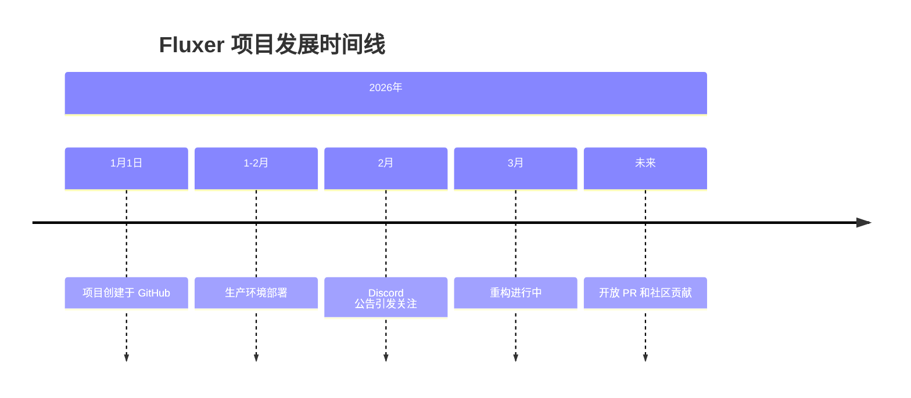
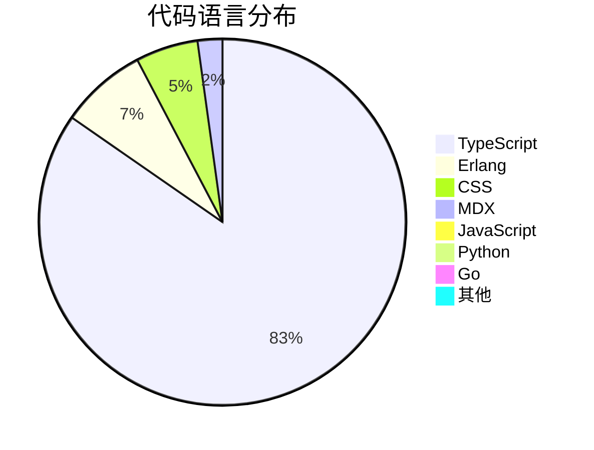
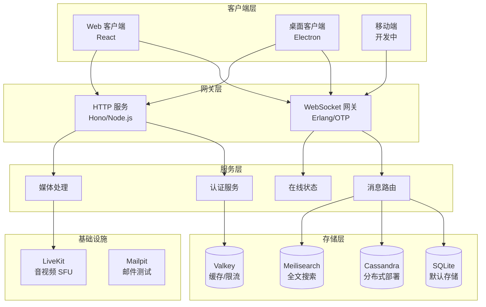
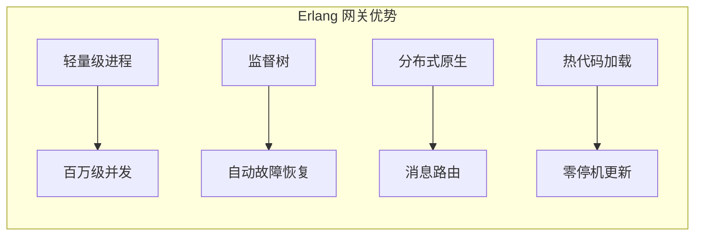
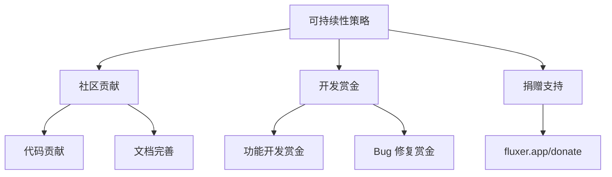
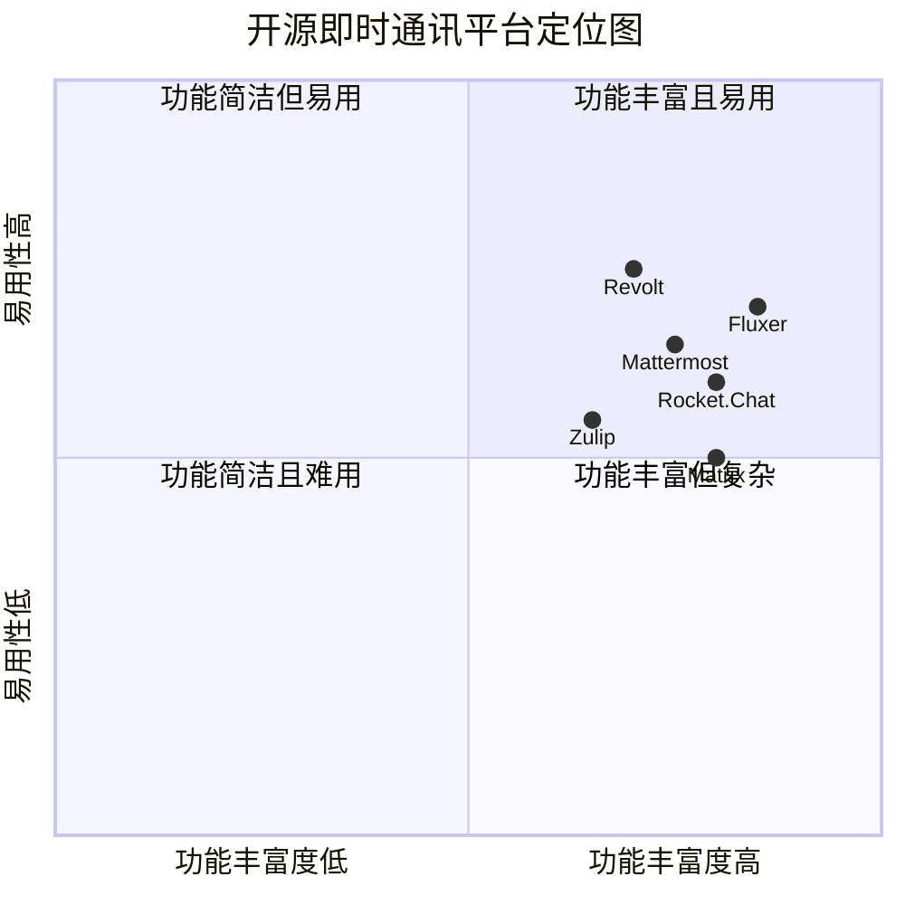
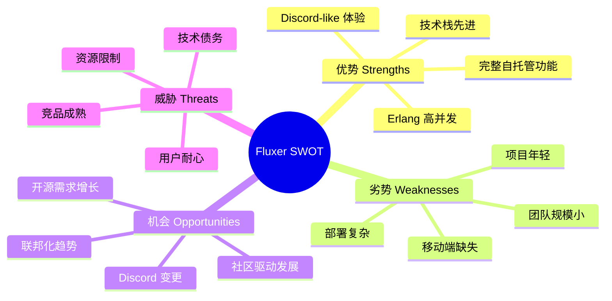

# Fluxer 深度研究报告

> 一个免费开源的即时通讯和 VoIP 平台，专为朋友、群组和社区构建。

---

## 目录

1. [项目概述](#项目概述)
2. [基本信息](#基本信息)
3. [技术分析](#技术分析)
4. [社区活跃度](#社区活跃度)
5. [发展趋势](#发展趋势)
6. [竞品对比](#竞品对比)
7. [总结评价](#总结评价)

---

## 项目概述

### 项目简介

**Fluxer** 是一个免费开源的即时通讯和 VoIP（网络语音电话）平台，旨在为朋友、群组和社区提供现代化的通讯解决方案。该项目最显著的特点是完全支持自托管，用户可以部署自己的实例并获得完整功能，无需任何付费墙限制。

### 核心价值主张

Fluxer 的出现恰逢 Discord 在 2026 年 2 月发布重大公告后，社区对替代方案需求激增的时机。项目作者明确表示，Fluxer 旨在提供一个真正开放、可自托管的通讯平台，所有功能在自托管部署中完全解锁。

### 项目背景



项目目前正处于重构阶段，作者强调在重构完成前不建议深入代码库或尝试自托管设置。生产环境已有超过 **125,000 用户**，由仅 2 名全职员工维护。

---

## 基本信息

### 仓库统计

| 指标 | 数值 | 说明 |
|------|------|------|
| **Stars** | 6,663 ⭐ | 社区关注度极高 |
| **Forks** | 358 | 衍生项目数量 |
| **Open Issues** | 271 | 待处理问题数 |
| **贡献者** | 5 人 | 核心开发团队 |
| **开源协议** | AGPL-3.0 | 严格的开源许可证 |

### 项目元数据

| 属性 | 值 |
|------|-----|
| 主要语言 | TypeScript |
| 创建时间 | 2026-01-01 |
| 最近更新 | 2026-03-17 |
| 最近推送 | 2026-03-16 |
| 默认分支 | refactor |
| 官方网站 | https://fluxer.app |
| 文档站点 | https://docs.fluxer.app |
| 博客 | https://blog.fluxer.app |

### 语言分布



| 语言 | 代码量 | 占比 | 用途 |
|------|--------|------|------|
| TypeScript | 22.6M | 79.5% | 后端服务、前端应用 |
| Erlang | 2.0M | 7.2% | 实时 WebSocket 网关 |
| CSS | 1.5M | 5.2% | UI 样式 |
| MDX | 583K | 2.0% | 文档系统 |
| JavaScript | 189K | 0.7% | 辅助脚本 |
| Python | 106K | 0.4% | 工具脚本 |
| Go | 85K | 0.3% | DevOps 工具 |
| Rust | 39K | 0.1% | WebAssembly 高性能模块 |

---

## 技术分析

### 技术架构

Fluxer 采用现代化的微服务架构，结合多种技术栈以实现高性能和可扩展性：



### 核心技术栈详解

#### 1. 后端服务

| 技术 | 用途 | 特点 |
|------|------|------|
| **TypeScript + Node.js** | 所有 HTTP 服务 | 类型安全、开发效率高 |
| **Hono** | Web 框架 | 轻量级、高性能 |
| **Erlang/OTP** | 实时 WebSocket 网关 | 高并发、消息路由、在线状态管理 |

#### 2. 前端技术

| 技术 | 用途 | 特点 |
|------|------|------|
| **React** | Web 和桌面客户端 UI | 组件化、生态丰富 |
| **Electron** | 桌面应用封装 | 跨平台支持 |
| **Rust + WebAssembly** | 性能关键代码 | 接近原生性能 |

#### 3. 数据存储

| 技术 | 用途 | 部署模式 |
|------|------|----------|
| **SQLite** | 默认存储 | 单机部署 |
| **Cassandra** | 分布式存储 | 大规模部署 |
| **Valkey** | 缓存、限流、临时协调 | Redis 兼容 |
| **Meilisearch** | 全文搜索和索引 | 搜索服务 |

#### 4. 音视频基础设施

| 技术 | 用途 | 端口需求 |
|------|------|----------|
| **LiveKit** | 音视频 SFU | 3478/UDP, 7881/TCP, 50000-50100/UDP |

### 架构亮点

#### Erlang/OTP 用于实时通讯

Fluxer 选择 Erlang/OTP 作为实时 WebSocket 网关的实现技术，这是一个极具前瞻性的技术决策：

- **高并发能力**：Erlang 的轻量级进程模型可支持数百万并发连接
- **容错机制**：OTP 的监督树提供自动故障恢复
- **消息路由**：原生支持分布式消息传递
- **热更新**：支持不停机代码升级



### 开发环境

Fluxer 采用 **devenv** 作为开发环境管理工具，基于 Nix 提供可复现的开发环境：

```bash
# 进入开发环境
devenv shell

# 启动所有服务
devenv up
```

开发服务器地址：`http://localhost:48763/`

### 核心功能

| 功能 | 描述 | 状态 |
|------|------|------|
| **实时消息** | 输入指示器、表情反应、线程回复 | ✅ 已实现 |
| **语音视频** | 社区和私信通话、屏幕共享 | ✅ 已实现 |
| **富媒体** | 链接预览、图片视频附件、GIF 搜索 | ✅ 已实现 |
| **社区频道** | 文本/语音频道、分类、权限管理 | ✅ 已实现 |
| **自定义表情** | 上传自定义表情和贴纸 | ✅ 已实现 |
| **自托管** | 完全控制数据、无供应商锁定 | ✅ 已实现 |
| **移动端应用** | 原生移动应用 | 🚧 开发中 |
| **联邦化** | 跨实例通讯 | 📋 规划中 |

---

## 社区活跃度

### 贡献者分析


### 社区状态

| 指标 | 状态 | 说明 |
|------|------|------|
| PR 接受 | 🔒 暂时关闭 | 重构完成后开放 |
| Issue 处理 | 271 个待处理 | 活跃维护中 |
| 文档完善 | ✅ 完善 | docs.fluxer.app |
| 社区支持 | 📧 邮件支持 | developers@fluxer.app |

### 社区互动渠道

- **官方文档**：https://docs.fluxer.app
- **安全报告**：https://fluxer.app/security
- **开发支持**：developers@fluxer.app
- **招聘信息**：https://fluxer.app/careers

### 社区发展计划

项目作者明确表示：

1. 重构完成后将启用 PR
2. 更频繁地推送更新
3. 所有工作将在公开环境中进行
4. 通过社区贡献和开发赏金实现项目可持续性

---

## 发展趋势

### Star 增长趋势

```mermaid
xychart-beta
    title "Fluxer Star 增长趋势（估算）"
    x-axis [1月, 2月, 3月]
    y-axis "Stars" 0 --> 7000
    bar [500, 3000, 6663]
```

### 关键里程碑

| 时间 | 事件 | 影响 |
|------|------|------|
| 2026-01-01 | 项目创建 | 正式启动 |
| 2026-02 | Discord 公告 | 用户需求激增 |
| 2026-03 | 重构进行中 | 优化架构 |
| 未来 | 开放贡献 | 社区驱动发展 |

### 路线图

根据官方博客和 README，Fluxer 的优先发展方向：

1. **移动端应用** - 原生 iOS/Android 客户端（最高优先级）
2. **联邦化** - 跨实例通讯能力（最高优先级）
3. **自托管简化** - 降低部署复杂度
4. **开发环境优化** - 简化贡献流程

### 可持续性策略



---

## 竞品对比

### 开源即时通讯平台对比



### 详细对比表

| 特性 | Fluxer | Matrix/Element | Revolt | Mattermost | Discord |
|------|--------|----------------|--------|------------|---------|
| **开源** | ✅ AGPL | ✅ Apache | ✅ AGPL | ✅ MIT/商业 | ❌ 闭源 |
| **自托管** | ✅ 完整功能 | ✅ | ✅ | ✅ | ❌ |
| **语音视频** | ✅ LiveKit | ✅ Jitsi | ✅ | ✅ | ✅ |
| **移动端** | 🚧 开发中 | ✅ | ✅ | ✅ | ✅ |
| **联邦化** | 📋 规划中 | ✅ 核心特性 | ❌ | ❌ | ❌ |
| **技术栈** | TS+Erlang | Synapse/Python | Rust | Go | 闭源 |
| **UI 相似度** | Discord-like | 独特 | Discord-like | Slack-like | - |
| **成熟度** | 新兴 | 成熟 | 发展中 | 成熟 | 成熟 |

### 竞争优势

#### Fluxer 的优势

1. **技术选型先进**：Erlang/OTP 用于实时通讯，具备电信级可靠性
2. **Discord-like 体验**：用户迁移成本低
3. **完整功能自托管**：无功能限制
4. **时机优势**：Discord 变更后需求激增
5. **现代技术栈**：TypeScript + React 开发效率高

#### 潜在挑战

1. **移动端缺失**：目前无原生移动应用
2. **联邦化未实现**：无法跨实例通讯
3. **团队规模小**：仅 2 名全职员工
4. **项目年轻**：生态和社区尚在建设中

---

## 总结评价

### 综合评分

| 维度 | 评分 | 说明 |
|------|------|------|
| **技术创新** | ⭐⭐⭐⭐⭐ | Erlang+TypeScript 架构创新 |
| **代码质量** | ⭐⭐⭐⭐ | 重构进行中，结构清晰 |
| **功能完整度** | ⭐⭐⭐⭐ | 核心功能完备，移动端待开发 |
| **社区活跃度** | ⭐⭐⭐ | 贡献者少，但维护积极 |
| **文档完善度** | ⭐⭐⭐⭐ | 官方文档完善 |
| **自托管友好** | ⭐⭐⭐ | 部署复杂度待降低 |
| **发展潜力** | ⭐⭐⭐⭐⭐ | 时机好、技术优、需求大 |

### SWOT 分析



### 适用场景

#### 推荐使用

- ✅ 需要私有化部署的团队和组织
- ✅ 对数据主权有严格要求的企业
- ✅ 寻找 Discord 替代方案的社区
- ✅ 有技术能力进行自部署的团队

#### 暂不推荐

- ❌ 需要成熟移动端支持的用户
- ❌ 需要跨实例联邦通讯的场景
- ❌ 缺乏技术运维能力的团队

### 发展建议

1. **短期**：加速重构完成，开放社区贡献
2. **中期**：优先开发移动端应用
3. **长期**：实现联邦化，构建开放通讯网络

### 结语

Fluxer 是一个极具潜力的开源即时通讯平台，其技术架构设计合理，时机把握精准。虽然项目尚处于早期阶段，但凭借 Erlang/OTP 的高并发能力、现代化的技术栈以及对自托管的完整支持，Fluxer 有望成为 Discord 的有力替代者。

项目目前最紧迫的任务是完成重构、开放社区贡献，并尽快推出移动端应用。对于关注数据主权和私有化部署的团队，Fluxer 值得持续关注和期待。

---

**报告生成时间**: 2026-03-17  
**数据来源**: GitHub API、项目 README、官方文档、Web 搜索  
**分析方法**: github-deep-research 方法论
