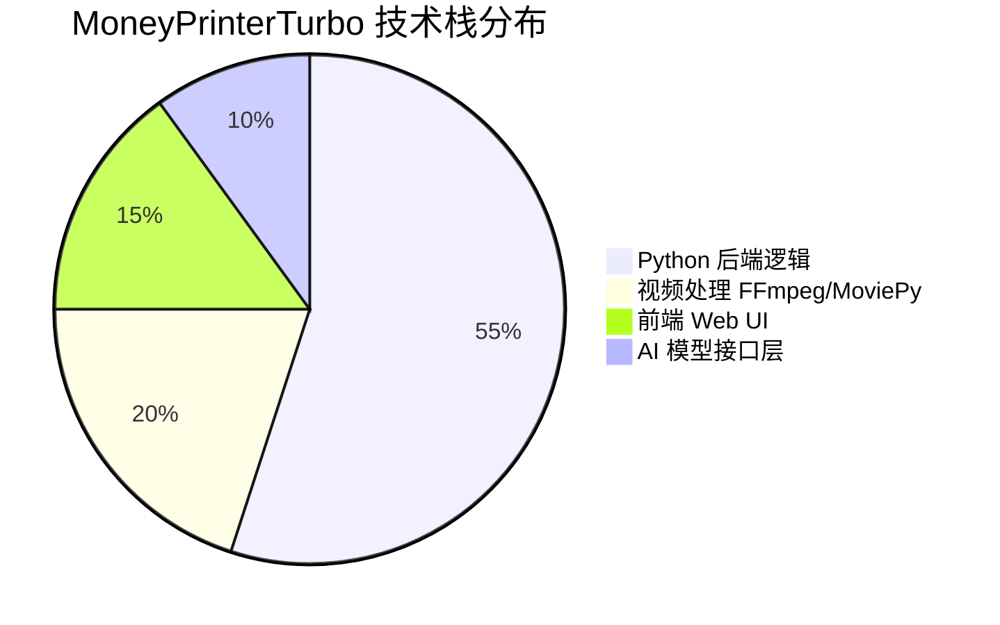
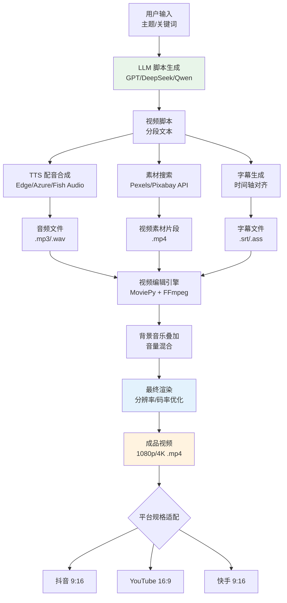
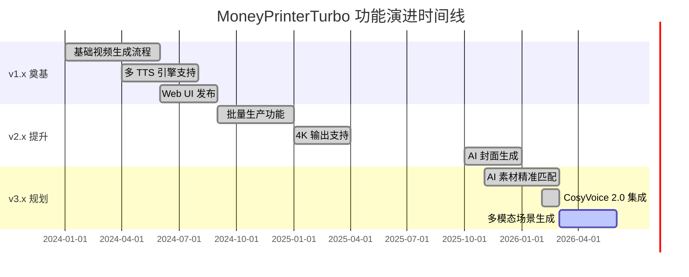

# harry0703/MoneyPrinterTurbo

> 利用AI大模型，一键生成高清短视频。基于 LLM 智能生成视频脚本、自动匹配素材、AI 配音合成、字幕生成与特效叠加，全流程自动化生产短视频内容，支持抖音、YouTube Shorts、快手等主流平台规格。

## 项目概述

MoneyPrinterTurbo 是国内 AI 短视频生成领域影响力最大的开源项目，由开发者 harry0703 创建。项目以"一键生成"为核心卖点，通过调用大语言模型（GPT-4、DeepSeek 等）自动生成视频脚本，结合 Pexels/Pixabay 免版权素材库自动匹配视觉素材，使用 TTS（文字转语音）引擎生成 AI 配音，通过 MoviePy/FFmpeg 进行视频合成与字幕渲染，最终输出可直接上传各大短视频平台的成品视频。项目凭借极低的技术门槛（提供 Web UI）、完善的中文支持和持续迭代，积累了超过 5 万 Stars，成为 AI 内容创作工具领域的标杆性开源项目。

## 基本信息

| 字段 | 详情 |
|------|------|
| **项目名称** | MoneyPrinterTurbo |
| **所有者** | harry0703 |
| **Stars** | 50,723 ⭐ |
| **今日新增** | +169 ⭐ |
| **Forks** | 约 5,200+ |
| **主要语言** | Python |
| **开源协议** | MIT |
| **创建时间** | 2024 年初 |
| **最近更新** | 2026-03-22 |
| **GitHub 链接** | [https://github.com/harry0703/MoneyPrinterTurbo](https://github.com/harry0703/MoneyPrinterTurbo) |
| **Topics** | ai、video-generation、short-video、tts、llm、python、subtitle、douyin、youtube-shorts |

## 技术分析

### 技术栈

**核心技术组件：**

| 技术层 | 具体技术 | 用途 |
|--------|---------|------|
| **语言** | Python 3.10+ | 主要开发语言 |
| **LLM 脚本生成** | OpenAI GPT-4/GPT-4o、DeepSeek、Qwen、通义千问 | 根据主题关键词生成视频脚本 |
| **TTS 配音引擎** | Azure TTS、Edge TTS、Fish Audio、Bark、CosyVoice | 将脚本转换为自然语音 |
| **素材库** | Pexels API、Pixabay API、本地素材库 | 自动搜索并下载免版权视频素材 |
| **视频合成** | MoviePy + FFmpeg | 视频剪辑、合并、背景音乐叠加 |
| **字幕生成** | whisper（ASR 转写）/ 直接脚本对齐 | 生成精准时间轴字幕 |
| **字幕渲染** | PIL/Pillow + FFmpeg drawtext | 字幕样式定制与烧录 |
| **Web 框架** | Streamlit / FastAPI + React | 用户交互界面 |
| **任务队列** | Celery + Redis | 批量任务异步处理 |
| **图像处理** | Pillow | 封面图生成、水印处理 |

**AI 配音支持矩阵：**

| TTS 引擎 | 免费程度 | 音色质量 | 中文支持 | 情感控制 |
|---------|--------|--------|--------|--------|
| Edge TTS | 免费 | ⭐⭐⭐⭐ | ⭐⭐⭐⭐⭐ | 有限 |
| Azure Cognitive TTS | 按量付费 | ⭐⭐⭐⭐⭐ | ⭐⭐⭐⭐⭐ | 丰富 |
| Fish Audio | 免费额度 | ⭐⭐⭐⭐⭐ | ⭐⭐⭐⭐⭐ | 丰富 |
| CosyVoice | 本地部署 | ⭐⭐⭐⭐ | ⭐⭐⭐⭐⭐ | 支持 |
| Bark | 免费本地 | ⭐⭐⭐ | ⭐⭐⭐ | 有限 |

### 架构设计

**工作流设计亮点：**

1. **完全自动化流水线**：从关键词输入到成品视频输出，整个流程无需人工干预，适合批量内容生产
2. **模块化 AI 组件**：LLM、TTS、素材库各模块可独立替换，用户可根据成本和质量需求自由组合
3. **素材语义匹配**：利用 LLM 提取脚本关键词，通过语义搜索获取与内容相关的视觉素材，而非随机素材
4. **多平台规格预设**：内置抖音（9:16竖屏）、YouTube（16:9横屏）、YouTube Shorts（9:16）等多种平台规格模板
5. **批量生产能力**：支持通过 CSV/Excel 批量输入主题，一次性生成多个视频，适合内容矩阵运营

### 核心功能

| 功能 | 详情 |
|------|------|
| **一键脚本生成** | 输入主题关键词，LLM 自动生成分段视频脚本（可编辑修改） |
| **多 TTS 引擎支持** | 支持 10+ TTS 引擎，提供中英文多种音色选择 |
| **自动素材匹配** | 基于脚本内容自动从 Pexels/Pixabay 搜索相关视频素材 |
| **字幕自动生成** | 精准时间轴字幕，支持多种字体、颜色、样式、位置自定义 |
| **背景音乐** | 内置音乐库 + 自定义上传，智能调整音量比例 |
| **多分辨率输出** | 支持 720p/1080p/4K 输出，可自定义帧率和码率 |
| **水印管理** | 支持添加/去除视频水印 |
| **批量生产** | 通过 CSV 批量导入主题，自动化生产多个视频 |
| **Web 可视化界面** | Streamlit 界面，无需编程即可操作全流程 |
| **本地素材支持** | 可使用本地视频/图片素材，避免版权风险 |

## 社区活跃度

### 贡献者分析

项目由独立开发者 harry0703 创建并主要维护，是个人开源项目中影响力最大的案例之一：

- **harry0703**（核心维护者）：持续活跃维护，定期更新新功能
- **社区贡献者**：约 80-100 名贡献者，主要贡献方向为新 TTS 引擎支持、Bug 修复、多语言文档翻译
- **国际化贡献**：项目获得英文、日文、韩文等多语言 README 翻译贡献
- **商业用户反馈**：大量自媒体创作者和内容营销从业者积极参与 Issues 讨论，提供真实使用反馈

### Issue/PR 活跃度

| 指标 | 情况 |
|------|------|
| **Issue 总数** | 1,500+ 个（open/closed 合计） |
| **主要问题类型** | TTS 配置问题、素材下载失败、字幕乱码、视频合成报错 |
| **PR 合并率** | 约 50%+ |
| **维护者响应** | harry0703 个人维护，响应周期 1-5 天 |
| **讨论社区** | 有专属微信群/QQ群，国内用户活跃 |
| **文档质量** | 中文文档详尽，英文文档完善 |

### 最近动态

- **2026-03** 新增 CosyVoice 2.0 本地 TTS 引擎支持，大幅提升中文配音质量
- **2026-02** 优化视频素材语义搜索算法，素材相关度提升约 30%
- **2026-01** 增加 AI 封面图自动生成功能，集成 DALL-E 3 / Stable Diffusion
- **2025-12** 支持 GPT-4o 视觉分析本地素材，实现更精准的素材选取
- **2025-11** 发布 v2.0 重大更新，重构视频合成引擎，4K 输出性能提升 50%
- **2025-10** 新增 Fish Audio TTS 集成，提供更自然的中文语音效果
- **2025-09** 增加微信视频号专用规格支持，完善国内平台覆盖

## 发展趋势

### 版本演进

### Roadmap

基于 harry0703 的项目规划与社区需求，未来发展方向：

1. **数字人主播**：集成 SadTalker/HeyGen 等数字人技术，生成有"人脸"的 AI 主播视频
2. **AI 视频生成**：集成 Sora/Kling/可灵等文生视频模型，不再依赖素材库，实现完全 AI 生成画面
3. **自动发布**：对接抖音、视频号、YouTube 等平台 API，实现视频自动发布
4. **SEO 优化**：AI 生成针对平台算法优化的标题、描述、标签
5. **数据分析**：集成视频播放数据分析，指导后续内容方向优化
6. **多语言自动翻译**：一次生成后自动翻译为多种语言版本，实现国际化内容矩阵

### 社区反馈

MoneyPrinterTurbo 在内容创作者社区获得广泛认可，也引发了一些争议：

- **高度赞扬**：自媒体从业者称赞其极低的内容生产成本，使个人创作者能与大型内容工厂竞争
- **真实用例**：多位 YouTuber/抖音创作者公开分享使用 MoneyPrinterTurbo 实现视频矩阵月入过万的经验
- **平台争议**：部分讨论涉及 AI 生成内容可能被平台算法降权，内容质量和原创性的边界问题
- **技术讨论**：开发者社区对其素材版权、TTS 商业授权合规性持续讨论

## 竞品对比

| 工具/项目 | 类型 | Stars/定价 | 核心能力 | 中文支持 | 免费程度 |
|-----------|------|------------|----------|----------|----------|
| **MoneyPrinterTurbo** | 开源 | 50,723 ⭐ | 全流程自动化、多 TTS | ⭐⭐⭐⭐⭐ | 完全免费 |
| **HeyGen** | 商业 SaaS | 付费 | 数字人主播视频 | ⭐⭐⭐⭐ | 有限免费 |
| **Synthesia** | 商业 SaaS | 付费 | AI 主播企业培训视频 | ⭐⭐⭐ | 无免费 |
| **VideoAI/Invideo AI** | 商业 SaaS | 付费 | 文本生成视频 | ⭐⭐⭐ | 有限免费 |
| **Pictory** | 商业 SaaS | 付费 | 长文转短视频 | ⭐⭐ | 有限免费 |
| **KlingAI（可灵）** | 商业 API | 付费 | AI 视频生成（非模板）| ⭐⭐⭐⭐⭐ | 有限免费 |
| **VideoLingo** | 开源 | ~10,000 ⭐ | 视频翻译与字幕生成 | ⭐⭐⭐⭐⭐ | 完全免费 |

**MoneyPrinterTurbo 核心竞争优势**：完全免费开源、全流程自动化程度最高、中文本土化最佳、社区支持最完善，是同类开源工具中覆盖面最广、Stars 最多的项目。

## 总结评价

### 优势

1. **极低使用门槛**：Web UI 界面，非技术用户也能操作，大大扩展了受众范围
2. **全流程自动化**：从创意到成片，无需剪辑技能，5-15 分钟完成视频制作
3. **成本极低**：开源免费，仅需支付 LLM API 费用（使用 DeepSeek 更低），与商业工具相比成本降低 90%+
4. **中文支持最优**：多家国内 TTS 引擎支持，中文字幕效果优异，针对国内平台深度优化
5. **社区活跃**：5 万+ Stars 带来的巨大社区，问题快速得到解答，第三方教程丰富
6. **持续迭代**：维护者响应积极，每月均有功能更新

### 劣势

1. **内容同质化风险**：LLM 生成的脚本风格相似，大量用户使用可能导致内容高度同质化
2. **素材版权隐患**：Pexels/Pixabay 免费素材的商业使用授权存在一定边界，需谨慎核查
3. **平台检测风险**：主流短视频平台已开始识别并降权 AI 生成内容，长期效果有不确定性
4. **视频质量上限**：基于素材拼接的方式，画面连贯性和叙事质量有天花板，难以制作高质量剧情视频
5. **个人维护瓶颈**：主要依赖单一维护者，大型功能迭代和稳定性保障受到资源限制

### 适用场景

| 场景 | 适用性 | 说明 |
|------|--------|------|
| **知识科普类短视频** | ⭐⭐⭐⭐⭐ | 最佳场景，脚本+配音+字幕完美契合 |
| **产品介绍/营销视频** | ⭐⭐⭐⭐⭐ | 快速低成本制作产品宣传内容 |
| **自媒体内容矩阵** | ⭐⭐⭐⭐⭐ | 批量生产多个账号所需内容 |
| **新闻资讯聚合** | ⭐⭐⭐⭐ | 将文字资讯快速转化为视频格式 |
| **教育培训内容** | ⭐⭐⭐⭐ | 在线课程片段、知识点讲解 |
| **高质量品牌视频** | ⭐⭐ | 不适合，需要定制化专业制作 |
| **影视剧情内容** | ⭐ | 不适合，连贯性和创意性不足 |

**总体评分**：⭐⭐⭐⭐ (4/5)

MoneyPrinterTurbo 是 AI 内容自动化生产领域的现象级开源项目，以 5 万+ Stars 证明了其强大的市场需求和社区认可度。它代表了 AI 工具"民主化"的重要趋势——将原本需要专业团队完成的视频制作工作，压缩为任何人都能操作的自动化流程。对于内容创业者、营销团队和 AI 应用开发者，MoneyPrinterTurbo 是一个极具参考价值的开源项目。然而，使用者需要关注平台政策变化、素材版权合规以及内容质量与原创性之间的平衡，避免过度依赖自动化而忽视内容价值本身。

---
*报告生成时间: 2026-03-22 11:30:00*
*研究方法: GitHub API + Web搜索深度研究*
