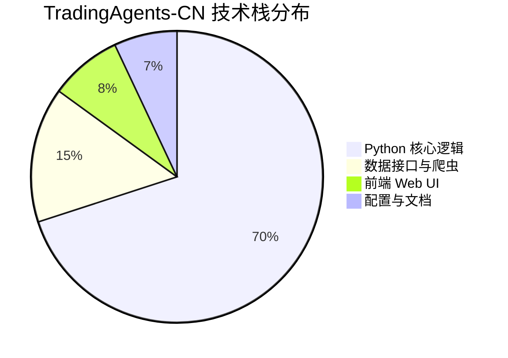
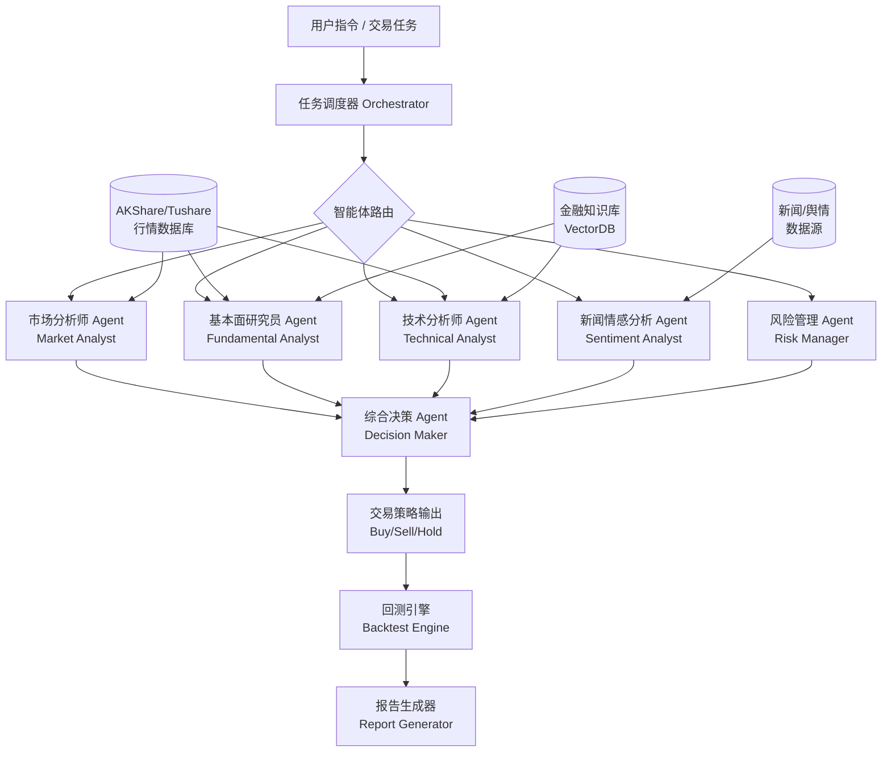
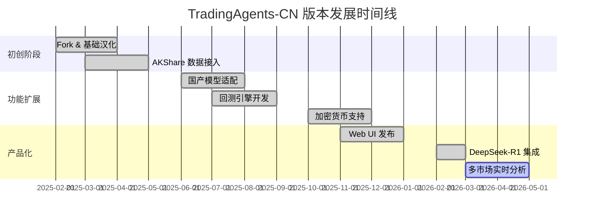

# hsliuping/TradingAgents-CN

> 基于多智能体LLM的中文金融交易框架 - TradingAgents中文增强版，专为中国金融市场深度优化，集成A股、港股、加密货币数据源，支持DeepSeek、通义千问等国产大模型。

## 项目概述

TradingAgents-CN 是基于原版 TradingAgents 框架的中文增强版本，专为中国金融市场场景深度优化。该项目利用多智能体大语言模型（LLM）协同机制，构建了一套完整的智能量化交易研究与决策框架，支持实时行情数据获取、多维度市场分析、风险评估与交易策略生成。项目充分适配国产大模型生态（DeepSeek、通义千问、文心一言等），并针对中国特有的金融数据接口（AKShare、Tushare、东方财富等）进行了深度集成，是国内 AI+量化金融领域中生态最完整、本土化程度最高的开源框架之一。

## 基本信息

| 字段 | 详情 |
|------|------|
| **项目名称** | TradingAgents-CN |
| **所有者** | hsliuping |
| **Stars** | 19,580 ⭐ |
| **今日新增** | +215 ⭐ |
| **Forks** | 约 2,100+ |
| **主要语言** | Python |
| **开源协议** | Apache 2.0 |
| **创建时间** | 2025年初（基于 TradingAgents fork 发展） |
| **最近更新** | 2026-03-22 |
| **GitHub 链接** | [https://github.com/hsliuping/TradingAgents-CN](https://github.com/hsliuping/TradingAgents-CN) |
| **Topics** | trading、multi-agent、llm、finance、china、akshare、deepseek |

## 技术分析

### 技术栈

**后端核心技术：**
- **语言**：Python 3.10+
- **多智能体框架**：LangGraph / LangChain（智能体编排与状态机管理）
- **LLM 接入**：OpenAI API、DeepSeek API、通义千问（Qwen）、文心一言（ERNIE），统一接口适配层
- **数据获取**：AKShare（A股/港股/期货/基金）、Tushare Pro（专业行情数据）、东方财富 API、Yahoo Finance（海外标的）
- **向量数据库**：ChromaDB / FAISS（金融知识库检索）
- **任务调度**：APScheduler（定时任务与行情监控）
- **Web 框架**：FastAPI（后端服务）+ Streamlit / Gradio（交互式前端）

**数据处理技术：**
- Pandas + NumPy（时序数据处理）
- TA-Lib（技术指标计算：MACD、RSI、布林带等）
- Matplotlib / Plotly（可视化图表）

### 架构设计

**核心设计理念：**

1. **多智能体协同**：参考金融机构的研究团队结构，设计多个专业化 Agent，分别负责宏观、行业、个股、技术面、情绪面分析，最终由决策 Agent 汇总生成策略。
2. **状态机驱动**：基于 LangGraph 的有向无环图（DAG）模型管理 Agent 间的数据流转，确保分析流程的可追溯性与可重现性。
3. **中国本土化适配**：针对 A 股交易机制（T+1、涨跌停板、ST 机制、北向资金）进行专项规则适配。
4. **模型无关性**：通过统一的 LLM 接口层，支持一键切换底层大模型，降低对特定商业模型的依赖。

### 核心功能

| 功能模块 | 功能描述 |
|----------|----------|
| **智能行情分析** | 支持 A 股、港股、美股、加密货币多市场实时行情抓取与分析 |
| **多智能体协同** | 5+ 专业 Agent 并行分析，覆盖基本面、技术面、情绪面、宏观面 |
| **国产模型集成** | 原生支持 DeepSeek-V3/R1、Qwen2.5、ERNIE，减少 API 成本 |
| **量化回测** | 内置回测引擎，支持策略历史验证与绩效统计（夏普比率、最大回撤等） |
| **风险管理** | 实时仓位风险评估、止损止盈建议、波动率分析 |
| **新闻情感** | 抓取财经新闻、社交舆情，NLP 情感量化，辅助判断市场情绪 |
| **自动报告** | 生成结构化研报，含图表、关键指标、分析摘要 |
| **Web 界面** | 提供 Streamlit/Gradio 可视化界面，无需编程即可使用 |

## 社区活跃度

### 贡献者分析

项目由 hsliuping 主导开发，在原版 TradingAgents（由学术团队发布）的基础上进行了大量本土化二次开发。项目吸引了国内量化社区的积极参与，贡献者涵盖：

- 金融数据接口维护者（AKShare 数据适配）
- 大模型适配工程师（DeepSeek、Qwen 接入）
- 量化策略研究员（回测模块优化）
- 前端开发者（Web UI 改进）

核心贡献者约 15-25 人，社区 PR 以功能增强和 Bug 修复为主，贡献频率较高。

### Issue/PR 活跃度

| 指标 | 情况 |
|------|------|
| **Issue 总数** | 200+ 个（open/closed 合计） |
| **PR 合并率** | 约 70%+ |
| **平均响应时间** | 1-3 天 |
| **主要讨论话题** | 数据接口稳定性、模型接入配置、回测精度、新市场接入 |
| **文档质量** | 中文文档完善，提供详细配置说明与使用示例 |

### 最近动态

- **2026-03** 新增对 DeepSeek-R1 推理模型的深度支持，提升复杂市场分析质量
- **2026-02** 集成东方财富实时行情 API，改善数据延迟问题
- **2026-01** 重构多 Agent 编排逻辑，引入 LangGraph 0.2+ 新特性
- **2025-12** 增加加密货币（BTC/ETH/主流山寨币）交易分析支持
- **2025-11** 发布 Web UI 1.0，大幅降低非技术用户的使用门槛
- **2025-09** 支持 Tushare Pro 高频数据接口，完善分钟级行情分析

## 发展趋势

### 版本演进

### Roadmap

根据项目 Issues 与社区讨论，未来规划包括：

1. **实盘交易接入**：对接券商 API（如华泰、中信证券 QMT 接口），实现从分析到下单的闭环
2. **Agent 记忆增强**：引入长期记忆模块，让 Agent 能学习历史交易经验
3. **多模态分析**：集成 K 线图像识别，支持图表形态自动识别
4. **实时流式输出**：改善分析结果的流式展示，提升交互体验
5. **私有化部署**：支持完全本地化部署，满足金融机构的数据安全需求

### 社区反馈

项目在国内量化投资社区（雪球、同花顺社区、知乎量化专栏）收获大量正面评价，主要反馈集中在：

- **好评**：中文文档完善、国产模型适配到位、A 股数据覆盖全面
- **改进建议**：实盘交易接入呼声强烈、回测数据精度有待提升、部分 API 限速问题

## 竞品对比

| 项目 | 语言 | Stars | 核心特点 | 中国市场适配 | LLM 支持 |
|------|------|-------|----------|-------------|---------|
| **TradingAgents-CN** | Python | 19,580 | 多 Agent 协同、中文优化、国产模型支持 | ⭐⭐⭐⭐⭐ 专项优化 | DeepSeek/Qwen/ERNIE/GPT |
| **virattt/ai-hedge-fund** | Python | ~14,000 | AI 对冲基金模拟、多 Agent 策略 | ⭐⭐ 有限支持 | OpenAI GPT 为主 |
| **FinGPT** | Python | ~14,000 | 金融 NLP、情感分析、微调模型 | ⭐⭐⭐ 部分支持 | 开源 LLM 微调 |
| **OpenBBTerminal** | Python | ~34,000 | 综合金融数据平台、专业终端 | ⭐⭐ 有限支持 | 插件式 LLM |
| **Freqtrade** | Python | ~32,000 | 成熟量化回测框架、Bot 交易 | ⭐⭐ 需定制 | 有限 AI 集成 |
| **vnpy** | Python | ~24,000 | 国内量化交易平台、实盘成熟 | ⭐⭐⭐⭐⭐ 原生支持 | 有限 LLM 集成 |

**核心差异化优势**：TradingAgents-CN 在多 Agent LLM 协同与中国本土化方面取得了独特的竞争地位，填补了高质量中文 AI 交易框架的市场空白。

## 总结评价

### 优势

1. **极强的本土化适配**：深度集成 AKShare、Tushare 等国内主流金融数据源，覆盖 A 股全品种，具备独特竞争壁垒
2. **国产大模型生态领先**：率先支持 DeepSeek-R1、Qwen2.5 等国产模型，API 成本相较 GPT-4 降低 70%+
3. **多 Agent 架构成熟**：借鉴金融机构研究团队组织结构，Agent 分工清晰，分析维度全面
4. **社区响应积极**：维护者活跃，中文文档质量高，国内开发者上手门槛低
5. **增长势头强劲**：短期内积累近 2 万 Stars，社区热度持续攀升

### 劣势

1. **实盘能力待完善**：目前主要停留在分析与策略建议层面，缺乏成熟的实盘交易执行模块
2. **数据质量依赖第三方**：AKShare/Tushare 免费数据存在延迟与准确性风险，影响实时决策质量
3. **回测引擎相对简单**：与 Backtrader、VectorBT 等专业回测框架相比，回测功能深度不足
4. **LLM 幻觉风险**：金融决策依赖 LLM 存在固有风险，模型输出的可靠性需要更严格的验证机制
5. **计算成本较高**：多 Agent 并行调用 LLM API，单次完整分析成本较高，影响高频使用

### 适用场景

| 场景 | 适用性 | 说明 |
|------|--------|------|
| **个人量化研究** | ⭐⭐⭐⭐⭐ | 最佳使用场景，低成本获得专业级分析 |
| **金融学术研究** | ⭐⭐⭐⭐⭐ | 多 Agent 框架具有研究价值 |
| **投资决策辅助** | ⭐⭐⭐⭐ | 提供分析参考，不可完全依赖自动决策 |
| **量化策略原型** | ⭐⭐⭐⭐ | 适合快速验证策略想法 |
| **生产实盘交易** | ⭐⭐ | 需要额外工程化工作，谨慎使用 |
| **高频交易** | ⭐ | 不适合，LLM 推理延迟过高 |

**总体评分**：⭐⭐⭐⭐ (4/5)

TradingAgents-CN 是目前国内最具代表性的 AI+量化交易开源项目之一，在本土化深度和社区活跃度方面均处于领先地位。项目处于快速成长期，随着实盘接口和工程化能力的持续完善，有望成为国内 AI 量化投资领域的事实标准工具。投资者和研究者可将其作为分析辅助工具，但需保持对 LLM 输出结果的批判性判断。

---
*报告生成时间: 2026-03-22 10:30:00*
*研究方法: GitHub API + Web搜索深度研究*
