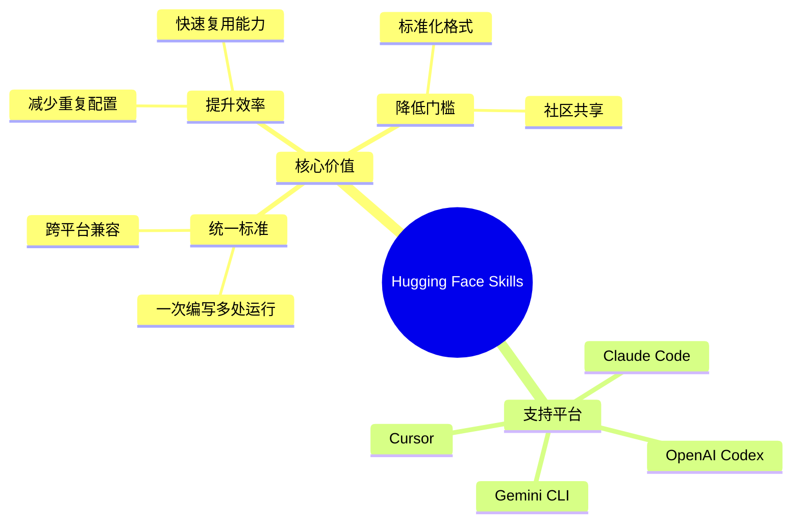
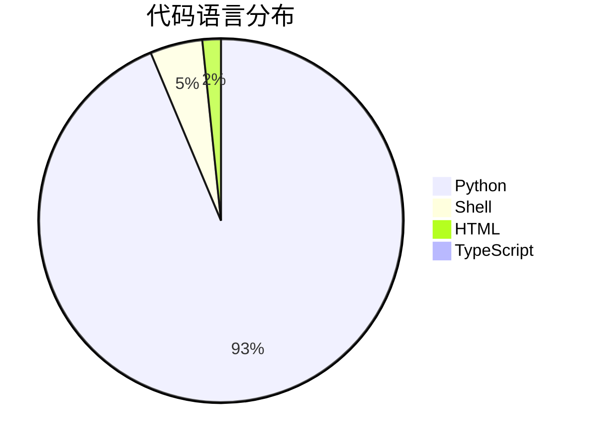
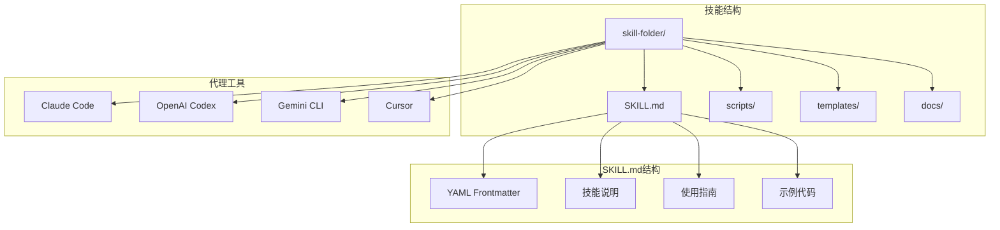
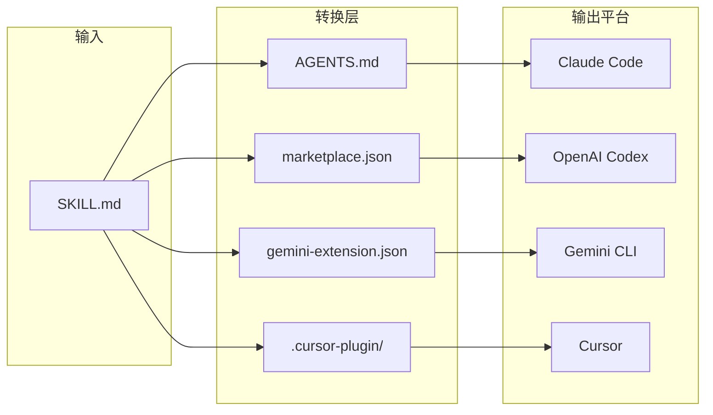
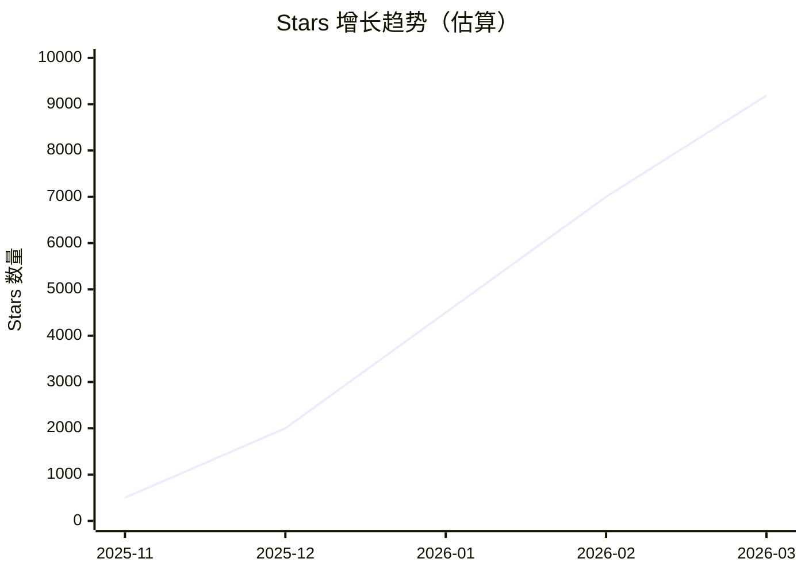
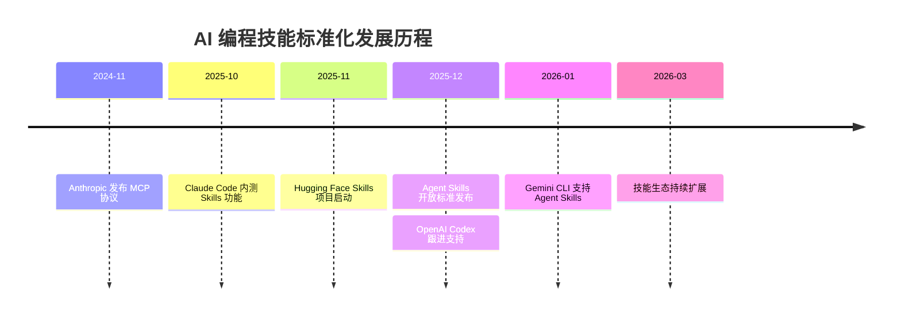
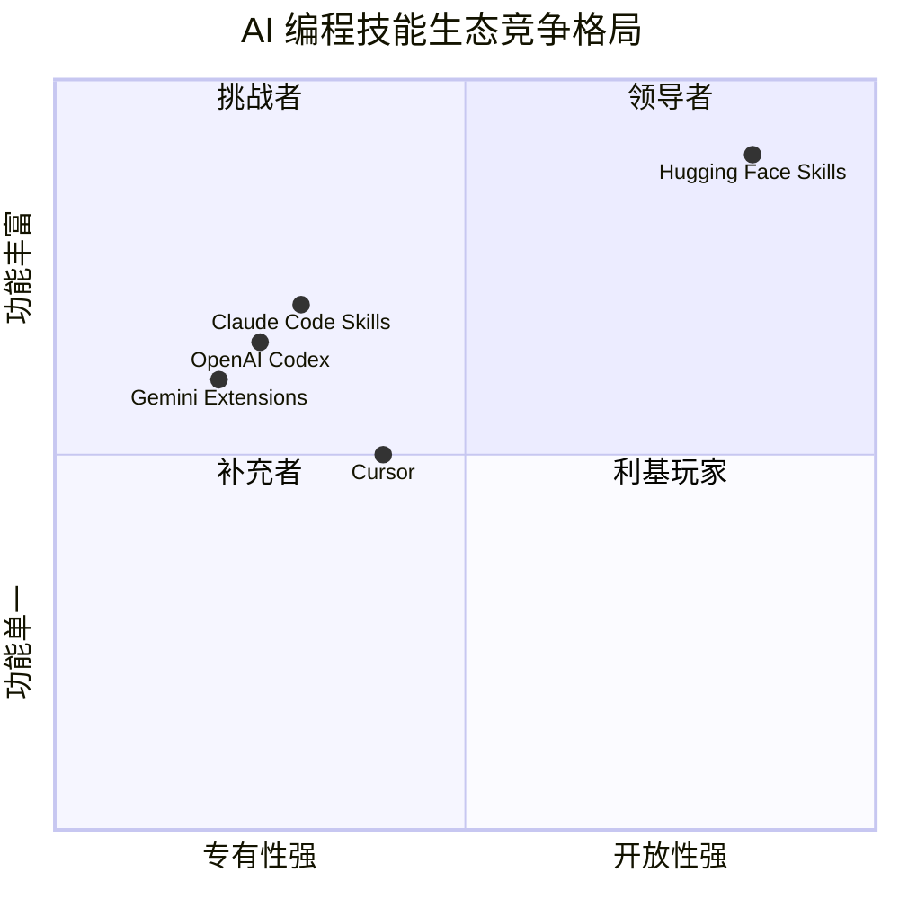
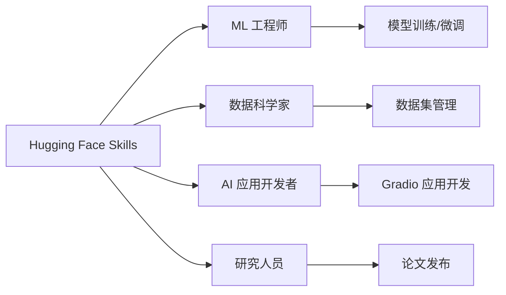

# huggingface/skills 深度研究报告

> Hugging Face Skills：统一 AI 编码工具的技能标准

---

## 项目概述

**huggingface/skills** 是 Hugging Face 官方推出的 AI/ML 任务技能定义仓库，旨在解决 AI 编码工具生态碎片化问题。该项目提供了一套标准化的技能定义格式，开发者只需编写一次技能，便能让技能在所有主流编码工具中顺利运行，包括 OpenAI Codex、Anthropic Claude Code、Google DeepMind Gemini CLI 和 Cursor。

### 核心价值



---

## 基本信息

| 指标 | 数值 |
|------|------|
| **Stars** | ⭐ 9,188 |
| **Forks** | 🍴 552 |
| **主要语言** | Python |
| **开源协议** | Apache-2.0 |
| **Open Issues** | 17 |
| **贡献者** | 24 人 |
| **创建时间** | 2025-11-24 |
| **最近更新** | 2026-03-17 |
| **GitHub** | [huggingface/skills](https://github.com/huggingface/skills) |

### 语言分布



---

## 技术分析

### 架构设计

Hugging Face Skills 采用模块化的技能文件夹架构，每个技能都是独立的、自包含的单元：



### 技术栈

| 技术 | 用途 | 占比 |
|------|------|------|
| Python | 核心技能脚本、ML 工作流 | 93.5% |
| Shell | 自动化脚本、发布工具 | 4.6% |
| HTML | 文档模板 | 1.6% |
| TypeScript | Web 组件 | 0.3% |

### 核心功能

#### 1. 技能定义标准

每个技能遵循 [Agent Skills](https://agentskills.io/home) 开放标准格式：

```markdown
---
name: skill-name
description: 技能描述和使用场景
---

# 技能标题
指导说明 + 示例 + 边界约束
```

#### 2. 可用技能列表

| 技能名称 | 功能描述 |
|----------|----------|
| `gradio` | 构建 Gradio Web UI 和演示应用 |
| `hf-cli` | 执行 Hugging Face Hub 操作（下载/上传模型、数据集） |
| `hugging-face-dataset-viewer` | 探索和查询 HF 数据集 |
| `hugging-face-datasets` | 创建和管理 HF 数据集 |
| `hugging-face-evaluation` | 管理模型评估结果 |
| `hugging-face-jobs` | 在 HF 基础设施上运行计算任务 |
| `hugging-face-model-trainer` | 训练/微调语言模型（SFT、DPO、GRPO） |
| `hugging-face-paper-publisher` | 发布和管理研究论文 |
| `hugging-face-tool-builder` | 构建 HF API 操作的可复用脚本 |
| `hugging-face-trackio` | ML 训练实验追踪和可视化 |
| `hugging-face-vision-trainer` | 训练视觉模型（目标检测、图像分类） |
| `transformers-js` | 在 JS/TS 中运行 ML 模型 |

#### 3. 多平台兼容机制



---

## 社区活跃度

### 增长趋势



### 活跃度指标

| 指标 | 状态 | 评价 |
|------|------|------|
| 更新频率 | 每日更新 | ⭐⭐⭐⭐⭐ |
| Issue 响应 | 活跃 | ⭐⭐⭐⭐ |
| PR 合并 | 频繁 | ⭐⭐⭐⭐ |
| 社区贡献 | 24 位贡献者 | ⭐⭐⭐⭐ |

### 项目里程碑

- **2025-11-24**: 项目创建
- **2025-12**: Anthropic 发布 Agent Skills 开放标准，OpenAI 快速跟进
- **2026-01**: 社区快速增长，技能生态扩展
- **2026-03**: 稳定发展，持续更新

---

## 发展趋势

### AI 编程工具市场预测

根据 Market Research Future 预测，AI 编程工具市场将从 2025 年的 **151.1 亿美元**增长到 2034 年的 **991 亿美元**，CAGR 达到 **23.24%**。

### 技能标准化趋势



### 未来展望

1. **技能市场兴起**: 预计将出现面向特定行业的技能市场（法律、医疗、金融）
2. **标准化加速**: Agent Skills 将成为组织编码机构知识的主要方式
3. **跨平台统一**: 一次编写、多处运行的愿景逐步实现

---

## 竞品对比

### AI 编程工具技能生态对比

| 特性 | Hugging Face Skills | Claude Code | OpenAI Codex | Gemini CLI |
|------|---------------------|-------------|--------------|------------|
| **技能格式** | Agent Skills 标准 | Skills | Skills.md | Extensions |
| **跨平台兼容** | ✅ 完全兼容 | ⚠️ 仅 Claude | ⚠️ 仅 OpenAI | ⚠️ 仅 Gemini |
| **ML 专注** | ✅ Hugging Face 生态 | ❌ 通用 | ❌ 通用 | ❌ 通用 |
| **社区驱动** | ✅ 开源贡献 | ❌ 官方 | ❌ 官方 | ❌ 官方 |
| **安装方式** | 多种方式 | Plugin | 复制/链接 | Extensions |

### 竞争格局分析



### 核心竞争优势

1. **跨平台兼容性**: 唯一真正实现"一次编写，多处运行"的技能库
2. **ML 生态深度**: 深度整合 Hugging Face 生态系统
3. **开放标准**: 遵循 Agent Skills 开放标准，避免厂商锁定
4. **社区驱动**: 开源模式，鼓励社区贡献和定制

---

## 总结评价

### 优势 ✅

| 优势 | 说明 |
|------|------|
| **跨平台统一** | 解决了 AI 编程工具生态碎片化的核心痛点 |
| **ML 专注** | 深度整合 HF 生态，提供完整的 ML 工作流技能 |
| **开放标准** | 遵循 Agent Skills 标准，避免厂商锁定 |
| **社区驱动** | 开源模式，24 位贡献者持续贡献 |
| **文档完善** | 每个技能都有详细的 SKILL.md 文档 |
| **安装便捷** | 支持多种安装方式，适配不同工具 |

### 劣势 ⚠️

| 劣势 | 说明 |
|------|------|
| **项目较新** | 2025年11月创建，生态仍在建设中 |
| **技能数量有限** | 目前仅有 12 个核心技能 |
| **学习曲线** | 需要理解 Agent Skills 标准格式 |
| **依赖 HF 生态** | 部分技能深度依赖 Hugging Face 平台 |

### 适用场景 🎯



| 场景 | 推荐技能 |
|------|----------|
| 模型训练/微调 | `hugging-face-model-trainer`, `hugging-face-vision-trainer` |
| 数据集管理 | `hugging-face-datasets`, `hugging-face-dataset-viewer` |
| 模型评估 | `hugging-face-evaluation` |
| 实验追踪 | `hugging-face-trackio` |
| Web 应用开发 | `gradio`, `transformers-js` |
| 论文发布 | `hugging-face-paper-publisher` |

### 推荐指数 ⭐

| 维度 | 评分 | 说明 |
|------|------|------|
| 创新性 | ⭐⭐⭐⭐⭐ | 解决了行业痛点，开创性工作 |
| 实用性 | ⭐⭐⭐⭐ | ML 场景非常实用，通用场景待扩展 |
| 活跃度 | ⭐⭐⭐⭐⭐ | 每日更新，社区活跃 |
| 文档质量 | ⭐⭐⭐⭐ | 文档完善，示例丰富 |
| 易用性 | ⭐⭐⭐⭐ | 安装便捷，学习曲线适中 |

**综合推荐指数：⭐⭐⭐⭐☆ (4.5/5)**

---

## 结论

Hugging Face Skills 是 AI 编程工具生态中的重要创新，它通过标准化技能定义解决了跨平台兼容性这一核心痛点。作为 Hugging Face 官方项目，它深度整合了 ML 生态系统，为 ML 工程师和数据科学家提供了完整的技能工具链。

虽然项目创建时间较短，技能数量有限，但其开放标准的设计理念、活跃的社区支持和明确的定位使其成为 AI 编程技能标准化的领导者。随着 AI 编程工具市场的快速增长，Hugging Face Skills 有望成为技能定义的事实标准。

**推荐人群**：ML 工程师、数据科学家、AI 应用开发者、研究人员

**推荐理由**：跨平台兼容、ML 生态深度整合、开放标准、社区驱动

---

*报告生成时间: 2026-03-17*
*数据来源: GitHub API、Web Search、项目文档*
