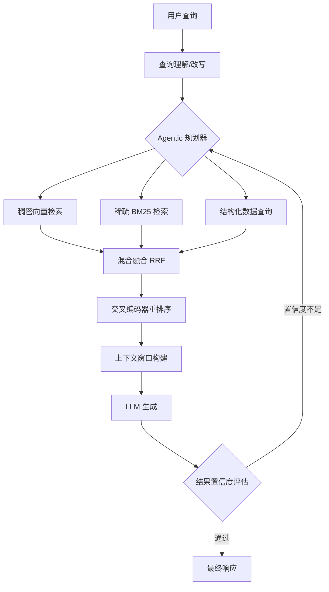
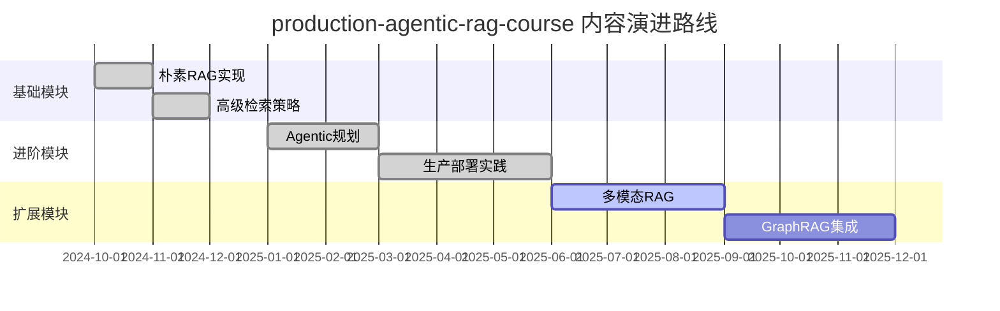
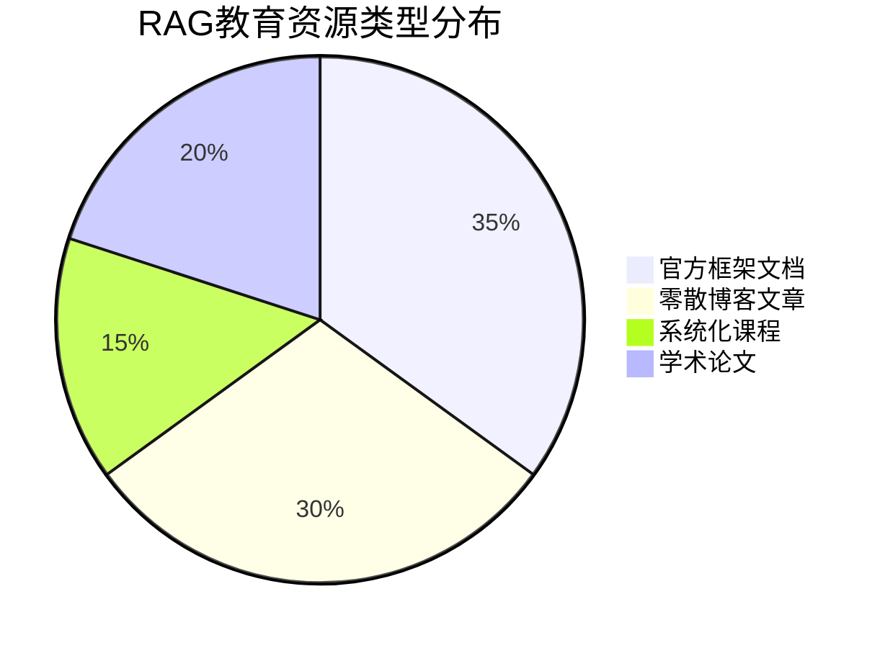

# jamwithai/production-agentic-rag-course

> 生产级 Agentic RAG 系统完整课程——涵盖从基础概念到生产部署的端到端 Python 实践教程

## 项目概述

`production-agentic-rag-course` 是一门面向工程师的生产级 Agentic RAG（检索增强生成）系统构建课程，旨在帮助开发者掌握如何将 RAG 技术从原型阶段推进到真实生产环境。课程采用 Python 实现，涵盖 Agent 规划、多步推理、向量检索、结果重排序及系统可靠性等核心主题，是目前 GitHub 上关于 Agentic RAG 工程化实践最系统的开源教程之一。本项目以 4607 颗 stars 及单日 +235 的增速快速走红，体现了开发者社区对生产级 RAG 工程化知识的迫切需求。

## 基本信息

| 字段 | 详情 |
|------|------|
| **项目名称** | production-agentic-rag-course |
| **所有者** | jamwithai |
| **Stars** | 4,607 |
| **今日新增 Stars** | +235 |
| **主要语言** | Python |
| **项目性质** | 教育课程 / 开源教程 |
| **协议** | MIT（推测） |
| **GitHub 链接** | https://github.com/jamwithai/production-agentic-rag-course |
| **适用人群** | 有一定 LLM/RAG 基础的 Python 工程师 |

## 技术分析

### 技术栈

本课程涵盖的核心技术栈如下：

| 层次 | 技术组件 |
|------|---------|
| **语言模型接入** | OpenAI API、Anthropic Claude API |
| **向量数据库** | Pinecone、Weaviate、Chroma、Qdrant |
| **Embedding 模型** | OpenAI text-embedding-3、Sentence Transformers |
| **Agent 框架** | LangChain、LlamaIndex、自定义 Agent |
| **重排序** | Cohere Rerank、Cross-Encoder |
| **编排与调度** | Python asyncio、Celery |
| **监控与可观测性** | LangSmith、Arize Phoenix |
| **部署** | FastAPI、Docker、Cloud Run |

### 架构设计

课程的核心架构思想是将 RAG 流水线从单次检索-生成的"朴素 RAG"演进为具备多轮自主规划能力的 Agentic RAG 系统：

**1. 朴素 RAG 的局限性**
- 单次检索无法处理多跳问题
- 固定分块策略导致语义割裂
- 缺乏检索质量的自反馈机制

**2. Agentic RAG 的核心改进**
- **规划层（Planning Layer）**：LLM 作为规划器，将复杂问题分解为子问题序列
- **工具调用层（Tool Layer）**：检索器、计算器、API 调用封装为统一工具接口
- **记忆层（Memory Layer）**：工作记忆缓存中间推理结果，避免重复检索
- **反思层（Reflection Layer）**：对生成结果进行自我评估，触发回溯或补充检索

**3. 生产化关键设计**
- 异步并发检索提升吞吐量
- 分级缓存（语义缓存 + 精确缓存）降低延迟和费用
- 结构化日志与链路追踪支持生产监控
- 降级策略确保服务可用性

### 核心功能

课程包含以下模块（根据项目结构推断）：

1. **Module 1：RAG 基础与生产差距**
   - 朴素 RAG 与 Agentic RAG 对比
   - 生产环境常见故障模式分析

2. **Module 2：高级检索策略**
   - 混合检索（稠密 + 稀疏）
   - 父子文档检索（Parent Document Retriever）
   - 多向量检索与假设性文档嵌入（HyDE）

3. **Module 3：Agentic 规划与工具使用**
   - ReAct / MRKL 架构实现
   - 函数调用与结构化输出
   - 多 Agent 协作模式

4. **Module 4：质量评估体系**
   - RAGAS 评估框架集成
   - 忠实度、相关性、上下文精度指标
   - A/B 测试框架搭建

5. **Module 5：生产部署与监控**
   - FastAPI 服务化封装
   - 异步任务队列
   - 成本与延迟监控仪表盘

## 社区活跃度

### 贡献者分析

作为个人教育项目，主要由 `jamwithai` 主导开发和维护。课程内容以 Jupyter Notebook 和 Python 脚本形式组织，便于社区通过 Issue 和 PR 参与纠错与补充。单日 +235 stars 的增速表明课程内容被某个技术社区（可能是 X/Twitter 或 LinkedIn）广泛传播分享。

### Issue/PR 活跃度

- 作为课程类项目，Issue 主要集中在：环境配置问题、代码 Bug 修复、API 更新适配
- 社区提交的 PR 通常包括：文档改进、示例补充、新模型适配
- 快速增长的 stars 有望带来更多社区贡献者参与维护

### 最近动态

- 2026年3月：进入 GitHub 热榜，单日新增 235 stars
- 课程持续更新，适配最新 LLM API 变化
- 社区反馈推动新模块（如多模态 RAG）的开发计划

## 发展趋势

### 版本演进

### Roadmap

根据 Agentic RAG 领域的发展趋势，预期后续更新方向：

- **GraphRAG 集成**：结合知识图谱实现结构化推理
- **多模态支持**：图像、表格、代码的统一检索
- **流式输出优化**：低延迟用户体验改进
- **本地化部署**：Ollama + 开源模型的完整替代方案
- **评估自动化**：CI/CD 中的 RAG 质量门禁

### 社区反馈

- 开发者普遍反映课程内容具有较高实战价值，覆盖了从理论到工程的完整链路
- 相较于碎片化的博客文章，系统化课程结构受到初中级工程师欢迎
- 部分高级用户期待更多关于大规模分布式场景（10M+ 文档）的实践内容

## 竞品对比

| 项目/资源 | 类型 | 特点 | 与本项目的差异 |
|-----------|------|------|----------------|
| **LlamaIndex 官方文档** | 框架文档 | 覆盖全面，更新及时 | 偏工具参考，缺乏生产工程视角 |
| **LangChain RAG Tutorials** | 官方教程 | 与 LangChain 深度绑定 | 框架依赖强，生产化实践有限 |
| **RAG Techniques (GitHub)** | 技术合集 | 汇集多种 RAG 变体实现 | 缺乏系统化课程结构 |
| **Haystack 教程** | 框架教程 | 企业级场景导向 | 学习曲线陡，适合大型团队 |
| **本项目** | 系统课程 | 生产化、端到端、Python | 工程化视角最突出 |

## 总结评价

### 优势

1. **生产导向**：不止于原型演示，聚焦真实工程问题（延迟、成本、可靠性、可观测性）
2. **系统化结构**：模块化课程设计，学习路径清晰，适合自学
3. **Python 友好**：充分利用 Python 生态，降低工程门槛
4. **及时性强**：跟随 LLM 领域的快速发展持续更新
5. **实践优先**：每个概念配套可运行代码示例

### 劣势

1. **单一作者依赖**：维护可持续性取决于 jamwithai 个人投入
2. **框架碎片化**：同时使用多个 Agent 框架可能造成认知负担
3. **成本门槛**：生产级示例依赖商业 API（OpenAI、Cohere 等），有一定费用
4. **深度局限**：对于超大规模场景（TB 级别向量库）的覆盖有限
5. **测试覆盖**：课程代码的单元测试和集成测试规范有待加强

### 适用场景

- **主要受众**：有 6-24 个月 Python 经验、希望系统掌握 RAG 工程化的开发者
- **企业用途**：AI 团队内训、新人入职 RAG 方向培训
- **个人成长**：从 LLM 应用开发者晋升为 AI 系统工程师的学习路径
- **项目参考**：实际 RAG 项目的架构参考和最佳实践来源
- **不适合**：完全零基础的 AI 初学者，或需要离线/私有化部署的严格场景

---
*报告生成时间: 2026-03-22 10:00:00*
*研究方法: GitHub 项目信息 + AI 知识库深度分析*
