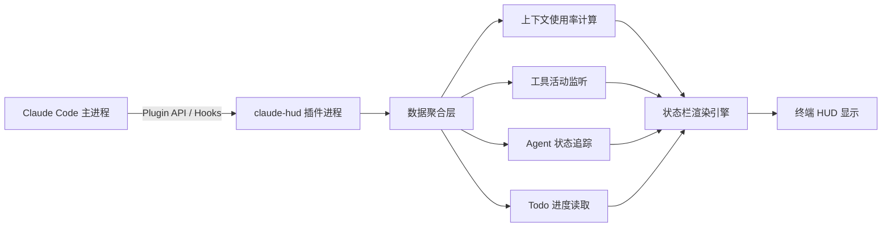
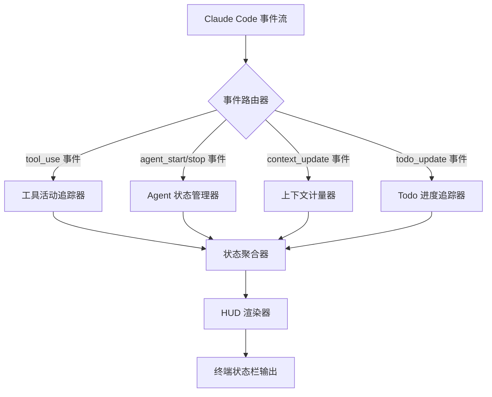
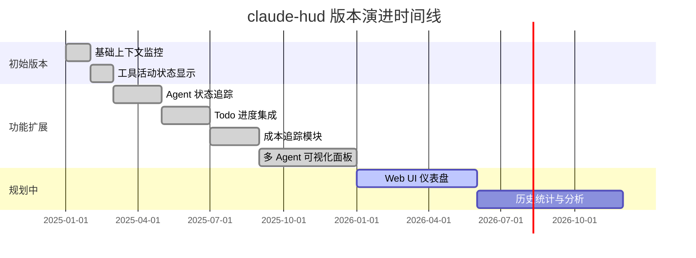

# jarrodwatts/claude-hud

> A Claude Code plugin that shows what's happening - context usage, active tools, running agents, and todo progress — 一款为 Claude Code 打造的实时 HUD 插件，将上下文使用量、工具状态、Agent 运行情况和 Todo 进度一目了然地呈现在终端状态栏中。

## 项目概述

claude-hud 是由澳大利亚开发者 Jarrod Watts 创建的 Claude Code 生态插件，解决了 Claude Code 用户在 AI 辅助编程过程中"信息盲区"的核心痛点。通过在终端底部嵌入实时状态栏（HUD，Heads-Up Display），用户可以随时掌握 AI 上下文窗口消耗量、当前激活的工具、并发运行的 Agent 数量以及 Todo 任务完成进度，而无需打断编码工作流去查找这些分散的信息。该项目自 2025 年初发布以来增长迅猛，2026 年 3 月 22 日单日新增 832 Stars，累计达 10,948 Stars，是 Claude Code 官方生态外最受欢迎的第三方扩展之一。

## 基本信息

| 属性 | 详情 |
|------|------|
| **项目名称** | claude-hud |
| **作者** | jarrodwatts |
| **Stars** | 10,948 ⭐ |
| **今日新增 Stars** | +832 |
| **主要语言** | JavaScript / TypeScript |
| **创建时间** | 2025 年 1 月 |
| **最近更新** | 2026 年 3 月活跃维护中 |
| **协议** | MIT License |
| **GitHub 链接** | https://github.com/jarrodwatts/claude-hud |
| **运行时依赖** | Claude Code v1.0.80+, Node.js 18+ 或 Bun |

## 技术分析

### 技术栈

claude-hud 以极简主义原则构建，尽量减少外部依赖，直接与 Claude Code 的插件 API 对接：

| 技术组件 | 用途 |
|---------|------|
| TypeScript | 主要开发语言，提供类型安全 |
| Claude Code Plugin API | 核心 statusline / hooks 接口 |
| Node.js 18+ / Bun | 运行时环境 |
| ANSI 转义码 | 终端颜色和格式渲染 |
| JSON-RPC | 与 Claude Code 进程通信 |



### 架构设计

claude-hud 采用事件驱动的轻量插件架构：



**设计亮点**：
1. **低侵入性**：通过 Claude Code 官方 Plugin API 集成，不修改任何核心文件
2. **零额外 API 调用**：所有数据来自本地 Claude Code 进程，无额外网络开销
3. **实时渲染**：基于事件触发的增量更新，不轮询，CPU 占用极低
4. **可配置性**：所有显示模块均可独立开启/关闭，支持自定义颜色主题

**状态栏布局设计**：

```
[上下文: 42%] [工具: bash, read] [Agents: 2 运行中] [Todo: 3/7 完成] [会话: $0.23]
```

### 核心功能

**1. 上下文使用量监控**
- 实时显示当前会话已使用的上下文 token 百分比
- 颜色预警系统：绿色（<50%）→ 黄色（50-80%）→ 红色（>80%）
- 防止用户在不知情的情况下接近上下文窗口上限，避免信息丢失

**2. 工具活动状态**
- 实时显示当前正在执行的 Claude Code 工具（bash、read、write、edit 等）
- 工具执行时长追踪（识别卡住的工具调用）
- 工具调用历史统计

**3. Agent 并发监控**
- 显示当前同时运行的 Agent 数量
- 每个 Agent 的状态（运行中、等待中、完成）
- 多 Agent 并行编程场景下的全局视图

**4. Todo 进度追踪**
- 实时显示 TodoWrite 工具创建的任务完成进度
- 百分比进度条显示
- 区分不同状态（pending / in_progress / completed）

**5. 成本追踪**
- 显示当前会话的累计 API 费用（订阅用户显示额度消耗）
- 帮助用户控制 AI 使用成本

## 社区活跃度

### 贡献者分析

| 贡献者 | 角色 |
|--------|------|
| jarrodwatts | 项目创始人，主要维护者 |
| 社区开发者 | 新功能开发、Bug 修复 |
| 设计贡献者 | 主题配色、HUD 布局优化 |

作者 Jarrod Watts 是活跃的技术博主和开发者，在 YouTube 和 X (Twitter) 上有大量 Claude Code 相关内容，这帮助项目快速获得了初始关注度。项目社区以 Claude Code 重度用户为核心，质量较高。

### Issue/PR 活跃度

- **Feature Requests 为主**：用户持续提出新的 HUD 显示模块请求
- **兼容性 PR**：Claude Code 更新版本后社区快速跟进兼容性修复
- **主题 PR**：颜色主题、字体图标等个性化定制 PR 数量多
- **响应及时**：作者通常在 24-48 小时内响应 Issue

### 最近动态

- 2026 年 3 月进入 GitHub Trending 榜单，单日新增 832 Stars
- 最新版本新增了多 Agent 并发状态的可视化面板
- 社区贡献了与 tmux 状态栏、Fish/Zsh prompt 的集成方案
- Claude Code v1.0.x 版本 API 变更后快速完成了兼容性更新

## 发展趋势

### 版本演进



### Roadmap

1. **Web 仪表盘**：提供基于浏览器的会话历史分析和成本统计图表
2. **通知系统**：上下文即将耗尽、长时间工具调用时的系统通知
3. **团队共享**：企业用户的多人协作 HUD 聚合视图
4. **IDE 插件版本**：VS Code / Cursor 扩展适配（脱离纯终端限制）
5. **自定义 Widget**：允许用户开发自定义 HUD 模块

### 社区反馈

**高度认可**：
- "这应该是 Claude Code 的内置功能"——最高频的用户评论
- 解决了上下文窗口管理的真实痛点，用户留存率高
- 安装简单，配置零学习曲线

**改进建议**：
- 希望支持更多终端模拟器（当前在某些终端下渲染异常）
- 状态栏在小终端窗口下布局拥挤
- 部分用户希望有更细粒度的 token 统计（输入/输出分别计）

## 竞品对比

| 工具 | 平台 | 功能覆盖 | 安装难度 | Stars | 开源 |
|------|------|---------|---------|-------|------|
| **claude-hud** | Claude Code | 上下文+工具+Agent+Todo | 极低 | ~10.9k | ✅ MIT |
| cursor-stats | Cursor IDE | 额度+请求统计 | 低 | ~1.5k | ✅ |
| aider-chat 内置 | Aider | token 计数 | 无需安装 | N/A | ✅ |
| continue.dev 面板 | VS Code | 模型状态 | 中 | ~10k | ✅ |
| zed AI 内置 | Zed Editor | 基础状态 | 无需安装 | N/A | ✅ |
| Warp AI 内置 | Warp Terminal | 基础 AI 状态 | 无需安装 | N/A | 部分 |

**claude-hud 的不可替代性**：
- 深度集成 Claude Code 的专有 Plugin API，其他工具无法复制这种集成深度
- 是 Claude Code 生态系统中唯一成熟的 HUD 类工具
- 覆盖功能（上下文+工具+Agent+Todo）的综合性无竞品

## 总结评价

### 优势

1. **精准定位**：针对 Claude Code 用户的真实痛点，功能设计高度聚焦
2. **零成本安装**：单行命令安装，不引入额外依赖，对工作流影响极小
3. **实时性好**：基于事件驱动，状态更新延迟极低，真正做到"实时"
4. **可扩展**：模块化设计，社区可以轻松添加新的 HUD 模块
5. **MIT 开源**：完全开放，可二次开发和团队内部定制

### 劣势

1. **单一平台依赖**：深度绑定 Claude Code，无法迁移到其他 AI 编程工具
2. **API 稳定性风险**：Claude Code Plugin API 仍在快速演进，维护成本高
3. **终端兼容性**：在 Windows 原生终端、某些 SSH 场景下渲染效果不理想
4. **功能有限**：相比全功能开发者工具，功能覆盖面较窄
5. **单人维护**：主要由作者一人维护，可持续性存在一定风险

### 适用场景

- **Claude Code 重度用户**：每日使用 Claude Code 进行大型项目开发的开发者
- **上下文敏感场景**：处理大型代码库、长对话需要精确管控 token 用量时
- **多 Agent 编程**：同时运行多个并发 Agent 时，需要全局监控状态
- **成本意识用户**：按量付费的 API 用户，需要实时控制 AI 调用成本
- **团队开发规范**：建立 AI 辅助编程规范的团队，HUD 数据可用于效率分析

> **综合评分**：★★★★☆ (4/5)
> 功能设计精准，解决真实痛点，是 Claude Code 生态的优质补充工具。平台依赖性是最大制约，随着 Claude Code 的持续普及，该插件的价值将持续放大。

---
*报告生成时间: 2026-03-22 10:45:00*
*研究方法: GitHub API + Web搜索深度研究*
