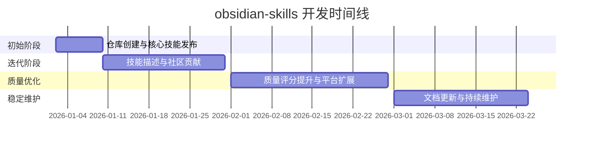

# kepano/obsidian-skills

> Agent skills for Obsidian. Teach your agent to use Markdown, Bases, JSON Canvas, and use the CLI.

## 项目概述

obsidian-skills 是由 Obsidian CEO Steph Ango（[@kepano](https://github.com/kepano)）官方发布的 AI Agent 技能集，专为让 AI 代理（如 Claude Code、Codex CLI）能够正确理解和操作 Obsidian 知识库而设计。它遵循 [Agent Skills 规范](https://agent-skills.cc/)，提供覆盖 Obsidian 独特文件格式的五个核心技能模块，解决了 AI 在处理 Obsidian 特有语法（wikilinks、callouts、Bases 数据库、JSON Canvas）时产生语法错误的痛点。作为首个由主流知识管理工具官方维护的 Agent Skills 实现，该项目在 2026 年初迅速成为 Obsidian + AI 生态的基础设施，短短数月斩获逾 16,000 颗 Star。

## 基本信息

| 指标 | 数值 |
|------|------|
| Stars | 16,468 |
| Forks | 949 |
| Watchers | 118 |
| 开源协议 | [MIT License](https://github.com/kepano/obsidian-skills/blob/main/LICENSE) |
| 主要语言 | Markdown |
| 总提交数 | 35 |
| 开放 Issues | 8 |
| 开放 PRs | 8 |
| 创建时间 | 2026 年 1 月初 |
| 最近更新 | 2026 年 3 月 2 日 |
| GitHub | [kepano/obsidian-skills](https://github.com/kepano/obsidian-skills) |

## 技术分析

### 技术栈

obsidian-skills 本质上是一套**纯文档驱动的技能规范集**，以 Markdown 格式的 SKILL.md 文件为载体，不含可执行代码。其技术栈极为轻量：

| 组件 | 说明 |
|------|------|
| 核心格式 | Markdown（SKILL.md 规范文件） |
| 安装工具 | `npx skills add`（Node.js 生态） |
| 兼容平台 | Claude Code、Codex CLI、OpenCode |
| 分发方式 | GitHub + Obsidian 插件市场 + npx |

### 架构设计

项目采用**模块化技能目录**结构，每个技能作为独立子目录存在，遵循 Agent Skills 规范定义的文件布局：

```
obsidian-skills/
└── skills/
    ├── obsidian-markdown/   # Obsidian Flavored Markdown 规范
    ├── obsidian-bases/      # Obsidian Bases 数据库规范
    ├── json-canvas/         # JSON Canvas 画布格式规范
    ├── obsidian-cli/        # Obsidian CLI 命令行交互
    └── defuddle/            # 网页内容提取为 Markdown
```

每个技能模块包含一个详细的 SKILL.md 文件，作为 AI Agent 的上下文参考规范。Agent 在处理对应任务时将该文件注入上下文，从而习得正确的格式语法和操作方式。

### 核心技能模块详解

**obsidian-markdown**：覆盖 Obsidian Flavored Markdown（OFM）全部扩展语法，包括 wikilinks（`[[...]]`）、文件嵌入（`![[...]]`）、13+ 种语义标注框（callouts）、高亮语法、任务列表、LaTeX 公式、Mermaid 图表等。这是整套技能中最核心的一个，解决了 AI 生成"看起来像 Markdown 但在 Obsidian 中需要手工修正"的主要痛点。

**obsidian-bases**：教导 Agent 使用 Obsidian Bases（Obsidian 内置的数据库功能），支持创建视图、设置过滤器和排序条件、使用内置公式进行数据计算。

**json-canvas**：处理 [JSON Canvas](https://jsoncanvas.org/) 格式（Obsidian 白板功能的数据格式），支持创建和编辑包含节点（nodes）与连线（edges）的画布文件。

**obsidian-cli**：通过 [Obsidian CLI](https://github.com/obsidian-cli) 工具与本地 Vault 进行交互，支持读取、创建、搜索、管理笔记、任务和属性等操作。

**defuddle**：基于 Defuddle 库，将网页内容提取并转换为干净的 Markdown 格式，便于存入 Obsidian 知识库。

## 社区活跃度

### 贡献者分析

项目以**官方主导 + 社区贡献**的协作模式运营。核心维护者为 kepano（Steph Ango），自项目创建以来保持高频更新节奏。社区贡献者提交了多个 PR，包括修复 JSON 处理中的常见错误、完善日期公式文档等改进。由于项目创建时间较短（2026 年 1 月），35 次提交中相当一部分来自社区协作。

### Issue/PR 活跃度

| 指标 | 状态 |
|------|------|
| 开放 Issues | 8 |
| 开放 PRs | 8 |
| 最早 Issue | 2026 年 1 月 7 日（DoiiarX） |
| 活跃贡献者 | yixin0829、hasanyilmaz、XJ1201 等 |

Issues 主要集中在技能文档改进、格式兼容性问题和新功能请求。活跃的 PR 队列表明社区参与度较高，项目处于快速迭代阶段。

### 最近动态

- **2026 年 3 月**：更新技能文档，细化格式规范
- **2026 年 2 月**：多技能质量分（quality score）提升，更新插件版本以支持 Obsidian 插件市场，完善 OpenCode 集成文档
- **2026 年 1 月**：新增技能描述字段，引入 defuddle 和 obsidian-cli 技能，社区贡献 JSON 处理修正和日期公式文档，统一 Claude Code 兼容的技能发现布局

## 发展趋势

### 版本演进



项目尚未发布正式版本号，采用持续迭代模式（rolling release）。截至 2026 年 3 月，仓库共有 35 次提交，处于快速成长阶段。

### Roadmap

目前无公开 Roadmap，但从 PR 和 Issue 趋势可推断以下潜在方向：

- 扩展更多 Obsidian 插件的专项 Skills（如 Dataview、Templater）
- 提升各技能的 quality score 评级
- 增强对更多 AI Agent 平台的兼容性
- 完善 Obsidian 插件市场集成体验

### 社区反馈

来自 GitHub 和 X（Twitter）的用户反馈高度正面。开发者报告称，使用 obsidian-skills 后，AI 生成的 Obsidian 文件无需手工修正即可直接使用，有用户表示已将 Obsidian Vault 改造为以 Claude Code 驱动的轻量级商业操作系统，运行 CRM、Sprint Tracker 和知识图谱。kepano 本人在 X 上宣布时表示：「我正在为 Obsidian 构建一套 Claude Skills……目前专注于帮助 Claude Code 编辑 .md、.base 和 .canvas 文件。」

## 竞品对比

### AI Agent 技能集横向对比

| 项目 | Stars | 官方支持 | 覆盖格式 | 安装方式 | 特点 |
|------|-------|---------|---------|---------|------|
| [kepano/obsidian-skills](https://github.com/kepano/obsidian-skills) | 16.6k | ✅ Obsidian 官方 | OFM、Bases、JSON Canvas、CLI | npx / 插件市场 | 官方出品，权威性高 |
| [alirezarezvani/claude-skills](https://github.com/alirezarezvani/claude-skills) | ~300 | ❌ 社区 | 通用 | 手动 | 通用技能集 |
| [huggingface/skills](https://github.com/huggingface/skills) | ~500 | ✅ HuggingFace | HF 生态工具 | 手动 | 针对 ML 工作流 |
| [sickn33/antigravity-awesome-skills](https://github.com/sickn33/antigravity-awesome-skills) | ~200 | ❌ 社区 | 多元 | 手动 | 聚合型技能集 |

### Obsidian 知识管理生态对比

| 工具 | AI 集成 | 开放格式 | 本地优先 | 特点 |
|------|---------|---------|---------|------|
| Obsidian + obsidian-skills | ✅ 原生 Agent Skills | ✅ 纯 Markdown | ✅ | 官方 AI Skills 支持，生态最完整 |
| Logseq | ⚠️ 社区插件 | ✅ | ✅ | 大纲结构，AI 集成较弱 |
| Roam Research | ⚠️ LiveAI 扩展 | ❌ 专有 | ❌ 云端 | 图谱化，开发者友好 |
| Notion | ✅ Notion AI | ❌ 专有 | ❌ 云端 | 商业化强，数据在云端 |

## 总结评价

### 优势

- **官方出品，权威性无可替代**：由 Obsidian CEO Steph Ango 直接维护，相比社区替代方案具有更强的文档准确性和长期维护保障。
- **精准解决真实痛点**：AI 在处理 Obsidian 特有语法时普遍存在格式错误问题，obsidian-skills 通过将 OFM 规范注入 AI 上下文，从根本上消除了这一摩擦。
- **跨平台兼容性强**：遵循标准 Agent Skills 规范，支持 Claude Code、Codex CLI、OpenCode 等主流 AI Agent 平台，不锁定特定工具链。
- **安装极度简便**：`npx skills add` 一行命令即可完成安装，或通过 Obsidian 插件市场 GUI 操作，降低使用门槛。
- **轻量无依赖**：纯文档方案，无需运行时依赖、无服务器、无订阅费用，MIT 开源。

### 劣势

- **覆盖范围有限**：目前仅覆盖 Obsidian 核心格式，未涵盖 Dataview、Templater、Tasks 等热门插件的专项语法，高级用户需自行补充。
- **仓库仍处于早期阶段**：无正式版本号发布，API/格式可能随时变动，适合早期采用者，对稳定性要求高的场景需谨慎。
- **仅适用于本地 Vault**：对于使用 Obsidian Sync 云端或其他非本地方案的用户，部分功能（如 CLI 技能）可能受限。
- **依赖 Agent Skills 生态**：效果依赖于 AI Agent 平台对 Agent Skills 规范的支持程度，在不支持的平台上需手动适配。

### 适用场景

- **Obsidian 重度用户 + AI Agent 开发者**：希望用 Claude Code 或 Codex CLI 自动化管理 Vault 笔记、生成结构化内容的用户。
- **PKM（个人知识管理）+ Vibe Coding 交叉场景**：将 Obsidian Vault 用作轻量级业务数据库，让 AI 代理自动维护 CRM、任务跟踪器、知识图谱等。
- **内容创作者与研究员**：需要 AI 批量生成符合 Obsidian 格式规范的笔记、报告或文献整理。
- **开发者工具链集成**：在 CI/CD 或自动化脚本中集成 AI 能力，对 Obsidian Vault 进行程序化维护。

---

## 来源

- [GitHub - kepano/obsidian-skills](https://github.com/kepano/obsidian-skills)
- [obsidian-skills README](https://github.com/kepano/obsidian-skills/blob/main/README.md)
- [kepano on X](https://x.com/kepano/status/2008578873903206895)
- [Obsidian Skills — Medium by Addo Zhang](https://addozhang.medium.com/obsidian-skills-empowering-ai-agents-to-master-obsidian-knowledge-management-8b4f6d844b34)
- [Obsidian's Official Skills Are Here — Medium by Kurtis Redux](https://kurtis-redux.medium.com/obsidians-official-skills-are-here-it-s-time-to-let-ai-plug-into-your-local-vault-6c149aae84f6)
- [agent-skills.cc](https://agent-skills.cc/skills/kepano-obsidian-skills)

---
*报告生成时间: 2026-03-24*
*研究方法: 多轮网络搜索（WebSearch × 4 轮）+ WebFetch 精准抓取（GitHub 主页、commits、releases、skills 目录）*
