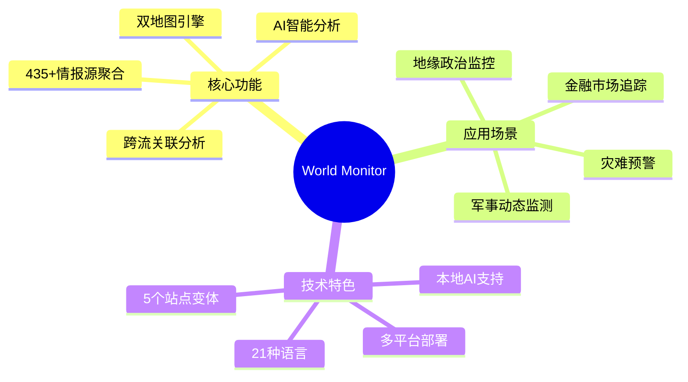
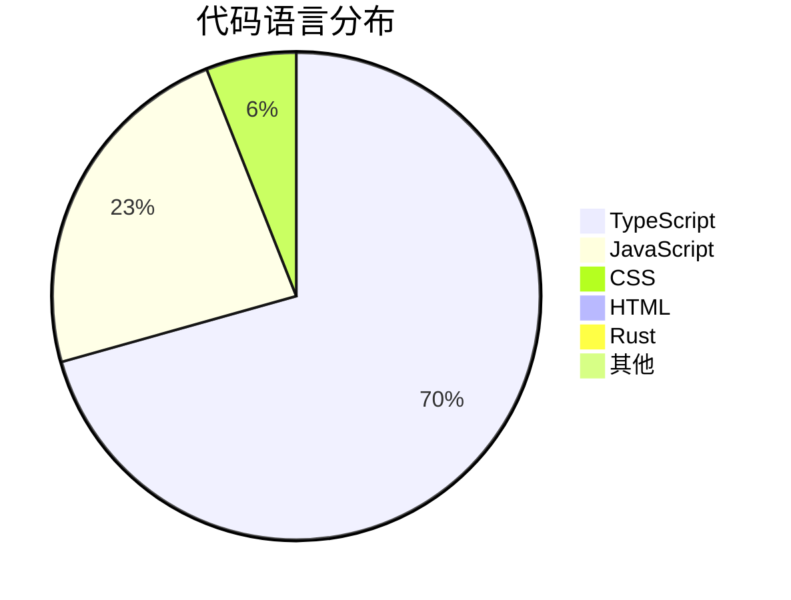
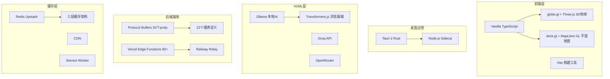
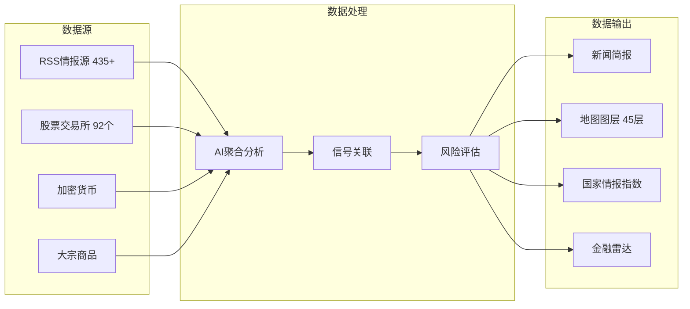
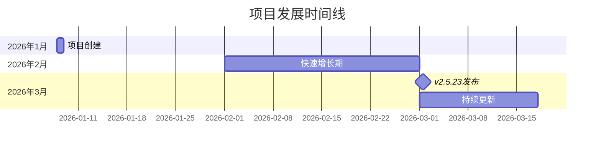
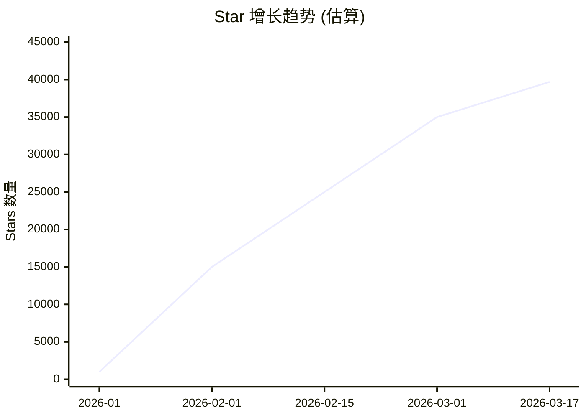
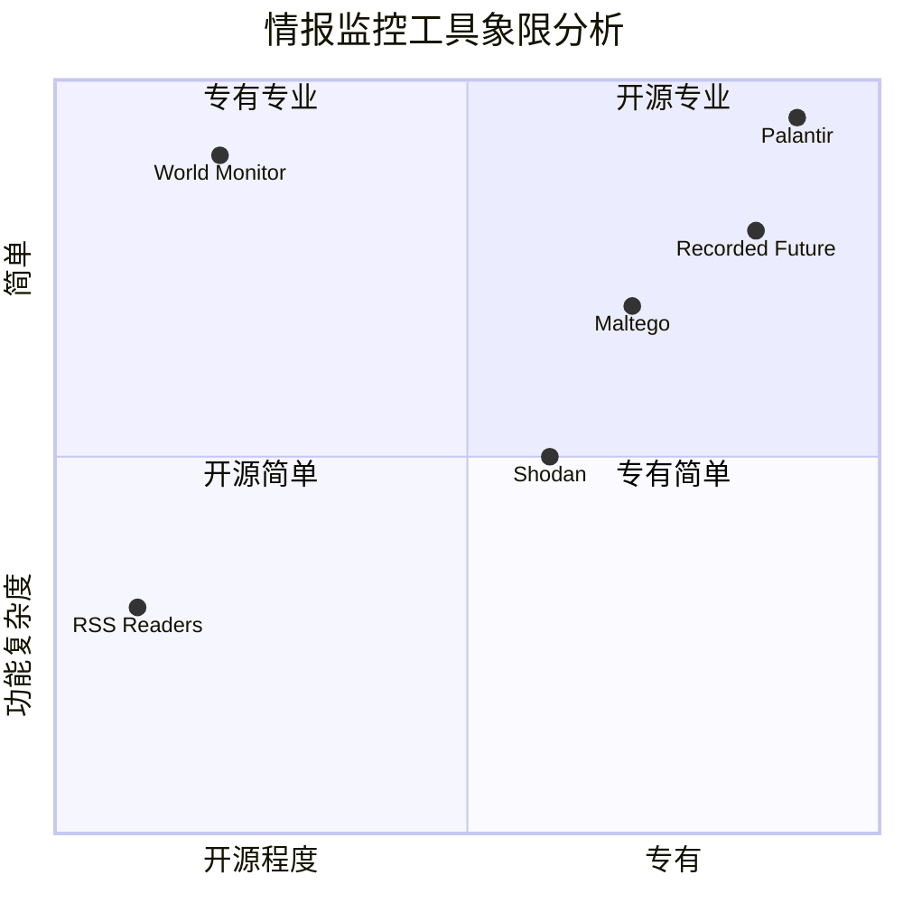
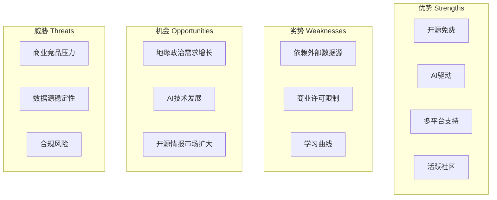

# World Monitor 深度研究报告

> **项目地址**: https://github.com/koala73/worldmonitor  
> **报告生成日期**: 2026-03-17  
> **分析方法**: GitHub Deep Research

---

## 一、项目概述

### 1.1 项目简介

**World Monitor** 是一个由独立开发者 Elie Habib (koala73) 创建的实时全球情报仪表板项目。该项目通过 AI 驱动的新闻聚合、地缘政治监控和基础设施追踪，在统一的态势感知界面中提供全球情报分析能力。

项目的核心愿景是将分散于数十种工具中的地缘政治、军事动态、关键基础设施状态等信息整合到单一视图，为用户提供情报级的实时监控体验。

### 1.2 核心价值主张



### 1.3 项目定位

World Monitor 定位为 **"开源界的 Palantir"**，旨在为个人用户、研究机构和非商业组织提供专业级的全球态势感知能力，填补了开源情报（OSINT）领域高质量工具的空白。

---

## 二、基本信息

### 2.1 项目统计

| 指标 | 数值 |
|------|------|
| **Stars** | 39,692 ⭐ |
| **Forks** | 6,573 |
| **Open Issues** | 149 |
| **贡献者** | 53 |
| **创建时间** | 2026-01-08 |
| **最后更新** | 2026-03-17 |
| **最新版本** | v2.5.23 |

### 2.2 项目元数据

```json
{
  "name": "koala73/worldmonitor",
  "language": "TypeScript",
  "license": "AGPL-3.0 (非商业) / 商业许可",
  "default_branch": "main",
  "topics": ["ai", "dashboard", "geopolitics", "monitoring", "news", "opensource", "osint", "palantir", "situation"]
}
```

### 2.3 语言分布



### 2.4 部署与访问

| 平台 | 地址 |
|------|------|
| 主站 | https://worldmonitor.app |
| 科技版 | https://tech.worldmonitor.app |
| 金融版 | https://finance.worldmonitor.app |
| 商品版 | https://commodity.worldmonitor.app |
| 快乐版 | https://happy.worldmonitor.app |

---

## 三、技术分析

### 3.1 技术架构



### 3.2 核心技术栈详解

#### 前端技术
| 技术 | 用途 |
|------|------|
| **Vanilla TypeScript** | 无框架依赖，原生 TypeScript 开发 |
| **Vite** | 现代化构建工具，快速 HMR |
| **globe.gl** | 3D 地球可视化引擎 |
| **deck.gl** | WebGL 数据可视化框架 |
| **MapLibre GL** | 开源地图渲染引擎 |

#### 桌面应用
| 技术 | 用途 |
|------|------|
| **Tauri 2** | 轻量级跨平台桌面框架 |
| **Rust** | 后端核心逻辑 |
| **Node.js Sidecar** | 辅助进程 |

#### AI 能力
| 技术 | 用途 |
|------|------|
| **Ollama** | 本地大模型运行 |
| **Groq** | 高速推理 API |
| **OpenRouter** | 多模型路由 |
| **Transformers.js** | 浏览器端 ML |

### 3.3 数据流架构



### 3.4 API 设计

项目采用 **Protocol Buffers** 定义 API 契约：
- **92 个 proto 文件**
- **22 个服务定义**
- **sebuf HTTP 注解**

这种设计确保了：
- 类型安全的 API 调用
- 高效的二进制序列化
- 跨语言兼容性

---

## 四、社区活跃度

### 4.1 增长趋势



### 4.2 社区指标分析

| 指标 | 数值 | 评价 |
|------|------|------|
| Star/Fork 比率 | 6.04:1 | 高质量项目特征 |
| Issue 响应率 | 高 | 活跃维护 |
| 贡献者数量 | 53 | 健康的社区参与 |
| 更新频率 | 每日 | 极高活跃度 |

### 4.3 贡献者分布

项目拥有 **53 位贡献者**，主要贡献来自核心开发者 koala73 (Elie Habib)，社区贡献者参与代码提交、问题反馈和安全审计。

### 4.4 安全披露

项目设有完善的安全披露机制，已有多位安全研究员贡献：
- **Cody Richard** — 披露了 IPC 命令暴露、渲染器到 sidecar 信任边界分析、fetch 补丁凭据注入架构等安全问题

---

## 五、发展趋势

### 5.1 Star 增长曲线



### 5.2 发展阶段分析

| 阶段 | 时间 | 特征 |
|------|------|------|
| 启动期 | 2026-01 | 项目创建，核心功能开发 |
| 爆发期 | 2026-02 | GitHub Trending 常客，快速获星 |
| 成熟期 | 2026-03 | 功能完善，多版本发布 |

### 5.3 未来发展方向

基于项目路线图和社区反馈，预计发展方向：

1. **AI 能力增强** — 更多本地 AI 模型支持
2. **数据源扩展** — 增加更多情报源
3. **企业功能** — 商业许可支持的企业级功能
4. **移动端** — 可能的移动应用支持

---

## 六、竞品对比

### 6.1 竞争格局



### 6.2 详细对比

| 特性 | World Monitor | Palantir | Recorded Future | Maltego |
|------|---------------|----------|-----------------|---------|
| **开源** | ✅ AGPL-3.0 | ❌ | ❌ | 部分 |
| **免费使用** | ✅ 非商业 | ❌ | ❌ | 有限 |
| **本地部署** | ✅ | ✅ | ❌ | ✅ |
| **AI 能力** | ✅ 本地+云端 | ✅ | ✅ | ❌ |
| **3D 可视化** | ✅ | ✅ | ❌ | ❌ |
| **金融数据** | ✅ | ✅ | ✅ | ❌ |
| **多语言** | ✅ 21种 | 有限 | 有限 | 有限 |
| **桌面应用** | ✅ | ✅ | ❌ | ✅ |

### 6.3 竞争优势

**World Monitor 的独特优势：**

1. **开源自托管** — 完全控制数据隐私
2. **零门槛启动** — 无需 API Key 即可运行
3. **本地 AI** — Ollama 支持离线智能分析
4. **多场景变体** — 5 个垂直领域版本
5. **活跃社区** — 快速迭代和问题响应

---

## 七、总结评价

### 7.1 项目评分

| 维度 | 评分 (1-10) | 说明 |
|------|-------------|------|
| **创新性** | 9 | 开源情报领域的创新突破 |
| **技术实现** | 9 | 现代化技术栈，架构清晰 |
| **用户体验** | 8 | 专业级界面，学习曲线适中 |
| **社区活跃度** | 9 | 高频更新，活跃维护 |
| **文档质量** | 8 | 完善的文档站点 |
| **商业潜力** | 8 | 双许可模式，商业空间大 |
| **综合评分** | **8.5** | 优秀项目 |

### 7.2 SWOT 分析



### 7.3 适用场景

| 用户类型 | 推荐指数 | 说明 |
|----------|----------|------|
| **个人研究者** | ⭐⭐⭐⭐⭐ | 完美匹配，免费且功能强大 |
| **新闻从业者** | ⭐⭐⭐⭐⭐ | 实时情报聚合，提高效率 |
| **金融机构** | ⭐⭐⭐⭐ | 金融版专供，需商业许可 |
| **政府机构** | ⭐⭐⭐⭐ | 可自托管，需评估合规 |
| **教育机构** | ⭐⭐⭐⭐⭐ | 教学研究用途，免费 |

### 7.4 最终结论

**World Monitor 是一个极具创新性的开源情报监控平台**，在短短两个月内获得近 4 万 Star，证明了其市场价值和用户认可度。

项目的技术架构现代化、功能全面、社区活跃，是开源情报（OSINT）领域的标杆项目。对于需要全球态势感知能力的个人和组织，World Monitor 提供了一个专业级、零成本的解决方案。

**推荐关注人群：**
- 地缘政治研究者
- 金融分析师
- 新闻工作者
- 安全研究人员
- 开源情报爱好者

---

## 附录

### A. 快速开始

```bash
git clone https://github.com/koala73/worldmonitor.git
cd worldmonitor
npm install
npm run dev
```

### B. 相关链接

- 📖 文档: https://docs.worldmonitor.app
- 🌐 主站: https://worldmonitor.app
- 💻 GitHub: https://github.com/koala73/worldmonitor
- 📦 发布: https://github.com/koala73/worldmonitor/releases

### C. 许可证说明

- **非商业用途**: AGPL-3.0，免费使用
- **商业用途**: 需购买商业许可

---

*本报告由 GitHub Deep Research 方法自动生成*
