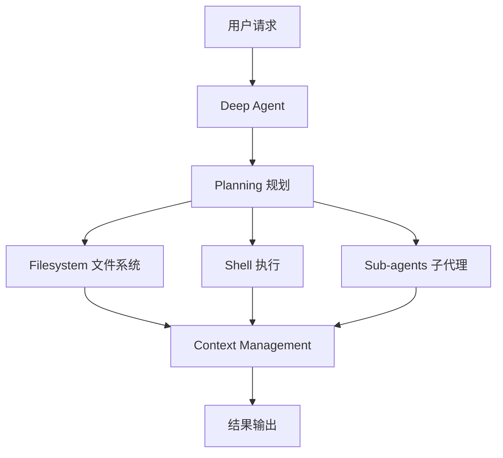
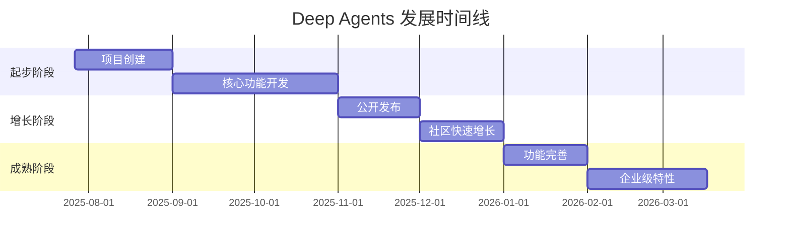

# langchain-ai/deepagents

> Agent harness built with LangChain and LangGraph. Equipped with a planning tool, a filesystem backend, and the ability to spawn subagents - well-equipped to handle complex agentic tasks.

## 项目概述

**Deep Agents** 是 LangChain 推出的"开箱即用"的 AI 代理框架，基于 LangGraph 运行时构建。它不是从零开始构建代理，而是提供了一个完整的、经过实战检验的代理工具包，包含规划工具、文件系统后端、子代理生成能力等核心功能。项目灵感来源于 Claude Code，旨在打造一个更加通用、可扩展的代理框架。Deep Agents 解决了长期运行代理面临的四大核心问题：进度丢失、上下文耗尽、子任务噪音干扰、目标迷失。

## 基本信息

| 指标 | 数值 |
|------|------|
| Stars | 13,498 |
| Forks | 2,063 |
| 语言 | Python (99.5%) |
| 开源协议 | MIT License |
| 创建时间 | 2025-07-27 |
| 最近更新 | 2026-03-17 |
| 最近推送 | 2026-03-17 |
| 贡献者数量 | 85 |
| 最新版本 | deepagents-cli==0.0.34 |
| GitHub | [langchain-ai/deepagents](https://github.com/langchain-ai/deepagents) |

## 技术分析

### 技术栈

```
Python: 4,629,193 字节 (99.5%)
Makefile: 20,017 字节 (0.4%)
Shell: 2,778 字节 (0.1%)
```

**核心技术**：
- **LangGraph** - 状态管理和持久化运行时
- **LangChain** - 工具和模型集成层
- **MCP (Model Context Protocol)** - 通过 langchain-mcp-adapters 支持
- **Python** - 主要开发语言

### 架构设计

Deep Agents 采用"四大核心原语"架构，这是所有严肃代理框架（Claude Code、Codex、Manus、OpenClaw）的共同设计模式：



**核心组件**：

1. **Planning（规划）**
   - `write_todos` - 任务分解和进度跟踪
   - 自动规划下一步行动
   - 长期目标管理

2. **Filesystem（文件系统）**
   - `read_file` - 读取文件
   - `write_file` - 写入文件
   - `edit_file` - 编辑文件
   - `ls` - 列出目录
   - `glob` - 文件模式匹配
   - `grep` - 内容搜索

3. **Shell Access（Shell 访问）**
   - `execute` - 执行命令（支持沙箱）
   - 安全隔离执行环境

4. **Sub-agents（子代理）**
   - `task` - 委托工作
   - 隔离上下文窗口
   - 并行任务执行

### 核心功能

**开箱即用特性**：

| 功能 | 描述 |
|------|------|
| Planning | 任务分解与进度跟踪 |
| Filesystem | 完整的文件操作工具集 |
| Shell Access | 安全的命令执行环境 |
| Sub-agents | 子代理生成与任务委托 |
| Smart Defaults | 预配置的提示词和工具使用指南 |
| Context Management | 自动摘要、大输出文件化 |
| Streaming | 支持流式输出 |
| Persistence | LangGraph 持久化支持 |
| Human-in-the-loop | 人机协作审批流程 |

**CLI 功能**：
- Web 搜索集成
- 远程沙箱
- 持久化内存
- 人机协作审批
- 更多企业级功能

## 社区活跃度

### 贡献者分析

项目拥有 **85 位贡献者**，主要由 LangChain 团队维护。

### Issue/PR 活跃度

- **开放 Issues**: 169 个
- **PR 合并频率**: 高频（每日多个 PR）
- **响应速度**: LangChain 团队积极维护
- **版本更新**: 频繁发布新版本（最新：0.0.34）

### 最近动态

- **2026-03-17**: 发布 deepagents-cli==0.0.34
- **持续更新**: 每日都有代码提交
- **文档完善**: 官方文档持续改进
- **社区增长**: Stars 快速增长至 13,000+

## 发展趋势

### 版本演进



### 关键里程碑

| 时间 | 事件 | 影响 |
|------|------|------|
| 2025-07-27 | 项目创建 | LangChain 团队启动项目 |
| 2025-09-29 | Claude Agent SDK 发布 | 确立代理框架设计模式 |
| 2025-11 | 公开发布 | 社区开始关注 |
| 2026-01 | 功能完善 | 核心功能稳定 |
| 2026-03-15 | MarkTechPost 报道 | 获得广泛关注 |
| 2026-03-17 | 突破 13K Stars | 成为热门代理框架 |

### Roadmap

**未来发展方向**：
1. 增强多模态支持
2. 改进上下文管理算法
3. 扩展 MCP 工具生态
4. 优化子代理协作机制

### 社区反馈

**用户评价**：
- ⭐ **设计理念先进**: 四大原语架构被广泛认可
- 🚀 **开箱即用**: 快速上手，无需复杂配置
- 🔧 **高度可定制**: 支持自定义工具、模型、提示词
- 📚 **文档完善**: 官方文档详尽

## 竞品对比

| 项目 | Stars | 语言 | 特点 |
|------|-------|------|------|
| Deep Agents | 13,498 | Python | 开箱即用，LangGraph 原生 |
| Claude Code | N/A | - | Anthropic 官方，生产级 |
| Codex SDK | N/A | - | OpenAI 官方，代码生成 |
| Manus | N/A | - | 开源代理框架 |
| AutoGen | 30,000+ | Python | 微软多代理框架 |
| CrewAI | 25,000+ | Python | 角色扮演代理框架 |

**与 Claude Code 对比**：

| 特性 | Deep Agents | Claude Code |
|------|-------------|-------------|
| 开源 | ✅ MIT | ❌ 闭源 |
| 提供商 | LangChain | Anthropic |
| 运行时 | LangGraph | 自研 |
| 模型支持 | 多模型 | 仅 Claude |
| 自定义 | 高度可定制 | 有限定制 |
| 生产就绪 | 快速成熟 | 已成熟 |

**竞争优势**：
- ✅ **100% 开源**: MIT 协议，完全可扩展
- ✅ **模型无关**: 支持任何支持工具调用的 LLM
- ✅ **LangGraph 原生**: 生产级运行时
- ✅ **开箱即用**: 几秒钟即可启动
- ✅ **快速定制**: 几分钟即可添加自定义功能

## 总结评价

### 优势

- **设计理念先进**: 四大原语架构解决代理核心问题
- **开箱即用**: 无需复杂配置即可运行
- **高度可扩展**: 支持自定义工具、模型、提示词
- **生产就绪**: 基于 LangGraph 的持久化和流式支持
- **模型无关**: 支持多种 LLM 提供商
- **社区活跃**: LangChain 团队积极维护

### 劣势

- **相对年轻**: 2025 年 7 月创建，生态系统仍在发展
- **文档仍在完善**: 部分高级功能文档不够详细
- **学习曲线**: 需要理解 LangGraph 概念

### 适用场景

**推荐人群**：
- 🎯 **AI 应用开发者**: 需要构建复杂代理系统
- 🎯 **企业用户**: 需要生产级代理框架
- 🎯 **研究人员**: 探索代理架构和设计模式
- 🎯 **LangChain 用户**: 已熟悉 LangChain 生态

**使用建议**：
1. 使用 `pip install deepagents` 快速开始
2. 根据需求选择模型和工具
3. 利用 CLI 进行开发和调试
4. 结合 LangSmith 进行监控和优化

---
*报告生成时间: 2026-03-17*
*研究方法: github-deep-research 多轮深度分析*
