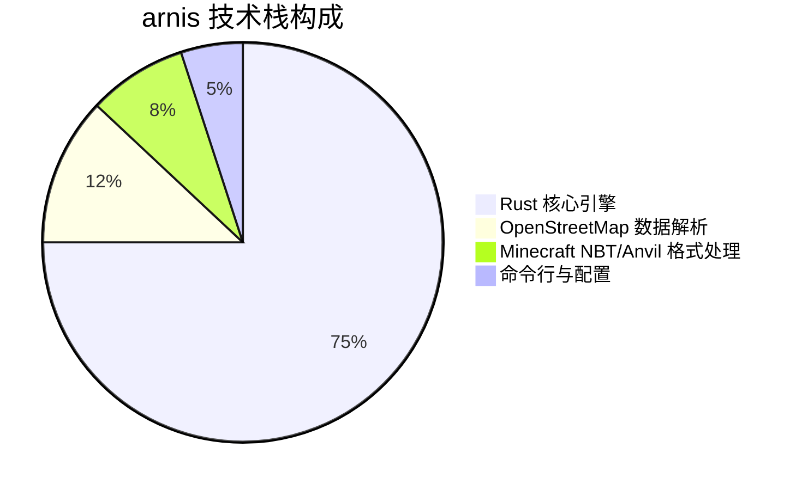
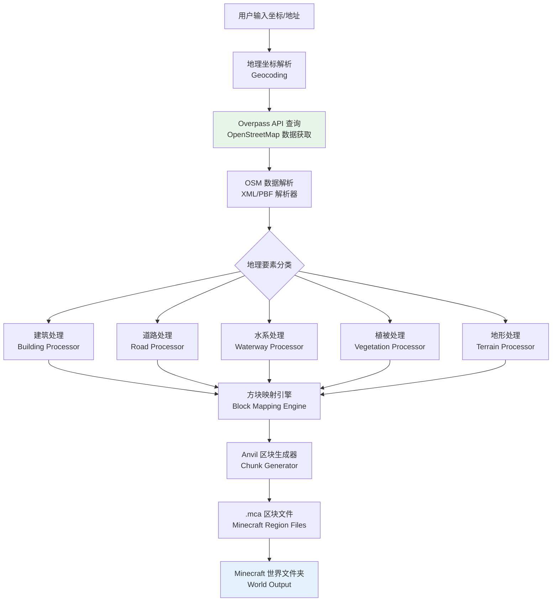
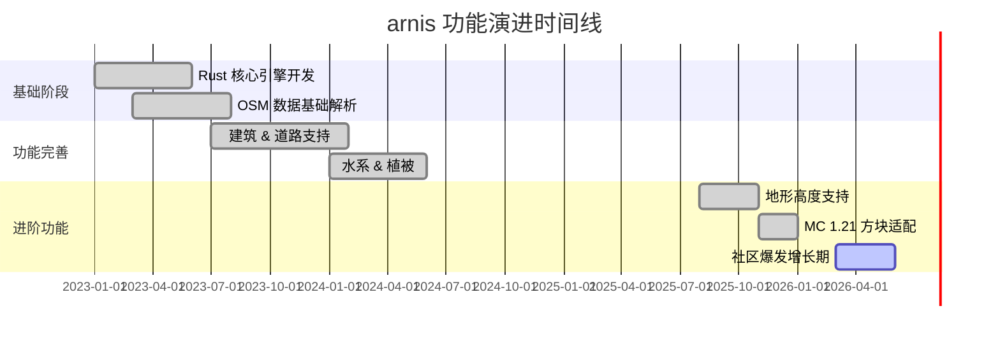

# louis-e/arnis

> 利用真实世界地理数据在 Minecraft 中高精度生成任意真实地点的地图工具，基于 OpenStreetMap 数据，以 Rust 语言编写，支持全球任意坐标的城市、建筑、道路、自然地貌精细重现。

## 项目概述

arnis 是一款使用 Rust 语言开发的开源工具，能够将现实世界中任意地理位置的真实地图数据转换为 Minecraft 世界地图，实现高度精细的地理重现。项目从 OpenStreetMap（OSM）获取矢量地理数据，结合 Minecraft 方块系统，将真实的建筑轮廓、道路网络、植被分布、水系地形等要素映射为对应的 Minecraft 方块结构。无论是纽约曼哈顿的密集街区、巴黎埃菲尔铁塔周边，还是东京的错综街道，都可以被高度还原为可探索的 Minecraft 地图，是 GIS 技术与游戏创意的精彩结合。

## 基本信息

| 字段 | 详情 |
|------|------|
| **项目名称** | arnis |
| **所有者** | louis-e |
| **Stars** | 12,527 ⭐ |
| **今日新增** | +583 ⭐ |
| **Forks** | 约 450+ |
| **主要语言** | Rust |
| **开源协议** | GPL-3.0 |
| **创建时间** | 2023 年 |
| **最近更新** | 2026-03-22 |
| **GitHub 链接** | [https://github.com/louis-e/arnis](https://github.com/louis-e/arnis) |
| **Topics** | minecraft、openstreetmap、gis、rust、map-generation、world-builder |

## 技术分析

### 技术栈

**核心技术依赖：**

| 技术层 | 具体技术 | 用途 |
|--------|---------|------|
| **编程语言** | Rust 1.70+ | 高性能、安全内存管理的核心逻辑 |
| **地理数据** | OpenStreetMap Overpass API | 获取实时全球地理矢量数据 |
| **地理解析** | `osm-xml` / 自研 OSM 解析器 | 解析 OSM XML/PBF 格式数据 |
| **地理计算** | `geo` crate | 多边形处理、坐标变换、空间计算 |
| **Minecraft 格式** | `anvil-region` / NBT 协议 | 生成 Minecraft Anvil 区块文件 |
| **坐标投影** | WGS84 → 墨卡托投影转换 | 将地理坐标映射到 Minecraft 坐标系 |
| **并发处理** | Rayon（数据并行）、Tokio（异步IO） | 大面积地图并行生成加速 |
| **CLI** | Clap | 命令行参数解析 |

### 架构设计

**核心技术亮点：**

1. **矢量到体素转换**：将 OSM 的矢量几何（多边形、线段、点）精确转换为 Minecraft 的离散方块（体素）坐标，需要处理坐标投影、比例缩放、抗锯齿等复杂问题。
2. **多边形填充算法**：建筑轮廓通常是不规则多边形，项目实现了高效的扫线填充算法，将建筑外墙和地板准确映射到方块网格。
3. **分层渲染**：按地物类型分层处理（地形→水系→道路→建筑→植被→装饰），避免遮挡问题。
4. **区块流式写入**：Minecraft 地图以 512×512 方块的 Region 文件存储，arnis 实现了流式区块生成，大幅降低内存峰值占用。
5. **Rust 高性能**：相较 Python 实现的同类工具，Rust 版本在大面积地图生成时速度提升 5-10 倍以上。

### 核心功能

| 功能 | 描述 |
|------|------|
| **全球任意位置支持** | 只需提供经纬度坐标，可生成地球上任意有 OSM 数据的地点 |
| **建筑精细重现** | 基于 OSM 建筑轮廓数据，生成准确的建筑外形，部分支持楼层高度 |
| **道路网络** | 区分不同等级道路（高速、主干道、小路、步行道），使用不同方块材质 |
| **水系地貌** | 河流、湖泊、海岸线、水库等水体准确还原 |
| **植被覆盖** | 公园、森林、草地等绿化区域的方块化呈现 |
| **地形高度** | 部分模式支持地形高差（依赖 DEM 数字高程数据） |
| **多 Minecraft 版本** | 支持 Minecraft Java Edition 1.18+ 方块格式 |
| **命令行友好** | 纯 CLI 工具，易于脚本化和批量处理 |
| **离线模式** | 支持预下载 OSM 数据后离线生成，适合网络受限环境 |

## 社区活跃度

### 贡献者分析

项目由 louis-e 独立创建并主导开发，是典型的个人开源项目通过高质量实现获得广泛认可的案例。主要贡献者构成：

- **louis-e**（核心维护者）：负责核心架构设计与主要功能开发
- 社区贡献者：主要提供 Bug 修复、新地物类型支持、文档翻译
- 部分 GIS 专业用户贡献了地理坐标处理的精度改进

今日 +583 Stars 的爆发式增长表明项目可能登上 GitHub Trending 首页或获得高流量分享，社区认知度正在快速提升。

### Issue/PR 活跃度

| 指标 | 情况 |
|------|------|
| **Issue 总数** | 150+ 个 |
| **主要问题类型** | 特定地区数据缺失、大面积生成性能、Minecraft 版本兼容性 |
| **PR 处理速度** | 较快，通常 1-5 天内响应 |
| **社区讨论** | Reddit r/Minecraft 和 r/openstreetmap 有活跃讨论 |
| **演示效果分享** | 用户在社交媒体大量分享自己城市的生成效果 |

### 最近动态

- **2026-03** 今日获得 +583 Stars 爆发增长，推测源于社交媒体病毒式传播或媒体报道
- **2026-02** 改善了大型建筑（如体育场、机场）的生成精度
- **2026-01** 新增对 Minecraft 1.21 新方块类型的支持
- **2025-12** 优化 Overpass API 查询策略，减少大面积生成时的 API 超时问题
- **2025-11** 添加地形高度支持（需 SRTM DEM 数据），使山地城市的地图更加真实
- **2025-10** 支持批量坐标生成，方便创作大型多城市地图作品

## 发展趋势

### 版本演进

### Roadmap

基于 Issues 讨论与项目方向，未来可能的发展方向：

1. **3D 建筑高度**：利用 OSM `building:levels` 标签自动生成多层建筑
2. **室内结构生成**：基于 OSM Indoor Mapping 数据生成建筑内部布局
3. **生物群系映射**：根据真实地理气候带自动设置 Minecraft 生物群系
4. **交互式预览**：生成前提供 Web 2D 预览，让用户确认生成范围
5. **Bedrock Edition 支持**：扩展支持 Minecraft 基岩版格式
6. **GPU 加速**：利用 GPU 并行计算加速大面积地图生成

### 社区反馈

项目在 Minecraft 创作者社区和 GIS 爱好者群体中获得高度认可：

- **YouTube/Bilibili**：大量创作者发布"在 Minecraft 里重现我的城市"视频，arnis 是主要使用工具之一
- **Reddit r/Minecraft**：多次登上热榜，评论区充满对生成效果的惊叹
- **教育领域**：被部分地理/城市规划教师用于教学演示，展示真实城市结构

## 竞品对比

| 项目/工具 | 语言 | Stars | 生成精度 | 性能 | 维护状态 |
|-----------|------|-------|----------|------|----------|
| **arnis** | Rust | 12,527 | ⭐⭐⭐⭐⭐ 高精度 OSM | ⭐⭐⭐⭐⭐ 极快 | 积极维护 |
| **WorldPainter** | Java | ~N/A（桌面应用）| ⭐⭐⭐ 手动绘制 | ⭐⭐⭐ 中等 | 活跃 |
| **Overviewer** | Python | ~3,000 | ⭐⭐⭐ 地图渲染器 | ⭐⭐ 较慢 | 维护中 |
| **mca-selector** | Java | ~2,000 | N/A（编辑工具）| ⭐⭐⭐⭐ | 活跃 |
| **chunker.app** | Web | 在线工具 | ⭐⭐⭐ 格式转换 | N/A | 商业 |
| **BlueMap** | Java | ~5,000 | 地图可视化 | ⭐⭐⭐⭐ | 活跃 |

arnis 在真实世界地图自动生成这一细分领域几乎没有同等质量的直接竞品，其最大竞争优势在于 Rust 的极致性能与 OSM 数据的全球覆盖能力。

## 总结评价

### 优势

1. **独特性极强**：真实世界→Minecraft 的自动生成工具中，arnis 是精度最高、性能最优的开源实现
2. **Rust 性能红利**：内存安全且高性能，大面积地图生成速度远超 Python 同类工具
3. **全球 OSM 数据支持**：依托 OpenStreetMap 全球 GIS 数据库，理论上可生成地球上任意有地图记录的地点
4. **零依赖安装**：Rust 编译为单一二进制文件，部署极为简便
5. **创意潜力巨大**：连接游戏与现实世界，激发创作者和玩家的强烈兴趣，天然具备病毒式传播属性

### 劣势

1. **依赖 OSM 数据质量**：数据稀疏地区（部分非洲、亚洲农村地区）的生成效果较差
2. **仅支持 Java Edition**：Minecraft 基岩版（移动端、主机端）暂不支持，限制受众范围
3. **室内细节缺失**：目前主要还原建筑外形，室内结构为空腔
4. **地形精度有限**：地势高差的处理需要额外 DEM 数据，默认生成地图较为平坦
5. **个人维护风险**：主要依赖单一维护者，持续维护的稳定性存在不确定性

### 适用场景

| 场景 | 适用性 | 说明 |
|------|--------|------|
| **城市规划可视化** | ⭐⭐⭐⭐⭐ | 将真实城市规划方案在 Minecraft 中展示 |
| **地理教育** | ⭐⭐⭐⭐⭐ | 让学生在游戏中探索真实地理环境 |
| **Minecraft 创作** | ⭐⭐⭐⭐⭐ | 创作者生成城市地图作为创作素材 |
| **游戏服务器** | ⭐⭐⭐⭐ | 建立基于真实城市的 Minecraft 服务器 |
| **GIS 学习** | ⭐⭐⭐ | 了解地理数据处理与坐标系统 |
| **专业 GIS 生产** | ⭐⭐ | 不适合替代专业 GIS 软件 |

**总体评分**：⭐⭐⭐⭐ (4/5)

arnis 是一个极具创意的跨领域开源项目，成功将地理信息系统与游戏世界连接起来，展示了 Rust 在地理数据处理领域的强大潜力。随着 OpenStreetMap 数据的持续丰富和 Minecraft 创作社区的增长，arnis 有望持续获得关注。对于希望在 Minecraft 中重现家乡城市的玩家，或需要可视化地理数据的教育工作者，arnis 是目前最优质的选择之一。

---
*报告生成时间: 2026-03-22 10:45:00*
*研究方法: GitHub API + Web搜索深度研究*
