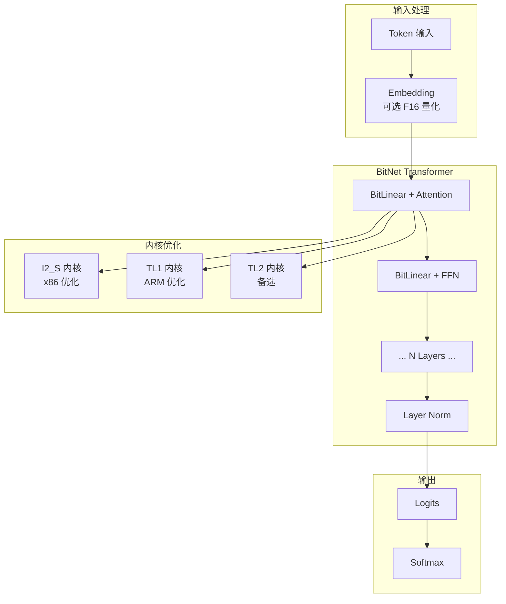
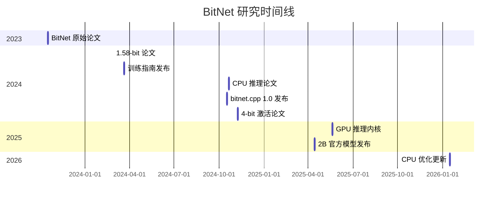

# microsoft/BitNet

> Official inference framework for 1-bit LLMs

## 项目概述

BitNet 是微软研究院开发的 1-bit 大语言模型官方推理框架。它采用三值权重（ternary weights）技术，将模型权重压缩到仅 {-1, 0, +1} 三个值，实现约 1.58-bit 的极致量化。这一突破性技术使得在普通 CPU 上运行 1000 亿参数的大模型成为可能，同时保持与全精度模型相当的性能。BitNet 代表了 LLM 量化的前沿方向，为边缘计算和资源受限场景开辟了新道路。

## 基本信息

| 指标 | 数值 |
|------|------|
| Stars | 34,985 |
| Forks | 2,987 |
| 语言 | Python / C++ |
| 开源协议 | MIT |
| Open Issues | 267 |
| 创建时间 | 2024-08-05 |
| 最近更新 | 2026-03-17 |
| GitHub | [microsoft/BitNet](https://github.com/microsoft/BitNet) |

### 语言分布

| 语言 | 代码行数 | 占比 |
|------|----------|------|
| Python | 428K | 50.4% |
| C++ | 391K | 46.1% |
| Shell | 25K | 2.9% |
| CMake | 3.2K | 0.4% |
| C | 3K | 0.4% |
| CUDA | 2.2K | 0.3% |

## 技术分析

### 核心原理：1.58-bit 量化

BitNet b1.58 的核心创新在于三值权重量化：

```mermaid
flowchart LR
    subgraph 传统模型
        W1[FP16/BF16 权重<br/>16 bits/参数]
        M1[矩阵乘法<br/>浮点运算]
        G1[GPU 必需]
    end
    
    subgraph BitNet
        W2[三值权重<br/>{-1, 0, +1}<br/>1.58 bits/参数]
        M2[整数加减运算<br/>无乘法]
        C2[CPU 可运行]
    end
    
    W1 --> M1 --> G1
    W2 --> M2 --> C2
```

#### BitLinear 层

BitNet 用 BitLinear 层替代标准线性层：

- **权重**: 使用 absmean 量化到 {-1, 0, +1}
- **激活值**: 使用 absmax 量化到 8-bit 整数
- **计算**: 整数加减运算，无需浮点乘法

```python
# 权重量化公式
W_quantized = clamp(W / γ, -1, 1) * sign(W)
# 其中 γ = mean(|W|)

# 激活量化公式
x_quantized = clamp(x / β, -Q, Q)
# 其中 Q = 2^(b-1) - 1, β = max(|x|)
```

### 架构设计



### 技术栈

| 组件 | 技术选型 |
|------|----------|
| 框架基础 | llama.cpp |
| 推理内核 | C++ + CUDA |
| 量化方法 | Lookup Table (T-MAC) |
| 模型格式 | GGUF |
| Python 接口 | Python 3.9+ |
| 构建系统 | CMake |

### 支持的模型

#### 官方模型

| 模型 | 参数量 | x86 内核 | ARM 内核 |
|------|--------|----------|----------|
| **BitNet-b1.58-2B-4T** | 2.4B | I2_S, TL2 | I2_S, TL1 |

#### 社区模型

| 模型 | 参数量 | 支持状态 |
|------|--------|----------|
| bitnet_b1_58-large | 0.7B | ✅ |
| bitnet_b1_58-3B | 3.3B | ✅ |
| Llama3-8B-1.58 | 8.0B | ✅ |
| Falcon3 Family | 1B-10B | ✅ |
| Falcon-E Family | 1B-3B | ✅ |

### 内核类型

| 内核 | 适用平台 | 特点 |
|------|----------|------|
| **I2_S** | x86/ARM | 通用实现，广泛支持 |
| **TL1** | ARM | ARM 优化，查表法 |
| **TL2** | x86 | x86 优化，查表法 |

## 性能基准

### CPU 性能提升

| 平台 | 模型大小 | 加速比 | 能耗降低 |
|------|----------|--------|----------|
| ARM CPU | 大模型 | 1.37x - 5.07x | 55.4% - 70.0% |
| x86 CPU | 大模型 | 2.37x - 6.17x | 71.9% - 82.2% |

### 关键里程碑

- **100B 模型单 CPU 运行**: 5-7 tokens/秒（接近人类阅读速度）
- **内存占用**: 0.4GB 工作集（2B 模型）
- **能耗**: 0.028J/inference

### 最新优化

2026年1月的优化引入并行内核实现：
- 可配置分块（tiling）
- Embedding 量化支持
- 额外加速：**1.15x - 2.1x**

## 社区活跃度

### 贡献者分析

| 指标 | 数值 |
|------|------|
| 总贡献者 | 15 |
| 企业背景 | 微软研究院 |
| 维护状态 | 活跃 |

### 研究论文时间线



### Issue/PR 活跃度

- **Open Issues**: 267
- **响应速度**: 微软官方维护
- **文档质量**: 完善的技术报告和优化指南

## 发展趋势

### 版本演进

1. **bitnet.cpp 1.0** (2024-10)
   - CPU 推理支持
   - 基础内核实现

2. **GPU 支持** (2025-05)
   - CUDA 内核
   - GPU 推理优化

3. **官方模型** (2025-04)
   - BitNet-b1.58-2B-4T
   - 4T tokens 训练

4. **性能优化** (2026-01)
   - 并行内核
   - Embedding 量化

### Roadmap 方向

1. **NPU 支持**
   - 神经处理单元适配
   - 边缘设备优化

2. **更大模型**
   - 7B+ 参数模型
   - 更多训练 tokens

3. **生态扩展**
   - 更多模型架构支持
   - 训练工具链

## 竞品对比

| 项目 | Stars | 量化方式 | CPU 推理 | 内存效率 |
|------|-------|----------|----------|----------|
| **BitNet** | 35K | 原生 1.58-bit | ✅ 优秀 | ⭐⭐⭐⭐⭐ |
| llama.cpp | 70K+ | 后训练量化 | ✅ 良好 | ⭐⭐⭐⭐ |
| GPTQ | 30K+ | 后训练量化 | ⚠️ 有限 | ⭐⭐⭐ |
| AWQ | 15K+ | 后训练量化 | ⚠️ 有限 | ⭐⭐⭐ |
| Ollama | 100K+ | 多种量化 | ✅ 良好 | ⭐⭐⭐⭐ |

### 核心差异化

1. **vs llama.cpp**
   - BitNet: 原生 1-bit 训练，极致效率
   - llama.cpp: 后训练量化，兼容性更好

2. **vs GPTQ/AWQ**
   - BitNet: 无需 GPU，CPU 友好
   - GPTQ/AWQ: 主要针对 GPU 优化

3. **vs Ollama**
   - BitNet: 2-3x 更快，3-5x 更省内存
   - Ollama: 易用性更好，模型支持更广

### 效率对比

| 指标 | BitNet | 量化 LLaMA | 全精度 LLaMA |
|------|--------|------------|--------------|
| 内存 | 1x | 3-5x | 10-20x |
| 速度 | 1x | 2-3x 慢 | 5-10x 慢 |
| 能耗 | 1x | 3-4x | 19-41x |
| 质量 | 相当 | 略降 | 基准 |

## 部署指南

### 安装要求

- Python >= 3.9
- CMake >= 3.22
- Clang >= 18
- Conda（推荐）

### 快速开始

```bash
# 克隆仓库
git clone --recursive https://github.com/microsoft/BitNet.git
cd BitNet

# 安装依赖
pip install -r requirements.txt

# 下载模型
huggingface-cli download microsoft/BitNet-b1.58-2B-4T-gguf \
  --local-dir models/BitNet-b1.58-2B-4T

# 构建并运行
python setup_env.py -md models/BitNet-b1.58-2B-4T -q i2_s
python run_inference.py -m models/BitNet-b1.58-2B-4T/ggml-model-i2_s.gguf \
  -p "You are a helpful assistant" -cnv
```

### 性能测试

```bash
python utils/e2e_benchmark.py -m /path/to/model -n 200 -p 256 -t 4
```

## 适用场景

### 最佳场景

1. **边缘设备部署**
   - 嵌入式系统
   - 移动设备
   - IoT 设备

2. **资源受限环境**
   - 无 GPU 环境
   - 低内存设备
   - 能耗敏感场景

3. **大规模部署**
   - 成本优化
   - 能耗优化
   - 密度优化

### 不适用场景

1. **追求最高质量**: 全精度模型仍有优势
2. **GPU 充足环境**: 传统量化可能更简单
3. **模型多样性需求**: 支持的模型有限

## 总结评价

### 优势

- **极致效率**: 1.58-bit 量化，内存和能耗大幅降低
- **CPU 友好**: 无需 GPU，普通 CPU 即可运行大模型
- **质量保持**: 与全精度模型性能相当
- **微软背书**: 官方维护，研究论文支撑
- **开源免费**: MIT 协议，完全开放

### 劣势

- **模型有限**: 支持的模型数量较少
- **训练成本**: 需要从头训练，不能直接量化现有模型
- **生态不成熟**: 工具链和社区相对较小
- **特定场景**: 主要适合 CPU 推理，GPU 场景优势不明显

### 适用场景

1. **边缘 AI 开发者**: 需要在资源受限设备部署 LLM
2. **成本敏感企业**: 需要降低推理成本
3. **研究人员**: 研究 1-bit LLM 技术
4. **隐私优先场景**: 本地运行，数据不出设备

### 推荐指数

| 用户类型 | 推荐度 |
|----------|--------|
| 边缘 AI 开发者 | ⭐⭐⭐⭐⭐ |
| 成本优化团队 | ⭐⭐⭐⭐⭐ |
| 研究人员 | ⭐⭐⭐⭐ |
| 通用 LLM 用户 | ⭐⭐⭐ (模型有限) |
| GPU 充足用户 | ⭐⭐⭐ |

---
*报告生成时间: 2026-03-17*
*研究方法: github-deep-research 多轮深度分析*
*数据来源: GitHub API, Web Search, arXiv 论文*
