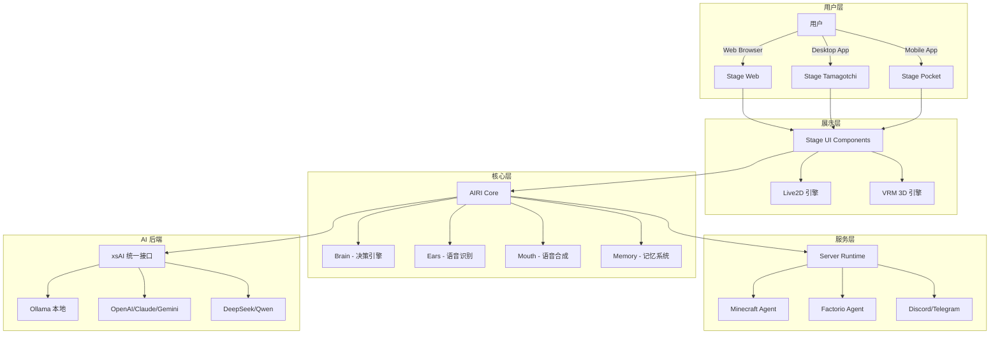
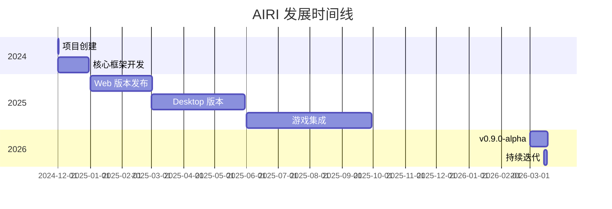

# moeru-ai/airi

> 💖🧸 Self hosted, you-owned Grok Companion, a container of souls of waifu, cyber livings to bring them into our worlds, wishing to achieve Neuro-sama's altitude. Capable of realtime voice chat, Minecraft, Factorio playing.

## 项目概述

AIRI（アイリ）是一个开源的 AI 虚拟伴侣项目，灵感来源于著名的 AI VTuber Neuro-sama。与传统的聊天机器人不同，AIRI 是一个"数字生命容器"，能够实时语音对话、玩游戏（Minecraft、Factorio）、支持 Live2D/VRM 虚拟形象，并且可以在浏览器、桌面和移动设备上运行。项目以超过 3.4 万 Stars 成为 GitHub 上最受欢迎的开源 AI VTuber 项目之一，代表了"Own Your Data"（数据自主）运动在 AI 伴侣领域的重要实践。

## 基本信息

| 指标 | 数值 |
|------|------|
| Stars | 34,177 |
| Forks | 3,397 |
| 语言 | TypeScript |
| 开源协议 | MIT |
| Open Issues | 125 |
| 创建时间 | 2024-12-01 |
| 最近更新 | 2026-03-17 |
| 最新版本 | v0.9.0-alpha.16 |
| GitHub | [moeru-ai/airi](https://github.com/moeru-ai/airi) |

### 语言分布

| 语言 | 代码行数 | 占比 |
|------|----------|------|
| TypeScript | 2.75M | 59.3% |
| Vue | 1.73M | 37.2% |
| JavaScript | 71K | 1.5% |
| Rust | 59K | 1.3% |
| CSS | 39K | 0.8% |
| 其他 | 31K+ | 0.7% |

### Topics 标签

`ai-companion`, `ai-vtuber`, `clawdbot`, `digital-life`, `grok-companion`, `live2d`, `moltbot`, `neuro-sama`, `neurosama`, `vrm`, `vtuber`

## 技术分析

### 架构设计

AIRI 采用模块化的多平台架构，核心组件包括 Stage（前端展示层）、Core（核心逻辑层）和 Server Runtime（服务运行时）：



### 技术栈亮点

1. **Web 技术优先**
   - WebGPU：GPU 加速渲染
   - WebAudio：实时音频处理
   - Web Workers：多线程计算
   - WebAssembly：高性能组件
   - WebSocket：实时通信

2. **跨平台支持**
   - Web（PWA）：浏览器直接访问
   - Desktop（Tauri）：Windows/macOS/Linux 原生应用
   - Mobile（Capacitor）：iOS/Android 支持

3. **游戏集成**
   - Minecraft：通过 Mineflayer 库
   - Factorio：通过 RCON API 和自定义 mod

### 核心功能模块

| 模块 | 功能 | 状态 |
|------|------|------|
| Brain | 决策和任务规划 | ✅ 完成 |
| Ears | 语音输入和识别 | ✅ 完成 |
| Mouth | 语音合成输出 | ✅ 完成 |
| Body | Live2D/VRM 形象 | ✅ 完成 |
| Memory | 长期记忆系统 | 🔄 WIP |
| Game Playing | Minecraft/Factorio | ✅ 完成 |

## 社区活跃度

### 贡献者分析

- **贡献者数量**：100+
- **主要贡献者**：nekomeowww（核心开发者）
- **贡献分布**：活跃的开源社区，持续迭代

### Issue/PR 活跃度

- **Open Issues**: 125
- **响应速度**：活跃维护，频繁更新
- **文档质量**：完善的官方文档和开发指南

### 最近动态

**版本更新节奏**：
- v0.9.0-alpha.16 (2026-03-14)
- v0.8.5-beta.3 (2026-02-26)
- DevLog 持续发布

**开发日志**：
- DevLog @ 2026.03.14
- DevLog @ 2026.02.16
- DevLog @ 2026.01.01

## 发展趋势

### 版本演进



### 增长数据

- **Stars 增长**：从 0 到 3.4 万约 15 个月
- **Fork 增长**：3,397 Fork
- **社区规模**：100+ 贡献者

### Roadmap 方向

1. **记忆系统完善**
   - Memory Alaya（WIP）
   - 纯浏览器端数据库支持

2. **本地推理**
   - WebGPU 本地模型推理
   - 减少对云端 API 依赖

3. **生态扩展**
   - 更多游戏支持
   - 插件系统完善

## 竞品对比

| 项目 | Stars | 语言 | 特点 | 开源 | 游戏支持 |
|------|-------|------|------|------|----------|
| **AIRI** | 34K | TypeScript | Web 优先、跨平台 | ✅ | Minecraft/Factorio |
| Neuro-sama | N/A | N/A | 最成熟的 AI VTuber | ❌ | 多游戏 |
| eliza | 50K+ | TypeScript | Agent 框架 | ✅ | 有限 |
| amica | 10K+ | TypeScript | VRM/WebXR | ✅ | 有限 |
| z-waif | 5K+ | Python | 游戏能力强 | ✅ | 多游戏 |
| AI-Waifu-Vtuber | 3K+ | Python | Twitch 集成 | ✅ | 有限 |

### 核心差异化

1. **vs Neuro-sama**
   - AIRI: 开源、自托管、数据自主
   - Neuro-sama: 闭源、仅直播时可交互

2. **vs eliza**
   - AIRI: 专注虚拟形象和游戏交互
   - eliza: 通用 Agent 框架

3. **vs SillyTavern**
   - AIRI: 游戏集成、实时语音、应用感知
   - SillyTavern: 文本对话为主

## 支持的 LLM 提供商

AIRI 通过 xsai 库支持几乎所有主流 LLM 提供商：

| 类别 | 提供商 |
|------|--------|
| 国际 | OpenAI, Anthropic Claude, Google Gemini, xAI, Mistral |
| 国内 | DeepSeek, Qwen, Zhipu, SiliconFlow, Moonshot, Minimax |
| 本地 | Ollama, vLLM, SGLang |
| 其他 | OpenRouter, Groq, Together.ai, Fireworks, Cloudflare |

## 部署指南

### Web 版本

访问 [airi.moeru.ai](https://airi.moeru.ai) 即可使用

### Desktop 版本

```bash
# Windows (Scoop)
scoop bucket add airi https://github.com/moeru-ai/airi
scoop install airi/airi

# macOS/Linux (Nix)
nix run github:moeru-ai/airi
```

### 开发环境

```bash
pnpm i
pnpm dev              # Web 版本
pnpm dev:tamagotchi   # Desktop 版本
```

## 适用场景

### 最佳场景

1. **AI VTuber 直播**
   - 虚拟主播
   - 互动直播
   - 游戏直播

2. **个人 AI 伴侣**
   - 日常对话
   - 游戏陪伴
   - 编程助手

3. **开发者研究**
   - AI Agent 研究
   - WebGPU 应用
   - 跨平台开发

### 不适用场景

1. **企业级生产环境**：仍在 alpha 阶段
2. **纯文本对话**：有更轻量的选择
3. **非技术用户**：配置有一定门槛

## 总结评价

### 优势

- **开源自主**：完全自托管，数据隐私有保障
- **跨平台**：Web/Desktop/Mobile 全覆盖
- **技术先进**：WebGPU、WebAudio 等现代技术栈
- **游戏集成**：Minecraft、Factorio 等游戏支持
- **生态丰富**：30+ LLM 提供商支持
- **社区活跃**：100+ 贡献者，持续迭代

### 劣势

- **早期阶段**：仍为 alpha 版本
- **配置复杂**：功能丰富带来配置门槛
- **资源消耗**：桌面版需要一定资源
- **记忆系统**：长期记忆仍在开发中

### 适用场景

1. **AI VTuber 爱好者**：想要自己的虚拟主播
2. **开发者**：研究 AI Agent 和 Web 技术
3. **隐私倡导者**：需要数据自主的用户
4. **游戏玩家**：想要 AI 陪伴游戏

### 推荐指数

| 用户类型 | 推荐度 |
|----------|--------|
| AI VTuber 爱好者 | ⭐⭐⭐⭐⭐ |
| 开发者/研究者 | ⭐⭐⭐⭐⭐ |
| 个人用户 | ⭐⭐⭐⭐ |
| 企业用户 | ⭐⭐⭐ (早期阶段) |
| 非技术用户 | ⭐⭐⭐ (需学习配置) |

---
*报告生成时间: 2026-03-17*
*研究方法: github-deep-research 多轮深度分析*
*数据来源: GitHub API, Web Search, 官方文档*
